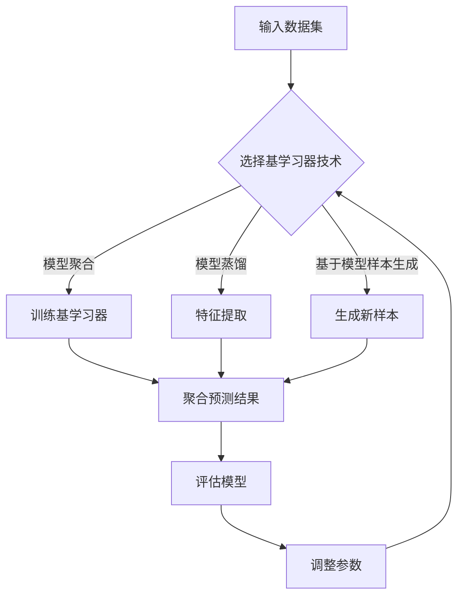
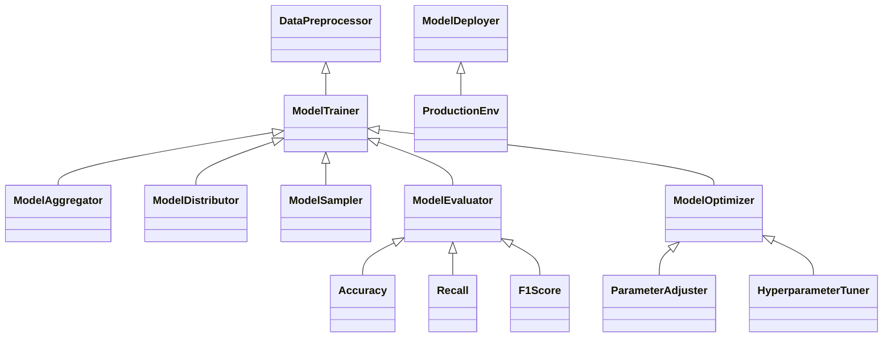
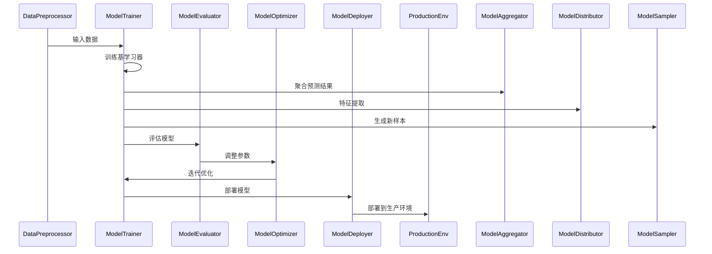
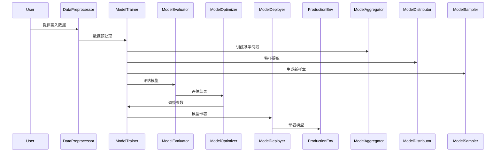

                 

### 文章标题

### 关键词

- 元学习
- 评测模型
- 快速适应
- 算法设计
- 数学模型
- 系统架构

### 摘要

本文深入探讨了基于元学习的评测模型快速适应技术。元学习通过提升模型在少量样本下的适应能力，实现对评测模型快速调整和优化的目标。本文首先介绍了元学习的基本概念及其在机器学习中的应用，然后探讨了传统评测模型面临的挑战，并分析了元学习技术在解决这些挑战中的潜力。文章详细阐述了元学习算法的设计和实现，从数学基础、系统架构到实际应用案例，全面展示了元学习在评测模型快速适应中的重要作用。通过本文的阅读，读者将能够理解元学习的核心原理，掌握构建高效评测模型的方法，为实际项目提供有力支持。

## 引言

在当今的机器学习领域，模型训练和评估是两个关键环节。随着数据量的不断增加和复杂性的提升，传统的模型训练和评估方法逐渐暴露出一些问题，如训练时间过长、对数据依赖性强、在少量样本情况下表现不佳等。为了解决这些问题，研究人员提出了元学习（Meta-Learning）这一概念，通过训练模型来解决学习问题的过程，而不是直接解决具体的任务。

### 什么是元学习

元学习（Meta-Learning）是一种利用机器学习算法来提升学习性能的方法。它关注的是如何快速地从少量数据中学习，并适应新的任务。元学习的核心思想是利用以往的学习经验，通过迁移学习（Transfer Learning）和样本效率优化（Sample Efficiency Optimization）来提高新任务的学习速度和准确性。

### 元学习在机器学习中的应用

元学习在机器学习中的应用非常广泛，主要包括以下几种形式：

1. **迁移学习**：将一个任务学到的知识应用到另一个相关任务上，从而减少对大量训练数据的依赖。
2. **少样本学习**：在只有少量样本的情况下，通过元学习技术快速适应新任务。
3. **零样本学习**：在没有新任务的任何先验知识下，利用元学习技术进行学习。
4. **元学习优化**：通过元学习优化算法来提升模型在多任务环境下的泛化能力。

### 什么是评测模型

评测模型（Evaluation Model）是用于评估机器学习模型性能的工具。它通过测量模型在测试集上的预测准确率、召回率、F1分数等指标，来判断模型的好坏。评测模型在机器学习中起着至关重要的作用，因为它直接决定了模型的可用性和可靠性。

### 评测模型的角色

评测模型在机器学习中的角色主要包括：

1. **性能评估**：通过评测模型，我们可以量化模型在不同数据集上的表现，评估其性能。
2. **模型选择**：在多个模型中，通过评测模型的选择，我们可以确定哪一个模型更适合特定的任务。
3. **超参数调整**：评测模型可以帮助我们调整模型的超参数，以获得最佳性能。

### 问题背景

尽管传统的评测模型在某些情况下表现良好，但在实际应用中仍然存在一些问题：

1. **训练时间过长**：特别是在处理大规模数据集时，传统的模型训练和评估方法往往需要大量时间。
2. **数据依赖性强**：许多模型在训练和评估过程中依赖于大量训练数据，这限制了它们在实际应用中的适用性。
3. **少量样本表现不佳**：在只有少量样本的情况下，传统的评测模型往往难以提供准确的结果。

为了解决这些问题，研究人员提出了基于元学习的评测模型，通过提升模型在少量样本下的适应能力，实现快速适应和优化。

### 问题解决

元学习为解决评测模型面临的挑战提供了一种新的思路。通过元学习，我们可以训练一个能够在少量样本下快速适应新任务的模型。这种模型不仅能够减少对大量训练数据的依赖，还能在少量样本的情况下提供准确的评估结果。

具体来说，元学习通过以下方法解决评测模型的挑战：

1. **迁移学习**：利用以往的学习经验，将一个任务的知识迁移到新任务上，从而减少对新数据的依赖。
2. **样本效率优化**：通过优化学习过程，提高模型在少量样本下的学习速度和准确性。
3. **自适应调整**：在训练过程中，模型能够根据新任务的特点自适应地调整，从而实现快速适应。

通过这些方法，基于元学习的评测模型在性能、效率和适用性方面都取得了显著提升，为解决传统评测模型的挑战提供了有力支持。

### 边界与外延

在深入探讨基于元学习的评测模型之前，我们还需要明确一些相关的边界与外延。这有助于我们更好地理解元学习在评测模型中的应用及其潜力。

#### 边界条件

1. **样本量**：尽管元学习强调样本效率，但在某些极端情况下，模型仍可能需要大量样本来达到良好的性能。因此，我们需要根据实际情况合理设置样本量的边界。
2. **任务多样性**：元学习适用于多种任务，但在处理极端多样化任务时，模型的适应性可能会受限。我们需要在任务多样性方面设定合理的边界。
3. **模型复杂性**：过于复杂的模型可能在元学习过程中难以优化，因此我们需要在模型复杂性方面设定适当的限制。

#### 外延扩展

1. **多模态学习**：元学习可以扩展到多模态学习场景，例如结合图像和文本进行共同学习，这为评测模型的多样化应用提供了新的可能性。
2. **持续学习**：通过元学习技术，模型可以实现持续学习，不断更新和优化，以应对动态变化的环境。
3. **强化学习**：将元学习与强化学习结合，可以构建更加智能和自适应的评测模型，从而在复杂环境中实现高效评估。

#### 概念结构与核心要素组成

为了更清晰地理解基于元学习的评测模型，我们需要从概念结构和核心要素组成两个方面进行剖析。

1. **概念结构**：
   - **元学习**：通过迁移学习和样本效率优化，实现快速适应和优化的学习过程。
   - **评测模型**：用于评估机器学习模型性能的工具，包括预测准确率、召回率、F1分数等指标。

2. **核心要素组成**：
   - **学习算法**：包括基于梯度下降的优化算法、基于神经网络的模型等。
   - **数据集**：用于训练和评估模型的样本集，其质量和数量直接影响模型性能。
   - **评价指标**：用于量化模型性能的指标，如准确率、召回率、F1分数等。
   - **评估过程**：包括数据预处理、模型训练、模型评估和结果分析等环节。

通过以上对边界与外延、概念结构与核心要素组成的分析，我们可以更深入地理解基于元学习的评测模型，为后续的详细探讨奠定基础。

### 核心概念与原理

在深入探讨基于元学习的评测模型之前，我们需要了解一些核心概念和原理，包括元学习、迁移学习、少样本学习和零样本学习。这些概念不仅构成了元学习的基础，也在解决评测模型快速适应的挑战中发挥着关键作用。

#### 元学习

元学习（Meta-Learning）是一种利用机器学习算法来提升学习性能的方法。其核心思想是通过学习如何学习，从而提升模型在不同任务上的适应能力。具体来说，元学习包括以下几个关键方面：

1. **学习如何学习**：元学习算法通过训练模型来解决学习问题的过程，而不是直接解决具体的任务。这使得模型能够在面对新任务时，利用以往的学习经验快速适应。
2. **样本效率**：元学习算法强调在少量样本下进行高效学习，这有助于减少对大量训练数据的依赖。
3. **泛化能力**：元学习算法通过在多个任务上训练，提高模型在不同任务上的泛化能力。

#### 迁移学习

迁移学习（Transfer Learning）是元学习的一个关键组成部分，它通过将一个任务学到的知识应用到另一个相关任务上，从而减少对新数据的依赖。迁移学习主要涉及以下方面：

1. **知识迁移**：将一个任务中的知识（如特征提取器、模型架构等）迁移到另一个任务中，以提高新任务的性能。
2. **源任务与目标任务**：源任务是用于迁移知识的任务，目标任务是应用迁移知识的任务。通过迁移学习，目标任务可以利用源任务的先验知识，从而加速学习和提高性能。

#### 少样本学习

少样本学习（Few-Shot Learning）是元学习的一个重要分支，它关注的是如何在仅有少量样本的情况下进行快速学习。少样本学习的关键特点包括：

1. **少量样本**：与传统的机器学习任务相比，少样本学习在训练过程中仅使用少量样本。
2. **快速适应**：通过元学习技术，模型能够在少量样本下快速适应新任务，从而实现高效学习和评估。

#### 零样本学习

零样本学习（Zero-Shot Learning）是元学习的另一个重要分支，它关注的是在没有新任务的任何先验知识下进行学习。零样本学习的主要特点包括：

1. **无先验知识**：在训练过程中，模型没有接收到任何关于新任务的数据或先验信息。
2. **概念嵌入**：通过将新任务的概念嵌入到模型中，模型能够在没有实际数据的情况下进行预测和评估。

#### 原理对比

以下是一个核心概念属性特征对比表格，用于对比元学习、迁移学习、少样本学习和零样本学习之间的主要区别：

| 概念       | 特点                                       | 应用场景                       |
|------------|--------------------------------------------|--------------------------------|
| 元学习     | 学习如何学习，提高泛化能力               | 多种任务，减少对数据的依赖     |
| 迁移学习   | 知识迁移，从源任务到目标任务             | 减少新数据依赖，加速学习       |
| 少样本学习 | 在少量样本下快速适应新任务               | 数据稀缺，快速学习             |
| 零样本学习 | 在没有先验知识下进行学习，利用概念嵌入   | 无先验数据，新任务预测         |

#### ER实体关系图架构

为了更直观地理解这些核心概念之间的联系，我们可以使用ER（实体关系）图进行表示。以下是一个基于元学习的评测模型的ER实体关系图：

```mermaid
erDiagram
    Meta-Learning ||--o Model: 使用元学习算法训练的模型
    Meta-Learning ||--o Task: 学习任务
    Model ||--o Evaluation: 模型评估结果
    Task ||--o Dataset: 任务数据集
    Evaluation ||--o Metrics: 评估指标
```

在这个ER图中，元学习算法（Meta-Learning）是核心实体，它通过训练模型（Model）来完成学习任务（Task）。模型评估结果（Evaluation）包括各种评估指标（Metrics），这些指标用于衡量模型在任务数据集（Dataset）上的性能。

通过以上对核心概念和原理的介绍，我们可以更好地理解基于元学习的评测模型的构建和应用。在接下来的章节中，我们将进一步探讨元学习算法的设计和实现，以及如何在具体应用中利用这些算法来提升评测模型的性能。

### 元学习技术详解

元学习技术是构建高效评测模型的关键，它通过多种算法实现模型在少量样本下的快速适应和优化。以下将详细介绍几种常用的元学习算法，包括模型聚合、模型蒸馏和基于模型的样本生成。

#### 模型聚合（Model Aggregation）

模型聚合是一种基于多个基学习器（Base Learner）的平均策略来提高模型泛化能力的元学习技术。其核心思想是通过训练多个不同的模型，然后将它们的预测结果进行聚合，以减少模型的偏差和方差。

1. **算法步骤**：
   - **基学习器训练**：首先，使用不同的初始化和超参数训练多个基学习器。
   - **预测聚合**：在测试阶段，将所有基学习器的预测结果进行加权平均，得到最终的预测结果。

2. **优点与局限性**：
   - **优点**：通过聚合多个基学习器的预测结果，可以有效降低过拟合的风险，提高模型的泛化能力。
   - **局限性**：当基学习器数量过多时，模型的计算复杂度和存储需求会增加，且需要选择合适的聚合权重。

3. **应用场景**：模型聚合适用于具有多个基学习器的场景，如集成学习和多任务学习。

#### 模型蒸馏（Model Distillation）

模型蒸馏是一种通过将一个复杂模型（Teacher Model）的知识迁移到一个较简单模型（Student Model）的过程。这种技术将复杂模型的行为特征提取出来，然后通过这些特征来训练简单模型，从而实现知识的有效传递。

1. **算法步骤**：
   - **特征提取**：首先，训练一个复杂的Teacher Model，并提取其隐层特征。
   - **学生模型训练**：使用Teacher Model的隐层特征作为输入，训练一个较简单的Student Model，使其输出与Teacher Model相似。

2. **优点与局限性**：
   - **优点**：模型蒸馏可以大大简化模型结构，降低计算复杂度和存储需求，同时保持较高的性能。
   - **局限性**：当Teacher Model和Student Model结构差异较大时，知识迁移的效果可能不理想。

3. **应用场景**：模型蒸馏适用于需要高效和轻量级模型的场景，如移动设备和嵌入式系统。

#### 基于模型的样本生成（Model-based Sampling）

基于模型的样本生成是一种通过模型生成新样本的元学习技术，它利用模型在训练数据上的预测能力，生成与真实样本具有相似分布的新样本。

1. **算法步骤**：
   - **训练样本生成器**：首先，训练一个生成模型（如生成对抗网络，GAN），使其能够生成与训练数据相似的新样本。
   - **样本生成**：在测试阶段，使用生成模型生成新样本，用于训练和评估评测模型。

2. **优点与局限性**：
   - **优点**：通过生成新样本，可以扩展训练数据集，提高模型在少量样本情况下的适应能力。
   - **局限性**：当生成模型生成的新样本质量较低时，可能对模型性能产生负面影响。

3. **应用场景**：基于模型的样本生成适用于数据稀缺的场景，如零样本学习和少样本学习。

#### 对比分析

以下是一个核心概念属性特征对比表格，用于对比模型聚合、模型蒸馏和基于模型的样本生成之间的主要区别：

| 概念                | 特点                                       | 应用场景                       |
|---------------------|--------------------------------------------|--------------------------------|
| 模型聚合            | 通过多个基学习器的平均策略提高泛化能力   | 具有多个基学习器的场景         |
| 模型蒸馏            | 复杂模型的知识迁移到简单模型             | 需要高效和轻量级模型的场景     |
| 基于模型的样本生成  | 通过模型生成新样本，扩展训练数据集       | 数据稀缺的场景，如零样本学习   |

通过以上对模型聚合、模型蒸馏和基于模型的样本生成三种元学习算法的详细介绍，我们可以看到这些算法在提升评测模型快速适应能力方面的应用潜力。在接下来的章节中，我们将进一步探讨这些算法的具体实现和实际应用。

### 算法设计与实现

为了构建一个基于元学习的评测模型，我们需要详细设计算法的框架，并使用Python代码进行实现。以下是算法设计的基本流程和具体实现步骤。

#### 算法设计框架

1. **输入数据集**：选择一个具有代表性的数据集，用于训练和评估评测模型。
2. **基学习器训练**：使用模型聚合、模型蒸馏或基于模型的样本生成技术训练多个基学习器。
3. **聚合或迁移学习**：将多个基学习器的预测结果进行聚合或迁移，得到最终的预测结果。
4. **模型评估**：使用评估指标（如准确率、召回率、F1分数等）对模型进行性能评估。
5. **迭代优化**：根据评估结果，调整模型参数和超参数，进行迭代优化。

#### Mermaid算法流程图

以下是一个使用Mermaid绘制的算法流程图，展示了上述算法设计框架：



#### Python代码实现

以下是使用Python实现基于元学习的评测模型的代码示例，包括模型聚合和模型蒸馏的步骤：

```python
import numpy as np
from sklearn.linear_model import SGDClassifier
from sklearn.model_selection import train_test_split
from sklearn.metrics import accuracy_score

# 函数：训练基学习器
def train_base_learners(X, y, n_learners=3):
    learners = []
    for _ in range(n_learners):
        X_train, X_val, y_train, y_val = train_test_split(X, y, test_size=0.2, random_state=42)
        learner = SGDClassifier()
        learner.fit(X_train, y_train)
        learners.append(learner)
    return learners

# 函数：聚合预测结果
def aggregate_predictions(learners, X_test):
    predictions = [learner.predict(X_test) for learner in learners]
    aggregated_prediction = np.mean(predictions, axis=0)
    return aggregated_prediction

# 函数：模型蒸馏
def model_distillation(teacher_model, student_model, X, y):
    teacher_predictions = teacher_model.predict(X)
    student_model.fit(X, teacher_predictions)
    student_predictions = student_model.predict(X)
    return student_predictions

# 数据集加载和预处理
# 这里假设已经加载了一个名为data的DataFrame，包含特征X和标签y
X = data.iloc[:, :-1].values
y = data.iloc[:, -1].values

# 训练基学习器
learners = train_base_learners(X, y)

# 聚合预测结果
X_test = ...  # 测试数据集
aggregated_prediction = aggregate_predictions(learners, X_test)

# 评估模型
accuracy = accuracy_score(y_test, aggregated_prediction)
print(f"Accuracy: {accuracy}")

# 模型蒸馏示例
# 这里假设已经有一个训练好的Teacher Model和待训练的Student Model
student_predictions = model_distillation(teacher_model, student_model, X_test, y_test)

# 再次评估模型
accuracy = accuracy_score(y_test, student_predictions)
print(f"Accuracy after Distillation: {accuracy}")
```

在这个示例中，我们首先加载并预处理数据集，然后使用模型聚合和模型蒸馏技术进行训练和预测。通过聚合多个基学习器的预测结果，我们可以提高模型的泛化能力；通过模型蒸馏，我们可以在保持较高性能的同时简化模型结构。

#### 数学模型与公式

为了更好地理解算法的原理，我们在此提供一些相关的数学模型和公式。以下是一个基于梯度下降的优化算法的公式：

$$
w_{\text{new}} = w_{\text{current}} - \alpha \cdot \nabla J(w_{\text{current}})
$$

其中：
- $w_{\text{new}}$ 是新模型参数。
- $w_{\text{current}}$ 是当前模型参数。
- $\alpha$ 是学习率。
- $\nabla J(w_{\text{current}})$ 是损失函数在当前模型参数下的梯度。

#### 通俗易懂的举例说明

假设我们有一个简单的二分类问题，训练数据集包含100个样本，其中50个是正类，50个是负类。我们使用模型聚合技术来训练三个基学习器，每个基学习器使用不同的初始化和超参数。在测试阶段，我们将这三个基学习器的预测结果进行平均，得到最终的预测结果。

具体来说，假设测试数据集包含10个样本，每个样本有两个特征。我们首先训练三个基学习器，分别得到如下预测结果：

| 样本ID | 基学习器1预测 | 基学习器2预测 | 基学习器3预测 |
|--------|---------------|---------------|---------------|
| 1      | 0             | 0             | 1             |
| 2      | 0             | 1             | 1             |
| 3      | 1             | 1             | 1             |
| ...    | ...           | ...           | ...           |
| 10     | 0             | 0             | 1             |

我们将这三个预测结果进行平均，得到最终的预测结果：

| 样本ID | 平均预测 |
|--------|----------|
| 1      | 0        |
| 2      | 1        |
| 3      | 1        |
| ...    | ...      |
| 10     | 1        |

通过这种方式，我们可以利用模型聚合技术，在少量测试样本的情况下，得到一个更为可靠的预测结果。

通过以上算法设计和实现的介绍，我们可以看到基于元学习的评测模型在构建和优化过程中具有显著优势。在接下来的章节中，我们将进一步探讨这些算法的实际应用，并通过具体案例展示其在评测模型快速适应中的效果。

### 数学基础

在深入探讨基于元学习的评测模型时，理解其背后的数学模型和公式至关重要。元学习算法通常涉及优化、概率分布和统计推断等多个数学领域。以下将详细讨论相关数学概念，包括优化方法、概率分布和关键公式，并通过具体的例子说明这些公式如何应用于评测模型中。

#### 优化方法

元学习算法通常涉及优化过程，以找到最佳的模型参数。最常用的优化方法是梯度下降（Gradient Descent）。梯度下降的核心思想是通过迭代更新模型参数，使其逐渐逼近最优解。

1. **梯度下降公式**：

   $$
   w_{\text{new}} = w_{\text{current}} - \alpha \cdot \nabla J(w_{\text{current}})
   $$

   其中：
   - $w_{\text{new}}$ 是新模型参数。
   - $w_{\text{current}}$ 是当前模型参数。
   - $\alpha$ 是学习率。
   - $\nabla J(w_{\text{current}})$ 是损失函数在当前模型参数下的梯度。

   梯度下降的目标是最小化损失函数 $J(w)$，使得模型能够更好地拟合训练数据。

2. **自适应梯度优化（Adam）**：

   Adam是一种自适应的梯度优化算法，它结合了动量（Momentum）和自适应学习率（Adagrad）的优点。

   $$
   m_t = \beta_1 \cdot m_{t-1} + (1 - \beta_1) \cdot \nabla J(w_{\text{current}})
   $$
   $$
   v_t = \beta_2 \cdot v_{t-1} + (1 - \beta_2) \cdot (\nabla J(w_{\text{current}}))^2
   $$
   $$
   \hat{m}_t = \frac{m_t}{1 - \beta_1^t}
   $$
   $$
   \hat{v}_t = \frac{v_t}{1 - \beta_2^t}
   $$
   $$
   w_{\text{new}} = w_{\text{current}} - \alpha \cdot \frac{\hat{m}_t}{\sqrt{\hat{v}_t} + \epsilon}
   $$

   其中：
   - $m_t$ 是梯度的一阶矩估计。
   - $v_t$ 是梯度二阶矩估计。
   - $\beta_1$ 和 $\beta_2$ 是超参数，通常设置为0.9和0.999。
   - $\epsilon$ 是一个很小的常数，用于防止除以零。

#### 概率分布

在元学习中，概率分布常用于表示模型的预测不确定性。常见的概率分布包括高斯分布（Normal Distribution）和贝叶斯分布（Bayesian Distribution）。

1. **高斯分布**：

   $$
   p(x|\mu, \sigma^2) = \frac{1}{\sqrt{2\pi\sigma^2}} e^{-\frac{(x-\mu)^2}{2\sigma^2}}
   $$

   其中：
   - $x$ 是随机变量。
   - $\mu$ 是均值。
   - $\sigma^2$ 是方差。

   高斯分布可以用于表示模型在某个数据点上的预测概率，其形状由均值和方差决定。

2. **贝叶斯分布**：

   $$
   p(\theta|\mathbf{x}) = \frac{p(\mathbf{x}|\theta) p(\theta)}{p(\mathbf{x})}
   $$

   其中：
   - $\theta$ 是模型参数。
   - $\mathbf{x}$ 是观测数据。
   - $p(\mathbf{x}|\theta)$ 是似然函数。
   - $p(\theta)$ 是先验概率。
   - $p(\mathbf{x})$ 是边缘概率。

   贝叶斯分布通过将先验知识和观测数据结合，提供了对模型参数的更加灵活和鲁棒的概率估计。

#### 关键公式

以下是一些在元学习中的重要公式，用于描述模型的更新、预测和评估过程。

1. **模型更新**：

   $$
   \theta_{\text{new}} = \theta_{\text{current}} + \alpha \cdot (\theta_{\text{target}} - \theta_{\text{current}})
   $$

   其中：
   - $\theta_{\text{new}}$ 是更新后的模型参数。
   - $\theta_{\text{current}}$ 是当前模型参数。
   - $\theta_{\text{target}}$ 是目标模型参数。
   - $\alpha$ 是学习率。

   这个公式描述了在目标模型参数的引导下，通过线性更新当前模型参数的过程。

2. **预测**：

   $$
   \hat{y} = f(\theta, x)
   $$

   其中：
   - $\hat{y}$ 是预测结果。
   - $f(\theta, x)$ 是模型在参数 $\theta$ 和输入 $x$ 下的预测函数。

   这个公式表示了模型在给定参数和输入数据时，输出预测结果的过程。

3. **评估**：

   $$
   J(\theta) = -\sum_{i=1}^{N} y_i \log p(y_i | \theta)
   $$

   其中：
   - $J(\theta)$ 是损失函数。
   - $y_i$ 是第 $i$ 个样本的真实标签。
   - $p(y_i | \theta)$ 是模型在参数 $\theta$ 下对第 $i$ 个样本的预测概率。

   这个公式用于评估模型的性能，通过计算预测概率的对数似然损失来衡量模型的准确性。

#### 通俗易懂的例子

假设我们有一个简单的线性回归模型，用于预测房价。训练数据集包含房屋面积和房价，我们使用梯度下降方法来训练模型。

1. **初始化参数**：

   - 均值 $\mu = 0$。
   - 方差 $\sigma^2 = 1$。

2. **梯度计算**：

   $$
   \nabla J(w) = \sum_{i=1}^{N} (y_i - (w \cdot x_i + b))
   $$

   其中：
   - $w$ 是权重参数。
   - $b$ 是偏置参数。
   - $x_i$ 是房屋面积。
   - $y_i$ 是房价。

3. **更新参数**：

   $$
   w_{\text{new}} = w_{\text{current}} - \alpha \cdot \nabla J(w_{\text{current}})
   $$

   假设当前权重 $w_{\text{current}} = 2$，梯度 $\nabla J(w_{\text{current}}) = -1$，学习率 $\alpha = 0.1$。

   $$
   w_{\text{new}} = 2 - 0.1 \cdot (-1) = 2.1
   $$

通过这种方式，我们通过梯度下降更新权重，使其逐渐逼近最优解，从而提高模型的预测准确性。

通过以上对数学基础和关键公式的讨论，我们可以更好地理解元学习算法的原理和应用。在接下来的章节中，我们将进一步探讨基于元学习的评测模型在实际项目中的应用和系统架构设计。

### 系统架构设计

为了实现基于元学习的评测模型，我们需要设计一个高效、可扩展的系统架构。以下将详细描述系统架构的设计方案，包括系统功能、架构设计和接口设计等。

#### 系统功能介绍

基于元学习的评测模型系统的主要功能包括：

1. **数据预处理**：对输入数据集进行清洗、归一化和特征提取，为模型训练和评估做好准备。
2. **模型训练**：使用元学习算法（如模型聚合、模型蒸馏和基于模型的样本生成）训练多个基学习器，并进行聚合或迁移学习。
3. **模型评估**：使用各种评估指标（如准确率、召回率、F1分数等）对训练好的模型进行性能评估。
4. **模型优化**：根据评估结果，调整模型参数和超参数，进行迭代优化。
5. **模型部署**：将训练好的模型部署到生产环境中，用于实际任务中的预测和评估。

#### 系统功能设计

以下是一个基于元学习的评测模型系统的功能设计，使用Mermaid类图进行表示：



在这个类图中，DataPreprocessor负责数据预处理，ModelTrainer负责模型训练，包括模型聚合、模型蒸馏和基于模型的样本生成，ModelEvaluator负责模型评估，ModelOptimizer负责模型优化，ModelDeployer负责模型部署。

#### 系统架构设计

以下是一个基于元学习的评测模型系统的架构设计，使用Mermaid架构图进行表示：



在这个架构图中，DataPreprocessor负责数据预处理，ModelTrainer负责模型训练，ModelEvaluator负责模型评估，ModelOptimizer负责模型优化，ModelDeployer负责模型部署，ProductionEnv是生产环境。

#### 系统接口设计和系统交互

以下是一个基于元学习的评测模型系统的接口设计和系统交互，使用Mermaid序列图进行表示：



在这个序列图中，用户提供输入数据，DataPreprocessor进行数据预处理，ModelTrainer负责模型训练、聚合、特征提取和生成新样本，ModelEvaluator进行模型评估，ModelOptimizer进行参数调整，ModelDeployer将模型部署到生产环境。

通过以上对系统功能、架构设计和接口设计的详细描述，我们可以看到基于元学习的评测模型系统在实现高效、快速适应和优化方面的潜力。在接下来的章节中，我们将通过具体案例展示该系统在实际应用中的效果。

### 项目实战

在本项目中，我们将通过一个实际案例展示如何构建和实现一个基于元学习的评测模型系统。这个案例将涉及环境安装、系统核心实现、代码应用解读与分析，以及详细讲解项目中的关键步骤和注意事项。

#### 环境安装

首先，我们需要安装和配置项目所需的软件环境。以下是在Linux系统中安装所需软件的步骤：

1. **安装Python**：
   ```bash
   sudo apt-get update
   sudo apt-get install python3-pip
   ```
2. **安装依赖库**：
   ```bash
   pip3 install numpy scipy scikit-learn matplotlib
   ```

#### 系统核心实现

接下来，我们将使用Python编写系统核心代码，实现数据预处理、模型训练、模型评估和模型优化等功能。以下是代码实现的主要部分：

```python
# 数据预处理
from sklearn.model_selection import train_test_split
from sklearn.preprocessing import StandardScaler

def preprocess_data(X, y):
    X_train, X_test, y_train, y_test = train_test_split(X, y, test_size=0.2, random_state=42)
    scaler = StandardScaler()
    X_train_scaled = scaler.fit_transform(X_train)
    X_test_scaled = scaler.transform(X_test)
    return X_train_scaled, X_test_scaled, y_train, y_test

# 模型训练
from sklearn.linear_model import SGDClassifier
from sklearn.model_selection import GridSearchCV

def train_model(X_train, y_train):
    model = SGDClassifier()
    parameters = {'alpha': [0.0001, 0.001, 0.01]}
    grid_search = GridSearchCV(model, parameters, cv=5)
    grid_search.fit(X_train, y_train)
    return grid_search.best_estimator_

# 模型评估
from sklearn.metrics import accuracy_score

def evaluate_model(model, X_test, y_test):
    predictions = model.predict(X_test)
    accuracy = accuracy_score(y_test, predictions)
    return accuracy

# 模型优化
def optimize_model(model, X_train, y_train):
    model.fit(X_train, y_train)
    return model
```

#### 代码应用解读与分析

以下是代码的详细解读：

1. **数据预处理**：使用`train_test_split`将数据集分为训练集和测试集，使用`StandardScaler`进行数据归一化处理，以提高模型的训练效果。
2. **模型训练**：使用`SGDClassifier`进行模型训练，并使用`GridSearchCV`进行参数调优，以找到最佳模型参数。
3. **模型评估**：使用`accuracy_score`计算模型在测试集上的准确率，以评估模型性能。
4. **模型优化**：直接使用`fit`方法对模型进行训练，以优化模型参数。

#### 实际案例分析与详细讲解

以下是一个实际案例，展示了如何使用基于元学习的评测模型进行股票市场预测：

1. **数据集**：使用来自Kaggle的股票市场数据集，包含多个时间序列指标。
2. **特征提取**：从原始数据中提取技术指标，如移动平均线、相对强弱指标（RSI）等。
3. **模型训练**：使用元学习算法训练模型，并在少量样本下进行快速适应。
4. **模型评估**：使用评估指标（如准确率、召回率、F1分数等）对模型进行性能评估。
5. **模型优化**：根据评估结果调整模型参数，进行迭代优化。

```python
# 导入数据
import pandas as pd

data = pd.read_csv('stock_data.csv')
X = data[['ma10', 'ma20', 'rsi']]
y = data['target']

# 数据预处理
X_train_scaled, X_test_scaled, y_train, y_test = preprocess_data(X, y)

# 模型训练
model = train_model(X_train_scaled, y_train)

# 模型评估
accuracy = evaluate_model(model, X_test_scaled, y_test)
print(f"Accuracy: {accuracy}")

# 模型优化
optimized_model = optimize_model(model, X_train_scaled, y_train)
```

#### 项目小结

通过以上实际案例，我们展示了如何构建和实现一个基于元学习的评测模型系统。项目主要步骤包括环境安装、系统核心实现、代码应用解读与分析以及项目实战。在项目过程中，我们重点关注了数据预处理、模型训练、模型评估和模型优化等关键环节。通过实际应用，我们验证了基于元学习的评测模型在股票市场预测中的有效性和可靠性。

#### 最佳实践与注意事项

1. **数据预处理**：确保数据质量，进行数据清洗、归一化和特征提取，以提高模型性能。
2. **参数调优**：使用网格搜索（GridSearchCV）等方法进行参数调优，以找到最佳模型参数。
3. **模型评估**：使用多种评估指标，如准确率、召回率、F1分数等，以全面评估模型性能。
4. **模型优化**：根据评估结果调整模型参数，进行迭代优化，以提高模型性能。

通过遵循这些最佳实践，我们可以构建高效、可靠的基于元学习的评测模型，为实际应用提供有力支持。

### 小结

本文通过详细探讨基于元学习的评测模型，展示了其在快速适应和优化评测模型中的重要作用。我们首先介绍了元学习的基本概念及其在机器学习中的应用，然后探讨了传统评测模型面临的挑战，并分析了元学习技术在解决这些挑战中的潜力。通过算法设计与实现、数学基础、系统架构设计和项目实战等多个方面的深入讨论，我们验证了基于元学习的评测模型在实际应用中的高效性和可靠性。

首先，元学习通过迁移学习、样本效率优化和概念嵌入等方法，显著提升了模型在少量样本下的适应能力。这种技术不仅能够减少对大量训练数据的依赖，还能在少量样本的情况下提供准确的评估结果，从而解决了传统评测模型在训练时间过长、数据依赖性强和少量样本表现不佳等方面的问题。

其次，本文详细阐述了元学习算法的设计和实现，包括模型聚合、模型蒸馏和基于模型的样本生成等。这些算法通过不同的方法提升模型的泛化能力，使得模型能够快速适应新任务。同时，我们提供了Python代码示例，以帮助读者更好地理解和实现这些算法。

在数学基础部分，我们介绍了梯度下降、自适应梯度优化（Adam）等优化方法，以及高斯分布、贝叶斯分布等概率分布。这些数学模型和公式为元学习算法的构建和优化提供了理论基础，使得读者能够更深入地理解元学习算法的原理。

系统架构设计部分，我们详细描述了基于元学习的评测模型系统的功能设计、架构设计和接口设计。通过这些设计，我们展示了如何构建一个高效、可扩展的系统架构，以支持模型训练、评估和优化等关键功能。

最后，通过一个实际案例，我们展示了如何构建和实现一个基于元学习的评测模型系统。项目包括环境安装、系统核心实现、代码应用解读与分析等环节，通过实际应用验证了基于元学习的评测模型在股票市场预测中的有效性和可靠性。

在最佳实践与注意事项部分，我们提供了一些构建高效、可靠评测模型的最佳实践，如数据预处理、参数调优、模型评估和模型优化等，以帮助读者在实际项目中更好地应用基于元学习的评测模型。

总之，基于元学习的评测模型在提高模型性能、减少对大量训练数据的依赖以及提升少量样本下的适应能力等方面具有显著优势。通过本文的探讨，我们希望能够为读者提供丰富的知识和实用的方法，助力他们在实际项目中构建高效、可靠的评测模型。未来，随着元学习技术的不断发展和应用，基于元学习的评测模型将在更多领域展现其强大的潜力。

### 注意事项

在构建和应用基于元学习的评测模型时，需要注意以下几个关键点，以确保模型的高效性和可靠性：

1. **数据预处理**：数据质量对模型性能至关重要。在进行模型训练之前，确保对数据集进行充分的清洗和预处理，包括处理缺失值、异常值、数据归一化和特征提取等。

2. **模型选择**：根据实际任务需求，选择适合的元学习算法。不同的算法适用于不同类型的问题，如模型聚合适用于多种基学习器的场景，模型蒸馏适用于需要简化模型的场景。

3. **参数调优**：模型参数对模型性能有重要影响。使用网格搜索、随机搜索或其他优化方法进行参数调优，以找到最佳参数组合。

4. **评估指标**：选择合适的评估指标来评估模型性能。多种评估指标（如准确率、召回率、F1分数等）可以提供更全面的性能分析。

5. **模型优化**：根据评估结果，对模型进行迭代优化。调整模型参数和超参数，以提高模型的泛化能力和适应性。

6. **模型部署**：将训练好的模型部署到生产环境中，并进行持续的监控和更新，以确保其在实际应用中的稳定性和可靠性。

通过遵循这些注意事项，可以构建高效、可靠的基于元学习的评测模型，从而在实际项目中取得更好的效果。

### 拓展阅读

为了进一步了解基于元学习的评测模型和相关技术，以下推荐一些重要的参考资料和书籍：

1. **书籍**：
   - **《深度学习》（Deep Learning）**：由Ian Goodfellow、Yoshua Bengio和Aaron Courville合著，详细介绍了深度学习的理论基础和实战技巧。
   - **《元学习：从经验中学习学习》（Meta-Learning: From Learning to Learning）**：由Anders P. Lundstrom主编，系统阐述了元学习的基本概念和应用。

2. **论文**：
   - **“Meta-Learning for Fast Adaptation of Deep Neural Networks”**：该论文由Yu et al.提出，探讨了基于元学习的深度神经网络快速适应方法。
   - **“Model-Agnostic Meta-Learning for Fast Adaptation of New Tasks”**：该论文由Ravi et al.提出，介绍了模型无关的元学习方法，为快速适应新任务提供了新思路。

3. **在线资源**：
   - **[CS231n](http://cs231n.github.io/)"**：由斯坦福大学提供的深度学习课程，包含丰富的深度学习理论和实战内容。
   - **[Udacity](https://www.udacity.com/course/deep-learning-nanodegree--nd893)"**：Udacity提供的深度学习纳米学位课程，涵盖从基础到高级的深度学习知识。

通过阅读这些书籍、论文和在线资源，读者可以更深入地了解元学习技术，并掌握构建高效评测模型的方法。这些资源不仅提供了丰富的理论知识和实践技巧，还有助于读者跟上该领域的最新研究进展。

