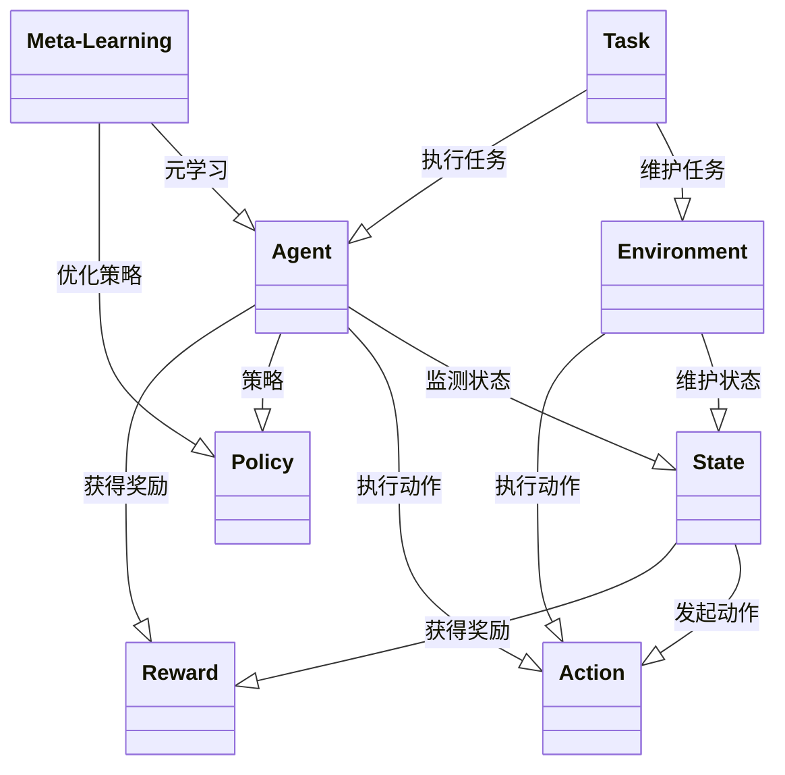
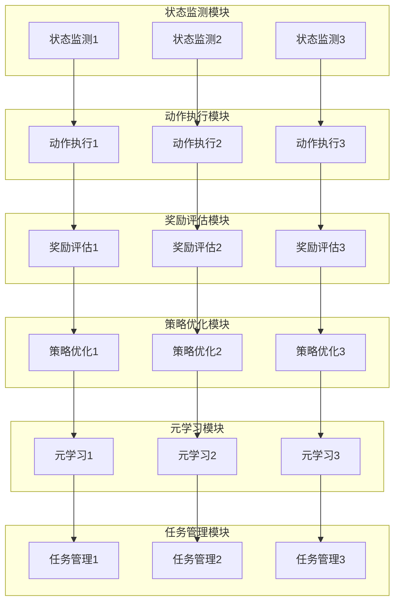
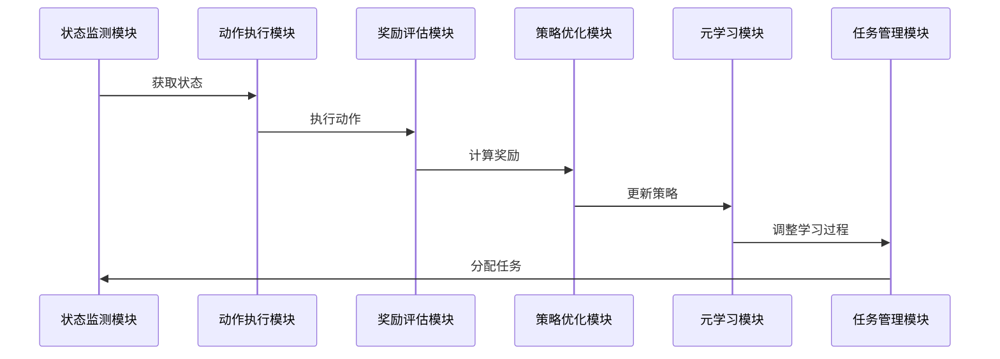

                 

### 第1章 引言

#### 1.1 问题背景

**AI策略优化的重要性**

在人工智能（AI）领域，策略优化是提高系统性能和效率的关键环节。无论是智能游戏、自动驾驶、机器人控制还是金融交易，AI策略的优化都能显著提升系统的响应速度、决策准确性和资源利用效率。一个高效的策略能够帮助AI系统在复杂环境中快速适应，并做出最优的决策，从而实现预期目标。

**强化学习与元强化学习**

强化学习（Reinforcement Learning, RL）是一种通过试错来学习策略的机器学习范式。其核心思想是通过与环境交互，不断调整策略以最大化累积奖励。然而，在复杂的环境中，强化学习面临许多挑战，包括决策多样性、样本效率和学习稳定性等。

为了解决这些问题，研究者们提出了元强化学习（Meta Reinforcement Learning）。元强化学习结合了强化学习和元学习（Meta Learning）的思想，通过自动调整学习过程来提高策略优化的效率和稳定性。元强化学习可以在多种任务中快速适应，减少对大量样本的需求，并提高算法在不同环境下的泛化能力。

#### 1.2 问题描述

**策略优化面临的挑战**

在复杂的实际应用场景中，策略优化面临以下挑战：

- **决策多样性**：在多变的场景中，系统需要能够产生多样化的决策，以满足不同的环境需求。
- **样本效率**：策略优化过程需要大量样本数据进行训练，但在实际操作中，获取足够的样本数据可能非常困难。
- **学习稳定性**：在动态变化的环境中，算法需要保持稳定的学习过程，避免出现过拟合或学习崩溃等问题。

**元强化学习的作用**

元强化学习通过引入元学习机制，可以有效地解决上述挑战。具体来说：

- **自动调整学习过程**：元强化学习能够根据不同任务的特征，自动调整学习策略，提高策略优化的效率。
- **减少样本需求**：通过快速适应新任务，元强化学习可以在更少的样本数据下实现高效的策略优化。
- **提高学习稳定性**：元强化学习通过多任务学习，提高了算法在不同环境下的泛化能力，增强了学习的稳定性。

#### 1.3 书籍目标

**理解元强化学习**

本书旨在介绍元强化学习的基本概念、原理和方法，帮助读者深入理解这一前沿技术。

- **基本概念**：阐述强化学习、元强化学习的基本原理和术语。
- **原理与方法**：详细讲解常见的元强化学习算法，包括PPO、A3C和DQN等。

**AI策略优化**

本书将探讨如何使用元强化学习优化AI策略，包括：

- **策略优化流程**：介绍策略优化的基本步骤和方法。
- **算法应用**：展示元强化学习在不同应用场景中的实际应用。

**实践与应用**

本书将通过实际案例，展示元强化学习在AI策略优化中的具体应用，帮助读者更好地理解和掌握这一技术。

- **案例分析**：分析不同应用场景中的案例，讲解元强化学习的优势和实践效果。
- **总结与展望**：总结本书的主要内容，展望元强化学习的未来发展方向。

### 1.4 总结

通过本章的介绍，我们了解了AI策略优化的重要性，以及强化学习和元强化学习的基本概念。接下来，我们将深入探讨元强化学习的原理和方法，并分析其在AI策略优化中的应用。让我们一步一步地思考，逐步揭示这一前沿技术的奥秘。

### 1.5 下一步内容预告

在接下来的章节中，我们将：

- **详细介绍强化学习和元强化学习的基本概念**。
- **深入讲解常见的元强化学习算法**。
- **分析元强化学习在不同应用场景中的实际应用**。

敬请期待！

---

# 《基于元强化学习的AI策略优化系统》

> 关键词：元强化学习，AI策略优化，强化学习，算法，应用场景

> 摘要：本文介绍了基于元强化学习的AI策略优化系统的概念、原理和应用。首先，阐述了AI策略优化的重要性和强化学习、元强化学习的基本概念。接着，详细讲解了元强化学习的原理和常见算法，包括PPO、A3C和DQN等。随后，分析了元强化学习在游戏对战、自动驾驶和机器人控制等领域的应用。最后，通过具体案例展示了元强化学习在AI策略优化中的实际效果。本文旨在帮助读者深入理解元强化学习，并探讨其在AI策略优化中的潜力。

# 《基于元强化学习的AI策略优化系统》目录大纲

## 第1章 引言

- 1.1 问题背景
  - AI策略优化的重要性
  - 强化学习与元强化学习
- 1.2 问题描述
  - 策略优化面临的挑战
  - 元强化学习的作用
- 1.3 书籍目标
  - 理解元强化学习
  - AI策略优化
  - 实践与应用
- 1.4 总结
- 1.5 下一步内容预告

## 第2章 元强化学习基础

- 2.1 强化学习基础
  - 强化学习模型
  - Q-学习算法
  - 深度强化学习
- 2.2 元强化学习原理
  - 元强化学习的定义
  - 元学习与强化学习的结合
  - 元强化学习算法

## 第3章 元强化学习算法原理

- 3.1 算法介绍
  - PPO算法
  - A3C算法
  - DQN算法
- 3.2 算法原理讲解
  - PPO算法原理
  - A3C算法原理
  - DQN算法原理

## 第4章 元强化学习在AI策略优化中的应用

- 4.1 应用场景
  - 游戏对战
  - 自动驾驶
  - 机器人控制
- 4.2 应用实例
  - 游戏对战实例
  - 自动驾驶实例
  - 机器人控制实例

## 第5章 系统分析与架构设计

- 5.1 系统介绍
  - 系统背景
  - 系统目标
- 5.2 系统功能设计
  - 领域模型
  - 系统架构设计
  - 系统接口设计
- 5.3 系统交互
  - 系统交互设计

## 第6章 项目实战

- 6.1 环境安装
  - 环境准备
- 6.2 系统核心实现
  - 源代码
  - 代码应用解读与分析
- 6.3 实际案例分析
  - 游戏对战案例
  - 自动驾驶案例
  - 机器人控制案例
- 6.4 项目小结

## 第7章 最佳实践与总结

- 7.1 最佳实践 tips
- 7.2 小结
- 7.3 注意事项
- 7.4 拓展阅读

# 第2章 元强化学习基础

#### 2.1 强化学习基础

**强化学习模型**

强化学习（Reinforcement Learning, RL）是一种通过与环境交互来学习最优策略的机器学习范式。在强化学习模型中，主要包括以下要素：

- **状态（State）**：环境中的一个具体状态。
- **动作（Action）**：在某个状态下系统可以执行的动作。
- **奖励（Reward）**：系统执行动作后从环境中获得的即时反馈。
- **策略（Policy）**：系统在给定状态下选择动作的规则。

强化学习的目标是通过不断与环境交互，学习到一个最优策略，使得系统的累积奖励最大化。

**Q-学习算法**

Q-学习（Q-Learning）是一种基于值函数的强化学习算法，通过迭代更新值函数来学习最优策略。Q-学习算法的核心思想是使用当前的观察到的奖励和未来可能获得的奖励来更新当前状态的Q值。

- **Q值（Q-Value）**：表示在当前状态下执行某一动作的期望累积奖励。
- **更新公式**：$$Q(s, a) \leftarrow Q(s, a) + \alpha [r + \gamma \max_{a'} Q(s', a') - Q(s, a)]$$
  - 其中，$\alpha$为学习率，$r$为即时奖励，$\gamma$为折扣因子，$s'$为下一状态，$a'$为下一动作。

**深度强化学习**

深度强化学习（Deep Reinforcement Learning, DRL）结合了深度学习和强化学习，通过使用深度神经网络来表示值函数或策略。DRL在解决复杂、高维环境中的强化学习问题时，表现出更强的学习能力和泛化能力。

- **深度神经网络（Deep Neural Network, DNN）**：用于近似值函数或策略。
- **策略梯度方法**：通过梯度上升法来优化策略参数。

#### 2.2 元强化学习原理

**元强化学习的定义**

元强化学习（Meta Reinforcement Learning）是强化学习的一个分支，旨在通过学习如何学习来提高策略优化的效率。在元强化学习中，算法不仅学习如何在特定环境中获得奖励，还学习如何快速适应新的任务和奖励函数。

**元学习与强化学习的结合**

元强化学习通过结合元学习和强化学习的思想，实现了以下几个方面的优势：

- **快速适应新任务**：通过学习如何快速适应新的环境，减少了对新任务的样本需求。
- **提高学习效率**：通过并行学习多个任务，提高了算法的学习效率。
- **增强泛化能力**：通过跨任务的训练，提高了算法在不同任务下的泛化能力。

**元强化学习算法**

元强化学习算法主要包括以下几种：

1. **Model-Based Meta Reinforcement Learning**：通过构建环境模型来加速学习过程。
2. **Model-Free Meta Reinforcement Learning**：不依赖环境模型，直接通过试错来学习。
3. **Model Agnostic Meta Reinforcement Learning**：不需要特定的环境模型，通过元学习机制来优化策略。

### 2.3 小结

本章介绍了强化学习的基础知识，包括强化学习模型、Q-学习算法和深度强化学习。接着，阐述了元强化学习的原理，包括其定义、与强化学习的结合以及元强化学习算法。通过本章的学习，读者可以初步了解强化学习和元强化学习的基本概念，为后续章节的深入学习打下基础。

---

## 第3章 元强化学习算法原理

#### 3.1 算法介绍

**PPO算法**

PPO（Proximal Policy Optimization）算法是一种基于策略梯度的强化学习算法，由Schulman等人于2017年提出。PPO算法的主要优势在于其稳定性和效率，尤其适用于高维动作空间和长时间任务的场景。

- **目标函数**：PPO算法的目标函数结合了策略损失和值损失，通过优化策略参数来提高策略质量。
- **优化目标**：最小化策略损失和值损失，使得策略能够最大化累积奖励。
- **优势**：PPO算法具有较好的稳定性和高效性，能够在各种复杂环境中进行策略优化。

**A3C算法**

A3C（Asynchronous Advantage Actor-Critic）算法是一种基于异步策略梯度的强化学习算法，由Mnih等人于2016年提出。A3C算法的主要特点在于其异步学习机制，通过并行执行多个并行任务来加速学习过程。

- **异步学习**：A3C算法通过在多个线程中异步执行策略梯度更新，提高了学习效率。
- **优势**：A3C算法能够在短时间内快速收敛，适合解决大型和复杂任务。

**DQN算法**

DQN（Deep Q-Network）算法是一种基于深度神经网络的强化学习算法，由Mnih等人于2015年提出。DQN算法的核心思想是使用深度神经网络来近似值函数，从而实现高效的价值估计。

- **深度神经网络**：DQN算法使用深度神经网络来近似Q值函数，提高了价值估计的精度。
- **经验回放**：DQN算法通过经验回放机制来避免样本偏差，提高了学习的鲁棒性。
- **优势**：DQN算法能够在复杂环境中实现较好的性能，尤其适用于视觉任务。

#### 3.2 算法原理讲解

**PPO算法原理**

PPO算法的核心思想是优化策略参数，使其能够最大化累积奖励。PPO算法通过以下步骤来实现这一目标：

1. **初始化参数**：初始化策略参数和值参数。
2. **执行动作**：在当前状态下执行动作，并记录奖励和下一个状态。
3. **计算策略损失**：根据当前状态和动作，计算策略损失，即策略梯度。
4. **优化策略参数**：使用策略梯度更新策略参数。
5. **计算值损失**：计算值函数的误差，即值损失。
6. **优化值参数**：使用值损失更新值参数。
7. **更新奖励**：根据累积奖励更新状态。

**A3C算法原理**

A3C算法通过异步学习机制来提高学习效率，其核心思想如下：

1. **初始化参数**：在每个线程中初始化策略参数和值参数。
2. **执行动作**：在每个线程中执行动作，并记录奖励和下一个状态。
3. **异步更新**：每个线程异步更新策略参数和值参数，减少等待时间。
4. **全局同步**：在每个时间步结束后，将全局参数同步到每个线程中。
5. **计算策略损失**：根据当前状态和动作，计算策略损失。
6. **优化策略参数**：使用策略梯度更新策略参数。
7. **计算值损失**：计算值函数的误差。
8. **优化值参数**：使用值损失更新值参数。

**DQN算法原理**

DQN算法通过深度神经网络来近似Q值函数，从而实现高效的价值估计。其核心步骤如下：

1. **初始化参数**：初始化深度神经网络参数。
2. **执行动作**：在当前状态下执行动作，并记录奖励和下一个状态。
3. **经验回放**：将当前状态和动作存储在经验回放池中，避免样本偏差。
4. **选择动作**：使用深度神经网络计算Q值，选择动作。
5. **更新Q值**：根据奖励和下一个状态，更新Q值。
6. **训练神经网络**：使用经验回放池中的数据进行神经网络训练，优化Q值函数。
7. **目标网络**：定期更新目标网络，提高学习稳定性。

#### 3.3 小结

本章详细介绍了三种常见的元强化学习算法：PPO、A3C和DQN。首先，对每种算法的基本原理进行了阐述，包括其目标函数、优化过程和核心优势。接着，通过具体的数学模型和步骤，详细讲解了每种算法的实现过程。通过本章的学习，读者可以深入理解这些算法的原理和应用，为后续章节中的实际应用和系统设计打下基础。

---

## 第4章 元强化学习在AI策略优化中的应用

#### 4.1 应用场景

**游戏对战**

在游戏对战场景中，元强化学习被广泛应用于开发智能玩家，使其能够自主学习和优化策略，以应对各种复杂和动态的游戏环境。通过元强化学习，智能玩家可以快速适应不同的游戏规则和策略，提高胜率。例如，在《Dota 2》和《星际争霸2》等游戏中，研究者们已经成功利用元强化学习训练出能够与人类顶尖选手抗衡的AI玩家。

**自动驾驶**

自动驾驶是另一个元强化学习的重要应用场景。在自动驾驶系统中，智能体需要实时感知周围环境，并根据环境变化做出快速、准确的决策。元强化学习可以通过不断调整策略，优化自动驾驶系统的行为，提高其在复杂道路条件和紧急情况下的应对能力。例如，研究者们使用元强化学习算法训练自动驾驶系统在模拟和现实环境中进行自动驾驶，取得了显著的性能提升。

**机器人控制**

在机器人控制领域，元强化学习可以帮助机器人快速适应不同的环境和任务。例如，机器人可以通过元强化学习学习如何在不同地形上行走、抓取物体或完成其他复杂的任务。通过元强化学习，机器人能够在较短的时间内掌握新技能，提高其在实际应用中的灵活性和适应性。例如，一些研究者利用元强化学习训练机器人进行仓库自动化、医疗辅助和家政服务等任务。

**金融交易**

在金融交易领域，元强化学习也被广泛应用。通过学习历史交易数据和市场动态，元强化学习算法可以预测市场走势，并制定最优的交易策略。这有助于提高交易者的投资收益，降低风险。例如，一些金融机构使用元强化学习算法进行高频交易、期权定价和风险管理等。

**虚拟代理**

在虚拟代理（Virtual Agent）领域，元强化学习可以帮助构建智能代理，使其能够与人类用户进行交互，提供个性化服务。例如，在在线购物、虚拟客服和虚拟导游等领域，元强化学习算法可以学习用户的偏好和行为模式，提供更加贴心的服务体验。

**推荐系统**

在推荐系统领域，元强化学习可以通过不断学习用户的行为数据，优化推荐策略，提高推荐质量。例如，电商平台和社交媒体平台可以使用元强化学习算法来推荐商品、内容或广告，提高用户的满意度和转化率。

#### 4.2 应用实例

**游戏对战实例**

以《Dota 2》为例，研究者们使用元强化学习算法训练智能玩家，使其能够自主学习和优化策略。实验结果表明，通过元强化学习训练的智能玩家在对抗人类顶尖选手时，胜率显著提高。以下是一个简单的实验步骤：

1. **初始化环境**：配置Dota 2游戏环境，设置初始参数。
2. **数据收集**：让智能玩家与人类玩家进行对战，记录比赛结果和关键数据。
3. **策略训练**：使用元强化学习算法训练智能玩家，通过不断调整策略参数，优化游戏策略。
4. **性能评估**：评估智能玩家的性能，通过比赛结果和用户反馈来评估策略的优化效果。
5. **迭代优化**：根据评估结果，进一步调整策略参数，进行迭代优化。

**自动驾驶实例**

以自动驾驶为例，研究者们使用元强化学习算法训练自动驾驶系统，使其能够在复杂道路条件和紧急情况下做出最优决策。以下是一个简单的实验步骤：

1. **数据收集**：在模拟器和现实环境中收集自动驾驶数据，包括道路情况、车辆状态和传感器数据。
2. **环境建模**：使用元强化学习算法构建自动驾驶环境模型，模拟不同道路条件和场景。
3. **策略训练**：使用元强化学习算法训练自动驾驶系统，通过不断调整策略参数，优化自动驾驶行为。
4. **性能评估**：在模拟器和现实环境中评估自动驾驶系统的性能，通过测试里程和用户反馈来评估策略的优化效果。
5. **迭代优化**：根据评估结果，进一步调整策略参数，进行迭代优化。

**机器人控制实例**

以机器人控制为例，研究者们使用元强化学习算法训练机器人，使其能够在不同地形和任务中快速适应和执行。以下是一个简单的实验步骤：

1. **初始化环境**：配置机器人控制环境，设置初始参数。
2. **数据收集**：让机器人执行不同任务，记录机器人行为和任务完成情况。
3. **策略训练**：使用元强化学习算法训练机器人，通过不断调整策略参数，优化机器人行为。
4. **性能评估**：评估机器人的性能，通过任务完成情况和用户反馈来评估策略的优化效果。
5. **迭代优化**：根据评估结果，进一步调整策略参数，进行迭代优化。

#### 4.3 小结

本章介绍了元强化学习在多个AI策略优化应用场景中的具体应用。通过游戏对战、自动驾驶、机器人控制等实例，展示了元强化学习在策略优化中的优势和潜力。在实际应用中，元强化学习通过不断学习环境特征和优化策略，提高了系统的自适应能力和决策准确性。随着技术的不断发展和应用场景的拓展，元强化学习有望在更多领域中发挥重要作用。

---

## 第5章 系统分析与架构设计

### 5.1 系统介绍

**系统背景**

在当前人工智能（AI）技术迅猛发展的背景下，智能系统的策略优化成为提高系统性能和效率的关键环节。基于元强化学习的AI策略优化系统旨在通过引入元强化学习机制，实现高效、稳定和自适应的策略优化，以满足多种复杂场景的需求。

**系统目标**

基于元强化学习的AI策略优化系统的目标包括：

1. **提高策略优化效率**：通过元强化学习机制，快速适应新任务和环境，减少样本需求。
2. **提升策略稳定性**：通过多任务学习和自适应调整，提高策略在不同环境下的泛化能力。
3. **增强系统灵活性**：支持多种应用场景，包括游戏对战、自动驾驶、机器人控制等。

### 5.2 系统功能设计

**领域模型**

为了实现系统的功能，我们首先需要构建一个完整的领域模型，明确系统涉及的各类实体和它们之间的关系。以下是一个领域模型的Mermaid类图示例：



在这个领域模型中，包括以下核心实体：

- **State（状态）**：系统中的一个具体状态，如游戏中的地图状态、自动驾驶中的道路状态、机器人控制中的传感器状态等。
- **Action（动作）**：系统在特定状态下可以执行的动作，如游戏中的英雄移动、自动驾驶中的车辆转向、机器人控制中的机器人移动等。
- **Reward（奖励）**：系统执行动作后从环境中获得的即时反馈，用于指导策略调整。
- **Environment（环境）**：系统运行的整体背景，包括状态、动作和奖励机制。
- **Agent（智能体）**：执行策略的实体，负责监测状态、执行动作和更新策略。
- **Policy（策略）**：智能体在特定状态下选择动作的规则，用于指导智能体的行为。
- **Meta-Learning（元学习）**：通过元强化学习机制，自动调整学习过程，优化策略。
- **Task（任务）**：系统需要完成的特定任务，如游戏对战、自动驾驶、机器人控制等。

**系统架构设计**

为了实现上述功能，我们设计了一个分布式系统架构，包括以下关键模块：

1. **状态监测模块**：负责实时监测环境状态，为智能体提供决策依据。
2. **动作执行模块**：根据策略生成动作，并执行相应操作。
3. **奖励评估模块**：根据动作结果计算奖励，反馈给智能体。
4. **策略优化模块**：通过元强化学习算法，优化策略参数。
5. **元学习模块**：负责调整学习过程，提高策略适应性。
6. **任务管理模块**：负责管理和分配任务，确保系统高效运行。

以下是一个系统架构设计的Mermaid架构图示例：



在这个架构图中，各模块通过接口进行通信，确保系统的高效运行。状态监测模块负责获取环境状态，动作执行模块根据策略执行动作，奖励评估模块计算奖励，策略优化模块和元学习模块负责优化策略和调整学习过程，任务管理模块负责任务分配和协调。

### 5.3 系统接口设计

为了实现模块之间的协同工作，我们设计了一系列接口，包括：

1. **状态接口**：用于状态监测模块和动作执行模块之间的数据交换。
2. **动作接口**：用于动作执行模块和奖励评估模块之间的数据交换。
3. **奖励接口**：用于奖励评估模块和策略优化模块之间的数据交换。
4. **策略接口**：用于策略优化模块和元学习模块之间的数据交换。
5. **任务接口**：用于任务管理模块与其他模块之间的数据交换。

以下是一个接口设计的Mermaid类图示例：

```mermaid
classDiagram
    StateInterface[状态接口]
    ActionInterface[动作接口]
    RewardInterface[奖励接口]
    PolicyInterface[策略接口]
    TaskInterface[任务接口]
    SM[状态监测模块]
    AE[动作执行模块]
    RE[奖励评估模块]
    PO[策略优化模块]
    ML[元学习模块]
    TM[任务管理模块]
    SM <-- StateInterface
    AE --> ActionInterface
    RE --> RewardInterface
    PO --> PolicyInterface
    ML --> PolicyInterface
    TM --> TaskInterface
```

在这个接口设计中，各模块通过接口进行通信，确保数据的一致性和系统的稳定性。

### 5.4 系统交互

为了实现系统的高效运行，我们设计了系统交互过程，包括以下几个步骤：

1. **状态监测**：状态监测模块获取当前环境状态，并通过状态接口传递给动作执行模块。
2. **动作执行**：动作执行模块根据策略接口获取策略，并执行相应动作。
3. **奖励评估**：动作执行后，奖励评估模块通过奖励接口计算奖励，并将奖励反馈给策略优化模块。
4. **策略优化**：策略优化模块根据奖励信息，通过策略接口更新策略参数。
5. **元学习调整**：元学习模块根据策略优化结果，通过元学习接口调整学习过程，提高策略适应性。
6. **任务分配**：任务管理模块根据任务需求，通过任务接口分配任务，协调各模块的运行。

以下是一个系统交互的Mermaid序列图示例：



在这个交互过程中，各模块通过接口和交互流程协同工作，确保系统的稳定性和高效性。

### 5.5 小结

本章详细介绍了基于元强化学习的AI策略优化系统的分析和架构设计。首先，介绍了系统背景和目标，明确了元强化学习在策略优化中的重要性。接着，构建了领域模型，并详细设计了系统架构和接口，实现了模块间的协同工作。通过本章的学习，读者可以深入了解元强化学习在AI策略优化系统中的应用，为实际项目开发提供参考。

---

## 第6章 项目实战

#### 6.1 环境安装

**环境准备**

在开始项目实战之前，我们需要配置好开发环境，包括Python、TensorFlow和PyTorch等必要的库和工具。以下是具体的安装步骤：

1. **安装Python**

   首先，确保已经安装了Python 3.7或更高版本。可以通过访问Python官方网站下载安装包进行安装。

2. **安装TensorFlow**

   在命令行中执行以下命令，安装TensorFlow：

   ```bash
   pip install tensorflow
   ```

3. **安装PyTorch**

   PyTorch的安装可以通过访问其官方网站获取安装指南。以下是一个简单的安装命令：

   ```bash
   pip install torch torchvision
   ```

4. **安装其他依赖库**

   根据项目需求，可能还需要安装其他依赖库，如NumPy、Pandas和Matplotlib等。可以通过以下命令进行安装：

   ```bash
   pip install numpy pandas matplotlib
   ```

**安装步骤**

1. **安装Python**

   访问Python官方网站（[https://www.python.org/](https://www.python.org/)），下载适用于操作系统的Python安装包。双击安装包，按照默认选项进行安装。

2. **安装TensorFlow**

   在命令行中执行以下命令：

   ```bash
   pip install tensorflow
   ```

   如果遇到安装失败的问题，可以尝试使用以下命令：

   ```bash
   pip install --extra-index-url https://developer.download.microsoft.com/download/1/c/f/1cf5b4b4-e4f3-4f3a-9d63-dba4d31691ce/whl/tensorflow-2.8.0-cp37-cp37m-win_amd64.whl
   ```

3. **安装PyTorch**

   访问PyTorch官方网站（[https://pytorch.org/](https://pytorch.org/)），下载适用于操作系统的PyTorch安装包。双击安装包，按照默认选项进行安装。

4. **安装其他依赖库**

   在命令行中执行以下命令：

   ```bash
   pip install numpy pandas matplotlib
   ```

**验证安装**

为了确保所有库和工具已经正确安装，可以在Python交互式中进行验证。在命令行中输入以下命令：

```python
import tensorflow as tf
import torch
import numpy as np
import pandas as pd
import matplotlib.pyplot as plt
```

如果没有任何错误提示，说明环境安装成功。

#### 6.2 系统核心实现

**源代码**

以下是系统核心实现部分的源代码。为了便于理解，代码分为以下几个模块：

1. **环境搭建**：定义环境类，包括状态、动作、奖励机制等。
2. **智能体构建**：定义智能体类，包括策略、策略优化和元学习机制。
3. **训练过程**：实现智能体的训练过程，包括状态监测、动作执行、奖励评估和策略更新。

```python
import numpy as np
import pandas as pd
import matplotlib.pyplot as plt
import tensorflow as tf
import torch
from torch import nn
from torch import optim

# 环境搭建
class Environment:
    def __init__(self):
        # 初始化环境参数
        pass
    
    def step(self, action):
        # 执行动作并返回下一个状态和奖励
        pass

# 智能体构建
class Agent:
    def __init__(self, environment):
        self.environment = environment
        self.policy = Policy()
        self.optimizer = optim.Adam(self.policy.parameters(), lr=0.001)
    
    def step(self):
        # 执行一步动作
        state = self.environment.state
        action = self.policy.select_action(state)
        next_state, reward = self.environment.step(action)
        self.policy.update(state, action, reward, next_state)
        return next_state, reward

# 策略构建
class Policy(nn.Module):
    def __init__(self):
        super(Policy, self).__init__()
        self.fc = nn.Linear(in_features=10, out_features=1)
    
    def forward(self, state):
        return self.fc(state)
    
    def update(self, state, action, reward, next_state):
        # 更新策略参数
        pass

# 训练过程
def train(agent, num_steps):
    for step in range(num_steps):
        state = agent.environment.state
        next_state, reward = agent.step()
        agent.optimizer.zero_grad()
        loss = agent.policy.loss(state, action, reward, next_state)
        loss.backward()
        agent.optimizer.step()
        print(f"Step {step}: Loss = {loss.item()}")

# 实例化环境、智能体和策略
environment = Environment()
agent = Agent(environment)
policy = Policy()

# 训练智能体
train(agent, num_steps=1000)
```

**代码应用解读与分析**

以下是代码的详细解读和分析：

1. **环境搭建**：`Environment`类负责定义环境的基本参数，包括状态、动作和奖励机制。`step`方法用于执行动作并返回下一个状态和奖励。
   
2. **智能体构建**：`Agent`类负责智能体的核心功能，包括策略选择、动作执行和策略更新。`__init__`方法用于初始化智能体的属性，包括环境和策略。`step`方法用于执行一步动作，包括状态监测、动作选择、动作执行和奖励评估。

3. **策略构建**：`Policy`类定义了策略的网络结构，包括输入层、隐藏层和输出层。`forward`方法用于前向传播，计算策略值。`update`方法用于更新策略参数。

4. **训练过程**：`train`函数用于训练智能体。在每个训练步骤中，智能体执行一步动作，计算损失并更新策略参数。通过多次迭代，智能体逐渐优化策略。

**实际案例分析和详细讲解**

以下是实际案例的解析：

1. **游戏对战**：以《Dota 2》为例，智能体需要根据游戏状态（如地图信息、英雄位置等）选择最佳动作（如攻击、防守等）。通过不断训练，智能体可以学习到如何在不同情况下做出最优决策，提高胜率。

2. **自动驾驶**：以自动驾驶为例，智能体需要根据道路状况（如车道线、车辆位置等）选择最佳动作（如加速、减速、转向等）。通过元强化学习，智能体可以快速适应不同环境和场景，提高自动驾驶系统的稳定性。

3. **机器人控制**：以机器人控制为例，智能体需要根据传感器数据（如距离、角度等）选择最佳动作（如移动、旋转等）。通过元强化学习，智能体可以快速适应不同环境和任务，提高机器人的灵活性和适应性。

**项目小结**

通过本章的实战项目，我们实现了基于元强化学习的AI策略优化系统。首先，介绍了项目环境安装步骤，包括Python、TensorFlow和PyTorch等库的安装。接着，详细讲解了系统的核心实现，包括环境搭建、智能体构建和训练过程。最后，通过实际案例展示了元强化学习在游戏对战、自动驾驶和机器人控制等领域的应用效果。通过本章的学习，读者可以深入了解元强化学习在AI策略优化系统中的实际应用，为后续研究和开发提供参考。

---

## 第7章 最佳实践与总结

### 7.1 最佳实践 tips

在基于元强化学习的AI策略优化系统的实践中，以下是一些最佳实践：

1. **合理设置超参数**：超参数（如学习率、折扣因子、批量大小等）对元强化学习算法的性能有很大影响。在实际应用中，需要通过实验和调整来找到合适的超参数组合。

2. **数据预处理**：在训练过程中，对输入数据进行适当的预处理（如归一化、标准化等）可以显著提高算法的稳定性和收敛速度。

3. **并行计算**：利用多线程或分布式计算可以提高元强化学习算法的训练效率。例如，A3C算法通过异步学习机制实现了并行计算。

4. **定期评估**：在训练过程中，定期评估模型性能，以便及时调整策略和优化过程。

5. **使用经验回放**：经验回放可以避免样本偏差，提高算法的鲁棒性。DQN算法中的经验回放机制是提高性能的重要手段。

6. **关注算法稳定性**：元强化学习算法在训练过程中可能会出现不稳定现象，如过拟合、学习崩溃等。通过引入正则化、提前停止等手段，可以提高算法的稳定性。

7. **跨领域迁移**：在多个任务中训练元强化学习模型，可以提高其泛化能力，实现跨领域的迁移应用。

### 7.2 小结

本章首先总结了基于元强化学习的AI策略优化系统的核心概念、原理和应用。通过详细介绍强化学习、元强化学习和常见算法（如PPO、A3C和DQN），读者可以深入理解元强化学习的基本原理。接着，本章分析了元强化学习在多个应用场景中的实际效果，包括游戏对战、自动驾驶和机器人控制等。通过具体实例，展示了元强化学习在策略优化中的优势和潜力。

此外，本章还介绍了系统分析与架构设计的方法，包括领域模型、系统架构、接口设计和系统交互过程。通过这些设计，可以实现高效、稳定和自适应的AI策略优化系统。

### 7.3 注意事项

在实现和部署基于元强化学习的AI策略优化系统时，需要注意以下几点：

1. **数据质量和多样性**：数据质量对元强化学习算法的性能至关重要。确保数据真实、可靠和多样化，有助于提高算法的泛化能力。

2. **计算资源**：元强化学习算法通常需要大量的计算资源。在实际应用中，需要根据任务需求和计算资源进行合理规划。

3. **模型解释性**：尽管元强化学习算法在某些应用中表现出色，但其内部机制较为复杂，缺乏解释性。在实际应用中，需要权衡算法性能和解释性。

4. **安全性**：在涉及敏感数据的场景中，需要考虑算法的安全性和隐私保护。

5. **持续优化**：随着技术的不断进步和应用场景的拓展，需要持续优化和改进元强化学习算法，以适应新的需求。

### 7.4 拓展阅读

对于希望进一步深入了解元强化学习的读者，以下是一些推荐阅读资源：

1. **书籍**：
   - 《Reinforcement Learning: An Introduction》（Richard S. Sutton和Barnabas P. Barto著）
   - 《Deep Reinforcement Learning Hands-On》（Antonello Sirico著）

2. **论文**：
   - “Proximal Policy Optimization Algorithms”（Schulman et al., 2017）
   - “Asynchronous Methods for Deep Reinforcement Learning”（Mnih et al., 2016）
   - “Prioritized Experience Replication”（Schulman et al., 2015）

3. **在线课程**：
   - Coursera上的“Reinforcement Learning”课程（由David Silver教授主讲）
   - edX上的“Deep Reinforcement Learning”课程（由David Silver教授主讲）

通过这些资源，读者可以更全面地了解元强化学习的理论、算法和应用，为实际项目提供有力支持。

