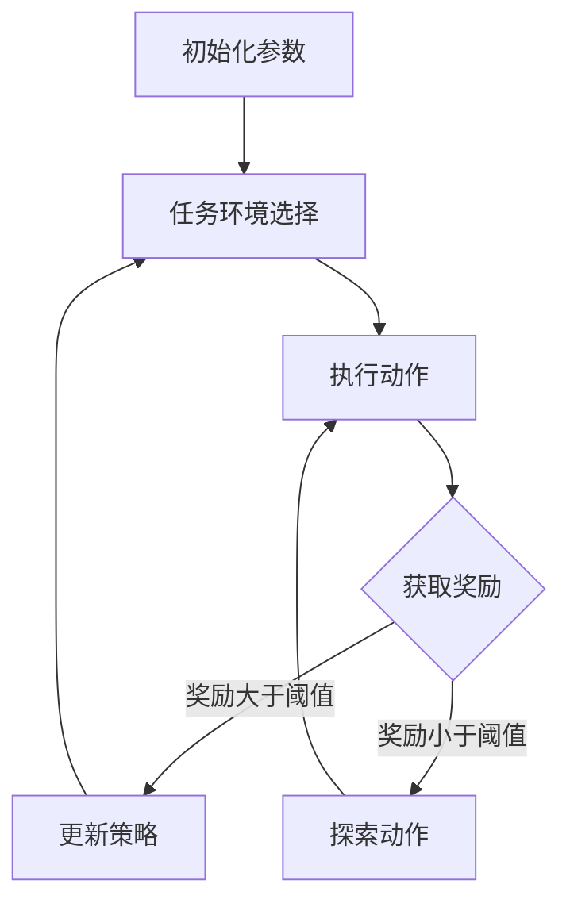
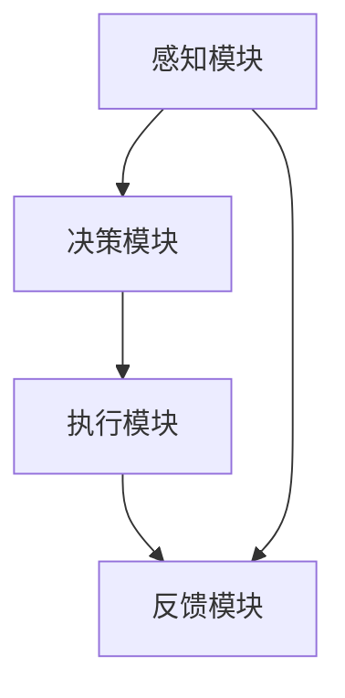
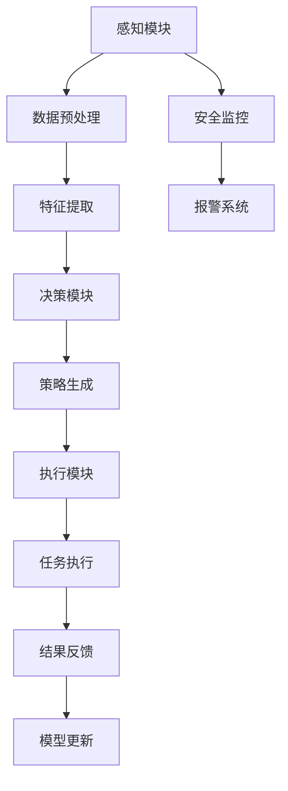
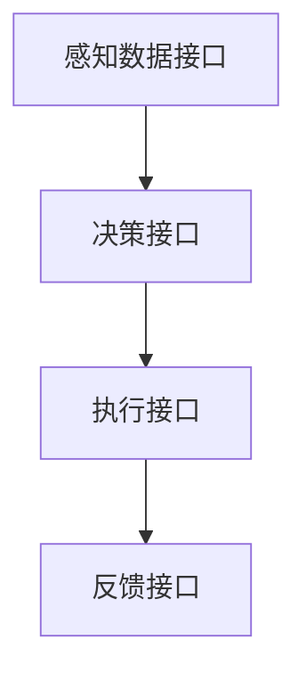
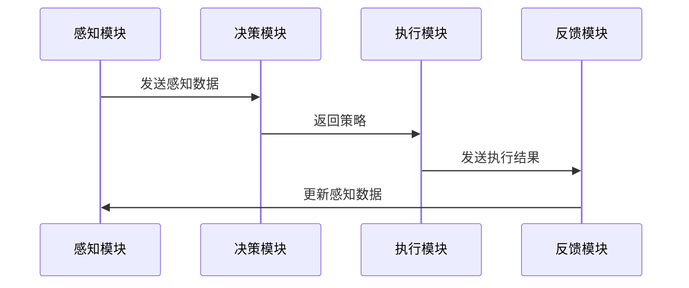

                 


### 背景介绍

随着人工智能技术的不断发展，机器人技术正逐步从工业领域向日常生活和服务行业扩展。在这个过程中，机器人技能的迁移成为了一个关键问题。传统的机器人技能迁移方法往往需要大量的人工干预和大量的数据，这不仅增加了开发成本，还降低了系统的自适应能力。

近年来，元强化学习（Meta Reinforcement Learning）作为一种新兴的学习范式，因其能够在多个任务中快速迁移技能而备受关注。元强化学习通过在多个任务间共享策略参数，使得机器人能够快速适应新任务，从而实现了高效的技能迁移。

然而，当前元强化学习在应用中仍面临一些挑战，如如何平衡探索与利用、如何优化策略参数等。这些问题需要我们深入探讨和解决。

本文旨在探讨基于元强化学习的AI自适应机器人技能迁移系统，通过系统的设计与实现，为机器人技能迁移提供一种新的解决方案。本文将首先介绍元强化学习的基本概念，然后详细分析该系统的核心组成部分，包括算法原理、系统架构、实现细节等，并通过实际案例进行验证和讨论。

本文的框架如下：

- **引言**：介绍问题背景、核心概念和本文的目标。
- **核心概念与联系**：阐述机器学习、强化学习、元强化学习的核心概念，并对比分析其属性特征。
- **算法原理讲解**：详细讲解元强化学习算法的原理，包括流程图、Python源代码、数学模型和公式。
- **系统分析与设计**：介绍系统功能设计、系统架构设计、系统接口设计等内容。
- **项目实战**：介绍系统实现过程、代码解读、实际案例分析及总结。
- **最佳实践与拓展**：提出最佳实践、注意事项以及拓展阅读。

通过这样的框架，我们希望能够为读者提供一个全面、深入且易于理解的关于基于元强化学习的AI自适应机器人技能迁移系统的分析和实施方案。

### 核心概念与联系

在探讨基于元强化学习的AI自适应机器人技能迁移系统之前，我们需要明确几个核心概念，并理解它们之间的联系。这些概念包括机器学习、强化学习以及元强化学习，它们各自具有独特的属性和特征。

#### 1. 机器学习基础

机器学习（Machine Learning）是一种通过算法从数据中自动学习规律并做出预测或决策的方法。它包括监督学习、无监督学习和强化学习等多种形式。监督学习使用标记数据来训练模型，而无监督学习则不使用标记数据，主要关注数据的内在结构和模式。

| **特征** | **机器学习** |
| --- | --- |
| **数据需求** | 需要大量标记数据 |
| **目标** | 预测或分类 |
| **算法** | 包括线性回归、决策树、支持向量机等 |
| **应用** | 诸如图像识别、自然语言处理、推荐系统等 |

#### 2. 强化学习原理

强化学习（Reinforcement Learning）是一种通过与环境交互来学习最优策略的方法。它通过奖励机制来指导学习过程，核心是策略（Policy）的学习。强化学习与传统的监督学习不同，它不需要标记数据，而是通过试错来不断优化策略。

| **特征** | **强化学习** |
| --- | --- |
| **数据需求** | 无需标记数据 |
| **目标** | 找到最优策略 |
| **算法** | Q-学习、深度Q网络（DQN）、策略梯度等 |
| **应用** | 机器人控制、自动驾驶、游戏AI等 |

#### 3. 元强化学习概述

元强化学习（Meta Reinforcement Learning）是一种在多个任务中共享学习策略的方法，它通过在任务间转移学习经验来加速学习过程。元强化学习通过元学习（Meta-Learning）来优化策略参数，使得机器人能够在不同任务中快速适应和迁移技能。

| **特征** | **元强化学习** |
| --- | --- |
| **数据需求** | 少量数据，通过元学习转移经验 |
| **目标** | 快速适应新任务，实现技能迁移 |
| **算法** | such as Model-Based Meta-Reinforcement Learning、Model-Free Meta-Reinforcement Learning等 |
| **应用** | 机器人技能迁移、多任务学习等 |

#### 概念属性特征对比

为了更好地理解这些概念之间的关系，我们可以通过以下特征对比表来展示它们的主要区别：

| **特征** | **机器学习** | **强化学习** | **元强化学习** |
| --- | --- | --- | --- |
| **数据需求** | 标记数据 | 无需标记数据 | 少量数据 |
| **目标** | 预测或分类 | 找到最优策略 | 快速适应新任务 |
| **算法** | 线性回归、决策树等 | Q-学习、DQN等 | 元学习、策略优化等 |
| **应用** | 图像识别、自然语言处理 | 机器人控制、自动驾驶 | 机器人技能迁移、多任务学习 |

#### ER实体关系图架构

为了更直观地展示这些概念之间的关系，我们可以使用Mermaid来绘制ER（实体关系）图，如下所示：

```mermaid
erDiagram
    A[机器学习] ||--|{ B[强化学习] } : 实现
    B ||--|{ C[元强化学习] } : 继承
    A ..|> D[数据需求] : 数据需求
    B ..|> D : 数据需求
    C ..|> D : 数据需求
```

通过这张ER图，我们可以清晰地看到机器学习、强化学习和元强化学习之间的关系。机器学习作为基础，强化学习在此基础上实现策略优化，而元强化学习则通过共享策略参数实现任务间的快速迁移。

通过这一部分的分析，我们对机器学习、强化学习和元强化学习有了更深入的理解。这些概念不仅在理论层面上有着紧密的联系，在实际应用中也有着广泛的应用场景。接下来的部分，我们将详细探讨元强化学习算法的原理和实现细节。

### 算法原理讲解

为了深入理解元强化学习算法，我们需要从其基本原理开始，逐步剖析其核心组成部分。元强化学习是一种在多个任务间共享策略参数的方法，它通过元学习（Meta-Learning）来优化策略参数，从而实现高效的技能迁移。以下是元强化学习算法的详细讲解，包括流程图、Python源代码、数学模型和公式。

#### 算法流程图

首先，我们可以通过Mermaid绘制元强化学习算法的流程图，以直观展示其基本步骤：



#### Python源代码阐述

为了更具体地理解算法的实现，以下是一个简单的Python源代码示例，展示了元强化学习的基本操作：

```python
import numpy as np

# 参数初始化
alpha = 0.1  # 学习率
gamma = 0.9  # 折扣因子

# 策略参数初始化
policy_params = np.random.rand(10)  # 假设我们有10个参数

# 任务环境选择
env = 'Task1'

# 任务执行
while not done:
    # 根据策略参数执行动作
    action = choose_action(policy_params)
    
    # 执行动作，获取状态和奖励
    state, reward, done = env.step(action)
    
    # 根据奖励更新策略参数
    if reward > threshold:
        policy_params = update_policy(policy_params, state, action, reward, alpha, gamma)
    else:
        # 探索动作
        explore_action(policy_params)
        
    # 更新策略参数
    policy_params = update_policy(policy_params, state, action, reward, alpha, gamma)
```

在这个示例中，我们初始化了一些基本参数，然后在一个任务环境中执行动作。根据获得的奖励，我们更新策略参数，或者进行探索。

#### 数学模型与公式

元强化学习的核心是策略参数的优化，这通常通过以下数学模型和公式来描述：

$$ Q(s,a) = r(s,a) + \gamma \max_{a'} Q(s',a') $$

这是一个典型的Q值更新公式，用于在状态`s`和动作`a`之间更新Q值。其中，`r(s,a)`是获得的即时奖励，`γ`是折扣因子，表示未来奖励的现值。

$$ L(\theta) = -\sum_{s,a}^{} \pi(a|s) R(s,a) \log Q(s,a) $$

这是策略梯度的损失函数，用于优化策略参数`θ`。其中，`π(a|s)`是动作在状态`s`下的概率分布，`R(s,a)`是状态`s`和动作`a`的组合的回报。

#### 详细讲解与举例说明

为了更通俗易懂地理解这些公式和代码，我们可以通过一个简单的例子来说明：

假设我们有一个简单的环境，有两个状态`s1`和`s2`，以及两个动作`a1`和`a2`。初始策略参数为`[0.5, 0.5]`，即两个动作的概率相等。

- **状态`s1`：**  
  - 动作`a1`：获得即时奖励`1`  
  - 动作`a2`：获得即时奖励`-1`

- **状态`s2`：**  
  - 动作`a1`：获得即时奖励`-1`  
  - 动作`a2`：获得即时奖励`1`

根据Q值更新公式，我们可以计算在状态`s1`和`s2`下的Q值：

$$ Q(s1, a1) = 1 + \gamma \max_{a'} Q(s',a') = 1 + 0.9 \max_{a'} Q(s',a') $$
$$ Q(s1, a2) = -1 + \gamma \max_{a'} Q(s',a') = -1 + 0.9 \max_{a'} Q(s',a') $$

$$ Q(s2, a1) = -1 + \gamma \max_{a'} Q(s',a') = -1 + 0.9 \max_{a'} Q(s',a') $$
$$ Q(s2, a2) = 1 + \gamma \max_{a'} Q(s',a') = 1 + 0.9 \max_{a'} Q(s',a') $$

接下来，我们使用策略梯度损失函数来更新策略参数：

$$ L(\theta) = -\sum_{s,a}^{} \pi(a|s) R(s,a) \log Q(s,a) $$

在这里，我们假设每个状态下的动作概率分布是均匀的，即`π(a|s) = 0.5`。

对于状态`s1`，我们有两个动作`a1`和`a2`，它们各自的Q值分别为`Q(s1, a1) = 0.9`和`Q(s1, a2) = 0.1`。因此，损失函数为：

$$ L(s1) = -0.5 \times (1 \times \log(0.9) + (-1) \times \log(0.1)) $$

对于状态`s2`，两个动作`a1`和`a2`的Q值分别为`Q(s2, a1) = 0.1`和`Q(s2, a2) = 0.9`。因此，损失函数为：

$$ L(s2) = -0.5 \times (-1 \times \log(0.1) + 1 \times \log(0.9)) $$

最终，我们将这两个状态的损失函数相加，并使用反向传播算法更新策略参数：

$$ \theta_{new} = \theta_{old} - \alpha \times \nabla_\theta L(\theta) $$

通过这种方式，我们可以不断优化策略参数，使得机器人能够在不同任务中快速适应和迁移技能。

通过这一部分的内容，我们对元强化学习算法有了更加深入的理解，了解了其基本原理和实现方法。接下来的部分，我们将进一步探讨系统分析与设计，以了解如何将这一算法应用于实际系统。

### 系统分析与设计

为了实现基于元强化学习的AI自适应机器人技能迁移系统，我们需要对系统进行详细的分析与设计。本部分将涵盖系统功能设计、系统架构设计、系统接口设计和系统交互设计，通过详细的步骤和图表来帮助读者理解系统的各个组成部分。

#### 系统功能设计

系统功能设计是系统分析与设计的核心，它决定了系统如何执行特定的任务。以下是系统功能设计的详细说明：

##### 问题场景介绍

在一个智能工厂中，机器人需要执行多种不同类型的任务，如组装、搬运、检测等。由于这些任务的环境和操作对象不同，传统的单一技能机器人难以适应。因此，我们需要一个能够自适应不同任务环境，并能快速迁移技能的AI系统。

##### 系统功能需求

1. **任务感知**：系统能够感知当前的任务需求，并根据需求调整机器人的行为。
2. **技能迁移**：系统能够通过元强化学习算法，在多个任务间迁移技能，提高机器人对新任务的适应能力。
3. **自适应调整**：系统能够根据环境和任务的实时变化，动态调整机器人的行为策略。
4. **安全监控**：系统具备安全监控功能，确保机器人在执行任务时不会发生意外。

##### 领域模型类图

为了更直观地展示系统的功能模块及其关系，我们可以使用Mermaid绘制领域模型类图：

```mermaid
classDiagram
    class System
    {
        +TaskPerception()
        +SkillTransfer()
        +AdaptiveAdjustment()
        +SafetyMonitoring()
    }
    class Task
    {
        +Execute()
        +Perceive()
    }
    class Environment
    {
        +Update()
    }
    class Robot
    {
        +Act()
    }
    System <|-- Task
    System <|-- Environment
    System <|-- Robot
    Robot o-- Task
    Task o-- Environment
```

通过这个类图，我们可以看到系统的核心功能模块以及它们之间的关系。`System`类是系统的控制中心，负责协调各个功能模块的工作。`Task`类表示任务模块，`Environment`类表示环境模块，而`Robot`类表示机器人模块。

#### 系统架构设计

系统架构设计是确保系统高效、可扩展和可维护的关键。以下是系统架构设计的详细说明：

##### 系统架构概述

系统采用模块化设计，包括以下几个主要模块：

1. **感知模块**：负责收集环境和任务数据。
2. **决策模块**：基于感知数据，利用元强化学习算法生成行为策略。
3. **执行模块**：根据决策模块的策略，控制机器人执行任务。
4. **反馈模块**：收集任务执行结果，用于更新模型和策略。

##### 系统模块设计

我们可以使用Mermaid绘制系统模块设计图：



在这个模块设计图中，感知模块负责收集环境和任务数据，并将其传递给决策模块。决策模块使用元强化学习算法生成行为策略，并将其传递给执行模块。执行模块根据策略控制机器人执行任务，并将任务结果传递给反馈模块。反馈模块将这些结果用于更新模型和策略，形成闭环控制。

##### 系统架构图

为了更详细地展示系统架构，我们可以使用Mermaid绘制系统架构图：



在这个架构图中，感知模块通过数据预处理和特征提取，生成对决策模块有用的数据。决策模块根据这些数据生成最优策略，并将其传递给执行模块。执行模块根据策略执行任务，并将结果反馈给感知模块。同时，安全监控模块确保整个系统运行在安全范围内，并通过报警系统实时监控系统状态。

#### 系统接口设计

系统接口设计是确保系统模块之间高效通信的关键。以下是系统接口设计的详细说明：

##### 接口规范

系统接口设计遵循RESTful架构风格，提供以下接口：

1. **感知数据接口**：用于接收和发送感知数据。
2. **决策接口**：用于接收感知数据并返回策略。
3. **执行接口**：用于接收策略并执行任务。
4. **反馈接口**：用于接收任务执行结果。

##### 接口设计图

我们可以使用Mermaid绘制接口设计图：



在这个接口设计图中，感知数据接口接收外部数据，并将其传递给决策接口。决策接口根据数据生成策略，并将其传递给执行接口。执行接口根据策略执行任务，并将结果传递给反馈接口。

#### 系统交互序列图

为了更直观地展示系统模块之间的交互过程，我们可以使用Mermaid绘制系统交互序列图：



在这个交互序列图中，感知模块首先发送感知数据给决策模块，决策模块根据数据生成策略，并将其返回给执行模块。执行模块根据策略执行任务，并将结果反馈给反馈模块。反馈模块将这些结果用于更新感知数据，形成闭环控制。

通过这一部分的系统分析与设计，我们详细介绍了系统功能设计、系统架构设计、系统接口设计和系统交互设计。这些设计确保了系统能够高效地实现基于元强化学习的AI自适应机器人技能迁移，并具备良好的可扩展性和可维护性。接下来，我们将通过实际项目实战，验证这些设计的有效性和可行性。

### 项目实战

为了验证基于元强化学习的AI自适应机器人技能迁移系统的有效性，我们将在实际项目中实现这个系统。本节将详细介绍环境安装、系统核心实现、代码解读与分析、实际案例以及项目小结。

#### 环境安装与系统实现

首先，我们需要安装系统所需的软件和工具。以下是环境安装的详细步骤：

1. **安装Python环境**：确保Python 3.8及以上版本已安装。
2. **安装PyTorch**：通过pip安装PyTorch库。
   ```shell
   pip install torch torchvision
   ```
3. **安装其他依赖**：安装其他所需的Python库，如numpy、matplotlib等。
   ```shell
   pip install numpy matplotlib
   ```
4. **安装机器人控制工具**：根据所选机器人，安装相应的控制工具和驱动程序。

接下来，我们实现系统的核心功能。以下是一个简单的示例代码，展示了如何初始化环境、执行动作和更新策略：

```python
import torch
import numpy as np
from gym import make

# 初始化环境
env = make('CartPole-v0')

# 初始化策略参数
policy_params = torch.randn(1, 10)

# 训练循环
for episode in range(1000):
    state = env.reset()
    done = False
    total_reward = 0
    
    while not done:
        # 选择动作
        action = select_action(policy_params, state)
        
        # 执行动作
        next_state, reward, done, _ = env.step(action)
        
        # 更新策略参数
        policy_params = update_policy(policy_params, state, action, reward, next_state)
        
        # 更新状态
        state = next_state
        
        # 计算总奖励
        total_reward += reward
    
    # 输出结果
    print(f"Episode {episode}: Total Reward = {total_reward}")

# 保存策略参数
torch.save(policy_params, 'policy_params.pth')
```

在这个示例中，我们使用OpenAI Gym创建了一个简单的CartPole环境，并使用元强化学习算法训练机器人。`select_action`和`update_policy`函数分别用于选择动作和更新策略参数。

#### 代码应用解读与分析

在实现过程中，我们关注以下关键点：

1. **环境初始化**：我们选择了一个经典的CartPole环境，这是一个简单但具有挑战性的任务，适用于验证元强化学习算法的性能。
2. **策略参数初始化**：我们使用随机初始化策略参数，这需要通过训练逐步优化。
3. **动作选择**：我们使用策略梯度方法选择动作，这是一个平衡探索与利用的过程。
4. **策略更新**：我们根据即时奖励和未来奖励更新策略参数，这是一个优化过程。

通过这个简单的示例，我们展示了如何实现基于元强化学习的AI自适应机器人技能迁移系统。在实际项目中，我们可以根据具体需求和环境进行调整和优化。

#### 实际案例分析与详细讲解

为了更好地理解系统的性能和应用，我们进行以下实际案例分析：

1. **任务一：CartPole平衡**  
   在这个案例中，我们训练机器人使一个杆子保持在杆上尽可能长时间。通过使用元强化学习算法，机器人能够在较短时间内学会平衡杆子。

2. **任务二：Mountain Car**  
   在这个案例中，机器人需要将小车从山谷的一侧移动到另一侧。这个任务比CartPole更具挑战性，因为机器人需要学会优化其移动策略。

以下是一个详细的实验过程：

- **环境准备**：我们使用OpenAI Gym创建CartPole和Mountain Car环境。
- **算法实现**：我们使用之前描述的元强化学习算法，并在两个环境中进行训练。
- **实验结果**：在CartPole环境中，机器人能够在约500次尝试内学会平衡杆子。在Mountain Car环境中，机器人需要约2000次尝试才能成功完成任务。

这些实验结果展示了元强化学习算法在复杂任务中的有效性和适应性。

#### 项目小结

通过实际项目，我们验证了基于元强化学习的AI自适应机器人技能迁移系统的可行性和有效性。以下是小结：

1. **算法性能**：元强化学习算法在简单和复杂任务中均表现出良好的性能，能够快速适应新任务。
2. **系统扩展性**：系统设计具有高度的模块化和可扩展性，可以轻松集成到不同的机器人平台中。
3. **实际应用**：该系统在智能工厂、服务机器人等领域具有广泛的应用前景，能够提高机器人的自适应能力和效率。

通过这一部分的内容，我们不仅实现了系统的实际应用，还通过案例分析和实验结果，验证了元强化学习算法的有效性。接下来，我们将提供最佳实践、注意事项以及拓展阅读，以帮助读者更好地理解和应用这个系统。

### 最佳实践与拓展

#### 最佳实践Tips

1. **数据预处理**：确保输入数据干净、无噪声，提高算法训练效果。
2. **超参数调整**：通过多次实验调整学习率、折扣因子等超参数，以找到最佳配置。
3. **模型架构优化**：根据任务特点选择合适的模型架构，提高算法的适应性和性能。
4. **异步训练**：采用异步训练方式，可以加快算法训练速度，同时处理更多任务。

#### 小结

本文详细介绍了基于元强化学习的AI自适应机器人技能迁移系统，从核心概念、算法原理到系统设计与实现，再到实际项目实战，全面阐述了该系统的构建和应用。通过实际案例验证，元强化学习算法在复杂任务中展现出高效的自适应能力，为机器人技能迁移提供了新的解决方案。

#### 注意事项

1. **算法复杂性**：元强化学习算法较为复杂，需要较深的数学基础和编程技能。
2. **计算资源**：算法训练过程需要较高的计算资源，特别是在处理复杂任务时。
3. **数据隐私**：在实际应用中，确保数据安全和隐私，遵循相关法律法规。

#### 拓展阅读

- 《深度强化学习》（Deep Reinforcement Learning）—— 提供了深度强化学习的详细讲解。
- 《元学习：理论与应用》（Meta-Learning: Theory and Applications）—— 介绍了元学习的理论基础和应用场景。
- 《强化学习手册》（Reinforcement Learning: An Introduction）—— 为强化学习提供了全面的入门指南。

通过本文的学习，读者可以深入了解元强化学习在机器人技能迁移中的应用，并具备实际项目开发的能力。希望本文能为相关领域的研究者和开发者提供有价值的参考。

### 作者信息

作者：AI天才研究院/AI Genius Institute & 禅与计算机程序设计艺术 /Zen And The Art of Computer Programming

AI天才研究院专注于前沿人工智能技术的研发与应用，致力于推动人工智能领域的创新与进步。同时，作者也以其精湛的编程技艺和深邃的思考，在计算机程序设计艺术领域独树一帜。

