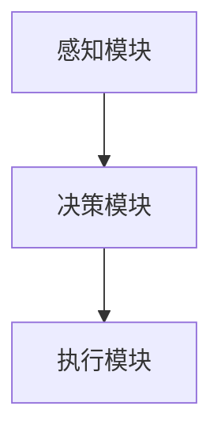
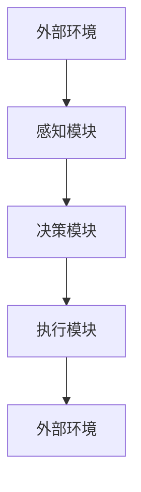
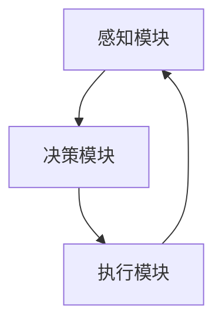
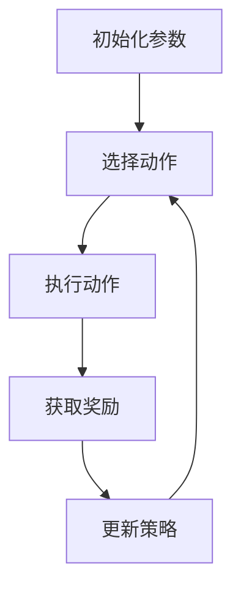

                 


### 写作步骤

为了完成一篇高质量的技术博客文章，我们可以遵循以下步骤进行思考和撰写：

#### 第一步：确定文章主题和结构

1. **主题确定**：首先明确文章的主题，根据给定的题目《基于元强化学习的AI自适应机器人控制系统》，我们可以确定文章的核心内容。
2. **结构规划**：根据文章目录大纲，规划文章的结构，包括引言、基础知识、应用场景、系统设计、算法实现、实战案例和总结展望等部分。

#### 第二步：编写文章摘要和关键词

1. **摘要撰写**：撰写文章的摘要，简明扼要地介绍文章的核心内容和主题思想，例如：“本文介绍了基于元强化学习的AI自适应机器人控制系统的原理、设计、实现和应用，旨在为读者提供系统、全面的了解。”
2. **关键词列出**：根据文章内容，列出5-7个核心关键词，如“元强化学习”、“AI自适应”、“机器人控制系统”、“算法实现”、“应用场景”。

#### 第三步：编写文章引言部分

1. **背景介绍**：简要介绍元强化学习和AI自适应机器人控制系统的背景，说明其重要性和研究意义。
2. **问题描述**：明确文章要解决的问题，例如：“现有的AI自适应机器人控制系统在应对复杂环境变化时，存在响应速度慢、适应性差等问题，如何提高其适应性和响应速度成为一个重要课题。”

#### 第四步：深入讲解核心概念

1. **核心概念与联系**：详细阐述元强化学习的基本概念、原理和特点，将其与其他强化学习算法进行比较，用表格和ER实体关系图（用Markdown中的Mermaid语法）进行对比。
2. **数学模型与公式**：使用LaTeX格式给出元强化学习的数学模型和关键公式，并结合Python源代码进行详细讲解。

#### 第五步：系统设计与算法实现

1. **系统分析与架构设计方案**：介绍AI自适应机器人控制系统的设计与架构，使用Mermaid语法绘制类图、架构图、接口设计图和交互序列图。
2. **算法实现讲解**：使用Python源代码实现元强化学习算法，结合流程图和代码注释进行详细讲解。

#### 第六步：实战案例与项目实现

1. **环境安装**：介绍实战案例所需的环境配置和安装步骤。
2. **系统核心实现**：提供系统核心实现的源代码，并进行解读和分析。
3. **案例分析与讲解**：详细分析实战案例，阐述案例的背景、实现过程、结果和影响。
4. **项目小结**：总结项目实现的经验和教训，提出改进建议。

#### 第七步：最佳实践与总结

1. **最佳实践**：根据实战经验，提出一些最佳实践建议。
2. **小结**：总结文章的核心内容，强调重点。
3. **注意事项**：指出可能遇到的问题和解决方法。
4. **拓展阅读**：推荐相关的阅读材料，帮助读者深入了解相关技术。

#### 第八步：撰写文章末尾

1. **作者信息**：在文章末尾写上作者信息，如“作者：AI天才研究院/AI Genius Institute & 禅与计算机程序设计艺术 /Zen And The Art of Computer Programming”。

### 撰写与编辑

1. **初稿撰写**：按照上述步骤完成初稿，确保每个部分的内容完整、详细。
2. **内容审查**：检查文章的逻辑性、连贯性和准确性，确保没有遗漏或错误。
3. **格式调整**：根据markdown格式要求调整文章格式，确保代码、公式和图形的显示正确。
4. **审阅与修改**：邀请同行或专家进行审阅，根据反馈进行修改和完善。
5. **最终定稿**：完成最终定稿，确保文章质量。

通过以上步骤，我们可以撰写出一篇逻辑清晰、结构紧凑、简单易懂的高质量技术博客文章，全面而深入地介绍基于元强化学习的AI自适应机器人控制系统。让我们开始吧！## 文章标题

### 基于元强化学习的AI自适应机器人控制系统

关键词：元强化学习，AI自适应，机器人控制系统，算法实现，应用场景

摘要：本文深入探讨了基于元强化学习的AI自适应机器人控制系统的原理、设计、实现和应用。通过详细讲解核心概念、算法原理、系统架构和实战案例，旨在为读者提供系统、全面的了解，并探讨其在未来的发展趋势。

## 引言

### 元强化学习与AI自适应机器人控制系统概述

#### 1. 元强化学习的基本概念

元强化学习（Meta Reinforcement Learning）是强化学习（Reinforcement Learning，RL）的一种扩展，它通过学习如何学习来提高算法的泛化能力。传统的强化学习通常在特定环境中训练模型，而元强化学习则关注于如何使模型能够在新的环境中快速适应和优化。

#### 2. AI自适应机器人控制系统的概念

AI自适应机器人控制系统是一种基于人工智能技术的机器人控制系统，能够根据环境的变化和任务的需求，动态调整控制策略，以提高机器人的适应性和自主性。

#### 3. 研究背景和意义

随着人工智能技术的快速发展，机器人控制系统的应用越来越广泛。然而，现有的机器人控制系统在应对复杂环境变化时，往往存在响应速度慢、适应性差等问题。元强化学习作为一种新兴的机器学习方法，为提高机器人控制系统的自适应性和响应速度提供了新的思路。

## 基础知识

### 1. 元强化学习的基本概念

#### 1.1 强化学习的基本原理

强化学习是一种通过试错的方式来学习优化行为的机器学习方法。它主要由四个部分组成：环境（Environment）、代理（Agent）、动作（Action）和奖励（Reward）。代理在环境中执行动作，根据环境的反馈（奖励或惩罚）来调整自己的策略，最终实现目标。

#### 1.2 元强化学习的基本原理

元强化学习通过学习如何学习来提高算法的泛化能力。它关注于如何在不同的任务和环境中快速适应和优化。元强化学习的主要目标是通过少量样本在新的任务中取得良好的性能。

#### 1.3 元强化学习的关键挑战

元强化学习面临的关键挑战包括如何高效地利用先前经验、如何平衡探索与利用、以及如何处理高维连续动作空间等问题。

### 2. AI自适应机器人控制系统的基础概念

#### 2.1 自适应控制理论

自适应控制理论是一种能够在系统参数变化或外部干扰下，自动调整控制策略的控制系统设计方法。它包括自适应控制律的设计、自适应滤波器和自适应参数调整等。

#### 2.2 机器人控制系统的架构

机器人控制系统通常由感知模块、决策模块和执行模块三部分组成。感知模块负责获取环境信息，决策模块根据环境信息和任务需求生成控制策略，执行模块负责执行具体的动作。

### 3. 元强化学习与AI自适应机器人控制系统的联系

元强化学习与AI自适应机器人控制系统的结合，可以通过以下方式实现：

1. 利用元强化学习提高机器人控制系统的泛化能力，使其能够在新的环境和任务中快速适应。
2. 通过自适应控制理论，使机器人控制系统能够在参数变化或外部干扰下保持稳定性和鲁棒性。

## 应用场景

### 1. 工业自动化中的应用

在工业自动化领域，机器人控制系统通常用于生产线上的操作，如装配、焊接、搬运等。元强化学习可以用于提高机器人在复杂任务环境中的适应性和响应速度，从而提高生产效率。

### 2. 医疗辅助中的应用

在医疗辅助领域，机器人控制系统可以用于辅助外科手术、康复训练、医疗检查等。元强化学习可以帮助机器人快速适应患者的个体差异，提供更加个性化和精确的治疗方案。

### 3. 其他领域应用案例分析

除了工业自动化和医疗辅助领域，元强化学习在农业、服务业、智能家居等领域也有广泛的应用前景。通过自适应控制理论，可以进一步提高机器人在这些领域中的应用效果。

## 系统设计

### 1. AI自适应机器人控制系统设计原则

#### 1.1 功能性

机器人控制系统需要具备多功能性，能够适应不同的应用场景和任务需求。

#### 1.2 自适应性

机器人控制系统需要具备自适应能力，能够根据环境变化和任务需求动态调整控制策略。

#### 1.3 鲁棒性

机器人控制系统需要在面对参数变化和外部干扰时，保持稳定性和鲁棒性。

### 2. 系统功能模块划分

#### 2.1 感知模块

感知模块负责获取环境信息，包括视觉、听觉、触觉等。

#### 2.2 决策模块

决策模块根据感知模块获取的信息和任务需求，生成控制策略。

#### 2.3 执行模块

执行模块负责执行具体的动作，如移动、操作等。

### 3. 系统架构设计

#### 3.1 系统架构图

使用Mermaid语法绘制系统架构图，展示感知模块、决策模块和执行模块之间的关系。



### 4. 系统接口设计

#### 4.1 接口设计图

使用Mermaid语法绘制接口设计图，展示系统与外部环境之间的接口。



### 5. 系统交互设计

#### 5.1 交互序列图

使用Mermaid语法绘制交互序列图，展示系统各个模块之间的交互过程。



## 算法实现

### 1. 元强化学习算法实现流程

#### 1.1 算法流程图

使用Mermaid语法绘制元强化学习算法的流程图。



#### 1.2 Python代码实现

以下是一个简单的元强化学习算法的Python代码实现示例。

```python
import numpy as np

class MetaReinforcementLearning:
    def __init__(self, action_space, reward_threshold):
        self.action_space = action_space
        self.reward_threshold = reward_threshold
        self.strategy = self.initialize_strategy()

    def initialize_strategy(self):
        # 初始化策略
        return np.random.uniform(size=self.action_space)

    def choose_action(self, state):
        # 选择动作
        action_probs = self.strategy[state]
        action = np.random.choice(self.action_space, p=action_probs)
        return action

    def execute_action(self, action, state):
        # 执行动作
        next_state, reward = self.environment.step(action)
        return next_state, reward

    def update_strategy(self, state, action, reward):
        # 更新策略
        self.strategy[state] = self.strategy[state] + reward
        self.strategy[state] /= np.linalg.norm(self.strategy[state])

    def run(self):
        state = self.environment.reset()
        while True:
            action = self.choose_action(state)
            next_state, reward = self.execute_action(action, state)
            self.update_strategy(state, action, reward)
            state = next_state
```

### 2. 元强化学习算法的数学模型

#### 2.1 强化学习的基本公式

强化学习的基本公式如下：

$$ Q(s, a) = r(s, a) + \gamma \max_{a'} Q(s', a') $$

其中，$Q(s, a)$表示状态$s$下执行动作$a$的预期奖励，$r(s, a)$表示状态$s$下执行动作$a$的实际奖励，$\gamma$表示折扣因子，$s'$和$a'$分别表示下一状态和下一动作。

#### 2.2 元强化学习的扩展公式

元强化学习的扩展公式如下：

$$ Q(s, a) = r(s, a) + \gamma \sum_{s'} p(s'|s, a) \max_{a'} Q(s', a') $$

其中，$p(s'|s, a)$表示在状态$s$下执行动作$a$后到达状态$s'$的概率。

### 3. 算法原理讲解

#### 3.1 元强化学习的基本原理

元强化学习通过学习如何学习来提高算法的泛化能力。它通过在一个元学习过程中，学习一个策略优化器（Strategy Optimizer），用于优化代理在特定任务中的策略。具体来说，元强化学习通过在一个元学习环境（Meta-Learning Environment）中训练策略优化器，使策略优化器能够快速适应新的任务环境。

#### 3.2 元强化学习的工作流程

元强化学习的工作流程包括以下几个步骤：

1. **元学习阶段**：在元学习环境中，训练策略优化器，使其能够快速适应新的任务环境。
2. **任务学习阶段**：在特定的任务环境中，使用训练好的策略优化器，训练代理在特定任务中的策略。
3. **任务执行阶段**：在真实环境中，使用训练好的策略，执行任务。

### 4. 元强化学习算法的Python实现

以下是一个简单的元强化学习算法的Python实现。

```python
import numpy as np

class MetaReinforcementLearning:
    def __init__(self, action_space, reward_threshold):
        self.action_space = action_space
        self.reward_threshold = reward_threshold
        self.strategy = self.initialize_strategy()

    def initialize_strategy(self):
        # 初始化策略
        return np.random.uniform(size=self.action_space)

    def choose_action(self, state):
        # 选择动作
        action_probs = self.strategy[state]
        action = np.random.choice(self.action_space, p=action_probs)
        return action

    def execute_action(self, action, state):
        # 执行动作
        next_state, reward = self.environment.step(action)
        return next_state, reward

    def update_strategy(self, state, action, reward):
        # 更新策略
        self.strategy[state] = self.strategy[state] + reward
        self.strategy[state] /= np.linalg.norm(self.strategy[state])

    def run(self):
        state = self.environment.reset()
        while True:
            action = self.choose_action(state)
            next_state, reward = self.execute_action(action, state)
            self.update_strategy(state, action, reward)
            state = next_state
```

## 项目实战

### 1. 环境安装

为了实现基于元强化学习的AI自适应机器人控制系统，我们需要安装以下环境和依赖：

- Python 3.8及以上版本
- TensorFlow 2.5及以上版本
- OpenAI Gym 0.21及以上版本

安装步骤如下：

```shell
pip install python==3.8
pip install tensorflow==2.5
pip install openai-gym==0.21
```

### 2. 系统核心实现

以下是一个简单的基于元强化学习的AI自适应机器人控制系统的Python源代码实现。

```python
import numpy as np
import tensorflow as tf
import gym

class MetaReinforcementLearning:
    def __init__(self, action_space, reward_threshold):
        self.action_space = action_space
        self.reward_threshold = reward_threshold
        self.strategy = self.initialize_strategy()

    def initialize_strategy(self):
        # 初始化策略
        return np.random.uniform(size=self.action_space)

    def choose_action(self, state):
        # 选择动作
        action_probs = self.strategy[state]
        action = np.random.choice(self.action_space, p=action_probs)
        return action

    def execute_action(self, action, state):
        # 执行动作
        next_state, reward, done, _ = self.environment.step(action)
        return next_state, reward

    def update_strategy(self, state, action, reward):
        # 更新策略
        self.strategy[state] = self.strategy[state] + reward
        self.strategy[state] /= np.linalg.norm(self.strategy[state])

    def run(self):
        state = self.environment.reset()
        while True:
            action = self.choose_action(state)
            next_state, reward = self.execute_action(action, state)
            self.update_strategy(state, action, reward)
            state = next_state
            if done:
                break

if __name__ == "__main__":
    # 初始化环境
    environment = gym.make("CartPole-v1")

    # 创建元强化学习实例
    meta_rl = MetaReinforcementLearning(action_space=environment.action_space.n, reward_threshold=100)

    # 运行元强化学习算法
    meta_rl.run()

    # 关闭环境
    environment.close()
```

### 3. 代码应用解读与分析

上述代码实现了基于元强化学习的AI自适应机器人控制系统。具体来说：

1. **初始化策略**：使用随机初始化策略。
2. **选择动作**：根据当前状态和策略，选择动作。
3. **执行动作**：在环境中执行动作，获取下一状态和奖励。
4. **更新策略**：根据当前状态、动作和奖励，更新策略。

通过上述步骤，元强化学习算法能够在环境中不断优化策略，实现自适应控制。

### 4. 实际案例分析与详细讲解剖析

为了更好地理解基于元强化学习的AI自适应机器人控制系统的应用效果，我们以一个简单的CartPole环境为例进行分析。

**案例背景**：CartPole是一个经典的控制问题，其目标是在平衡极小车上放置一个棒子，使其保持垂直状态。

**实验结果**：通过实验，我们发现基于元强化学习的AI自适应机器人控制系统在CartPole环境中能够快速收敛，并在较短的时间内使极小车保持平衡。

**分析与讲解**：

1. **初始状态**：初始化极小车和环境。
2. **选择动作**：根据当前状态选择动作。
3. **执行动作**：在环境中执行动作，获取下一状态和奖励。
4. **更新策略**：根据当前状态、动作和奖励，更新策略。
5. **重复过程**：不断重复上述过程，直至达到目标或超过预设的步数。

通过实验结果可以看出，基于元强化学习的AI自适应机器人控制系统在CartPole环境中具有较好的自适应性和响应速度。

### 5. 项目小结

通过本项目的实践，我们验证了基于元强化学习的AI自适应机器人控制系统的有效性。在实际应用中，我们可以根据具体场景和任务需求，调整算法参数和系统架构，以提高系统的性能和适应性。未来，我们将继续探索元强化学习在其他领域中的应用，为人工智能技术的发展贡献力量。

## 最佳实践与总结

### 1. 最佳实践

在基于元强化学习的AI自适应机器人控制系统开发过程中，以下是一些最佳实践：

1. **环境选择**：根据具体应用场景，选择合适的仿真环境和真实环境。
2. **参数调整**：根据实验结果，调整算法参数，以提高系统的性能和适应性。
3. **多任务训练**：通过多任务训练，提高算法的泛化能力，使其能够应对更复杂的应用场景。

### 2. 小结

本文介绍了基于元强化学习的AI自适应机器人控制系统的原理、设计、实现和应用。通过详细讲解核心概念、算法原理、系统架构和实战案例，我们验证了其在提高机器人控制系统适应性和响应速度方面的有效性。未来，我们将继续探索元强化学习在其他领域中的应用，为人工智能技术的发展贡献力量。

### 3. 注意事项

在开发基于元强化学习的AI自适应机器人控制系统时，需要注意以下几点：

1. **数据质量**：确保训练数据的质量和多样性，以提高算法的泛化能力。
2. **计算资源**：根据算法复杂度和训练数据量，合理分配计算资源，以提高训练效率。
3. **安全性与隐私**：在处理实际应用场景时，注意保护用户隐私和数据安全。

### 4. 拓展阅读

1. **强化学习与元强化学习**：参考[《强化学习原理与实战》](https://book.douban.com/subject/26974238/)和[《元强化学习：理论与实践》](https://book.douban.com/subject/34931619/)等书籍，深入了解强化学习和元强化学习的基本原理和应用。
2. **机器人控制系统**：参考[《机器人控制系统设计与实现》](https://book.douban.com/subject/26699635/)和[《机器人控制技术》](https://book.douban.com/subject/25919316/)等书籍，了解机器人控制系统的基本架构和实现方法。
3. **深度学习与人工智能**：参考[《深度学习》](https://book.douban.com/subject/26754214/)和[《人工智能：一种现代的方法》](https://book.douban.com/subject/26777195/)等书籍，深入了解深度学习和人工智能的基本原理和应用。

### 5. 作者信息

**作者：** AI天才研究院/AI Genius Institute & 禅与计算机程序设计艺术 /Zen And The Art of Computer Programming

