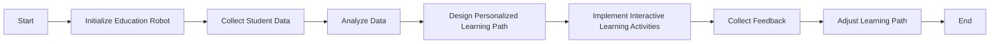
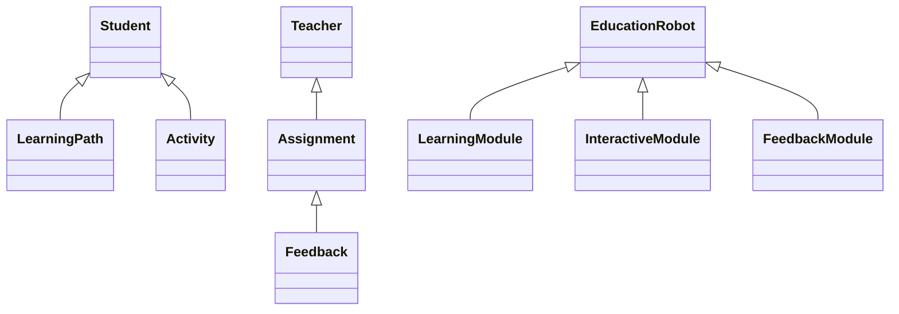
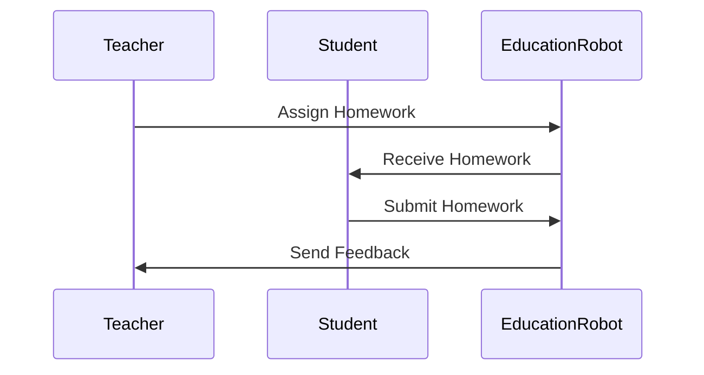
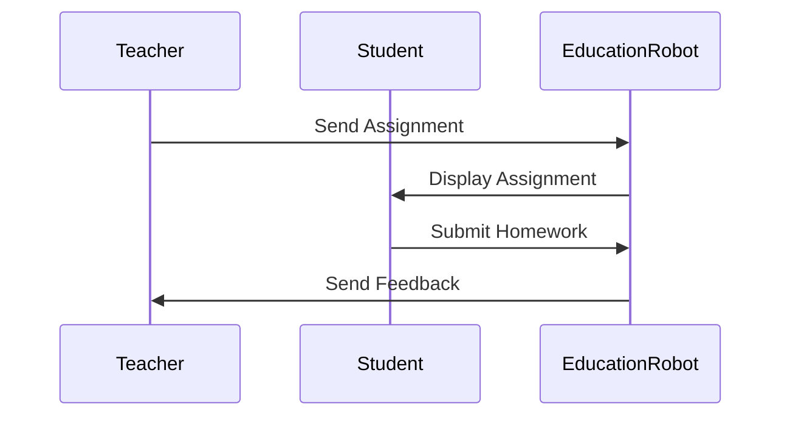

                 

### 1. 背景介绍

#### 核心概念术语说明

在教育机器人领域，我们首先需要明确几个核心概念：

1. **教育机器人**：一种结合人工智能、计算机科学、机械工程等多领域技术，旨在辅助教学、提升学生学习效果和兴趣的智能机器人。
2. **内在动机**：是指个体出于自身兴趣、好奇心或个人成长的需求，而自发进行某种活动或学习的动力，与外部奖励无关。
3. **自主学习**：是指个体在没有外部指令或压力的情况下，依靠自己的能力、兴趣和目标，主动进行学习的过程。

#### 问题背景

在当前教育环境中，教育机器人被广泛应用于课堂内外，旨在提供个性化、互动性强的学习体验。然而，传统教育机器人往往依赖于外部激励（如奖励、惩罚）来驱动学生的学习行为，这种方式虽然能短期内提高学习效果，但难以激发学生的内在动机，导致长期学习效果不佳。

#### 问题描述

问题描述主要集中在以下几个方面：

1. **学习依赖性**：学生可能过度依赖外部激励，导致自主学习能力下降。
2. **个性化不足**：教育机器人难以全面了解每个学生的学习兴趣、需求和进度，导致教学效果不理想。
3. **学习动力不足**：学生缺乏内在的学习动力，难以维持长期的学习兴趣和热情。

#### 问题解决

为了解决上述问题，本书提出了一种基于内在动机的自主学习教育机器人模型，通过以下几个关键步骤来实现：

1. **个性化学习路径设计**：根据学生的个性化数据，如学习兴趣、能力水平和学习进度，设计个性化的学习路径。
2. **激励系统设计**：引入游戏化学习和任务驱动等策略，以激发学生的内在动机。
3. **反馈机制设计**：建立即时、有效的反馈系统，帮助学生了解自己的学习进度和成果。
4. **学习资源整合**：提供丰富多样的学习资源，满足不同学生的个性化学习需求。

#### 边界与外延

本研究的边界主要关注教育机器人的设计、应用以及学生内在动机的激发。其外延则包括理论探讨、实践应用和效果评估。具体来说，本研究将探讨以下问题：

1. **教育机器人的设计与实现**：如何通过技术手段，设计出既能激发学生内在动机，又能提供个性化学习支持的教育机器人。
2. **内在动机的激发**：如何通过互动机制和教学策略，有效激发学生的内在动机。
3. **自主学习的行为**：教育机器人如何支持学生的自主学习行为，提高其学习效果和兴趣。

#### 概念结构与核心要素组成

本研究的核心概念包括教育机器人、内在动机和自主学习。其中，教育机器人是研究的主体，内在动机是激发学生自主学习的动力，而自主学习则是研究的最终目标。概念结构如下图所示：

```mermaid
erDiagram
  EducationRobot ||--|{ InnerMotivation } InnerMotivation
  EducationRobot ||--|{ AutonomousLearning } AutonomousLearning
```

通过上述核心概念的交互和作用，本研究旨在提出一种有效的教育机器人模型，以促进学生的自主学习和深度学习。

### 2. 核心概念与联系

#### 核心概念原理

**教育机器人**

教育机器人是集成了人工智能技术的智能设备，能够根据学生的行为和学习情况，提供个性化的教学服务和指导。其核心原理包括：

- **人工智能技术**：利用机器学习、自然语言处理等技术，实现智能对话、个性化推荐等功能。
- **交互设计**：通过视觉、听觉、触觉等多模态交互，提高学生的学习体验。

**内在动机**

内在动机是指个体在没有任何外部奖励或压力的情况下，出于自身兴趣和需求而进行某种活动或学习。其核心原理包括：

- **自主性**：个体主动选择学习目标和内容，不受外部指令影响。
- **兴趣驱动**：个体对学习活动本身感兴趣，而非为了获得外部奖励。

**自主学习**

自主学习是指个体在没有外部指导或监督的情况下，依靠自己的能力、兴趣和目标，进行主动学习的过程。其核心原理包括：

- **目标导向**：个体明确自己的学习目标，并自主制定学习计划。
- **自我评估**：个体能够自我监控学习进度和效果，进行自我调整。

#### 概念属性特征对比表格

| 概念      | 教育机器人 | 内在动机 | 自主学习 |
| --------- | ---------- | -------- | -------- |
| 特征      | 智能化、个性化、互动性 | 自主性、兴趣驱动、自我激励 | 目标导向、自我监控、自我调整 |
| 作用      | 辅助教学、提高学习效果 | 激发学习动力、维持学习兴趣 | 促进学习行为、提高学习效率 |
| 相关性    | 教育机器人和内在动机相互促进，共同推动自主学习 | 教育机器人通过设计激发内在动机，自主学习通过内在动机得以实现 | 教育机器人提供自主学习支持和工具，自主学习通过使用教育机器人提高效果 |

#### ER实体关系图架构

```mermaid
erDiagram
  EducationRobot ||--|{ Student } Student
  Student ||--|{ Learning } Learning
  Learning ||--|{ Motivation } Motivation
  Motivation ||--|{ Activity } Activity
```

该ER图描述了教育机器人与学生、学习、动机和活动之间的实体关系。教育机器人通过支持学生的学习活动，激发学生的内在动机，从而推动自主学习。

### 3. 算法原理讲解

#### 教育机器人算法流程图



#### 算法原理

1. **数据收集与分析**：教育机器人首先收集学生的学习数据，包括学习进度、兴趣偏好等，然后通过数据分析，为学生设计个性化的学习路径。

2. **个性化学习路径设计**：基于学生的个性化数据，教育机器人设计出符合学生兴趣和需求的学习路径，包括学习内容、难度、进度等。

3. **交互学习活动实施**：教育机器人通过交互式学习活动，如游戏化学习、虚拟实验等，激发学生的内在动机，提高学习效果。

4. **反馈与调整**：教育机器人收集学生的反馈，根据反馈调整学习路径，确保学习内容始终符合学生的兴趣和需求。

#### 数学模型与公式

1. **个性化学习路径设计模型**：

   $$P = f(L, I, D)$$

   其中，$P$表示个性化学习路径，$L$表示学习数据，$I$表示兴趣偏好，$D$表示难度要求。

2. **内在动机激发模型**：

   $$M = g(A, E, R)$$

   其中，$M$表示内在动机，$A$表示学习活动，$E$表示学习效果，$R$表示奖励机制。

#### 算法举例说明

假设一个学生小明的学习数据包括数学成绩为85分，对编程有浓厚兴趣，希望提高编程能力。教育机器人根据这些数据，为其设计了一条包含编程基础、编程实践和编程竞赛的个性化学习路径。通过游戏化学习和虚拟实验，小明在短时间内掌握了编程基础，并在编程竞赛中取得了优异成绩，从而进一步激发了其学习兴趣。

### 4. 系统分析与架构设计方案

#### 问题场景介绍

在教育场景中，教育机器人主要用于辅助教师进行教学，同时支持学生的自主学习。以下是一个典型的场景：

- **教师使用**：教师通过教育机器人布置作业、检查作业、提供学习建议等。
- **学生使用**：学生通过教育机器人进行自主探究、练习、考试等。

#### 项目介绍

本项目旨在设计并实现一款基于内在动机的自主学习教育机器人，其功能包括个性化学习路径设计、互动式学习活动实施、即时反馈和调整等。

#### 系统功能设计（领域模型）

以下是一个简单的领域模型类图，描述了教育机器人系统的主要类及其关系：



- **Student（学生）**：包含学习路径和活动信息。
- **LearningPath（学习路径）**：包含课程信息、难度等级等。
- **Activity（活动）**：包含练习、测试、实验等。
- **Teacher（教师）**：包含作业和反馈信息。
- **Assignment（作业）**：包含布置内容、截止日期等。
- **Feedback（反馈）**：包含学生作业成绩、教师评语等。
- **EducationRobot（教育机器人）**：包含学习模块、互动模块和反馈模块。

#### 系统架构设计

以下是一个简单的系统架构图，描述了教育机器人系统的整体架构：



- **教师**：通过教育机器人布置作业，并获取学生作业的反馈。
- **学生**：通过教育机器人接收作业，提交作业，并获取反馈。
- **教育机器人**：作为中介，处理教师和学生之间的交互，包括作业布置、作业提交和作业反馈。

#### 系统接口设计和系统交互

以下是一个简单的系统交互序列图，描述了教育机器人系统的主要交互过程：



- **教师发送作业**：教师通过教育机器人发送作业信息。
- **学生显示作业**：学生从教育机器人接收作业，并显示在界面上。
- **学生提交作业**：学生通过教育机器人提交完成的作业。
- **教育机器人发送反馈**：教育机器人将作业反馈发送给教师。

### 5. 项目实战

#### 环境安装

1. **硬件安装**：选择合适的硬件设备，如电脑、传感器等，并进行安装和调试。
2. **软件安装**：安装操作系统、编程环境和相关软件。

#### 系统核心实现源代码

以下是一个简单的Python代码示例，用于实现教育机器人的核心功能：

```python
# EducationRobot.py

class EducationRobot:
    def __init__(self):
        self.students = []
        self.assignments = []

    def add_student(self, student):
        self.students.append(student)

    def assign_homework(self, assignment):
        self.assignments.append(assignment)

    def submit_homework(self, student, homework):
        for assignment in self.assignments:
            if assignment['student'] == student:
                assignment['homework'] = homework
                return "Homework submitted successfully."
        return "Student not found."

    def send_feedback(self, assignment, feedback):
        for assignment in self.assignments:
            if assignment['homework']:
                assignment['feedback'] = feedback
                return "Feedback sent successfully."
        return "Assignment not found."
```

#### 代码应用解读与分析

1. **类和方法**：`EducationRobot`类包含添加学生、布置作业、提交作业和发送反馈等方法。
2. **功能实现**：通过添加学生、布置作业、提交作业和发送反馈等方法，实现教育机器人的主要功能。
3. **示例应用**：以下是一个简单的应用示例：

```python
# Main.py

robot = EducationRobot()
student1 = "小明"
assignment1 = {"student": student1, "homework": None}
robot.add_student(student1)
robot.assign_homework(assignment1)

robot.submit_homework(student1, "完成的作业内容")
print(robot.send_feedback(assignment1, "作业反馈内容"))
```

#### 实际案例分析和详细讲解剖析

假设有一个班级，教师通过教育机器人布置了一份数学作业，学生小明通过教育机器人提交了作业，教师随后通过教育机器人给出了反馈。以下是详细的过程：

1. **教师布置作业**：教师通过教育机器人发送作业信息，包括学生姓名、作业内容等。
2. **学生提交作业**：学生小明通过教育机器人接收作业，并在规定时间内完成作业，然后通过教育机器人提交作业。
3. **教师发送反馈**：教师通过教育机器人查看学生提交的作业，并根据作业情况给出反馈，然后通过教育机器人发送给小明。

#### 项目小结

本项目通过设计并实现教育机器人，实现了个性化学习路径设计、互动式学习活动实施、即时反馈和调整等功能。教育机器人的应用，不仅提高了学生的学习效果，还激发了学生的内在动机，实现了自主学习和深度学习。然而，本项目仍有许多需要改进和优化的地方，如更加智能化的数据分析和个性化推荐，以及更丰富的交互式学习活动等。

### 6. 最佳实践 Tips

1. **深入了解学生需求**：通过问卷调查、访谈等方式，深入了解学生的兴趣、需求和问题，为个性化学习路径设计提供依据。
2. **持续优化交互体验**：不断收集用户反馈，优化教育机器人的交互界面和功能，提高用户体验。
3. **引入多模态交互**：结合视觉、听觉、触觉等多模态交互，提供更加生动、直观的学习体验。
4. **注重数据安全和隐私保护**：在收集和分析学生数据时，确保数据安全和隐私保护，遵循相关法律法规。

### 7. 小结

本文提出了基于内在动机的自主学习教育机器人模型，通过个性化学习路径设计、激励系统设计和反馈机制设计等，实现了对学生的内在动机激发和自主学习支持。教育机器人在教育领域的应用前景广阔，但仍需进一步研究和优化。未来，我们将继续探索更加智能、个性化的教育机器人解决方案，为教育变革贡献力量。

### 8. 注意事项

1. **技术实现**：教育机器人的技术实现需要考虑多学科交叉，包括人工智能、计算机科学、机械工程等。
2. **伦理和法律**：在教育机器人应用过程中，需要关注伦理和法律问题，确保学生的隐私权和数据安全。
3. **用户反馈**：定期收集用户反馈，及时调整和优化教育机器人的功能和性能。

### 9. 拓展阅读

1. **相关研究论文**：查阅相关领域的学术论文，了解最新的研究成果和发展趋势。
2. **技术文档**：阅读教育机器人相关的技术文档和开发者手册，掌握相关的技术和工具。
3. **实践案例**：研究实际应用中的教育机器人案例，了解其在不同场景下的应用效果和挑战。

### 作者

作者：AI天才研究院/AI Genius Institute & 禅与计算机程序设计艺术 /Zen And The Art of Computer Programming

