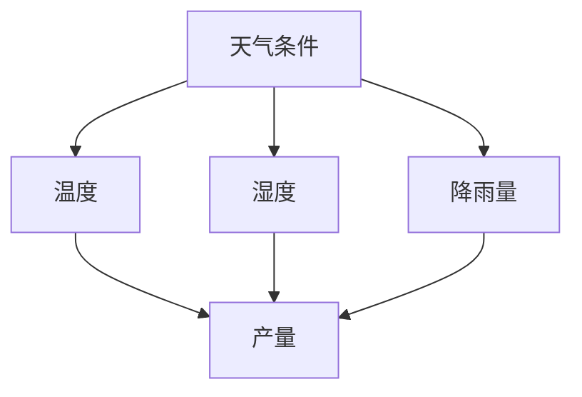
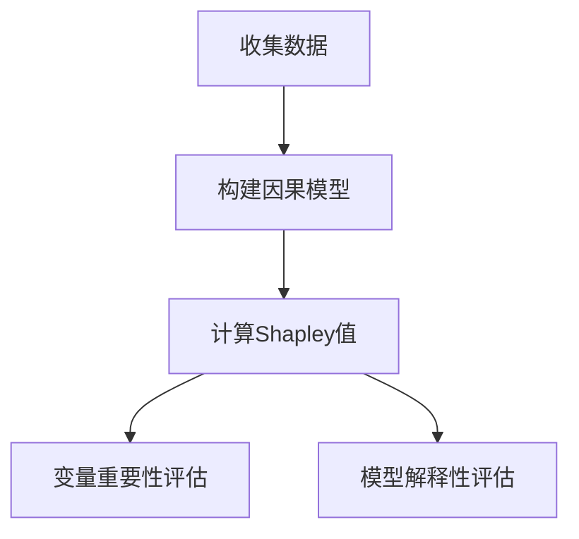

                 

### 第2章：因果推理基本原理

#### 2.1.1 因果推理模型

因果推理模型在决策支持系统中扮演着至关重要的角色，它旨在揭示变量之间的因果关系，从而为决策提供可靠的依据。为了更好地理解因果推理模型，我们可以将其核心要素分解如下：

**因果模型**：这是一个用来表示变量之间因果关系的抽象框架。在因果模型中，通常用图结构来表示变量及其相互关系，称为因果图或定向无环图（DAG）。因果图中的每个节点代表一个变量，而每条边则表示两个变量之间的因果关系。因果模型的建立依赖于领域知识和数据驱动的方法。

**潜在结果框架**：在因果推理中，每个决策节点都对应着多个可能的结果。潜在结果框架旨在全面考虑这些可能的结果，并分析每种结果在给定决策下的概率分布。这通常涉及计算各种条件概率，例如在给定一个决策下的结果概率，或在给定一个结果下的决策概率。

**干预操作**：干预操作是指对系统进行有目的的操纵，以影响其结果。干预操作在因果推理中非常重要，因为它可以帮助我们了解不同决策可能带来的影响。干预操作可以是参数调整、环境变化或系统重置等。

为了更好地理解因果推理模型，我们可以借助一个简单的例子。假设我们有一个农业领域的问题，目标是根据天气条件（如温度、湿度、降雨量）来预测农作物的产量。因果模型将天气条件视为决策节点，产量视为结果节点，并建立它们之间的因果关系。潜在结果框架将考虑所有可能的天气组合及其对应的产量概率。干预操作可以是改变灌溉策略或选择不同的种植品种。

下面是一个简单的因果图的Mermaid表示：

在这个例子中，天气条件是决策节点，而温度、湿度、降雨量和产量是结果节点。因果图显示了天气条件如何影响其他变量，并最终影响产量。

#### 2.1.2 因果推理算法

因果推理算法旨在从数据中学习因果模型，并利用这些模型进行推理和决策。以下是一些常见的因果推理算法：

**Shapley值**：Shapley值是一种用于分配因果效应的方法，它基于博弈论中的Shapley值概念。Shapley值可以衡量每个变量对结果的影响大小，并用于解释模型预测的因果效应。

**因果效应估计**：因果效应估计是指通过统计方法从数据中估计因果模型中的效应大小。常见的估计方法包括因果推断（如匹配方法、工具变量法）和结构因果模型（如Do计算、目标函数优化）。

**因果推断**：因果推断是一种从数据中推断因果关系的统计方法。它通过假设检验、置信区间估计和模型选择等技术来评估因果关系的存在和强度。

下面是一个简化的Shapley值算法的Mermaid流程图：

在这个流程图中，我们首先收集数据，然后构建因果模型，并计算每个变量的Shapley值。最后，我们评估变量的重要性以及模型的可解释性。

#### 2.1.3 因果推断的挑战

尽管因果推理在决策支持系统中具有巨大的潜力，但在实际应用中仍然面临一些挑战：

**数据缺失与噪声**：实际数据往往存在缺失值和噪声，这可能导致因果推理结果不准确。

**复杂因果关系**：现实世界中的因果关系通常非常复杂，难以用简单的因果图表示。

**干预操作的多样性**：在实际应用中，干预操作可能多种多样，这增加了因果推理的复杂性。

**模型可解释性**：对于复杂模型，如何解释模型的决策过程和因果效应仍然是一个挑战。

为了克服这些挑战，研究人员正在开发新的方法和算法，以提高因果推理的准确性和可解释性。

总之，因果推理是一种强大的决策支持工具，它通过揭示变量之间的因果关系，帮助我们在复杂环境中做出更好的决策。在下一章中，我们将探讨LLM（大型语言模型）在因果推理中的应用，并探讨LLM如何增强因果推理的能力。

### 下一章预告

在下一章中，我们将探讨LLM（大型语言模型）在因果推理中的应用。LLM是一种基于深度学习的强大模型，它能够处理大量文本数据，并生成高质量的自然语言文本。LLM在因果推理中的应用主要包括：

1. **文本数据预处理**：LLM可以帮助我们有效地处理和清洗文本数据，提高因果推理的准确性。
2. **因果图生成**：LLM可以自动生成因果图，简化因果模型的构建过程。
3. **因果推断**：LLM可以用于因果推断，提高复杂因果关系下的决策准确性。
4. **模型解释性**：LLM可以帮助我们解释模型的决策过程，提高模型的可解释性。

通过结合LLM和因果推理，我们可以更好地理解和利用数据，为决策提供强有力的支持。敬请期待下一章的详细探讨。

