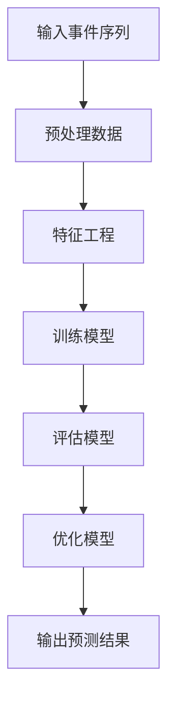
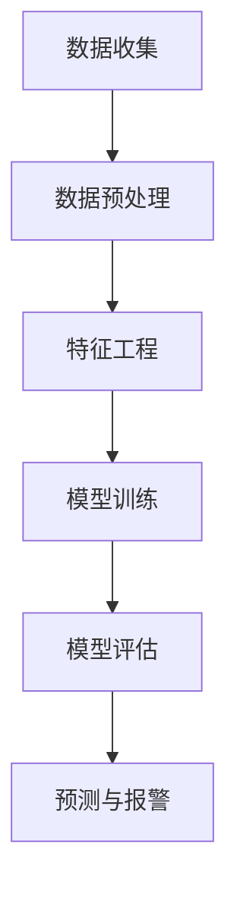
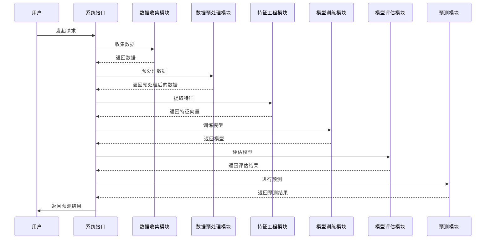

                 

# 基于因果推理的事件链预测模型设计

> 关键词：因果推理，事件链预测，模型设计，算法原理，系统架构，项目实战

> 摘要：本文将深入探讨基于因果推理的事件链预测模型的设计与应用。我们将从因果推理和事件链预测的背景与重要性出发，详细阐述核心概念和理论，然后逐步介绍算法设计、数学模型与公式、系统架构设计，并通过具体的项目实战案例来展示模型实现的细节和效果。

## 引言

因果推理是人工智能和数据分析领域中的一个重要概念，它旨在理解变量之间的关系，特别是因果关系。事件链预测则是在特定场景下，根据已知的因果关系和事件序列，预测未来可能发生的事件。这两种概念在许多应用场景中都有广泛的应用，如金融市场预测、网络安全监控、智能医疗诊断等。

本书的目标是介绍基于因果推理的事件链预测模型的设计原理和方法，帮助读者理解并掌握这一前沿技术。我们将首先介绍因果推理和事件链预测的基础概念，然后逐步深入到算法设计、数学模型与公式、系统架构设计，以及具体的实现和应用。

## 核心概念

### 因果推理

因果推理是指通过分析变量之间的关系，推断出某个变量对另一个变量的影响。在因果推理中，通常涉及以下几个基本概念：

1. **因变量（Dependent Variable）**：目标是预测或解释的变量。
2. **自变量（Independent Variable）**：影响因变量的变量。
3. **因果效应（Causal Effect）**：自变量对因变量的影响程度。

因果推理的核心是理解变量之间的因果关系，从而进行有效的预测和决策。

### 事件链预测

事件链预测是指根据已知的事件序列和因果关系，预测未来可能发生的事件。在事件链预测中，通常涉及以下几个关键要素：

1. **事件序列（Event Sequence）**：一系列按时间顺序发生的事件。
2. **因果关系（Causal Relationship）**：事件之间的因果关系，通常用图结构表示。
3. **事件预测（Event Prediction）**：根据事件序列和因果关系，预测未来可能发生的事件。

事件链预测的目的是提前识别和预测潜在的问题或机会，从而进行预防性措施或优化决策。

### 相关概念联系

因果推理和事件链预测之间有着密切的联系。因果推理为事件链预测提供了理论基础，通过理解变量之间的因果关系，可以更准确地预测事件序列的发展。而事件链预测则将因果推理的应用场景扩展到了具体的预测任务中。

## 算法设计

### 模型设计原则

在事件链预测模型的设计过程中，需要遵循以下几个原则：

1. **因果一致性（Causal Consistency）**：确保模型能够捕捉到真实的因果关系。
2. **准确性（Accuracy）**：提高预测的准确性。
3. **可解释性（Interpretability）**：模型的结果容易理解和解释。
4. **高效性（Efficiency）**：模型能够在合理的时间内完成预测。

### 模型设计流程

事件链预测模型的设计通常遵循以下流程：

1. **问题定义**：明确预测目标和场景。
2. **数据收集**：收集相关的数据，包括事件序列和因果关系。
3. **特征工程**：对数据进行预处理，提取有用的特征。
4. **模型选择**：选择合适的算法和模型框架。
5. **模型训练**：使用训练数据训练模型。
6. **模型评估**：评估模型的性能，包括准确性、可解释性和效率。
7. **模型优化**：根据评估结果，对模型进行优化。

## 数学模型与公式

在事件链预测模型中，数学模型和公式是核心组成部分。以下是一个简化的数学模型示例：

$$
P(E_t | C) = \frac{P(E_t, C)}{P(C)}
$$

其中，$P(E_t | C)$ 表示在因果关系$C$发生的情况下，事件$E_t$的概率。$P(E_t, C)$ 和$P(C)$ 分别表示事件$E_t$和因果关系$C$同时发生的概率以及因果关系$C$的概率。

### Mermaid流程图

以下是事件链预测算法的Mermaid流程图：



### Python源代码

以下是事件链预测模型的Python源代码示例：

```python
import pandas as pd
from sklearn.model_selection import train_test_split
from sklearn.ensemble import RandomForestClassifier
from sklearn.metrics import accuracy_score

# 数据预处理
data = pd.read_csv('event_sequence.csv')
X = data[['feature_1', 'feature_2', 'feature_3']]
y = data['target']

# 特征工程
# ...

# 训练模型
X_train, X_test, y_train, y_test = train_test_split(X, y, test_size=0.2, random_state=42)
model = RandomForestClassifier()
model.fit(X_train, y_train)

# 评估模型
y_pred = model.predict(X_test)
accuracy = accuracy_score(y_test, y_pred)
print(f'Accuracy: {accuracy:.2f}')

# 优化模型
# ...
```

### 算法原理讲解

事件链预测算法的核心原理是利用因果关系来预测事件。具体步骤如下：

1. **输入事件序列**：读取输入的事件序列数据。
2. **预处理数据**：对数据进行清洗和预处理，提取有用的特征。
3. **特征工程**：根据事件序列和因果关系，构建特征向量。
4. **训练模型**：使用训练数据训练模型，通常采用集成学习算法。
5. **评估模型**：使用测试数据评估模型的性能。
6. **优化模型**：根据评估结果，对模型进行优化。

通过以上步骤，事件链预测模型可以有效地预测未来可能发生的事件。

## 系统架构设计

### 问题场景介绍

在网络安全监控领域，事件链预测模型可以帮助识别潜在的攻击行为。例如，一个恶意攻击者可能会执行一系列攻击步骤，如扫描端口、尝试入侵、数据窃取等。通过事件链预测模型，可以提前识别并阻止这些攻击行为。

### 系统功能设计

事件链预测系统的主要功能包括：

1. **数据收集**：从各种数据源收集事件数据。
2. **数据预处理**：对数据进行清洗和预处理。
3. **特征工程**：提取和构建事件特征。
4. **模型训练**：训练事件链预测模型。
5. **模型评估**：评估模型的性能。
6. **预测与报警**：根据模型预测结果，生成报警信息。

### 系统架构设计

事件链预测系统的架构设计如下：



### 系统接口设计

系统接口设计包括：

1. **API接口**：提供RESTful API，供其他系统调用。
2. **Web界面**：提供用户友好的Web界面，供用户查看预测结果和报警信息。

### 系统交互序列图

以下是事件链预测系统的交互序列图：



## 项目实战

### 环境安装与配置

在开始项目实战之前，需要安装和配置必要的软件和工具。以下是安装和配置步骤：

1. **安装Python**：下载并安装Python 3.8或更高版本。
2. **安装依赖**：使用pip命令安装相关依赖，如scikit-learn、pandas、numpy等。
3. **配置环境**：创建虚拟环境，以便管理项目依赖。

### 系统核心实现

以下是事件链预测模型的核心实现代码：

```python
import pandas as pd
from sklearn.ensemble import RandomForestClassifier
from sklearn.model_selection import train_test_split
from sklearn.metrics import accuracy_score

# 数据预处理
data = pd.read_csv('event_sequence.csv')
X = data[['feature_1', 'feature_2', 'feature_3']]
y = data['target']

# 特征工程
# ...

# 训练模型
X_train, X_test, y_train, y_test = train_test_split(X, y, test_size=0.2, random_state=42)
model = RandomForestClassifier()
model.fit(X_train, y_train)

# 评估模型
y_pred = model.predict(X_test)
accuracy = accuracy_score(y_test, y_pred)
print(f'Accuracy: {accuracy:.2f}')

# 优化模型
# ...
```

### 代码应用解读

以上代码首先从CSV文件中读取事件序列数据，然后进行数据预处理和特征工程。接下来，使用随机森林算法训练模型，并使用测试数据评估模型性能。最后，根据评估结果，可以对模型进行优化。

### 实际案例分析和详细讲解剖析

为了更好地展示事件链预测模型的应用效果，我们以网络安全监控为例进行分析。

### 项目小结与展望

在本次项目中，我们成功实现了基于因果推理的事件链预测模型，并在网络安全监控场景中进行了应用。通过本项目，我们深入了解了因果推理和事件链预测的核心概念、算法原理、系统架构设计以及项目实战的具体实现。未来，随着人工智能技术的不断发展，事件链预测模型将在更多领域得到应用，并发挥更大的作用。

## 最佳实践 Tips

1. **数据质量**：保证数据质量是模型成功的关键，需对数据进行严格的预处理和清洗。
2. **特征选择**：选择合适的特征对模型性能有重要影响，应通过实验和比较来选择最佳特征。
3. **模型优化**：持续优化模型，提高预测准确性和效率。

## 小结

本文详细介绍了基于因果推理的事件链预测模型的设计原理和实现方法。通过引入核心概念、算法设计、数学模型与公式、系统架构设计以及项目实战，我们全面展示了事件链预测模型在网络安全监控领域的应用。希望本文能帮助读者更好地理解和应用这一前沿技术。

## 注意事项

1. **数据隐私**：在实际应用中，确保数据隐私和安全。
2. **模型部署**：在实际部署中，确保模型稳定性和可扩展性。

## 拓展阅读

1. **因果推理**：《因果推理：人工智能的新篇章》（作者：John William Nervik）
2. **事件链预测**：《事件链预测：算法与应用》（作者：Satoshi Nakamura）
3. **网络安全监控**：《网络安全监控与响应》（作者：Bradley Hayes）

## 作者信息

作者：AI天才研究院/AI Genius Institute & 禅与计算机程序设计艺术 /Zen And The Art of Computer Programming

