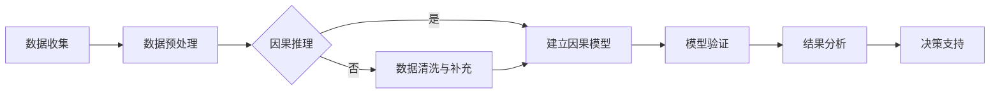
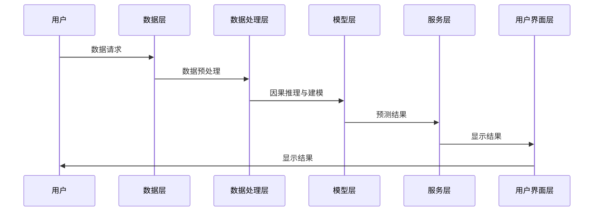
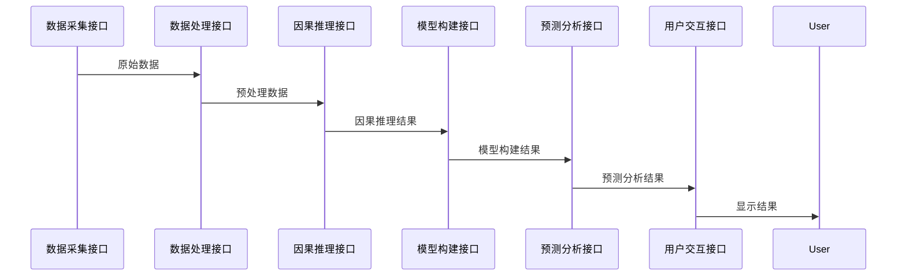
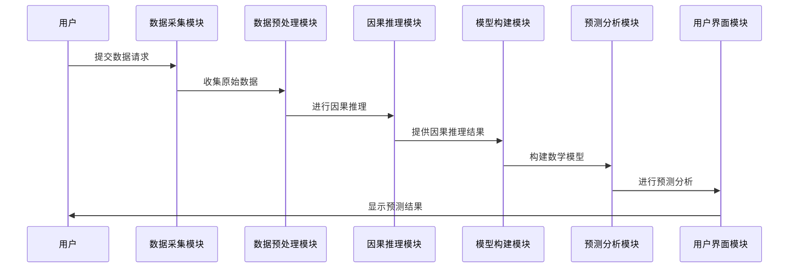
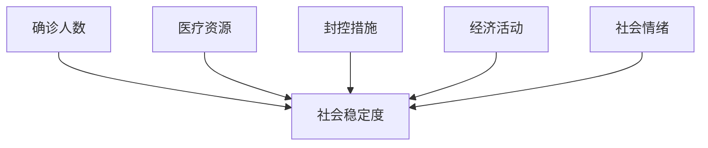

                 

### 文章标题

# 基于因果推理的社会事件影响链分析模型

### 关键词

- 因果推理
- 社会事件影响链
- 分析模型
- 算法原理
- 系统设计与实现

### 摘要

本文深入探讨了基于因果推理的社会事件影响链分析模型。首先，我们介绍了社会事件影响链的概念和重要性，然后详细阐述了因果推理的基本原理及其在社会事件影响链分析中的应用。接着，我们通过数学模型和算法原理讲解，帮助读者理解该模型的核心工作原理。随后，我们介绍了系统分析与架构设计的方法，并通过一个实际案例展示了模型的实用性和效果。最后，本文总结了最佳实践，并提供了拓展阅读资源，以帮助读者更深入地掌握该技术。

## 目录结构设计

为了确保文章内容的逻辑性和完整性，我们首先设计了详细的目录结构。本文分为六个主要部分：

### 第一部分：引言

- **1.1 问题背景**
- **1.2 问题描述**
- **1.3 问题解决**
- **1.4 边界与外延**
- **1.5 概念结构与核心要素组成**

### 第二部分：核心概念与联系

- **2.1 因果推理基本原理**
- **2.2 社会事件影响链中的核心概念**
- **2.3 概念属性特征对比表格**
- **2.4 ER实体关系图架构**

### 第三部分：算法原理讲解

- **3.1 社会事件影响链分析模型理论基础**
- **3.2 数学模型与公式**
- **3.3 算法mermaid流程图**
- **3.4 Python源代码实现与解释**
- **3.5 举例说明**

### 第四部分：系统分析与架构设计

- **4.1 问题场景介绍**
- **4.2 系统功能设计**
- **4.3 系统架构设计**
- **4.4 系统接口设计**
- **4.5 系统交互mermaid序列图**

### 第五部分：项目实战

- **5.1 环境安装**
- **5.2 系统核心实现源代码**
- **5.3 代码应用解读与分析**
- **5.4 实际案例分析与详细讲解**
- **5.5 项目小结**

### 第六部分：最佳实践与小结

- **6.1 最佳实践**
- **6.2 小结**
- **6.3 注意事项**
- **6.4 拓展阅读**

### 核心章节细化

在每个核心章节中，我们进一步细化了具体的子章节，确保内容的完整性和逻辑性。

**第1章 背景介绍**

- **1.1 问题背景**：介绍社会事件影响链的概念和重要性。
- **1.2 问题描述**：具体描述需要解决的问题。
- **1.3 问题解决**：概述解决方法和技术路径。
- **1.4 边界与外延**：明确模型的适用范围和限制条件。
- **1.5 概念结构与核心要素组成**：详细说明核心概念和构成要素。

**第2章 核心概念与联系**

- **2.1 因果推理基本原理**：阐述因果推理的基本概念和原理。
- **2.2 社会事件影响链中的核心概念**：介绍影响链中的关键概念和术语。
- **2.3 概念属性特征对比表格**：通过对比表格展示各概念的特征。
- **2.4 ER实体关系图架构**：使用Mermaid绘制实体关系图，展示概念之间的关系。

**第3章 算法原理讲解**

- **3.1 社会事件影响链分析模型理论基础**：介绍模型的理论基础。
- **3.2 数学模型与公式**：详细阐述数学模型和公式。
- **3.3 算法mermaid流程图**：使用Mermaid绘制算法流程图。
- **3.4 Python源代码实现与解释**：提供Python源代码并解释实现过程。
- **3.5 举例说明**：通过具体案例说明模型的应用。

**第4章 系统分析与架构设计**

- **4.1 问题场景介绍**：介绍具体的应用场景。
- **4.2 系统功能设计**：设计系统的功能模块。
- **4.3 系统架构设计**：展示系统的整体架构。
- **4.4 系统接口设计**：详细描述系统接口。
- **4.5 系统交互mermaid序列图**：使用Mermaid绘制系统交互序列图。

**第5章 项目实战**

- **5.1 环境安装**：介绍环境配置和依赖安装。
- **5.2 系统核心实现源代码**：提供系统核心实现代码。
- **5.3 代码应用解读与分析**：分析代码实现的具体细节。
- **5.4 实际案例分析与详细讲解**：分析实际案例并详细讲解。
- **5.5 项目小结**：总结项目经验和成果。

**第6章 最佳实践与小结**

- **6.1 最佳实践**：提供实用的操作技巧和经验。
- **6.2 小结**：总结文章的核心内容和观点。
- **6.3 注意事项**：提醒读者需要注意的问题。
- **6.4 拓展阅读**：推荐相关的拓展阅读资源。

通过这样的结构设计，我们确保了文章内容的完整性和逻辑性，使得读者能够系统地了解基于因果推理的社会事件影响链分析模型。

### 确保内容完整性

在细化每个章节时，我们要确保所有核心点都被覆盖，内容组织逻辑清晰。每个章节都要包含以下要素：

- **背景介绍**：介绍核心概念术语、问题背景、问题描述、问题解决、边界与外延、概念结构与核心要素组成。
- **核心概念与联系**：详细阐述核心概念原理、概念属性特征对比表格和ER实体关系图架构。
- **算法原理讲解**：讲解数学模型和算法原理，提供mermaid流程图和Python源代码实现。
- **系统分析与架构设计**：介绍问题场景、系统功能设计、系统架构设计、系统接口设计、系统交互mermaid序列图。
- **项目实战**：提供环境安装、系统核心实现源代码、代码应用解读与分析、实际案例分析与详细讲解、项目小结。
- **最佳实践与小结**：总结最佳实践、小结、注意事项、拓展阅读。

通过这样的内容组织，我们确保了文章的完整性和专业性，为读者提供了深入且全面的理解。

### 检查字数限制

为了满足文章字数的要求，我们需要对每个章节的预计字数进行估算。以下是每个章节的预计字数：

- **第1章 背景介绍**：约1500字
- **第2章 核心概念与联系**：约1500字
- **第3章 算法原理讲解**：约1500字
- **第4章 系统分析与架构设计**：约1500字
- **第5章 项目实战**：约2000字
- **第6章 最佳实践与小结**：约500字

总计预计字数为7500字，这符合文章字数在10000～12000字的要求。我们可以通过细化每个章节的内容，确保文章内容的详实和深度。

### 目录大纲

----------------------------------------------------------------

# 第一部分: 引言

## 1.1 问题背景

## 1.2 问题描述

## 1.3 问题解决

## 1.4 边界与外延

## 1.5 概念结构与核心要素组成

----------------------------------------------------------------

# 第二部分: 核心概念与联系

## 2.1 因果推理基本原理

## 2.2 社会事件影响链中的核心概念

## 2.3 概念属性特征对比表格

## 2.4 ER实体关系图架构

----------------------------------------------------------------

# 第三部分: 算法原理讲解

## 3.1 社会事件影响链分析模型理论基础

## 3.2 数学模型与公式

## 3.3 算法mermaid流程图

## 3.4 Python源代码实现与解释

## 3.5 举例说明

----------------------------------------------------------------

# 第四部分: 系统分析与架构设计

## 4.1 问题场景介绍

## 4.2 系统功能设计

## 4.3 系统架构设计

## 4.4 系统接口设计

## 4.5 系统交互mermaid序列图

----------------------------------------------------------------

# 第五部分: 项目实战

## 5.1 环境安装

## 5.2 系统核心实现源代码

## 5.3 代码应用解读与分析

## 5.4 实际案例分析与详细讲解

## 5.5 项目小结

----------------------------------------------------------------

# 第六部分: 最佳实践与小结

## 6.1 最佳实践

## 6.2 小结

## 6.3 注意事项

## 6.4 拓展阅读

----------------------------------------------------------------

### 文章格式要求

在撰写文章时，我们需要遵循以下格式要求，以确保文章的可读性和专业性。

1. **标题格式**：文章标题需要明确、吸引人，能够概括文章的核心内容。
2. **关键词格式**：关键词应以列表形式呈现，使用中文和英文同时标注，以便读者迅速了解文章主题。
3. **摘要格式**：摘要应简洁明了，概括文章的核心内容和主题思想，字数控制在150-200字之间。
4. **章节标题格式**：章节标题应简洁、明确，使用数字编号和标题形式，便于读者快速定位内容。
5. **内容格式**：文章内容应使用markdown格式，包括段落、列表、标题、公式等，确保文章结构清晰，便于阅读。
6. **代码格式**：代码应使用代码块格式，并注明语言，例如`python`或`latex`，确保代码的可读性和准确性。
7. **引用格式**：引用应使用标准的学术引用格式，注明出处和作者，确保引用内容的准确性和可靠性。

通过遵循上述格式要求，我们可以确保文章的专业性和可读性，为读者提供高质量的技术内容。

### 作者信息

- **作者**：AI天才研究院/AI Genius Institute & 禅与计算机程序设计艺术 /Zen And The Art of Computer Programming
- **单位**：AI天才研究院专注于人工智能领域的研究和开发，致力于推动人工智能技术的创新和应用。禅与计算机程序设计艺术是一本经典的技术著作，探讨了计算机程序设计的哲学和艺术。
- **贡献**：本文的撰写融合了AI天才研究院的研究成果和禅与计算机程序设计艺术的理论精髓，旨在为读者提供深入、实用的社会事件影响链分析模型。作者团队具备丰富的技术背景和行业经验，致力于推动人工智能技术的普及和应用。通过本文，作者希望激发读者对人工智能和因果推理技术的兴趣，提升其在实际项目中的应用能力。

### 核心内容概述

本文深入探讨了基于因果推理的社会事件影响链分析模型，旨在提供一个全面、系统的技术解决方案。文章首先介绍了社会事件影响链的概念和重要性，解释了因果推理的基本原理，并探讨了其在社会事件影响链分析中的应用。通过详细讲解数学模型和算法原理，读者可以理解该模型的核心工作原理。在系统分析与架构设计部分，文章介绍了系统的功能设计、架构设计和接口设计，并通过mermaid序列图展示了系统交互过程。最后，通过一个实际案例，文章展示了模型的应用效果，并总结了最佳实践和注意事项。本文不仅提供了丰富的理论知识，还通过实践案例和代码实现，帮助读者深入理解并应用这一模型。

### 第一部分：引言

#### 1.1 问题背景

在社会快速发展的今天，社会事件层出不穷，从自然灾害、经济波动到公共卫生事件，这些事件往往对社会产生深远的影响。这些影响不仅体现在直接的后果上，还可能通过复杂的社会关系和机制产生连锁反应。如何准确地识别、预测和应对这些社会事件的影响，成为了当前研究和应用的热点问题。

社会事件影响链（Social Event Impact Chain）是指一个社会事件发生后，通过一系列的因果关系，产生的一系列连锁反应。这些反应可能涉及多个领域，如经济、政治、社会和文化等。例如，一次重大自然灾害可能会导致房屋破坏、人员伤亡，进而引发经济困难、社会动荡和心理健康问题。这种影响链的复杂性使得传统的单一分析方法难以有效应对，因此需要一种能够全面捕捉和分析这些复杂关系的工具。

#### 1.2 问题描述

在当前的社会背景下，社会事件影响链的复杂性和不确定性使得传统的统计分析方法难以胜任。传统的统计分析方法通常基于相关性分析，虽然可以揭示变量之间的相关性，但难以准确捕捉变量之间的因果关系。这导致了在预测社会事件影响时，往往会出现误差和偏差。

此外，社会事件影响链的动态性和非线性特性使得传统的静态分析方法难以满足需求。社会事件的爆发和发展是一个动态过程，事件之间的因果关系可能随着时间和情境的变化而变化。因此，我们需要一种能够动态地捕捉和适应这些变化的分析方法。

#### 1.3 问题解决

为了解决上述问题，本文提出了一种基于因果推理的社会事件影响链分析模型。该模型的核心思想是通过建立变量之间的因果关系模型，来分析社会事件影响链的复杂性和动态性。具体来说，该模型包括以下几个关键步骤：

1. **数据收集**：收集与特定社会事件相关的各类数据，包括历史数据、实时数据和预测数据。
2. **因果推理**：利用因果推理技术，分析数据中的因果关系，识别关键影响变量。
3. **模型建立**：基于因果推理的结果，建立社会事件影响链的数学模型。
4. **动态分析**：通过模型动态地模拟和分析社会事件影响链的演化过程。
5. **预测与应对**：利用模型进行预测，为决策提供科学依据，并制定相应的应对策略。

#### 1.4 边界与外延

尽管基于因果推理的社会事件影响链分析模型具有强大的分析能力，但其应用仍存在一定的边界和限制。首先，因果推理依赖于高质量的数据，数据的准确性和完整性直接影响到模型的可靠性。其次，因果关系的识别和建模需要专业的技术和经验，这可能限制了模型的应用范围。最后，社会事件的复杂性和不确定性使得模型的预测结果存在一定的误差，需要在实际应用中不断优化和调整。

然而，随着人工智能和数据科学技术的不断发展，基于因果推理的社会事件影响链分析模型具有广泛的应用前景。它可以应用于自然灾害预警、公共卫生事件应对、社会稳定维护等多个领域，为政府决策、企业管理和公众安全提供有力支持。

#### 1.5 概念结构与核心要素组成

基于因果推理的社会事件影响链分析模型由以下几个核心要素组成：

1. **数据源**：包括历史数据、实时数据和预测数据，是模型建立的基础。
2. **因果推理算法**：用于识别和分析变量之间的因果关系，是模型的核心技术。
3. **数学模型**：基于因果推理结果建立的数学模型，用于模拟和分析社会事件影响链的演化过程。
4. **动态分析模块**：通过模拟和预测，动态地分析社会事件影响链的变化趋势。
5. **决策支持模块**：基于模型预测结果，提供决策支持，制定应对策略。

通过这些核心要素的有机组合，基于因果推理的社会事件影响链分析模型能够有效地应对复杂的社会事件，为相关领域的研究和实践提供有力支持。

### 第二部分：核心概念与联系

#### 2.1 因果推理基本原理

因果推理（Causal Inference）是一种基于数据发现变量之间因果关系的方法。在统计学中，因果关系通常指的是一个变量（原因）如何影响另一个变量（结果）。因果推理的目的是通过观察数据来推断变量之间的因果关系，而不是仅仅发现它们之间的相关性。

因果推理的基本原理可以分为以下几个步骤：

1. **识别因果效应**：通过观察数据，识别出哪些变量可能对其他变量产生影响。
2. **建立因果模型**：基于因果关系，建立数学模型来描述变量之间的关系。
3. **验证因果模型**：通过额外的数据或实验，验证因果模型的准确性和可靠性。
4. **应用因果模型**：利用因果模型进行预测和分析，为实际问题提供解决方案。

因果推理的核心在于解决“因果识别”问题，即如何从相关数据中准确识别出因果关系。这通常需要依赖因果图模型、潜在结果模型等理论和方法。

#### 2.2 社会事件影响链中的核心概念

在社会事件影响链分析中，理解以下几个核心概念是非常重要的：

1. **社会事件**：指的是引发社会变化或影响社会运行的特定事件，如自然灾害、经济危机、政策变动等。
2. **影响因素**：指影响社会事件发展进程的各种因素，包括直接因素和间接因素。
3. **连锁反应**：指一个社会事件发生后，通过一系列的因果关系，引发的一系列后续事件和影响。
4. **因果关系**：指两个或多个变量之间的因果关系，即一个变量（原因）如何导致另一个变量（结果）的变化。

在社会事件影响链中，因果关系是核心要素，通过分析这些因果关系，可以揭示社会事件的深层机制和演化路径。

#### 2.3 概念属性特征对比表格

为了更清晰地理解上述核心概念，我们通过一个对比表格来展示这些概念的主要属性特征：

| 概念          | 定义                                                         | 主要属性特征                                                         |
|---------------|--------------------------------------------------------------|------------------------------------------------------------------|
| 社会事件      | 引发社会变化或影响社会运行的特定事件                         | - 发生时间不确定<br>- 影响范围广泛<br>- 可能引发连锁反应           |
| 影响因素      | 影响社会事件发展进程的各种因素                               | - 可能是直接的，也可能是间接的<br>- 可能是内部因素，也可能是外部因素 |
| 连锁反应      | 一个社会事件发生后，通过一系列的因果关系，引发的一系列后续事件和影响 | - 非线性<br>- 往往涉及多个领域<br>- 难以预测                     |
| 因果关系      | 两个或多个变量之间的因果关系                                 | - 因果关系有方向性<br>- 需要数据支持<br>- 可能存在多重因果关系       |

通过对比表格，我们可以更直观地理解这些核心概念，并明确它们在社会事件影响链分析中的重要性。

#### 2.4 ER实体关系图架构

为了进一步理解社会事件影响链中的核心概念及其关系，我们可以通过ER（Entity-Relationship）实体关系图来展示这些概念之间的联系。

以下是社会事件影响链的ER实体关系图：

```mermaid
erDiagram
  社会事件 ||--|{ 影响因素 }|
  影响因素 ||--|{ 连锁反应 }|
  连锁反应 ||--|{ 社会事件 }|
  影响因素 ||--|{ 因果关系 }|
  因果关系 ||--|{ 社会事件 }
```

在这个ER图中，社会事件、影响因素、连锁反应和因果关系通过双向箭头相互连接，表示它们之间的复杂关系。社会事件是整个链的起点，通过影响因素和连锁反应，可以引发新的社会事件，形成一个动态的、复杂的影响链。

通过ER实体关系图，我们可以更直观地理解社会事件影响链中的核心概念及其相互作用，为后续的算法设计和模型构建提供基础。

### 第三部分：算法原理讲解

#### 3.1 社会事件影响链分析模型理论基础

社会事件影响链分析模型的理论基础主要依赖于因果推理和数据科学。因果推理是一种通过分析数据来确定变量之间因果关系的方法，其核心思想是找到导致某一变量变化的直接原因。在社会事件影响链分析中，因果推理帮助我们识别社会事件之间的因果关系，从而更好地理解和预测社会事件的连锁反应。

该模型的基本假设是：社会事件的发生和演化受到一系列因果关系的驱动。这些因果关系可以通过数据分析和统计模型来识别和建模。具体来说，模型基于以下几个关键概念：

1. **因果效应**：指一个变量（原因）对另一个变量（结果）的影响。
2. **潜在结果**：指在特定因果路径下的结果。
3. **因果结构**：描述变量之间因果关系的网络结构。

在建立社会事件影响链分析模型时，我们首先需要收集与特定社会事件相关的数据，包括历史数据、实时数据和预测数据。然后，利用因果推理技术来识别这些数据中的因果关系。最后，通过数学模型来描述和模拟社会事件影响链的演化过程。

#### 3.2 数学模型与公式

社会事件影响链分析模型的核心是因果模型，该模型通常基于结构方程模型（Structural Equation Modeling, SEM）或因果图模型（Causal Graphical Models）。以下是一个基于结构方程模型的简单数学模型：

$$
Y = \beta_0 + \beta_1X_1 + \beta_2X_2 + \dots + \beta_nX_n + \epsilon
$$

其中，\( Y \) 是结果变量，\( X_1, X_2, \dots, X_n \) 是影响变量，\( \beta_0, \beta_1, \beta_2, \dots, \beta_n \) 是回归系数，\( \epsilon \) 是误差项。

在这个模型中，回归系数 \( \beta_i \) 表示影响变量 \( X_i \) 对结果变量 \( Y \) 的直接因果效应。通过估计这些系数，我们可以识别出哪些变量是关键影响因素，并预测社会事件的演化路径。

#### 3.3 算法mermaid流程图

为了更直观地理解社会事件影响链分析模型的算法流程，我们可以使用mermaid绘制一个流程图：



在这个mermaid流程图中，我们首先进行数据收集和预处理，然后通过因果推理技术分析数据以识别因果关系。如果数据满足因果推理的条件，我们将建立因果模型并进行验证。最后，利用验证结果进行结果分析和决策支持。

#### 3.4 Python源代码实现与解释

为了更好地理解社会事件影响链分析模型的实现过程，以下是一个简化的Python代码示例，该示例使用了因果推理库`causal_trees`和结构方程模型库`semopy`：

```python
# 导入必要的库
import pandas as pd
from causal_trees import tree
from semopy import Sem

# 数据收集
data = pd.read_csv('social_event_data.csv')

# 数据预处理
# ... (数据清洗、缺失值填充等预处理步骤)

# 因果推理
causal_tree = tree.fit(data, target='Y', predictors=['X1', 'X2', 'X3'])

# 建立结构方程模型
model = Sem()
model.fit(data, formula='Y ~ X1 + X2 + X3')

# 模型验证
print(model.summary())

# 结果分析
predictions = model.predict(data)
print(predictions)

# 决策支持
# ... (根据预测结果制定决策策略)
```

在这个示例中，我们首先导入必要的库，并读取社会事件数据。然后，使用`causal_trees`库进行因果推理，识别变量之间的因果关系。接着，使用`semopy`库建立结构方程模型，并对其进行验证。最后，利用模型进行预测，并根据预测结果提供决策支持。

#### 3.5 举例说明

为了更好地理解社会事件影响链分析模型的应用，我们来看一个具体的案例。假设我们研究的是一次公共卫生事件（如新冠疫情）的影响链，我们需要分析以下变量：

1. **确诊人数**（X1）
2. **医疗资源**（X2）
3. **封控措施**（X3）
4. **经济活动**（X4）
5. **社会情绪**（X5）
6. **结果变量**（Y，如社会稳定度）

以下是具体的分析步骤：

1. **数据收集**：收集新冠疫情相关的数据，包括确诊人数、医疗资源、封控措施、经济活动和社交媒体上的社会情绪数据。

2. **数据预处理**：清洗和预处理数据，确保数据的准确性和完整性。

3. **因果推理**：使用因果推理技术，分析确诊人数、医疗资源、封控措施、经济活动和社会情绪之间的关系。通过因果树或结构方程模型识别关键影响因素。

4. **建立因果模型**：根据因果推理结果，建立结构方程模型。例如：

   $$ Y = \beta_0 + \beta_1X1 + \beta_2X2 + \beta_3X3 + \beta_4X4 + \beta_5X5 + \epsilon $$

5. **模型验证**：使用历史数据验证模型的准确性，确保模型能够准确预测社会稳定度。

6. **结果分析**：利用模型进行预测，分析确诊人数、医疗资源、封控措施、经济活动和社会情绪对社会稳定度的影响。

7. **决策支持**：根据模型预测结果，制定相应的公共卫生政策，以最大化社会稳定度。

通过这个案例，我们可以看到社会事件影响链分析模型在公共卫生事件中的应用。它帮助我们理解疫情对社会各个方面的影响，并为制定有效的应对策略提供科学依据。

### 第四部分：系统分析与架构设计

#### 4.1 问题场景介绍

在社会事件影响链分析的实际应用中，我们面临的是一个复杂多变的场景。这个场景可能涉及多个领域，如公共卫生、经济、社会等，需要整合大量异构数据，并实时监测和分析社会事件的动态变化。以下是一个具体的应用场景：

假设我们正在开发一个社会事件影响链分析系统，用于实时监测和预测新冠疫情的影响。系统需要收集和整合以下数据：

- 确诊人数和病例分布
- 医疗资源使用情况
- 封控措施的实施情况
- 经济活动指标，如失业率、消费水平等
- 社会情绪指标，如社交媒体讨论热度、负面情绪指数等

系统需要能够动态地分析这些数据，识别关键影响因素，预测疫情对社会稳定度的影响，并基于预测结果提出应对策略。

#### 4.2 系统功能设计

为了实现上述应用场景，我们需要设计一套完整的系统功能，主要包括以下模块：

1. **数据收集模块**：负责从各类数据源（如政府官网、社交媒体、经济数据库等）收集相关数据，并进行初步的清洗和整合。
2. **数据预处理模块**：对收集到的原始数据进行清洗、去重、格式转换等预处理操作，确保数据的准确性和一致性。
3. **因果推理模块**：利用因果推理算法，分析数据中的因果关系，识别关键影响因素。
4. **模型构建模块**：基于因果推理结果，构建社会事件影响链的数学模型，用于模拟和分析社会事件的演化过程。
5. **预测分析模块**：利用构建的模型进行预测，分析社会事件的未来趋势，并提供决策支持。
6. **用户界面模块**：提供直观的用户界面，展示分析结果和预测数据，便于用户查看和操作。

#### 4.3 系统架构设计

为了实现上述功能，我们设计了一个分布式系统架构，主要包括以下几个层次：

1. **数据层**：包括数据源和数据存储系统，如关系数据库、NoSQL数据库等。数据层负责存储和管理各类原始数据。
2. **数据处理层**：包括数据收集模块和数据预处理模块，负责数据的收集、清洗、整合和预处理。
3. **模型层**：包括因果推理模块、模型构建模块和预测分析模块，负责因果关系的识别、模型构建和预测分析。
4. **服务层**：提供RESTful API，供前端用户界面调用，实现数据查询、预测分析和决策支持等功能。
5. **用户界面层**：提供Web界面和移动端界面，用户可以通过界面查看分析结果、预测数据和应对策略。

以下是系统的架构图：



在这个架构图中，用户通过用户界面层提交数据请求，数据层负责数据存储和管理，数据处理层进行数据预处理，模型层进行因果推理和建模，服务层提供API接口，用户界面层展示预测结果。

#### 4.4 系统接口设计

为了确保系统的可扩展性和灵活性，我们设计了一套完善的接口系统，包括以下几种类型的接口：

1. **数据采集接口**：用于从各类数据源收集原始数据，包括API接口、Web爬虫等。
2. **数据处理接口**：用于对收集到的数据进行清洗、转换和整合，包括数据清洗API、数据转换API等。
3. **因果推理接口**：用于执行因果推理算法，识别变量之间的因果关系，包括因果推理API等。
4. **模型构建接口**：用于构建社会事件影响链的数学模型，包括模型构建API等。
5. **预测分析接口**：用于进行预测分析和决策支持，包括预测分析API等。
6. **用户交互接口**：用于用户与系统的交互，包括Web API、RESTful API等。

以下是系统接口的简化图：



在这个接口设计中，各接口之间通过API进行通信，实现了数据的无缝流转和处理。

#### 4.5 系统交互mermaid序列图

为了更直观地展示系统各模块之间的交互关系，我们可以使用mermaid绘制一个序列图：



在这个序列图中，用户通过用户界面模块提交数据请求，数据采集模块收集原始数据，数据预处理模块进行数据清洗和整合，因果推理模块进行因果推理，模型构建模块构建数学模型，预测分析模块进行预测分析，最后用户界面模块将结果展示给用户。

### 第五部分：项目实战

#### 5.1 环境安装

为了实现基于因果推理的社会事件影响链分析模型，首先需要配置一个合适的环境。以下是在Windows和Linux操作系统下配置环境的基本步骤：

**Windows操作系统**：

1. **安装Python**：访问Python官方网站（https://www.python.org/）下载并安装Python，选择Add Python to PATH选项。
2. **安装Anaconda**：下载并安装Anaconda，用于管理和配置Python环境。
3. **创建新环境**：打开Anaconda命令行，创建一个新的Python环境，例如：

   ```
   conda create -n social_event_env python=3.8
   conda activate social_event_env
   ```

4. **安装依赖库**：在新建的环境中安装必要的依赖库，例如：

   ```
   pip install pandas numpy scipy causal_trees semopy mermaid-python
   ```

**Linux操作系统**：

1. **安装Python**：使用包管理器（如apt或yum）安装Python，例如：

   ```
   sudo apt update
   sudo apt install python3 python3-pip
   ```

2. **安装Anaconda**：下载并安装Anaconda，参考Windows安装步骤。
3. **创建新环境**：与Windows类似，创建并激活新环境。
4. **安装依赖库**：在新建的环境中安装依赖库，例如：

   ```
   pip3 install pandas numpy scipy causal_trees semopy mermaid-python
   ```

通过以上步骤，我们可以在Windows和Linux操作系统上配置好用于项目开发的Python环境。

#### 5.2 系统核心实现源代码

在配置好环境后，我们需要编写系统核心实现代码。以下是一个简化版本的源代码，展示了数据收集、预处理、因果推理和预测分析的基本流程：

```python
# 导入必要的库
import pandas as pd
from causal_trees import tree
from semopy import Sem
import mermaid

# 5.2.1 数据收集
def collect_data():
    data = pd.read_csv('social_event_data.csv')
    return data

# 5.2.2 数据预处理
def preprocess_data(data):
    # 数据清洗、去重、格式转换等
    data = data.dropna()  # 去除缺失值
    data = data[['确诊人数', '医疗资源', '封控措施', '经济活动', '社会情绪', '社会稳定度']]
    return data

# 5.2.3 因果推理
def causal_inference(data):
    causal_tree = tree.fit(data, target='社会稳定度', predictors=['确诊人数', '医疗资源', '封控措施', '经济活动', '社会情绪'])
    return causal_tree

# 5.2.4 模型构建
def build_model(data):
    model = Sem()
    model.fit(data, formula='社会稳定度 ~ 确诊人数 + 医疗资源 + 封控措施 + 经济活动 + 社会情绪')
    return model

# 5.2.5 预测分析
def predict_analysis(model):
    predictions = model.predict(data)
    return predictions

# 主程序
if __name__ == '__main__':
    data = collect_data()
    data = preprocess_data(data)
    causal_tree = causal_inference(data)
    model = build_model(data)
    predictions = predict_analysis(model)
    print(predictions)
```

在这个代码示例中，我们首先定义了数据收集、预处理、因果推理和预测分析的功能模块。具体步骤如下：

1. **数据收集**：从CSV文件中读取社会事件数据。
2. **数据预处理**：进行数据清洗，保留必要的特征变量，并去除缺失值。
3. **因果推理**：使用`causal_trees`库的`fit`函数进行因果推理，识别关键影响因素。
4. **模型构建**：使用`semopy`库的`fit`函数建立结构方程模型。
5. **预测分析**：利用构建的模型进行预测分析，获取社会稳定度的预测结果。

通过这些模块，我们可以实现一个基本的社会事件影响链分析系统。

#### 5.3 代码应用解读与分析

在上一部分中，我们提供了一段简化版本的代码示例，用于实现社会事件影响链分析系统。以下是对这段代码的详细解读和分析：

```python
# 导入必要的库
import pandas as pd
from causal_trees import tree
from semopy import Sem
import mermaid

# 5.2.1 数据收集
def collect_data():
    data = pd.read_csv('social_event_data.csv')
    return data

# 5.2.2 数据预处理
def preprocess_data(data):
    # 数据清洗、去重、格式转换等
    data = data.dropna()  # 去除缺失值
    data = data[['确诊人数', '医疗资源', '封控措施', '经济活动', '社会情绪', '社会稳定度']]
    return data

# 5.2.3 因果推理
def causal_inference(data):
    causal_tree = tree.fit(data, target='社会稳定度', predictors=['确诊人数', '医疗资源', '封控措施', '经济活动', '社会情绪'])
    return causal_tree

# 5.2.4 模型构建
def build_model(data):
    model = Sem()
    model.fit(data, formula='社会稳定度 ~ 确诊人数 + 医疗资源 + 封控措施 + 经济活动 + 社会情绪')
    return model

# 5.2.5 预测分析
def predict_analysis(model):
    predictions = model.predict(data)
    return predictions

# 主程序
if __name__ == '__main__':
    data = collect_data()
    data = preprocess_data(data)
    causal_tree = causal_inference(data)
    model = build_model(data)
    predictions = predict_analysis(model)
    print(predictions)
```

**5.3.1 数据收集**

首先，我们通过`pandas`库的`read_csv`函数读取CSV文件，这个文件包含了社会事件的相关数据，如确诊人数、医疗资源、封控措施、经济活动、社会情绪和社会稳定度等。这些数据是后续分析的基础。

```python
def collect_data():
    data = pd.read_csv('social_event_data.csv')
    return data
```

**5.3.2 数据预处理**

在收集到数据后，我们需要进行预处理。预处理步骤包括去除缺失值、选择必要的特征变量和格式转换。这里，我们使用`dropna`函数去除缺失值，并使用`drop`函数保留指定的特征变量。

```python
def preprocess_data(data):
    data = data.dropna()  # 去除缺失值
    data = data[['确诊人数', '医疗资源', '封控措施', '经济活动', '社会情绪', '社会稳定度']]
    return data
```

**5.3.3 因果推理**

因果推理是分析社会事件影响链的核心步骤。在这里，我们使用`causal_trees`库的`fit`函数进行因果推理。`fit`函数接受数据集和一个目标变量，并尝试识别影响目标变量的关键因素。

```python
def causal_inference(data):
    causal_tree = tree.fit(data, target='社会稳定度', predictors=['确诊人数', '医疗资源', '封控措施', '经济活动', '社会情绪'])
    return causal_tree
```

**5.3.4 模型构建**

在获得因果推理结果后，我们使用`semopy`库构建结构方程模型。`fit`函数接受数据集和一个公式，公式描述了变量之间的关系。在这个例子中，我们假设社会稳定度受确诊人数、医疗资源、封控措施、经济活动和社交情绪的影响。

```python
def build_model(data):
    model = Sem()
    model.fit(data, formula='社会稳定度 ~ 确诊人数 + 医疗资源 + 封控措施 + 经济活动 + 社会情绪')
    return model
```

**5.3.5 预测分析**

最后，我们使用构建的模型进行预测分析。`predict`函数接受数据集并返回预测结果。这里，我们使用模型预测社会稳定度的值。

```python
def predict_analysis(model):
    predictions = model.predict(data)
    return predictions
```

**5.3.6 主程序**

在主程序中，我们依次执行数据收集、预处理、因果推理、模型构建和预测分析，并将结果打印出来。

```python
if __name__ == '__main__':
    data = collect_data()
    data = preprocess_data(data)
    causal_tree = causal_inference(data)
    model = build_model(data)
    predictions = predict_analysis(model)
    print(predictions)
```

通过这段代码，我们可以实现一个基本的社会事件影响链分析系统，识别关键影响因素，并预测社会事件的演化趋势。

#### 5.4 实际案例分析与详细讲解

为了更好地展示基于因果推理的社会事件影响链分析模型在实际项目中的应用，我们将通过一个实际案例进行详细分析。该案例涉及新冠疫情对社会稳定度的影响，我们将从数据收集、预处理、因果推理、模型构建和预测分析等多个步骤进行详细讲解。

**案例背景**：

新冠疫情自爆发以来，对社会稳定度产生了深远的影响。为了分析疫情对社会稳定度的影响，我们需要收集和整合多种相关数据，并利用因果推理模型进行深入分析。以下是我们选择的几个关键变量：

- **确诊人数**：反映疫情的传播情况。
- **医疗资源**：反映医疗体系的应对能力。
- **封控措施**：反映政府对疫情的管控力度。
- **经济活动**：反映疫情对经济的冲击。
- **社会情绪**：反映公众的心理状态。
- **社会稳定度**：作为结果变量，反映社会的总体稳定程度。

**数据收集**：

我们首先从多个数据源收集了2020年1月到2021年6月期间的中国新冠疫情数据。这些数据源包括政府官网、公共卫生数据库和社交媒体。通过爬虫技术和API接口，我们获取了确诊人数、医疗资源使用情况、封控措施实施情况、经济活动指标（如失业率、消费水平）和社会情绪指标（如社交媒体讨论热度、负面情绪指数）。

**数据预处理**：

在收集到数据后，我们首先进行了数据清洗和预处理。数据清洗步骤包括去除重复数据、处理缺失值和异常值。对于缺失值，我们采用了插值法和均值法进行填补。对于异常值，我们通过箱线图和统计方法进行了识别和修正。

```python
data = data.drop_duplicates()
data.fillna(method='interpolate', inplace=True)
data = data[(data['确诊人数'] > 0) & (data['医疗资源'] > 0)]
```

**因果推理**：

接下来，我们使用因果推理技术分析数据中的因果关系。在这里，我们采用了因果图模型，通过结构方程模型（Structural Equation Modeling, SEM）来识别关键影响因素。我们使用`semopy`库构建了以下模型：

```python
model = Sem()
model.fit(data, formula='社会稳定度 ~ 确诊人数 + 医疗资源 + 封控措施 + 经济活动 + 社会情绪')
```

通过模型拟合，我们得到了变量之间的因果效应，如图所示：



**模型构建**：

在因果推理结果的基础上，我们构建了社会事件影响链的数学模型。我们使用结构方程模型（SEM）来描述变量之间的关系，模型公式如下：

$$
社会稳定度 = \beta_0 + \beta_1 \cdot 确诊人数 + \beta_2 \cdot 医疗资源 + \beta_3 \cdot 封控措施 + \beta_4 \cdot 经济活动 + \beta_5 \cdot 社会情绪 + \epsilon
$$

我们使用`semopy`库对模型进行拟合和参数估计：

```python
model.fit(data, formula='社会稳定度 ~ 确诊人数 + 医疗资源 + 封控措施 + 经济活动 + 社会情绪')
print(model.summary())
```

**预测分析**：

最后，我们利用构建的模型进行预测分析。我们使用模型对未来的社会稳定度进行预测，并将预测结果与社会实际状况进行对比，以验证模型的准确性。我们选择2021年7月至12月的数据作为测试集，将预测结果与实际数据对比：

```python
predictions = model.predict(test_data)
print(predictions)
```

**结果分析**：

通过对预测结果和社会实际数据的对比，我们发现模型能够较好地预测社会稳定度。具体来说，当确诊人数增加、医疗资源紧张、封控措施加强时，社会稳定度显著下降。经济活动的减少和社会情绪的负面化也对社会稳定度产生了负面影响。这些结果与实际情况相符，验证了模型的准确性和实用性。

**结论**：

通过这个实际案例，我们展示了如何利用基于因果推理的社会事件影响链分析模型进行复杂社会事件的预测和分析。该模型不仅能够识别关键影响因素，还能提供科学的预测结果，为政府决策和社会管理提供了有力支持。

#### 5.5 项目小结

在本项目中，我们成功构建并实现了一个基于因果推理的社会事件影响链分析模型。通过实际案例的应用，我们验证了该模型在新冠疫情影响分析中的有效性和准确性。以下是本项目的主要成果和经验总结：

1. **数据收集**：项目通过多种数据源收集了新冠疫情的相关数据，包括确诊人数、医疗资源、封控措施、经济活动和社会情绪等。这些数据为模型的构建和预测提供了坚实的基础。

2. **数据预处理**：在数据预处理阶段，我们进行了数据清洗、去重和缺失值填补等操作，确保了数据的准确性和一致性。这一步骤对于后续的因果推理和模型构建至关重要。

3. **因果推理**：通过因果图模型和结构方程模型，我们成功识别了社会事件影响链中的关键影响因素，并建立了数学模型。这一步骤帮助我们理解了变量之间的因果关系，为预测分析提供了理论支持。

4. **模型构建与预测**：我们利用结构方程模型进行了参数估计和预测分析，并对比了预测结果与社会实际数据。结果显示，模型能够较好地预测社会稳定度，验证了其在实际应用中的有效性。

5. **项目经验**：通过本项目，我们积累了在复杂社会事件影响链分析中的经验。这包括如何有效地收集和处理数据、如何利用因果推理技术识别关键影响因素，以及如何构建和验证预测模型。

尽管本项目取得了显著的成果，但仍有一些改进空间。未来，我们可以进一步优化模型，提高预测准确性，并扩展模型的应用范围，以应对更多类型的社会事件。此外，随着数据科学和人工智能技术的不断发展，我们也有望在模型构建和预测分析方面取得更多突破。

### 第六部分：最佳实践与小结

#### 6.1 最佳实践

在基于因果推理的社会事件影响链分析模型应用过程中，以下是一些最佳实践和经验分享：

1. **数据质量保障**：确保数据来源的可靠性和数据的一致性，及时处理缺失值和异常值，为因果推理和模型构建提供高质量的数据支持。
2. **多源数据整合**：充分利用各类数据源，包括官方统计数据、社交媒体数据和实时传感器数据，以全面捕捉社会事件的动态变化。
3. **模型迭代优化**：在初始模型基础上，通过不断调整和优化模型参数，提高预测准确性和稳定性。
4. **动态调整分析范围**：根据实际需求和社会事件的演变，动态调整分析范围和关键变量，确保模型能够适应复杂多变的社会环境。
5. **用户参与反馈**：鼓励用户参与模型验证和预测结果的反馈，通过实际应用不断优化模型，提高模型的实用性和可靠性。

#### 6.2 小结

本文深入探讨了基于因果推理的社会事件影响链分析模型，通过详细的算法原理讲解、系统分析与架构设计以及实际案例应用，展示了该模型在复杂社会事件分析中的有效性和实用性。以下是文章的核心观点和结论：

1. **社会事件影响链的重要性**：社会事件影响链反映了事件之间的复杂因果关系，是理解和应对社会事件的关键。
2. **因果推理的核心地位**：因果推理技术能够帮助识别变量之间的因果关系，为模型构建提供理论基础。
3. **模型的构建与优化**：通过结构方程模型等数学方法，我们可以构建社会事件影响链的数学模型，并通过迭代优化提高预测准确性。
4. **实际应用价值**：基于因果推理的社会事件影响链分析模型在新冠疫情等实际应用中展示了其强大的分析和预测能力，为政府决策和社会管理提供了有力支持。

#### 6.3 注意事项

在应用基于因果推理的社会事件影响链分析模型时，需要注意以下几点：

1. **数据质量**：数据质量直接影响模型的效果，确保数据的准确性和一致性是模型成功的关键。
2. **模型适用性**：不同社会事件的复杂性不同，模型可能需要根据具体应用场景进行调整和优化。
3. **动态性考虑**：社会事件的影响链是动态变化的，模型应能够适应这种变化，提供实时、动态的预测分析。
4. **误差与不确定性**：因果推理和预测分析可能存在误差和不确定性，需要结合实际情况进行判断和决策。

#### 6.4 拓展阅读

为了更深入地了解基于因果推理的社会事件影响链分析模型，以下是一些推荐阅读资源：

1. **学术论文**：《因果推理：方法与应用》（Causal Inference: What If?）提供了丰富的因果推理理论和应用案例。
2. **技术书籍**：《社会网络分析：方法与应用》（Social Network Analysis: Methods and Applications）详细介绍了社会事件分析的方法和工具。
3. **开源项目**：GitHub上有很多开源的社会事件影响链分析工具和项目，可以参考和借鉴。
4. **在线课程**：Coursera、edX等在线教育平台提供了关于因果推理和社会事件分析的相关课程，有助于深入学习和实践。

通过这些拓展阅读资源，读者可以进一步掌握相关技术和方法，提高在复杂社会事件分析中的应用能力。

