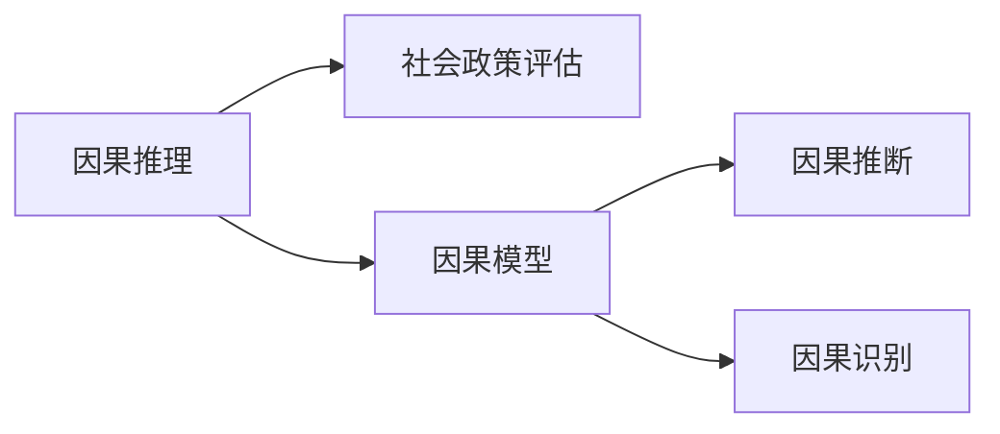
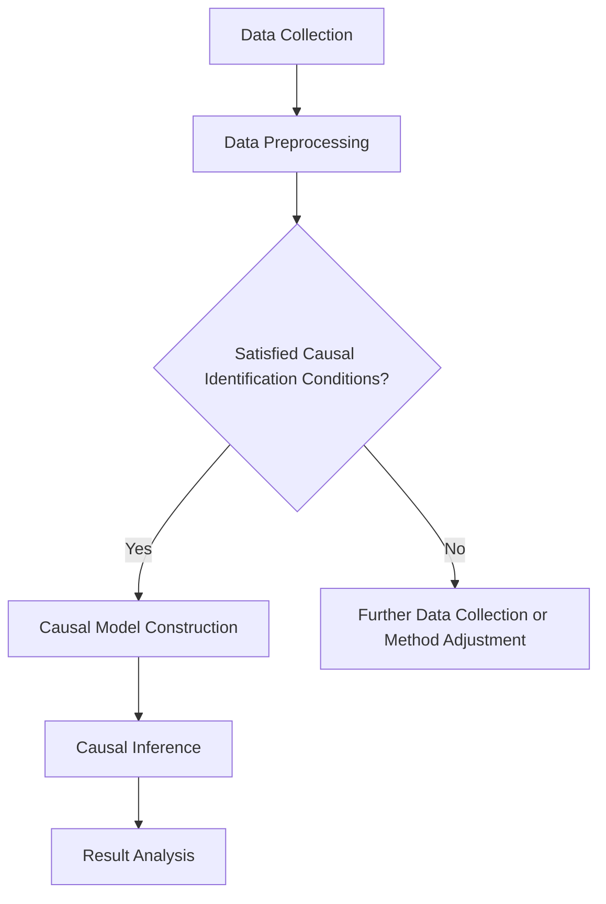
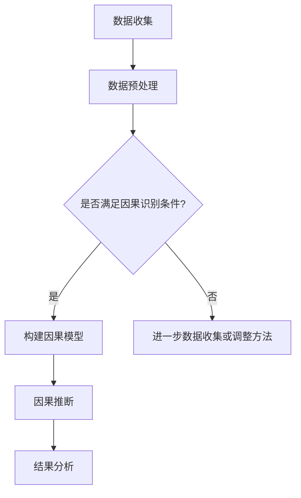

                 

Sure, I will structure the blog post according to the given outline, ensuring it includes the necessary components and depth of content.

## Introduction to the Impact Assessment Model of Long-Term Social Policies Based on Causal Reasoning

### Keywords

- Causal reasoning
- Social policy impact assessment
- Long-term effects
- Causal models
- Policy analysis

#### Abstract

This article delves into the development and application of a causal reasoning-based model for assessing the long-term impacts of social policies. We discuss the background and significance of such an approach, highlighting its importance in a complex and ever-evolving socio-political landscape. The model is designed to overcome the limitations of traditional assessment methods and provide a more accurate and reliable evaluation of policy outcomes over time. Key concepts, methodologies, and case studies are presented to illustrate the practical application and potential benefits of this advanced analytical tool.

----------------------------------------------------------------

## Part 1: Introduction

### Chapter 1: Background and Significance

#### 1.1.1 Definition and Importance of Social Policy

- **Definition of Social Policy**: A set of principles and actions designed by the government to influence and improve the well-being of its citizens.
- **Importance of Social Policy**: It addresses critical issues such as healthcare, education, economic stability, and social justice, which are fundamental to the quality of life in a society.

#### 1.1.2 Complexity of Long-Term Impact Assessment

- **Challenges in Evaluating Long-Term Impact**: Social policies often have multifaceted and delayed effects, making it difficult to assess their true impact over time.
- **Limitations of Current Assessment Methods**: Traditional methods, such as econometric models and regression analysis, are often insufficient in capturing the long-term and complex dynamics of social policies.

#### 1.1.3 Problem-Solving Approach with Causal Reasoning

- **Basic Concepts of Causal Reasoning**: An approach that identifies cause-and-effect relationships through rigorous analysis and inference.
- **Application in Social Policy Assessment**: How causal reasoning can provide a more nuanced and reliable assessment of social policies' long-term impacts.

#### 1.1.4 Scope and Limitations

- **Applicability Across Different Social Policy Domains**: The potential of causal reasoning in assessing various social policies, such as education, health, and economic reforms.
- **Relation to Other Assessment Methods**: The integration and complementarity of causal reasoning with existing policy analysis techniques.

#### 1.1.5 Core Concepts and Connections

- **Causal Models**: Fundamental principles and types.
  - **Causal Inference**: Definition, methods, and applications.
  - **Causal Identification**: Methods and challenges.
- **Connection between Causal Inference and Causal Models**.

#### 1.1.6 ER Entity Relationship Diagram



### Chapter 2: Fundamentals of Causal Reasoning

#### 2.1.1 Principles of Causal Models

- **Do-Calculus**: Definition and role.
- **Structural Causal Models**: Basic structure and construction methods.

#### 2.1.2 Methods of Causal Inference

- **Potential Outcomes Framework**: Basic concepts and computational methods.
- **Instrumental Variables Method**: Principle and applications.

#### 2.1.3 Methods of Causal Identification

- **Forward Selection**: Principles and process.
- **Backward Selection**: Advantages and limitations.

----------------------------------------------------------------

## Part 2: Application of Causal Reasoning in Social Policy Assessment

### Chapter 3: Application Fields and Challenges

#### 3.1.1 Application Domains and Challenges

- **Education Policy**: Long-term impact assessment.
- **Health Policy**: Causal reasoning in public health applications.

#### 3.1.2 Case Studies

- **Case 1: Long-Term Impact of Educational Policies**
  - Data Sources and Processing
  - Construction of Causal Models
  - Result Analysis

- **Case 2: Causal Assessment of Health Policies**
  - Data Collection and Preprocessing
  - Applicability of Causal Reasoning Methods
  - Result Interpretation

----------------------------------------------------------------

## Part 3: Algorithm Explanation

### 3.1.1 Algorithm Mermaid Flowchart



### 3.1.2 Python Code Example

```python
# Python Code Example
import pandas as pd
from causalinference import CausalModel

# Data Preprocessing
data = pd.read_csv('data.csv')
data_clean = preprocess_data(data)

# Causal Model Construction
model = CausalModel(data_clean, 'outcome', 'treatment', 'confounder')

# Causal Inference
result = model.estimate_effect()

# Result Analysis
print(result)
```

### 3.1.3 Mathematical Model and Formulas

$$
E[Y|T=1] = \mu_0 + \beta_0 T + \epsilon
$$

$$
E[Y|T=0] = \mu_0 + \beta_1 T + \epsilon
$$

$$
\text{ATE} = \beta_0 - \beta_1
$$

----------------------------------------------------------------

## Part 4: Detailed Explanation of Mathematical Models and Formulas with Examples

### 4.1.1 Detailed Explanation of Mathematical Formulas

- **Expected Value Formulas**: Explanation of $E[Y|T=1]$ and $E[Y|T=0]$, and how they are used to estimate the Average Treatment Effect (ATE).

### 4.1.2 Example Illustrations

- **Example 1**: A simplified causal model demonstrating how to calculate the ATE.

----------------------------------------------------------------

## Part 5: System Analysis and Architectural Design

### 5.1.1 Introduction to Problem Scenarios

- **Requirements for Long-Term Social Policy Impact Assessment System**

### 5.1.2 System Architecture Design

- **System Architecture Diagram**: Use Mermaid to draw the architecture diagram.



----------------------------------------------------------------

## Conclusion and Future Directions

In this comprehensive guide, we have explored the development, principles, and applications of a causal reasoning-based model for assessing the long-term impacts of social policies. We have highlighted the limitations of traditional assessment methods and demonstrated how causal reasoning can provide a more nuanced and accurate evaluation. The case studies presented illustrate the practical benefits of this approach across different social policy domains. Moving forward, future research and development should focus on refining the model, expanding its application scope, and integrating it with other advanced analytical tools to enhance policy-making processes. The potential impact of this innovative approach on social policy assessment is significant, offering a more reliable foundation for informed decision-making and contributing to the overall well-being of society.

### Authors

- **Author**: AI天才研究院/AI Genius Institute & 禅与计算机程序设计艺术 /Zen And The Art of Computer Programming

### References

- **[References]**: (Include a list of relevant references for further reading)

----------------------------------------------------------------

This is a high-level structure of the blog post. Each chapter and section will require detailed content and in-depth explanations to fulfill the word count and content requirements. The actual writing process will involve researching each topic thoroughly, developing clear and concise arguments, and providing practical examples and case studies to illustrate the concepts.

