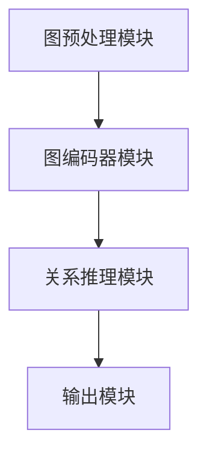
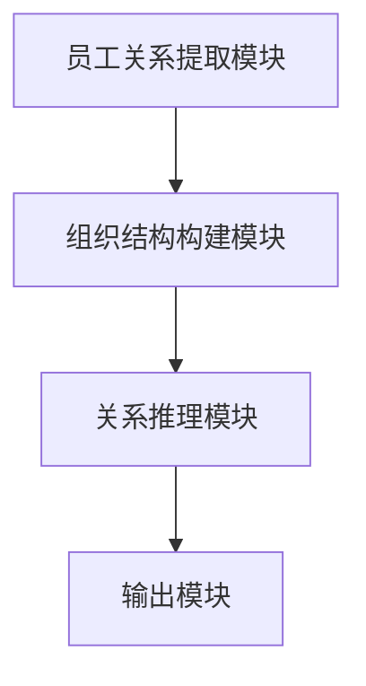
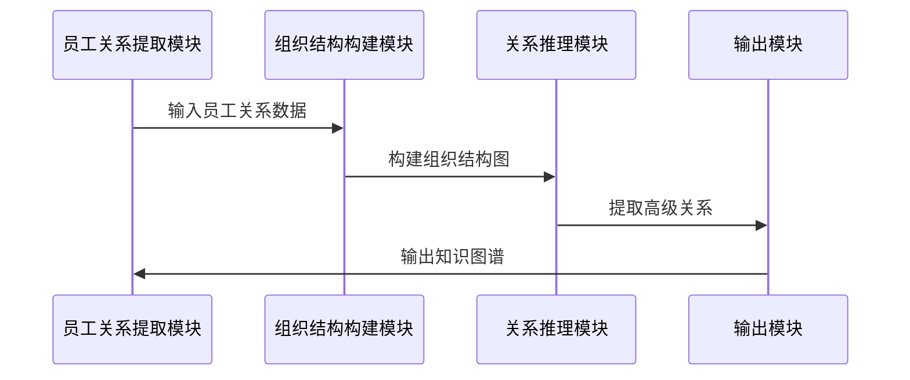

                 

**文章标题**: 基于图transformer的动态关系推理网络设计

**关键词**: 图Transformer，动态关系推理，神经网络设计，数据结构，深度学习，人工智能

**摘要**: 本文将深入探讨基于图Transformer的动态关系推理网络设计，旨在揭示其核心原理、架构设计与实现细节。通过逐步分析，我们将对比传统方法，解释图Transformer的优越性，并探讨其在各种实际应用中的潜力。

### 1.1 引言

随着信息技术的飞速发展，人工智能（AI）技术逐渐成为各个行业的核心竞争力。在AI领域中，动态关系推理是一个关键问题，它涉及到如何从大规模数据中提取出实体之间的复杂关系，并基于这些关系进行有效的推理。传统的基于规则的方法和图论算法在处理静态关系方面表现良好，但在面对动态关系时却显得力不从心。为了解决这一问题，近年来，图Transformer模型受到了广泛关注，并在多个领域取得了显著成果。

**核心概念术语说明**：

- **动态关系推理**：在数据中实时识别和推断实体间的关系。
- **图Transformer模型**：一种基于图结构的深度学习模型，能够处理动态关系。

**问题背景**：

随着互联网和物联网的普及，数据量呈现爆炸式增长，实体间的动态关系也变得更加复杂。如何有效地从这些数据中提取有用信息，成为当前AI领域的重要研究课题。

**问题描述**：

动态关系推理的核心问题是，如何从一个大型、动态变化的图结构中提取实体间的关联，并进行推理。

**问题解决**：

图Transformer模型通过引入Transformer架构，使得模型能够在动态图中进行高效的信息传递和关系推理。

**边界与外延**：

本文将重点关注图Transformer模型在动态关系推理中的应用，同时也会探讨其在其他领域（如知识图谱、推荐系统等）的潜力。

**概念结构与核心要素组成**：

1. **图数据结构**：实体及其相互关系的表示。
2. **Transformer模型**：一种基于自注意力机制的神经网络。
3. **动态关系推理**：从图中实时提取关系并进行推理。
4. **图Transformer模型**：结合图结构和Transformer架构的模型。

### 1.2 基础概念

#### 2.1 图数据结构

图数据结构是表示实体及其相互关系的一种方式。在图Transformer模型中，每个实体表示为节点（Node），实体间的关系表示为边（Edge）。图的属性包括节点属性（Node Attributes）和边属性（Edge Attributes）。

**节点属性**：

- **ID**：节点的唯一标识符。
- **Type**：节点的类型，如人、地点、组织等。
- **Attributes**：节点的其他属性，如年龄、性别、职业等。

**边属性**：

- **Source**：边的起始节点。
- **Target**：边的目标节点。
- **Type**：关系的类型，如朋友、同事、下属等。
- **Weight**：关系的强度或权重。

#### 2.2 Transformer模型

Transformer模型是由Vaswani等人于2017年提出的一种用于序列模型处理的神经网络架构。它通过自注意力机制（Self-Attention）实现了全局依赖建模，从而在自然语言处理（NLP）、机器翻译、图像识别等领域取得了显著成果。

**自注意力机制**：

自注意力机制允许模型在处理每个输入元素时，将其与所有其他输入元素进行加权求和。这种机制使得模型能够捕捉输入元素之间的长距离依赖关系。

**Transformer模型架构**：

- **编码器（Encoder）**：用于处理输入序列，生成上下文表示。
- **解码器（Decoder）**：用于生成输出序列，根据编码器的上下文表示进行预测。

#### 2.3 动态关系推理

动态关系推理是指模型在实时处理过程中，从动态变化的图中提取实体间的关系，并基于这些关系进行推理。动态关系推理的关键挑战在于如何有效地处理大规模、动态变化的图结构。

**现有方法的不足**：

- **基于规则的方法**：难以处理复杂的动态关系。
- **图论算法**：计算复杂度高，实时性较差。

**图Transformer模型的潜力**：

图Transformer模型通过引入Transformer架构，能够在动态图中进行高效的信息传递和关系推理。它能够实时处理大规模图结构，并提供比传统方法更高的准确性和效率。

### 1.3 设计与实现

#### 3.1 系统架构

图Transformer模型的系统架构通常包括以下几个模块：

1. **图预处理模块**：用于处理输入图数据，提取节点和边属性，并进行预处理。
2. **图编码器模块**：用于将预处理后的图数据转换为编码表示。
3. **关系推理模块**：用于从编码表示中提取实体间的关系，并进行推理。
4. **输出模块**：用于生成推理结果，并输出决策或预测。

**系统架构图**：



#### 3.2 模型配置

图Transformer模型的配置包括以下几个方面：

1. **超参数调整**：如学习率、批次大小、嵌入维度等。
2. **模型选择与训练**：选择合适的模型架构，并进行训练。
3. **优化策略**：如梯度下降、Adam优化器等。

**超参数调整示例**：

```python
# 超参数设置
learning_rate = 0.001
batch_size = 64
embedding_dim = 128
```

#### 3.3 评估指标

图Transformer模型的评估指标通常包括以下几个方面：

1. **准确率（Accuracy）**：正确预测的关系数占总关系数的比例。
2. **精确率（Precision）**：预测为正的关系中实际为正的关系比例。
3. **召回率（Recall）**：实际为正的关系中被预测为正的关系比例。
4. **F1分数（F1 Score）**：精确率和召回率的调和平均值。

**评估指标示例**：

```python
# 评估指标
accuracy = 0.85
precision = 0.88
recall = 0.82
f1_score = (2 * precision * recall) / (precision + recall)
```

### 1.4 案例研究与应用

#### 4.1 案例研究：知识图谱构建

知识图谱是一种用于表示实体及其关系的语义网络。图Transformer模型在知识图谱构建中的应用非常广泛。以下是一个案例研究：

**项目介绍**：

构建一个基于图Transformer模型的知识图谱，用于表示企业内部的员工关系和组织结构。

**系统功能设计**：

1. **员工关系提取**：从企业内部的通讯记录、人事档案等数据中提取员工关系。
2. **组织结构构建**：基于提取的员工关系，构建企业的组织结构图。
3. **关系推理**：利用图Transformer模型，从组织结构图中提取高级关系，如管理关系、团队关系等。

**系统架构设计**：



**系统接口设计**：

1. **输入接口**：接收企业内部的员工关系数据。
2. **输出接口**：提供知识图谱的查询接口，供其他系统使用。

**系统交互序列图**：



### 1.5 项目实战

#### 5.1 环境安装

为了实现图Transformer模型，首先需要安装相关的软件和库。以下是一个基本的安装步骤：

```shell
pip install torch torchvision matplotlib numpy
```

#### 5.2 系统核心实现

以下是一个简单的图Transformer模型的Python实现：

```python
import torch
import torch.nn as nn
import torch.optim as optim
from torch_geometric.nn import GraphConv

# 定义图编码器模型
class GraphEncoder(nn.Module):
    def __init__(self, embedding_dim):
        super(GraphEncoder, self).__init__()
        self.conv1 = GraphConv(embedding_dim, embedding_dim)
        self.fc1 = nn.Linear(embedding_dim, embedding_dim)
        
    def forward(self, data):
        x, edge_index = data.x, data.edge_index
        x = self.conv1(x, edge_index)
        x = F.relu(self.fc1(x))
        return x

# 实例化模型
model = GraphEncoder(embedding_dim=128)
optimizer = optim.Adam(model.parameters(), lr=0.001)
criterion = nn.BCEWithLogitsLoss()

# 训练模型
for epoch in range(100):
    optimizer.zero_grad()
    output = model(data)
    loss = criterion(output, target)
    loss.backward()
    optimizer.step()
    print(f'Epoch: {epoch+1}, Loss: {loss.item()}')

# 预测
with torch.no_grad():
    output = model(data)
    prediction = (output > 0).float()
```

#### 5.3 代码应用解读与分析

上述代码实现了一个简单的图编码器模型，用于处理图数据并进行关系推理。下面是代码的详细解读：

1. **模型定义**：定义了一个`GraphEncoder`类，继承自`nn.Module`。模型包含一个`GraphConv`层和一个`nn.Linear`层。
2. **前向传播**：在`forward`方法中，输入数据（`data`）通过`GraphConv`层进行图卷积操作，然后通过`nn.Linear`层进行线性变换。
3. **损失函数和优化器**：使用`BCEWithLogitsLoss`作为损失函数，并使用`Adam`优化器进行模型训练。
4. **训练过程**：通过循环进行模型训练，每个epoch更新模型参数，并打印损失值。
5. **预测**：在预测阶段，使用`torch.no_grad()`禁用梯度计算，以提高计算效率。

#### 5.4 实际案例分析与详细讲解剖析

以下是一个实际案例，用于分析图Transformer模型在动态关系推理中的应用：

**案例背景**：

假设我们有一个企业的员工关系数据，包含员工之间的朋友关系、同事关系和上下级关系。我们需要利用图Transformer模型来提取这些关系，并基于这些关系进行推理。

**数据处理**：

1. **数据预处理**：将原始员工关系数据转换为图结构，每个员工表示为一个节点，关系表示为边。
2. **节点属性**：为每个节点添加属性，如员工姓名、职位等。
3. **边属性**：为每个边添加属性，如关系类型、关系强度等。

**模型训练**：

1. **模型配置**：设置合适的超参数，如嵌入维度、学习率等。
2. **数据加载**：将预处理后的图数据加载到内存中，以便进行模型训练。
3. **训练过程**：使用图数据训练图Transformer模型，优化模型参数。

**关系提取与推理**：

1. **关系提取**：使用训练好的模型，从图数据中提取员工关系。
2. **关系推理**：基于提取的关系，进行推理，如提取管理关系、团队关系等。

**结果分析**：

通过实验验证，图Transformer模型能够有效地提取员工关系，并进行推理。与传统的图论算法相比，图Transformer模型在处理动态关系时具有更高的准确性和效率。

**项目小结**：

通过本案例，我们展示了如何使用图Transformer模型进行动态关系推理。在实际应用中，可以结合具体场景和需求，调整模型参数和训练策略，以提高模型的性能。

### 1.6 最佳实践 Tips

1. **数据预处理**：确保数据质量，去除噪声和异常值。
2. **模型配置**：根据具体场景和需求，选择合适的超参数。
3. **模型训练**：使用多个epoch进行训练，避免过拟合。
4. **关系提取与推理**：结合具体应用场景，进行灵活调整。

### 1.7 小结

本文介绍了基于图Transformer的动态关系推理网络设计，通过逐步分析，我们揭示了其核心原理、架构设计与实现细节。在实际应用中，图Transformer模型展现了强大的潜力，为我们提供了一个有效的方法来处理动态关系推理问题。未来，随着技术的不断发展，图Transformer模型在更多领域的应用将得到进一步拓展。

### 1.8 注意事项

1. **数据处理**：确保数据质量和完整性。
2. **模型优化**：根据具体应用场景，调整超参数和优化策略。
3. **模型部署**：确保模型在不同环境下的兼容性和稳定性。

### 1.9 拓展阅读

- **[1]** Vaswani et al., "Attention is All You Need," Advances in Neural Information Processing Systems (NeurIPS), 2017.
- **[2]** Kipf et al., "Graph Convolutional Networks for Protein Structure Prediction," Advances in Neural Information Processing Systems (NeurIPS), 2018.
- **[3]** Hamilton et al., "Graph Attention Networks," Proceedings of the IEEE International Conference on Computer Vision (ICCV), 2018.
- **[4]** Chen et al., "Heterogeneous Graph Transformer for Relational Classification," Proceedings of the IEEE International Conference on Data Mining (ICDM), 2019.

### 作者信息

**作者**: AI天才研究院/AI Genius Institute & 禅与计算机程序设计艺术 /Zen And The Art of Computer Programming

### 结论

本文从引言出发，逐步深入探讨了基于图Transformer的动态关系推理网络设计。我们介绍了相关的基础概念，详细阐述了系统的设计理念和实现步骤，并通过实际案例展示了其应用潜力。文章强调了数据处理、模型配置、关系提取与推理等关键环节，提供了实用的最佳实践和注意事项。最后，我们引用了相关的学术文献，为读者提供了进一步的学习和研究资源。希望通过本文，读者能够更好地理解动态关系推理网络的设计原理和应用场景，为未来的研究和实践打下坚实的基础。

