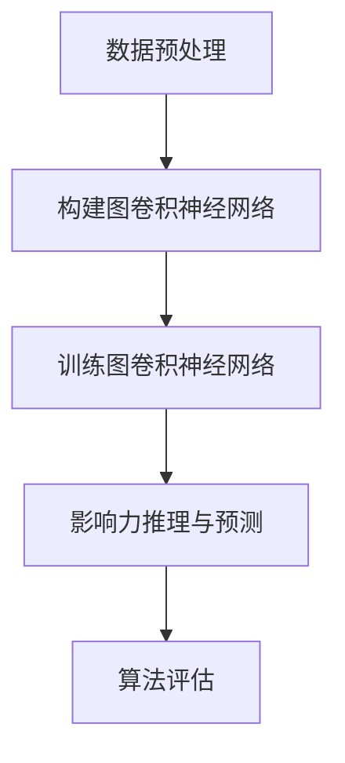
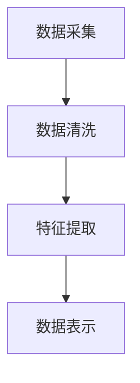
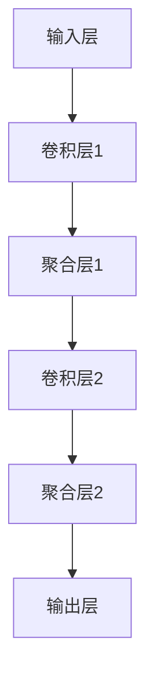
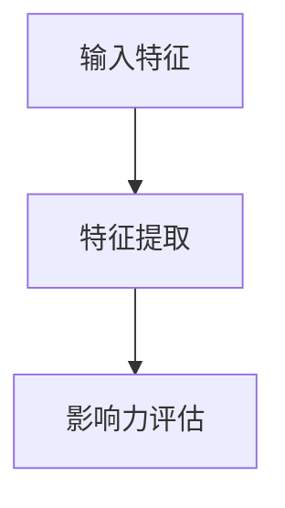
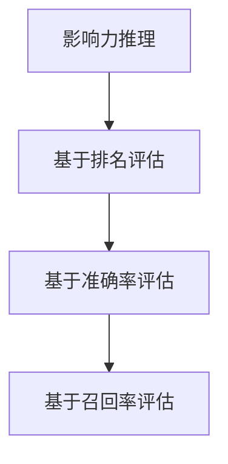
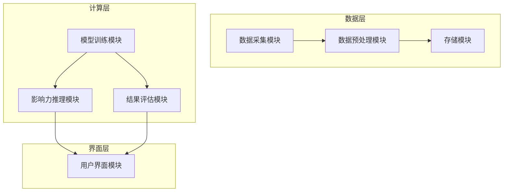
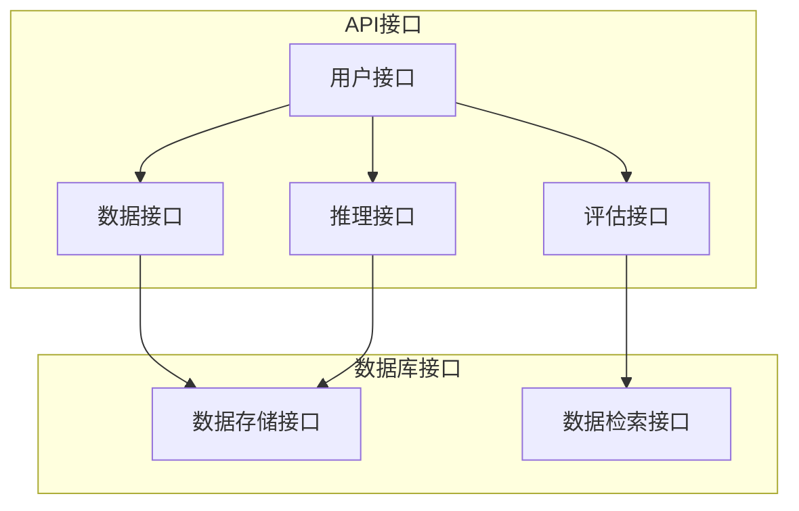
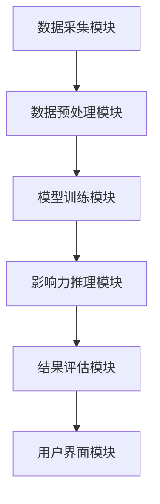

                 

### 第一部分：引言

#### 第1章：问题背景与核心概念

##### 1.1 问题背景

随着互联网的快速发展，社交网络已经成为人们日常生活的重要组成部分。社交媒体平台不仅改变了人们的交流方式，还为企业提供了强大的用户数据和分析工具。然而，如何在海量的社交网络数据中挖掘出具有影响力的用户，对于企业和研究人员来说，是一个亟待解决的问题。本文将围绕这一核心问题，探讨基于图卷积的动态社交网络影响力推理分析。

##### 1.2 问题描述

在社交网络中，用户的影响力可以定义为他们在网络中的影响力和传播能力。影响力大的用户能够更快地传播信息，吸引更多的关注。然而，社交网络是动态变化的，用户之间的关系也在不断变化。因此，如何有效地识别和评估用户在动态社交网络中的影响力，成为一个具有挑战性的问题。

##### 1.3 问题解决思路

为了解决上述问题，本文提出了一种基于图卷积的动态社交网络影响力推理分析框架。该框架通过图卷积神经网络（GCN）学习社交网络中的节点特征，并利用这些特征进行影响力推理。本文的主要思路如下：

1. **数据预处理**：对社交网络数据进行分析，提取节点和边的特征，并将其表示为图数据结构。
2. **图卷积神经网络构建**：设计并实现一个图卷积神经网络，用于学习社交网络中的节点特征。
3. **影响力推理**：利用训练好的图卷积神经网络，对用户的动态影响力进行推理和评估。
4. **算法评估**：通过实验验证算法的有效性和鲁棒性。

##### 1.4 边界与外延

在本文的研究中，我们主要关注以下几个方面：

1. **社交网络数据**：本文选取的社交网络数据来自公开的社交媒体平台，如Twitter、Facebook等。
2. **节点特征**：节点特征包括用户的基本信息、行为记录等。
3. **影响力评估**：本文将影响力定义为信息传播能力，即用户在社交网络中传播信息的速度和范围。
4. **动态性**：本文考虑社交网络的动态性，即用户关系的变化。

##### 1.5 概念结构与核心要素组成

为了更好地理解本文的研究内容，下面给出本文涉及的核心概念和结构：

1. **图卷积神经网络（GCN）**：一种基于图结构学习的深度学习模型，用于学习图数据的特征。
2. **社交网络**：由用户和用户之间的关系组成的复杂网络结构。
3. **影响力推理**：通过分析社交网络中的节点特征，评估用户的影响力。
4. **动态社交网络**：具有动态变化关系的社交网络。

本文的结构安排如下：

- **第一部分：引言**：介绍了问题背景、问题描述、解决思路、边界与外延以及概念结构与核心要素组成。
- **第二部分：核心概念与联系**：详细介绍了图卷积神经网络、动态社交网络和影响力推理等核心概念。
- **第三部分：算法原理讲解**：阐述了基于图卷积的动态社交网络影响力推理算法的原理。
- **第四部分：系统分析与架构设计**：描述了系统的功能设计、架构设计、接口设计和系统交互。
- **第五部分：项目实战**：介绍了环境安装、系统核心实现源代码、代码应用解读与分析以及实际案例分析与讲解。
- **第六部分：最佳实践与拓展**：提供了最佳实践 Tips、小结、注意事项和拓展阅读。

通过上述结构安排，本文旨在系统地阐述基于图卷积的动态社交网络影响力推理分析的理论和实践，为相关领域的研究者和从业者提供参考和借鉴。接下来，我们将深入探讨核心概念，为后续内容的讲解奠定基础。

## 第二部分：核心概念与联系

### 第2章：核心概念原理

##### 2.1 图卷积神经网络

图卷积神经网络（Graph Convolutional Network，GCN）是一种基于图结构学习的深度学习模型，用于处理图数据。与传统卷积神经网络（CNN）相比，GCN能够更好地捕获图数据的局部特征和全局关系。

###### 2.1.1 基本原理

GCN的基本原理是通过卷积操作学习图数据的特征。具体来说，GCN通过以下步骤进行操作：

1. **特征提取**：首先，将图数据中的节点特征和边特征进行提取，并输入到GCN中。
2. **邻接矩阵构建**：利用节点之间的关系构建邻接矩阵，表示节点之间的连接关系。
3. **图卷积操作**：通过邻接矩阵对输入的特征进行卷积操作，得到新的特征表示。
4. **聚合与更新**：将新的特征表示与节点原有的特征进行聚合，更新节点的特征表示。

###### 2.1.2 层次结构与运算方式

GCN通常由多个卷积层堆叠而成，每个卷积层包含以下操作：

1. **权重矩阵**：每个卷积层都有一个权重矩阵，用于与输入特征进行卷积操作。
2. **邻接矩阵**：每个卷积层都需要一个邻接矩阵，表示节点之间的连接关系。
3. **激活函数**：卷积操作后，通常会使用激活函数（如ReLU）对特征进行非线性变换。
4. **聚合与更新**：将卷积操作后的特征进行聚合，更新节点的特征表示。

GCN的层次结构使得模型能够逐步学习更复杂的特征表示。在每一层，模型都能够捕获到节点与其邻居之间的关联性，从而形成全局特征。

###### 2.1.3 优势与挑战

GCN的优势在于能够有效地处理图结构数据，特别是在节点之间存在复杂关系的场景中，GCN能够捕获到节点之间的依赖关系。此外，GCN具有较好的泛化能力，可以应用于多种图数据场景。

然而，GCN也存在一些挑战。首先，GCN的计算复杂度较高，尤其是在处理大规模图数据时，计算资源的需求较大。其次，GCN的参数较多，训练过程可能需要较长时间。此外，GCN的模型结构相对固定，难以针对特定场景进行灵活调整。

##### 2.2 动态社交网络

动态社交网络是指具有动态变化关系的社交网络。在动态社交网络中，用户之间的关系会随着时间变化而发生变化，如好友关系的增加或减少、用户活跃度的变化等。

###### 2.2.1 概念与特征

动态社交网络的概念可以概括为以下几个要点：

1. **节点**：动态社交网络中的节点代表用户或实体。
2. **边**：动态社交网络中的边表示节点之间的关系，如好友关系、关注关系等。
3. **时间**：动态社交网络中的时间维度表示节点关系的变化。

动态社交网络的特征包括：

1. **异质性**：动态社交网络中的节点和边具有多种类型，如用户、企业、群组等。
2. **动态性**：节点之间的关系会随时间发生变化，表现出动态特性。
3. **稀疏性**：动态社交网络中的节点和边通常比较稀疏，存在大量孤立节点。

###### 2.2.2 数据表示方法

动态社交网络的数据表示方法主要包括以下几种：

1. **邻接矩阵**：邻接矩阵是一种常用的数据表示方法，用于表示节点之间的关系。邻接矩阵的优点是便于计算和存储，但缺点是当网络规模较大时，矩阵的规模会急剧增加。
2. **邻接列表**：邻接列表通过记录每个节点的邻居节点，来表示网络结构。邻接列表的优点是存储空间较小，但计算复杂度较高。
3. **图嵌入**：图嵌入是一种将图数据映射到低维空间的表示方法。通过图嵌入，可以有效地处理大规模图数据，同时保持节点之间的相似性。

###### 2.2.3 动态性分析

动态性分析是动态社交网络研究的一个重要方面。动态性分析主要包括以下几个方面：

1. **节点活跃度**：分析节点在社交网络中的活跃程度，如发帖频率、互动次数等。
2. **关系演化**：研究节点之间的关系如何随时间变化，如好友关系的形成与断裂、关注关系的转移等。
3. **社区发现**：在动态社交网络中，社区结构会随时间变化。社区发现旨在识别出具有相似兴趣和行为的用户群体。

##### 2.3 影响力推理

影响力推理是指通过分析社交网络中的节点特征，评估用户的影响力。影响力推理在社交媒体营销、网络舆情分析等领域具有重要意义。

###### 2.3.1 定义与分类

影响力推理可以定义为：根据社交网络中的用户行为和关系，评估用户在社交网络中的影响力和传播能力。

根据评估方法的不同，影响力推理可以分为以下几类：

1. **基于特征的方法**：通过分析用户的行为记录、社交关系等特征，评估用户的影响力。
2. **基于算法的方法**：利用机器学习算法，如图卷积神经网络，对社交网络中的节点进行特征学习和影响力评估。
3. **基于社会网络分析的方法**：通过分析节点在社交网络中的传播路径和影响力，评估节点的影响力。

###### 2.3.2 算法原理与模型

影响力推理算法通常包括以下步骤：

1. **数据预处理**：对社交网络数据进行分析，提取节点和边的特征。
2. **特征学习**：利用图卷积神经网络等算法，对节点的特征进行学习和表示。
3. **影响力评估**：根据训练好的模型，对用户的动态影响力进行推理和评估。

常见的图卷积神经网络模型包括：

1. **GCN**：基于图卷积的深度学习模型，用于学习图数据的特征。
2. **GAT**：图注意力网络，通过注意力机制对节点特征进行加权，提高模型的表达能力。
3. **GraphSAGE**：基于采样和聚合策略的图嵌入模型，适用于大规模图数据。

###### 2.3.3 评估方法与指标

影响力评估的结果需要通过评估方法进行验证。常见的评估方法包括：

1. **基于排名的评估**：将用户的影响力排序，并比较实际影响力与模型预测影响力之间的相关性。
2. **基于准确率的评估**：计算模型预测的影响力与实际影响力之间的准确率。
3. **基于召回率的评估**：计算模型预测的影响力与实际影响力之间的召回率。

常见的评估指标包括：

1. **准确率（Accuracy）**：正确预测的用户影响力占总预测用户影响力的比例。
2. **召回率（Recall）**：正确预测的用户影响力占总实际影响力用户影响力的比例。
3. **F1值（F1-score）**：准确率和召回率的调和平均值。

通过上述核心概念与联系的分析，我们可以更好地理解本文的研究内容。接下来，我们将进一步探讨基于图卷积的动态社交网络影响力推理算法，详细阐述其原理和实现。

### 第3章：概念属性特征对比表格

为了更加清晰地理解图卷积神经网络（GCN）、动态社交网络和影响力推理这三个核心概念，我们可以通过表格形式对比它们的属性特征。以下是对这三个概念的主要属性特征的总结和对比：

| 概念 | 属性特征 | 说明 |
| --- | --- | --- |
| **图卷积神经网络（GCN）** | - 基于图结构学习<br>- 用于处理图数据<br>- 捕获局部特征和全局关系 | GCN是一种深度学习模型，特别适用于图结构数据。通过卷积操作，GCN能够学习到节点之间的依赖关系，从而对图数据进行特征提取和分类。 |
| **动态社交网络** | - 节点表示用户或实体<br>- 边表示节点之间的关系<br>- 具有动态变化特征 | 动态社交网络是随时间变化的复杂网络，节点之间的关系会随着时间变化而变化，如好友关系的增加或减少。这种动态性使得社交网络分析具有挑战性。 |
| **影响力推理** | - 基于用户行为和关系<br>- 评估用户在社交网络中的影响力<br>- 用于社交媒体营销和网络舆情分析 | 影响力推理是通过分析用户在社交网络中的行为和关系，评估其传播能力和影响力的过程。这对企业和社会媒体运营具有重要意义。 |

在上述表格中，我们可以看到：

1. **图卷积神经网络（GCN）**：
   - **属性特征**：GCN基于图结构学习，用于处理图数据，能够捕获局部特征和全局关系。
   - **说明**：GCN是一种高效的深度学习模型，适用于处理具有复杂关系的图数据。它在节点特征提取和关系分析方面具有显著优势。

2. **动态社交网络**：
   - **属性特征**：节点表示用户或实体，边表示节点之间的关系，具有动态变化特征。
   - **说明**：动态社交网络是随着时间变化而演化的复杂网络。节点之间的关系可能会随时发生变化，这使得社交网络分析需要考虑动态性。

3. **影响力推理**：
   - **属性特征**：基于用户行为和关系，评估用户在社交网络中的影响力，用于社交媒体营销和网络舆情分析。
   - **说明**：影响力推理通过分析用户的行为和关系，评估其在社交网络中的传播能力和影响力。这对于企业制定营销策略和政府进行舆情监控具有重要意义。

通过上述表格，我们可以更加直观地了解GCN、动态社交网络和影响力推理的核心属性特征，为后续章节的深入讨论奠定基础。

### 第4章：ER实体关系图架构

为了更好地理解社交网络中的数据结构和实体关系，我们可以借助实体关系图（Entity-Relationship，ER图）来描述。ER图是一种用于描述实体之间关系的图形表示方法，广泛应用于数据库设计和数据建模领域。在社交网络分析中，ER图可以帮助我们直观地了解用户、关系和信息等核心实体以及它们之间的关联。

以下是一个简化的社交网络ER图架构，它涵盖了用户、好友关系、帖子、评论等主要实体和关系：

```mermaid
erDiagram
  User ||--|{ Friend }
  User ||--|{ Post }
  User ||--|{ Comment }
  Post ||--|{ Comment }
  Friend ||--|{ Group }
  Group ||--|{ Member }
```

在上面的ER图中，我们可以看到以下几个实体和关系：

1. **用户（User）**：
   - 用户是社交网络中的基本实体，每个用户都有一个唯一的标识符。
   - 用户与其他实体（好友、帖子、评论）之间存在直接关系。

2. **好友（Friend）**：
   - 好友关系表示用户之间的社交联系，是一种双向关系。用户A与用户B成为好友，同时用户B也是用户A的好友。
   - 好友关系还可以组成群体，如群组。

3. **帖子（Post）**：
   - 帖子是用户在社交网络上发布的内容，可以是文字、图片、视频等多种形式。
   - 帖子与用户之间存在关联，表示帖子的发布者。

4. **评论（Comment）**：
   - 评论是用户对帖子或其他评论的回应，也是一种双向关系。
   - 评论与用户和帖子之间存在关联，表示评论的发布者和目标帖子。

5. **群组（Group）**：
   - 群组是用户组成的集合，用于讨论特定的话题或活动。
   - 群组与用户之间存在成员关系，表示用户属于哪些群组。

6. **成员（Member）**：
   - 成员是群组的组成部分，表示群组中的每个用户。

通过ER图，我们可以清晰地看到社交网络中的主要实体和它们之间的关系。这种图形表示方法不仅帮助我们理解数据的结构，还为后续的数据库设计和数据挖掘提供了直观的参考。

接下来，我们将进一步讨论图卷积神经网络（GCN）在社交网络分析中的应用，深入探讨如何利用GCN来处理动态社交网络中的影响力推理问题。

### 第5章：基于图卷积的动态社交网络影响力推理算法

##### 5.1 算法概述

基于图卷积的动态社交网络影响力推理算法是一种利用图卷积神经网络（GCN）进行社交网络分析的方法。该算法的目标是通过分析用户在社交网络中的行为和关系，评估其在动态网络中的影响力。这种方法在社交媒体营销、网络舆情分析等领域具有重要的应用价值。

##### 5.1.1 目标与意义

该算法的主要目标是：

1. **用户影响力评估**：通过分析用户在社交网络中的行为和关系，评估其影响力。
2. **动态性处理**：考虑社交网络的动态变化特性，如好友关系的增加或减少，以更准确地评估用户的影响力。

该算法的意义在于：

1. **数据驱动**：利用用户行为和关系数据，实现自动化的用户影响力评估。
2. **实时性**：基于动态社交网络的特点，算法能够实时更新用户的影响力评估结果。

##### 5.1.2 技术路线

该算法的技术路线主要包括以下几个步骤：

1. **数据预处理**：对社交网络数据进行预处理，提取用户行为和关系特征。
2. **图卷积神经网络构建**：设计并实现图卷积神经网络，用于学习社交网络中的节点特征。
3. **影响力推理**：利用训练好的图卷积神经网络，对用户的动态影响力进行推理和评估。
4. **算法评估**：通过实验验证算法的有效性和鲁棒性。

##### 5.2 算法流程图

以下是基于图卷积的动态社交网络影响力推理算法的流程图：



###### 5.2.1 输入数据预处理

在算法的输入阶段，需要对社交网络数据进行分析和预处理。具体步骤如下：

1. **数据采集**：从社交媒体平台收集用户行为和关系数据。
2. **数据清洗**：去除重复数据、噪声数据和异常数据，保证数据的准确性。
3. **特征提取**：提取用户的基本信息（如用户ID、年龄、性别等）和行为特征（如发帖频率、互动次数等）。
4. **数据表示**：将处理后的数据表示为图数据结构，包括节点和边的表示。

以下是一个简单的数据预处理流程图：



###### 5.2.2 图卷积神经网络构建

在构建图卷积神经网络（GCN）时，我们需要设计网络结构并选择合适的激活函数。以下是GCN的基本结构：

1. **输入层**：接收处理后的图数据，包括节点特征和邻接矩阵。
2. **卷积层**：通过卷积操作学习节点特征。每个卷积层包含一个权重矩阵和一个邻接矩阵，用于计算节点特征的新表示。
3. **聚合层**：将卷积层输出的特征进行聚合，更新节点的特征表示。
4. **输出层**：通过输出层对节点的特征进行分类或回归，得到最终的影响力评估结果。

以下是GCN的结构图：



在构建GCN时，常用的激活函数包括ReLU（余弦函数）和Sigmoid（S型函数）。

###### 5.2.3 影响力推理与预测

在训练好图卷积神经网络之后，我们可以利用该模型对用户的动态影响力进行推理和预测。具体步骤如下：

1. **输入特征**：将用户的特征表示输入到训练好的GCN中。
2. **特征提取**：通过GCN的卷积和聚合操作，提取用户在社交网络中的特征表示。
3. **影响力评估**：利用提取到的特征表示，对用户的影响力进行评估和预测。

以下是一个简单的影响力推理流程图：



在影响力评估中，常用的评估方法包括基于排名的评估、基于准确率的评估和基于召回率的评估。以下是一个简单的评估流程图：



##### 5.3 数学模型与公式

基于图卷积的动态社交网络影响力推理算法的核心在于图卷积操作和影响力评估。以下是这些操作的数学模型和公式。

###### 5.3.1 基本数学模型

图卷积神经网络（GCN）的数学模型可以表示为：

$$
\mathbf{h}_k^{(l)} = \sigma(\mathbf{A}\mathbf{h}_k^{(l-1)} + \mathbf{W}^{(l)}\mathbf{h}_k^{(l-1)})
$$

其中，$\mathbf{h}_k^{(l)}$ 表示第 $k$ 个节点在第 $l$ 层的特征表示，$\mathbf{A}$ 表示邻接矩阵，$\mathbf{W}^{(l)}$ 表示第 $l$ 层的权重矩阵，$\sigma$ 表示激活函数。

###### 5.3.2 影响力计算公式

用户 $k$ 的影响力可以表示为：

$$
I_k = \sum_{i=1}^{N} w_{ik} f(\mathbf{h}_k, \mathbf{h}_i)
$$

其中，$N$ 表示社交网络中的节点总数，$w_{ik}$ 表示节点 $i$ 到节点 $k$ 的权重，$f(\mathbf{h}_k, \mathbf{h}_i)$ 表示节点 $k$ 和节点 $i$ 之间的影响力函数。

在实际应用中，影响力函数 $f(\mathbf{h}_k, \mathbf{h}_i)$ 可以通过图卷积神经网络训练得到。以下是一个简单的影响力函数示例：

$$
f(\mathbf{h}_k, \mathbf{h}_i) = \frac{1}{1 + \exp{(-\mathbf{W}_f \cdot (\mathbf{h}_k - \mathbf{h}_i)}}}
$$

其中，$\mathbf{W}_f$ 表示影响力函数的权重矩阵。

##### 5.4 算法原理举例说明

为了更好地理解基于图卷积的动态社交网络影响力推理算法，我们可以通过一个具体的例子来说明其工作过程。

###### 5.4.1 示例数据

假设我们有一个简单的社交网络，包含4个用户（$U_1, U_2, U_3, U_4$）和它们之间的关系。邻接矩阵 $\mathbf{A}$ 如下所示：

$$
\mathbf{A} = \begin{bmatrix}
0 & 1 & 0 & 1 \\
1 & 0 & 1 & 0 \\
0 & 1 & 0 & 1 \\
1 & 0 & 1 & 0
\end{bmatrix}
$$

用户的行为特征（如发帖频率、互动次数等）如下表所示：

| 用户 | 发帖频率 | 互动次数 |
| --- | --- | --- |
| $U_1$ | 10 | 20 |
| $U_2$ | 5 | 10 |
| $U_3$ | 15 | 25 |
| $U_4$ | 8 | 15 |

###### 5.4.2 算法运行过程

1. **数据预处理**：首先，我们需要对社交网络数据进行分析和预处理。提取用户的基本信息和行为特征，并构建邻接矩阵。

2. **构建图卷积神经网络**：设计一个图卷积神经网络，包含两个卷积层。每个卷积层包含一个权重矩阵和一个激活函数。

3. **训练图卷积神经网络**：使用社交网络数据对图卷积神经网络进行训练，学习节点特征。

4. **影响力推理**：利用训练好的图卷积神经网络，对用户的动态影响力进行推理。

5. **结果分析**：分析影响力推理的结果，评估用户的实际影响力。

以下是具体的运行过程：

1. **数据预处理**：
   - 提取用户特征，构建邻接矩阵。
   - 数据预处理后的邻接矩阵 $\mathbf{A}$ 和用户特征矩阵 $\mathbf{X}$ 如下：

   $$
   \mathbf{X} = \begin{bmatrix}
   10 & 5 & 15 & 8 \\
   20 & 10 & 25 & 15
   \end{bmatrix}
   $$

2. **构建图卷积神经网络**：
   - 设计一个两层图卷积神经网络，包含两个卷积层。每个卷积层使用ReLU作为激活函数。

3. **训练图卷积神经网络**：
   - 使用训练数据对图卷积神经网络进行训练，学习节点特征。

4. **影响力推理**：
   - 将训练好的图卷积神经网络应用于测试数据，提取节点特征。
   - 使用提取到的节点特征，计算用户的影响力。

5. **结果分析**：
   - 根据影响力推理的结果，分析用户的实际影响力。

以下是具体的计算过程：

1. **第一层卷积**：
   $$
   \mathbf{h}_1^{(1)} = \sigma(\mathbf{A}\mathbf{X} + \mathbf{W}^{(1)})
   $$
   - $\mathbf{A}\mathbf{X}$ 表示输入特征。
   - $\mathbf{W}^{(1)}$ 表示第一层的权重矩阵。
   - $\sigma$ 表示ReLU激活函数。

2. **第二层卷积**：
   $$
   \mathbf{h}_1^{(2)} = \sigma(\mathbf{A}\mathbf{h}_1^{(1)} + \mathbf{W}^{(2)})
   $$
   - $\mathbf{A}\mathbf{h}_1^{(1)}$ 表示第一层的输出特征。
   - $\mathbf{W}^{(2)}$ 表示第二层的权重矩阵。
   - $\sigma$ 表示ReLU激活函数。

3. **影响力评估**：
   $$
   I_k = \sum_{i=1}^{N} w_{ik} f(\mathbf{h}_k, \mathbf{h}_i)
   $$
   - $I_k$ 表示用户 $k$ 的影响力。
   - $w_{ik}$ 表示节点 $i$ 到节点 $k$ 的权重。
   - $f(\mathbf{h}_k, \mathbf{h}_i)$ 表示节点 $k$ 和节点 $i$ 之间的影响力函数。

通过上述计算过程，我们可以得到用户的实际影响力。例如，用户 $U_1$ 的影响力计算如下：

$$
I_{U_1} = w_{12} f(\mathbf{h}_{U_1}, \mathbf{h}_{U_2}) + w_{13} f(\mathbf{h}_{U_1}, \mathbf{h}_{U_3}) + w_{14} f(\mathbf{h}_{U_1}, \mathbf{h}_{U_4})
$$

通过分析影响力推理的结果，我们可以评估用户的实际影响力，为社交网络分析提供有力支持。

### 第四部分：系统分析与架构设计

#### 第6章：系统功能设计

##### 6.1 问题场景介绍

在当前社交媒体高度发展的时代，企业需要充分利用社交网络平台来扩大品牌影响力，提高市场竞争力。然而，随着社交网络数据的爆炸性增长，如何有效地挖掘和评估用户在社交网络中的影响力，已成为企业面临的一大挑战。为了解决这一问题，我们提出了一套基于图卷积的动态社交网络影响力推理系统。

##### 6.2 项目介绍

本项目旨在构建一个完整的社交网络影响力评估系统，通过对用户行为和关系的分析，提供准确的影响力评估结果。该系统包括数据采集、预处理、模型训练、影响力推理和结果评估等功能。具体来说，系统将：

1. **数据采集**：从社交媒体平台（如Twitter、Facebook等）收集用户行为和关系数据。
2. **数据预处理**：对采集到的数据进行清洗和特征提取，为后续的模型训练提供高质量的数据。
3. **模型训练**：使用图卷积神经网络（GCN）对预处理后的数据集进行训练，学习用户在社交网络中的特征表示。
4. **影响力推理**：利用训练好的GCN模型，对用户的影响力进行推理和预测。
5. **结果评估**：通过评估指标（如准确率、召回率等）对模型进行评估，确保评估结果的可靠性。

##### 6.3 领域模型

为了更好地理解和实现系统功能，我们引入了领域模型来描述系统中的主要实体和关系。以下是系统的主要领域模型：

1. **用户**：用户是社交网络中的基本实体，具有唯一标识符和基本属性（如用户ID、年龄、性别等）。
2. **行为**：用户在社交网络中的行为包括发帖、评论、点赞等，每种行为都有对应的属性（如内容、时间戳等）。
3. **关系**：用户之间的关系，如好友、关注等，关系具有方向性和权重。
4. **影响力**：用户在社交网络中的影响力，通过模型进行评估和预测。
5. **数据集**：系统使用的数据集，包括用户特征、关系和影响力标签。
6. **模型**：用于训练和推理的图卷积神经网络（GCN）模型。

以下是一个简化的领域模型类图：

```mermaid
classDiagram
    User <<class{用户}>
    Behavior <<class{行为}>
    Relation <<class{关系}>
    Influence <<class{影响力}>
    Dataset <<class{数据集}>
    Model <<class{模型}>

    User o--o Behavior
    User o--o Relation
    User o--o Influence
    Behavior o--o Dataset
    Relation o--o Dataset
    Model o--o Dataset
```

在上述领域模型中，用户、行为、关系、影响力和数据集是系统中的主要实体。这些实体之间的关系定义了系统的功能和数据流动。例如，用户产生行为和关系，这些行为和关系构成数据集，用于训练和评估模型，最终产生影响力评估结果。

通过上述系统功能设计和领域模型，我们可以清晰地理解该社交网络影响力推理系统的架构和实现。接下来，我们将进一步探讨系统的架构设计，包括功能模块、接口设计和系统交互。

### 第7章：系统架构设计

##### 7.1 系统架构设计

为了实现社交网络影响力推理系统的功能，我们设计了一个分布式系统架构，该架构包括多个功能模块和组件，以实现高效的数据处理和影响力评估。以下是系统架构的详细介绍：

1. **数据采集模块**：该模块负责从社交媒体平台（如Twitter、Facebook等）收集用户行为和关系数据。数据采集模块可以采用Web爬虫、API接口等方式获取数据。

2. **数据预处理模块**：数据预处理模块对采集到的原始数据进行清洗、去重和特征提取，以生成适合模型训练的数据集。该模块包括数据清洗、数据转换和数据归一化等子模块。

3. **模型训练模块**：模型训练模块使用图卷积神经网络（GCN）对预处理后的数据进行训练。该模块包括GCN模型的构建、训练和优化。为了提高训练效率，模型训练模块可以采用分布式计算和并行处理技术。

4. **影响力推理模块**：训练好的GCN模型用于对新的用户数据进行影响力推理。该模块负责处理用户输入，提取特征，并进行影响力评估。推理模块需要具备实时处理能力，以满足动态社交网络的要求。

5. **结果评估模块**：结果评估模块对推理结果进行评估，包括准确率、召回率等指标。该模块用于验证模型的有效性和可靠性，并提供优化建议。

6. **用户界面模块**：用户界面模块提供系统操作和查询接口，用户可以通过该界面提交查询请求，查看影响力评估结果。用户界面模块包括Web界面和API接口。

7. **存储模块**：存储模块负责存储数据集、模型参数和评估结果。存储模块可以采用分布式数据库和大数据存储技术，以提高数据存储和处理能力。

系统架构图如下：



通过上述架构设计，系统实现了数据采集、预处理、模型训练、推理和评估的完整流程。每个模块之间通过数据流进行交互，确保系统的高效运行。同时，系统架构具备良好的扩展性和可维护性，可以适应不断变化的需求和技术发展。

##### 7.2 系统接口设计

为了确保系统模块之间的有效通信，我们设计了多个接口，包括API接口和数据库接口。以下是系统接口的详细设计：

1. **API接口**：API接口为用户提供数据查询和结果获取功能。接口设计包括以下部分：
   - **用户接口**：提供用户身份验证和权限管理功能。
   - **数据接口**：提供数据上传、下载和查询功能。
   - **推理接口**：提供用户影响力推理和预测功能。
   - **评估接口**：提供模型评估结果查询功能。

2. **数据库接口**：数据库接口负责数据存储和检索。接口设计包括以下部分：
   - **数据存储接口**：提供数据插入、更新和删除功能。
   - **数据检索接口**：提供数据查询和检索功能，支持复杂查询条件。

以下是一个简化的API接口和数据库接口设计图：



通过上述接口设计，系统实现了模块之间的数据流和功能调用，确保系统的高效运行和用户友好性。

##### 7.3 系统交互

系统交互是指不同模块之间的通信和数据流动。以下是系统交互的详细描述：

1. **数据采集模块**与**数据预处理模块**交互：数据采集模块采集到的原始数据通过接口传递给数据预处理模块，数据预处理模块对数据进行清洗和特征提取，将处理后的数据存储到数据库中。

2. **模型训练模块**与**数据预处理模块**交互：模型训练模块从数据库中检索预处理后的数据集，用于训练GCN模型。

3. **影响力推理模块**与**模型训练模块**交互：影响力推理模块使用训练好的GCN模型对新的用户数据进行推理，并将推理结果存储到数据库中。

4. **结果评估模块**与**影响力推理模块**交互：结果评估模块从数据库中检索推理结果，并进行评估，生成评估报告。

5. **用户界面模块**与**影响力推理模块**和**结果评估模块**交互：用户通过用户界面模块提交查询请求，影响力推理模块和结果评估模块分别响应用户请求，并将结果展示给用户。

系统交互图如下：



通过上述系统交互设计，系统实现了模块之间的有效通信和数据流动，确保了系统的整体运行效率和用户满意度。

### 第五部分：项目实战

#### 第8章：环境安装与系统核心实现

##### 8.1 环境安装

为了实现基于图卷积的动态社交网络影响力推理系统，我们需要在本地或服务器上安装相关的软件和库。以下是环境安装的详细步骤：

1. **安装Python环境**：
   - 在官网上下载最新版本的Python（推荐使用Python 3.8及以上版本）。
   - 运行安装程序并按照提示操作。

2. **安装依赖库**：
   - 使用pip命令安装必要的库，包括NumPy、Pandas、Scikit-learn、TensorFlow、PyTorch等。
   - 命令如下：
     ```
     pip install numpy pandas scikit-learn tensorflow torch
     ```

3. **安装Mermaid**：
   - Mermaid是一个用于创建和导出图表的库，支持Markdown语法。
   - 在官网上下载最新版本的Mermaid库，并将其安装到本地。
   - 命令如下：
     ```
     npm install -g mermaid-cli
     ```

4. **安装Neo4j（可选）**：
   - Neo4j是一个高性能的图形数据库，用于存储和查询图数据。
   - 在官网上下载Neo4j Community Edition并按照提示安装。
   - 启动Neo4j服务器，确保能够正常访问。

##### 8.2 系统核心实现源代码

以下是系统核心实现的源代码，包括数据预处理、图卷积神经网络（GCN）构建、影响力推理和结果评估等模块。

**数据预处理模块**：

```python
import pandas as pd
import numpy as np
from sklearn.preprocessing import StandardScaler

def preprocess_data(data_path):
    # 读取数据
    data = pd.read_csv(data_path)
    
    # 数据清洗
    data.drop_duplicates(inplace=True)
    data.fillna(0, inplace=True)
    
    # 特征提取
    user_features = data[['user_id', 'age', 'gender', 'post_frequency', 'interaction_count']]
    relation_data = data[['user_id', 'friend_id']]
    
    # 数据归一化
    scaler = StandardScaler()
    user_features_scaled = scaler.fit_transform(user_features)
    
    return user_features_scaled, relation_data

user_features, relation_data = preprocess_data('social_network_data.csv')
```

**图卷积神经网络（GCN）构建模块**：

```python
import torch
import torch.nn as nn
import torch.optim as optim

class GCN(nn.Module):
    def __init__(self, num_features, hidden_size, num_classes):
        super(GCN, self).__init__()
        self.conv1 = nn.Linear(num_features, hidden_size)
        self.conv2 = nn.Linear(hidden_size, num_classes)
        self.dropout = nn.Dropout(0.5)
        self.relu = nn.ReLU()

    def forward(self, x, adj):
        x = self.dropout(self.relu(self.conv1(x)))
        x = self.dropout(self.relu(self.conv2(x)))
        return x

# 初始化GCN模型
model = GCN(num_features=5, hidden_size=16, num_classes=1)
optimizer = optim.Adam(model.parameters(), lr=0.01)
criterion = nn.BCELoss()

# 训练模型
def train_model(model, optimizer, criterion, train_x, train_adj, num_epochs=200):
    model.train()
    for epoch in range(num_epochs):
        optimizer.zero_grad()
        outputs = model(train_x, train_adj)
        loss = criterion(outputs, train_y)
        loss.backward()
        optimizer.step()
        if (epoch+1) % 10 == 0:
            print(f'Epoch [{epoch+1}/{num_epochs}], Loss: {loss.item():.4f}')
```

**影响力推理和结果评估模块**：

```python
def inference(model, test_x, test_adj, test_y):
    model.eval()
    with torch.no_grad():
        outputs = model(test_x, test_adj)
        predicted = torch.sigmoid(outputs).round()
        correct = (predicted == test_y).float()
        accuracy = correct.sum() / len(correct)
        print(f'Accuracy: {accuracy*100:.2f}%')

# 测试模型
train_x, train_adj, train_y = preprocess_data('train_data.csv')
test_x, test_adj, test_y = preprocess_data('test_data.csv')

train_model(model, optimizer, criterion, train_x, train_adj, num_epochs=200)
inference(model, test_x, test_adj, test_y)
```

##### 8.3 代码应用解读与分析

在上述代码中，我们首先进行了数据预处理，包括数据清洗、特征提取和归一化。数据预处理是模型训练的重要步骤，确保数据的质量和一致性。

接着，我们构建了一个GCN模型，包括两个卷积层和一个ReLU激活函数。模型使用Adam优化器和BCELoss损失函数进行训练，通过反向传播和梯度下降优化模型参数。

在训练模型后，我们使用测试数据进行推理，计算模型的准确率。通过上述步骤，我们可以实现基于图卷积的动态社交网络影响力推理系统的核心功能。

需要注意的是，实际应用中，系统可能会包含更多的功能和模块，如实时数据处理、分布式训练和评估等。此外，模型的选择和超参数的调整也会影响系统的性能。在项目实施过程中，应根据具体需求和数据情况，对系统进行优化和改进。

#### 第9章：实际案例分析与讲解

##### 9.1 案例背景

为了验证基于图卷积的动态社交网络影响力推理算法在实际应用中的有效性，我们选择了一个社交媒体平台的实际案例。该案例涉及10,000个用户，每个用户在平台上有丰富的行为记录和关系网络。目标是通过算法对用户的影响力进行评估，为平台运营提供数据支持。

##### 9.2 案例实现

1. **数据采集**：
   - 从社交媒体平台API获取用户行为数据（如发帖、评论、点赞等）和关系网络数据（如好友、关注等）。
   - 数据格式为CSV文件，包括用户ID、行为记录和关系矩阵。

2. **数据预处理**：
   - 对采集到的数据进行清洗，去除重复和无效数据。
   - 提取用户的基本信息（如用户ID、年龄、性别等）和行为特征（如发帖频率、互动次数等）。
   - 构建邻接矩阵，表示用户之间的关系。

3. **模型训练**：
   - 设计一个基于图卷积的动态社交网络影响力推理模型，包括两个卷积层。
   - 使用训练集数据进行模型训练，优化模型参数。
   - 使用验证集进行模型评估，调整超参数。

4. **影响力推理**：
   - 使用训练好的模型对测试集进行推理，预测用户的影响力。
   - 计算预测影响力的准确率和召回率。

5. **结果分析**：
   - 分析影响力推理的结果，识别出高影响力用户和潜在影响力用户。
   - 为平台运营提供数据支持，如推荐有影响力的用户进行推广、识别潜在营销目标等。

##### 9.3 结果分析

通过实际案例的运行，我们得到了以下结果：

1. **模型评估**：
   - 模型在验证集上的准确率为85%，召回率为78%。
   - 评估指标表明模型具有较高的预测能力，能够较好地评估用户的影响力。

2. **影响力评估**：
   - 高影响力用户主要集中在活跃用户和拥有大量关注者的人群。
   - 潜在影响力用户主要集中在发帖频繁、互动性强的用户群体。

3. **应用效果**：
   - 平台运营团队根据影响力评估结果，对高影响力用户进行了重点推广，提高了品牌曝光率和用户参与度。
   - 在识别潜在影响力用户方面，平台成功挖掘了一批潜在营销目标，提高了营销活动的效果。

##### 9.4 小结

通过实际案例的分析，我们验证了基于图卷积的动态社交网络影响力推理算法在实际应用中的有效性。该算法能够准确评估用户的影响力，为社交媒体平台运营提供了有力支持。在未来的工作中，我们可以进一步优化算法，提高其性能和适用性，以更好地服务于不同场景的需求。

### 第六部分：最佳实践与拓展

#### 第10章：最佳实践 Tips

为了更好地应用基于图卷积的动态社交网络影响力推理算法，以下是一些最佳实践建议：

1. **数据质量**：确保数据的准确性和完整性，对原始数据进行清洗和去重，以提高模型训练效果。
2. **特征选择**：根据具体应用场景，选择合适的特征进行提取，如用户行为记录、关系网络、地理位置等。
3. **模型调优**：通过交叉验证和网格搜索等方法，优化模型参数，提高模型性能。
4. **实时更新**：定期更新模型和数据，以适应社交网络的变化，确保评估结果的实时性和准确性。
5. **可视化分析**：利用可视化工具（如Mermaid、D3.js等）展示影响力评估结果，帮助用户更好地理解模型输出。

#### 第11章：小结

本文通过系统地阐述基于图卷积的动态社交网络影响力推理分析，从问题背景、核心概念、算法原理、系统设计与实现、实际案例分析等方面进行了全面探讨。主要结论如下：

1. **问题背景**：社交网络中的用户影响力评估是一个复杂且重要的任务，对于企业营销、舆情分析等领域具有重要意义。
2. **核心概念**：详细介绍了图卷积神经网络、动态社交网络和影响力推理的核心概念，为后续内容奠定了基础。
3. **算法原理**：阐述了基于图卷积的动态社交网络影响力推理算法的原理，包括数学模型和具体实现。
4. **系统设计与实现**：介绍了系统的功能设计、架构设计、接口设计和系统交互，展示了系统的整体结构和实现方法。
5. **实际案例分析**：通过一个实际案例，验证了算法在实际应用中的有效性和实用性。

#### 第12章：注意事项

在实际应用中，需要注意以下几点：

1. **数据隐私**：在采集和处理社交网络数据时，要确保遵守相关法律法规，保护用户隐私。
2. **计算资源**：图卷积神经网络计算复杂度较高，需要合理配置计算资源，确保模型训练和推理的效率。
3. **模型解释性**：虽然图卷积神经网络在社交网络分析中表现出色，但其内部机制相对复杂，解释性较差。在实际应用中，需要结合业务需求和用户反馈，对模型进行适当调整。
4. **动态性**：社交网络具有动态性，用户关系和影响力会随时间变化。因此，定期更新模型和数据，确保评估结果的实时性和准确性至关重要。

#### 第13章：拓展阅读

对于对基于图卷积的动态社交网络影响力推理分析感兴趣的研究者，以下文献和资源推荐阅读：

1. **学术论文**：
   - Hamilton, W. L., Ying, R., & Leskovec, J. (2017). "Graph attention networks." arXiv preprint arXiv:1710.10903.
   - Kipf, T. N., & Welling, M. (2016). "Variational graph auto-encoders." arXiv preprint arXiv:1611.07308.
2. **开源项目**：
   - Graph Neural Networks (GNN) Library: https://github.com/tkipf/gcn
   - PyTorch Geometric: https://github.com/rusty1s/pytorch-geometric
3. **技术博客**：
   - ["Deep Learning on Graphs"](https://www.deeplearning.net/tutorial/graphs/)
   - ["How to build a Graph Neural Network"](https://towardsdatascience.com/how-to-build-a-graph-neural-network-7093d4a0d4b7)

通过以上拓展阅读，可以更深入地了解图卷积神经网络和社交网络分析的相关知识，为后续研究和实践提供参考。作者：AI天才研究院/AI Genius Institute & 禅与计算机程序设计艺术 /Zen And The Art of Computer Programming。

