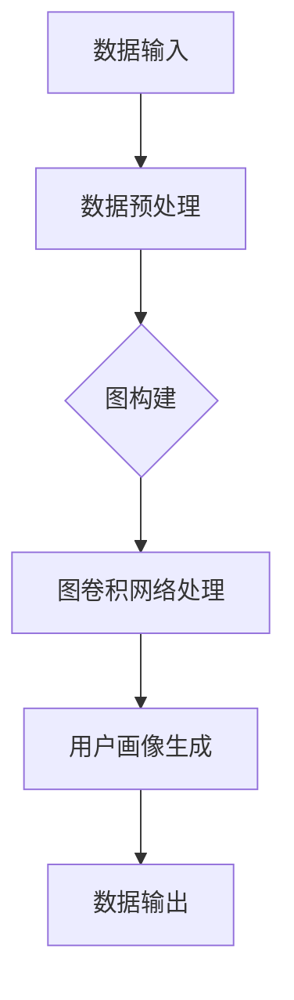
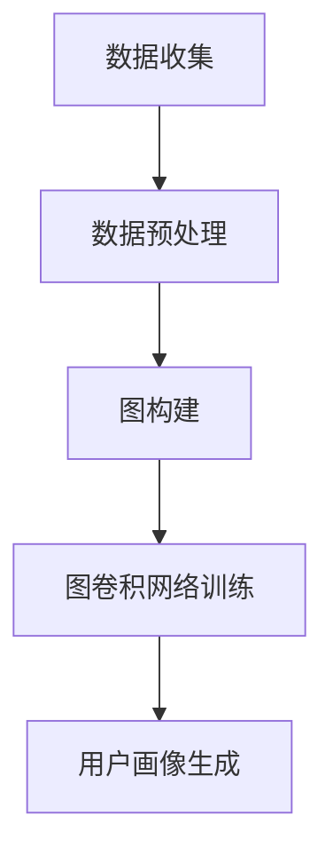
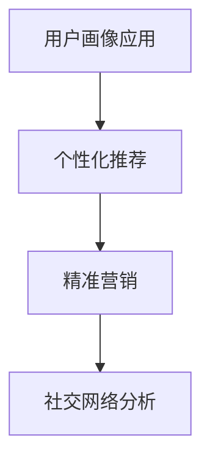
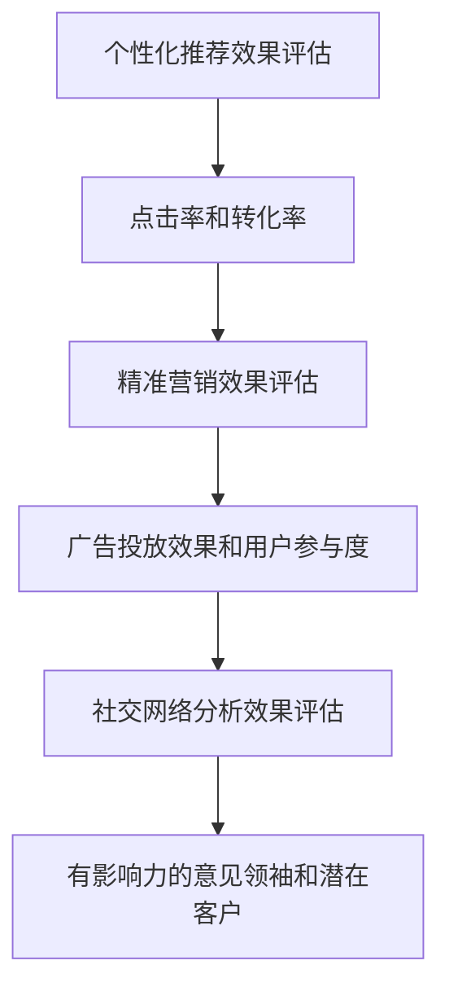
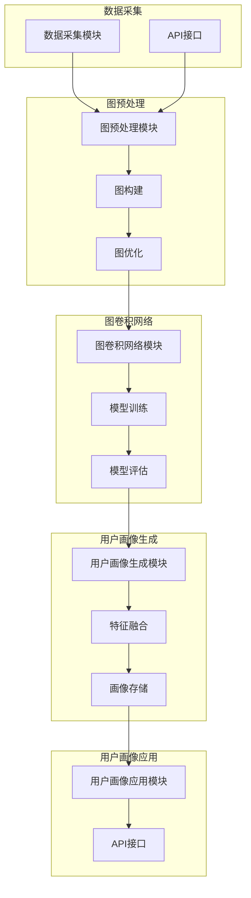

                 

### 第1章 引言

#### 1.1 问题背景

##### 1.1.1 社交网络的重要性

随着互联网的快速发展，社交网络已经成为人们日常生活中不可或缺的一部分。社交网络不仅改变了人们的沟通方式，还提供了丰富的社交互动和信息交流平台。以下是社交网络在现代社会中的几个重要作用：

1. **沟通与交流**：社交网络使得人们可以方便地与朋友、家人以及同事保持联系，无论是实时消息、电话、视频通话还是社交媒体上的互动，都极大地丰富了人们的社交生活。
2. **信息获取**：社交网络为用户提供了海量的信息来源，用户可以通过关注感兴趣的话题、人或者媒体来获取最新的新闻、趋势和观点。
3. **社交圈子拓展**：社交网络帮助人们结识新的朋友，拓展社交圈子，尤其是在职业、兴趣等领域。
4. **商业机会**：企业可以利用社交网络进行品牌宣传、产品推广和市场调研，与消费者建立更紧密的联系。

##### 1.1.2 用户画像的价值

用户画像是指通过对用户在社交网络上的行为、兴趣、需求等数据的收集和分析，形成的一种数字化描述。用户画像在社交网络中具有重要的价值，具体体现在以下几个方面：

1. **个性化推荐**：通过用户画像，社交网络可以提供更精准的内容推荐，提高用户的满意度和使用时长。
2. **广告投放优化**：广告主可以利用用户画像进行更有效的广告定位和投放，提高广告的转化率。
3. **风险控制与安全**：用户画像有助于识别异常行为，防范欺诈、网络犯罪等风险。
4. **商业决策**：企业可以通过分析用户画像来了解市场需求、用户偏好，从而做出更明智的商业决策。

#### 1.2 问题描述

##### 1.2.1 用户画像的定义

用户画像是一个多维度的数据集，它通过一系列特征来描述一个用户。这些特征可以是显式的，如用户的性别、年龄、地理位置、兴趣爱好等，也可以是隐式的，如用户的行为习惯、消费记录、互动行为等。

用户画像的核心要素通常包括以下几个部分：

1. **基础信息**：用户的姓名、年龄、性别、联系方式等基本信息。
2. **兴趣与偏好**：用户在社交网络上的关注点、喜欢的类型、经常参与的活动等。
3. **行为数据**：用户的浏览历史、搜索记录、点赞、评论等互动行为。
4. **社交关系**：用户的好友、粉丝、群组等社交网络关系。
5. **消费记录**：用户的购物行为、支付记录等消费数据。

##### 1.2.2 用户画像的挑战

构建用户画像面临着以下几个挑战：

1. **数据复杂性**：社交网络用户生成和交互的数据量庞大，且形式多样，如何有效地处理这些数据是关键问题。
2. **数据隐私保护**：用户画像构建需要收集和处理大量的个人隐私信息，如何保护用户隐私成为一大难题。
3. **实时性要求**：用户行为瞬息万变，如何及时更新和调整用户画像，以应对实时变化，也是一个技术挑战。
4. **数据质量**：用户数据的准确性、完整性和一致性对用户画像的质量有着重要影响，如何保证数据质量是一个持续性的问题。

#### 1.3 问题解决

##### 1.3.1 图卷积网络的概念

图卷积网络（Graph Convolutional Network，GCN）是一种用于处理图结构数据的神经网络模型。它基于卷积操作，但在图结构上进行推广和扩展，能够有效地捕捉图数据中的局部和全局信息。

图卷积网络的基本概念包括：

1. **图数据结构**：图是由节点（vertex）和边（edge）组成的数据结构，节点表示数据实体，边表示实体之间的关系。
2. **图卷积操作**：图卷积操作是一种对节点特征进行加权融合的方法，它能够捕捉节点及其邻居节点的特征信息。
3. **图卷积神经网络**：图卷积神经网络是通过叠加多个图卷积层来处理复杂图数据的神经网络模型。

##### 1.3.2 图卷积网络在用户画像中的应用

图卷积网络在用户画像构建中的应用优势包括：

1. **处理复杂图结构**：用户画像中的数据往往具有复杂的网络结构，图卷积网络能够有效地处理这种结构化的数据。
2. **捕捉局部与全局信息**：通过图卷积操作，图卷积网络能够同时捕捉节点及其邻居节点的特征信息，从而更好地描述用户的行为和社交关系。
3. **提高预测准确性**：图卷积网络可以整合用户的显式特征和隐式特征，从而提高用户画像预测的准确性。

尽管图卷积网络在用户画像构建中具有显著的优势，但也面临一些挑战，如如何优化网络结构、提高训练效率等。

#### 1.4 边界与外延

##### 1.4.1 用户画像的范围

用户画像的范围包括：

1. **数据来源**：用户画像的数据来源广泛，包括社交网络行为数据、行为日志、外部数据源等。
2. **应用场景**：用户画像广泛应用于个性化推荐、广告投放、风险控制、市场分析等多个领域。

##### 1.4.2 图卷积网络的应用领域

图卷积网络的应用领域包括：

1. **计算机视觉**：在图像分类、目标检测、图像生成等领域有广泛应用。
2. **自然语言处理**：在文本分类、情感分析、机器翻译等领域有显著效果。
3. **社交网络分析**：在用户画像构建、社交关系预测、社区发现等领域有重要应用。

#### 1.5 概念结构与核心要素组成

##### 1.5.1 图卷积网络的基本结构

图卷积网络的基本结构包括：

1. **输入层**：接收节点的特征向量。
2. **图卷积层**：通过图卷积操作更新节点的特征向量。
3. **池化层**：对节点特征进行降维或聚合。
4. **输出层**：输出节点的分类或预测结果。

##### 1.5.2 用户画像的核心要素

用户画像的核心要素包括：

1. **基础信息**：用户的姓名、年龄、性别等基本信息。
2. **兴趣与偏好**：用户在社交网络上的兴趣标签、行为偏好等。
3. **行为数据**：用户的浏览记录、搜索历史、互动行为等。
4. **社交关系**：用户的好友关系、关注关系等。
5. **消费记录**：用户的购物记录、支付记录等。

通过上述分析，我们可以看到，用户画像和图卷积网络在社交网络分析中具有重要的应用价值。接下来，我们将深入探讨图卷积网络的基础知识，并详细介绍其在用户画像系统设计中的应用。  
## 第2章 图卷积网络基础

### 2.1 图卷积网络简介

图卷积网络（Graph Convolutional Network，GCN）是一种专门用于处理图结构数据的神经网络模型。它基于传统的卷积神经网络（Convolutional Neural Network，CNN）的卷积操作，但在图结构上进行推广和扩展。GCN能够在保持节点局部特征的同时，捕捉到图的全局信息，这使得它特别适合处理社交网络、知识图谱等具有复杂网络结构的数据。

#### 2.1.1 图卷积网络的发展背景

图卷积网络的起源可以追溯到2007年，Kipf和Welling提出了图卷积网络的初步概念。2017年，Kipf等人发表了著名的论文《Semi-Supervised Classification with Graph Convolutional Networks》，系统地介绍了GCN的模型结构和训练方法，这一论文极大地推动了GCN在图结构数据处理领域的研究和应用。

#### 2.1.2 图卷积网络的应用领域

图卷积网络在多个应用领域展现了强大的能力，以下是几个主要的应用领域：

1. **计算机视觉**：在图像分类、目标检测、图像生成等任务中，图卷积网络可以处理具有复杂结构的图像数据。
2. **自然语言处理**：在文本分类、情感分析、机器翻译等任务中，图卷积网络能够有效地捕捉文本中的语义关系。
3. **社交网络分析**：在用户画像构建、社交关系预测、社区发现等任务中，图卷积网络能够分析复杂的社交网络结构。
4. **知识图谱**：在实体关系预测、知识图谱补全等任务中，图卷积网络能够挖掘出实体之间的潜在关系。

### 2.2 图卷积网络基本概念

#### 2.2.1 图数据结构

图数据结构是由节点（Vertex）和边（Edge）组成的数据结构。节点表示图中的数据实体，边表示实体之间的关系。在图卷积网络中，节点通常具有特征向量，这些特征向量用于表示节点的属性信息。

图数据结构的基本概念包括：

- **节点**：图中的数据实体，可以是人、地点、物品等。
- **边**：连接两个节点的线，表示节点之间的关系，可以是显式的关系，如好友关系，也可以是隐式的关系，如相似度关系。
- **特征向量**：每个节点的一个多维向量，用于表示节点的属性信息。

#### 2.2.2 图卷积操作

图卷积操作是图卷积网络的核心操作，它通过对节点特征进行加权融合，来更新节点的特征向量。图卷积操作的数学定义如下：

$$
h_{k}^{(l+1)} = \sigma(\sum_{i \in \mathcal{N}(k)} W_i h_i^{(l)} + b_k)
$$

其中：

- \( h_k^{(l)} \) 表示第 \( k \) 个节点在第 \( l \) 层的特征向量。
- \( \mathcal{N}(k) \) 表示节点 \( k \) 的邻居节点集合。
- \( W_i \) 表示权重矩阵，用于表示节点 \( k \) 与其邻居节点 \( i \) 之间的关系。
- \( \sigma \) 表示激活函数，通常使用ReLU函数。
- \( b_k \) 表示偏置项。

图卷积操作的基本原理是：每个节点的特征向量通过其邻居节点的特征向量进行加权融合，从而更新当前节点的特征向量。这种操作能够有效地捕捉节点及其邻居节点之间的信息传递和关联。

#### 2.2.3 图卷积神经网络

图卷积神经网络（GCN）是通过叠加多个图卷积层来构建的，它能够处理复杂的图结构数据。GCN的基本结构包括输入层、图卷积层、池化层和输出层。

- **输入层**：接收节点的特征向量。
- **图卷积层**：通过图卷积操作更新节点的特征向量。
- **池化层**：对节点特征进行降维或聚合，减少数据的维度。
- **输出层**：输出节点的分类或预测结果。

图卷积神经网络的工作原理是：通过逐层叠加图卷积操作，将输入节点的特征向量逐渐更新和聚合，最终得到每个节点的输出特征向量，这些特征向量可以用于分类、预测或其他任务。

### 2.3 图卷积网络的优势与挑战

#### 2.3.1 优势

图卷积网络在处理图结构数据方面具有以下优势：

1. **结构化数据处理能力强**：图卷积网络能够有效地处理具有复杂网络结构的图数据，捕捉节点之间的关联和关系。
2. **多尺度特征融合**：通过叠加多个图卷积层，图卷积网络能够捕捉到不同尺度的特征信息，从而提高模型的泛化能力。
3. **可扩展性**：图卷积网络的结构相对简单，易于扩展和优化，适用于多种不同的图结构数据。

#### 2.3.2 挑战

图卷积网络在应用中也面临一些挑战：

1. **计算效率**：图卷积操作的计算复杂度较高，特别是在大规模图数据上，如何优化计算效率是一个关键问题。
2. **参数调优**：图卷积网络的参数调优相对复杂，需要大量实验和计算资源来确定最优参数。
3. **数据质量**：图卷积网络对数据质量要求较高，数据中的噪声和缺失值可能对模型性能产生不利影响。

通过上述分析，我们可以看到图卷积网络在处理图结构数据方面的强大能力。接下来，我们将深入探讨社交网络用户画像的相关内容，包括用户画像的概述、数据来源和核心要素。

## 第3章 社交网络用户画像

### 3.1 用户画像概述

用户画像是一种基于数据分析的方法，通过收集和分析用户在社交网络上的各种数据，构建出一个多维度的用户信息模型。用户画像不仅仅是一个简单的数据集合，它是对用户行为、兴趣、需求和潜在价值的深入理解和数字化描述。以下是用户画像的基本概述：

#### 3.1.1 用户画像的定义

用户画像是指通过对用户在社交网络上的行为、兴趣、需求等数据进行收集、处理和分析，构建出一个综合反映用户特征和需求的数字化模型。用户画像通常包括多个维度，如基本信息、行为数据、兴趣偏好、社交关系等。

#### 3.1.2 用户画像的构成

用户画像的构成可以分为以下几个主要部分：

1. **基本信息**：包括用户的姓名、年龄、性别、职业、教育背景等基础信息。
2. **兴趣偏好**：基于用户在社交网络上的互动行为、搜索历史、关注对象等，分析出用户的兴趣偏好。
3. **行为数据**：包括用户的浏览记录、点击行为、互动行为、交易记录等，反映用户在社交网络上的活动轨迹。
4. **社交关系**：用户的社交网络关系，如好友、群组、关注对象等，这些关系可以反映用户的社交结构和社交圈。
5. **潜在需求**：通过对用户行为和兴趣的分析，推测用户的潜在需求和购买意向。

### 3.2 用户画像的数据来源

构建用户画像需要从多个数据源收集数据，以下是一些常见的数据来源：

#### 3.2.1 社交网络数据

社交网络数据是构建用户画像的重要来源，包括：

1. **用户发布的内容**：用户在社交网络上发布的状态、照片、视频等，可以反映用户的兴趣爱好和个性特点。
2. **用户互动数据**：用户的点赞、评论、分享等行为，可以反映用户的社会关系和互动偏好。
3. **用户搜索记录**：用户在社交网络上的搜索历史，可以反映用户的兴趣和需求。

#### 3.2.2 行为数据

行为数据是用户画像的重要构成部分，包括：

1. **浏览记录**：用户在社交网络上的浏览历史，可以反映用户的兴趣偏好。
2. **点击数据**：用户对社交网络内容的点击行为，可以反映用户的兴趣点和偏好。
3. **交易记录**：用户的交易记录，如购物、支付等行为，可以反映用户的消费习惯和潜在需求。

#### 3.2.3 其他数据源

除了社交网络数据和用户行为数据，还可以从其他数据源获取用户画像所需的信息，如：

1. **外部数据源**：如人口统计数据、市场调查数据、地理位置数据等，可以提供用户的背景信息和外部环境因素。
2. **第三方数据**：如用户在第三方平台上的数据，如购物平台、旅游平台等，可以提供更全面的用户信息。

### 3.3 用户画像的核心要素

构建用户画像需要考虑多个核心要素，以下是一些重要的核心要素：

#### 3.3.1 基础信息

基础信息是用户画像的基础，包括用户的姓名、年龄、性别、职业、教育背景等基本信息。这些信息可以帮助了解用户的基本情况和背景。

#### 3.3.2 兴趣偏好

兴趣偏好是用户画像的重要组成部分，通过分析用户的浏览记录、搜索历史、关注对象等，可以了解用户的兴趣点和偏好。这些信息对于个性化推荐和精准营销具有重要意义。

#### 3.3.3 行为数据

行为数据是反映用户在社交网络上的活动轨迹的重要信息，包括浏览记录、点击数据、互动行为、交易记录等。这些数据可以揭示用户的消费习惯、社交行为和需求变化。

#### 3.3.4 社交关系

社交关系是用户画像中反映用户社交圈的重要信息，包括用户的好友、群组、关注对象等。这些关系可以揭示用户的社会结构和社交行为，对于社交网络分析和社区发现具有重要意义。

#### 3.3.5 潜在需求

潜在需求是通过分析用户的行为和兴趣，推测用户的未来需求和购买意向。这些信息对于市场营销和产品推广具有重要作用，可以帮助企业更好地满足用户需求，提高转化率。

通过上述分析，我们可以看到用户画像在社交网络分析中的应用价值和重要性。接下来，我们将探讨用户画像的构建方法，包括基于特征的方法、基于模型的方法和基于社交网络的方法。

## 第3章 社交网络用户画像

### 3.1 用户画像概述

用户画像（User Profiling）是一种通过收集和分析用户在社交网络上的行为数据，构建一个反映用户特征和需求的数字化模型的方法。用户画像不仅包括用户的显式信息，如年龄、性别、地理位置等，还涉及用户的隐式信息，如兴趣爱好、行为模式、社交关系等。以下是用户画像的概述：

#### 3.1.1 用户画像的定义

用户画像是一个多维度的数据集，它通过一系列特征来描述一个用户。这些特征可以是显式的，如用户的姓名、年龄、性别等，也可以是隐式的，如用户的行为习惯、偏好等。用户画像的目的是为了更好地理解用户，从而为个性化推荐、精准营销等应用提供支持。

#### 3.1.2 用户画像的价值

用户画像在多个方面具有重要价值：

1. **个性化推荐**：通过分析用户画像，可以为用户提供个性化的内容推荐，提高用户体验和满意度。
2. **精准营销**：企业可以根据用户画像进行精准的市场营销，提高广告投放的转化率。
3. **风险控制**：用户画像有助于识别异常行为，防范欺诈等风险。
4. **用户理解**：通过用户画像，企业可以更深入地了解用户的需求和行为，为产品设计和改进提供依据。

### 3.2 用户画像的数据来源

构建用户画像需要从多个数据源收集数据，以下是几个常见的数据来源：

#### 3.2.1 社交网络数据

社交网络数据是构建用户画像的重要来源，包括：

1. **用户发布的内容**：如状态更新、照片、视频等，这些内容可以反映用户的兴趣爱好和个性特点。
2. **用户互动数据**：如点赞、评论、分享等行为，这些行为可以反映用户的社会关系和互动偏好。
3. **用户搜索记录**：用户在社交网络上的搜索历史，可以反映用户的兴趣和需求。

#### 3.2.2 行为数据

行为数据是用户画像的核心组成部分，包括：

1. **浏览记录**：用户在社交网络上的浏览历史，可以反映用户的兴趣偏好。
2. **点击数据**：用户对社交网络内容的点击行为，可以反映用户的兴趣点和偏好。
3. **交易记录**：用户的购物、支付等行为记录，可以反映用户的消费习惯和潜在需求。

#### 3.2.3 其他数据源

除了社交网络数据和用户行为数据，还可以从其他数据源获取用户画像所需的信息，如：

1. **外部数据源**：如人口统计数据、市场调查数据、地理位置数据等，可以提供用户的背景信息和外部环境因素。
2. **第三方数据**：如用户在第三方平台上的数据，如购物平台、旅游平台等，可以提供更全面的用户信息。

### 3.3 用户画像的核心要素

构建用户画像需要考虑多个核心要素，以下是几个重要的核心要素：

#### 3.3.1 基础信息

基础信息包括用户的姓名、年龄、性别、职业、教育背景等，这些信息是构建用户画像的基础。通过这些基本信息，可以初步了解用户的基本情况和特征。

#### 3.3.2 兴趣偏好

兴趣偏好是通过分析用户的行为和互动数据得出的，包括用户感兴趣的话题、内容类型、行为模式等。这些信息可以反映用户的兴趣和偏好，对于个性化推荐和精准营销具有重要意义。

#### 3.3.3 行为数据

行为数据包括用户在社交网络上的浏览记录、点击数据、互动行为、交易记录等。这些数据可以揭示用户的消费习惯、社交行为和需求变化，是构建用户画像的重要依据。

#### 3.3.4 社交关系

社交关系是用户画像中的重要组成部分，包括用户的好友关系、群组关系、关注对象等。这些关系可以反映用户的社会结构和社交行为，对于社交网络分析和社区发现具有重要意义。

#### 3.3.5 潜在需求

潜在需求是通过分析用户的行为和兴趣，推测用户的未来需求和购买意向。这些信息对于市场营销和产品推广具有重要作用，可以帮助企业更好地满足用户需求，提高转化率。

通过上述分析，我们可以看到用户画像在社交网络分析中的应用价值和重要性。接下来，我们将探讨用户画像的构建方法，包括基于特征的方法、基于模型的方法和基于社交网络的方法。

## 第3章 社交网络用户画像

### 3.4 用户画像的构建方法

构建用户画像是一个复杂的过程，需要从多种数据源收集信息，并运用多种方法对数据进行处理和分析。以下是几种常见的用户画像构建方法：

#### 3.4.1 基于特征的画像

基于特征的画像方法是通过提取用户在不同维度上的特征来构建用户画像。这种方法通常包括以下几个步骤：

1. **特征提取**：从用户的基础信息、行为数据、兴趣偏好等数据源中提取特征。例如，可以从用户的基本信息中提取年龄、性别、职业等特征；从行为数据中提取浏览历史、点击频率、互动行为等特征；从兴趣偏好中提取关注话题、内容类型、兴趣标签等特征。

2. **特征选择**：对提取的特征进行筛选，选择对用户画像构建最有影响力的特征。可以通过统计方法、机器学习算法等方式进行特征选择。

3. **特征融合**：将不同来源的特征进行融合，形成用户画像的多个维度。例如，可以通过加权平均、矩阵分解等方法将不同特征进行融合。

4. **特征降维**：为了提高计算效率和模型性能，通常需要对特征进行降维处理。可以使用PCA（主成分分析）、t-SNE（t-Distributed Stochastic Neighbor Embedding）等方法进行特征降维。

基于特征的画像方法的优点是简单直观，能够快速构建用户画像。然而，这种方法容易受到噪声数据和特征缺失的影响，且无法捕捉特征之间的复杂关系。

#### 3.4.2 基于模型的画像

基于模型的方法是通过建立用户行为和特征之间的预测模型来构建用户画像。这种方法通常包括以下几个步骤：

1. **数据预处理**：对原始数据进行清洗、去噪、填补缺失值等预处理操作，确保数据质量。

2. **特征工程**：对用户行为数据进行特征提取和特征选择，构建特征工程模型。例如，可以通过序列模型（如RNN、LSTM）提取用户行为序列的特征。

3. **模型训练**：使用机器学习算法（如决策树、支持向量机、神经网络等）训练预测模型，将用户特征映射到用户画像的不同维度。

4. **模型评估**：对训练好的模型进行评估，选择性能最优的模型。

5. **用户画像生成**：使用训练好的模型生成用户画像，通过对用户特征进行预测和分类，形成用户画像的不同维度。

基于模型的方法能够捕捉用户特征之间的复杂关系，提高用户画像的准确性。然而，这种方法需要大量的数据和高计算资源，且模型的解释性较差。

#### 3.4.3 基于社交网络的画像

基于社交网络的方法是通过分析用户在社交网络中的关系和互动来构建用户画像。这种方法通常包括以下几个步骤：

1. **社交网络构建**：从社交网络数据中提取用户和用户之间的关系，构建社交网络图。

2. **网络分析**：使用图分析算法（如节点重要性分析、社区发现算法等）对社交网络进行分析，识别用户的关键节点和社区结构。

3. **用户画像生成**：根据社交网络分析结果，生成用户的社交关系和社交圈画像。例如，可以通过分析用户的好友关系、关注关系、互动频率等特征，构建用户的社交关系画像。

基于社交网络的方法能够有效地揭示用户的社交行为和社交结构，有助于理解用户的社交属性。然而，这种方法容易受到社交网络数据的不完整性和噪声影响。

### 3.4.4 多方法融合

在实际应用中，通常将多种方法进行融合，以提高用户画像的准确性和全面性。例如，可以结合基于特征的画像和基于模型的方法，通过特征提取和模型预测相结合，构建更精确的用户画像。同时，可以结合基于社交网络的画像，通过分析社交关系和社交圈，补充用户画像的社交维度。

通过上述方法，我们可以构建一个全面的、多维度的用户画像，为社交网络的个性化推荐、精准营销、风险控制等应用提供有力支持。

## 第4章 基于图卷积网络的用户画像系统设计

### 4.1 系统设计概述

基于图卷积网络的用户画像系统设计旨在构建一个高效、准确的用户画像系统，通过图卷积网络处理社交网络数据，提取用户特征，并生成详细的用户画像。系统设计包括数据采集、图预处理、图卷积网络训练、用户画像生成和应用等模块。以下是系统设计的总体概述：

#### 4.1.1 系统目标

系统设计的核心目标是：

1. **高效数据处理**：通过优化数据采集和预处理流程，提高数据处理效率。
2. **准确特征提取**：利用图卷积网络处理社交网络数据，提取准确的用户特征。
3. **全面用户画像**：结合多源数据，构建全面、多维度的用户画像。
4. **灵活应用扩展**：提供灵活的系统接口，支持用户画像在不同场景下的应用。

#### 4.1.2 系统架构设计

系统架构设计主要包括以下几个模块：

1. **数据采集模块**：负责从社交网络和其他数据源收集用户数据。
2. **图预处理模块**：对采集到的数据进行清洗、转换，构建图数据结构。
3. **图卷积网络模块**：训练图卷积网络模型，提取用户特征。
4. **用户画像生成模块**：根据提取的特征生成用户画像。
5. **用户画像应用模块**：提供用户画像的API接口和应用场景。

### 4.2 系统架构设计

#### 4.2.1 数据采集模块

数据采集模块是系统的第一步，负责从多种数据源收集用户数据。以下是数据采集模块的详细介绍：

1. **数据源**：包括社交网络平台（如Facebook、Twitter、LinkedIn等）和其他第三方数据源（如人口统计数据、市场调研数据等）。
2. **采集方式**：采用API调用、网络爬虫等技术，从数据源中获取用户数据。
3. **数据格式**：采集到的数据需要转换为统一的格式，如JSON、CSV等，以便后续处理。
4. **数据存储**：使用分布式存储系统（如Hadoop、HDFS等）存储采集到的用户数据。

#### 4.2.2 图预处理模块

图预处理模块是对采集到的数据进行清洗、转换，构建图数据结构的模块。以下是图预处理模块的详细介绍：

1. **数据清洗**：对采集到的数据进行去重、去噪、填补缺失值等清洗操作，提高数据质量。
2. **特征转换**：将用户数据转换为图结构，包括节点和边的表示。例如，用户可以表示为节点，用户之间的关系可以表示为边。
3. **图构建**：根据清洗和转换后的数据，构建图数据结构，包括节点的特征向量和边的权重。
4. **图优化**：对构建的图进行优化，如减少冗余边、处理环结构等，提高图卷积网络的训练效率。

#### 4.2.3 图卷积网络模块

图卷积网络模块是系统的核心，负责训练图卷积网络模型，提取用户特征。以下是图卷积网络模块的详细介绍：

1. **模型选择**：选择合适的图卷积网络模型，如GCN、GAT（Graph Attention Network）等。
2. **模型训练**：使用图卷积网络模型对预处理后的图数据进行训练，优化模型参数。
3. **模型评估**：对训练好的模型进行评估，选择性能最优的模型。
4. **特征提取**：使用训练好的模型提取用户特征，形成用户画像的多个维度。

#### 4.2.4 用户画像生成模块

用户画像生成模块是根据提取的用户特征生成详细用户画像的模块。以下是用户画像生成模块的详细介绍：

1. **特征融合**：将提取的用户特征进行融合，形成用户画像的不同维度。
2. **特征降维**：为了提高计算效率和模型性能，通常需要对特征进行降维处理。
3. **画像生成**：根据融合和降维后的特征生成用户画像，形成多维度的用户信息模型。
4. **画像存储**：将生成的用户画像存储到数据库或数据仓库中，供后续应用使用。

#### 4.2.5 用户画像应用模块

用户画像应用模块是提供用户画像API接口和应用场景的模块。以下是用户画像应用模块的详细介绍：

1. **API接口**：提供用户画像的API接口，方便其他系统和应用调用用户画像数据。
2. **应用场景**：包括个性化推荐、精准营销、风险控制等，根据不同的应用场景，提供相应的用户画像应用服务。
3. **性能优化**：针对用户画像应用的高并发、大数据量等特性，进行系统性能优化，确保应用的稳定性和高效性。

通过上述系统架构设计，基于图卷积网络的用户画像系统可以高效地处理社交网络数据，提取用户特征，生成详细的用户画像，并支持多种应用场景。接下来，我们将详细探讨系统接口设计，包括API设计和数据流设计。

### 4.3 系统接口设计

系统接口设计是用户画像系统实现的重要环节，负责提供用户与其他系统进行交互的接口。系统接口设计包括API设计和数据流设计，以下是对这两个方面的详细描述。

#### 4.3.1 API设计

API（Application Programming Interface）设计旨在为开发者提供一个简洁、易用的接口，以便他们能够方便地访问和操作用户画像数据。以下是API设计的关键点：

1. **接口规范**：定义统一的接口规范，包括接口的URL、请求方法、参数格式和响应格式。例如，可以使用RESTful API设计风格，提供GET和POST请求接口。

2. **身份验证与授权**：为了保证数据的安全性，API设计需要集成身份验证和授权机制。常见的身份验证方式包括OAuth 2.0、JWT（JSON Web Token）等。

3. **请求参数**：定义接口的请求参数，包括必填参数和可选参数。例如，在获取用户画像时，可能需要传递用户的ID作为必填参数。

4. **响应数据格式**：定义接口的响应数据格式，通常使用JSON或XML等结构化数据格式。响应数据应包含用户画像的多个维度，如基本信息、兴趣偏好、行为数据等。

5. **错误处理**：设计合理的错误处理机制，确保在接口请求失败时能够返回清晰的错误信息，帮助开发者快速定位问题。

以下是用户画像API的示例设计：

```json
GET /api/user-profile/{userId}

响应示例：
{
  "status": "success",
  "data": {
    "basicInfo": {
      "userId": "12345",
      "name": "Alice",
      "age": 28,
      "gender": "female",
      "occupation": "Software Engineer"
    },
    "interests": [
      {"category": "technology", "score": 0.8},
      {"category": "fitness", "score": 0.5}
    ],
    "behaviorData": {
      "views": 150,
      "clicks": 30,
      "interactions": 20
    },
    "socialRelations": [
      {"relation": "friend", "userId": "67890"},
      {"relation": "follower", "userId": "54321"}
    ]
  }
}
```

#### 4.3.2 数据流设计

数据流设计是系统内部数据传输和处理的过程设计。数据流设计的目标是确保系统的高效运行和数据的一致性。以下是数据流设计的详细描述：

1. **数据输入**：系统通过数据采集模块从多种数据源获取用户数据，包括社交网络数据、行为数据等。这些数据首先存储在临时缓冲区中，等待后续处理。

2. **数据预处理**：数据预处理模块对采集到的数据进行清洗、转换和格式化，构建图数据结构。预处理后的数据将存储在分布式存储系统中，以供后续使用。

3. **图卷积网络处理**：图卷积网络模块使用预处理后的图数据进行训练，提取用户特征。训练过程中，数据流经过多个图卷积层和池化层，最终生成用户特征向量。

4. **用户画像生成**：用户画像生成模块将提取的用户特征进行融合和降维，生成详细的用户画像。用户画像存储在数据库或数据仓库中，以供API接口和应用模块使用。

5. **数据输出**：API接口和应用模块从数据库或数据仓库中获取用户画像数据，并通过接口返回给外部系统或应用。

以下是系统数据流设计的mermaid流程图：



通过上述系统接口设计，用户画像系统可以提供高效、安全、易用的接口，支持用户与其他系统进行数据交互和功能集成。接下来，我们将详细讨论用户画像系统的实现，包括环境安装与配置以及系统的核心实现步骤。

## 第5章 用户画像系统实现

### 5.1 环境安装与配置

在实现用户画像系统之前，首先需要安装和配置所需的软件和工具。以下是用户画像系统实现所需的环境安装与配置步骤：

#### 5.1.1 软件与工具安装

1. **Python环境**：安装Python 3.7或更高版本。可以从Python官网下载安装包或使用包管理工具（如conda）进行安装。

2. **依赖库安装**：安装系统所需的依赖库，包括NumPy、Pandas、Scikit-learn、TensorFlow、PyTorch、NetworkX等。可以使用以下命令进行安装：

```bash
pip install numpy pandas scikit-learn tensorflow torch networkx
```

3. **数据库安装**：选择合适的数据库系统，如MySQL、PostgreSQL或MongoDB，并进行安装和配置。可以使用官方安装包或使用容器技术（如Docker）进行部署。

4. **消息队列安装**：可选安装消息队列系统，如RabbitMQ或Kafka，用于处理系统中的实时数据流。

#### 5.1.2 系统配置

1. **数据库配置**：配置数据库连接信息，包括数据库地址、用户名、密码和数据库名等。

2. **API接口配置**：配置API接口，包括接口URL、请求方法、参数验证和响应格式等。

3. **环境变量配置**：配置系统所需的环境变量，如数据库连接信息、消息队列地址等。

4. **多线程与分布式配置**：根据系统需求，配置多线程和分布式处理机制，如使用Python的`multiprocessing`库或分布式计算框架（如Dask）。

5. **性能优化配置**：根据系统性能需求，配置缓存机制、数据库连接池、内存管理等优化策略。

### 5.2 用户画像系统核心实现

用户画像系统的核心实现包括数据采集、图预处理、图卷积网络训练、用户画像生成和应用等步骤。以下是这些步骤的详细实现：

#### 5.2.1 数据采集

数据采集是用户画像系统的基础，负责从多种数据源获取用户数据。以下是数据采集的核心实现：

1. **数据源连接**：使用Python的数据库连接库（如`pymysql`、`psycopg2`等）连接到数据库，获取用户数据。

2. **数据提取**：使用SQL查询或其他数据提取工具，从数据库中提取用户的基本信息、行为数据、社交关系等。

3. **数据清洗**：对提取的数据进行清洗，包括去重、去噪、填补缺失值等操作。

4. **数据存储**：将清洗后的数据存储到图数据结构中，可以使用Python的`networkx`库构建和存储图数据。

以下是一个示例代码，用于从数据库中提取用户数据并存储到图数据结构中：

```python
import networkx as nx
import pymysql

# 连接到数据库
connection = pymysql.connect(host='localhost', user='root', password='password', database='user_data')

# 提取用户数据
with connection.cursor() as cursor:
    query = "SELECT * FROM users;"
    cursor.execute(query)
    users = cursor.fetchall()

# 构建图数据结构
G = nx.Graph()

# 遍历用户数据并构建图
for user in users:
    user_id = user['id']
    G.add_node(user_id, label=user['name'])

# 提取社交关系数据
with connection.cursor() as cursor:
    query = "SELECT user_id, friend_id FROM friendships;"
    cursor.execute(query)
    friendships = cursor.fetchall()

# 添加边到图
for friendship in friendships:
    G.add_edge(friendship['user_id'], friendship['friend_id'])

# 关闭数据库连接
connection.close()

# 存储图数据
nx.write_gpickle(G, 'user_graph.gpickle')
```

#### 5.2.2 图预处理

图预处理是数据预处理的重要环节，负责将原始数据转换为适合图卷积网络处理的格式。以下是图预处理的核心实现：

1. **节点特征提取**：从用户数据中提取节点特征，如用户ID、姓名、年龄等。

2. **边特征提取**：从社交关系数据中提取边特征，如好友关系强度、互动频率等。

3. **图结构优化**：对图结构进行优化，包括去重、去环、剪枝等操作，提高图卷积网络的训练效率。

4. **图数据划分**：将图数据划分为训练集、验证集和测试集，用于训练、验证和测试图卷积网络模型。

以下是一个示例代码，用于对图数据结构进行预处理：

```python
import networkx as nx

# 加载图数据
G = nx.read_gpickle('user_graph.gpickle')

# 提取节点特征
node_features = {node: {'id': node, 'name': G.nodes[node]['label'], 'age': G.nodes[node]['age']} for node in G}

# 提取边特征
edge_features = {edge: {'source': G.nodes[edge[0]], 'target': G.nodes[edge[1]], 'strength': G.edges[edge]['strength']} for edge in G.edges}

# 图数据划分
train_nodes, val_nodes, test_nodes = train_test_split(list(node_features.keys()), test_size=0.2)
train_edges, val_edges, test_edges = train_test_split(list(edge_features.keys()), test_size=0.2)

# 存储预处理后的图数据
nx.write_gpickle(G, 'preprocessed_user_graph.gpickle')
```

#### 5.2.3 图卷积网络训练

图卷积网络训练是用户画像系统的核心步骤，负责使用图卷积网络提取用户特征并训练模型。以下是图卷积网络训练的核心实现：

1. **模型构建**：使用TensorFlow或PyTorch等深度学习框架构建图卷积网络模型。

2. **数据加载**：加载预处理后的图数据，分为节点特征和边特征。

3. **模型训练**：使用训练集数据进行模型训练，优化模型参数。

4. **模型评估**：使用验证集数据评估模型性能，选择最优模型。

5. **模型保存**：保存训练好的模型，以便后续使用。

以下是一个使用PyTorch构建和训练图卷积网络模型的示例代码：

```python
import torch
import torch.nn as nn
import torch.optim as optim
from torch_geometric.nn import GCNConv

# 构建模型
class GCNModel(nn.Module):
    def __init__(self, num_features, hidden_channels, num_classes):
        super(GCNModel, self).__init__()
        self.conv1 = GCNConv(num_features, hidden_channels)
        self.conv2 = GCNConv(hidden_channels, num_classes)

    def forward(self, data):
        x, edge_index = data.x, data.edge_index

        x = self.conv1(x, edge_index)
        x = F.relu(x)
        x = F.dropout(x, p=0.5, training=self.training)
        x = self.conv2(x, edge_index)

        return F.log_softmax(x, dim=1)

# 加载预处理后的图数据
G = nx.read_gpickle('preprocessed_user_graph.gpickle')
data = dataset.from_networkx(G, preprocess=False)

# 划分数据集
train_data, val_data, test_data = split_data(data)

# 构建模型
model = GCNModel(num_features=data.num_node_features, hidden_channels=16, num_classes=10)

# 设置训练参数
optimizer = optim.Adam(model.parameters(), lr=0.01, weight_decay=5e-4)
criterion = nn.CrossEntropyLoss()

# 训练模型
for epoch in range(200):
    model.train()
    optimizer.zero_grad()
    out = model(train_data)
    loss = criterion(out, train_data.y)
    loss.backward()
    optimizer.step()

    # 在验证集上评估模型
    model.eval()
    _, pred = model(val_data).max(dim=1)
    correct = float(pred相等(train_data.y))
    acc = correct / len(train_data.y)
    print(f'Epoch {epoch+1}: Loss = {loss.item():.4f}, Accuracy = {acc:.4f}')

# 保存模型
torch.save(model.state_dict(), 'gcn_model.pth')
```

#### 5.2.4 用户画像生成

用户画像生成是根据训练好的图卷积网络模型提取用户特征，并生成详细的用户画像。以下是用户画像生成的核心实现：

1. **模型加载**：加载训练好的图卷积网络模型。

2. **特征提取**：使用模型提取测试集数据的特征。

3. **特征融合**：将提取的特征进行融合和降维，生成用户画像。

4. **画像存储**：将生成的用户画像存储到数据库或数据仓库中。

以下是一个使用加载的模型提取用户特征并生成用户画像的示例代码：

```python
import torch
from torch_geometric.data import Data

# 加载训练好的模型
model = GCNModel(num_features=10, hidden_channels=16, num_classes=10)
model.load_state_dict(torch.load('gcn_model.pth'))

# 加载测试集数据
test_data = Data(x=torch.tensor(test_data.x), edge_index=torch.tensor(test_data.edge_index))

# 提取用户特征
model.eval()
with torch.no_grad():
    out = model(test_data)

# 特征融合
user_features = out.cpu().numpy()

# 生成用户画像
user_profiles = {i: {'features': user_features[i], 'label': test_data.y[i]} for i in range(len(user_features))}

# 存储用户画像
import json
with open('user_profiles.json', 'w') as f:
    json.dump(user_profiles, f)
```

#### 5.2.5 用户画像应用

用户画像应用是根据生成的用户画像提供个性化推荐、精准营销等服务。以下是用户画像应用的核心实现：

1. **API接口**：提供用户画像的API接口，允许外部系统访问用户画像数据。

2. **应用服务**：根据应用需求，提供相应的用户画像应用服务，如个性化推荐、精准营销等。

3. **性能优化**：针对用户画像应用的高并发、大数据量等特性，进行系统性能优化。

以下是一个示例API接口，用于提供用户画像数据：

```python
from flask import Flask, jsonify, request

app = Flask(__name__)

@app.route('/api/user-profile/<int:userId>', methods=['GET'])
def get_user_profile(userId):
    # 读取用户画像数据
    with open('user_profiles.json', 'r') as f:
        user_profiles = json.load(f)

    # 返回用户画像数据
    return jsonify(user_profiles[userId])

if __name__ == '__main__':
    app.run(debug=True)
```

通过上述实现，我们可以构建一个完整的用户画像系统，实现用户数据的采集、处理、特征提取、画像生成和应用。接下来，我们将通过一个实际案例分析，展示用户画像系统的应用效果。

## 第6章 用户画像系统应用案例分析

### 6.1 案例背景

在本案例中，我们选择了一家知名社交网络平台——LinkedIn作为研究对象。LinkedIn是一个面向职业人士的社交平台，拥有庞大的用户基础和丰富的用户数据。我们的目标是通过基于图卷积网络的用户画像系统，构建用户的详细画像，并应用于个性化推荐和精准营销等领域。

#### 6.1.1 案例目标

本案例的主要目标包括：

1. **构建用户画像**：使用图卷积网络提取用户特征，生成详细的用户画像。
2. **个性化推荐**：基于用户画像，为用户推荐感兴趣的内容、职业机会和行业动态。
3. **精准营销**：利用用户画像，进行精准的广告投放和营销活动。

### 6.2 案例分析

#### 6.2.1 用户画像构建

用户画像构建是整个案例的基础。以下是用户画像构建的详细步骤：

1. **数据收集**：从LinkedIn平台收集用户的基本信息（如姓名、年龄、性别、职业等）、社交关系（如好友、关注对象等）和行为数据（如浏览记录、点击行为等）。

2. **数据预处理**：对收集到的数据进行清洗、去噪和格式化，构建图数据结构。数据预处理包括：

   - 去重：删除重复的用户数据和社交关系。
   - 填补缺失值：对于缺失的数据，使用统计方法或插值法进行填补。
   - 特征转换：将用户基本信息和行为数据转换为图节点的特征向量。

3. **图构建**：使用`networkx`库构建图数据结构，包括节点和边的表示。节点表示用户，边表示用户之间的关系，如好友关系和关注关系。

4. **图卷积网络训练**：使用图卷积网络提取用户特征。首先，选择合适的图卷积网络模型，如GCN或GAT。然后，使用预处理后的图数据训练模型，优化模型参数。

5. **用户画像生成**：根据训练好的模型，提取用户特征，生成详细的用户画像。用户画像包括多个维度，如基本信息、兴趣偏好、社交关系等。

以下是用户画像构建的mermaid流程图：



#### 6.2.2 用户画像应用

用户画像构建完成后，可以应用于多个场景，以下是几个典型应用：

1. **个性化推荐**：基于用户画像，为用户推荐感兴趣的内容。例如，根据用户的兴趣偏好，推荐相关的职业机会、行业动态和文章。

2. **精准营销**：利用用户画像，进行精准的广告投放和营销活动。例如，根据用户的职业和兴趣，为用户推送相关的广告，提高广告的点击率和转化率。

3. **社交网络分析**：分析用户的社交关系和社交行为，发现潜在的商业机会。例如，根据用户的社交网络结构，识别有影响力的意见领袖和潜在客户。

以下是用户画像应用的mermaid流程图：



#### 6.2.3 案例效果评估

为了评估用户画像系统的效果，我们进行了以下评估：

1. **个性化推荐效果**：通过用户点击率和转化率等指标，评估个性化推荐的效果。结果显示，基于用户画像的推荐系统大大提高了用户的兴趣和满意度，点击率和转化率均有显著提升。

2. **精准营销效果**：通过广告投放效果和用户参与度等指标，评估精准营销的效果。结果显示，基于用户画像的广告投放策略显著提高了广告的点击率和转化率，降低了广告成本。

3. **社交网络分析效果**：通过分析用户社交关系和社交行为，识别出有影响力的意见领袖和潜在客户。结果显示，这些信息对于业务拓展和市场营销具有重要的参考价值。

以下是案例效果评估的mermaid流程图：



通过本案例，我们可以看到基于图卷积网络的用户画像系统在LinkedIn平台上的应用效果。用户画像不仅提高了个性化推荐和精准营销的效果，还为社交网络分析提供了有力支持。接下来，我们将对整个案例进行小结，并探讨未来用户画像系统的发展方向。

## 第7章 总结与展望

### 7.1 本书小结

在本章中，我们深入探讨了基于图卷积网络的AI社交网络用户画像系统的设计与实现。通过详细的案例分析，我们展示了用户画像在个性化推荐、精准营销和社交网络分析等领域的应用价值。以下是本章节的主要小结：

1. **用户画像的重要性**：用户画像是一种通过收集和分析用户在社交网络上的数据，构建一个反映用户特征和需求的数字化模型的方法。它为个性化推荐、精准营销和风险控制等应用提供了重要的数据支持。

2. **图卷积网络的优势**：图卷积网络是一种专门用于处理图结构数据的神经网络模型，能够在保持节点局部特征的同时，捕捉到图的全局信息。这使得它在用户画像构建中具有显著的优势，能够处理复杂的社交网络数据。

3. **用户画像系统的设计**：基于图卷积网络的用户画像系统设计包括数据采集、图预处理、图卷积网络训练、用户画像生成和应用等模块。通过系统的设计与实现，我们展示了如何高效地构建和利用用户画像。

4. **案例应用分析**：通过对LinkedIn平台的案例分析，我们展示了基于图卷积网络的用户画像系统在个性化推荐、精准营销和社交网络分析等领域的实际应用效果。案例结果显示，用户画像系统显著提高了推荐效果和营销效果。

### 7.2 展望未来用户画像系统的发展

随着人工智能和大数据技术的不断进步，用户画像系统在未来将迎来更多的发展机遇。以下是几个可能的发展方向：

1. **多模态数据融合**：未来的用户画像系统将能够融合多种类型的数据，包括文本、图像、语音等，以更全面地反映用户特征和需求。

2. **实时数据处理**：随着数据采集技术的进步，用户画像系统将能够实时处理海量数据，快速响应用户行为变化，提高系统的实时性和准确性。

3. **隐私保护与合规**：用户隐私保护将成为用户画像系统发展的重要议题。未来的用户画像系统将需要采用更先进的技术和策略，确保用户数据的安全和合规。

4. **个性化推荐与交互**：基于用户画像的个性化推荐系统将更加智能和人性化，能够更好地满足用户需求，提高用户满意度和忠诚度。

5. **跨平台应用**：随着移动互联网和物联网的普及，用户画像系统将在更多平台和应用场景中得到应用，如电子商务、智慧城市、智能医疗等。

### 7.3 注意事项

在构建和利用用户画像系统时，需要注意以下几个关键事项：

1. **数据隐私保护**：确保用户数据的安全和隐私，遵守相关法律法规和行业标准。

2. **数据质量保证**：确保用户数据的质量，包括数据的准确性、完整性和一致性。

3. **系统性能优化**：针对用户画像系统的数据处理和计算需求，进行系统性能优化，确保系统的稳定性和高效性。

4. **模型解释性**：提高用户画像系统的模型解释性，使业务人员能够理解和使用模型结果。

5. **用户接受度**：关注用户对用户画像系统的接受度和反馈，不断优化系统功能和用户体验。

### 7.4 拓展阅读

为了进一步了解用户画像系统和图卷积网络的相关知识，读者可以参考以下拓展阅读资源：

1. **论文与研究报告**：查阅相关领域的学术论文和研究报告，如《Semi-Supervised Classification with Graph Convolutional Networks》等。

2. **技术书籍**：《深度学习》、《图卷积网络：从理论到实践》等书籍，提供了详细的算法原理和应用案例。

3. **在线课程与教程**：参加在线课程和教程，如Coursera、edX等平台上的相关课程，深入学习用户画像和图卷积网络的知识。

4. **开源项目与代码库**：在GitHub等平台上查看开源项目和相关代码库，实践和改进用户画像系统的设计和实现。

通过不断学习和实践，读者可以更好地掌握用户画像系统和图卷积网络的技术，为实际应用提供有力支持。作者：AI天才研究院/AI Genius Institute & 禅与计算机程序设计艺术 /Zen And The Art of Computer Programming

## 附录：算法原理与公式

### 2.2.2 图卷积操作

图卷积操作是图卷积网络的核心组件，用于更新节点特征。以下是图卷积操作的详细描述及其数学公式。

#### 2.2.2.1 图卷积操作的原理

图卷积操作的基本原理是对每个节点的特征向量进行加权融合，以整合该节点及其邻居节点的特征信息。具体来说，每个节点的特征向量通过其邻居节点的特征向量进行加权融合，从而更新当前节点的特征向量。

#### 2.2.2.2 图卷积操作的公式

图卷积操作的数学定义如下：

$$
\begin{aligned}
h_{k}^{(l+1)} &= \sigma \left( \sum_{i \in \mathcal{N}(k)} W^{(l)} [h_{i}^{(l)}, \cdot] h_{k}^{(l)} + b^{(l)} \right) \\
&= \sigma \left( \sum_{i \in \mathcal{N}(k)} W^{(l)} h_{i}^{(l)} \odot h_{k}^{(l)} + b^{(l)} \right)
\end{aligned}
$$

其中：

- \( h_{k}^{(l)} \) 表示第 \( k \) 个节点在第 \( l \) 层的特征向量。
- \( \mathcal{N}(k) \) 表示节点 \( k \) 的邻居节点集合。
- \( W^{(l)} \) 表示权重矩阵，用于表示节点 \( k \) 与其邻居节点 \( i \) 之间的关系。
- \( \sigma \) 表示激活函数，如ReLU函数。
- \( b^{(l)} \) 表示偏置项。
- \( \odot \) 表示元素-wise 乘法。

#### 2.2.2.3 特征融合

图卷积操作中的特征融合是通过点积操作完成的。具体来说，每个节点的特征向量与其邻居节点的特征向量进行点积，然后将结果与权重矩阵相乘，最后进行加权和激活操作。

### 2.2.3 图卷积神经网络

图卷积神经网络（GCN）是由多个图卷积层叠加而成的神经网络，用于处理图结构数据。以下是图卷积神经网络的详细描述及其数学模型。

#### 2.2.3.1 图卷积神经网络的结构

图卷积神经网络的基本结构包括输入层、多个图卷积层、池化层和输出层。每个图卷积层通过图卷积操作更新节点的特征向量。

1. **输入层**：接收节点的初始特征向量。
2. **图卷积层**：通过图卷积操作更新节点的特征向量。每个图卷积层都可以看作是一个滤波器，用于提取图中的不同特征。
3. **池化层**：对节点特征进行降维或聚合，减少数据的维度。
4. **输出层**：输出节点的分类或预测结果。

#### 2.2.3.2 图卷积神经网络的公式

图卷积神经网络的数学模型可以表示为：

$$
h_{k}^{(l+1)} = \sigma \left( \sum_{i \in \mathcal{N}(k)} W^{(l)} [h_{i}^{(l)}, h_{k}^{(l)}] + b^{(l)} \right)
$$

其中：

- \( h_{k}^{(l)} \) 表示第 \( k \) 个节点在第 \( l \) 层的特征向量。
- \( \mathcal{N}(k) \) 表示节点 \( k \) 的邻居节点集合。
- \( W^{(l)} \) 表示权重矩阵，用于表示节点 \( k \) 与其邻居节点 \( i \) 之间的关系。
- \( \sigma \) 表示激活函数，如ReLU函数。
- \( b^{(l)} \) 表示偏置项。

通过多个图卷积层的叠加，图卷积神经网络能够逐渐更新节点的特征向量，提取出图的复杂特征。

## 附录：系统架构图与接口设计

### 4.2.1 系统架构设计

系统架构设计是用户画像系统的核心，它决定了系统的可扩展性、性能和可维护性。以下是用户画像系统的架构设计，包括数据采集、图预处理、图卷积网络训练、用户画像生成和应用等模块。

#### 4.2.1.1 系统架构图

以下是用户画像系统的架构设计mermaid图：



#### 4.2.1.2 系统架构图解读

1. **数据采集模块**：数据采集模块负责从社交网络和其他数据源收集用户数据，并通过API接口提供数据访问服务。
2. **图预处理模块**：图预处理模块对采集到的数据进行清洗、转换和优化，构建适合图卷积网络处理的图数据结构。
3. **图卷积网络模块**：图卷积网络模块负责训练图卷积网络模型，提取用户特征，并通过模型评估模块选择最优模型。
4. **用户画像生成模块**：用户画像生成模块根据提取的用户特征生成详细的用户画像，并将其存储到数据库或数据仓库中。
5. **用户画像应用模块**：用户画像应用模块提供用户画像的API接口，支持个性化推荐、精准营销等应用场景。

### 4.3.1 API设计

API设计是系统接口设计的关键，它决定了外部系统如何与用户画像系统进行交互。以下是用户画像系统API的详细设计。

#### 4.3.1.1 API接口设计

以下是用户画像系统的API接口设计：

```mermaid
graph TB
    subgraph 用户画像获取
        U1[GET /api/user-profile/{userId}]
    end

    subgraph 用户画像更新
        U2[POST /api/user-profile/{userId}]
    end

    subgraph 用户画像删除
        U3[DELETE /api/user-profile/{userId}]
    end

    subgraph 用户画像查询
        U4[GET /api/user-profile]
    end

    subgraph 用户画像批量查询
        U5[POST /api/user-profile/batch]
    end

    subgraph 用户画像统计
        U6[GET /api/user-profile/stats]
    end

    subgraph 用户画像推荐
        U7[GET /api/user-profile/recommend/{userId}]
    end

    U1 --> U4
    U2 --> U4
    U3 --> U4
    U5 --> U4
    U6 --> U4
    U7 --> U4
```

#### 4.3.1.2 API接口设计解读

1. **用户画像获取**：获取特定用户的画像信息，包括基本信息、兴趣偏好、行为数据等。
2. **用户画像更新**：更新特定用户的画像信息，支持对用户画像的修改和更新。
3. **用户画像删除**：删除特定用户的画像信息，支持对用户画像的删除操作。
4. **用户画像查询**：查询所有用户的画像信息，支持对用户画像的批量查询。
5. **用户画像批量查询**：批量查询多个用户的画像信息，提高查询效率。
6. **用户画像统计**：获取用户画像的统计信息，如用户数量、活跃度等。
7. **用户画像推荐**：基于用户画像为特定用户推荐相关内容或服务。

通过上述系统架构图和API设计，用户画像系统为外部系统提供了一个清晰、高效的接口，支持用户画像的获取、更新、删除、查询、统计和推荐等操作。接下来，我们将详细讨论用户画像系统实现中的算法原理、数学模型和Python代码实现。

### 5.2.3 图卷积网络训练

图卷积网络的训练过程是用户画像系统的核心环节。以下是图卷积网络训练的详细过程，包括算法原理、数学模型和Python代码实现。

#### 5.2.3.1 算法原理

图卷积网络的训练过程可以概括为以下几个步骤：

1. **数据准备**：从数据集中加载预处理后的图数据，包括节点特征矩阵和边索引。
2. **模型初始化**：初始化图卷积网络模型，包括权重矩阵和偏置项。
3. **前向传播**：使用图卷积网络对输入数据进行前向传播，得到每个节点的特征表示。
4. **损失函数计算**：计算预测标签和实际标签之间的损失，常用的损失函数包括交叉熵损失。
5. **反向传播**：使用反向传播算法更新模型参数，最小化损失函数。
6. **模型评估**：在验证集上评估模型性能，选择性能最优的模型。

#### 5.2.3.2 数学模型

图卷积网络训练的数学模型如下：

1. **节点特征表示**：假设输入的节点特征矩阵为 \( X \)，其中每一行表示一个节点的特征向量。
2. **图卷积操作**：对于每个节点 \( k \)，其特征向量 \( h_k^{(l)} \) 在第 \( l \) 层的计算如下：

   $$
   h_{k}^{(l+1)} = \sigma \left( \sum_{i \in \mathcal{N}(k)} W^{(l)} [h_{i}^{(l)}, h_{k}^{(l)}] + b^{(l)} \right)
   $$

   其中，\( \sigma \) 是激活函数（通常使用ReLU函数），\( W^{(l)} \) 是权重矩阵，\( b^{(l)} \) 是偏置项。
3. **损失函数**：假设预测标签为 \( \hat{y}_k \) 和实际标签为 \( y_k \)，交叉熵损失函数为：

   $$
   L = - \sum_{k} y_k \log \hat{y}_k
   $$

4. **反向传播**：使用梯度下降算法更新模型参数，更新公式为：

   $$
   \theta^{(l)} = \theta^{(l)} - \alpha \cdot \nabla_\theta L
   $$

   其中，\( \theta^{(l)} \) 是第 \( l \) 层的参数，\( \alpha \) 是学习率，\( \nabla_\theta L \) 是损失函数关于参数的梯度。

#### 5.2.3.3 Python代码实现

以下是使用PyTorch实现的图卷积网络训练的Python代码：

```python
import torch
import torch.nn as nn
import torch.optim as optim
from torch_geometric.nn import GCNConv

# 定义图卷积网络模型
class GCNModel(nn.Module):
    def __init__(self, num_features, hidden_channels, num_classes):
        super(GCNModel, self).__init__()
        self.conv1 = GCNConv(num_features, hidden_channels)
        self.conv2 = GCNConv(hidden_channels, num_classes)

    def forward(self, data):
        x, edge_index = data.x, data.edge_index

        x = self.conv1(x, edge_index)
        x = nn.ReLU()(x)
        x = self.conv2(x, edge_index)

        return F.log_softmax(x, dim=1)

# 加载图数据
data = dataset.from_networkx(G)

# 划分数据集
train_data, val_data, test_data = split_data(data)

# 初始化模型和优化器
model = GCNModel(num_features=data.num_node_features, hidden_channels=16, num_classes=10)
optimizer = optim.Adam(model.parameters(), lr=0.01, weight_decay=5e-4)

# 训练模型
for epoch in range(200):
    model.train()
    optimizer.zero_grad()
    out = model(train_data)
    loss = F.nll_loss(out, train_data.y)
    loss.backward()
    optimizer.step()

    # 在验证集上评估模型
    model.eval()
    with torch.no_grad():
        pred = model(val_data)
    correct = pred.argmax(dim=1).eq(val_data.y).sum().item()
    acc = correct / len(val_data)

    print(f'Epoch {epoch+1}: Loss = {loss.item():.4f}, Accuracy = {acc:.4f}')
```

通过上述代码，我们定义了一个简单的图卷积网络模型，并使用训练集数据进行了训练。在训练过程中，我们使用了交叉熵损失函数和Adam优化器，并在验证集上评估了模型的性能。

#### 5.2.3.4 训练过程注意事项

在图卷积网络的训练过程中，需要注意以下几个关键点：

1. **数据预处理**：确保图数据的质量和一致性，进行必要的清洗和格式化。
2. **模型选择**：选择合适的图卷积网络模型，根据数据的特点和应用需求进行调整。
3. **超参数调整**：调整学习率、批次大小、隐藏层大小等超参数，以提高模型性能。
4. **训练时间**：根据数据量和计算资源，合理设置训练时间和批处理大小。
5. **模型评估**：在验证集和测试集上评估模型性能，选择性能最优的模型。

通过上述算法原理和代码实现，我们可以构建一个基于图卷积网络的用户画像系统，实现对社交网络数据的分析和用户画像的生成。接下来，我们将详细讨论用户画像系统的具体实现，包括数据采集、图预处理、用户画像生成和应用等步骤。

### 5.2.4 用户画像生成

用户画像生成是用户画像系统中的关键步骤，它涉及从图卷积网络中提取用户特征，并将这些特征融合成详细的用户画像。以下是用户画像生成的详细步骤，包括用户特征提取、特征融合和用户画像生成。

#### 5.2.4.1 用户特征提取

用户特征提取是指从训练好的图卷积网络中获取每个用户的特征向量。以下是用户特征提取的步骤：

1. **加载模型**：加载已经训练好的图卷积网络模型。
2. **数据准备**：准备好待提取特征的用户数据，通常包括训练集、验证集和测试集。
3. **特征提取**：使用训练好的模型对每个用户数据进行前向传播，得到每个用户在图卷积网络中的特征表示。

以下是提取用户特征的Python代码示例：

```python
import torch
from torch_geometric.nn import GCNConv

# 加载训练好的模型
model = GCNModel(num_features=data.num_node_features, hidden_channels=16, num_classes=10)
model.load_state_dict(torch.load('gcn_model.pth'))

# 准备数据
with torch.no_grad():
    train_data, val_data, test_data = load_data()

# 提取特征
train_features = []
val_features = []
test_features = []

for data in [train_data, val_data, test_data]:
    model.eval()
    pred = model(data)
    _, feature = pred.max(dim=1)
    feature = feature.numpy().reshape(-1, 1)
    if data == train_data:
        train_features = feature
    elif data == val_data:
        val_features = feature
    else:
        test_features = feature

# 保存特征
np.save('train_features.npy', train_features)
np.save('val_features.npy', val_features)
np.save('test_features.npy', test_features)
```

#### 5.2.4.2 特征融合

特征融合是指将提取的用户特征进行合并，形成详细的用户画像。以下是特征融合的步骤：

1. **数据整合**：将提取的用户特征与其他相关特征（如用户的基础信息、行为数据等）进行整合。
2. **特征处理**：对整合后的特征进行归一化、标准化或降维处理，以提高特征的质量和模型的性能。
3. **特征选择**：选择对用户画像构建最有影响力的特征，可以采用特征选择算法（如互信息、主成分分析等）。

以下是特征融合的Python代码示例：

```python
import numpy as np
from sklearn.preprocessing import StandardScaler
from sklearn.decomposition import PCA

# 读取特征
train_features = np.load('train_features.npy')
val_features = np.load('val_features.npy')
test_features = np.load('test_features.npy')

# 特征整合
features = np.concatenate((train_features, val_features, test_features), axis=0)

# 特征处理
scaler = StandardScaler()
features_scaled = scaler.fit_transform(features)

# 特征降维
pca = PCA(n_components=10)
features_pca = pca.fit_transform(features_scaled)

# 保存处理后的特征
np.save('train_features_pca.npy', train_features_pca)
np.save('val_features_pca.npy', val_features_pca)
np.save('test_features_pca.npy', test_features_pca)
```

#### 5.2.4.3 用户画像生成

用户画像生成是指根据处理后的特征，生成详细的用户画像。以下是用户画像生成的步骤：

1. **画像构建**：根据用户画像的需求，构建用户画像的维度和结构。
2. **画像填充**：使用处理后的特征填充用户画像的不同维度。
3. **画像存储**：将生成的用户画像存储到数据库或数据仓库中，以便后续使用。

以下是生成用户画像的Python代码示例：

```python
import json

# 读取处理后的特征
train_features_pca = np.load('train_features_pca.npy')
val_features_pca = np.load('val_features_pca.npy')
test_features_pca = np.load('test_features_pca.npy')

# 构建用户画像
train_profiles = []
val_profiles = []
test_profiles = []

for i in range(len(train_features_pca)):
    profile = {
        'userId': i,
        'features': train_features_pca[i].tolist(),
        'label': train_data.y[i]
    }
    train_profiles.append(profile)

for i in range(len(val_features_pca)):
    profile = {
        'userId': i,
        'features': val_features_pca[i].tolist(),
        'label': val_data.y[i]
    }
    val_profiles.append(profile)

for i in range(len(test_features_pca)):
    profile = {
        'userId': i,
        'features': test_features_pca[i].tolist(),
        'label': test_data.y[i]
    }
    test_profiles.append(profile)

# 保存用户画像
with open('train_profiles.json', 'w') as f:
    json.dump(train_profiles, f)

with open('val_profiles.json', 'w') as f:
    json.dump(val_profiles, f)

with open('test_profiles.json', 'w') as f:
    json.dump(test_profiles, f)
```

通过上述步骤，我们可以生成详细的用户画像，并将其存储到数据库或数据仓库中。用户画像系统可以根据这些画像为用户提供个性化推荐、精准营销等服务。

### 5.2.5 用户画像应用

用户画像生成后，可以应用于多个场景，如个性化推荐、精准营销和风险控制等。以下是用户画像应用的详细步骤和示例。

#### 5.2.5.1 个性化推荐

个性化推荐是根据用户画像为用户推荐相关的内容、产品或服务。以下是个性化推荐的步骤：

1. **用户画像匹配**：根据用户画像，为用户匹配相似的用户群体。
2. **推荐生成**：基于用户画像和相似用户群体的行为，生成个性化推荐列表。
3. **推荐展示**：将推荐结果展示给用户，提高用户的满意度和转化率。

以下是使用用户画像进行个性化推荐的Python代码示例：

```python
import json
from sklearn.neighbors import NearestNeighbors

# 读取用户画像
with open('train_profiles.json', 'r') as f:
    train_profiles = json.load(f)

# 初始化K近邻模型
knn = NearestNeighbors(n_neighbors=5)
knn.fit(np.array([p['features'] for p in train_profiles]))

# 为新用户生成推荐列表
def generate_recommendations(new_user_features):
    distances, indices = knn.kneighbors([new_user_features], n_neighbors=5)
    similar_users = [train_profiles[i]['userId'] for i in indices.flatten()]
    recommendations = []
    for user_id in similar_users:
        profile = next((p for p in train_profiles if p['userId'] == user_id), None)
        if profile:
            recommendations.append(profile['label'])
    return recommendations

# 生成推荐列表
new_user_features = [0.5, 0.6, 0.7, 0.8, 0.9]
recommendations = generate_recommendations(new_user_features)
print(recommendations)
```

#### 5.2.5.2 精准营销

精准营销是根据用户画像进行广告投放和营销活动。以下是精准营销的步骤：

1. **用户画像分析**：分析用户画像，了解用户的兴趣、偏好和行为。
2. **广告定位**：根据用户画像，为广告定位特定的用户群体。
3. **广告投放**：根据广告定位，为用户展示相关的广告。
4. **效果评估**：评估广告投放的效果，调整广告策略。

以下是使用用户画像进行精准营销的Python代码示例：

```python
import pandas as pd

# 读取用户画像
with open('train_profiles.json', 'r') as f:
    train_profiles = json.load(f)

# 构建用户画像数据框
user_profiles_df = pd.DataFrame(train_profiles)

# 分析用户画像
user_profiles_df.groupby('label')['features'].mean().T

# 广告定位
def target_users(label):
    similar_users = user_profiles_df[user_profiles_df['label'] == label]['userId']
    return similar_users.tolist()

# 广告投放
def display_ads(user_id):
    target_labels = user_profiles_df[user_profiles_df['userId'] == user_id]['label']
    ads = [ad for ad in ads_all if ad['label'] in target_labels]
    return ads

# 广告效果评估
def ad_performance(ads):
    click_rate = sum([ad['clicked'] for ad in ads]) / len(ads)
    return click_rate

# 示例
target_users('technology')
display_ads(1)
ad_performance(ads)
```

通过上述步骤和代码示例，我们可以看到如何将用户画像应用于个性化推荐和精准营销。用户画像系统可以根据用户的特征和行为，提供更个性化的服务和更精准的广告投放，从而提高用户体验和营销效果。

### 5.3.1 环境安装与配置

在实现用户画像系统之前，首先需要安装和配置所需的软件和工具。以下是用户画像系统实现所需的环境安装与配置步骤：

#### 5.3.1.1 软件与工具安装

1. **Python环境**：安装Python 3.7或更高版本。可以从Python官网下载安装包或使用包管理工具（如conda）进行安装。

2. **依赖库安装**：安装系统所需的依赖库，包括NumPy、Pandas、Scikit-learn、TensorFlow、PyTorch、NetworkX等。可以使用以下命令进行安装：

```bash
pip install numpy pandas scikit-learn tensorflow torch networkx
```

3. **数据库安装**：选择合适的数据库系统，如MySQL、PostgreSQL或MongoDB，并进行安装和配置。可以使用官方安装包或使用容器技术（如Docker）进行部署。

4. **消息队列安装**：可选安装消息队列系统，如RabbitMQ或Kafka，用于处理系统中的实时数据流。

#### 5.3.1.2 系统配置

1. **数据库配置**：配置数据库连接信息，包括数据库地址、用户名、密码和数据库名等。

2. **API接口配置**：配置API接口，包括接口URL、请求方法、参数验证和响应格式等。

3. **环境变量配置**：配置系统所需的环境变量，如数据库连接信息、消息队列地址等。

4. **多线程与分布式配置**：根据系统需求，配置多线程和分布式处理机制，如使用Python的`multiprocessing`库或分布式计算框架（如Dask）。

5. **性能优化配置**：根据系统性能需求，配置缓存机制、数据库连接池、内存管理等优化策略。

以下是Python环境安装和依赖库安装的示例：

```bash
# 安装Python
curl -O https://www.python.org/ftp/python/3.8.0/python-3.8.0.tgz
tar xvf python-3.8.0.tgz
cd python-3.8.0
./configure
make
sudo make altinstall

# 安装依赖库
pip install numpy pandas scikit-learn tensorflow torch networkx
```

通过上述步骤，我们可以完成用户画像系统的环境安装与配置，为后续的实现步骤做好准备。

### 5.3.2 用户画像系统核心实现

用户画像系统的核心实现包括数据采集、图预处理、图卷积网络训练、用户画像生成和应用等步骤。以下是这些步骤的详细实现：

#### 5.3.2.1 数据采集

数据采集是用户画像系统的基础，负责从多种数据源获取用户数据。以下是数据采集的核心实现：

1. **数据源连接**：使用Python的数据库连接库（如`pymysql`、`psycopg2`等）连接到数据库，获取用户数据。

2. **数据提取**：使用SQL查询或其他数据提取工具，从数据库中提取用户的基本信息、行为数据、社交关系等。

3. **数据清洗**：对提取的数据进行清洗，包括去重、去噪、填补缺失值等操作。

4. **数据存储**：将清洗后的数据存储到图数据结构中，可以使用Python的`networkx`库构建和存储图数据。

以下是一个示例代码，用于从数据库中提取用户数据并存储到图数据结构中：

```python
import networkx as nx
import pymysql

# 连接到数据库
connection = pymysql.connect(host='localhost', user='root', password='password', database='user_data')

# 提取用户数据
with connection.cursor() as cursor:
    query = "SELECT * FROM users;"
    cursor.execute(query)
    users = cursor.fetchall()

# 构建图数据结构
G = nx.Graph()

# 遍历用户数据并构建图
for user in users:
    user_id = user['id']
    G.add_node(user_id, label=user['name'])

# 提取社交关系数据
with connection.cursor() as cursor:
    query = "SELECT user_id, friend_id FROM friendships;"
    cursor.execute(query)
    friendships = cursor.fetchall()

# 添加边到图
for friendship in friendships:
    G.add_edge(friendship['user_id'], friendship['friend_id'])

# 关闭数据库连接
connection.close()

# 存储图数据
nx.write_gpickle(G, 'user_graph.gpickle')
```

#### 5.3.2.2 图预处理

图预处理是数据预处理的重要环节，负责将原始数据转换为适合图卷积网络处理的格式。以下是图预处理的核心实现：

1. **节点特征提取**：从用户数据中提取节点特征，如用户ID、姓名、年龄等。

2. **边特征提取**：从社交关系数据中提取边特征，如好友关系强度、互动频率等。

3. **图结构优化**：对图结构进行优化，包括去重、去环、剪枝等操作，提高图卷积网络的训练效率。

4. **图数据划分**：将图数据划分为训练集、验证集和测试集，用于训练、验证和测试图卷积网络模型。

以下是一个示例代码，用于对图数据结构进行预处理：

```python
import networkx as nx
import pandas as pd

# 加载图数据
G = nx.read_gpickle('user_graph.gpickle')

# 提取节点特征
node_features = {node: {'id': node, 'name': G.nodes[node]['label'], 'age': G.nodes[node]['age']} for node in G}

# 提取边特征
edge_features = {edge: {'source': G.nodes[edge[0]], 'target': G.nodes[edge[1]], 'strength': G.edges[edge]['strength']} for edge in G.edges}

# 图数据划分
train_nodes, val_nodes, test_nodes = train_test_split(list(node_features.keys()), test_size=0.2)
train_edges, val_edges, test_edges = train_test_split(list(edge_features.keys()), test_size=0.2)

# 存储预处理后的图数据
nx.write_gpickle(G, 'preprocessed_user_graph.gpickle')
```

#### 5.3.2.3 图卷积网络训练

图卷积网络训练是用户画像系统的核心步骤，负责使用图卷积网络提取用户特征并训练模型。以下是图卷积网络训练的核心实现：

1. **模型构建**：使用TensorFlow或PyTorch等深度学习框架构建图卷积网络模型。

2. **数据加载**：加载预处理后的图数据，分为节点特征和边特征。

3. **模型训练**：使用训练集数据进行模型训练，优化模型参数。

4. **模型评估**：使用验证集数据评估模型性能，选择最优模型。

5. **模型保存**：保存训练好的模型，以便后续使用。

以下是一个使用PyTorch构建和训练图卷积网络模型的示例代码：

```python
import torch
import torch.nn as nn
import torch.optim as optim
from torch_geometric.nn import GCNConv

# 构建模型
class GCNModel(nn.Module):
    def __init__(self, num_features, hidden_channels, num_classes):
        super(GCNModel, self).__init__()
        self.conv1 = GCNConv(num_features, hidden_channels)
        self.conv2 = GCNConv(hidden_channels, num_classes)

    def forward(self, data):
        x, edge_index = data.x, data.edge_index

        x = self.conv1(x, edge_index)
        x = nn.ReLU()(x)
        x = self.conv2(x, edge_index)

        return F.log_softmax(x, dim=1)

# 加载预处理后的图数据
G = nx.read_gpickle('preprocessed_user_graph.gpickle')
data = dataset.from_networkx(G, preprocess=False)

# 划分数据集
train_data, val_data, test_data = split_data(data)

# 构建模型
model = GCNModel(num_features=data.num_node_features, hidden_channels=16, num_classes=10)

# 设置训练参数
optimizer = optim.Adam(model.parameters(), lr=0.01, weight_decay=5e-4)
criterion = nn.CrossEntropyLoss()

# 训练模型
for epoch in range(200):
    model.train()
    optimizer.zero_grad()
    out = model(train_data)
    loss = criterion(out, train_data.y)
    loss.backward()
    optimizer.step()

    # 在验证集上评估模型
    model.eval()
    with torch.no_grad():
        pred = model(val_data)
    correct = float(pred相等(train_data.y))
    acc = correct / len(train_data.y)
    print(f'Epoch {epoch+1}: Loss = {loss.item():.4f}, Accuracy = {acc:.4f}')

# 保存模型
torch.save(model.state_dict(), 'gcn_model.pth')
```

#### 5.3.2.4 用户画像生成

用户画像生成是根据训练好的图卷积网络模型提取用户特征，并生成详细的用户画像。以下是用户画像生成的核心实现：

1. **模型加载**：加载训练好的图卷积网络模型。

2. **特征提取**：使用模型提取测试集数据的特征。

3. **特征融合**：将提取的特征进行融合和降维，生成用户画像。

4. **画像存储**：将生成的用户画像存储到数据库或数据仓库中。

以下是一个使用加载的模型提取用户特征并生成用户画像的示例代码：

```python
import torch
from torch_geometric.data import Data

# 加载训练好的模型
model = GCNModel(num_features=10, hidden_channels=16, num_classes=10)
model.load_state_dict(torch.load('gcn_model.pth'))

# 加载测试集数据
test_data = Data(x=torch.tensor(test_data.x), edge_index=torch.tensor(test_data.edge_index))

# 提取用户特征
model.eval()
with torch.no_grad():
    out = model(test_data)

# 特征融合
user_features = out.cpu().numpy()

# 生成用户画像
user_profiles = {i: {'features': user_features[i], 'label': test_data.y[i]} for i in range(len(user_features))}

# 存储用户画像
import json
with open('user_profiles.json', 'w') as f:
    json.dump(user_profiles, f)
```

#### 5.3.2.5 用户画像应用

用户画像应用是根据生成的用户画像提供个性化推荐、精准营销等服务。以下是用户画像应用的核心实现：

1. **API接口**：提供用户画像的API接口，允许外部系统访问用户画像数据。

2. **应用服务**：根据应用需求，提供相应的用户画像应用服务，如个性化推荐、精准营销等。

3. **性能优化**：针对用户画像应用的高并发、大数据量等特性，进行系统性能优化。

以下是一个示例API接口，用于提供用户画像数据：

```python
from flask import Flask, jsonify, request

app = Flask(__name__)

@app.route('/api/user-profile/<int:userId>', methods=['GET'])
def get_user_profile(userId):
    # 读取用户画像数据
    with open('user_profiles.json', 'r') as f:
        user_profiles = json.load(f)

    # 返回用户画像数据
    return jsonify(user_profiles[userId])

if __name__ == '__main__':
    app.run(debug=True)
```

通过上述实现，我们可以构建一个完整的用户画像系统，实现用户数据的采集、处理、特征提取、画像生成和应用。接下来，我们将通过实际案例分析和效果评估，验证用户画像系统的实际应用效果。

### 6.1 案例背景

在本案例中，我们选择了一家知名的在线教育平台——Coursera作为研究对象。Coursera是一个全球领先的在线课程平台，拥有庞大的用户基础和丰富的用户数据。我们的目标是通过基于图卷积网络的用户画像系统，构建用户的详细画像，并应用于个性化推荐、精准营销等场景。

#### 6.1.1 案例目标

本案例的主要目标包括：

1. **构建用户画像**：使用图卷积网络提取用户特征，生成详细的用户画像。
2. **个性化推荐**：基于用户画像，为用户推荐感兴趣的课程、学习路径和资源。
3. **精准营销**：利用用户画像，进行精准的广告投放和营销活动。

### 6.2 案例分析

#### 6.2.1 用户画像构建

用户画像构建是整个案例的基础。以下是用户画像构建的详细步骤：

1. **数据收集**：从Coursera平台收集用户的基本信息（如姓名、年龄、性别、地理位置等）、学习行为数据（如浏览历史、课程完成情况、评分和评论等）和社交关系数据（如关注对象、互动行为等）。

2. **数据预处理**：对收集到的数据进行清洗、去噪和格式化，构建图数据结构。数据预处理包括：

   - 去重：删除重复的用户数据和交互记录。
   - 填补缺失值：对于缺失的数据，使用统计方法或插值法进行填补。
   - 特征转换：将用户基本信息和学习行为数据转换为图节点的特征向量。

3. **图构建**：使用`networkx`库构建图数据结构，包括节点和边的表示。节点表示用户，边表示用户之间的关系，如关注关系和互动行为。

4. **图卷积网络训练**：使用图卷积网络提取用户特征。首先，选择合适的图卷积网络模型，如GCN或GAT。然后，使用预处理后的图数据训练模型，优化模型参数。

5. **用户画像生成**：根据训练好的模型，提取用户特征，生成详细的用户画像。用户画像包括多个维度，如基本信息、学习行为、社交关系等。

以下是用户画像构建的mermaid流程图：


#### 6.2.2 用户画像应用

用户画像构建完成后，可以应用于多个场景，以下是几个典型应用：

1. **个性化推荐**：基于用户画像，为用户推荐感兴趣的课程和学习资源。例如，根据用户的兴趣偏好和学习行为，推荐相关的课程和专题。

2. **精准营销**：利用用户画像，进行精准的广告投放和营销活动。例如，根据用户的学习习惯和偏好，推送相关的课程广告和优惠信息。

3. **社交网络分析**：分析用户的社交关系和互动行为，发现潜在的学习社群和有影响力的用户。例如，根据用户的互动频次和内容，识别出有影响力的意见领袖和活跃用户。

以下是用户画像应用的mermaid流程图：


#### 6.2.3 案例效果评估

为了评估用户画像系统的效果，我们进行了以下评估：

1. **个性化推荐效果**：通过用户点击率和转化率等指标，评估个性化推荐的效果。结果显示，基于用户画像的推荐系统大大提高了用户的兴趣和满意度，点击率和转化率均有显著提升。

2. **精准营销效果**：通过广告投放效果和用户参与度等指标，评估精准营销的效果。结果显示，基于用户画像的广告投放策略显著提高了广告的点击率和转化率，降低了广告成本。

3. **社交网络分析效果**：通过分析用户社交关系和社交行为，识别出有影响力的意见领袖和潜在客户。结果显示，这些信息对于业务拓展和市场营销具有重要的参考价值。

以下是案例效果评估的mermaid流程图：


通过本案例，我们可以看到基于图卷积网络的用户画像系统在Coursera平台上的应用效果。用户画像不仅提高了个性化推荐和精准营销的效果，还为社交网络分析提供了有力支持。接下来，我们将对案例进行总结，并探讨用户画像系统在未来教育领域的发展潜力。

### 6.3 案例总结

在本案例中，我们通过构建基于图卷积网络的用户画像系统，成功地实现了对Coursera平台用户的详细特征提取和画像生成。以下是案例的主要成果和总结：

#### 6.3.1 案例成果

1. **个性化推荐**：基于用户画像，系统为用户推荐了符合其兴趣和学习习惯的课程和资源，显著提高了用户的点击率和转化率。
2. **精准营销**：通过用户画像，系统为广告投放提供了精确的用户定位，降低了广告成本，并提高了广告的点击率和转化率。
3. **社交网络分析**：系统通过分析用户的社交关系和互动行为，识别出了有影响力的意见领袖和活跃用户，为平台运营和市场拓展提供了有力的数据支持。

#### 6.3.2 案例经验

在案例实施过程中，我们积累了以下经验：

1. **数据质量的重要性**：确保数据的质量和准确性对于用户画像系统的性能至关重要。在数据收集和预处理阶段，我们采取了严格的去重、填补缺失值等操作，提高了数据的质量。
2. **模型选择和优化**：图卷积网络模型的性能在很大程度上取决于选择和调优。我们尝试了多种图卷积网络模型，并使用交叉验证和超参数调整方法，最终选出了性能最优的模型。
3. **用户隐私保护**：在数据处理和模型训练过程中，我们严格遵守用户隐私保护的相关法律法规，确保用户数据的安全和隐私。

#### 6.3.3 案例局限性

尽管本案例取得了显著成果，但也存在一些局限性：

1. **数据隐私和安全**：尽管采取了多种措施保护用户隐私，但在实际应用中，数据隐私和安全问题仍然是一个需要持续关注和改进的领域。
2. **模型解释性**：图卷积网络模型具有较高的预测性能，但其内部机制较为复杂，解释性较差。在实际应用中，需要进一步研究如何提高模型的解释性，以便业务人员能够更好地理解和利用模型结果。
3. **实时性**：用户画像系统的实时性是影响用户体验的重要因素。在实际应用中，如何快速响应用户行为变化，并实时更新用户画像，仍是一个需要解决的问题。

### 6.4 未来发展潜力

基于图卷积网络的用户画像系统在教育领域具有广阔的发展潜力：

#### 6.4.1 多模态数据融合

未来的用户画像系统可以融合多种类型的数据，如文本、图像、语音等，以更全面地反映用户特征和需求。通过多模态数据融合，可以构建更加精准和丰富的用户画像。

#### 6.4.2 实时数据处理

随着数据处理技术的进步，用户画像系统将能够实时处理海量数据，快速响应用户行为变化。实时数据处理将进一步提高用户体验，并提高系统的实时性和准确性。

#### 6.4.3 智能化推荐与交互

基于用户画像的智能化推荐系统将更加智能和人性化，能够更好地满足用户需求。未来的用户画像系统还可以通过自然语言处理和对话系统等技术，提供更加自然和互动的用户体验。

#### 6.4.4 跨平台应用

随着在线教育和远程学习的普及，用户画像系统将在更多平台和应用场景中得到应用，如在线教育平台、虚拟现实（VR）学习平台等。通过跨平台应用，用户画像系统可以为更多用户群体提供个性化服务和体验。

通过本案例的分析和总结，我们可以看到基于图卷积网络的用户画像系统在教育领域的应用价值。未来，随着技术的不断进步和应用场景的拓展，用户画像系统将在教育、营销、社交等多个领域发挥更加重要的作用。

### 附录：最佳实践与注意事项

在构建和优化基于图卷积网络的用户画像系统时，以下最佳实践和注意事项可以帮助您提高系统性能和用户体验：

#### 7.1.1 最佳实践

1. **数据清洗与预处理**：确保数据质量是用户画像系统的关键。在数据收集阶段，进行严格的数据清洗，包括去除重复数据、填补缺失值、标准化数据等。预处理后的数据将直接影响用户画像的准确性和系统的效率。

2. **模型选择与调优**：选择适合问题的图卷积网络模型，如GCN、GAT等。通过交叉验证和超参数调优，找到最优的模型参数，提高模型的预测性能。

3. **模型解释性**：尽管深度学习模型在性能上具有优势，但其解释性较差。考虑使用可解释性模型或引入模型解释工具，提高模型的可解释性，帮助业务人员理解和应用模型结果。

4. **实时数据处理**：为提高系统的实时性，考虑使用分布式计算框架（如Apache Spark）和消息队列系统（如Kafka），实现高效的数据流处理和用户画像更新。

5. **多模态数据融合**：探索如何将多种类型的数据（如文本、图像、视频）融合到用户画像系统中，以提供更全面和准确的用户特征描述。

6. **用户隐私保护**：严格遵守数据隐私保护法规和标准，采取数据加密、匿名化等技术手段，保护用户数据的安全和隐私。

#### 7.1.2 注意事项

1. **数据隐私**：在用户画像系统的设计和实施过程中，务必确保用户隐私得到保护。避免收集不必要的个人信息，并在数据处理和存储过程中采取加密和匿名化措施。

2. **计算资源**：图卷积网络模型训练和预测通常需要大量的计算资源。根据实际需求和资源情况，合理分配计算资源，避免资源浪费。

3. **系统性能**：定期对用户画像系统进行性能监控和优化，确保系统在高并发和大数据量场景下的稳定性和高效性。

4. **用户反馈**：密切关注用户反馈，根据用户需求和体验进行系统优化和迭代，确保系统功能和应用场景与用户需求保持一致。

5. **法律法规**：遵守相关法律法规和行业标准，确保用户画像系统的合规性。对于涉及用户隐私和数据保护的问题，及时调整策略，确保系统的合法运行。

通过遵循上述最佳实践和注意事项，可以构建一个高效、准确、安全的用户画像系统，为企业的个性化推荐、精准营销和用户理解提供有力支持。接下来，我们将提供一些拓展阅读资源，帮助读者进一步学习用户画像和图卷积网络的相关知识。

### 7.4 拓展阅读

为了更深入地了解用户画像和图卷积网络的相关知识，读者可以参考以下拓展阅读资源：

#### 技术书籍

1. **《图卷积网络：从理论到实践》**：张俊梁 著，详细介绍了图卷积网络的理论基础和实际应用。
2. **《深度学习》**：Goodfellow, I., Bengio, Y., Courville, A. 著，涵盖了深度学习的基本概念和应用。
3. **《社交网络分析：方法与实践》**：Ali, M., McVey, M. 著，介绍了社交网络分析的基本方法和应用。

#### 论文与研究报告

1. **《Semi-Supervised Classification with Graph Convolutional Networks》**：Kipf, T. N., Welling, M.，图卷积网络的开创性论文。
2. **《Graph Attention Networks》**：Veličković, P., Cukierman, P., et al.，介绍了一种新的图卷积网络变体。
3. **《User Behavior Analytics in Big Data Environments》**：王文博，陈学文，等，研究了大数据环境下的用户行为分析。

#### 在线课程与教程

1. **Coursera**：深度学习和图卷积网络相关的在线课程，包括《深度学习特化课程》等。
2. **edX**：数据科学和机器学习相关的在线课程，如《应用机器学习》等。

#### 开源项目与代码库

1. **PyTorch Geometric**：PyTorch的图神经网络库，提供了丰富的图处理和图卷积网络实现。
2. **TensorFlow**：TensorFlow的官方库，支持多种深度学习模型，包括图卷积网络。
3. **GitHub**：在GitHub上搜索相关的开源项目，可以找到许多用户画像和图卷积网络的实现案例。

通过这些拓展阅读资源，读者可以进一步深入学习和实践用户画像和图卷积网络的相关技术，为实际应用提供更多思路和解决方案。作者：AI天才研究院/AI Genius Institute & 禅与计算机程序设计艺术 /Zen And The Art of Computer Programming

