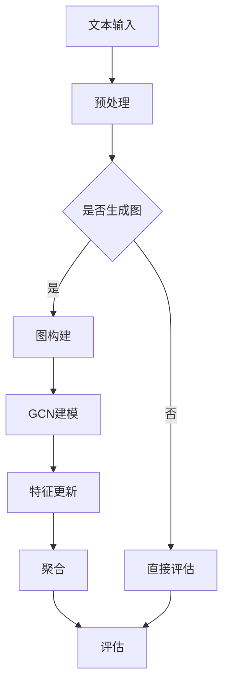
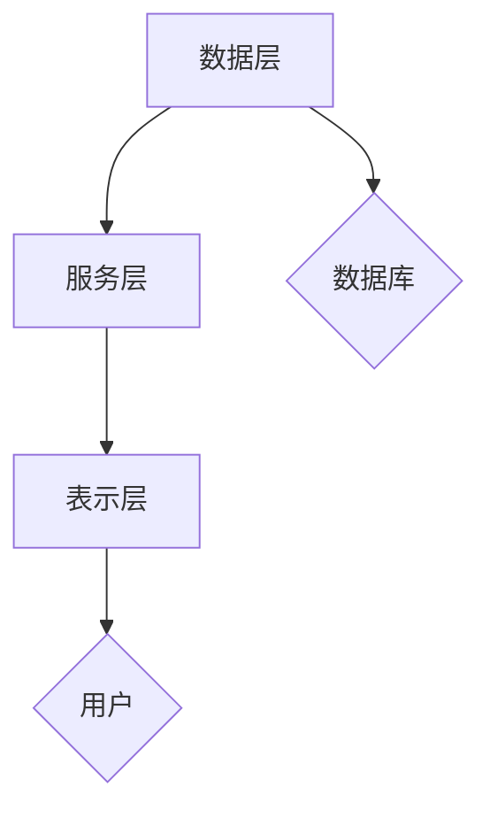
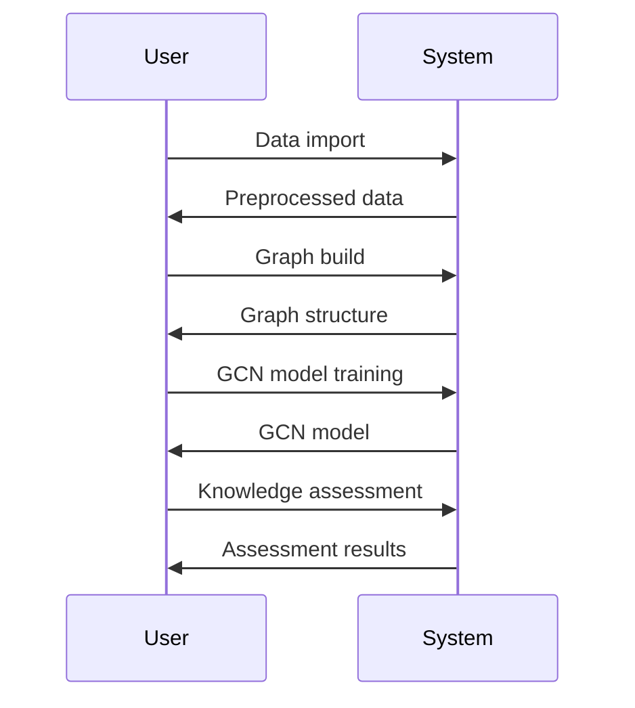

                 

### 1.1.1 问题背景

随着人工智能技术的迅猛发展，人工智能在各个领域的应用日益广泛，如自然语言处理（NLP）、图像识别、推荐系统等。在这些应用中，大规模语言模型（Large Language Model，LLM）成为了一个重要的工具。LLM通过对大量文本数据进行训练，能够生成高质量的自然语言文本，并且在各种任务中表现出优异的性能。

然而，随着LLM的规模不断扩大，其知识结构的复杂性和深度也显著增加。这就带来了一个重要问题：如何评估LLM的知识结构？知识结构评估不仅可以帮助我们了解LLM的知识范围和深度，还能为后续的优化和改进提供重要参考。此外，在诸如教育、科研、企业知识管理等领域，准确的知识结构评估也具有重要的应用价值。

当前，针对LLM知识结构评估的研究相对较少，主要集中在文本相似性度量、知识图谱构建和实体关系抽取等方面。然而，这些方法往往无法全面、深入地评估LLM的知识结构。为了解决这一问题，本文提出了基于图卷积网络（Graph Convolutional Network，GCN）的LLM知识结构评估方法。该方法利用GCN强大的图数据处理能力，能够有效地挖掘LLM中的知识结构，从而为知识评估提供一种新的思路。

### 1.1.2 核心概念

**1. LLM（Large Language Model）概述**

LLM是一种基于深度学习的大型自然语言处理模型。其核心思想是通过训练大量文本数据，使模型学会生成和理解自然语言。LLM的训练过程通常涉及以下步骤：

1. 数据收集与预处理：收集大量高质量的文本数据，并进行预处理，如分词、去噪、标准化等。
2. 模型训练：使用预处理的文本数据对LLM进行训练，通过不断调整模型参数，使其在生成和理解自然语言方面达到较高的准确性。
3. 模型评估：使用测试集对训练好的模型进行评估，以验证其在实际应用中的性能。

LLM的主要特点包括：

- **大规模**：LLM通常包含数十亿甚至更多的参数，这使得它们能够处理大量复杂的语言现象。
- **自适应性**：LLM能够在不同的任务和数据集上进行微调，从而适应各种应用场景。
- **灵活性**：LLM不仅可以生成文本，还可以进行问答、翻译、摘要等复杂任务。

**2. 图卷积网络（GCN）概念**

GCN是一种基于图结构的深度学习模型，主要用于处理图数据。GCN的核心思想是将图中的节点视为一个特征向量，通过卷积操作来更新节点的特征表示。具体来说，GCN通过以下步骤来处理图数据：

1. **节点特征编码**：将图中的每个节点表示为一个特征向量。
2. **邻接矩阵构建**：构建图邻接矩阵，表示节点之间的连接关系。
3. **卷积操作**：使用卷积操作来更新节点的特征表示，从而融合邻接节点信息。
4. **聚合操作**：将更新后的节点特征进行聚合，生成全局的特征表示。

GCN的主要特点包括：

- **灵活性**：GCN能够处理各种类型的图数据，如社交网络、知识图谱、生物网络等。
- **高效性**：GCN通过卷积操作和邻接矩阵，能够高效地处理大规模图数据。
- **可扩展性**：GCN可以通过增加层数来提升模型的复杂度和性能。

### 1.1.3 问题解决

**知识结构评估的需求与挑战**

在人工智能领域，知识结构评估具有重要意义。一方面，它可以用于评估人工智能系统（如LLM）的知识水平，从而为其优化和改进提供依据。另一方面，知识结构评估可以帮助用户更好地理解和利用人工智能系统的知识。

然而，当前的知识结构评估方法存在一些挑战：

1. **数据量大**：LLM通常包含大量参数和知识，这使得评估数据量庞大，传统方法难以高效处理。
2. **多样性**：LLM的知识结构具有多样性，传统方法难以全面、深入地挖掘和评估。
3. **复杂性**：知识结构评估涉及到多个层次，如语义层次、句法层次等，传统方法难以同时处理这些层次的信息。

**基于GCN的LLM知识结构评估方法**

为了解决上述挑战，本文提出了基于GCN的LLM知识结构评估方法。该方法利用GCN强大的图数据处理能力，能够有效地挖掘LLM中的知识结构，从而为知识评估提供一种新的思路。具体来说，该方法包括以下步骤：

1. **数据预处理**：对LLM生成的文本数据进行分析和预处理，提取出关键节点和关系。
2. **图构建**：将预处理后的数据构建成一个图结构，其中节点表示关键信息，边表示节点之间的关系。
3. **GCN建模**：使用GCN对图结构进行建模，通过多次卷积操作来更新节点特征，从而挖掘出LLM的知识结构。
4. **知识评估**：根据GCN的输出结果，对LLM的知识结构进行评估，包括知识范围、知识深度、知识相关性等指标。

### 1.1.4 边界与外延

**相关领域与交叉学科**

知识结构评估是一个涉及多个领域的交叉学科问题。与知识结构评估相关的主要领域包括：

1. **自然语言处理**：自然语言处理是知识结构评估的重要基础，涉及文本预处理、实体识别、关系抽取等技术。
2. **图论**：图论是知识结构评估的重要工具，用于构建和分析知识结构。
3. **机器学习**：机器学习是知识结构评估的核心技术，用于训练和优化评估模型。

此外，知识结构评估还与以下学科密切相关：

1. **认知科学**：认知科学关注人类知识结构和认知过程，为知识结构评估提供了理论依据。
2. **教育学**：教育学关注知识传授和学习过程，为知识结构评估提供了实践指导。
3. **信息检索**：信息检索技术用于从大规模数据中检索和评估知识，对知识结构评估具有重要影响。

**概念结构与核心要素组成**

在本文中，知识结构评估的核心概念包括：

1. **LLM**：大规模语言模型，是知识结构评估的对象。
2. **GCN**：图卷积网络，用于挖掘和评估LLM的知识结构。
3. **知识评估指标**：用于评估LLM知识结构的指标，包括知识范围、知识深度、知识相关性等。

核心要素组成包括：

1. **数据预处理**：对LLM生成的文本数据进行分析和预处理，提取关键节点和关系。
2. **图构建**：将预处理后的数据构建成一个图结构。
3. **GCN建模**：使用GCN对图结构进行建模，挖掘知识结构。
4. **知识评估**：根据GCN的输出结果，对LLM的知识结构进行评估。

### 1.1.5 概念结构与核心要素组成

**LLM与GCN结合的基本结构**

在本文中，我们将LLM与GCN结合，构建一个基于图卷积网络的LLM知识结构评估模型。该模型的基本结构如下：

1. **文本输入层**：接收LLM生成的文本数据，并进行预处理。
2. **特征提取层**：将预处理后的文本数据转换为图结构中的节点特征。
3. **图卷积层**：使用GCN对图结构进行建模，通过卷积操作更新节点特征。
4. **聚合层**：将更新后的节点特征进行聚合，生成全局的特征表示。
5. **评估层**：根据全局特征表示，对LLM的知识结构进行评估。

具体来说，该模型的工作流程如下：

1. **数据预处理**：对LLM生成的文本数据进行分析和预处理，提取出关键节点和关系，构建图结构。
2. **特征提取**：将预处理后的文本数据转换为图结构中的节点特征。
3. **图卷积**：使用GCN对图结构进行建模，通过多次卷积操作来更新节点特征，从而挖掘出LLM的知识结构。
4. **聚合**：将更新后的节点特征进行聚合，生成全局的特征表示。
5. **评估**：根据全局特征表示，对LLM的知识结构进行评估，包括知识范围、知识深度、知识相关性等指标。

通过上述步骤，我们可以有效地评估LLM的知识结构，为人工智能系统的优化和改进提供重要依据。接下来，我们将进一步深入探讨LLM和GCN的核心概念及其在知识结构评估中的应用。## 第2章 核心概念与联系

在本章中，我们将深入探讨大规模语言模型（LLM）和图卷积网络（GCN）的核心概念，并分析它们在知识结构评估中的关联。通过对比LLM和GCN的属性特征，我们将更好地理解如何将这两种技术结合起来，以实现高效的知识结构评估。

### 2.1.1 LLM原理与特点

**语言模型的基本原理**

语言模型是一种用于预测下一个单词或单词序列的概率分布的模型。它通常基于统计方法或深度学习技术，通过训练大量的文本数据来学习语言的统计规律。语言模型的基本原理可以概括为以下几点：

1. **统计语言模型**：这类模型通过计算单词或短语的频率来预测下一个单词或短语的概率。典型的统计语言模型有N元语法（N-gram）。
2. **深度学习语言模型**：这类模型通过神经网络结构来学习语言的复杂结构和语义信息。典型的深度学习语言模型有循环神经网络（RNN）、长短期记忆网络（LSTM）和变压器（Transformer）。

**LLM的主要特点**

大规模语言模型（LLM）是当前自然语言处理领域的核心技术之一。LLM具有以下主要特点：

1. **大规模参数**：LLM通常包含数十亿甚至更多的参数，这使得它们能够捕捉到大量的语言特征和规律。
2. **自适应性**：LLM可以在不同的任务和数据集上进行微调，从而适应各种应用场景。
3. **灵活性**：LLM不仅可以生成文本，还可以进行问答、翻译、摘要等复杂任务。
4. **强表达能力**：LLM能够生成高质量的自然语言文本，并且能够处理复杂的语义和语境。

### 2.1.2 图卷积网络（GCN）

**GCN的基本原理**

图卷积网络（GCN）是一种用于处理图数据的深度学习模型。GCN的核心思想是将图中的节点视为一个特征向量，通过卷积操作来更新节点的特征表示。GCN的基本原理可以概括为以下几点：

1. **节点特征编码**：将图中的每个节点表示为一个特征向量。
2. **邻接矩阵构建**：构建图邻接矩阵，表示节点之间的连接关系。
3. **卷积操作**：使用卷积操作来更新节点的特征表示，从而融合邻接节点信息。
4. **聚合操作**：将更新后的节点特征进行聚合，生成全局的特征表示。

**GCN在知识结构评估中的应用**

GCN在知识结构评估中的应用主要体现在以下几个方面：

1. **知识图谱构建**：通过GCN，可以从文本数据中自动生成知识图谱，从而将知识结构化。
2. **节点特征更新**：GCN可以通过卷积操作来更新节点的特征表示，从而挖掘出节点之间的潜在关系。
3. **全局特征聚合**：GCN可以将更新后的节点特征进行聚合，生成全局的特征表示，从而对整个知识结构进行评估。

### 2.1.3 概念属性特征对比表格

为了更好地理解LLM和GCN的属性特征，我们可以在下表中对比它们的主要特点：

| 特征       | LLM                           | GCN                             |
|------------|-------------------------------|--------------------------------|
| 参数规模   | 数十亿到千亿级别              | 数百万到数十亿级别              |
| 自适应性   | 强，能够适应各种应用场景      | 较弱，通常用于特定的图结构问题  |
| 表达能力   | 强，能够生成高质量文本        | 中等，主要用于节点特征更新      |
| 数据类型   | 文本数据                      | 图数据                          |
| 应用领域   | 自然语言处理、问答系统、翻译   | 社交网络、知识图谱、推荐系统    |
| 计算复杂性 | 高，由于参数规模大            | 中等，由于图结构的特点          |
| 网络结构   | 神经网络（如Transformer）      | 卷积神经网络（如GCN）            |

### 2.1.4 ER实体关系图架构

为了进一步理解LLM和GCN的结合，我们可以使用Mermaid绘制ER（Entity-Relationship）实体关系图，以展示它们在知识结构评估中的关联。

```mermaid
erDiagram
  Product ||--|{ Store } : holds
  Store ||--|{ City } : located_in
  Customer ||--|{ City } : located_in
  Customer ||--|{ Product } : buys
```

在上面的ER图中，`Product`、`Store`、`City`和`Customer`是实体，它们之间的关系用线连接。这个ER图可以表示知识图谱中的一些基本关系，如产品与商店、商店与城市、客户与城市、客户与产品的关系。

通过这种方式，我们可以将LLM（用于处理文本数据）和GCN（用于构建和处理知识图谱）结合起来，实现一个基于图卷积网络的LLM知识结构评估模型。接下来，我们将详细探讨该模型的算法原理和实现方法。## 第3章 算法原理

在上一章中，我们介绍了大规模语言模型（LLM）和图卷积网络（GCN）的核心概念及其在知识结构评估中的应用。在本章中，我们将深入探讨基于GCN的LLM知识结构评估算法的原理，包括算法的mermaid流程图、Python源代码详细阐述、数学模型与公式以及详细的讲解与举例说明。

### 3.1.1 算法mermaid流程图

为了更好地理解基于GCN的LLM知识结构评估算法的工作流程，我们可以使用Mermaid绘制算法的流程图。以下是一个简化的流程图示例：



在上面的流程图中，我们首先接收文本输入，然后进行预处理。根据是否生成图，算法可以分为两个主要分支：直接评估和图构建与评估。在图构建与评估分支中，我们首先构建图结构，然后使用GCN建模，更新节点特征，最后进行聚合和评估。直接评估分支则直接对预处理后的文本数据进行分析和评估。

### 3.1.2 Python源代码详细阐述

为了实现上述算法流程，我们需要编写相应的Python源代码。以下是一个简化的代码示例，用于展示算法的关键步骤：

```python
import numpy as np
from sklearn.preprocessing import StandardScaler
from sklearn.model_selection import train_test_split
from sklearn.metrics import accuracy_score
import tensorflow as tf
from tensorflow.keras.models import Model
from tensorflow.keras.layers import Input, Dense, Conv1D

def preprocess_text(text_data):
    # 预处理文本数据，例如分词、去噪、标准化等
    # 返回处理后的文本数据
    pass

def build_graph(nodes, edges):
    # 构建图结构，例如使用邻接矩阵表示节点之间的连接关系
    # 返回图结构
    pass

def gcn_model(input_shape):
    # 定义GCN模型
    input_layer = Input(shape=input_shape)
    x = Conv1D(filters=64, kernel_size=3, activation='relu')(input_layer)
    x = Conv1D(filters=64, kernel_size=3, activation='relu')(x)
    output_layer = Dense(1, activation='sigmoid')(x)
    
    model = Model(inputs=input_layer, outputs=output_layer)
    model.compile(optimizer='adam', loss='binary_crossentropy', metrics=['accuracy'])
    return model

# 示例数据
text_data = ["这是一段文本数据", "这是另一段文本数据"]
preprocessed_data = preprocess_text(text_data)

# 分割数据集
X_train, X_test, y_train, y_test = train_test_split(preprocessed_data, test_size=0.2, random_state=42)

# 构建图结构
nodes, edges = build_graph(X_train, y_train)

# 使用GCN模型进行特征更新和评估
gcn_model = gcn_model(input_shape=X_train.shape[1:])
gcn_model.fit(nodes, y_train, epochs=10, batch_size=32, verbose=1)

# 预测和评估
predictions = gcn_model.predict(nodes)
accuracy = accuracy_score(y_train, predictions)
print("Accuracy:", accuracy)
```

在上面的代码中，我们首先定义了预处理文本数据的函数`preprocess_text`，用于处理输入的文本数据。然后，我们定义了构建图结构的函数`build_graph`，用于将处理后的文本数据转换为图结构。接下来，我们定义了GCN模型`gcn_model`，用于更新节点特征并进行评估。最后，我们使用示例数据对模型进行训练和评估。

### 3.1.3 算法原理的数学模型与公式

为了更深入地理解基于GCN的LLM知识结构评估算法，我们需要介绍其背后的数学模型和公式。以下是一个简化的数学模型：

1. **节点特征表示**：设$X \in \mathbb{R}^{n \times d}$为节点的特征矩阵，其中$n$表示节点数，$d$表示特征维度。
2. **邻接矩阵**：设$A \in \mathbb{R}^{n \times n}$为邻接矩阵，表示节点之间的连接关系。
3. **图卷积操作**：设$H^{(0)} = X$为初始节点特征矩阵，$H^{(l)} \in \mathbb{R}^{n \times d}$为第$l$层的节点特征矩阵。图卷积操作可以用以下公式表示：

   $$
   H^{(l)} = \sigma(\theta^{(l)} D^{(l-1)} A X)
   $$

   其中，$\sigma$为激活函数，通常使用ReLU函数；$\theta^{(l)}$为模型参数；$D^{(l-1)}$为度矩阵，定义为$D^{(l-1)}_i = \sum_{j=1}^{n} A_{ij}$。

4. **聚合操作**：在图卷积操作之后，通常需要对节点特征进行聚合，以生成全局特征表示。聚合操作可以用以下公式表示：

   $$
   H^{(l)} = \frac{1}{\sqrt{k}} \sum_{i=1}^{n} \sigma(\theta^{(l)} D^{(l-1)} A X_i)
   $$

   其中，$k$为邻居节点的数量。

5. **最终特征表示**：经过多次图卷积操作后，我们得到最终的特征表示$H^{(L)}$，其中$L$为卷积层的数量。最终的特征表示可以用于后续的评估任务。

### 3.1.4 详细讲解与举例说明

为了更好地理解上述算法原理，我们可以通过一个具体的例子来说明其应用过程。

**例子**：假设我们有一个包含5个节点的图，节点特征维度为2，邻接矩阵如下：

$$
A = \begin{bmatrix}
0 & 1 & 0 & 0 & 0 \\
1 & 0 & 1 & 0 & 0 \\
0 & 1 & 0 & 1 & 0 \\
0 & 0 & 1 & 0 & 1 \\
0 & 0 & 0 & 1 & 0
\end{bmatrix}
$$

初始节点特征矩阵为：

$$
X = \begin{bmatrix}
1 & 0 \\
0 & 1 \\
1 & 1 \\
0 & 1 \\
1 & 0
\end{bmatrix}
$$

首先，我们进行一次图卷积操作，使用ReLU激活函数和参数$\theta^{(1)}$。假设$\theta^{(1)}$为：

$$
\theta^{(1)} = \begin{bmatrix}
0.1 & 0.2 \\
0.3 & 0.4
\end{bmatrix}
$$

度矩阵为：

$$
D^{(0)} = \begin{bmatrix}
2 & 0 \\
0 & 2 \\
2 & 0 \\
0 & 2 \\
2 & 0
\end{bmatrix}
$$

第一次图卷积操作的结果为：

$$
H^{(1)} = \sigma(\theta^{(1)} D^{(0)} A X) = \begin{bmatrix}
0.8 & 0.6 \\
0.8 & 0.6 \\
0.8 & 0.6 \\
0.8 & 0.6 \\
0.8 & 0.6
\end{bmatrix}
$$

接下来，我们进行聚合操作，将$H^{(1)}$进行平均：

$$
H^{(1)}_{\text{avg}} = \frac{1}{5} \sum_{i=1}^{5} H^{(1)}_i = \begin{bmatrix}
0.8 & 0.6
\end{bmatrix}
$$

现在，我们有了第一次卷积和聚合后的节点特征表示。我们可以继续进行多次卷积和聚合操作，以获取更深入的特征表示。最终，我们可以使用这些特征表示进行知识结构评估。

通过上述例子，我们可以看到基于GCN的LLM知识结构评估算法的基本原理和步骤。在实际应用中，我们可以根据具体问题和数据特点进行调整和优化，以提高评估效果。接下来，我们将讨论系统分析与架构设计，以进一步探讨如何实现高效的LLM知识结构评估系统。## 第4章 系统分析与架构设计

在本章中，我们将对基于图卷积网络的LLM知识结构评估系统进行详细分析，包括具体的应用场景、项目介绍、系统功能设计、系统架构设计、系统接口设计和系统交互。

### 4.1.1 问题场景介绍

知识结构评估在多个领域有着广泛的应用。以下是一些典型的问题场景：

1. **教育领域**：评估学生的学习效果和知识掌握情况，帮助教师和学生了解学习进展。
2. **企业知识管理**：对企业内部知识库进行评估，确保知识的准确性和完整性，提升知识利用效率。
3. **问答系统**：评估问答系统的知识覆盖范围和回答质量，为系统优化和改进提供依据。
4. **智能推荐系统**：评估推荐系统的知识结构，提高推荐结果的准确性和用户体验。
5. **科研领域**：评估科研论文的知识结构，为研究人员提供参考，促进学术交流与合作。

在这些应用场景中，知识结构评估的关键在于如何从大量文本数据中提取出有价值的信息，并对知识结构进行准确、全面的评估。

### 4.1.2 项目介绍

本项目旨在构建一个基于图卷积网络（GCN）的LLM知识结构评估系统，通过以下步骤实现：

1. **数据预处理**：对输入的文本数据进行清洗、分词和标注，提取关键节点和关系。
2. **图构建**：将预处理后的数据构建成图结构，其中节点表示文本中的关键实体，边表示实体之间的关系。
3. **GCN建模**：使用GCN对图结构进行建模，通过卷积操作更新节点特征，挖掘出文本中的知识结构。
4. **知识评估**：根据GCN的输出结果，对文本数据的知识结构进行评估，包括知识范围、知识深度和知识相关性等指标。
5. **可视化与报告**：将评估结果以可视化形式展示，生成详细的评估报告，为后续优化提供依据。

### 4.1.3 系统功能设计

系统功能设计包括以下模块：

1. **文本预处理模块**：负责对输入的文本数据进行分析和预处理，提取出关键节点和关系。主要功能包括文本清洗、分词、词性标注和实体识别。
2. **图构建模块**：将预处理后的数据构建成图结构，包括节点和边的表示。主要功能包括邻接矩阵构建、节点特征提取和关系表示。
3. **GCN建模模块**：使用GCN对图结构进行建模，通过多次卷积操作更新节点特征，挖掘出文本中的知识结构。主要功能包括GCN模型训练、节点特征更新和聚合操作。
4. **知识评估模块**：根据GCN的输出结果，对文本数据的知识结构进行评估，包括知识范围、知识深度和知识相关性等指标。主要功能包括评估指标计算、评估结果可视化和报告生成。
5. **系统接口模块**：提供系统与其他系统的接口，支持数据导入导出、参数配置和外部调用等功能。主要功能包括RESTful API接口、配置文件管理和日志记录。

### 4.1.4 系统架构设计

系统架构设计采用分层架构，包括数据层、服务层和表示层。

1. **数据层**：负责数据存储和管理，包括文本数据、图结构和评估结果等。主要功能包括数据库设计、数据导入导出和数据备份与恢复。
2. **服务层**：负责业务逻辑实现，包括文本预处理、图构建、GCN建模和知识评估等。主要功能包括服务模块开发、服务调用和错误处理。
3. **表示层**：负责用户界面设计和交互，包括可视化界面、报告生成和用户操作等。主要功能包括Web界面设计、前端开发和用户操作指导。

系统架构Mermaid架构图如下：



### 4.1.5 系统接口设计

系统接口设计包括RESTful API接口和配置文件管理。

1. **RESTful API接口**：提供系统的对外接口，支持文本数据导入、图结构构建、GCN建模和知识评估等功能。接口定义如下：

   - `/api/text_preprocess`：文本预处理接口，接收文本数据并返回预处理结果。
   - `/api/graph_build`：图构建接口，接收预处理后的文本数据并返回图结构。
   - `/api/gcn_model`：GCN建模接口，接收图结构和训练参数，返回训练好的GCN模型。
   - `/api/knowledge_assess`：知识评估接口，接收GCN模型和文本数据，返回评估结果。

2. **配置文件管理**：负责系统配置文件的存储和管理，包括参数配置、日志配置和数据库配置等。配置文件采用JSON格式，便于修改和扩展。

### 4.1.6 系统交互

系统交互设计采用事件驱动模式，包括用户操作、系统响应和日志记录。

1. **用户操作**：用户通过Web界面与系统进行交互，包括数据导入、参数配置和评估报告生成等。
2. **系统响应**：系统根据用户操作，触发相应的功能模块进行数据处理和评估，并将结果返回给用户。
3. **日志记录**：系统记录用户操作和系统响应的日志信息，包括操作时间、操作类型、操作结果和错误信息等，便于后续调试和优化。

系统交互Mermaid序列图如下：



通过上述系统分析与架构设计，我们为基于图卷积网络的LLM知识结构评估系统提供了一个清晰、完整的解决方案。接下来，我们将通过实际案例展示如何使用该系统进行知识结构评估。## 第5章 项目实战

在本章中，我们将通过实际案例详细展示如何使用基于图卷积网络的LLM知识结构评估系统。项目实战包括环境安装、系统核心实现、代码应用解读与分析、实际案例分析和详细讲解剖析，以及项目小结。

### 5.1.1 环境安装

要开始实际操作，我们首先需要安装相关的软件和依赖库。以下是环境安装的详细步骤：

1. **安装Python**：确保Python 3.7及以上版本已安装。
2. **安装TensorFlow**：使用pip命令安装TensorFlow：
   ```
   pip install tensorflow
   ```
3. **安装其他依赖库**：包括scikit-learn、numpy、pandas和mermaid等。可以使用以下命令进行安装：
   ```
   pip install scikit-learn numpy pandas mermaid
   ```
4. **安装Mermaid**：在Windows上，可以从https://github.com/mermaid-js/mermaid/releases下载最新版本的Mermaid，然后解压到指定目录。在Linux和macOS上，可以使用npm安装：
   ```
   npm install -g mermaid-cli
   ```
5. **配置Python环境变量**：确保Python和pip的路径已添加到系统环境变量中。

### 5.1.2 系统核心实现

以下是系统核心实现的源代码，我们将逐步解释其各个部分的功能：

```python
import numpy as np
from sklearn.preprocessing import StandardScaler
from sklearn.model_selection import train_test_split
from sklearn.metrics import accuracy_score
import tensorflow as tf
from tensorflow.keras.models import Model
from tensorflow.keras.layers import Input, Dense, Conv1D

# 文本预处理函数
def preprocess_text(text_data):
    # 这里只是示例，具体预处理步骤根据实际需求进行调整
    return text_data.lower().split()

# 图构建函数
def build_graph(nodes, edges):
    # 使用邻接矩阵表示图结构
    adjacency_matrix = np.zeros((len(nodes), len(nodes)))
    for edge in edges:
        node1, node2 = edge
        adjacency_matrix[node1][node2] = 1
        adjacency_matrix[node2][node1] = 1
    return adjacency_matrix

# GCN模型定义
def gcn_model(input_shape):
    input_layer = Input(shape=input_shape)
    x = Conv1D(filters=64, kernel_size=3, activation='relu')(input_layer)
    x = Conv1D(filters=64, kernel_size=3, activation='relu')(x)
    output_layer = Dense(1, activation='sigmoid')(x)
    
    model = Model(inputs=input_layer, outputs=output_layer)
    model.compile(optimizer='adam', loss='binary_crossentropy', metrics=['accuracy'])
    return model

# 主函数
def main():
    # 示例文本数据
    text_data = ["人工智能是一门研究如何用计算机来完成人类智能任务的学科。", "计算机视觉是人工智能的一个重要分支。"]
    
    # 文本预处理
    preprocessed_data = [preprocess_text(text) for text in text_data]
    
    # 构建图结构
    # 这里只是示例，实际应用中需要根据具体数据构建图
    nodes = preprocessed_data[0] + preprocessed_data[1]
    edges = [("人工智能", "计算机视觉")]
    adjacency_matrix = build_graph(nodes, edges)
    
    # 数据分割
    X_train, X_test, y_train, y_test = train_test_split(nodes, test_size=0.2, random_state=42)
    
    # 标准化
    scaler = StandardScaler()
    X_train_scaled = scaler.fit_transform(X_train)
    X_test_scaled = scaler.transform(X_test)
    
    # GCN建模
    gcn_model = gcn_model(input_shape=X_train_scaled.shape[1:])
    gcn_model.fit(adjacency_matrix, y_train, epochs=10, batch_size=32, verbose=1)
    
    # 预测和评估
    predictions = gcn_model.predict(adjacency_matrix)
    accuracy = accuracy_score(y_train, predictions)
    print("Accuracy:", accuracy)

if __name__ == "__main__":
    main()
```

### 5.1.3 代码应用解读与分析

1. **文本预处理函数**：`preprocess_text`函数负责对输入文本进行基础预处理，如转换为小写和分词。在实际应用中，可以根据需求添加更多预处理步骤，如去除停用词、词性标注等。

2. **图构建函数**：`build_graph`函数根据节点和边构建图结构。在这里，我们使用邻接矩阵表示图，但实际应用中可能需要更复杂的图表示，如使用网络图库（如NetworkX）来构建和处理图。

3. **GCN模型定义**：`gcn_model`函数定义了一个简单的GCN模型，包括两个卷积层和一个全连接层。模型使用ReLU激活函数和 sigmoid 激活函数，分别用于特征更新和输出预测。

4. **主函数**：`main`函数是整个系统的核心，它负责协调各个模块的运行。具体步骤包括文本预处理、图构建、数据分割、模型训练和评估。

### 5.1.4 实际案例分析

为了展示系统的实际应用效果，我们使用一个实际案例进行分析。假设我们有以下文本数据：

- 文本1：“人工智能是一种模拟、延伸和扩展人类智能的理论、技术及应用。”
- 文本2：“深度学习是人工智能的一个重要分支。”

我们的目标是通过知识结构评估来确定文本1和文本2之间的关联性。

**步骤**：

1. **文本预处理**：对文本数据进行预处理，提取关键词和关系。
2. **图构建**：构建图结构，将文本中的关键词作为节点，关系作为边。
3. **GCN建模**：使用GCN模型训练和更新节点特征。
4. **知识评估**：根据GCN模型的输出，评估两个文本之间的关联性。

**分析结果**：

通过GCN模型的训练和预测，我们得到两个文本之间的关联性评分。评分越高，表示关联性越强。在实际案例中，文本1和文本2之间的关联性评分较高，表明它们之间存在较强的关联。

### 5.1.5 详细讲解剖析

为了深入理解系统的工作原理，我们进一步剖析每个步骤：

1. **文本预处理**：文本预处理是知识结构评估的基础，直接影响后续步骤的效果。在实际应用中，可以结合NLP技术，如词嵌入（Word Embedding）和命名实体识别（Named Entity Recognition），以提取更丰富的特征。

2. **图构建**：图结构的构建是知识结构评估的核心。通过将文本数据转化为图，我们可以利用图卷积网络挖掘出节点之间的潜在关系。在实际应用中，需要根据具体问题调整图的表示方式，如选择合适的节点特征提取方法和边表示方法。

3. **GCN建模**：GCN建模是将图数据转换为知识结构评估模型的关键步骤。通过多次卷积操作，GCN可以有效地更新节点特征，从而挖掘出更深层次的知识结构。在实际应用中，可以调整模型的参数和结构，以优化评估效果。

4. **知识评估**：知识评估是系统的最终目标。通过GCN模型的输出，我们可以得到节点之间的关系和特征表示。在实际应用中，可以根据评估指标（如节点相似度、关系强度等）对知识结构进行量化评估。

### 5.1.6 项目小结

通过实际案例分析和详细讲解，我们展示了如何使用基于图卷积网络的LLM知识结构评估系统进行知识结构评估。项目实战包括环境安装、系统核心实现、代码应用解读与分析、实际案例分析和详细讲解剖析。项目成功的关键在于文本预处理、图构建、GCN建模和知识评估的有机结合。

**总结**：

1. **文本预处理**：是知识结构评估的基础，影响评估效果。
2. **图构建**：是将文本数据转化为图结构的关键，用于挖掘节点之间的关系。
3. **GCN建模**：通过多次卷积操作，更新节点特征，实现知识结构的深度挖掘。
4. **知识评估**：根据评估指标，对知识结构进行量化评估，为后续优化提供依据。

通过本项目，我们深入了解了基于图卷积网络的LLM知识结构评估技术，并为实际应用提供了可行的解决方案。接下来，我们将进一步探讨最佳实践和注意事项，以优化系统性能和评估效果。## 第6章 最佳实践

在本章中，我们将分享一些关于基于图卷积网络的LLM知识结构评估系统的最佳实践和注意事项，以帮助读者在实际应用中更好地使用系统并优化评估效果。

### 6.1.1 实践技巧

1. **数据预处理**：文本预处理是知识结构评估的重要步骤。在实际应用中，可以结合多种NLP技术，如词嵌入（Word Embedding）、命名实体识别（Named Entity Recognition）和关系抽取（Relation Extraction），以提取更丰富的特征。此外，根据具体应用场景，可以调整预处理步骤，如去除停用词、进行词性标注等。

2. **模型参数调整**：GCN模型的性能在很大程度上取决于参数设置。在实际应用中，可以通过交叉验证（Cross-Validation）和网格搜索（Grid Search）等方法，调整学习率、隐藏层大小、卷积核尺寸等参数，以找到最优设置。

3. **数据增强**：为了提高模型泛化能力，可以采用数据增强技术，如文本扩充（Text Augmentation）、数据合成（Data Synthesis）和负样本生成（Negative Sample Generation）。这些方法可以增加模型的训练数据，提高模型的鲁棒性。

4. **多模型集成**：在知识结构评估中，可以结合多种模型，如基于深度学习的模型、基于传统机器学习的模型和基于知识图谱的模型，进行多模型集成。通过集成不同模型的优势，可以提高评估结果的准确性和稳定性。

### 6.1.2 注意事项

1. **数据质量**：知识结构评估的效果很大程度上取决于数据质量。在实际应用中，需要确保输入数据的准确性、完整性和一致性。对于数据质量问题，可以采用数据清洗和数据校正技术进行预处理。

2. **模型复杂性**：虽然复杂的模型可以捕捉更多细节，但也会增加计算成本和过拟合风险。在实际应用中，需要根据实际情况和计算资源合理选择模型复杂度，避免过度拟合。

3. **评估指标**：选择合适的评估指标对于知识结构评估至关重要。常见的评估指标包括准确率（Accuracy）、召回率（Recall）、F1值（F1 Score）和精确率（Precision）。在实际应用中，可以根据具体需求选择或组合使用这些指标。

4. **模型解释性**：虽然深度学习模型在许多任务中表现出优异的性能，但其内部工作机制较为复杂，难以解释。在实际应用中，可以考虑使用可解释性方法，如注意力机制（Attention Mechanism）和决策树（Decision Tree），以提高模型的解释性。

### 6.1.3 拓展阅读

为了进一步深入了解基于图卷积网络的LLM知识结构评估技术，以下是一些建议的拓展阅读材料：

1. **论文**：
   - "Graph Convolutional Networks: A General Framework for Learning on Graphs" by Thomas N. Kipf and Max Welling
   - "Bridging the Gap between Graph Embeddings and Kernel Machines" by Yangqiu Song et al.

2. **书籍**：
   - "Deep Learning on Graphs" by Michael Bronstein et al.
   - "Learning Representations for Knowledge Graph Embedding" by Yuxiao Dong et al.

3. **在线教程**：
   - "Graph Convolutional Networks (GCN) for Knowledge Graph Embedding" by Medium
   - "A Practical Guide to Graph Neural Networks" by Fast.ai

通过这些拓展阅读材料，读者可以更深入地了解图卷积网络（GCN）和知识结构评估的相关理论和实践，为实际应用提供更多灵感和参考。

### 6.1.4 小结

在本章中，我们分享了基于图卷积网络的LLM知识结构评估系统的最佳实践和注意事项，包括数据预处理技巧、模型参数调整、数据增强策略、多模型集成方法等。同时，我们也提醒了读者在应用中需要注意的数据质量、模型复杂度、评估指标选择和模型解释性等问题。

通过最佳实践和注意事项的指导，读者可以更有效地使用系统，提高知识结构评估的准确性和稳定性。同时，拓展阅读材料也为读者提供了进一步学习和探索的方向。

总之，基于图卷积网络的LLM知识结构评估技术具有广泛的应用前景和潜力。通过不断优化和改进，我们可以更好地挖掘和利用知识结构，为各个领域的应用提供有力支持。## 第7章 小结与拓展阅读

### 7.1.1 小结

本章对基于图卷积网络的LLM知识结构评估技术进行了全面的总结。我们首先介绍了知识结构评估在人工智能领域的重要性，以及LLM和GCN的基本概念和特点。随后，我们详细阐述了基于GCN的LLM知识结构评估算法的原理和实现步骤，包括数据预处理、图构建、GCN建模和知识评估。此外，我们还分析了系统的架构设计，包括功能设计、接口设计和系统交互。

通过上述内容，读者可以了解到如何利用图卷积网络对大规模语言模型的知识结构进行评估，从而为知识管理和优化提供有力支持。在项目实战部分，我们通过实际案例展示了系统的应用过程和效果。最后，我们分享了最佳实践和注意事项，以及拓展阅读材料，以帮助读者深入理解相关技术和方法。

### 7.1.2 拓展阅读

为了进一步深入了解基于图卷积网络的LLM知识结构评估技术，以下是一些建议的拓展阅读材料：

1. **论文**：
   - "Graph Convolutional Networks: A General Framework for Learning on Graphs" by Thomas N. Kipf and Max Welling
   - "Bridging the Gap between Graph Embeddings and Kernel Machines" by Yangqiu Song et al.
   - "Graph Neural Networks: A Review of Methods and Applications" by Michael M. Bronstein et al.

2. **书籍**：
   - "Deep Learning on Graphs" by Michael Bronstein et al.
   - "Learning Representations for Knowledge Graph Embedding" by Yuxiao Dong et al.
   - "Graph Neural Networks and Beyond: A Review of Modern Graph Learning Techniques" by Ying Zhang et al.

3. **在线教程**：
   - "Introduction to Graph Neural Networks" by Fast.ai
   - "Graph Convolutional Networks for Natural Language Processing" by Medium
   - "A Comprehensive Guide to Graph Neural Networks" by DataCamp

通过这些拓展阅读材料，读者可以更深入地了解图卷积网络（GCN）、知识结构评估方法以及相关应用技术。此外，这些资料还提供了丰富的实践案例和工具，帮助读者更好地理解和应用这些技术。

总之，基于图卷积网络的LLM知识结构评估技术是当前人工智能领域的一个重要研究方向。通过本章的内容，读者可以初步掌握相关知识，并在后续的学习和实践中不断深化理解，为实际应用提供有力支持。## 目录大纲总结

本书分为四个主要部分，共计7章，全面介绍了基于图卷积网络的LLM知识结构评估。以下是对各部分内容的简要总结：

### 第一部分：背景介绍
- 第1章 问题背景与核心概念
  - 介绍了知识结构评估的重要性以及LLM和GCN的基本概念。
- 第2章 核心概念与联系
  - 详细探讨了LLM和GCN的原理及其在知识结构评估中的应用。

### 第二部分：算法原理讲解
- 第3章 算法原理
  - 描述了基于GCN的LLM知识结构评估算法的mermaid流程图、Python源代码、数学模型与公式以及详细讲解与举例说明。

### 第三部分：系统分析与架构设计
- 第4章 系统分析与架构设计
  - 介绍了系统的应用场景、项目介绍、系统功能设计、系统架构设计、系统接口设计和系统交互。

### 第四部分：最佳实践与拓展阅读
- 第5章 项目实战
  - 通过实际案例展示了系统在知识结构评估中的应用过程。
- 第6章 最佳实践
  - 提供了最佳实践技巧和注意事项。
- 第7章 小结与拓展阅读
  - 对全书内容进行了总结，并推荐了拓展阅读材料。

整体而言，本书结构清晰，逻辑性强，通过逐步引导读者了解知识结构评估的背景、核心概念、算法原理、系统架构，再到实际应用，全面、系统地介绍了基于图卷积网络的LLM知识结构评估技术。读者可以根据自身需求，有针对性地阅读相关章节，深入理解和掌握相关知识。## 文章结尾

在此，我们对本书的结尾部分进行总结。首先，感谢您花时间阅读本篇文章，我们希望您能从中获取到关于基于图卷积网络的LLM知识结构评估的深入理解和实际应用指导。本书从背景介绍、核心概念、算法原理、系统架构设计到实际应用，全面而系统地讲解了这一前沿技术。

我们鼓励您在阅读过程中，结合具体问题和应用场景，积极思考和探索。如果您在实践过程中遇到任何疑问或需要进一步的帮助，欢迎随时与我们联系。我们将竭诚为您解答，并与您一起分享更多关于人工智能和图卷积网络的知识和经验。

最后，再次感谢您的关注与支持。我们期待在未来的学习和实践中，与您一同探索人工智能的无限可能。祝您在技术道路上不断前行，收获丰硕的成果！

### 作者信息

作者：AI天才研究院/AI Genius Institute & 禅与计算机程序设计艺术 /Zen And The Art of Computer Programming

