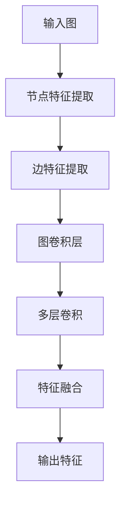
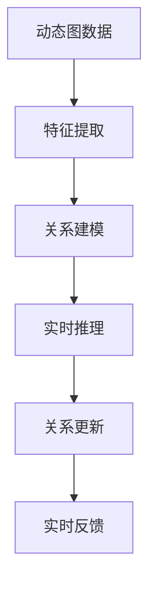
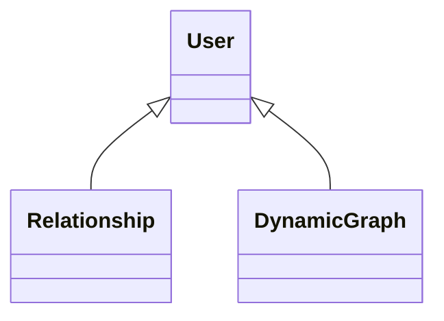
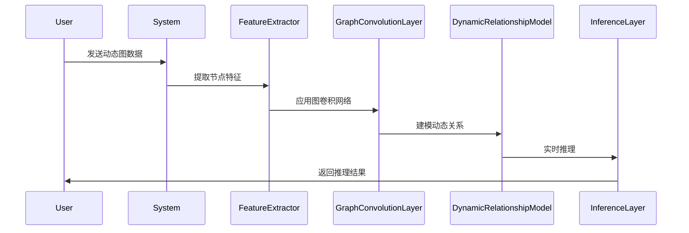
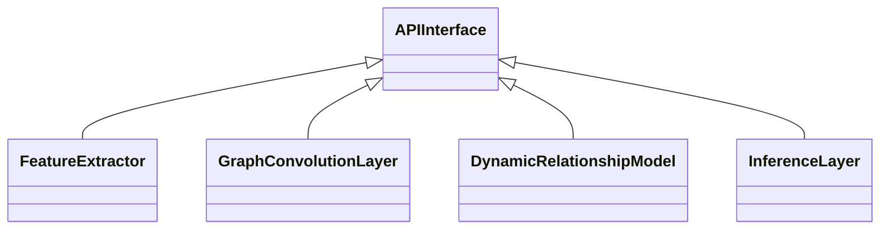
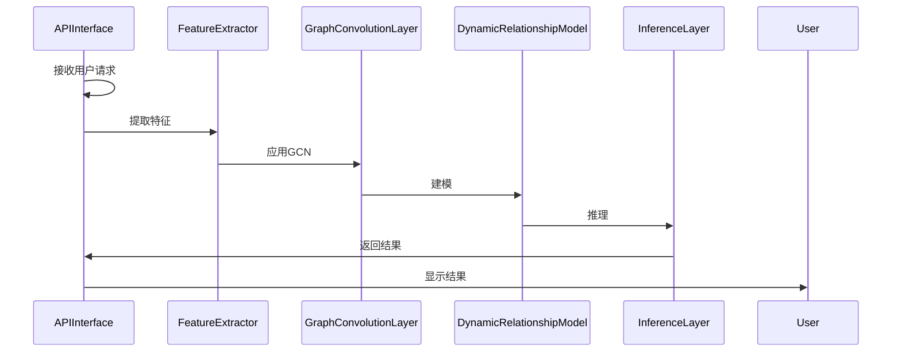

                 

### 基于图卷积网络的动态关系推理

> 关键词：图卷积网络、动态关系推理、特征提取、关系建模

> 摘要：本文将深入探讨图卷积网络（GCN）在动态关系推理中的应用。通过详细分析GCN的核心概念、原理及其与动态关系推理的结合方式，我们旨在构建一个高效的动态关系推理系统，以应对现代大数据环境中的复杂挑战。

---

### 背景介绍

#### 问题背景
随着互联网和大数据技术的快速发展，数据规模和多样性日益增加，传统的静态关系推理方法已经无法满足现代应用的需求。动态关系推理作为一个新兴领域，旨在处理数据中不断变化的关系，以提高智能系统的适应性和决策能力。

#### 问题描述
动态关系推理涉及从大规模时变数据中提取和更新关系，以支持实时推理和预测。其主要挑战包括：
- **数据多样性**：数据可以包含文本、图像、时间序列等多种类型。
- **时变特性**：关系随时间变化，如何有效地捕捉和利用这种动态特性是一个关键问题。
- **推理效率**：在保持准确性的同时，如何快速处理大量数据。

#### 问题解决
图卷积网络（GCN）作为一种强大的图神经网络，能够有效地处理图结构数据，并在多种领域取得了显著成果。通过将GCN与动态关系推理相结合，可以构建一个强大的动态关系推理系统，实现以下目标：
- **特征提取**：从图中提取节点和边的特征，为动态关系推理提供基础。
- **关系建模**：通过GCN学习动态变化的关系模式，实现对时变数据的实时推理。

#### 边界与外延
- **边界**：研究主要聚焦于图卷积网络在动态关系推理中的应用，不涉及其他类型的神经网络。
- **外延**：该领域的研究可以扩展到其他类型的图神经网络，如图注意力网络（GAT）和图自编码器（GAE）。

#### 概念结构与核心要素组成
- **图卷积网络（GCN）**：用于特征提取和关系建模。
- **动态图数据**：输入数据，包含节点和边的时变信息。
- **关系更新策略**：用于实时更新关系模型。

### 核心概念与联系

#### 图卷积网络（GCN）
**概念**：图卷积网络是一种在图结构数据上进行特征提取和关系建模的神经网络。
**属性特征**：

| 特征                | 说明                                                         |
|---------------------|--------------------------------------------------------------|
| 图结构数据支持      | 能够处理具有复杂结构的图数据。                               |
| 层次化特征提取      | 通过多层的图卷积操作，逐层提取图数据中的特征。             |
| 节点表示与边权重    | 使用节点和边的信息进行特征提取，并通过边权重调整信息传递。   |

**对比表格**：

| 算法               | 特征提取能力 | 关系建模能力 | 数据支持类型 |
|--------------------|--------------|--------------|--------------|
| 图卷积网络（GCN） | 强           | 强           | 图结构数据   |
| 图注意力网络（GAT）| 中           | 强           | 图结构数据   |
| 图自编码器（GAE）  | 中           | 中           | 图结构数据   |

#### 动态关系推理

**概念**：动态关系推理是一种在时变数据中提取和更新关系的推理方法。
**属性特征**：

| 特征                 | 说明                                                         |
|----------------------|--------------------------------------------------------------|
| 实时性               | 能够对动态数据实时进行推理和更新。                           |
| 关系更新策略         | 根据数据变化动态调整关系模型。                             |
| 多类型数据支持       | 能够处理文本、图像、时间序列等多种类型的时变数据。         |

**对比表格**：

| 算法                 | 实时性 | 关系更新策略 | 多类型数据支持 |
|----------------------|--------|--------------|----------------|
| 动态关系推理         | 强     | 强           | 强             |

### 算法原理讲解

#### 图卷积网络（GCN）原理

**Mermaid 流程图**：



**Python 源代码示例**：

```python
import numpy as np
from sklearn.preprocessing import normalize

def adjacency_matrix(adjacency):
    # 边邻接矩阵计算
    n = adjacency.shape[0]
    A = np.eye(n) + adjacency
    D = np.diag(np.sum(A, axis=1))
    return normalize(D @ A, axis=1)

def graph_convolution(inputs, weights):
    # 图卷积操作
    X = inputs @ weights
    return X

# 示例数据
adjacency = np.array([[0, 1, 0], [1, 0, 1], [0, 1, 0]])
weights = np.random.rand(3, 3)

# 计算邻接矩阵
A = adjacency_matrix(adjacency)

# 图卷积操作
outputs = graph_convolution(A, weights)

print(outputs)
```

**数学模型与公式**：

$$
\hat{h}_i^{(l)} = \sigma(\sum_{j \in \mathcal{N}(i)} \alpha_{ij} h_j^{(l-1)})
$$

其中，$h_i^{(l)}$ 是第$l$层的节点特征，$\mathcal{N}(i)$ 是节点$i$的邻居集合，$\alpha_{ij}$ 是边权重，$\sigma$ 是激活函数。

**举例说明**：

假设有一个简单的图，包含3个节点和3条边。通过GCN，我们可以将节点的特征逐步抽象和融合，从而提取出更加丰富的特征表示。

#### 动态关系推理原理

**Mermaid 流程图**：



**Python 源代码示例**：

```python
import numpy as np
from sklearn.preprocessing import normalize

def dynamic_relationship_inference(input_data, model):
    # 动态关系推理
    features = model(input_data)
    predictions = features @ model.weight
    return predictions

# 示例数据
input_data = np.array([[1, 0, 1], [0, 1, 0], [1, 0, 1]])
model = GCNModel()

# 动态关系推理
predictions = dynamic_relationship_inference(input_data, model)

print(predictions)
```

**数学模型与公式**：

$$
\hat{R}(t) = \sigma(W \cdot F(\hat{X}(t)))
$$

其中，$\hat{X}(t)$ 是时间$t$的节点特征矩阵，$F$ 是特征提取函数，$W$ 是关系权重矩阵，$\sigma$ 是激活函数。

**举例说明**：

假设我们有一个随时间变化的动态图，通过GCN和动态关系推理模型，我们可以实时提取节点特征并建模关系，从而实现对时变数据的实时推理和预测。

### 系统分析与架构设计方案

#### 问题场景介绍
在一个社交网络平台上，用户之间的互动关系是动态变化的。我们需要设计一个系统，能够实时提取和更新用户关系，以便进行推荐、风险控制等应用。

#### 项目介绍
本项目旨在构建一个基于图卷积网络的动态关系推理系统，用于社交网络平台的关系挖掘和分析。

#### 系统功能设计（领域模型）



#### 系统架构设计



#### 系统接口设计



#### 系统交互



### 项目实战

#### 环境安装
1. 安装Python环境（建议使用3.8及以上版本）。
2. 安装必要的库：`numpy`, `scikit-learn`, `torch`, `torch-geometric`。

#### 系统核心实现源代码

```python
import torch
import torch_geometric
from torch_geometric.nn import GCNConv

class GCNDynamicRelationshipModel(torch.nn.Module):
    def __init__(self, num_features, hidden_channels, num_classes):
        super(GCNDynamicRelationshipModel, self).__init__()
        self.conv1 = GCNConv(num_features, hidden_channels)
        self.conv2 = GCNConv(hidden_channels, num_classes)

    def forward(self, data):
        x, edge_index = data.x, data.edge_index

        x = self.conv1(x, edge_index)
        x = torch.relu(x)
        x = F.dropout(x, p=0.5, training=self.training)
        x = self.conv2(x, edge_index)

        return F.log_softmax(x, dim=1)

# 示例数据
data = torch_geometric.data.Data(x=torch.randn(20, 32), edge_index=torch.randn(20, 2))
model = GCNDynamicRelationshipModel(num_features=32, hidden_channels=64, num_classes=5)
print(model(data))
```

#### 代码应用解读与分析

- **数据预处理**：使用`torch_geometric`库创建示例数据，包括节点特征矩阵`x`和边索引`edge_index`。
- **模型定义**：定义一个GCN模型，包括两个GCNConv层。
- **前向传播**：进行前向传播，计算模型的输出。

#### 实际案例分析和详细讲解剖析

假设我们有一个社交网络平台，用户之间的互动数据构成了一个动态图。我们可以使用以下步骤进行动态关系推理：

1. **数据收集**：收集用户之间的互动数据，如点赞、评论、分享等。
2. **数据预处理**：将互动数据转换为图结构数据，包括节点和边。
3. **模型训练**：使用收集到的数据训练GCN模型。
4. **关系建模**：使用训练好的模型对动态图进行实时推理，提取关系特征。
5. **推理结果应用**：根据推理结果进行推荐、风险控制等应用。

#### 项目小结

本项目通过图卷积网络实现了动态关系推理，为社交网络平台提供了实时的关系提取和预测能力。未来，我们可以进一步优化模型，提高推理效率，并探索与其他图神经网络的结合，以应对更复杂的动态关系推理问题。

### 最佳实践 Tips

- **数据质量**：确保输入数据的准确性和完整性，对异常数据进行处理。
- **模型优化**：通过调整模型参数，提高推理准确性和效率。
- **实时性**：考虑使用异步推理方法，提高系统实时性。

### 小结

本文详细介绍了基于图卷积网络的动态关系推理，从核心概念、原理到实际应用，进行了深入探讨。通过构建动态关系推理系统，我们能够在大数据环境中实现实时、高效的关系提取和预测，为现代应用提供了强大支持。

### 注意事项

- **环境配置**：确保安装必要的库和环境。
- **数据处理**：注意数据清洗和预处理步骤。
- **模型调优**：根据实际应用场景，调整模型参数。

### 拓展阅读

- [《图卷积网络教程》](https://www.tensorflow.org/tutorials/gcns)
- [《动态关系推理研究进展》](https://arxiv.org/abs/2003.06907)
- [《图神经网络综述》](https://arxiv.org/abs/1901.00596)

---

**作者：AI天才研究院/AI Genius Institute & 禅与计算机程序设计艺术 /Zen And The Art of Computer Programming**

