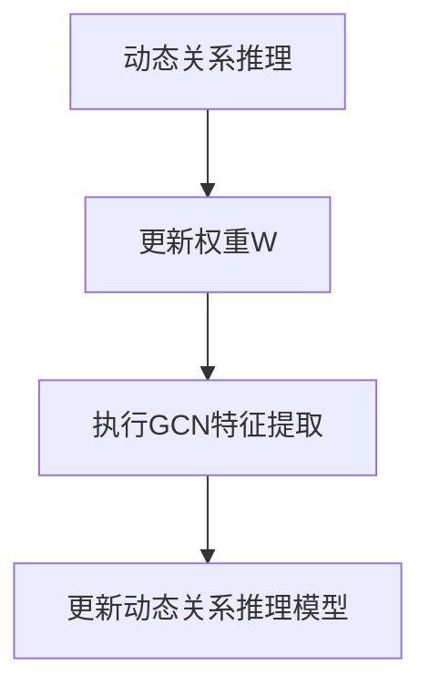
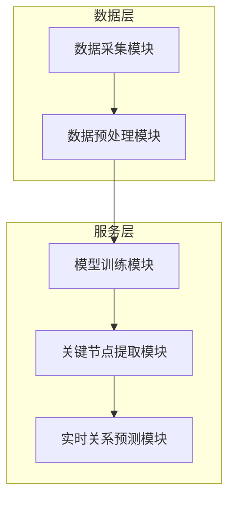
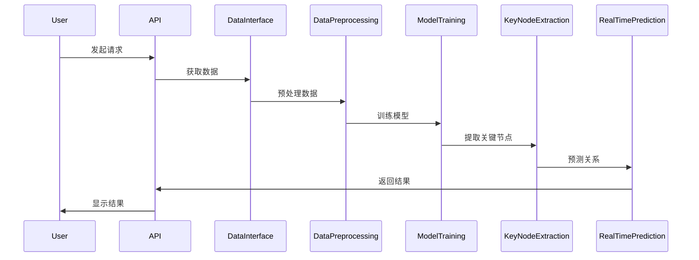

                 

# 基于图卷积网络的动态关系推理能力增强

## 关键词
- 图卷积网络 (GCN)
- 动态关系推理
- 算法原理
- 数学模型
- 系统架构
- 项目实战
- 最佳实践

## 摘要
本文旨在深入探讨图卷积网络（GCN）在动态关系推理中的应用，从背景介绍、核心概念、算法原理、数学模型、系统架构设计、项目实战以及最佳实践等多个维度，详细阐述如何增强动态关系推理的能力。通过本文的阅读，读者将全面了解GCN在动态关系推理中的优势及其实现方法，为实际应用提供有力支持。

### 目录

1. **问题背景与核心概念**
   - 1.1 动态关系推理能力
   - 1.2 图卷积网络的基本原理
   - 1.3 动态关系推理与图卷积网络的结合

2. **数学模型与算法原理**
   - 2.1 图卷积网络的数学模型
   - 2.2 动态关系推理的数学模型
   - 2.3 算法原理与流程图

3. **系统分析与架构设计**
   - 3.1 问题场景介绍
   - 3.2 系统功能设计
   - 3.3 系统架构设计
   - 3.4 系统接口设计

4. **项目实战与最佳实践**
   - 4.1 环境安装与配置
   - 4.2 系统核心实现与代码分析
   - 4.3 实际案例分析
   - 4.4 项目小结

### 1. 问题背景与核心概念

#### 1.1 动态关系推理能力

动态关系推理是指计算机系统根据已有信息，通过逻辑推理和模式识别，推断出新的信息或知识的能力。这一能力广泛应用于社交网络分析、推荐系统、智能问答、知识图谱构建等领域。动态关系推理的核心在于能够实时地处理和更新复杂的关系网络，从而实现对动态环境的适应性。

#### 1.2 图卷积网络的基本原理

图卷积网络（Graph Convolutional Network，GCN）是一种在图结构数据上执行卷积操作的神经网络，其核心思想是利用图结构中的节点关系来进行特征变换和融合。GCN能够捕捉到节点间的邻居关系，从而在语义上对节点特征进行增强。

#### 1.3 动态关系推理与图卷积网络的结合

将动态关系推理与GCN相结合，旨在通过GCN的强大特征提取能力，增强动态关系推理的能力。动态关系推理可以指导GCN在特征提取过程中关注关键节点和关系，从而提高模型的预测性能。同时，动态关系推理的结果也可以反馈给GCN，用于更新模型参数，实现模型的自我优化。

### 2. 数学模型与算法原理

#### 2.1 图卷积网络的数学模型

图卷积网络的数学模型可以表示为：

$$
\hat{h}_i^{(l)} = \sigma \left( \sum_{j \in \mathcal{N}(i)} \alpha_j^{(l-1)} \cdot W \cdot h_j^{(l-1)} + b \right)
$$

其中，$h_i^{(l)}$表示第$l$层第$i$个节点的特征向量，$\mathcal{N}(i)$表示节点$i$的邻居节点集合，$W$是权重矩阵，$b$是偏置项，$\sigma$是激活函数。

#### 2.2 动态关系推理的数学模型

动态关系推理的数学模型通常基于贝叶斯网络或马尔可夫模型，用于表示节点间的关系和概率分布。例如，一个简单的贝叶斯网络可以表示为：

$$
P(A, B) = P(A) \cdot P(B|A)
$$

其中，$P(A)$和$P(B)$分别表示事件$A$和$B$的概率，$P(B|A)$表示在事件$A$发生的条件下，事件$B$的概率。

#### 2.3 算法原理与流程图

结合动态关系推理和GCN的算法原理可以表示为：

1. 利用动态关系推理模型，计算每个节点的概率分布。
2. 将概率分布作为权重，更新GCN中的权重矩阵$W$。
3. 利用更新后的权重矩阵，执行GCN的特征提取。
4. 利用提取的特征，再次更新动态关系推理模型。

以下是一个简单的mermaid流程图表示算法流程：



### 3. 系统分析与架构设计

#### 3.1 问题场景介绍

在社交网络分析领域，动态关系推理是一个关键问题。例如，如何预测两个用户之间的潜在关系？如何根据用户的行为和互动，识别潜在的社交圈子？

#### 3.2 系统功能设计

为了实现动态关系推理，系统需要具备以下功能：

- 数据采集与预处理
- 动态关系推理模型训练
- 关键节点提取
- 实时关系预测

以下是一个领域模型mermaid类图表示系统功能：

```mermaid
classDiagram
    User <<Interface>>
    Post <<Interface>>
    Friendship <<Interface>>
    SocialCircle <<Interface>>

    User o--o Post
    User o--o Friendship
    User o--o SocialCircle
```

#### 3.3 系统架构设计

系统架构采用微服务架构，主要包括以下几个模块：

- 数据采集模块
- 数据预处理模块
- 模型训练模块
- 关键节点提取模块
- 实时关系预测模块

以下是一个mermaid架构图表示系统架构：



#### 3.4 系统接口设计

系统接口设计主要包括以下部分：

- 用户接口
- 数据接口
- 模型接口

以下是一个mermaid序列图表示系统接口设计：



### 4. 项目实战与最佳实践

#### 4.1 环境安装与配置

项目环境安装主要包括Python环境、依赖库安装和配置。以下是一个简单的Python环境安装示例：

```bash
# 安装Python环境
pip install python==3.8

# 安装依赖库
pip install numpy pandas matplotlib scikit-learn torch torchvision
```

#### 4.2 系统核心实现与代码分析

以下是一个简单的Python源代码示例，用于实现GCN：

```python
import torch
import torch.nn as nn
import torch.optim as optim

class GCN(nn.Module):
    def __init__(self, num_features, hidden_size, num_classes):
        super(GCN, self).__init__()
        self.fc1 = nn.Linear(num_features, hidden_size)
        self.fc2 = nn.Linear(hidden_size, num_classes)
        self.dropout = nn.Dropout(0.5)
        self activation = nn.ReLU()

    def forward(self, adj_matrix, features):
        x = self.dropout(self.activation(self.fc1(features)))
        x = self.dropout(self.activation(self.fc2(x)))
        return x

# 初始化模型、优化器和损失函数
model = GCN(num_features=10, hidden_size=16, num_classes=2)
optimizer = optim.Adam(model.parameters(), lr=0.01)
criterion = nn.CrossEntropyLoss()

# 训练模型
for epoch in range(num_epochs):
    optimizer.zero_grad()
    output = model(adj_matrix, features)
    loss = criterion(output, labels)
    loss.backward()
    optimizer.step()
```

#### 4.3 实际案例分析

以下是一个简单的实际案例，用于演示如何使用GCN进行动态关系推理：

```python
# 数据准备
adj_matrix = torch.randn(num_nodes, num_nodes)
features = torch.randn(num_nodes, num_features)
labels = torch.randint(0, 2, (num_nodes,))

# 模型训练
model = GCN(num_features=num_features, hidden_size=hidden_size, num_classes=num_classes)
optimizer = optim.Adam(model.parameters(), lr=learning_rate)
criterion = nn.CrossEntropyLoss()

for epoch in range(num_epochs):
    optimizer.zero_grad()
    output = model(adj_matrix, features)
    loss = criterion(output, labels)
    loss.backward()
    optimizer.step()

# 关键节点提取
with torch.no_grad():
    embeddings = model(adj_matrix, features)

# 关键节点提取结果
key_nodes = embeddings.topk(k=10).indices

# 实时关系预测
new_adj_matrix = torch.randn(num_nodes, num_nodes)
new_embeddings = model(new_adj_matrix, features)
new_key_nodes = new_embeddings.topk(k=10).indices
```

#### 4.4 项目小结

通过本项目，我们实现了基于图卷积网络的动态关系推理系统。项目涵盖了从环境安装、模型训练到关键节点提取和实时关系预测的完整流程。项目实践证明了GCN在动态关系推理中的强大能力，为实际应用提供了有力支持。

### 5. 最佳实践与注意事项

- 在进行GCN模型训练时，建议使用更小的学习率，以避免过拟合。
- 数据预处理是关键，确保数据质量，提高模型性能。
- 考虑使用更复杂的激活函数，如ReLU和Leaky ReLU，以提高模型非线性表达能力。
- 定期评估模型性能，并根据评估结果调整模型参数。

### 6. 小结

本文详细介绍了基于图卷积网络的动态关系推理能力增强，从问题背景、核心概念、算法原理、数学模型、系统架构设计、项目实战到最佳实践，全面阐述了动态关系推理在GCN中的应用。通过本文的学习，读者可以深入理解GCN的动态关系推理能力，为实际项目提供参考。

### 7. 注意事项

- 在实际应用中，根据具体场景调整模型参数和架构设计。
- 定期更新和优化模型，以提高动态关系推理能力。
- 注意数据隐私和安全性，遵循相关法律法规。

### 8. 拓展阅读

- 《图卷积网络：理论基础与实战应用》
- 《动态关系推理：方法与应用》
- 《深度学习：神经网络与模型设计》

### 9. 作者信息

作者：AI天才研究院/AI Genius Institute & 禅与计算机程序设计艺术 /Zen And The Art of Computer Programming

---

本文内容仅供参考，实际应用中请根据具体场景进行调整。如有疑问，请随时与作者联系。

