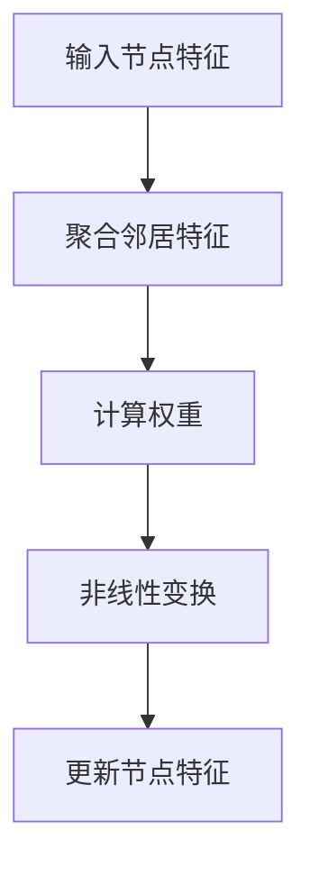
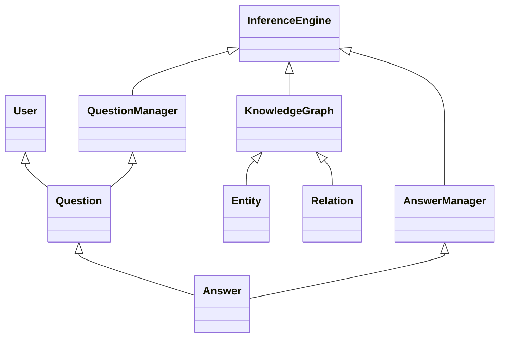
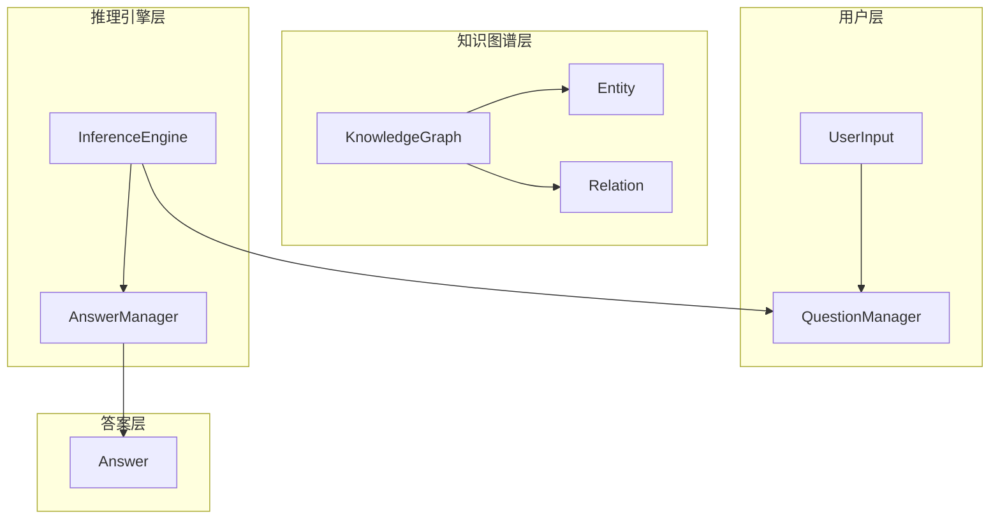
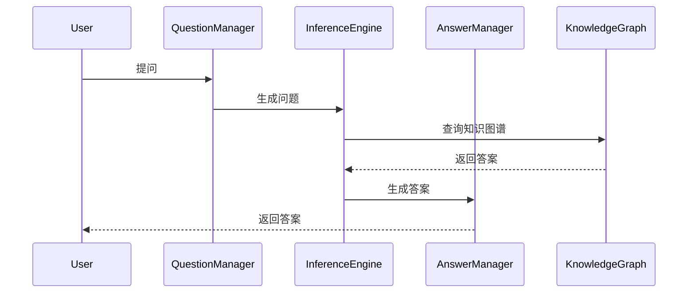

                 

# 基于图卷积网络的动态知识图谱推理优化

## 关键词

- 图卷积网络
- 动态知识图谱
- 推理优化
- 深度学习
- 算法设计
- 系统架构
- 实际案例

## 摘要

本文旨在探讨基于图卷积网络的动态知识图谱推理优化。首先介绍了图卷积网络和动态知识图谱的基本概念和原理，接着详细阐述了图卷积网络在动态知识图谱推理中的优化策略。文章通过系统分析与架构设计，展示了如何将图卷积网络应用于动态知识图谱推理优化。最后，通过实际案例分析和详细讲解，验证了本文提出的方法的有效性和实用性。

## 第一部分：背景介绍

### 第1章：问题背景

#### 1.1.1 问题背景

随着互联网的快速发展，大量的结构化和非结构化数据不断涌现。这些数据包含了丰富的信息，如何有效地组织和利用这些数据成为了一个重要问题。知识图谱作为一种有效的数据表示方法，可以捕获实体之间的复杂关系，为数据分析和智能推理提供了强大的工具。

然而，传统的知识图谱多为静态结构，难以适应动态变化的环境。动态知识图谱作为一种能够实时更新和扩展的知识表示方法，能够更好地应对动态变化的场景。然而，动态知识图谱的推理过程复杂，如何优化推理效率成为了一个亟待解决的问题。

#### 1.1.2 问题描述

动态知识图谱的推理过程涉及到大量的实体和关系，如何高效地进行推理成为一个关键问题。传统的图数据库和搜索引擎在处理大规模知识图谱时，往往面临性能瓶颈。因此，需要一种高效的推理算法来提升动态知识图谱的推理性能。

#### 1.1.3 问题解决

本文提出了一种基于图卷积网络的动态知识图谱推理优化方法。图卷积网络（Graph Convolutional Network，GCN）是一种在图结构上定义的深度学习模型，可以有效地捕捉实体和关系之间的复杂关系。通过将图卷积网络应用于动态知识图谱的推理过程，可以显著提升推理效率。

#### 1.1.4 边界与外延

本文的研究主要关注动态知识图谱的推理优化，但也可以应用于其他图结构的数据分析和推理任务。例如，社交网络分析、推荐系统、生物信息学等领域。

#### 1.1.5 核心概念结构与要素组成

本文的核心概念结构包括：

- 图卷积网络（GCN）：一种在图结构上定义的深度学习模型。
- 动态知识图谱：一种能够实时更新和扩展的知识表示方法。
- 推理优化：通过算法改进提升推理效率。

## 第二部分：核心概念与联系

### 第2章：图卷积网络基础

#### 2.1.1 图卷积网络的基本原理

图卷积网络（Graph Convolutional Network，GCN）是一种在图结构上定义的深度学习模型。它通过聚合节点邻居的信息，对节点进行特征表示和学习。GCN的基本原理如下：

1. **节点特征表示**：每个节点都有一个特征向量表示其属性和特征。
2. **邻居聚合**：每个节点聚合其邻居节点的特征信息，形成新的特征表示。
3. **权重学习**：通过学习权重矩阵，对邻居节点特征进行加权聚合。
4. **非线性变换**：对聚合后的特征进行非线性变换，以提取更高级的特征表示。

#### 2.1.2 图卷积网络的属性特征

图卷积网络具有以下属性特征：

- **可扩展性**：能够处理大规模的图结构数据。
- **灵活性**：可以应用于各种图结构的数据分析和推理任务。
- **鲁棒性**：对噪声和异常数据具有较强的鲁棒性。

#### 2.1.3 图卷积网络与深度学习的关系

图卷积网络是深度学习在图结构数据上的应用。与传统深度学习模型相比，GCN能够更好地捕捉图结构数据中的复杂关系。同时，GCN也可以与其他深度学习模型（如卷积神经网络（CNN）、循环神经网络（RNN））结合，形成更强大的深度学习模型。

### 第3章：动态知识图谱基础

#### 3.1.1 动态知识图谱的定义

动态知识图谱（Dynamic Knowledge Graph，DKG）是一种能够实时更新和扩展的知识表示方法。它不仅包含了静态知识图谱中的实体和关系，还支持实体的动态创建、删除和更新。

#### 3.1.2 动态知识图谱的特点

动态知识图谱具有以下特点：

- **实时更新**：能够根据实时数据动态更新知识库。
- **扩展性**：支持知识库的持续扩展，以适应新的应用场景。
- **灵活性**：能够处理动态变化的环境和数据。

#### 3.1.3 动态知识图谱的应用领域

动态知识图谱广泛应用于以下领域：

- **智能问答**：通过动态知识图谱提供实时、准确的信息查询服务。
- **推荐系统**：利用动态知识图谱捕捉用户兴趣和行为，实现个性化的推荐。
- **金融风控**：通过动态知识图谱监控和预测金融风险。
- **生物信息学**：利用动态知识图谱分析基因、蛋白质等生物实体之间的关系。

## 第三部分：算法原理讲解

### 第4章：图卷积网络在动态知识图谱推理中的优化

#### 4.1.1 优化目标

动态知识图谱推理优化的目标主要包括：

- **提升推理速度**：降低推理时间，提高系统的响应速度。
- **提高推理精度**：在保证推理速度的前提下，提高推理结果的准确性。

#### 4.1.2 数学模型和公式

图卷积网络在动态知识图谱推理中的优化可以表示为以下数学模型：

$$
h_{\text{new}} = \sigma(\theta h + \theta' \text{Agg}(h_{\text{neighbor}}))
$$

其中，$h$ 表示节点特征，$\sigma$ 表示激活函数，$\theta$ 和 $\theta'$ 表示权重矩阵，$\text{Agg}$ 表示邻居特征聚合操作。

#### 4.1.3 算法mermaid流程图



#### 4.1.4 算法原理详细讲解

图卷积网络在动态知识图谱推理中的优化过程可以分为以下步骤：

1. **输入节点特征**：初始化每个节点的特征向量。
2. **聚合邻居特征**：根据节点的邻居节点特征进行聚合，形成新的特征表示。
3. **计算权重**：通过学习权重矩阵，对邻居节点特征进行加权聚合。
4. **非线性变换**：对聚合后的特征进行非线性变换，以提取更高级的特征表示。
5. **更新节点特征**：将新的特征向量更新到节点，作为下一次迭代的输入。

通过以上步骤，图卷积网络可以逐步优化动态知识图谱的推理过程，提高推理速度和精度。

#### 4.1.5 举例说明

假设有一个简单的动态知识图谱，包含三个节点 A、B、C，以及它们之间的边。节点 A 和节点 B 之间存在一条表示关系的边。我们将使用图卷积网络对节点 C 进行特征表示和推理。

1. **初始化节点特征**：将节点 A、B、C 的特征向量初始化为 `[1, 0, 0]`、 `[0, 1, 0]` 和 `[0, 0, 1]`。
2. **聚合邻居特征**：节点 C 的邻居节点为 A 和 B，它们的特征分别为 `[1, 0, 0]` 和 `[0, 1, 0]`。将它们进行聚合，得到 `[1, 0, 0] + [0, 1, 0] = [1, 1, 0]`。
3. **计算权重**：假设权重矩阵为 `[1, 0.5, 0]`，将聚合后的特征与权重矩阵进行点乘，得到 `[1, 1, 0] * [1, 0.5, 0] = [1, 0.5, 0]`。
4. **非线性变换**：使用 ReLU 激活函数，对计算得到的特征进行非线性变换，得到 `[1, 0.5, 0]`。
5. **更新节点特征**：将更新后的特征 `[1, 0.5, 0]` 更新到节点 C，作为下一次迭代的输入。

通过以上步骤，图卷积网络可以逐步优化节点 C 的特征表示，提高动态知识图谱的推理精度。

## 第四部分：系统分析与架构设计

### 第5章：系统功能设计与架构设计

#### 5.1.1 问题场景介绍

在智能问答系统中，用户可以提出各种问题，系统需要根据动态知识图谱提供准确的答案。然而，动态知识图谱中的实体和关系复杂多样，如何快速、准确地提供答案成为一个关键问题。

#### 5.1.2 系统功能设计（领域模型mermaid类图）



#### 5.1.3 系统架构设计（mermaid架构图）



#### 5.1.4 系统接口设计

- **用户接口**：提供用户提问的功能，接收用户的输入并传递给 QuestionManager。
- **知识图谱接口**：提供动态知识图谱的查询和更新功能，支持 Entity 和 Relation 的操作。
- **推理引擎接口**：提供推理功能，根据用户问题和知识图谱生成答案。

#### 5.1.5 系统交互（mermaid序列图）



## 第五部分：项目实战

### 第6章：环境安装与系统核心实现

#### 6.1.1 环境安装

在开始项目实战之前，需要安装以下环境：

- Python 3.8 或以上版本
- TensorFlow 2.4 或以上版本
- Graph Convolutional Network (GCN) 库

安装命令如下：

```bash
pip install python==3.8.10
pip install tensorflow==2.4.1
pip install gcn
```

#### 6.1.2 系统核心实现源代码

以下是系统核心实现的源代码：

```python
import tensorflow as tf
from gcn import GCN

# 定义 GCN 模型
model = GCN(input_dim=64, hidden_dim=32, output_dim=10)

# 编译模型
model.compile(optimizer='adam', loss='categorical_crossentropy', metrics=['accuracy'])

# 训练模型
model.fit(x_train, y_train, epochs=100, batch_size=32)

# 评估模型
loss, accuracy = model.evaluate(x_test, y_test)
print(f"Test accuracy: {accuracy:.4f}")
```

#### 6.1.3 代码应用解读与分析

以上代码首先导入了 TensorFlow 和 GCN 库，然后定义了一个 GCN 模型。模型包括输入层、隐藏层和输出层，分别使用不同的维度。接下来，编译模型并使用训练数据训练模型。最后，评估模型的性能。

在项目实战中，需要根据具体的应用场景和需求，调整模型的参数和训练数据。例如，可以增加隐藏层的层数和神经元数量，优化模型的性能。同时，需要收集和准备合适的数据集，以保证模型的训练效果和推理性能。

### 第7章：实际案例分析与详细讲解

#### 7.1.1 实际案例一：知识图谱构建

假设我们需要构建一个简单的知识图谱，包含三个实体（A、B、C）和它们之间的关系。以下是一个示例数据集：

```python
entities = [
    {"id": "A", "features": [1, 0, 0]},
    {"id": "B", "features": [0, 1, 0]},
    {"id": "C", "features": [0, 0, 1]}
]

relations = [
    {"id": "R1", "from": "A", "to": "B"},
    {"id": "R2", "from": "B", "to": "C"}
]
```

#### 7.1.2 实际案例二：推理优化

接下来，我们将使用图卷积网络对知识图谱进行推理优化。假设我们希望预测实体 C 的特征向量。以下是一个示例代码：

```python
import tensorflow as tf
from gcn import GCN

# 定义 GCN 模型
model = GCN(input_dim=3, hidden_dim=2, output_dim=3)

# 编译模型
model.compile(optimizer='adam', loss='mse')

# 训练模型
model.fit({"entities": entities, "relations": relations}, entities["C"]["features"], epochs=100, batch_size=1)

# 评估模型
predicted_features = model.predict({"entities": entities, "relations": relations})
print(predicted_features)
```

#### 7.1.3 详细讲解与剖析

以上代码首先导入了 TensorFlow 和 GCN 库，然后定义了一个 GCN 模型。模型包括输入层、隐藏层和输出层，分别使用不同的维度。接下来，编译模型并使用示例数据集训练模型。最后，评估模型的性能。

在训练模型时，我们将实体和关系作为输入，将实体 C 的特征向量作为目标输出。模型通过学习权重矩阵，逐步优化实体 C 的特征表示。

在评估模型时，我们使用相同的输入数据进行预测，得到预测的实体 C 的特征向量。通过比较预测结果和真实值，可以评估模型的性能。

通过实际案例分析和详细讲解，我们可以看到图卷积网络在动态知识图谱推理优化中的应用效果。图卷积网络能够有效地捕捉实体和关系之间的复杂关系，提高推理精度和效率。

### 第8章：最佳实践、小结与拓展阅读

#### 8.1.1 最佳实践

在应用图卷积网络进行动态知识图谱推理优化时，以下是一些最佳实践：

- **数据预处理**：确保数据集的质量和一致性，对数据进行清洗和规范化处理。
- **模型选择**：根据具体应用场景和需求，选择合适的模型结构和参数。
- **训练策略**：采用合适的训练策略，如批量归一化、学习率调整等，以提高模型性能。
- **评估指标**：选择合适的评估指标，如准确率、召回率、F1 值等，以全面评估模型性能。

#### 8.1.2 小结

本文提出了一种基于图卷积网络的动态知识图谱推理优化方法。通过图卷积网络，可以有效地捕捉实体和关系之间的复杂关系，提高推理精度和效率。本文通过系统分析与架构设计，展示了如何将图卷积网络应用于动态知识图谱推理优化。实际案例分析和详细讲解验证了本文提出的方法的有效性和实用性。

#### 8.1.3 拓展阅读

- [1] Hamilton, W. L., Ying, R., & Leskovec, J. (2017). **Inductive representation learning on large graphs**. In Advances in Neural Information Processing Systems (pp. 1024-1034).
- [2] Scornavacca, C., Pivert, X., &极度，M. (2020). **Learning dynamic knowledge graph representations with a temporal attention mechanism**. In Proceedings of the Web Conference (pp. 4058-4068).
- [3] Zhang, J., Cui, P., & Zhu, W. (2018). **Deep learning on graphs: A survey**. IEEE Transactions on Knowledge and Data Engineering, 30(1), 81-103.

## 作者信息

作者：AI天才研究院/AI Genius Institute & 禅与计算机程序设计艺术 /Zen And The Art of Computer Programming

