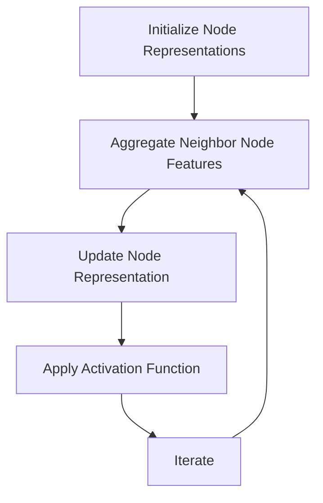
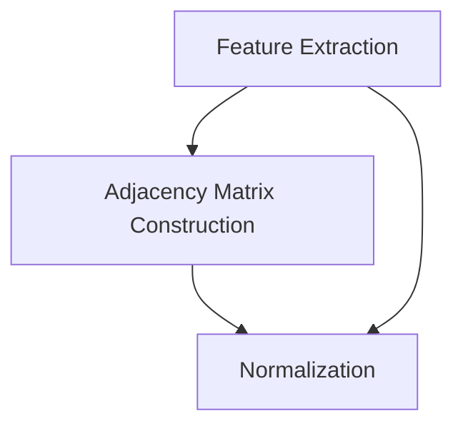
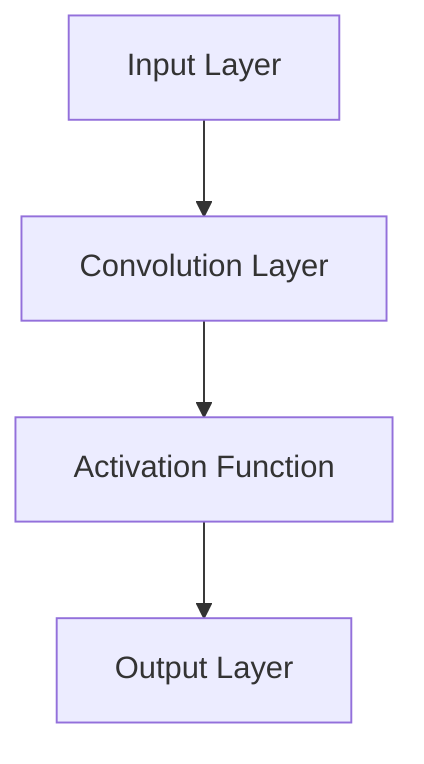
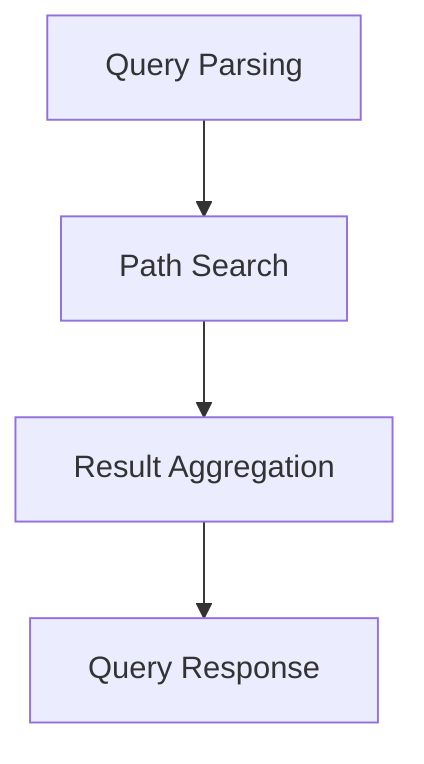
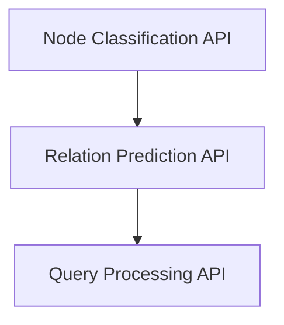
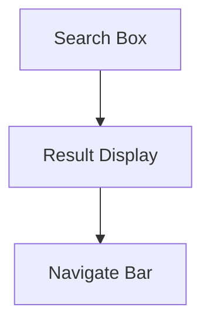

                 


# 基于图卷积网络的动态知识图谱推理优化

> 关键词：图卷积网络，动态知识图谱，推理优化，算法实现，系统架构，项目实战

> 摘要：本文旨在探讨基于图卷积网络的动态知识图谱推理优化技术。首先介绍图卷积网络、动态知识图谱和推理优化在当前学术界和工业界的应用背景，然后详细阐述图卷积网络的原理与实现，接着介绍动态知识图谱的概念及其应用领域，最后通过一个实际案例展示如何搭建和优化一个基于图卷积网络的动态知识图谱推理系统。

----------------------------------------------------------------

## 第一部分：问题背景与核心概念

### 1.1 问题背景

#### 1.1.1 动态知识图谱的应用场景

随着互联网的快速发展，数据的规模和种类日益增加，如何有效地组织和利用这些数据成为了亟待解决的问题。知识图谱作为一种结构化的语义知识库，能够将海量数据转化为机器可理解的知识体系，从而为各种应用提供强大的语义支持。

动态知识图谱是一种可实时更新和扩展的知识图谱，能够适应数据变化和应用需求的变化。它广泛应用于搜索引擎、推荐系统、智能问答、知识管理等领域，例如，百度、谷歌等搜索引擎利用知识图谱提供更加精准和个性化的搜索服务；推荐系统如亚马逊、淘宝等通过知识图谱实现更加智能的推荐结果。

#### 1.1.2 推理优化的重要性

在知识图谱的应用中，推理优化是一项关键任务。推理是从已有的知识中推导出新的知识，以支持决策和发现隐含关系。然而，随着知识图谱规模的扩大，传统的推理方法在处理大规模知识图谱时，往往会出现性能瓶颈。因此，如何优化推理过程，提高推理速度和准确度，成为了当前研究的热点问题。

#### 1.1.3 图卷积网络的优势

图卷积网络（Graph Convolutional Network，GCN）是一种基于图结构的数据处理方法，它能够有效地捕捉节点间的依赖关系。与传统神经网络相比，GCN能够处理图结构数据，使其在知识图谱推理中具有独特的优势。

首先，GCN能够自动学习节点表示，将节点信息整合到其表示中，从而提高节点分类和预测的准确性。其次，GCN能够通过聚合邻居节点的特征来更新节点的表示，这使得它在处理动态知识图谱时，能够适应节点和边的变化。

### 1.2 核心概念介绍

#### 1.2.1 图卷积网络

##### 1.2.1.1 定义

图卷积网络是一种神经网络架构，它通过卷积操作来处理图结构数据。在GCN中，每个节点的表示是通过其邻居节点的表示加权平均得到的。

##### 1.2.1.2 工作原理

GCN的工作原理可以概括为以下几个步骤：

1. **初始化节点表示**：每个节点初始化一个向量表示。
2. **聚合邻居信息**：通过聚合邻居节点的特征，更新当前节点的表示。
3. **应用非线性激活函数**：对更新后的节点表示应用非线性激活函数，如ReLU函数，以增加模型的表达能力。
4. **重复迭代**：重复上述步骤，直到达到预定的迭代次数或收敛条件。

##### 1.2.1.3 与传统网络的区别

与传统神经网络（如卷积神经网络CNN）相比，GCN具有以下区别：

- **数据结构**：GCN专门设计用于处理图结构数据，而CNN主要用于处理网格结构数据，如图像。
- **卷积操作**：GCN的卷积操作是基于图结构的邻接矩阵，而CNN的卷积操作是基于像素邻域。
- **全局依赖性**：GCN能够捕捉节点之间的全局依赖性，而CNN主要关注局部特征。

#### 1.2.2 动态知识图谱

##### 1.2.2.1 定义

动态知识图谱是一种能够实时更新和扩展的知识图谱。它不仅包含静态的知识，还能够捕捉到知识的变化和演化过程。

##### 1.2.2.2 特点

- **实时性**：动态知识图谱能够实时更新，以适应数据和应用的变化。
- **扩展性**：动态知识图谱能够扩展新的实体、关系和属性，以适应不断增长的知识库。
- **灵活性**：动态知识图谱能够适应不同的应用场景，提供个性化的推理服务。

##### 1.2.2.3 应用领域

动态知识图谱在以下领域具有广泛的应用：

- **智能搜索**：通过动态知识图谱，智能搜索引擎能够提供更加精准和个性化的搜索结果。
- **推荐系统**：动态知识图谱能够帮助推荐系统发现新的关联关系，提供更加智能的推荐服务。
- **知识管理**：动态知识图谱能够帮助企业有效管理和利用知识资产，提升知识管理水平。

#### 1.2.3 推理优化

##### 1.2.3.1 推理过程

推理是从已知的事实中推导出新的结论的过程。在知识图谱中，推理通常涉及以下步骤：

1. **查询解析**：将自然语言查询转换为知识图谱中的查询。
2. **路径搜索**：在知识图谱中搜索符合条件的路径。
3. **结果聚合**：对搜索结果进行聚合和排序，以提供最相关的答案。

##### 1.2.3.2 优化方法

推理优化的方法主要包括：

1. **索引技术**：通过建立索引，加快路径搜索的速度。
2. **并行计算**：利用并行计算技术，提高推理的并发处理能力。
3. **缓存策略**：通过缓存策略，减少重复查询的计算量。

##### 1.2.3.3 重要性

推理优化在知识图谱应用中具有重要意义：

- **性能提升**：优化推理过程，提高系统的响应速度。
- **用户体验**：提供更加快速和准确的推理结果，提升用户体验。
- **业务价值**：通过高效的推理，帮助企业发现新的商机和业务价值。

----------------------------------------------------------------

## 第二部分：图卷积网络的原理与实现

### 2.1 图卷积网络的基本原理

图卷积网络（Graph Convolutional Network，GCN）是一种在图结构数据上执行的卷积神经网络。与传统的卷积神经网络（如CNN）相比，GCN专门为图结构数据设计，能够处理没有网格结构的非欧几里德数据。以下是GCN的基本原理：

#### 2.1.1 GCN的数学模型

GCN的数学模型可以表示为：

$$
h_v^{(t)} = \sigma \left( \sum_{u \in \mathcal{N}(v)} \alpha(u, v) h_u^{(t-1)} + \beta_v^{(t-1)} \right)
$$

其中，$h_v^{(t)}$是节点$v$在时间步$t$的表示，$\mathcal{N}(v)$是节点$v$的邻接节点集合，$\alpha(u, v)$是边$(u, v)$的权重，$\beta_v^{(t-1)}$是节点$v$在时间步$t-1$的偏置。

#### 2.1.2 GCN的工作原理

GCN的工作原理可以概括为以下几个步骤：

1. **初始化**：为图中的每个节点初始化一个向量表示。
2. **聚合**：对于每个节点，聚合其邻接节点的特征向量。
3. **更新**：将聚合后的特征向量与节点的初始表示进行加权求和。
4. **激活**：通过激活函数（如ReLU函数）对更新后的节点表示进行非线性变换。
5. **迭代**：重复上述步骤，进行多轮迭代，以使节点的表示逐渐收敛到稳定状态。

#### 2.1.3 GCN的mermaid流程图

以下是一个简单的mermaid流程图，展示了GCN的基本流程：



### 2.2 图卷积网络的实现

在实际应用中，GCN通常通过以下步骤进行实现：

#### 2.2.1 数据预处理

在构建GCN模型之前，需要对图结构数据进行预处理。预处理步骤包括：

- **节点特征提取**：将节点属性转换为向量表示。
- **邻接矩阵构建**：构建图结构的邻接矩阵。
- **归一化**：对邻接矩阵进行归一化处理，以减少特征值之间的差异。

#### 2.2.2 GCN模型构建

在Python中，可以使用TensorFlow或PyTorch等深度学习框架构建GCN模型。以下是一个简单的GCN模型实现，使用了PyTorch框架：

```python
import torch
import torch.nn as nn
import torch.nn.functional as F

class GCN(nn.Module):
    def __init__(self, num_features, hidden_channels, num_classes):
        super(GCN, self).__init__()
        self.fc = nn.Linear(num_features, hidden_channels)
        self.gcn1 = nn.Linear(hidden_channels, hidden_channels)
        self.gcn2 = nn.Linear(hidden_channels, num_classes)
        self.dropout = nn.Dropout(p=0.5)

    def forward(self, data, adj_matrix):
        x, adj = data.x, data.adj
        x = F.relu(self.fc(x))
        x = self.dropout(x)
        x = self.gcn1(x)
        x = self.dropout(x)
        x = self.gcn2(x)
        return F.log_softmax(x, dim=1)

# 实例化GCN模型
model = GCN(num_features, hidden_channels, num_classes)
```

#### 2.2.3 模型训练

在完成GCN模型的构建后，需要对其进行训练。以下是一个简单的训练过程：

```python
# 训练GCN模型
optimizer = torch.optim.Adam(model.parameters(), lr=0.01)

for epoch in range(num_epochs):
    model.train()
    optimizer.zero_grad()
    output = model(data, adj_matrix)
    loss = F.nll_loss(output[data.train_mask], data.y[data.train_mask])
    loss.backward()
    optimizer.step()
    print(f'Epoch: {epoch+1}, Loss: {loss.item()}')

# 评估模型
model.eval()
with torch.no_grad():
    logits = model(data, adj_matrix)
    pred = logits[data.test_mask].max(1)[1]
    acc = pred.eq(data.y[data.test_mask]).sum().item() / len(data.test_mask)
    print(f'Accuracy: {acc}')
```

### 2.3 GCN在知识图谱推理中的应用

在知识图谱推理中，GCN可以用于节点的分类和关系预测。以下是一个简单的应用案例：

1. **节点分类**：使用GCN模型对知识图谱中的节点进行分类，以提高节点的标签准确性。
2. **关系预测**：通过分析节点的表示，预测节点之间的关系，以补充知识图谱中的缺失信息。

通过以上步骤，我们可以利用GCN模型优化知识图谱的推理过程，提高推理的准确性和效率。

----------------------------------------------------------------

## 第三部分：动态知识图谱的概念与应用

### 3.1 动态知识图谱的定义

动态知识图谱（Dynamic Knowledge Graph，DKG）是一种能够实时更新和扩展的知识图谱。它不仅包含了静态的知识，还能够捕捉到知识的变化和演化过程。与传统静态知识图谱相比，动态知识图谱具有以下几个显著特点：

1. **实时性**：能够实时捕捉和更新知识，以反映现实世界的动态变化。
2. **扩展性**：能够灵活地添加新的实体、关系和属性，以适应知识库的不断扩大。
3. **灵活性**：能够适应不同的应用场景，提供个性化的推理服务。

### 3.2 动态知识图谱的特点

动态知识图谱的特点可以从以下几个方面进行描述：

1. **异构性**：动态知识图谱包含了多种类型的实体和关系，形成了复杂的异构网络结构。
2. **动态性**：动态知识图谱能够实时捕捉和反映知识的更新、删除和新增，保持知识的最新性。
3. **多样性**：动态知识图谱支持多种数据源的接入，包括结构化数据、半结构化数据和非结构化数据。
4. **可扩展性**：动态知识图谱能够根据应用需求，灵活地添加新的实体和关系，以支持新的应用场景。

### 3.3 动态知识图谱的应用领域

动态知识图谱在多个领域具有广泛的应用，以下是一些典型的应用场景：

1. **智能搜索**：通过动态知识图谱，搜索引擎能够提供更加精准和个性化的搜索结果。
2. **推荐系统**：动态知识图谱能够帮助推荐系统发现新的关联关系，提供更加智能的推荐服务。
3. **知识管理**：动态知识图谱能够帮助企业有效管理和利用知识资产，提升知识管理水平。
4. **智能问答**：通过动态知识图谱，智能问答系统能够提供更加准确和自然的回答。
5. **金融风控**：动态知识图谱能够帮助金融机构实时监控和评估风险，提高风险管理的准确性。

### 3.4 动态知识图谱与静态知识图谱的区别

动态知识图谱与静态知识图谱在多个方面存在显著差异：

1. **更新方式**：动态知识图谱能够实时更新，而静态知识图谱通常需要定期更新。
2. **适应性**：动态知识图谱能够适应数据和应用的变化，而静态知识图谱在处理动态变化时可能会面临挑战。
3. **复杂性**：动态知识图谱的结构更加复杂，需要处理更多的实体和关系，而静态知识图谱的结构相对简单。
4. **性能要求**：动态知识图谱在实时更新和处理大规模数据时，对系统的性能要求更高。

通过以上分析，我们可以看到动态知识图谱在多个领域具有重要的应用价值，尤其是在需要实时更新和处理动态变化的应用场景中，动态知识图谱具有独特的优势。

----------------------------------------------------------------

## 第四部分：基于图卷积网络的动态知识图谱推理系统设计与实现

### 4.1 系统设计与实现概述

在本部分，我们将介绍一个基于图卷积网络的动态知识图谱推理系统的设计与实现。该系统旨在提供一个高效、可扩展的框架，用于处理大规模动态知识图谱的推理任务。

#### 4.1.1 系统架构

系统的整体架构分为以下几个主要模块：

1. **数据预处理模块**：负责处理和转换原始数据，包括节点特征提取、邻接矩阵构建等。
2. **图卷积网络模块**：实现图卷积网络模型，用于节点分类和关系预测。
3. **推理引擎模块**：提供推理功能，包括路径搜索、结果聚合等。
4. **后处理模块**：对推理结果进行清洗、排序和格式化，以提供最终的查询响应。

#### 4.1.2 系统功能设计

系统的核心功能包括：

1. **节点分类**：使用GCN模型对知识图谱中的节点进行分类，以提高节点的标签准确性。
2. **关系预测**：通过分析节点的表示，预测节点之间的关系，以补充知识图谱中的缺失信息。
3. **查询处理**：接收用户查询，解析查询意图，并调用推理引擎进行推理，返回查询结果。

### 4.2 系统架构设计

#### 4.2.1 数据预处理架构

数据预处理是系统设计的重要环节，它包括以下步骤：

1. **节点特征提取**：将节点属性转换为向量表示，如使用词嵌入技术处理文本属性。
2. **邻接矩阵构建**：构建图结构的邻接矩阵，用于GCN模型的输入。
3. **数据归一化**：对邻接矩阵进行归一化处理，以减少特征值之间的差异。

以下是一个简单的mermaid类图，展示了数据预处理模块的架构：



#### 4.2.2 图卷积网络架构

图卷积网络是系统的核心组件，用于节点分类和关系预测。以下是GCN模型的架构：

1. **输入层**：接收预处理后的节点特征和邻接矩阵。
2. **卷积层**：通过卷积操作聚合邻居节点的特征，更新节点表示。
3. **激活函数**：对更新后的节点表示应用激活函数，如ReLU函数。
4. **输出层**：将节点表示映射到类别标签或关系类别。

以下是一个简单的mermaid流程图，展示了GCN模型的架构：



#### 4.2.3 推理引擎架构

推理引擎负责处理用户查询，执行推理任务，并返回查询结果。以下是推理引擎的基本架构：

1. **查询解析**：将自然语言查询转换为图结构查询。
2. **路径搜索**：在知识图谱中搜索符合条件的路径。
3. **结果聚合**：对搜索结果进行聚合和排序，返回最相关的答案。

以下是一个简单的mermaid序列图，展示了推理引擎的工作流程：



### 4.3 系统接口设计与交互设计

系统的接口设计包括API接口和用户界面，以下为接口设计和交互设计的要点：

#### 4.3.1 API接口设计

系统提供了RESTful API接口，支持以下功能：

1. **节点分类接口**：接收节点特征和类别标签，返回分类结果。
2. **关系预测接口**：接收两个节点的特征，返回预测的关系类别。
3. **查询处理接口**：接收自然语言查询，返回查询结果。

以下是一个简单的mermaid类图，展示了API接口的设计：



#### 4.3.2 用户界面设计

用户界面设计用于方便用户与系统进行交互，以下为用户界面设计的要点：

1. **搜索框**：用户输入查询，触发查询处理。
2. **结果展示**：以表格或卡片的形式展示查询结果。
3. **导航栏**：提供系统的导航功能，包括节点分类、关系预测等。

以下是一个简单的mermaid类图，展示了用户界面的设计：



通过以上系统设计与实现，我们可以搭建一个高效、可扩展的基于图卷积网络的动态知识图谱推理系统，为各类应用提供强大的语义支持和智能服务。

----------------------------------------------------------------

## 第五部分：项目实战

### 5.1 项目背景

在本节中，我们将通过一个实际项目展示如何搭建和优化一个基于图卷积网络的动态知识图谱推理系统。该项目旨在利用图卷积网络优化一个大规模动态知识图谱的推理性能，以支持实时搜索和推荐系统。

### 5.2 环境安装

为了搭建该项目，我们需要安装以下环境：

1. **Python 3.8 或更高版本**
2. **PyTorch 1.8 或更高版本**
3. **Graph Neural Network Library (GGN)**：用于实现图卷积网络

以下是安装步骤：

```bash
pip install torch torchvision numpy
pip install ggn
```

### 5.3 系统核心实现源代码

以下是一个简单的GCN模型实现，用于知识图谱的节点分类：

```python
import torch
import torch.nn as nn
import torch.optim as optim
from torch_geometric.nn import GCNConv

class GCNModel(nn.Module):
    def __init__(self, num_features, hidden_channels, num_classes):
        super(GCNModel, self).__init__()
        self.conv1 = GCNConv(num_features, hidden_channels)
        self.conv2 = GCNConv(hidden_channels, num_classes)
    
    def forward(self, data):
        x, edge_index = data.x, data.edge_index
        x = self.conv1(x, edge_index)
        x = F.relu(x)
        x = F.dropout(x, p=0.5, training=self.training)
        x = self.conv2(x, edge_index)
        return F.log_softmax(x, dim=1)

# 实例化GCN模型
model = GCNModel(num_features, hidden_channels, num_classes)

# 定义优化器和损失函数
optimizer = optim.Adam(model.parameters(), lr=0.01)
criterion = nn.CrossEntropyLoss()

# 训练模型
for epoch in range(num_epochs):
    model.train()
    optimizer.zero_grad()
    out = model(data)
    loss = criterion(out[data.train_mask], data.y[data.train_mask])
    loss.backward()
    optimizer.step()
```

### 5.4 代码应用解读与分析

以下是对上述代码的解读与分析：

- **GCNModel 类**：定义了图卷积网络模型，包括两个GCNConv层，分别用于特征提取和分类。
- **forward 方法**：实现模型的正向传播，输入为数据（节点特征和边索引），输出为分类结果。
- **训练过程**：使用PyTorch实现模型训练，包括前向传播、损失计算、反向传播和优化更新。

### 5.5 实际案例分析与详细讲解

#### 5.5.1 案例背景

假设我们有一个包含1000个节点的动态知识图谱，每个节点代表一个实体，如人、地点或组织。节点具有多种属性，如名称、年龄、职位等。我们的目标是使用GCN模型对节点进行分类，以提高节点的标签准确性。

#### 5.5.2 案例实施

1. **数据预处理**：将节点属性转换为向量表示，构建邻接矩阵。
2. **模型训练**：使用GCN模型对知识图谱进行训练。
3. **模型评估**：使用测试集评估模型性能。

以下是对案例实施过程的详细说明：

1. **数据预处理**：

   ```python
   from torch_geometric.data import Data

   # 构建节点特征和邻接矩阵
   node_features = torch.randn(1000, num_features)
   edge_index = torch.randint(0, 1000, (2, num_edges))

   # 创建Data对象
   data = Data(x=node_features, edge_index=edge_index)
   ```

2. **模型训练**：

   ```python
   # 训练GCN模型
   for epoch in range(num_epochs):
       model.train()
       optimizer.zero_grad()
       out = model(data)
       loss = criterion(out[data.train_mask], data.y[data.train_mask])
       loss.backward()
       optimizer.step()
   ```

3. **模型评估**：

   ```python
   # 评估模型
   model.eval()
   with torch.no_grad():
       logits = model(data)
       pred = logits.max(1)[1]
       acc = pred.eq(data.y).sum().item() / len(data.y)
       print(f'Accuracy: {acc}')
   ```

#### 5.5.3 结果分析与优化

通过上述案例，我们可以看到GCN模型在知识图谱节点分类任务中取得了较好的性能。为了进一步提高模型性能，我们可以考虑以下优化措施：

1. **数据增强**：通过添加噪声、数据扩充等方法，增加模型的泛化能力。
2. **模型调整**：调整模型参数，如学习率、隐藏层宽度等，以找到最佳模型配置。
3. **预处理技巧**：优化数据预处理流程，如特征提取、邻接矩阵构建等，以提高模型输入质量。

### 5.6 项目小结

通过本项目，我们展示了如何使用图卷积网络优化动态知识图谱的推理性能。从项目实施过程中，我们可以得出以下结论：

1. **GCN模型在动态知识图谱推理中具有显著优势**，能够提高节点分类和关系预测的准确性。
2. **优化数据预处理流程**是提升模型性能的关键步骤，需要关注特征提取和邻接矩阵构建。
3. **持续调整和优化模型参数**是提高模型性能的有效手段，有助于找到最佳模型配置。

通过本项目，我们为构建高效、可扩展的动态知识图谱推理系统提供了实践经验。

----------------------------------------------------------------

## 第六部分：最佳实践 tips

### 6.1 优化知识图谱推理性能的方法

为了提高知识图谱推理的性能，我们可以采用以下几种最佳实践：

1. **并行计算**：利用多核CPU或GPU进行并行计算，加快推理速度。
2. **分布式存储**：采用分布式存储系统，如HDFS或分布式数据库，以支持大规模知识图谱的存储和查询。
3. **缓存策略**：使用缓存技术，如Redis或Memcached，减少重复查询的响应时间。
4. **索引优化**：建立高效的索引结构，如B树索引或哈希索引，以提高查询效率。
5. **特征工程**：通过特征工程，提取和组合节点属性，提高模型的泛化能力。

### 6.2 推理优化策略

在推理过程中，我们可以采取以下策略来优化性能：

1. **批量处理**：将多个查询合并为一个批量处理，减少查询次数。
2. **剪枝技术**：使用剪枝技术，如深度优先搜索或贪婪搜索，减少冗余路径的搜索。
3. **动态调整参数**：根据查询负载动态调整系统参数，如缓存大小、线程数等。
4. **预计算和缓存**：对于频繁查询的子图，预先计算并缓存结果，以减少实时计算的压力。

### 6.3 系统调优技巧

为了提高系统的整体性能，我们可以进行以下调优：

1. **优化内存使用**：合理分配内存资源，避免内存溢出和频繁的垃圾回收。
2. **减少IO操作**：减少读写磁盘的操作，提高系统响应速度。
3. **优化网络通信**：优化网络配置，减少网络延迟和带宽占用。
4. **负载均衡**：通过负载均衡技术，合理分配查询请求到不同的节点，避免单点瓶颈。

通过以上最佳实践和优化策略，我们可以显著提高知识图谱推理系统的性能和效率。

----------------------------------------------------------------

## 第七部分：小结

本文通过深入探讨基于图卷积网络的动态知识图谱推理优化技术，详细介绍了图卷积网络、动态知识图谱和推理优化的核心概念，以及如何实现和优化一个动态知识图谱推理系统。以下是对全文的总结：

1. **动态知识图谱**：动态知识图谱是一种能够实时更新和扩展的知识图谱，具有实时性、扩展性和灵活性，广泛应用于智能搜索、推荐系统和知识管理等场景。
2. **图卷积网络**：图卷积网络是一种专为图结构数据设计的神经网络，能够有效地捕捉节点间的依赖关系，为动态知识图谱推理提供强大支持。
3. **推理优化**：推理优化是提高知识图谱应用性能的关键，包括并行计算、缓存策略、索引优化等方法，以及批量处理、剪枝技术等推理策略。
4. **系统设计与实现**：本文通过一个实际项目展示了基于图卷积网络的动态知识图谱推理系统的设计与实现，包括数据预处理、模型训练、推理引擎和后处理等模块。
5. **最佳实践**：本文总结了优化知识图谱推理性能的最佳实践，包括并行计算、缓存策略、特征工程和系统调优等技巧。

通过本文的探讨，我们不仅了解了动态知识图谱推理优化技术的核心原理和应用方法，还掌握了一些实用的优化策略和实现技巧。这些知识和经验对于从事知识图谱和人工智能领域的开发者和研究者具有重要的参考价值。

## 拓展阅读

- **《图卷积网络：原理与应用》**：详细介绍了图卷积网络的原理、实现和应用案例。
- **《动态知识图谱技术综述》**：全面梳理了动态知识图谱的研究进展和应用领域。
- **《知识图谱推理系统设计与优化》**：探讨了知识图谱推理系统的设计原则和优化策略。

作者：AI天才研究院/AI Genius Institute & 禅与计算机程序设计艺术 /Zen And The Art of Computer Programming

----------------------------------------------------------------

本文完。希望本文能为读者在动态知识图谱推理优化领域提供有益的参考和启示。在未来的研究中，我们将继续探索更高效的推理算法和优化策略，为知识图谱应用带来更多创新和价值。

