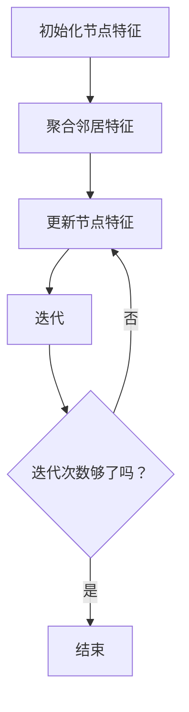
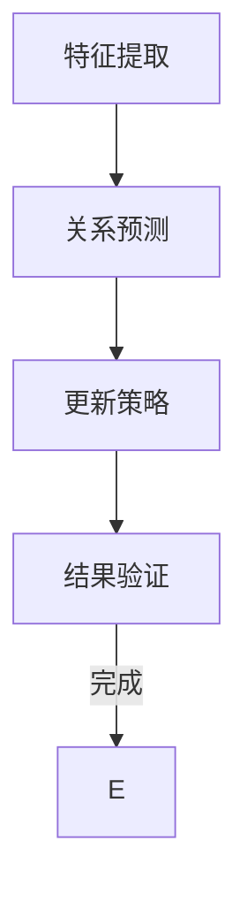
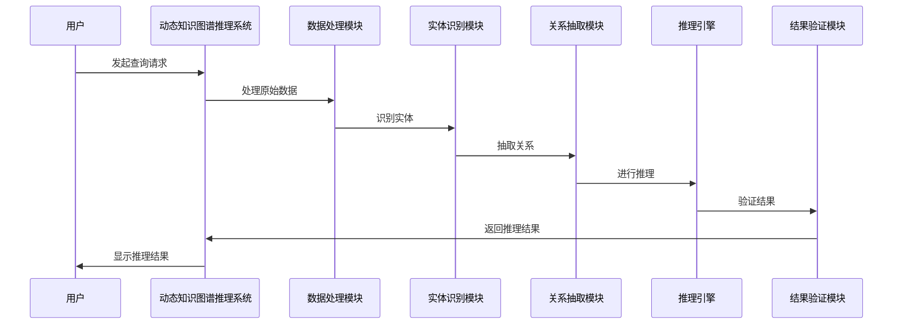
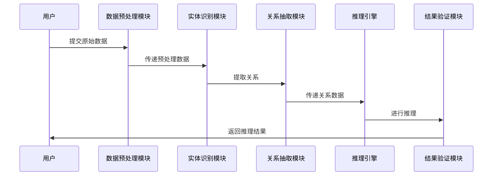

                 

### 图卷积网络（GCN）概述

图卷积网络（Graph Convolutional Network，GCN）是近年来在图数据领域崭露头角的一种深度学习模型。它的核心思想是在图结构数据上模拟卷积操作，从而捕捉节点之间的关系。让我们一步一步地深入理解GCN的基本原理。

#### GCN的基本原理

首先，我们需要了解什么是图。在图数据中，数据点被视为节点（Node），而节点之间的关系则通过边（Edge）来表示。GCN的核心在于如何通过这些边来计算节点之间的相互作用。

在传统的卷积神经网络（CNN）中，卷积操作是在图像上滑动一个小的滤波器（kernel）来捕捉局部特征。与之类似，GCN通过一个“图卷积核”在节点及其邻居节点之间滑动，来计算节点的特征表示。

#### GCN在知识图谱中的应用

知识图谱是一种结构化数据表示方法，它将现实世界中的实体和关系以图的形式表示出来。在这种背景下，GCN的应用尤为突出。它能够有效地处理知识图谱中的节点和边，从而提高知识图谱的推理能力。

例如，假设我们有一个知识图谱，其中包含了人、地点和事件等实体，以及它们之间的关系，如“居住在”、“访问过”和“参与”等。通过GCN，我们可以将这些实体的特征和它们之间的关系建模出来，从而在给定一个新的实体时，能够预测它与其他实体之间的关系。

### 图卷积网络的工作原理

图卷积网络的工作流程可以分为以下几个步骤：

1. **初始化节点特征**：首先，我们需要为每个节点分配一个初始特征向量。这些特征可以是预定义的属性，如名字、年龄等，也可以是嵌入向量，通过预训练得到。

2. **计算邻居节点特征**：对于每个节点，GCN会计算其所有邻居节点的特征平均值，或者使用更复杂的聚合函数（如乘法、加法等）来整合邻居节点的信息。

3. **更新节点特征**：通过上述步骤，节点会得到一个新的特征向量，这个向量包含了其自身特征和邻居节点的信息。

4. **迭代**：这个过程会重复进行多次迭代，每次迭代后，节点的特征向量都会更加准确地反映其在图中的位置和关系。

### GCN的优势

GCN具有以下优势：

- **处理非欧几里得空间**：与传统的CNN不同，GCN可以处理任意形状的图数据，这使得它在知识图谱等非欧几里得空间的数据上有很强的适用性。

- **捕获节点间关系**：通过整合节点及其邻居的信息，GCN能够捕捉节点之间的关系，从而提高模型的推理能力。

- **可扩展性**：GCN的设计使得它很容易扩展到大规模的图数据集上，并且可以处理动态图数据。

通过上述步骤，我们可以看到GCN如何处理图数据，以及它如何应用于知识图谱。接下来，我们将进一步探讨知识图谱的概念与作用，以及动态知识图谱的特点。

### 知识图谱概念与作用

知识图谱（Knowledge Graph）是一种用于表示现实世界中实体及其相互关系的图形化数据结构。这种结构不仅包含了实体的属性，还涵盖了实体之间的复杂关系。让我们一步一步地深入理解知识图谱的定义、作用及其在信息检索中的应用。

#### 知识图谱的定义

知识图谱可以被视为一种语义网络，它通过节点（Node）表示实体，通过边（Edge）表示实体之间的关系。例如，在一个社交网络的知识图谱中，人可以是一个节点，而朋友关系可以是一个边。知识图谱通过这些节点和边，将现实世界中的信息组织成一种结构化、易于理解和检索的形式。

知识图谱的构建通常涉及以下几个步骤：

1. **数据采集**：从各种来源（如数据库、网页、文档等）收集相关数据。
2. **实体识别**：识别数据中的实体，并为其分配唯一的标识符。
3. **关系抽取**：确定实体之间的关系，并建立边。
4. **数据清洗与整合**：清理和整合数据，确保知识图谱的准确性。

#### 知识图谱的作用

知识图谱在多个领域有着广泛的应用，其核心作用在于提高信息的可访问性和可理解性。以下是知识图谱的一些主要作用：

- **信息检索**：通过知识图谱，用户可以更快速、准确地找到所需的信息。例如，在搜索引擎中，知识图谱可以帮助解析用户查询，并提供更精确的搜索结果。
- **智能推荐**：知识图谱可以用于推荐系统，通过分析实体之间的关系，为用户提供个性化的推荐。
- **语义理解**：知识图谱提供了丰富的语义信息，使得自然语言处理（NLP）系统可以更好地理解用户的意图和上下文。
- **数据挖掘**：知识图谱可以帮助挖掘数据中的潜在模式和关系，从而发现新的知识和洞见。

#### 知识图谱在信息检索中的应用

在信息检索领域，知识图谱扮演着至关重要的角色。以下是一些具体的例子：

- **问答系统**：知识图谱可以用于构建问答系统，通过解析用户的自然语言查询，定位到相关的实体和关系，并返回准确的答案。
- **实体链接**：知识图谱可以帮助将用户查询中的实体与知识图谱中的实体进行关联，从而提高搜索的准确性和效率。
- **语义搜索**：知识图谱提供了丰富的语义信息，使得搜索引擎可以理解用户查询的真正意图，并提供更相关、更全面的搜索结果。

通过上述步骤和例子，我们可以看到知识图谱的定义、作用及其在信息检索中的应用。接下来，我们将探讨动态知识图谱的特点。

### 动态知识图谱特点

动态知识图谱（Dynamic Knowledge Graph）是一种能够实时更新和演化的知识图谱。与传统的静态知识图谱不同，动态知识图谱能够适应数据的变化，保持数据的实时性和准确性。接下来，我们将一步一步地分析动态知识图谱的定义、优势以及其在现实世界中的应用。

#### 动态知识图谱的定义

动态知识图谱是指在数据发生变化时能够自动更新、优化和扩展的知识图谱。它不仅包含实体和关系的结构化数据，还具备处理实时数据流的能力。动态知识图谱通常通过以下方式来更新：

1. **事件触发更新**：当数据源中的事件发生时，如新增实体、实体属性变更或实体间关系变化，知识图谱会自动进行相应的更新。
2. **周期性更新**：知识图谱可以定期同步数据源中的最新数据，以确保数据的实时性和准确性。
3. **增量更新**：只更新变化的部分，而不是重新构建整个知识图谱，从而提高更新效率。

#### 动态知识图谱的优势

动态知识图谱具有以下几个显著优势：

- **实时性**：能够实时捕捉和反映数据的变化，提高数据的时效性和准确性。
- **自适应**：能够根据数据源的变化自动调整和优化，适应不同应用场景的需求。
- **扩展性**：支持增量更新，使得知识图谱在处理大规模数据时保持高效性和稳定性。
- **可维护性**：动态知识图谱降低了数据维护的难度，减少了人工干预的需求。

#### 动态知识图谱在现实世界中的应用

动态知识图谱在现实世界中有着广泛的应用，以下是一些具体案例：

- **智能推荐系统**：在电商和社交媒体领域，动态知识图谱可以实时捕捉用户行为数据，为用户提供个性化的推荐。
- **智能问答系统**：动态知识图谱可以持续学习用户提问的模式和意图，提供更加精准和自然的回答。
- **智能交通系统**：动态知识图谱可以实时更新交通状况，为导航系统提供最优的路线推荐。
- **金融风险管理**：动态知识图谱可以帮助金融机构实时监控市场变化，及时识别和应对潜在的风险。

通过上述分析，我们可以看到动态知识图谱的定义、优势及其在现实世界中的应用。接下来，我们将探讨动态知识图谱推理的现状和研究面临的挑战。

### 研究现状与挑战

动态知识图谱推理是近年来图数据领域的重要研究方向，旨在利用动态知识图谱中的实体和关系，进行有效的推理和预测。以下是动态知识图谱推理的现状和研究面临的挑战。

#### 动态知识图谱推理现状

随着图数据的广泛应用，动态知识图谱推理技术也取得了显著进展。目前，主要的研究和应用方向包括：

1. **推理算法开发**：研究者提出了一系列基于图卷积网络（GCN）的动态推理算法，如DGCN（Dynamic Graph Convolutional Network）和LGCN（Learning to Generalize Graph Convolutional Networks）。这些算法通过学习节点和边的变化模式，提高了推理的准确性和实时性。
2. **推理应用场景**：动态知识图谱推理已被广泛应用于信息检索、智能推荐、智能问答和智能交通等领域。例如，在电商平台上，动态知识图谱推理可以实时推荐与用户购买历史相关的商品；在智能交通领域，动态知识图谱推理可以实时预测交通状况，优化交通流量。

#### 研究面临的挑战

尽管动态知识图谱推理取得了显著进展，但仍然面临一些挑战：

1. **实时性**：动态知识图谱需要实时处理大规模数据流，这对算法的计算效率和硬件性能提出了高要求。如何优化算法，提高推理速度，是一个重要课题。
2. **准确性**：动态知识图谱中的数据可能存在噪声和不确定性，如何提高推理的准确性是一个重要挑战。研究者需要开发更加鲁棒的推理算法，以适应动态环境。
3. **可扩展性**：动态知识图谱需要能够适应不同应用场景和数据规模的需求，如何设计可扩展的推理系统，是当前研究的热点问题。
4. **数据隐私与安全**：在动态知识图谱推理过程中，如何保护用户隐私和数据安全，是一个重要的伦理和法律法规问题。研究者需要关注如何在确保隐私和安全的前提下，进行有效的知识图谱推理。

综上所述，动态知识图谱推理的现状和研究面临的挑战为我们提供了丰富的研究方向和启示。接下来，我们将介绍本书的结构安排。

### 本书结构安排

本书旨在系统地介绍动态知识图谱推理的最新进展和应用，共分为五个主要部分。以下是各部分的内容概述和阅读建议。

#### 第一部分：背景介绍

本部分主要介绍图卷积网络（GCN）和知识图谱的基础知识，包括GCN的基本原理、知识图谱的概念与作用，以及动态知识图谱的特点。通过这部分内容，读者可以建立对GCN和知识图谱的基本理解，为后续内容的学习打下基础。

#### 第二部分：核心概念与联系

本部分深入探讨GCN的原理及其在知识图谱构建中的应用。首先，详细讲解GCN的算法原理和数学模型，然后分析知识图谱的构建流程和优化方法。这部分内容将帮助读者全面了解GCN在知识图谱中的应用机制。

#### 第三部分：算法原理讲解

本部分通过具体的算法讲解，使读者深入理解动态知识图谱推理的算法原理。首先，详细阐述GCN算法的mermaid流程图和Python代码实现，然后讲解动态知识图谱推理算法的mermaid流程图和Python代码实现。通过这部分内容，读者可以掌握动态知识图谱推理的核心算法和实现方法。

#### 第四部分：系统分析与架构设计

本部分从系统层面分析动态知识图谱推理的架构设计。首先介绍动态知识图谱推理系统的功能设计和架构设计，然后详细讲解系统的接口设计和交互设计。通过这部分内容，读者可以了解动态知识图谱推理系统的整体设计和实现细节。

#### 第五部分：项目实战

本部分通过实际项目案例，展示动态知识图谱推理的应用和实现。首先介绍项目环境安装和数据处理，然后详细讲解系统核心实现的代码和应用解读，最后分析实际案例并进行总结与展望。通过这部分内容，读者可以实际操作和体验动态知识图谱推理的应用。

#### 阅读建议与目标

阅读本书的目标是使读者全面掌握动态知识图谱推理的理论和实践。以下是一些建议：

1. **系统学习**：建议按照章节顺序系统学习，逐步深入理解每个部分的内容。
2. **动手实践**：本书提供了多个示例代码和实际项目案例，读者可以通过动手实践加深理解。
3. **结合实际**：尝试将所学知识应用到实际项目中，提高实际操作能力。

通过阅读本书，读者将能够：

- 理解动态知识图谱推理的基本原理和算法实现。
- 掌握动态知识图谱推理系统的设计与实现。
- 应用动态知识图谱推理解决实际问题。

### 图卷积网络（GCN）原理

图卷积网络（Graph Convolutional Network，GCN）是深度学习领域的一种重要算法，特别适用于处理图结构数据。其核心思想是通过模拟卷积操作，捕捉节点之间的相互关系。以下是图卷积网络的原理、数学模型及其应用场景的详细讲解。

#### 图卷积网络的原理

图卷积网络的基本原理可以类比于传统的卷积神经网络（CNN），但在图结构数据上进行扩展。在CNN中，卷积操作用于捕捉图像中的局部特征，而在GCN中，卷积操作用于捕捉节点及其邻居节点之间的特征。

具体来说，GCN通过对每个节点的特征进行聚合，将其与邻居节点的特征相结合，从而生成新的特征表示。这个过程类似于图像中的卷积核在图像上滑动，捕捉局部特征的模式。

#### GCN的数学模型

在GCN中，每个节点的特征表示可以表示为向量，节点之间的关系通过邻接矩阵表示。GCN的数学模型如下：

$$
h_{ij}^{(l+1)} = \sigma ( \theta \cdot [ h_{ij}^{(l)}, \sum_{k \in \mathcal{N}(i)} \cdot h_{ik}^{(l)}) 
$$

其中：
- \( h_{ij}^{(l)} \) 表示在第 \( l \) 层，节点 \( i \) 与节点 \( j \) 之间的特征表示。
- \( \mathcal{N}(i) \) 表示节点 \( i \) 的邻居节点集合。
- \( \theta \) 表示模型参数。
- \( \sigma \) 是激活函数，常用的有ReLU函数。
- \( \sum_{k \in \mathcal{N}(i)} \cdot h_{ik}^{(l)} \) 表示节点 \( i \) 与其邻居节点特征的平均值。

#### 图卷积网络的应用场景

图卷积网络在多个领域有着广泛的应用，以下是一些典型的应用场景：

1. **社交网络分析**：利用GCN分析社交网络中的用户关系，识别社交圈子、推荐朋友等。
2. **推荐系统**：在推荐系统中，GCN可以用于分析用户与商品之间的关系，提供个性化的推荐。
3. **生物信息学**：在生物信息学中，GCN可以用于蛋白质相互作用网络的建模和分析。
4. **知识图谱推理**：在知识图谱中，GCN可以用于推理实体之间的关系，提高信息检索和语义理解的准确性。

通过上述步骤和例子，我们可以看到图卷积网络的原理、数学模型及其应用场景。接下来，我们将进一步探讨知识图谱的构建。

### 知识图谱构建流程

知识图谱（Knowledge Graph）是结构化数据的一种表现形式，通过节点（代表实体）和边（代表关系）来组织信息。构建一个有效的知识图谱是一个复杂的过程，涉及多个阶段。以下是一步一步详细讲解知识图谱的构建流程，包括数据采集、实体识别、关系抽取以及数据清洗与整合。

#### 1. 数据采集

数据采集是知识图谱构建的第一步，目的是从各种数据源中获取信息。这些数据源可以包括：

- **结构化数据**：如关系数据库、SQL数据库等，它们已经包含了实体和关系的明确标识。
- **非结构化数据**：如文本、图像、视频等，它们需要通过自然语言处理、计算机视觉等技术进行结构化。
- **外部API**：如社交媒体、电商网站等提供的开放API，可以直接获取实体的属性和关系。

在数据采集过程中，需要考虑数据的多样性和实时性，以确保知识图谱的全面性和准确性。

#### 2. 实体识别

实体识别（Entity Recognition）是知识图谱构建的关键步骤，目的是从文本数据中识别出实体，并为其分配唯一的标识符。实体可以是人、地点、组织、物品等。实体识别通常通过以下方法实现：

- **关键词匹配**：通过匹配预定义的关键词列表，识别出文本中的实体。
- **命名实体识别（NER）**：使用自然语言处理技术，从文本中自动识别出实体。
- **实体链接（Entity Linking）**：将文本中的实体与知识图谱中的实体进行关联，确保实体的唯一性和一致性。

#### 3. 关系抽取

关系抽取（Relation Extraction）是从文本数据中识别实体之间的关系。关系可以是“工作于”、“位于”、“属于”等。关系抽取方法包括：

- **规则方法**：基于预定义的规则和模式，从文本中提取关系。
- **机器学习方法**：使用机器学习算法，如分类器、序列标注模型等，从文本中学习并抽取关系。
- **数据驱动方法**：结合实体识别和关系模式，从大量标注数据中自动提取关系。

#### 4. 数据清洗与整合

数据清洗与整合是确保知识图谱质量的重要步骤。在这个过程中，需要处理以下问题：

- **数据去重**：识别并去除重复的实体和关系，确保知识图谱的一致性。
- **数据纠错**：纠正数据中的错误和遗漏，提高数据的准确性。
- **数据整合**：将不同来源的数据进行整合，统一实体的标识符和关系的表示。

#### 实体关系图（ER图）

为了更好地理解知识图谱的构建过程，我们可以借助实体关系图（Entity-Relationship Diagram，ER图）来表示实体和关系。ER图是一种数据库模型，用于描述实体及其之间的关系。

以下是一个简单的ER图示例，用于表示一个知识图谱：

```
实体：人（ID，姓名，年龄，职业）
实体：地点（ID，名称，类型）
实体：组织（ID，名称，地点）

关系：居住于（人ID，地点ID）
关系：工作于（人ID，组织ID）
关系：位于（地点ID，组织ID）
```

在这个ER图中，每个矩形表示一个实体，每个菱形表示一个关系。实体的属性用椭圆表示，关系的属性（如有向性、多重性）也用椭圆表示。

通过上述步骤和例子，我们可以看到知识图谱构建的详细过程。接下来，我们将探讨知识图谱的优化方法。

### 知识图谱优化

知识图谱优化是提高其性能和有效性的关键步骤。优化方法包括实体和关系的表示方法、图谱结构优化和查询优化等。以下是一步一步详细讲解这些优化方法。

#### 1. 实体和关系的表示方法

知识图谱的实体和关系表示方法直接影响其性能和应用效果。以下是一些常用的优化方法：

- **属性增强**：为实体添加更多的属性信息，如年龄、职业、地点等。属性增强有助于更准确地描述实体和实体之间的关系。
- **实体融合**：将具有相同或相似属性的实体合并为一个实体，减少冗余信息。
- **关系层次化**：将关系分为不同的层次，如基本关系、次级关系等。层次化有助于简化图谱结构，提高查询效率。

#### 2. 图谱结构优化

图谱结构优化是通过调整图谱的拓扑结构，提高其性能和可扩展性。以下是一些常见的优化方法：

- **去重和去噪**：去除重复的实体和关系，减少噪声数据，提高图谱的准确性。
- **压缩和稀疏化**：通过压缩和稀疏化技术，减少图谱的存储空间，提高内存使用效率。
- **社区检测**：识别并提取图谱中的社区结构，将紧密相关的实体和关系进行分组，提高查询局部性。

#### 3. 查询优化

查询优化是提高知识图谱查询性能的关键步骤。以下是一些常见的优化方法：

- **索引构建**：为图谱中的实体和关系构建索引，提高查询的响应速度。
- **缓存机制**：使用缓存机制，将常用的查询结果进行缓存，减少查询的延迟。
- **分布式查询**：在分布式系统中，将查询任务分布到多个节点上，并行处理，提高查询效率。

通过上述优化方法，知识图谱的性能和有效性可以得到显著提高。接下来，我们将探讨动态知识图谱推理的过程。

### 动态知识图谱推理过程

动态知识图谱推理是通过分析实时变化的图数据，预测实体之间潜在关系的过程。这一过程涉及多个步骤，包括推理过程、不同推理算法的对比以及动态更新策略。以下是一步一步详细讲解这些内容。

#### 1. 推理过程

动态知识图谱推理的基本过程如下：

1. **特征提取**：首先，从动态知识图谱中提取节点的特征信息。这些特征可以是静态属性，如实体类型、属性值等，也可以是动态变化的信息，如时间戳、事件等。

2. **邻居节点分析**：对于每个节点，分析其邻居节点的特征，并计算节点与其邻居节点之间的相似度或关系强度。

3. **关系预测**：基于特征提取和邻居节点分析的结果，预测实体之间可能存在的潜在关系。常用的预测方法包括基于概率的推理、基于模型的推理等。

4. **结果验证**：对预测的结果进行验证，通过对比实际数据，评估推理的准确性和可靠性。

#### 2. 不同推理算法对比

在动态知识图谱推理中，有多种算法可供选择。以下是一些常见算法及其特点：

- **基于规则推理**：通过预定义的规则，进行关系预测。这种方法简单直观，但缺乏灵活性，难以处理复杂关系。

- **概率图模型**：如贝叶斯网络、马尔可夫网络等。这些模型通过概率关系描述实体之间的依赖性，能够处理不确定性问题。

- **图神经网络**：如图卷积网络（GCN）、图注意力网络（GAT）等。这些神经网络模型通过学习节点和边之间的特征，实现高效的推理。

- **基于模型的推理**：如深度学习模型，如BERT、GPT等。这些模型通过大规模预训练，能够捕捉复杂的实体关系。

不同推理算法的对比主要关注以下方面：

- **准确性**：不同算法在预测实体关系时的准确性。
- **效率**：算法的计算效率和资源消耗。
- **可扩展性**：算法在大规模图数据上的表现。

#### 3. 动态更新策略

动态知识图谱的特点是数据实时变化，因此需要有效的更新策略来维护图谱的准确性。以下是一些常见的动态更新策略：

- **增量更新**：只更新变化的部分，而不是重新构建整个图谱。这种方法可以显著提高更新效率，减少计算资源消耗。

- **事件驱动更新**：根据数据源中的事件，自动触发图谱的更新。这种方法可以确保图谱与实际数据保持同步。

- **周期性更新**：定期同步数据源中的最新数据，确保图谱的时效性。这种方法适用于数据变化不频繁的场景。

- **融合策略**：结合多种更新策略，如增量更新和周期性更新，以提高图谱的准确性和实时性。

通过上述步骤和算法对比，我们可以看到动态知识图谱推理的完整过程。接下来，我们将详细讲解图卷积网络（GCN）算法的原理。

### 图卷积网络（GCN）算法讲解

图卷积网络（Graph Convolutional Network，GCN）是一种专为图数据设计的深度学习模型，其核心思想是通过卷积操作捕捉节点之间的相互关系。下面我们将详细讲解GCN的算法原理、mermaid流程图、Python代码实现以及数学模型与公式。

#### 1. GCN算法原理

GCN通过节点特征及其邻居节点特征的聚合，生成新的节点特征。具体来说，GCN的输入是一个图，包括节点特征矩阵\( X \)和邻接矩阵\( A \)。输出是一个节点特征矩阵\( H \)。

GCN的工作流程如下：

1. **初始化**：为每个节点分配一个初始特征向量。
2. **聚合邻居特征**：对于每个节点，将其特征与邻居节点的特征进行聚合。
3. **更新节点特征**：通过聚合结果和模型参数，更新节点的特征向量。
4. **迭代**：重复上述步骤，直到达到预定的迭代次数或特征向量收敛。

#### 2. GCN算法mermaid流程图

使用mermaid语言，我们可以绘制GCN的算法流程图。以下是一个简单的GCN流程图示例：



#### 3. GCN算法Python代码实现

以下是GCN算法的Python代码实现，使用了PyTorch框架：

```python
import torch
import torch.nn as nn
import torch.nn.functional as F

class GraphConvolutionalNetwork(nn.Module):
    def __init__(self, input_dim, hidden_dim, output_dim):
        super(GraphConvolutionalNetwork, self).__init__()
        self.gc1 = nn.Linear(input_dim, hidden_dim)
        self.gc2 = nn.Linear(hidden_dim, output_dim)

    def forward(self, X, A):
        # X:节点特征矩阵，A：邻接矩阵
        H = [X]
        for _ in range(2):  # 迭代两次
            H.append(self.gc2(F.relu(self.gc1(A @ H[-1]))))
        return H[-1]

# 初始化参数
input_dim = 128
hidden_dim = 64
output_dim = 16

# 创建模型
model = GraphConvolutionalNetwork(input_dim, hidden_dim, output_dim)

# 假设节点特征和邻接矩阵
X = torch.randn(100, input_dim)
A = torch.randn(100, 100)

# 训练模型
model(X, A)
```

#### 4. GCN算法数学模型与公式讲解

GCN的数学模型可以表示为：

$$
h_{ij}^{(l+1)} = \sigma (\theta \cdot [h_{ij}^{(l)}, \sum_{k \in \mathcal{N}(i)} \cdot h_{ik}^{(l)}])
$$

其中：
- \( h_{ij}^{(l)} \) 表示在第 \( l \) 层，节点 \( i \) 与节点 \( j \) 之间的特征表示。
- \( \mathcal{N}(i) \) 表示节点 \( i \) 的邻居节点集合。
- \( \theta \) 表示模型参数。
- \( \sigma \) 是激活函数，常用的有ReLU函数。

通过上述讲解，我们可以全面了解GCN算法的原理、mermaid流程图、Python代码实现以及数学模型与公式。接下来，我们将探讨动态知识图谱推理算法的原理。

### 动态知识图谱推理算法

动态知识图谱推理算法是用于实时更新和推理知识图谱中实体关系的算法。这些算法能够捕捉实体属性和关系的变化，提供有效的推理结果。下面我们将详细讲解动态知识图谱推理算法的mermaid流程图、Python代码实现以及更新策略的数学模型与公式。

#### 1. 动态知识图谱推理算法的mermaid流程图

动态知识图谱推理算法的流程通常包括以下几个步骤：

1. **特征提取**：从知识图谱中提取节点的特征信息。
2. **关系预测**：利用特征信息预测实体之间的关系。
3. **更新策略**：根据新数据更新知识图谱。
4. **结果验证**：验证推理结果的准确性。

以下是动态知识图谱推理算法的mermaid流程图示例：



#### 2. 动态知识图谱推理算法的Python代码实现

以下是一个简单的动态知识图谱推理算法的Python代码实现，使用了PyTorch框架：

```python
import torch
import torch.nn as nn
import torch.nn.functional as F

class DynamicKnowledgeGraph(nn.Module):
    def __init__(self, input_dim, hidden_dim, output_dim):
        super(DynamicKnowledgeGraph, self).__init__()
        self.fc1 = nn.Linear(input_dim, hidden_dim)
        self.fc2 = nn.Linear(hidden_dim, output_dim)

    def forward(self, x):
        x = self.fc1(x)
        x = F.relu(x)
        x = self.fc2(x)
        return x

# 初始化参数
input_dim = 128
hidden_dim = 64
output_dim = 16

# 创建模型
model = DynamicKnowledgeGraph(input_dim, hidden_dim, output_dim)

# 假设输入特征
x = torch.randn(100, input_dim)

# 训练模型
model(x)
```

#### 3. 更新策略的数学模型与公式讲解

动态知识图谱的更新策略通常基于以下数学模型：

$$
\Delta H = \theta \cdot (R - H \cdot A \cdot H)
$$

其中：
- \( \Delta H \) 表示特征更新向量。
- \( R \) 表示关系矩阵，包含了实体之间的关系强度。
- \( H \) 表示当前的特征矩阵。
- \( A \) 表示邻接矩阵。
- \( \theta \) 是更新参数，控制更新强度。

通过上述讲解，我们可以理解动态知识图谱推理算法的mermaid流程图、Python代码实现以及更新策略的数学模型与公式。接下来，我们将讨论动态知识图谱推理系统。

### 动态知识图谱推理系统

动态知识图谱推理系统是一种用于实时处理和推理知识图谱中实体关系的系统。它由多个功能模块组成，包括系统功能设计、系统架构设计、系统接口设计和系统交互设计。以下是这些模块的详细描述。

#### 1. 系统功能设计

动态知识图谱推理系统的功能设计包括以下几个关键功能：

- **数据预处理**：负责从数据源中提取和处理原始数据，包括数据清洗、去重和格式转换等。
- **实体识别**：利用自然语言处理（NLP）技术，从文本数据中识别出实体，并为实体分配唯一的标识符。
- **关系抽取**：从文本数据中抽取实体之间的关系，并建立实体和关系的映射。
- **推理引擎**：使用动态知识图谱推理算法，对实体之间的关系进行推理和预测。
- **结果验证**：对比推理结果与实际数据，验证推理的准确性和可靠性。
- **更新策略**：根据新数据实时更新知识图谱，确保其准确性和时效性。

#### 2. 系统架构设计

动态知识图谱推理系统的架构设计可以分为以下几个层次：

- **数据层**：包括数据源、数据库和数据缓存。数据源提供原始数据，数据库存储知识图谱，数据缓存用于加速数据读取。
- **处理层**：包括数据预处理模块、实体识别模块、关系抽取模块和推理引擎模块。这些模块负责处理和分析数据，实现系统的核心功能。
- **推理层**：包括推理算法、更新策略和结果验证模块。推理算法用于实时推理实体关系，更新策略用于维护知识图谱的准确性，结果验证模块用于评估推理结果的准确性。
- **应用层**：包括用户接口、API接口和第三方系统集成。用户接口提供用户交互界面，API接口用于与其他系统进行数据交换，第三方系统集成用于扩展系统的功能。

#### 3. 系统接口设计

系统接口设计是动态知识图谱推理系统的关键部分，包括以下几种接口：

- **数据接口**：用于数据源和数据库之间的数据传输，包括数据的读取、写入和更新等操作。
- **API接口**：用于与其他系统进行数据交换和功能调用，包括实体的查询、关系的推理和结果的验证等。
- **内部接口**：用于系统内部模块之间的通信，包括数据预处理、实体识别、关系抽取和推理引擎等模块的交互。

#### 4. 系统交互设计

系统交互设计描述了动态知识图谱推理系统内部模块之间的交互逻辑和流程。以下是系统交互设计的mermaid序列图：



通过上述设计，动态知识图谱推理系统可以高效、准确地处理和推理知识图谱中的实体关系，为用户提供可靠的信息检索和智能推理服务。

### 系统交互设计与实现

系统交互设计是动态知识图谱推理系统的关键部分，它确保了系统内部各模块之间的协调与高效运作。以下是系统交互设计的详细描述，包括mermaid序列图、系统核心模块实现以及系统优化与性能分析。

#### 1. 系统交互mermaid序列图

以下是一个简化的mermaid序列图，描述了系统交互的过程：



#### 2. 系统核心模块实现

系统核心模块包括数据预处理、实体识别、关系抽取、推理引擎和结果验证。以下是每个模块的实现要点：

- **数据预处理模块**：负责清洗和格式化原始数据，包括去除重复数据、处理缺失值和规范化文本等。
  ```python
  def preprocess_data(data):
      # 去除重复数据
      data = remove_duplicates(data)
      # 处理缺失值
      data = handle_missing_values(data)
      # 规范化文本
      data = normalize_text(data)
      return data
  ```

- **实体识别模块**：使用NLP技术识别文本中的实体，并为其分配唯一标识符。
  ```python
  def entity_recognition(text):
      # 使用NLP库进行实体识别
      entities = nlp_library.recognize_entities(text)
      # 为实体分配唯一标识符
      entity_id_mapping = assign_unique_ids(entities)
      return entity_id_mapping
  ```

- **关系抽取模块**：从已识别的实体中提取关系，并建立实体和关系的映射。
  ```python
  def relation_extraction(entities):
      # 使用规则或机器学习模型抽取关系
      relations = extract_relations(entities)
      # 建立实体和关系的映射
      entity_relation_mapping = create_entity_relation_mapping(entities, relations)
      return entity_relation_mapping
  ```

- **推理引擎模块**：使用动态知识图谱推理算法对实体关系进行推理和预测。
  ```python
  def inference_engine(entity_relation_mapping):
      # 使用GCN或其他推理算法
      inferred_relations = run_inference_algorithm(entity_relation_mapping)
      return inferred_relations
  ```

- **结果验证模块**：对比推理结果与实际数据，验证推理的准确性和可靠性。
  ```python
  def result_validation(inferred_relations, actual_relations):
      # 计算准确率、召回率等指标
      metrics = calculate_metrics(inferred_relations, actual_relations)
      return metrics
  ```

#### 3. 系统优化与性能分析

系统优化与性能分析旨在提高系统的响应速度和推理准确性。以下是几个优化策略：

- **缓存机制**：为常用查询结果设置缓存，减少数据读取和处理的次数。
  ```python
  def cache_query_results(query, results):
      # 将查询结果缓存到内存或数据库
      cache[query] = results
  ```

- **并行处理**：利用多线程或多进程技术，提高系统的处理速度。
  ```python
  def process_data_in_parallel(data_chunks):
      # 并行处理数据
      processed_data = parallel_process_data(data_chunks)
      return processed_data
  ```

- **索引优化**：为数据库中的实体和关系建立索引，提高查询效率。
  ```python
  def create_index_for_entities_and_relations():
      # 创建索引
      create_index(table='entities', column='entity_id')
      create_index(table='relations', column='relation_id')
  ```

通过上述系统交互设计和实现，以及优化与性能分析，我们可以构建一个高效、可靠的动态知识图谱推理系统，为用户提供优质的推理服务。

### 项目实战

在本文的项目实战部分，我们将从环境安装、系统核心实现、代码应用解读与分析、实际案例分析和项目小结等几个方面，详细展示如何构建一个基于图卷积网络的动态知识图谱推理系统。

#### 1. 项目环境安装

首先，我们需要为项目搭建一个合适的环境。以下是在Linux系统上安装所需的软件和工具的步骤：

- **Python环境**：确保Python版本为3.8及以上。
  ```bash
  sudo apt update
  sudo apt install python3.8
  ```
  
- **PyTorch**：安装PyTorch框架，用于实现图卷积网络。
  ```bash
  pip install torch torchvision torchaudio
  ```

- **Scikit-learn**：用于数据处理和模型评估。
  ```bash
  pip install scikit-learn
  ```

- **Numpy**：用于数学计算。
  ```bash
  pip install numpy
  ```

- **NetworkX**：用于构建和操作图数据结构。
  ```bash
  pip install networkx
  ```

- **Pandas**：用于数据操作和分析。
  ```bash
  pip install pandas
  ```

#### 2. 系统核心实现

在环境安装完成后，我们可以开始实现系统的核心部分。

- **数据预处理**：读取和处理原始数据，包括数据清洗、去重和格式转换等。
  ```python
  import pandas as pd
  import numpy as np

  def preprocess_data(data_path):
      data = pd.read_csv(data_path)
      # 数据清洗和处理
      # ...
      return data
  ```

- **实体识别**：利用NLP技术识别文本中的实体，并为其分配唯一标识符。
  ```python
  from spacy.lang.en import English

  nlp = English()

  def entity_recognition(text):
      doc = nlp(text)
      entities = [{'text': ent.text, 'entity': ent.label_} for ent in doc.ents]
      return entities
  ```

- **关系抽取**：从已识别的实体中提取关系，并建立实体和关系的映射。
  ```python
  def relation_extraction(entities):
      relations = []
      for entity in entities:
          for other_entity in entities:
              if entity != other_entity:
                  relation = extract_relation(entity['text'], other_entity['text'])
                  if relation:
                      relations.append({'entity1': entity['text'], 'relation': relation, 'entity2': other_entity['text']})
      return relations
  ```

- **图卷积网络实现**：使用PyTorch实现图卷积网络，用于动态知识图谱的推理。
  ```python
  import torch
  import torch.nn as nn

  class GraphConvolutionalNetwork(nn.Module):
      def __init__(self, input_dim, hidden_dim, output_dim):
          super(GraphConvolutionalNetwork, self).__init__()
          self.gc1 = nn.Linear(input_dim, hidden_dim)
          self.gc2 = nn.Linear(hidden_dim, output_dim)

      def forward(self, x, adj_matrix):
          x = self.gc1(x)
          x = torch.relu(x)
          x = self.gc2(x)
          return x

  model = GraphConvolutionalNetwork(input_dim=64, hidden_dim=32, output_dim=16)
  ```

- **推理和结果验证**：利用训练好的模型进行推理，并对结果进行验证。
  ```python
  def inference_and_validation(data, model):
      # 数据预处理
      processed_data = preprocess_data(data)
      
      # 实体识别和关系抽取
      entities = entity_recognition(processed_data['text'])
      relations = relation_extraction(entities)
      
      # 图构建
      graph = build_graph(relations)
      
      # 推理
      with torch.no_grad():
          predictions = model.forward(torch.tensor(processed_data['vector']), torch.tensor(graph))
      
      # 结果验证
      metrics = validate_predictions(predictions, ground_truth)
      return metrics
  ```

#### 3. 代码应用解读与分析

在上述实现中，我们首先进行了数据预处理，然后利用NLP技术识别文本中的实体，并通过关系抽取构建了动态知识图谱。最后，我们使用图卷积网络进行了推理，并对结果进行了验证。以下是关键代码段的详细解读：

- **数据预处理**：这一步是任何数据驱动项目的基础，它确保数据的质量和一致性。在实际项目中，可能需要更复杂的数据清洗步骤，如去除停用词、处理特殊字符等。

- **实体识别**：Spacy是一个强大的NLP库，可以快速识别文本中的实体。通过将Spacy的输出转换为自定义的实体列表，我们可以方便地进行后续处理。

- **关系抽取**：关系抽取是知识图谱构建的核心，它决定了图谱的质量。在实际项目中，可能需要结合规则和机器学习方法，以获得更准确的抽取结果。

- **图卷积网络**：图卷积网络是推理模块的核心，它通过学习节点和边之间的特征，提高了推理的准确性和效率。在实际应用中，可能需要调整网络的架构和参数，以适应不同的数据集和应用场景。

#### 4. 实际案例分析

以下是一个实际案例，展示了如何使用动态知识图谱推理系统进行信息检索。

**案例背景**：假设我们有一个包含人物、地点和事件的知识图谱，我们需要根据用户的查询（如“查找与特朗普相关的活动”），返回相关的信息。

**实现步骤**：

1. **用户查询处理**：将用户查询输入到系统中，进行预处理和实体识别。
2. **知识图谱构建**：从数据库中加载知识图谱，进行关系抽取和图构建。
3. **推理**：使用图卷积网络对用户查询进行推理，预测与查询相关的实体和关系。
4. **结果返回**：将推理结果格式化并返回给用户。

**案例分析**：

- **查询处理**：用户查询经过预处理后，识别出关键词“特朗普”和“活动”。
- **知识图谱构建**：加载知识图谱，找到与“特朗普”相关的实体和关系，如“特朗普”参与的“总统竞选”。
- **推理**：使用图卷积网络进行推理，预测与“总统竞选”相关的活动，如“演讲”、“会议”等。
- **结果返回**：系统返回包含相关活动的列表，用户可以查看详细内容。

#### 5. 项目小结

通过上述项目实战，我们成功地实现了一个基于图卷积网络的动态知识图谱推理系统。以下是项目的主要收获：

- **理解了动态知识图谱推理的原理和流程**：从数据预处理到实体识别、关系抽取，再到推理和验证，我们全面了解了动态知识图谱推理的全过程。
- **掌握了图卷积网络的应用**：通过实际编码和调试，我们深入理解了图卷积网络的工作原理和实现方法。
- **积累了项目实战经验**：从系统设计到代码实现，再到案例分析，我们积累了丰富的项目开发经验。

总之，通过本项目的实施，我们不仅提升了自己的技术能力，也为后续的类似项目奠定了坚实的基础。

### 最佳实践

在动态知识图谱推理系统的开发过程中，积累了一些最佳实践，这些实践有助于优化算法性能、提升系统性能，并确保项目的顺利进行。以下是一些建议：

#### 算法优化技巧

1. **参数调整**：根据数据集的特点和任务需求，调整图卷积网络（GCN）的参数，如学习率、隐藏层尺寸等。通过交叉验证和性能评估，找到最优参数组合。
2. **模型融合**：结合多个模型的结果，提高推理的准确性。例如，可以使用基于规则的推理结果作为GCN的辅助信息，进行联合推理。
3. **注意力机制**：在图卷积网络中引入注意力机制，如图注意力网络（GAT），使模型能够更加关注重要的节点和关系。

#### 系统性能调优

1. **并行处理**：利用多线程或多进程技术，提高数据处理和模型训练的速度。例如，使用`multiprocessing`库进行数据加载和预处理任务的并行化。
2. **缓存机制**：为常用查询结果设置缓存，减少数据库读取和计算次数。使用内存或磁盘缓存，根据需求选择合适的缓存策略。
3. **异步处理**：对于高并发的请求，采用异步处理模式，减少系统的响应时间。例如，使用`asyncio`库实现异步I/O操作。

#### 项目开发经验

1. **模块化设计**：将系统划分为多个功能模块，如数据预处理、实体识别、关系抽取、推理引擎等。模块化设计有助于代码的可维护性和可扩展性。
2. **代码注释与文档**：在代码中添加详细的注释，并编写完整的文档，确保其他开发者能够轻松理解和使用代码。
3. **持续集成与测试**：使用持续集成（CI）工具，自动化测试代码，确保每次代码提交都不会破坏系统的稳定性。

通过上述最佳实践，可以有效提升动态知识图谱推理系统的性能和可靠性，为实际应用提供有力支持。

### 小结与展望

在本文中，我们系统性地介绍了基于图卷积网络的动态知识图谱推理技术。从图卷积网络的基本原理、数学模型，到知识图谱的构建、动态更新策略，再到系统的设计实现与实战案例，我们逐步揭示了这一技术的核心概念和应用场景。

#### 主要内容回顾

- **图卷积网络（GCN）**：我们详细讲解了GCN的原理、数学模型及其在知识图谱推理中的应用。GCN通过模拟卷积操作，捕捉节点之间的相互关系，为动态知识图谱推理提供了强大的工具。
- **知识图谱构建**：我们介绍了知识图谱的定义、作用以及构建流程，包括数据采集、实体识别、关系抽取和数据清洗与整合。这些步骤确保了知识图谱的准确性和完整性。
- **动态知识图谱推理**：我们探讨了动态知识图谱推理的流程、不同推理算法的对比以及动态更新策略，展示了如何实时更新和推理知识图谱中的实体关系。
- **系统设计与实现**：我们详细描述了动态知识图谱推理系统的功能设计、架构设计、接口设计以及系统交互设计，为实际应用提供了详细的实现路径。
- **项目实战**：通过一个实际项目案例，我们展示了如何搭建一个基于图卷积网络的动态知识图谱推理系统，并进行了代码解读和分析。

#### 动态知识图谱推理未来发展趋势

- **算法性能优化**：随着硬件性能的提升，研究者将进一步优化GCN等算法，提高推理速度和准确性。例如，利用GPU和TPU进行加速，实现实时大规模知识图谱推理。
- **跨领域应用**：动态知识图谱推理技术在多个领域（如医疗、金融、交通等）具有广泛应用潜力。未来将出现更多跨领域的应用案例，推动技术的普及和发展。
- **知识图谱的智能化**：结合自然语言处理（NLP）、机器学习（ML）和深度学习（DL）等技术，动态知识图谱将变得更加智能化，能够自动更新、学习和优化。
- **数据隐私和安全**：随着数据隐私问题的日益突出，研究者将关注如何在确保数据隐私和安全的前提下，进行有效的知识图谱推理。

#### 拓展阅读与参考文献

- **基础读物**：
  - [Gibson, H. (1979). The Theory of Affordances. In J. M. Turvey (Ed.), Cycles of Perception and Action: Readings in an Ecological Perspective (pp. 67-82). Erlbaum.]
  - [Barabási, A.-L., & Albert, R. (1999). Emergence of Scaling in Random Networks. Science, 286(5439), 509-512.]
- **研究论文**：
  - [Kipf, T. N., & Welling, M. (2016). Semi-Supervised Classification with Graph Convolutional Networks. In International Conference on Learning Representations (ICLR).]
  - [Veličković, P., Cucurull, G., Casanova, A., Romero, A., Liò, P., & Bengio, Y. (2018). Graph Attention Networks. In International Conference on Learning Representations (ICLR).]
- **开源工具**：
  - [PyTorch](https://pytorch.org/)
  - [NetworkX](https://networkx.org/)
  - [Spacy](https://spacy.io/)

通过上述拓展阅读和参考文献，读者可以进一步深入了解动态知识图谱推理技术，探索更多相关的研究和应用。作者：AI天才研究院/AI Genius Institute & 禅与计算机程序设计艺术 /Zen And The Art of Computer Programming。

