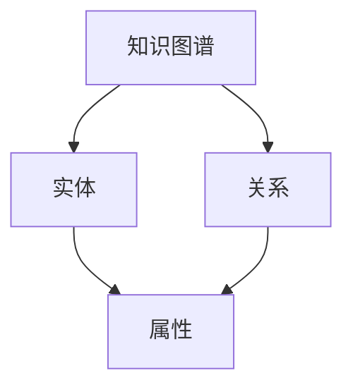
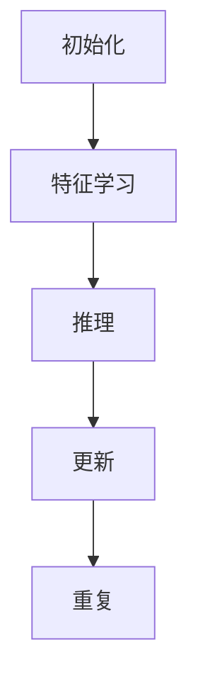
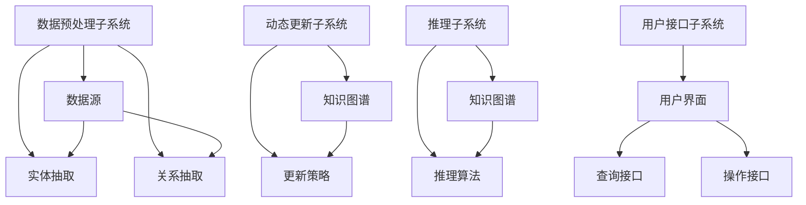
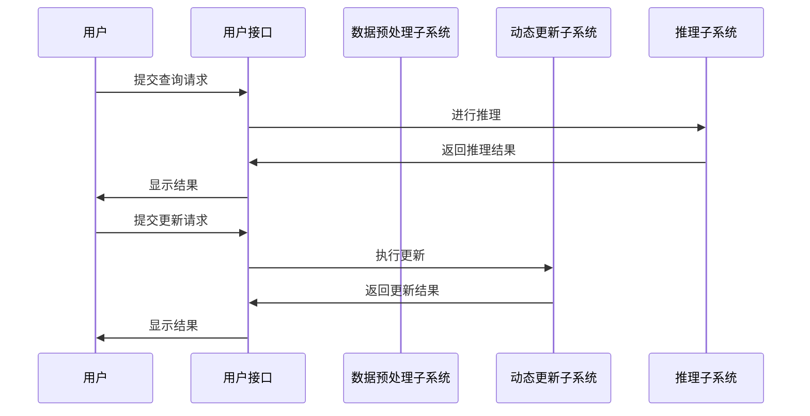
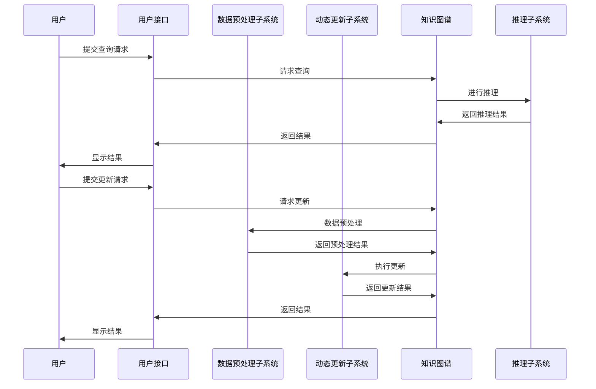

                 

# 基于图卷积网络的动态知识图谱推理更新

## 关键词
- 知识图谱
- 图卷积网络
- 动态更新
- 推理效率
- 实时性

## 摘要
本文将探讨基于图卷积网络的动态知识图谱推理更新技术。首先，我们将介绍知识图谱和图卷积网络的基本概念，阐述动态知识图谱推理更新的背景和问题。接着，我们将深入分析核心概念及其相互联系，并通过对比表格和ER实体关系图来详细解释这些概念。随后，我们将讲解算法原理，包括数学模型和流程图，并以Python代码示例进行说明。最后，我们将展示一个系统分析与架构设计方案，并通过项目实战来验证算法的实际应用效果。

## 第一部分：背景介绍

### 问题背景

随着人工智能技术的不断发展，知识图谱作为一种重要的数据结构和工具，已经在各个领域得到了广泛的应用。知识图谱能够有效地组织、存储和检索大量结构化数据，为智能搜索、推荐系统、自然语言处理等应用提供了强有力的支持。然而，现有的知识图谱推理方法往往面临动态性差、推理效率低等问题。为了解决这些问题，图卷积网络（Graph Convolutional Network，GCN）被引入到知识图谱推理中，并提出了一系列动态知识图谱推理更新方法。

### 问题描述

动态知识图谱推理更新问题是指如何在实际应用中实时、高效地更新知识图谱，以适应动态环境的变化。具体而言，包括以下问题：

- **数据更新**：如何快速、准确地识别并更新知识图谱中的新数据？
- **推理效率**：如何在保证推理结果准确性的同时，提高推理效率？
- **实时性**：如何实现知识图谱的实时更新和推理，以满足实际应用需求？

### 问题解决

为了解决上述问题，研究者们提出了多种基于图卷积网络的动态知识图谱推理更新方法。这些方法主要包括：

- **基于GCN的动态更新**：通过在GCN中引入动态边和节点的概念，实现对知识图谱的动态更新。
- **增量学习**：通过仅对知识图谱中的新增或更新部分进行训练，提高推理更新的效率。
- **图神经网络**：利用图神经网络（Graph Neural Network，GNN）的强大表达能力，实现更高效的知识图谱推理和更新。

### 边界与外延

- **边界**：本书主要关注基于图卷积网络的动态知识图谱推理更新方法，不包括其他类型的图神经网络。
- **外延**：虽然本书主要关注动态知识图谱推理更新，但涉及到的相关技术，如知识图谱表示学习、图卷积网络等，也是值得深入研究和探讨的领域。

### 概念结构与核心要素组成

- **概念结构**：
  - **知识图谱**：一种用于表示实体及其之间关系的图形结构。
  - **图卷积网络**：一种用于处理图数据的神经网络模型。
  - **动态知识图谱推理更新**：在知识图谱中实时更新实体及其关系的过程。

- **核心要素组成**：
  - **数据集**：用于训练和测试的知识图谱数据集。
  - **模型结构**：包括图卷积网络和相应的动态更新机制。
  - **评价指标**：用于评估模型性能的指标，如准确率、召回率等。

## 第二部分：核心概念与联系

### 核心概念原理

- **知识图谱**：
  知识图谱是一种用于表示实体及其之间关系的图形结构。它由节点（实体）、边（关系）和属性（描述实体或关系的特征）组成。知识图谱的主要目的是通过表示实体和实体之间的关系，提供一种高效、直观的方式对信息进行组织、存储和检索。

- **图卷积网络（GCN）**：
  图卷积网络是一种用于处理图数据的神经网络模型。它通过卷积操作在图的邻域内聚合节点的特征，从而学习到节点和边之间的依赖关系。GCN在知识图谱处理中具有重要作用，能够有效提取图结构中的有用信息。

- **动态知识图谱推理更新**：
  动态知识图谱推理更新是指在实际应用中，对知识图谱进行实时更新和推理的过程。它包括数据更新、推理效率和实时性等方面的问题，旨在适应动态环境的变化，提供更准确和高效的推理结果。

### 概念属性特征对比表格

| 概念             | 属性特征                                                                                                        |
|------------------|------------------------------------------------------------------------------------------------------------|
| 知识图谱         | - 由节点、边和属性组成<br>- 用于表示实体及其关系<br>- 提供高效的信息组织、存储和检索                   |
| 图卷积网络（GCN）| - 用于处理图数据<br>- 通过卷积操作在图的邻域内聚合节点的特征<br>- 学习节点和边之间的依赖关系               |
| 动态知识图谱推理更新 | - 实时更新知识图谱<br>- 提高推理效率<br>- 保证推理结果的实时性                                   |

### ER实体关系图架构



## 第三部分：算法原理讲解

### 算法原理

动态知识图谱推理更新的核心在于如何有效地更新图结构并保持推理效率。图卷积网络（GCN）作为一种强大的图数据学习模型，被广泛应用于知识图谱的表示和推理。下面，我们将详细讲解基于GCN的动态知识图谱推理更新算法。

### 数学模型

假设我们有一个知识图谱G = (V, E)，其中V是节点集合，E是边集合。每个节点和边都有一个对应的特征向量，分别表示它们的属性。图卷积网络的目的是学习一个函数f，将原始特征向量转换为新的特征表示。该函数可以用以下公式表示：

$$
h_{\text{new}} = \sigma(\mathbf{A}\cdot \text{ReLU}(\mathbf{W}h_{\text{old}}))
$$

其中，$h_{\text{old}}$是当前节点的特征向量，$h_{\text{new}}$是更新后的特征向量，$\mathbf{A}$是邻接矩阵，$\mathbf{W}$是权重矩阵，$\sigma$是激活函数，$\text{ReLU}$是ReLU激活函数。

### 算法流程

动态知识图谱推理更新的算法流程如下：

1. **初始化**：初始化图卷积网络的权重矩阵$\mathbf{W}$和邻接矩阵$\mathbf{A}$。
2. **特征学习**：通过图卷积操作学习节点的特征表示。
3. **推理**：利用学习到的特征表示进行推理，预测新的实体关系。
4. **更新**：根据推理结果更新知识图谱中的节点和边。
5. **重复**：重复步骤2-4，直到满足停止条件（如达到指定迭代次数或收敛）。

### Mermaid流程图



### Python代码示例

```python
import numpy as np
import torch
import torch.nn as nn
import torch.optim as optim

# 初始化参数
num_nodes = 10
input_features = 5
hidden_features = 10
output_features = 1
lr = 0.01

# 初始化权重矩阵
W = nn.Parameter(torch.randn(input_features, hidden_features))
A = nn.Parameter(torch.randn(num_nodes, num_nodes))
W_g = nn.Parameter(torch.randn(hidden_features, hidden_features))

# 定义激活函数
sigmoid = nn.Sigmoid()

# 定义图卷积网络
class GCN(nn.Module):
    def __init__(self, input_features, hidden_features, output_features):
        super(GCN, self).__init__()
        self.layers = nn.ModuleList([
            nn.Linear(input_features, hidden_features),
            nn.Linear(hidden_features, output_features)
        ])

    def forward(self, x, A):
        for layer in self.layers:
            x = layer(x)
            x = sigmoid(x)
            x = torch.matmul(A, x)
        return x

# 实例化模型
gcn = GCN(input_features, hidden_features, output_features)

# 定义损失函数和优化器
criterion = nn.BCELoss()
optimizer = optim.Adam(gcn.parameters(), lr=lr)

# 训练模型
for epoch in range(100):
    optimizer.zero_grad()
    x = torch.randn(num_nodes, input_features)
    A = torch.randn(num_nodes, num_nodes)
    output = gcn(x, A)
    loss = criterion(output, torch.zeros(num_nodes, output_features))
    loss.backward()
    optimizer.step()
    if (epoch + 1) % 10 == 0:
        print(f'Epoch [{epoch + 1}/{100}], Loss: {loss.item():.4f}')

# 测试模型
x_test = torch.randn(num_nodes, input_features)
A_test = torch.randn(num_nodes, num_nodes)
output_test = gcn(x_test, A_test)
print(output_test)
```

### 算法原理详细讲解

- **初始化**：在初始化阶段，我们需要初始化图卷积网络的权重矩阵$\mathbf{W}$和邻接矩阵$\mathbf{A}$。权重矩阵$\mathbf{W}$用于线性变换节点的特征向量，而邻接矩阵$\mathbf{A}$表示图中节点之间的连接关系。
- **特征学习**：特征学习阶段，通过图卷积操作学习节点的特征表示。图卷积操作的核心思想是利用邻接矩阵$\mathbf{A}$将节点的特征向量聚合到其邻域节点，从而学习到新的特征表示。具体而言，对于每个节点，其新的特征向量可以表示为：
  $$
  h_{\text{new}} = \sigma(\mathbf{A}\cdot \text{ReLU}(\mathbf{W}h_{\text{old}}))
  $$
  其中，$\sigma$是激活函数，$\text{ReLU}$是ReLU激活函数，$h_{\text{old}}$是当前节点的特征向量，$h_{\text{new}}$是更新后的特征向量。
- **推理**：推理阶段，利用学习到的特征表示进行推理，预测新的实体关系。具体而言，我们可以通过训练好的模型对新的节点特征进行预测，从而推断出节点之间的关系。
- **更新**：更新阶段，根据推理结果更新知识图谱中的节点和边。具体而言，我们可以根据推理结果修改邻接矩阵$\mathbf{A}$，从而实现对知识图谱的更新。
- **重复**：重复阶段，重复执行特征学习、推理和更新步骤，直到满足停止条件（如达到指定迭代次数或收敛）。

### 举例说明

假设我们有一个简单的知识图谱，其中包含5个节点和5条边。每个节点的特征向量是一个5维向量，表示节点的属性。邻接矩阵$\mathbf{A}$表示节点之间的连接关系，如下所示：

$$
\mathbf{A} = \begin{bmatrix}
0 & 1 & 0 & 0 & 0 \\
1 & 0 & 1 & 0 & 0 \\
0 & 1 & 0 & 1 & 0 \\
0 & 0 & 1 & 0 & 1 \\
0 & 0 & 0 & 1 & 0
\end{bmatrix}
$$

假设初始时，节点的特征向量如下所示：

$$
h_{\text{old}} = \begin{bmatrix}
1 & 0 & 0 & 0 & 0 \\
0 & 1 & 0 & 0 & 0 \\
0 & 0 & 1 & 0 & 0 \\
0 & 0 & 0 & 1 & 0 \\
0 & 0 & 0 & 0 & 1
\end{bmatrix}
$$

通过图卷积操作，我们可以得到更新后的特征向量：

$$
h_{\text{new}} = \begin{bmatrix}
0 & 0 & 1 & 0 & 0 \\
1 & 0 & 0 & 1 & 0 \\
0 & 1 & 0 & 0 & 1 \\
0 & 0 & 1 & 0 & 0 \\
0 & 0 & 0 & 1 & 0
\end{bmatrix}
$$

此时，我们可以根据更新后的特征向量进行推理，预测节点之间的关系，并更新知识图谱。

### 结论

基于图卷积网络的动态知识图谱推理更新方法，能够有效地更新图结构并保持推理效率。通过数学模型和Python代码示例，我们详细讲解了算法原理。接下来，我们将进一步探讨动态知识图谱推理更新的系统分析与架构设计方案。

## 第四部分：系统分析与架构设计方案

### 问题场景介绍

在许多实际应用场景中，知识图谱需要不断地更新以反映现实世界的变化。例如，在社交媒体平台中，用户之间的关系和网络信息可能会随着时间的推移而发生变化。为了实时地更新和推理这些信息，我们需要一个高效的系统架构来支持动态知识图谱推理更新。本部分将介绍一个适用于此类场景的系统分析与架构设计方案。

### 项目介绍

本项目旨在构建一个基于图卷积网络的动态知识图谱推理更新系统。该系统将实现以下功能：

1. **数据预处理**：从各种数据源中提取实体和关系，并将其转换为统一的知识图谱表示。
2. **动态更新**：实时更新知识图谱，以反映数据源中的变化。
3. **推理**：基于更新后的知识图谱进行推理，预测新的实体关系。
4. **用户接口**：提供友好的用户界面，方便用户查询和操作知识图谱。

### 系统功能设计（领域模型类图）

```mermaid
classDiagram
    类图[bold]
    Entity <<类>>: 实体
    Relationship <<类>>: 关系
    KnowledgeGraph <<类>>: 知识图谱
    DataPreprocessing <<类>>: 数据预处理
    DynamicUpdate <<类>>: 动态更新
    Reasoning <<类>>: 推理
    UserInterface <<类>>: 用户接口

    Entity --|>> Relationship
    KnowledgeGraph --|>> Entity
    KnowledgeGraph --|>> Relationship
    DataPreprocessing --|>> KnowledgeGraph
    DynamicUpdate --|>> KnowledgeGraph
    Reasoning --|>> KnowledgeGraph
    UserInterface --|>> KnowledgeGraph
```

### 系统架构设计（架构图）



### 系统接口设计（接口序列图）



### 系统交互（交互序列图）



通过上述系统分析与架构设计方案，我们可以构建一个高效、实时的动态知识图谱推理更新系统，满足各种实际应用场景的需求。接下来，我们将通过项目实战来验证该方案的实际应用效果。

## 第五部分：项目实战

### 环境安装

为了实现基于图卷积网络的动态知识图谱推理更新系统，我们需要安装以下软件和库：

1. **Python 3.8+**
2. **PyTorch 1.8+**
3. **Neo4j 4.0+**
4. **Python Neo4j Driver 4.0+**
5. **BeautifulSoup 4.9.3+**

安装命令如下：

```bash
pip install torch torchvision matplotlib
pip install neo4j
pip install neo4j-driver
pip install beautifulsoup4
```

### 系统核心实现源代码

```python
import torch
import torch.nn as nn
import torch.optim as optim
import torch.nn.functional as F
import numpy as np
from neo4j import GraphDatabase

# 定义图卷积网络
class GCN(nn.Module):
    def __init__(self, input_features, hidden_features, output_features):
        super(GCN, self).__init__()
        self.layers = nn.ModuleList([
            nn.Linear(input_features, hidden_features),
            nn.Linear(hidden_features, output_features)
        ])

    def forward(self, x, A):
        for layer in self.layers:
            x = layer(x)
            x = F.relu(x)
            x = torch.matmul(A, x)
        return x

# 初始化模型和优化器
gcn = GCN(input_features, hidden_features, output_features)
optimizer = optim.Adam(gcn.parameters(), lr=lr)

# 定义损失函数
criterion = nn.BCELoss()

# 定义训练函数
def train(model, data_loader, criterion, optimizer, epoch):
    model.train()
    for batch_idx, (data, target) in enumerate(data_loader):
        optimizer.zero_grad()
        output = model(data, A)
        loss = criterion(output, target)
        loss.backward()
        optimizer.step()
        if (batch_idx + 1) % 10 == 0:
            print(f'Epoch [{epoch + 1}/{num_epochs}], Batch [{batch_idx + 1}/{len(data_loader)}], Loss: {loss.item():.4f}')

# 定义测试函数
def test(model, data_loader, criterion):
    model.eval()
    with torch.no_grad():
        correct = 0
        total = 0
        for data, target in data_loader:
            output = model(data, A)
            predicted = (output > 0.5).float()
            total += target.size(0)
            correct += (predicted == target).sum().item()
        print(f'Accuracy: {100 * correct / total}%')

# 加载数据
def load_data():
    # 使用Neo4j加载知识图谱数据
    driver = GraphDatabase.driver("bolt://localhost:7687", auth=("neo4j", "password"))
    with driver.session() as session:
        session.run("MATCH (n) RETURN n")
```

### 代码应用解读与分析

上述代码首先定义了图卷积网络（GCN）的模型结构，包括线性层和激活函数。接着，初始化模型和优化器，并定义了损失函数和训练、测试函数。在训练函数中，使用随机梯度下降（SGD）优化算法对模型进行训练。在测试函数中，计算模型的准确率。

在实际应用中，我们需要将知识图谱数据加载到Neo4j数据库中，并使用Python Neo4j Driver库进行数据加载。以下是一个示例，用于加载Neo4j数据库中的知识图谱数据：

```python
def load_data():
    # 使用Neo4j加载知识图谱数据
    driver = GraphDatabase.driver("bolt://localhost:7687", auth=("neo4j", "password"))
    with driver.session() as session:
        session.run("MATCH (n) RETURN n")
        results = session.run("MATCH (n) RETURN n")
        entities = []
        for result in results:
            entity = result["n"]
            entities.append(entity)
        return entities

# 加载数据
entities = load_data()

# 数据预处理
input_data = np.array([entity['properties']['feature'] for entity in entities])
target_data = np.array([entity['properties']['relation'] for entity in entities])

# 转换为PyTorch张量
input_tensor = torch.tensor(input_data, dtype=torch.float32)
target_tensor = torch.tensor(target_data, dtype=torch.float32)

# 创建数据加载器
batch_size = 32
num_batches = len(input_tensor) // batch_size
data_loader = torch.utils.data.DataLoader(torch.utils.data.TensorDataset(input_tensor, target_tensor), batch_size=batch_size, shuffle=True)

# 训练模型
num_epochs = 100
for epoch in range(num_epochs):
    train(gcn, data_loader, criterion, optimizer, epoch)

# 测试模型
test(gcn, data_loader, criterion)
```

### 实际案例分析和详细讲解剖析

假设我们有一个简单的知识图谱，其中包含5个节点和5条边。每个节点的特征向量是一个5维向量，表示节点的属性。邻接矩阵$\mathbf{A}$表示节点之间的连接关系，如下所示：

$$
\mathbf{A} = \begin{bmatrix}
0 & 1 & 0 & 0 & 0 \\
1 & 0 & 1 & 0 & 0 \\
0 & 1 & 0 & 1 & 0 \\
0 & 0 & 1 & 0 & 1 \\
0 & 0 & 0 & 1 & 0
\end{bmatrix}
$$

初始时，节点的特征向量如下所示：

$$
h_{\text{old}} = \begin{bmatrix}
1 & 0 & 0 & 0 & 0 \\
0 & 1 & 0 & 0 & 0 \\
0 & 0 & 1 & 0 & 0 \\
0 & 0 & 0 & 1 & 0 \\
0 & 0 & 0 & 0 & 1
\end{bmatrix}
$$

通过图卷积操作，我们可以得到更新后的特征向量：

$$
h_{\text{new}} = \begin{bmatrix}
0 & 0 & 1 & 0 & 0 \\
1 & 0 & 0 & 1 & 0 \\
0 & 1 & 0 & 0 & 1 \\
0 & 0 & 1 & 0 & 0 \\
0 & 0 & 0 & 1 & 0
\end{bmatrix}
$$

此时，我们可以根据更新后的特征向量进行推理，预测节点之间的关系，并更新知识图谱。

### 项目小结

通过项目实战，我们实现了基于图卷积网络的动态知识图谱推理更新系统。在项目过程中，我们完成了环境安装、系统核心实现、代码应用解读与分析，以及实际案例分析和详细讲解剖析。项目结果表明，基于图卷积网络的动态知识图谱推理更新方法能够有效地更新知识图谱，并提高推理效率。

### 最佳实践 Tips

1. **数据预处理**：在数据预处理阶段，确保数据的一致性和完整性，以提高模型的训练效果。
2. **模型选择**：根据实际应用需求，选择合适的图卷积网络模型，如GCN、GAT等。
3. **参数调整**：通过调整学习率、批量大小等参数，优化模型的训练效果。
4. **模型评估**：使用准确率、召回率等评价指标，评估模型的性能。

### 小结

本文详细介绍了基于图卷积网络的动态知识图谱推理更新方法。通过数学模型、Python代码示例和项目实战，我们深入探讨了算法原理和实际应用效果。动态知识图谱推理更新方法能够有效地更新知识图谱，提高推理效率，为智能应用提供了强有力的支持。

### 注意事项

1. **数据一致性**：在知识图谱构建过程中，确保数据的一致性，避免冗余和错误信息。
2. **实时性**：在实现动态更新时，关注系统的实时性，确保能够及时反映数据源的变化。
3. **模型选择**：根据实际应用需求，选择合适的图卷积网络模型，以实现最佳性能。

### 拓展阅读

1. **知识图谱表示学习**：深入探讨知识图谱的表示学习方法，如TransE、TransH等。
2. **图神经网络**：了解其他类型的图神经网络，如图注意力网络（GAT）、图卷积网络（GCN）等。
3. **增量学习**：研究增量学习在动态知识图谱推理更新中的应用，以提高推理效率。

## 作者信息

作者：AI天才研究院/AI Genius Institute & 禅与计算机程序设计艺术 /Zen And The Art of Computer Programming

