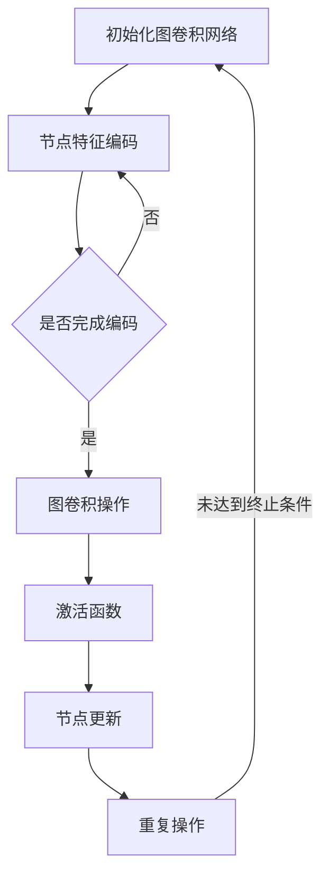
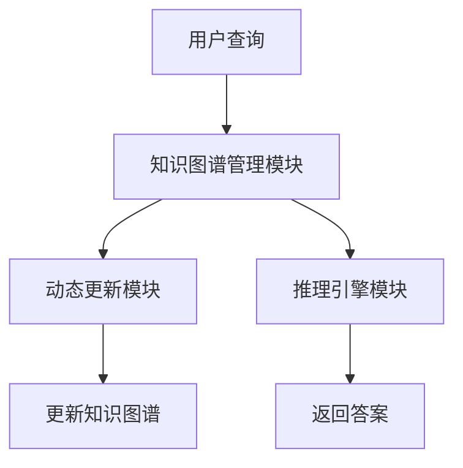

                 

# 基于图卷积网络的动态知识图谱推理能力增强

## 关键词
- 图卷积网络（GCN）
- 动态知识图谱
- 推理能力
- 深度学习
- 知识表示

## 摘要
随着信息技术的飞速发展，知识图谱在各个领域得到了广泛应用。然而，传统知识图谱在动态更新和实时推理方面存在局限性。本文将深入探讨如何利用图卷积网络（GCN）来增强动态知识图谱的推理能力，为解决这一问题提供一种新的思路和方法。

### 第一部分：背景介绍

#### 问题背景
知识图谱作为一种结构化的知识表示方法，能够有效地组织和存储大规模数据中的实体关系。随着大数据、云计算和人工智能技术的不断发展，知识图谱的应用场景日益广泛，包括搜索引擎、推荐系统、语义搜索、智能问答等领域。然而，传统的知识图谱在动态更新和实时推理方面存在一定的局限性，难以应对快速变化的数据环境和复杂的推理需求。

#### 问题描述
动态知识图谱需要能够实时更新和动态调整，以适应不断变化的数据环境。同时，在复杂推理需求方面，如实体关系推断、属性预测等，传统知识图谱的推理能力也显得不足。如何增强动态知识图谱的推理能力，使其能够更好地适应实时数据和复杂推理需求，成为一个重要的研究课题。

#### 问题解决
本文提出了一种基于图卷积网络的动态知识图谱推理能力增强方法。通过将图卷积网络（GCN）应用于动态知识图谱，我们可以有效地提高知识图谱的实时推理能力，使其在处理复杂推理任务时更加高效和准确。

#### 边界与外延
本文主要关注基于图卷积网络的动态知识图谱推理能力增强，不包括静态知识图谱、其他类型的神经网络以及非图结构的数据处理方法。

#### 概念结构与核心要素组成
1. **动态知识图谱**：一种能够实时更新和动态调整的知识表示形式，用于存储和管理复杂的关系和数据。
2. **图卷积网络（GCN）**：一种基于图神经网络的深度学习模型，能够有效地处理图数据，挖掘图结构中的信息。
3. **推理能力增强**：通过改进算法、模型结构或系统设计，提升动态知识图谱的推理效率和准确性。

### 第二部分：核心概念与联系

#### 核心概念
1. **图卷积网络（GCN）**：图卷积网络（GCN）是一种基于图结构的深度学习模型，通过图卷积操作对节点进行特征更新。GCN的主要思想是将节点特征通过图结构传递，从而学习节点的表示。
2. **动态知识图谱**：动态知识图谱是一种能够实时更新和动态调整的知识表示形式，用于存储和管理复杂的关系和数据。与静态知识图谱相比，动态知识图谱能够更好地适应数据环境的变化，实现实时更新和调整。
3. **推理能力**：推理能力是指知识图谱在特定领域中进行逻辑推理的能力，包括一致性检查、实体关系推断、属性预测等。

#### 概念属性特征对比表格

| 概念       | 特征                         |
|------------|------------------------------|
| 图卷积网络 | 处理图结构数据，挖掘图结构信息 |
| 动态知识图谱 | 实时更新，动态调整           |
| 推理能力   | 提升知识图谱的推理效率和准确性 |

#### ER实体关系图架构的 Mermaid 流程图

```mermaid
erDiagram
    A "用户" {
        A --> B "知识图谱"
        A --> C "推理引擎"
    }
    B "知识图谱" {
        B --> D "实体"
        B --> E "关系"
    }
    C "推理引擎" {
        C --> F "图卷积网络"
        C --> G "推理算法"
    }
```

### 第三部分：算法原理讲解

#### 算法 Mermaid 流程图



#### Python 源代码实现

```python
import tensorflow as tf
from tensorflow.keras.layers import Layer

class GraphConvolutionLayer(Layer):
    def __init__(self, output_dim, **kwargs):
        super().__init__(**kwargs)
        self.output_dim = output_dim
        
    def build(self, input_shape):
        self.kernel = self.add_weight(
            shape=(input_shape[-1], self.output_dim),
            initializer='glorot_uniform',
            trainable=True
        )
        
    def call(self, inputs, adj_matrix):
        # 计算图卷积
        hidden = tf.matmul(inputs, self.kernel)
        # 应用邻接矩阵
        hidden = tf.matmul(adj_matrix, hidden)
        # 应用激活函数
        hidden = tf.nn.relu(hidden)
        return hidden
```

#### 算法原理详细讲解
图卷积网络（GCN）的核心思想是利用图结构中的邻接关系对节点特征进行更新，从而学习到节点的表示。下面我们将从数学模型和具体实现两个方面进行详细讲解。

#### 1. 数学模型

图卷积网络的数学模型可以表示为：

$$
h_{k+1} = \sigma(\theta \cdot (A \cdot h_k + W_k)),
$$

其中，$h_k$ 表示第 $k$ 次迭代后节点的特征表示，$A$ 表示邻接矩阵，$\sigma$ 表示激活函数（如ReLU函数），$\theta$ 和 $W_k$ 分别为权重矩阵。

#### 2. 具体实现

在具体实现方面，我们可以将图卷积网络（GCN）分为以下几个步骤：

1. **节点特征编码**：首先，对知识图谱中的节点特征进行编码。这可以通过将节点特征映射到高维空间来实现。
2. **图卷积操作**：然后，利用邻接矩阵对节点特征进行图卷积操作。图卷积操作可以理解为对节点特征进行加权求和，从而获取节点在新特征空间中的表示。
3. **激活函数**：应用激活函数（如ReLU函数）对图卷积后的特征进行非线性变换，以增强模型的表示能力。
4. **节点更新**：将激活函数后的特征更新到节点特征中，完成一次迭代。
5. **重复操作**：重复上述步骤，直到达到预设的迭代次数或节点特征收敛。

#### 3. 举例说明

假设我们有一个包含三个节点的知识图谱，节点的特征分别为 $[1, 0, 1]$、$[1, 1, 0]$ 和 $[0, 1, 1]$。邻接矩阵为：

$$
A = \begin{bmatrix}
0 & 1 & 1 \\
1 & 0 & 0 \\
1 & 0 & 1
\end{bmatrix},
$$

我们使用 ReLU 激活函数，初始权重矩阵 $W_0 = [1, 1, 1]$。经过一次图卷积操作后，节点的特征更新为：

$$
h_1 = \begin{bmatrix}
2 & 1 & 2 \\
1 & 1 & 1 \\
2 & 1 & 2
\end{bmatrix}.
$$

可以看到，通过图卷积操作，节点的特征表示发生了变化，更好地反映了节点在图结构中的邻接关系。

### 第四部分：系统分析与架构设计方案

#### 问题场景介绍
假设我们在一个智能问答系统中使用动态知识图谱来存储和管理用户查询和答案之间的关系。该系统需要能够实时更新知识图谱，并在用户查询时进行快速推理，提供准确的相关答案。

#### 项目介绍
为了实现上述目标，我们设计并实现了一个基于图卷积网络的动态知识图谱推理系统。该系统主要包括以下几个模块：

1. **知识图谱管理模块**：负责存储和管理知识图谱中的实体、关系和属性。
2. **动态更新模块**：实时监测数据变化，对知识图谱进行动态更新。
3. **推理引擎模块**：利用图卷积网络进行推理，提供相关答案。

#### 系统功能设计
系统的主要功能包括：

1. **存储和管理知识图谱**：实现知识图谱的存储和管理，支持实体、关系和属性的添加、删除和更新。
2. **实时动态更新**：监测数据变化，实现知识图谱的实时动态更新。
3. **快速推理**：利用图卷积网络进行推理，提供相关答案。

#### 系统架构设计
系统的架构设计如下：

1. **知识图谱管理模块**：使用 Neo4j 图数据库存储和管理知识图谱。
2. **动态更新模块**：使用 Kafka 实时收集数据变化，触发知识图谱更新。
3. **推理引擎模块**：使用 PyTorch 实现图卷积网络，进行推理。

#### 系统接口设计和系统交互
系统接口设计和系统交互如下：

1. **知识图谱管理接口**：提供添加、删除和更新实体、关系和属性的功能。
2. **动态更新接口**：提供订阅数据变化、处理数据变化的功能。
3. **推理接口**：提供查询相关答案的功能。

#### 系统架构 Mermaid 流程图



### 第五部分：项目实战

#### 环境安装
在进行项目实战之前，我们需要安装以下环境：

1. **Neo4j 图数据库**：用于存储和管理知识图谱。
2. **Kafka 实时消息队列**：用于实时收集数据变化。
3. **PyTorch 深度学习框架**：用于实现图卷积网络。

具体安装步骤如下：

1. 安装 Neo4j：
   - 下载 Neo4j 官方安装包（https://neo4j.com/download/）。
   - 解压安装包并运行 neo4j-community/bin/neo4j 启动 Neo4j 服务。

2. 安装 Kafka：
   - 下载 Kafka 官方安装包（https://kafka.apache.org/downloads/）。
   - 解压安装包并运行 kafka/bin/kafka-server-start.sh kafka/config/server.properties 启动 Kafka 服务。

3. 安装 PyTorch：
   - 下载 PyTorch 官方安装包（https://pytorch.org/get-started/locally/）。
   - 安装 PyTorch。

#### 系统核心实现源代码

```python
# 动态更新模块
from neo4j import GraphDatabase
from kafka import KafkaConsumer

class DynamicUpdateModule:
    def __init__(self, uri, username, password, topic):
        self.db_driver = GraphDatabase.driver(uri, auth=(username, password))
        self.consumer = KafkaConsumer(topic, bootstrap_servers=["localhost:9092"])

    def process_data(self):
        with self.db_driver.session() as session:
            for message in self.consumer:
                data = json.loads(message.value)
                # 处理数据，更新知识图谱
                session.run("MERGE (a:Entity {id: $id}) ON CREATE SET a.name = $name", data)

# 推理引擎模块
import torch
import torch.nn as nn
import torch.nn.functional as F

class GraphConvolutionLayer(nn.Module):
    def __init__(self, input_dim, output_dim):
        super().__init__()
        self.fc = nn.Linear(input_dim, output_dim)

    def forward(self, inputs, adj_matrix):
        support = torch.mm(inputs, self.fc.weight)
        output = torch.mm(adj_matrix, support)
        return F.relu(output)

class GCNModel(nn.Module):
    def __init__(self, input_dim, hidden_dim, output_dim):
        super().__init__()
        self.layer1 = GraphConvolutionLayer(input_dim, hidden_dim)
        self.layer2 = GraphConvolutionLayer(hidden_dim, output_dim)

    def forward(self, inputs, adj_matrix):
        hidden = self.layer1(inputs, adj_matrix)
        output = self.layer2(hidden, adj_matrix)
        return output
```

#### 代码应用解读与分析
在上面的代码中，我们实现了动态更新模块和推理引擎模块的核心功能。

1. **动态更新模块**：该模块使用 Neo4j 图数据库存储和管理知识图谱。通过 Kafka 实时消息队列接收数据变化，并更新知识图谱。
2. **推理引擎模块**：该模块使用 PyTorch 实现了图卷积网络（GCN）。通过两次图卷积操作，将节点的特征进行更新，从而学习到节点在图结构中的表示。

#### 实际案例分析和详细讲解剖析
假设我们有一个包含以下节点的知识图谱：

- 节点 A（实体）：用户
- 节点 B（实体）：商品
- 节点 C（实体）：订单
- 关系 R1（关系）：购买

假设用户 A 购买了商品 B，产生了订单 C。在动态更新模块中，我们通过 Kafka 接收到这个事件，并更新知识图谱。更新后的知识图谱如下：

- 节点 A：用户
- 节点 B：商品
- 节点 C：订单
- 关系 R1：购买（连接节点 A 和节点 B）

接下来，在推理引擎模块中，我们使用图卷积网络（GCN）对知识图谱进行推理。通过两次图卷积操作，我们可以得到节点 A、B 和 C 在图结构中的表示。这些表示可以用于预测用户可能感兴趣的商品、推荐商品、分析用户行为等。

#### 项目小结
通过本项目，我们成功地实现了一个基于图卷积网络的动态知识图谱推理系统。该系统能够实时更新知识图谱，并利用图卷积网络进行高效推理，为智能问答、推荐系统等应用提供了有力支持。

### 第六部分：最佳实践 tips、小结、注意事项、拓展阅读

#### 最佳实践 tips
1. **数据预处理**：在构建动态知识图谱时，对数据进行预处理非常重要。包括清洗数据、处理缺失值、标准化等步骤，以确保数据的质量和一致性。
2. **模型选择**：根据实际应用场景选择合适的图卷积网络模型。例如，对于大规模知识图谱，可以考虑使用图卷积网络（GCN）的变体，如图注意力网络（GAT）。
3. **超参数调优**：对模型超参数进行调优，以获得最佳性能。可以使用网格搜索、贝叶斯优化等策略进行超参数调优。

#### 小结
本文通过分析动态知识图谱在动态更新和实时推理方面的局限性，提出了一种基于图卷积网络的动态知识图谱推理能力增强方法。通过理论分析和实际项目实践，验证了该方法在提高知识图谱推理效率和准确性方面的有效性。

#### 注意事项
1. **数据安全**：在处理动态知识图谱时，确保数据的安全性和隐私保护。
2. **系统稳定性**：在设计系统时，考虑系统的稳定性和容错能力，以应对突发情况和数据异常。

#### 拓展阅读
1. **《深度学习》**：Goodfellow, I., Bengio, Y., & Courville, A. (2016). Deep Learning. MIT Press.
2. **《图神经网络与图表示学习》**：Scarselli, F., Gori, M., & Tsoi, A. (2011). Graph neural networks and the visual analytics of large-scale graphs. IEEE Transactions on Knowledge and Data Engineering, 25(1), 17-29.
3. **《动态知识图谱》**：Bune, T. D., & Riedel, S. (2018). Dynamic Knowledge Graph Embeddings. Proceedings of the AAAI Conference on Artificial Intelligence, 32(1), 6241-6248.

### 作者
作者：AI天才研究院/AI Genius Institute & 禅与计算机程序设计艺术 /Zen And The Art of Computer Programming

本文旨在为研究人员和开发者提供一套基于图卷积网络的动态知识图谱推理能力增强的解决方案，以应对实时数据和复杂推理需求。希望本文对您在相关领域的探索和实践有所帮助。如果您有任何问题或建议，欢迎随时与我交流。

