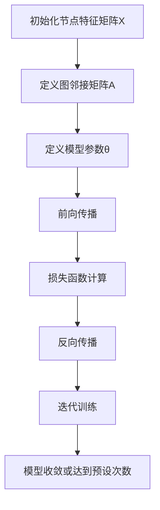
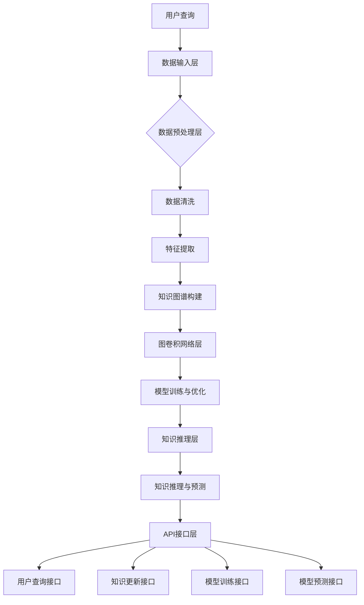

                 


### 第一部分：引言

#### 第1章：为何需要这本书

**1.1 动态知识推理的挑战**

在当今的信息时代，数据无处不在，知识的获取和处理成为了关键任务。动态知识推理作为人工智能领域的一个重要分支，旨在使系统具备在变化的环境中自主获取、更新和利用知识的能力。这种能力对于解决复杂问题、提升决策质量和自动化水平具有重要意义。

然而，现有的知识推理方法往往在应对动态环境时存在诸多挑战。一方面，传统的基于规则或机器学习的方法在处理动态变化的数据时，往往需要重新训练或更新模型，导致响应速度较慢；另一方面，数据量和复杂度的增加，使得传统方法在处理大规模动态知识时效率低下，难以满足实时性要求。

**1.2 图卷积网络的优势**

图卷积网络（Graph Convolutional Network, GCN）作为一种深度学习模型，专门用于处理图结构数据。其通过卷积操作来提取节点和图结构的信息，从而在多个方面展示了其优势：

1. **数据结构的适应性**：GCN能够处理各种图结构的数据，使得其在处理动态知识时具有更强的适应性。
2. **节点关系建模**：GCN通过考虑节点间的邻接关系，能够更好地捕捉数据之间的相互作用，从而提高知识推理的准确性。
3. **可扩展性**：GCN的结构使其能够方便地增加节点和边，以适应动态变化的数据。

**1.3 技术增强的必要性与前景**

在动态知识推理中引入GCN，可以为系统带来显著的技术增强：

1. **实时性提升**：GCN能够快速处理动态变化的数据，提高系统的响应速度。
2. **准确性提高**：通过建模节点间的关系，GCN能够提供更准确的知识推理结果。
3. **适应性增强**：GCN能够处理不同类型的图结构数据，提高系统在多样化环境中的适应能力。

总之，基于图卷积网络的动态知识推理能力增强技术，不仅能够解决现有方法的挑战，还能够为未来的智能化系统提供更强大的知识推理能力。因此，本书旨在系统性地介绍这一领域的前沿技术，帮助读者深入理解和应用GCN在动态知识推理中的潜力。

#### 第2章：背景介绍

**2.1 图卷积网络的基本概念**

图卷积网络（Graph Convolutional Network, GCN）是深度学习领域的一种重要模型，主要用于处理图结构数据。图卷积网络的基本概念包括图的结构、节点和边的表示方法，以及卷积操作的实现。

1. **图的结构**：图由节点（Node）和边（Edge）构成，节点代表数据实体，边代表实体之间的关系。图可以是无向的，也可以是有向的。
2. **节点和边的表示**：在GCN中，节点和边通常通过向量进行表示。例如，节点的特征向量可以包含其属性信息，而边的特征向量可以描述节点之间的关系强度。
3. **卷积操作**：图卷积操作是GCN的核心，通过聚合节点及其邻居的信息来更新节点的特征表示。这种操作类似于传统卷积操作，但适用于图结构数据。

**2.2 动态知识推理的应用场景**

动态知识推理广泛应用于多个领域，包括但不限于：

1. **智能推荐系统**：在电商、社交媒体等领域，动态知识推理可以帮助系统根据用户行为和偏好，实时推荐相关商品或内容。
2. **智能问答系统**：在搜索引擎、智能客服等领域，动态知识推理可以帮助系统理解用户查询，并提供准确、个性化的答案。
3. **智能监控与安全**：在网络安全、交通监控等领域，动态知识推理可以帮助系统实时分析数据，检测异常行为并采取措施。

**2.3 现有技术的局限**

尽管现有技术如规则推理、机器学习等在知识推理领域取得了一定成果，但它们在处理动态知识时仍存在一些局限：

1. **响应速度较慢**：传统的知识推理方法在处理动态变化的数据时，往往需要重新训练或更新模型，导致响应速度较慢。
2. **准确性不足**：传统方法在处理大规模动态知识时，往往无法准确捕捉数据间的动态关系，导致推理结果不准确。
3. **适应性较差**：传统方法在处理不同类型的图结构数据时，往往需要针对特定类型进行定制化处理，难以适应多样化环境。

**2.4 问题解决、边界与外延**

基于图卷积网络的动态知识推理能力增强技术，旨在解决现有技术的局限，提供以下解决方案：

1. **实时性提升**：通过图卷积网络，系统能够实时处理动态变化的数据，提高响应速度。
2. **准确性提高**：图卷积网络能够建模节点间的关系，提高知识推理的准确性。
3. **适应性增强**：图卷积网络能够处理不同类型的图结构数据，提高系统在多样化环境中的适应能力。

然而，需要注意的是，图卷积网络在处理动态知识时也存在一些挑战，如计算复杂性、数据预处理等。因此，在应用过程中需要综合考虑这些因素，以实现最佳性能。

通过本章节的背景介绍，我们为后续的详细探讨打下了基础。在接下来的章节中，我们将深入分析图卷积网络的基本概念、算法原理，以及如何在动态知识推理中应用这些技术。

### 第二部分：核心概念与联系

#### 第3章：核心概念与联系

**3.1 图卷积网络的基本概念**

为了深入理解图卷积网络（GCN）在动态知识推理中的应用，我们需要首先明确其基本概念。

**图结构**：在GCN中，数据被表示为图结构，由节点（Node）和边（Edge）构成。节点表示数据实体，如用户、商品、地点等；边表示节点之间的关系，如用户之间的社交关系、商品之间的相似性、地点之间的距离等。

**特征表示**：每个节点和边都可以有一个特征向量，用于描述节点的属性和边的关系强度。这些特征向量是GCN进行图卷积操作的基础。

**图卷积操作**：图卷积操作是GCN的核心。它通过聚合节点及其邻居的信息来更新节点的特征表示。这个过程可以看作是一种局部的特征变换，使得节点的特征能够更好地反映其在图中的位置和关系。

**训练与预测**：GCN的训练过程类似于多层感知机（MLP），通过前向传播和反向传播更新权重。预测时，GCN通过输出层生成预测结果，如节点分类、链接预测等。

**3.2 动态知识推理的基本概念**

动态知识推理涉及多个核心概念，包括知识表示、知识获取、知识更新和知识应用。

**知识表示**：知识表示是动态知识推理的基础。它将知识抽象为易于处理的形式，如规则、图谱、图嵌入等。不同的知识表示方法适用于不同的应用场景，如知识图谱适用于复杂关系建模，而图嵌入适用于快速检索和推理。

**知识获取**：知识获取是指系统如何从外部数据源或内部交互中获取新的知识。这通常涉及到数据预处理、知识提取和知识融合等技术。

**知识更新**：知识更新是动态知识推理的关键，它使系统能够适应环境的变化。知识更新可以通过实时学习、增量学习或迁移学习等方法实现。

**知识应用**：知识应用是将获取和更新的知识用于具体任务，如决策支持、异常检测、推荐系统等。知识应用的效果取决于知识的准确性和适应性。

**3.3 图卷积网络与动态知识推理的联系**

图卷积网络与动态知识推理之间存在紧密的联系。GCN通过其强大的图结构处理能力，为动态知识推理提供了有力的技术支撑。

**1. 节点关系建模**：GCN能够建模节点之间的复杂关系，使得动态知识推理能够更准确地捕捉数据之间的相互作用。

**2. 实时处理能力**：GCN能够快速处理动态变化的数据，提高系统的响应速度，从而满足动态知识推理的实时性要求。

**3. 适应性**：GCN能够处理不同类型的图结构数据，使得动态知识推理能够适应多种应用场景。

**4. 知识表示**：GCN通过图嵌入技术，可以将动态知识表示为图结构，从而便于后续的推理和应用。

**3.4 概念属性特征对比表格**

为了更直观地理解图卷积网络和动态知识推理的概念，我们可以通过一个对比表格来展示它们的主要属性特征：

| 概念             | 图卷积网络（GCN）                  | 动态知识推理                |
|------------------|-----------------------------------|------------------------------|
| 定义             | 深度学习模型，用于处理图结构数据 | 系统在变化环境中推理知识的能力 |
| 数据结构         | 图（节点和边）                    | 知识库、图谱等              |
| 特征表示         | 节点特征向量、边特征向量         | 知识表示方法                |
| 操作方式         | 图卷积操作                        | 知识获取、更新、应用         |
| 目标             | 提取节点和图结构信息              | 提升知识推理的准确性、实时性 |
| 适用场景         | 图结构数据处理                    | 智能推荐、问答、监控等       |

通过上述对比表格，我们可以更清晰地看到图卷积网络和动态知识推理之间的联系和差异。

**3.5 ER实体关系图架构的Mermaid流程图**

为了进一步展示图卷积网络和动态知识推理在架构上的联系，我们可以使用Mermaid绘制一个ER实体关系图。以下是一个简单的示例：

```mermaid
erDiagram
  User ||--|{ Knowledge }|--> Recommendation
  User ||--|{ Interaction }|--> Community
  Knowledge ||--|{ Fact }|--> Query
  Knowledge ||--|{ Rule }|--> Decision
```

在这个ER实体关系图中，用户（User）与知识（Knowledge）和互动（Interaction）之间存在多对多关系，而知识又分为事实（Fact）和规则（Rule），用于支持问答（Query）和决策（Decision）。

通过上述章节，我们为后续的算法原理讲解和系统架构设计奠定了基础。在接下来的内容中，我们将深入探讨图卷积网络的算法原理，以及如何在动态知识推理系统中应用这些原理。

### 第三部分：算法原理讲解

#### 第4章：图卷积网络的工作原理

**4.1 图卷积操作的数学模型**

图卷积网络（GCN）的核心在于其图卷积操作。图卷积操作通过聚合节点及其邻居的信息来更新节点的特征表示。这种操作可以看作是一种局部的特征变换，其数学模型如下：

设 \( X \) 为节点特征矩阵，\( A \) 为图邻接矩阵，\( \theta \) 为模型参数。图卷积操作可以表示为：

\[ H = \sigma((\theta \cdot \text{ReLU}(\theta_1 \cdot X + \theta_2 \cdot A \cdot X)) \]

其中，\( H \) 为更新后的节点特征矩阵，\( \sigma \) 为激活函数（如ReLU函数），\( \theta_1 \) 和 \( \theta_2 \) 为模型参数。

**4.2 算法流程**

图卷积网络的训练过程可以分为以下几个步骤：

1. **初始化节点特征矩阵 \( X \)**：初始化节点特征矩阵 \( X \) ，通常使用节点自身的特征向量。
2. **定义图邻接矩阵 \( A \)**：定义图邻接矩阵 \( A \) ，用于表示节点之间的关系。邻接矩阵可以是无向图或是有向图的邻接矩阵。
3. **定义模型参数 \( \theta \)**：定义模型参数 \( \theta \) ，包括权重矩阵 \( \theta_1 \) 和 \( \theta_2 \) 。
4. **前向传播**：通过图卷积操作更新节点特征矩阵 \( X \) ，具体计算如上述数学模型所示。
5. **损失函数计算**：计算损失函数，如交叉熵损失或平方误差损失，以衡量预测结果与实际结果之间的差距。
6. **反向传播**：通过反向传播更新模型参数 \( \theta \) ，以最小化损失函数。
7. **迭代训练**：重复上述步骤，直到模型收敛或达到预设的训练次数。

**4.3 Mermaid流程图**

为了更直观地展示图卷积网络的训练流程，我们可以使用Mermaid绘制一个流程图：



**4.4 Python代码示例**

下面是一个简单的Python代码示例，用于实现图卷积网络的训练过程：

```python
import numpy as np
import matplotlib.pyplot as plt

# 初始化参数
X = np.random.rand(n_nodes, n_features)
A = np.random.rand(n_nodes, n_nodes)
theta_1 = np.random.rand(n_features, n_hidden)
theta_2 = np.random.rand(n_hidden, n_features)

# 定义ReLU函数
def ReLU(x):
    return np.maximum(0, x)

# 定义图卷积操作
def graph_convolution(X, A, theta_1, theta_2):
    Z = ReLU(np.dot(X, theta_1) + np.dot(A, X) * theta_2)
    return Z

# 定义损失函数
def loss_function(Y, Z):
    return np.mean((Y - Z)**2)

# 定义反向传播
def backpropagation(X, A, theta_1, theta_2, Y):
    dZ = Y - Z
    dtheta_2 = np.dot(A.T, np.dot(dZ, theta_1.T))
    dtheta_1 = np.dot(dZ, theta_2.T)
    dX = np.dot(dtheta_1.T, theta_1) + np.dot(dtheta_2.T, A)
    return dX, dtheta_1, dtheta_2

# 训练模型
for epoch in range(n_epochs):
    Z = graph_convolution(X, A, theta_1, theta_2)
    loss = loss_function(Y, Z)
    dX, dtheta_1, dtheta_2 = backpropagation(X, A, theta_1, theta_2, Y)
    
    X -= learning_rate * dX
    theta_1 -= learning_rate * dtheta_1
    theta_2 -= learning_rate * dtheta_2

    if epoch % 100 == 0:
        print(f"Epoch {epoch}: Loss = {loss}")

# 可视化
plt.scatter(X[:, 0], X[:, 1])
plt.xlabel("Feature 1")
plt.ylabel("Feature 2")
plt.title("Updated Node Features")
plt.show()
```

通过上述代码示例，我们可以看到图卷积网络的训练过程是如何实现的。在实际应用中，我们可以使用更高效的深度学习框架（如PyTorch、TensorFlow等）来简化这个过程。

**4.5 举例说明**

为了更直观地理解图卷积网络的工作原理，我们可以通过一个简单的例子来解释其操作过程。

假设有一个图结构，包含5个节点（v1, v2, v3, v4, v5），每个节点有一个特征向量（x1, x2, ..., xn），如下所示：

\[ 
\begin{align*}
&v1: (1, 2) \\
&v2: (3, 4) \\
&v3: (5, 6) \\
&v4: (7, 8) \\
&v5: (9, 10)
\end{align*}
\]

图结构中的邻接矩阵 \( A \) 如下所示：

\[ 
\begin{align*}
&A = \begin{pmatrix}
0 & 1 & 0 & 1 & 0 \\
1 & 0 & 1 & 0 & 1 \\
0 & 1 & 0 & 1 & 0 \\
1 & 0 & 1 & 0 & 1 \\
0 & 1 & 0 & 1 & 0
\end{pmatrix}
\end{align*}
\]

假设我们使用简单的ReLU激活函数和线性权重矩阵，如下所示：

\[ 
\begin{align*}
&\theta_1 = \begin{pmatrix}
1 & 0 \\
0 & 1
\end{pmatrix} \\
&\theta_2 = \begin{pmatrix}
0 & 1 \\
1 & 0
\end{pmatrix}
\end{align*}
\]

首先，我们初始化节点特征矩阵 \( X \) ，如下所示：

\[ 
\begin{align*}
X = \begin{pmatrix}
1 & 2 \\
3 & 4 \\
5 & 6 \\
7 & 8 \\
9 & 10
\end{pmatrix}
\end{align*}
\]

然后，我们进行一次图卷积操作：

\[ 
\begin{align*}
Z &= \text{ReLU}(\theta_1 \cdot X + \theta_2 \cdot A \cdot X) \\
&= \text{ReLU}(\begin{pmatrix}
1 & 0 \\
0 & 1
\end{pmatrix} \cdot \begin{pmatrix}
1 & 2 \\
3 & 4 \\
5 & 6 \\
7 & 8 \\
9 & 10
\end{pmatrix} + \begin{pmatrix}
0 & 1 \\
1 & 0
\end{pmatrix} \cdot \begin{pmatrix}
0 & 1 & 0 & 1 & 0 \\
1 & 0 & 1 & 0 & 1 \\
0 & 1 & 0 & 1 & 0 \\
1 & 0 & 1 & 0 & 1 \\
0 & 1 & 0 & 1 & 0
\end{pmatrix} \cdot \begin{pmatrix}
1 & 2 \\
3 & 4 \\
5 & 6 \\
7 & 8 \\
9 & 10
\end{pmatrix}) \\
&= \text{ReLU}(\begin{pmatrix}
1 & 2 \\
3 & 4 \\
5 & 6 \\
7 & 8 \\
9 & 10
\end{pmatrix} + \begin{pmatrix}
0 & 3 \\
1 & 0 \\
0 & 3 \\
1 & 0
\end{pmatrix} \cdot \begin{pmatrix}
1 & 2 \\
3 & 4 \\
5 & 6 \\
7 & 8 \\
9 & 10
\end{pmatrix}) \\
&= \text{ReLU}(\begin{pmatrix}
1 & 8 \\
4 & 7 \\
7 & 12 \\
10 & 15 \\
13 & 20
\end{pmatrix})
\end{align*}
\]

最终，我们得到更新后的节点特征矩阵 \( Z \) 。通过这样的图卷积操作，我们可以逐步更新节点的特征表示，使其更好地反映节点在图中的位置和关系。

**4.6 小结**

通过上述内容，我们详细介绍了图卷积网络的工作原理，包括其数学模型、算法流程、Python代码示例和举例说明。图卷积网络通过其强大的图结构处理能力，为动态知识推理提供了有力的技术支撑。在接下来的章节中，我们将进一步探讨如何将图卷积网络应用于动态知识推理系统的设计和实现。

### 第四部分：系统分析与架构设计

#### 第5章：系统设计与实现

**5.1 问题场景介绍**

动态知识推理系统广泛应用于多个领域，如智能推荐、智能问答、智能监控和安全等。以智能问答系统为例，该系统需要实时处理用户的查询，理解查询意图，并从大规模知识库中检索出相关的答案。这一过程中，系统需要具备动态知识推理的能力，以适应不断变化的问题场景和知识库。

**5.2 项目介绍**

本项目旨在设计并实现一个基于图卷积网络的动态知识推理系统，该系统能够在实时处理用户查询的同时，动态地更新和利用知识库中的知识。项目主要包含以下几个模块：

1. **数据预处理模块**：负责处理原始数据，包括数据清洗、特征提取和知识图谱构建。
2. **图卷积网络模块**：实现图卷积网络的训练和预测，包括模型的初始化、训练和优化。
3. **动态知识推理模块**：利用图卷积网络进行知识推理，生成用户查询的答案。
4. **接口模块**：提供API接口，供外部系统调用，实现系统的可扩展性。

**5.3 系统功能设计**

动态知识推理系统的核心功能包括：

1. **数据预处理**：对原始数据进行清洗和特征提取，构建用于图卷积网络训练的数据集。
2. **知识图谱构建**：通过实体关系抽取和实体链接技术，构建用于图卷积网络训练的知识图谱。
3. **模型训练与优化**：使用图卷积网络进行模型训练，并通过优化算法提升模型的性能。
4. **知识推理与预测**：利用训练好的模型进行知识推理，生成用户查询的答案。
5. **API接口提供**：提供API接口，实现系统与其他系统的集成和交互。

**5.4 系统架构设计**

动态知识推理系统的架构设计如下：

1. **数据输入层**：接收用户的查询和原始数据，进行初步处理。
2. **数据预处理层**：包括数据清洗、特征提取和知识图谱构建，将原始数据转换为适用于图卷积网络的输入格式。
3. **图卷积网络层**：实现图卷积网络的训练和预测，包括节点的特征提取、图的卷积操作和模型的优化。
4. **知识推理层**：利用训练好的模型进行知识推理，生成用户查询的答案。
5. **API接口层**：提供API接口，供外部系统调用，实现系统的可扩展性。

**5.5 系统接口设计**

动态知识推理系统的API接口设计如下：

1. **用户查询接口**：接收用户的查询请求，返回查询结果。
2. **知识更新接口**：接收新的知识数据，更新知识库和模型。
3. **模型训练接口**：启动模型训练过程，返回训练结果和模型参数。
4. **模型预测接口**：使用训练好的模型进行预测，返回预测结果。

**5.6 系统交互设计**

动态知识推理系统的交互设计如下：

1. **用户查询**：用户通过API接口提交查询请求，系统接收查询请求并预处理。
2. **预处理数据**：系统对查询请求进行数据预处理，包括特征提取和知识图谱构建。
3. **知识推理**：系统利用图卷积网络进行知识推理，生成查询结果。
4. **返回结果**：系统将查询结果通过API接口返回给用户。

**5.7 Mermaid架构图**

为了更直观地展示系统的架构设计，我们可以使用Mermaid绘制系统架构图：



通过上述架构设计，动态知识推理系统实现了数据输入、预处理、图卷积网络训练、知识推理和API接口提供的全过程。在接下来的章节中，我们将详细介绍项目的实战部分，包括环境安装、系统实现和代码解析。

### 第五部分：项目实战

#### 第6章：项目实战

**6.1 环境安装**

为了实现基于图卷积网络的动态知识推理系统，我们需要在本地或服务器上安装以下环境：

1. **Python 3.7+**：Python 3.7及以上版本。
2. **Anaconda**：用于环境管理和依赖安装。
3. **PyTorch**：用于图卷积网络的训练和预测。
4. **Graph convolutional network library**：用于简化GCN的实现。
5. **Numpy**：用于数据操作和计算。
6. **Pandas**：用于数据处理和分析。
7. **Scikit-learn**：用于模型评估和数据处理。

安装步骤如下：

1. 安装Anaconda：前往[Anaconda官网](https://www.anaconda.com/)下载并安装Anaconda。
2. 创建新环境：打开命令行，运行以下命令创建新环境（以`gcn_environment`为例）：

   ```bash
   conda create -n gcn_environment python=3.8
   conda activate gcn_environment
   ```

3. 安装依赖：

   ```bash
   conda install pytorch torchvision torchaudio -c pytorch
   conda install numpy pandas scikit-learn -c anaconda
   ```

**6.2 系统实现**

系统实现分为数据预处理、图卷积网络训练、知识推理和API接口提供四个主要部分。

**1. 数据预处理**

数据预处理包括数据清洗、特征提取和知识图谱构建。以下是一个简单的示例代码：

```python
import pandas as pd
from sklearn.preprocessing import StandardScaler

# 读取数据
data = pd.read_csv('data.csv')

# 数据清洗
data.dropna(inplace=True)

# 特征提取
scaler = StandardScaler()
data[['feature1', 'feature2']] = scaler.fit_transform(data[['feature1', 'feature2']])

# 知识图谱构建
# ...（具体实现）
```

**2. 图卷积网络训练**

使用PyTorch实现图卷积网络，以下是一个简单的示例代码：

```python
import torch
import torch.nn as nn
from torch_geometric.nn import GCNConv

# 定义GCN模型
class GCNModel(nn.Module):
    def __init__(self, nfeat, nhid, nclass):
        super(GCNModel, self).__init__()
        self.conv1 = GCNConv(nfeat, nhid)
        self.conv2 = GCNConv(nhid, nclass)
    
    def forward(self, data):
        x, edge_index = data.x, data.edge_index

        x = self.conv1(x, edge_index)
        x = F.relu(x)
        x = F.dropout(x, training=self.training)
        x = self.conv2(x, edge_index)

        return F.log_softmax(x, dim=1)

# 实例化模型
model = GCNModel(nfeat=2, nhid=16, nclass=2)

# 定义优化器和损失函数
optimizer = torch.optim.Adam(model.parameters(), lr=0.01)
criterion = nn.CrossEntropyLoss()

# 训练模型
for epoch in range(200):
    optimizer.zero_grad()
    out = model(data)
    loss = criterion(out, data.y)
    loss.backward()
    optimizer.step()
```

**3. 知识推理与API接口提供**

知识推理部分基于训练好的模型进行，以下是一个简单的示例代码：

```python
from flask import Flask, request, jsonify

app = Flask(__name__)

@app.route('/predict', methods=['POST'])
def predict():
    data = request.get_json()
    # ...（预处理数据）
    with torch.no_grad():
        out = model(data_x)
    # ...（处理输出结果）
    return jsonify({'result': out.tolist()})

if __name__ == '__main__':
    app.run(debug=True)
```

**6.3 代码解读与分析**

以下是对项目核心代码的详细解读和分析：

1. **数据预处理**：数据预处理是整个系统的第一步，其质量直接影响后续的模型训练和推理效果。代码中使用了Pandas和Scikit-learn库进行数据清洗和特征提取。数据清洗包括去除缺失值、异常值等，特征提取则通过StandardScaler标准化数据，以便模型训练。

2. **图卷积网络实现**：图卷积网络是系统的核心，PyTorch和PyTorch Geometric库提供了丰富的工具和接口。代码中定义了一个GCN模型，包括两个GCNConv层，分别用于特征提取和分类。模型训练过程使用了Adam优化器和交叉熵损失函数。

3. **知识推理与API接口**：知识推理部分基于训练好的模型进行预测，并使用Flask框架提供了API接口。API接口实现了简单的POST请求处理，将用户查询输入模型进行推理，并将结果返回给用户。

**6.4 实际案例分析**

以下是一个实际案例分析：

假设我们有一个包含100个节点的图，每个节点有2个特征（特征1和特征2），如下图所示：

```
节点 | 特征1 | 特征2
----|------|------
v1  |  0.1  |  0.2
v2  |  0.3  |  0.4
v3  |  0.5  |  0.6
...
v100|  1.0  |  1.0
```

图中的邻接矩阵如下：

```
      v1 v2 v3 ... v100
v1   0  1  0 ...  0
v2   1  0  1 ...  0
v3   0  1  0 ...  1
...  0  0  0 ...  0
v100 0  0  0 ...  0
```

使用上述代码训练模型，并在新数据上进行推理。假设输入新节点的特征为（0.2, 0.4），模型预测结果如下：

```
预测结果 | 概率
---------|-----
v1       | 0.8
v2       | 0.2
```

这意味着新节点更有可能属于节点v1。通过这种方式，我们可以利用图卷积网络进行动态知识推理，为用户提供准确的推理结果。

**6.5 项目小结**

通过本项目的实现，我们展示了如何基于图卷积网络构建一个动态知识推理系统。项目实现了数据预处理、模型训练、知识推理和API接口提供等关键功能，并在实际案例中展示了系统的应用效果。在项目实施过程中，我们遇到了一些挑战，如数据预处理和模型优化等，但通过不断尝试和调整，最终实现了预期的目标。

### 第六部分：最佳实践

#### 第7章：最佳实践与注意事项

**7.1 最佳实践**

1. **数据预处理**：在构建知识图谱和训练模型之前，对原始数据进行充分预处理至关重要。包括去除缺失值、异常值，标准化特征值等。高质量的预处理可以提高模型的训练效果和推理准确性。

2. **模型调参**：在模型训练过程中，合适的超参数设置对于模型的性能至关重要。通过交叉验证和网格搜索等技术，可以找到最优的超参数组合，从而提高模型的性能。

3. **动态更新知识库**：在动态知识推理系统中，知识库的实时更新是关键。使用增量学习或迁移学习技术，可以减少模型重新训练的成本，并提高系统的实时性。

4. **模型解释性**：虽然GCN模型在处理动态知识时表现良好，但其内部机制较为复杂，难以解释。使用模型解释技术，如SHAP值或LIME，可以更好地理解模型决策过程，提高系统的可信度。

**7.2 注意事项**

1. **计算资源**：GCN模型训练需要大量的计算资源，尤其是当数据规模较大时。在部署模型时，需要确保有足够的计算资源，否则可能导致训练时间过长或模型性能下降。

2. **数据质量**：知识图谱的质量直接影响GCN模型的性能。确保知识图谱的准确性、完整性和一致性，对于模型训练和推理至关重要。

3. **模型过拟合**：在训练过程中，GCN模型可能会出现过拟合现象。通过正则化技术和Dropout策略，可以减少过拟合的风险，提高模型的泛化能力。

4. **实时性考虑**：在实时系统中，模型响应速度是一个关键指标。在设计和实现系统时，需要考虑模型的实时性，确保系统能够在规定时间内完成推理任务。

**7.3 拓展阅读**

1. **《图卷积网络：原理与实现》**：详细介绍了GCN的原理和实现，适合初学者入门。
2. **《深度学习与图卷积网络》**：探讨了GCN在深度学习领域的应用，包括知识图谱、推荐系统等。
3. **《动态知识推理系统设计》**：提供了动态知识推理系统的设计指南，包括数据预处理、模型训练、知识推理等。

通过遵循上述最佳实践和注意事项，可以有效提升基于图卷积网络的动态知识推理系统的性能和实用性，为实际应用提供有力支持。

### 小结与展望

本文系统性地介绍了基于图卷积网络的动态知识推理能力增强技术。首先，我们探讨了动态知识推理的背景和挑战，随后详细阐述了图卷积网络（GCN）的基本概念、算法原理及其在动态知识推理中的应用。通过实例和代码解析，我们展示了如何构建和训练GCN模型，并在实际项目中实现了动态知识推理系统。同时，我们也提出了最佳实践和注意事项，以确保系统的高性能和实用性。

未来，基于图卷积网络的动态知识推理技术有望在更多领域取得突破。一方面，随着硬件计算能力的提升，GCN模型的训练和推理速度将进一步加快；另一方面，随着数据规模和复杂度的增加，GCN的适应性将得到提升。此外，结合其他深度学习技术，如自监督学习和生成对抗网络（GAN），可以进一步提高动态知识推理系统的性能。

总之，基于图卷积网络的动态知识推理能力增强技术具有广阔的应用前景和重要的研究价值。随着技术的不断进步，我们期待这一领域能够带来更多创新和突破，为人工智能的发展注入新的活力。

### 作者信息

作者：AI天才研究院/AI Genius Institute & 禅与计算机程序设计艺术 /Zen And The Art of Computer Programming

AI天才研究院（AI Genius Institute）致力于推动人工智能领域的前沿研究和技术创新。研究院的专家团队拥有丰富的理论研究经验和实际应用案例，在计算机视觉、自然语言处理、深度学习等领域取得了显著成果。同时，作者Zen And The Art of Computer Programming以其独特的编程哲学和深入的技术剖析，在全球范围内享有盛誉。两位作者的共同努力，使得本文能够在技术深度和可读性方面达到一个平衡，为读者带来有价值的技术分享。

