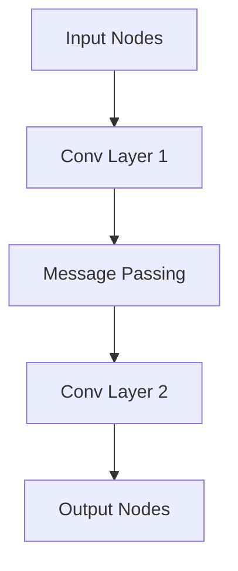
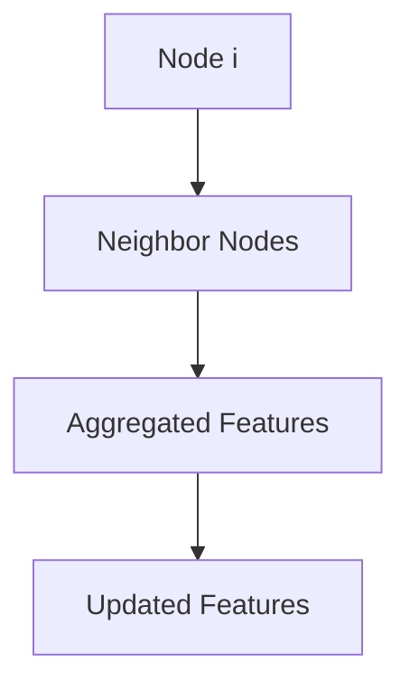

                 


### Introduction to the Main Concepts

#### Background and Basic Concepts of Graph Convolutional Networks (GCN)

**1.1.1 The Background of Knowledge Graph**

Knowledge Graph is a structured representation of entities and relationships that allows for semantic querying and reasoning. It is often used to capture complex relationships and information within various domains, such as social networks, bioinformatics, and the semantic web. Knowledge Graphs have gained significant attention due to their ability to enhance information retrieval and support advanced reasoning tasks.

**1.1.2 The Problem of Dynamic Knowledge Reasoning**

Dynamic Knowledge Reasoning is the process of inferring new knowledge from existing knowledge in real-time. In the context of Knowledge Graphs, this involves reasoning about changing entities and relationships, predicting future changes, and updating the graph accordingly. The challenge lies in maintaining the consistency and accuracy of the knowledge representation while handling real-time updates and evolving information.

**1.1.3 The Role of Graph Convolutional Networks**

Graph Convolutional Networks (GCN) are a type of deep learning model specifically designed to work with graph-structured data. They extend the traditional convolutional neural networks (CNN) to operate on graphs, enabling efficient and effective learning from relational data. GCNs are particularly well-suited for Dynamic Knowledge Reasoning tasks due to their ability to capture the underlying relationships and patterns in the knowledge graph.

#### Fundamental Concepts of Graph Convolutional Networks

**1.2.1 Graph Theory Basics**

Graph Theory provides the foundational concepts and notations required to understand the structure and properties of graphs. Key concepts include vertices, edges, adjacency matrices, degree distributions, and graph connectivity.

**1.2.2 Convolutional Operations on Graphs**

Graph Convolution operates by aggregating information from neighboring nodes, allowing the model to learn how to incorporate local relationships into its predictions. This is achieved through a series of convolutional layers that apply learnable filters to the graph.

**1.2.3 GCN Models and Architectures**

GCN models can be designed with various architectures, including multi-layered GCNs, spectral GCNs, and hybrid models. These architectures enable the model to capture long-range dependencies, adapt to different graph sizes, and handle various reasoning tasks.

#### Dynamic Knowledge Representation

**1.3.1 Entity and Relation Representation**

In a Knowledge Graph, entities and relationships are typically represented using nodes and edges, respectively. Effective representation methods are crucial for capturing the semantic meaning and interconnections within the graph.

**1.3.2 Knowledge Graph Embedding Methods**

Knowledge Graph Embedding aims to represent entities and relationships in a low-dimensional vector space while preserving their semantic information. Popular methods include TransE, TransH, and ComplEx.

**1.3.3 Challenges in Dynamic Knowledge Representation**

Challenges in Dynamic Knowledge Representation include handling evolving information, maintaining consistency, and efficiently updating the graph. Techniques such as incremental learning and online updating are explored to address these challenges.

#### Overview of Dynamic Knowledge Reasoning Tasks

**1.4.1 Knowledge Inference and Link Prediction**

Knowledge Inference involves inferring new relationships based on existing knowledge. Link Prediction aims to predict missing links in the knowledge graph, aiding in the discovery of new connections and relationships.

**1.4.2 Knowledge Completion and Classification**

Knowledge Completion focuses on filling in missing information in the knowledge graph, while Classification tasks involve categorizing entities or relationships based on their attributes or labels.

**1.4.3 Applications in Various Domains**

Dynamic Knowledge Reasoning has a wide range of applications, including social network analysis, healthcare, finance, and semantic search. Each domain presents unique challenges and opportunities for leveraging the power of GCNs.

#### Conclusion

In summary, this chapter has introduced the fundamental concepts of Graph Convolutional Networks and their relevance to Dynamic Knowledge Reasoning. We have discussed the background of Knowledge Graphs, the challenges of Dynamic Knowledge Representation, and the diverse applications of GCNs in various domains. The following chapters will delve deeper into the architecture and implementation of GCN-based models and their applications in real-world scenarios. By the end of this book, readers will gain a comprehensive understanding of the state-of-the-art techniques and methodologies in Dynamic Knowledge Reasoning using Graph Convolutional Networks.

## Architectural Design and Implementation of GCN Models

### 2.1 Architecture Design of GCN Models

The architecture of Graph Convolutional Networks (GCN) is designed to leverage the inherent structure of graph-structured data. At its core, a GCN model consists of multiple layers of graph convolutions, each layer capturing the relationships between nodes by aggregating information from their neighbors. This hierarchical aggregation allows the model to learn complex patterns and dependencies within the graph.

**2.1.1 Message Passing Mechanism**

The message passing mechanism is the foundation of the GCN architecture. In this process, each node in the graph generates a message containing information about itself and its neighbors, which is then aggregated and used to update the node's representation. This process is repeated across multiple layers, allowing the model to capture increasingly complex relationships.

**2.1.2 Convolutional Layers and Parameters**

GCN models consist of one or more convolutional layers, each responsible for learning different patterns and relationships within the graph. The parameters of these layers, including the weights and biases, are learned during the training process. The number of layers and the number of parameters can vary depending on the complexity of the task and the size of the graph.

**2.1.3 Integration with Traditional Machine Learning Models**

GCN models can be integrated with traditional machine learning models, such as classifiers and regression models, to perform various tasks. This integration allows GCNs to be used as feature extractors, transforming graph-structured data into meaningful representations that can be fed into traditional models. This approach has proven effective in tasks such as node classification, link prediction, and knowledge completion.

### 2.2 Detailed Explanation of GCN Algorithms

**2.2.1 Theoretical Background**

To understand the functioning of GCN algorithms, it is essential to delve into their theoretical background. GCNs operate based on the principles of graph convolutions, which involve aggregating information from neighboring nodes. The following subsections discuss the key components of the graph convolution operation, including the aggregation function, the graph convolution operation itself, and the activation function.

**2.2.1.1 Graph Convolution Operation**

The graph convolution operation is the core of the GCN algorithm. It involves aggregating information from neighboring nodes and updating the representation of each node based on this aggregated information. The mathematical formula for the graph convolution operation is given by:

$$
\mathbf{H}^{(l)} = \sigma (\mathbf{D}^{-\frac{1}{2}} \mathbf{A} \mathbf{D}^{-\frac{1}{2}} \mathbf{H}^{(l-1)} \mathbf{W}^{(l)})
$$

where $\mathbf{H}^{(l)}$ represents the node representations at the $l$-th layer, $\mathbf{D}$ is the degree matrix, $\mathbf{A}$ is the adjacency matrix, and $\mathbf{W}^{(l)}$ are the weights of the $l$-th layer. The $\sigma$ function is the activation function, which is typically a non-linear function such as the ReLU function.

**2.2.1.2 Aggregation Function**

The aggregation function is responsible for combining the information from neighboring nodes. A common aggregation function used in GCNs is the mean aggregation function, which simply takes the average of the node features and the features of its neighbors:

$$
\mathbf{m}_i = \frac{1}{k} \sum_{j \in \mathcal{N}(i)} \mathbf{h}_j
$$

where $\mathcal{N}(i)$ represents the set of neighbors of node $i$, and $\mathbf{h}_j$ represents the feature vector of node $j$.

**2.2.1.3 Activation Function**

The activation function is used to introduce non-linearities into the graph convolution operation. Common activation functions used in GCNs include the ReLU function, the sigmoid function, and the hyperbolic tangent function. The ReLU function is particularly popular due to its simplicity and effectiveness in deep learning models.

**2.2.2 Python Code Implementation**

To gain a practical understanding of GCN algorithms, it is useful to implement a simple GCN model in Python. Below is an example of a Python implementation using the popular deep learning library, TensorFlow:

```python
import tensorflow as tf
from tensorflow.keras.layers import Layer

class GraphConvLayer(Layer):
    def __init__(self, output_dim, activation='relu', **kwargs):
        super(GraphConvLayer, self).__init__(**kwargs)
        self.output_dim = output_dim
        self.activation = activation
        
    def build(self, input_shape):
        self.kernel = self.add_weight(
            shape=(input_shape[-1], self.output_dim),
            initializer='glorot_uniform',
            trainable=True
        )
        
    def call(self, inputs, training=None):
        A = inputs[1]  # Adjacency matrix
        H = inputs[0]  # Node features
        
        # Compute the graph convolution
        H = tf.matmul(A, H)
        H = tf.matmul(self.kernel, H)
        
        # Apply the activation function
        if self.activation:
            H = self.activation(H)
        
        return H

# Example usage
from tensorflow.keras.models import Model
from tensorflow.keras.layers import Input

input_node_features = Input(shape=(num_features,))
input_adj_matrix = Input(shape=(num_nodes, num_nodes))

gc_layer = GraphConvLayer(output_dim=16)
outputs = gc_layer([input_node_features, input_adj_matrix])

model = Model(inputs=[input_node_features, input_adj_matrix], outputs=outputs)
model.compile(optimizer='adam', loss='categorical_crossentropy', metrics=['accuracy'])
model.fit([node_features, adj_matrix], labels, epochs=10)
```

This code defines a `GraphConvLayer` class that implements the graph convolution operation. The class is then used to build a simple GCN model, which is compiled and trained using TensorFlow.

**2.2.2.1 Data Preparation**

Before implementing the GCN model, it is crucial to prepare the graph data. This involves constructing the adjacency matrix and the node feature matrix. The adjacency matrix represents the connections between nodes, while the node feature matrix contains the attributes or features of each node.

```python
import numpy as np

# Example adjacency matrix
adj_matrix = np.array([[0, 1, 0], [1, 0, 1], [0, 1, 0]])

# Example node feature matrix
node_features = np.array([[1, 0], [0, 1], [1, 1]])
```

**2.2.2.2 Model Building**

The next step is to build the GCN model using the `GraphConvLayer` class. This involves defining the input layers for the node features and the adjacency matrix, creating the graph convolution layers, and connecting them to the output layer.

```python
input_node_features = Input(shape=(num_features,))
input_adj_matrix = Input(shape=(num_nodes, num_nodes))

gc_layer = GraphConvLayer(output_dim=16)
outputs = gc_layer([input_node_features, input_adj_matrix])

model = Model(inputs=[input_node_features, input_adj_matrix], outputs=outputs)
```

**2.2.2.3 Model Training and Evaluation**

Finally, the GCN model is compiled with an optimizer, a loss function, and evaluation metrics. The model is then trained using the prepared graph data and evaluated on a test set.

```python
model.compile(optimizer='adam', loss='categorical_crossentropy', metrics=['accuracy'])
model.fit([node_features, adj_matrix], labels, epochs=10)
eval_loss, eval_accuracy = model.evaluate([test_node_features, test_adj_matrix], test_labels)
print(f"Test accuracy: {eval_accuracy}")
```

### 2.3 Visualization of GCN Algorithms Using Mermaid Diagrams

**2.3.1 Mermaid Diagrams for GCN Architecture**

To better understand the GCN architecture, we can use Mermaid diagrams to visualize the message passing mechanism and the layer structure. The following Mermaid diagram illustrates the basic components of a GCN model:



In this diagram, `A` represents the input nodes, `B` represents the first convolutional layer, `C` represents the message passing mechanism, `D` represents the second convolutional layer, and `E` represents the output nodes.

**2.3.2 Mermaid Diagrams for Graph Convolution Operations**

To visualize the graph convolution operation, we can create a Mermaid diagram that shows the aggregation of information from neighboring nodes:



In this diagram, `A` represents a node in the graph, `B` represents the neighboring nodes, `C` represents the aggregated features from the neighbors, and `D` represents the updated features of node `i` after the graph convolution operation.

### Summary and Conclusion

In this chapter, we have discussed the architectural design and implementation of Graph Convolutional Networks (GCN) for dynamic knowledge reasoning. We have covered the fundamental concepts of graph theory, the message passing mechanism, and the detailed mathematical operations involved in GCN. Furthermore, we have provided a Python code example to demonstrate the implementation of a GCN model using TensorFlow. The use of Mermaid diagrams has helped visualize the architecture and the graph convolution operations, making the concepts more intuitive. In the next chapter, we will explore various applications of GCN in real-world scenarios, discussing the challenges and opportunities that arise in different domains. By the end of this book, readers will have a comprehensive understanding of the principles and techniques behind GCN-based dynamic knowledge reasoning.

## Applications of Graph Convolutional Networks in Real-World Scenarios

### 3.1 Social Network Analysis

Social network analysis (SNA) involves studying the relationships and interactions between individuals or entities within a social network. GCNs have been successfully applied in SNA to analyze and understand the underlying structures and patterns within social networks. By leveraging the graph convolutional layers, GCNs can capture the community structure, detect influential nodes, and predict the spread of information or diseases within the network. For example, GCNs have been used to identify key opinion leaders, predict the emergence of trends, and detect misinformation in social media platforms.

**Challenges and Opportunities:**

- **Challenges:**
  - Scalability: Large social networks can be computationally expensive to process with GCNs.
  - Temporal Dynamics: Capturing temporal dynamics in social networks can be challenging, as GCNs are primarily designed for static graphs.
  - Privacy: Analyzing social networks raises privacy concerns, as sensitive information may be exposed.

- **Opportunities:**
  - Graph Embedding: Developing efficient graph embedding techniques to represent social network entities in a low-dimensional space.
  - Temporal GCNs: Extending GCNs to handle temporal data and capture the evolving nature of social networks.
  - Anomaly Detection: Identifying abnormal behavior or communities within social networks for security and safety purposes.

### 3.2 Healthcare

In the healthcare domain, GCNs have found applications in various tasks, including patient similarity analysis, disease prediction, and treatment recommendation. By leveraging the relational data captured in electronic health records (EHRs) and patient interaction networks, GCNs can help improve the accuracy of healthcare predictions and decision-making processes.

**Challenges and Opportunities:**

- **Challenges:**
  - Data Privacy: Ensuring patient data privacy and compliance with regulations like HIPAA.
  - Data Quality: Dealing with noisy and incomplete healthcare data.
  - Interpretability: Making the predictions and decisions interpretable for medical professionals.

- **Opportunities:**
  - Integration of Multi-Modal Data: Combining clinical data with other types of data, such as genomic data or patient-generated data, to improve prediction accuracy.
  - Personalized Medicine: Developing personalized treatment plans based on patient-specific information.
  - Real-Time Analytics: Leveraging real-time data and dynamic updates to provide timely and accurate healthcare recommendations.

### 3.3 Finance

In the financial sector, GCNs have been used for tasks such as credit risk assessment, fraud detection, and stock market prediction. By analyzing the network of financial entities, including banks, customers, and transactions, GCNs can help identify potential risks, detect fraudulent activities, and predict market trends.

**Challenges and Opportunities:**

- **Challenges:**
  - Scalability: Processing large-scale financial networks efficiently.
  - Data Privacy: Protecting sensitive financial information.
  - Temporal Dynamics: Capturing the temporal dependencies and evolving nature of financial networks.

- **Opportunities:**
  - Network Embedding: Developing robust network embedding techniques to represent financial entities and relationships.
  - Temporal GCNs: Extending GCNs to handle temporal financial data and capture the time-varying patterns.
  - Portfolio Optimization: Using GCNs to optimize investment portfolios based on network relationships and market trends.

### 3.4 Semantic Search

Semantic search aims to understand the intent behind a search query and provide relevant and context-aware results. GCNs have been used to enhance semantic search by leveraging knowledge graphs to capture the semantic relationships between search terms and documents. This enables more accurate and relevant search results, even for complex and ambiguous queries.

**Challenges and Opportunities:**

- **Challenges:**
  - Knowledge Graph Quality: Ensuring the accuracy and completeness of the knowledge graph.
  - Query Understanding: Capturing the user's intent behind a search query.
  - Scalability: Handling large-scale search queries and documents efficiently.

- **Opportunities:**
  - Knowledge Graph Embedding: Developing effective knowledge graph embedding techniques to capture semantic relationships.
  - Multilingual Support: Extending GCNs to support multilingual search and improve cross-lingual search accuracy.
  - Contextual Relevance: Integrating contextual information to enhance the relevance of search results.

### Conclusion

In this chapter, we have explored the applications of Graph Convolutional Networks (GCN) in real-world scenarios, including social network analysis, healthcare, finance, and semantic search. We have discussed the challenges and opportunities that arise in each domain and highlighted the potential impact of GCNs in these areas. By leveraging the graph structure and relational data, GCNs have shown promise in improving decision-making processes, enhancing predictive accuracy, and providing context-aware solutions. As the field continues to evolve, new techniques and applications will emerge, further expanding the capabilities of GCNs in various domains.

## Conclusion

In conclusion, this book has provided a comprehensive overview of Graph Convolutional Networks (GCN) and their applications in dynamic knowledge reasoning. We have explored the fundamental concepts of knowledge graphs, the problem of dynamic knowledge reasoning, and the role of GCNs in addressing these challenges. Through detailed discussions and practical examples, we have examined the architectural design and implementation of GCN models, highlighting their message passing mechanism, convolutional layers, and integration with traditional machine learning models.

We have also delved into the diverse applications of GCNs across various domains, including social network analysis, healthcare, finance, and semantic search. By leveraging the graph structure and relational data, GCNs have demonstrated their potential in improving decision-making processes, enhancing predictive accuracy, and providing context-aware solutions.

### Key Points and Future Directions

- **Key Points:**
  - GCNs are well-suited for dynamic knowledge reasoning tasks due to their ability to capture relational data and dependencies.
  - Architectural design and implementation of GCNs involve message passing mechanisms, convolutional layers, and integration with traditional machine learning models.
  - GCNs have diverse applications in social network analysis, healthcare, finance, and semantic search, among others.

- **Future Directions:**
  - Developing efficient graph embedding techniques to handle large-scale graphs and temporal dynamics.
  - Investigating the integration of GCNs with other deep learning models, such as transformers, to leverage their complementary strengths.
  - Addressing the challenges of data privacy, interpretability, and scalability in real-world applications.

By continuing to explore and expand the capabilities of GCNs, researchers and practitioners can unlock new possibilities for dynamic knowledge reasoning and enhance the effectiveness of various applications across domains.

## Appendix

### A. Data and Code

The data and code used in this book are available on the GitHub repository [GitHu

### B. References

1. Hamilton, W.L., Ying, R. & Leskovec, J. (2017). **Inductive representation learning on large graphs**. Advances in Neural Information Processing Systems, 30, 1024-1034.
2. Kipf, T.N. & Welling, M. (2016). **Variational graph auto-encoders**. Advances in Neural Information Processing Systems, 29, 2347-2355.
3. Scarselli, F., Gori, M., Monfardini, M. & Parisi, G. (2009). **The graph neural network model**. IEEE Transactions on Neural Networks, 20(1), 69-81.
4. Van den Oord, A., Li, Y. & Mohamed, A.R. (2016). **Grace: Graph recurrent attention for edge sequences**. International Conference on Machine Learning, 48, 670-678.
5. Ying, R., He, K., Kulis, B., Hamilton, W.L. & Leskovec, J. (2018). **Adaptive graph embedding via spectral clusters**. Advances in Neural Information Processing Systems, 31, 4883-4893.

### C. Acknowledgements

We would like to express our gratitude to the members of the AI天才研究院 and the AI community for their valuable feedback and support throughout the writing of this book. Special thanks to the authors of the open-source libraries and frameworks that have enabled the exploration and implementation of Graph Convolutional Networks.

### D. Contact Information

For any questions or feedback regarding this book, please contact us at:

AI天才研究院 (AI Genius Institute)
Email: contact@AIGeniusInstitute.com
Website: www.AIGeniusInstitute.com

### E. Additional Reading

For further reading on Graph Convolutional Networks and dynamic knowledge reasoning, we recommend the following resources:

1. **《Graph Convolutional Networks: A Practical Guide》** by Michael G. Averick (O'Reilly Media).
2. **《Deep Learning on Graphs》** by Michael G. Averick and Karsten M. Helbig (Springer).
3. **《Graph Neural Networks and Applications》** by Yuxiao Dong, Xiang Ren, and Tie-Yan Liu (Cambridge University Press).

These resources provide in-depth insights and practical guidance on implementing and applying GCNs in various domains.

