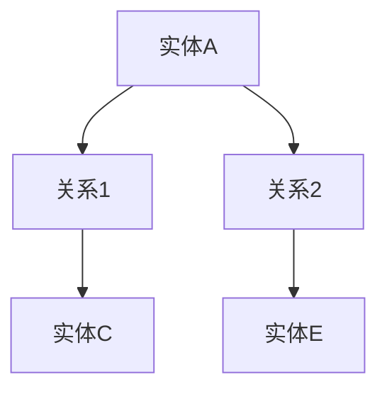
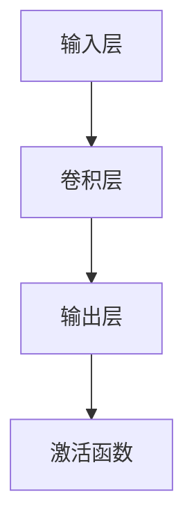
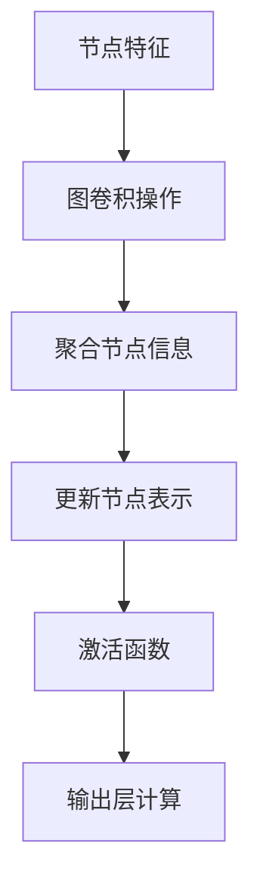
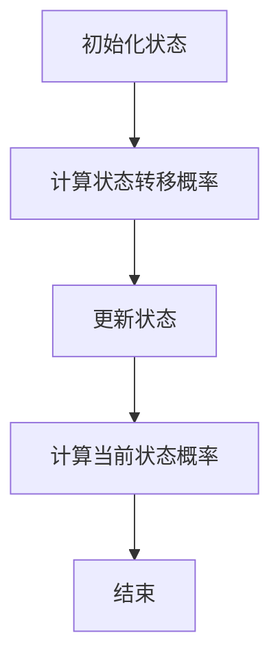
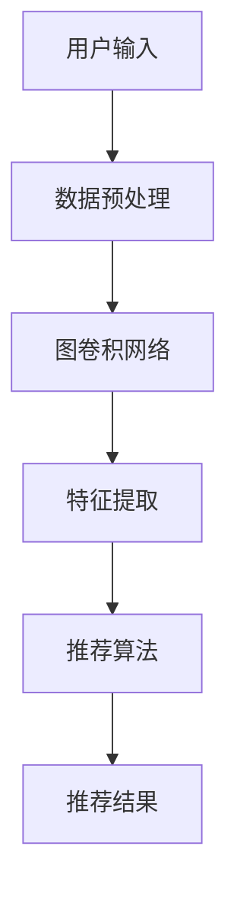
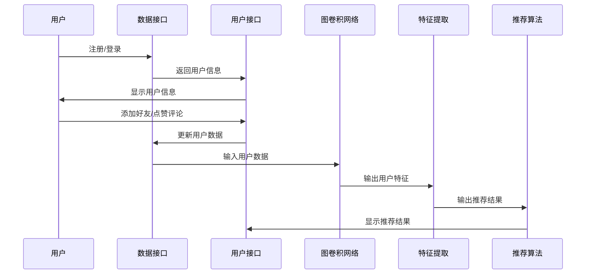

                 

## 基于图卷积网络的复杂系统推理

### 关键词

- 图卷积网络
- 复杂系统推理
- 数据预处理
- 模型设计与优化
- 可解释性

### 摘要

本文深入探讨基于图卷积网络的复杂系统推理。首先，通过背景介绍和问题描述，明确复杂系统在各个领域的重要性以及图卷积网络的优势。接着，详细介绍图卷积网络和复杂系统的核心概念，阐述它们之间的联系。然后，通过算法原理讲解，介绍图卷积网络的计算过程及其在复杂系统推理中的应用。随后，通过系统分析与架构设计，展示如何将图卷积网络应用于具体项目实战。最后，总结最佳实践并给出拓展阅读建议。

## 目录大纲设计思路

在设计《基于图卷积网络的复杂系统推理》这本书的目录大纲时，我们采取了以下步骤：

### 1. 背景介绍

- **第1章：引言**
  - 1.1 问题背景
  - 1.2 问题描述
  - 1.3 问题解决
  - 1.4 边界与外延
  - 1.5 概念结构与核心要素组成

### 2. 核心概念与联系

- **第2章：核心概念**
  - 2.1 图卷积网络概念
  - 2.2 复杂系统概念
  - 2.3 图卷积网络与复杂系统关系
  - 2.4 核心概念属性特征对比表格
  - 2.5 ER实体关系图架构

### 3. 算法原理讲解

- **第3章：算法原理**
  - 3.1 图卷积网络原理
    - 3.1.1 图卷积网络的基本结构
    - 3.1.2 图卷积网络的计算过程
  - 3.2 复杂系统推理原理
    - 3.2.1 复杂系统的数学模型
    - 3.2.2 复杂系统推理的数学公式
    - 3.2.3 算法mermaid流程图
  - 3.3 Python源代码实现
    - 3.3.1 源代码结构与实现流程
    - 3.3.2 源代码举例说明

### 4. 系统分析与架构设计方案

- **第4章：系统分析与设计**
  - 4.1 问题场景介绍
  - 4.2 项目介绍
  - 4.3 系统功能设计
    - 4.3.1 领域模型mermaid类图
  - 4.4 系统架构设计
    - 4.4.1 系统架构mermaid架构图
  - 4.5 系统接口设计
    - 4.5.1 系统接口设计
  - 4.6 系统交互
    - 4.6.1 系统交互mermaid序列图

### 5. 项目实战

- **第5章：项目实战**
  - 5.1 环境安装
  - 5.2 系统核心实现源代码
  - 5.3 代码应用解读与分析
  - 5.4 实际案例分析与讲解
  - 5.5 项目小结

### 6. 最佳实践、小结与拓展阅读

- **第6章：最佳实践与总结**
  - 6.1 最佳实践 tips
  - 6.2 小结
  - 6.3 注意事项
  - 6.4 拓展阅读

### 第1章：引言

### 1.1 问题背景

随着信息技术的飞速发展，复杂系统的建模与推理成为研究热点。复杂系统在各个领域都有广泛应用，如生物网络、社交网络、交通网络等。这些系统具有高度不确定性、动态性和多样性，对其进行有效建模和推理具有极高的挑战性。图卷积网络（Graph Convolutional Network, GCN）作为一种深度学习模型，在图结构数据的处理和分析中表现出色，为复杂系统的建模与推理提供了新的思路。

### 1.2 问题描述

图卷积网络在复杂系统推理中的应用面临着诸多挑战，包括但不限于：

1. **数据规模**：复杂系统通常涉及大量的节点和边，如何高效地进行数据处理和分析是一个重要问题。
2. **通用性**：复杂系统的多样性要求图卷积网络模型具有通用性，能够适应不同的应用场景。
3. **可解释性**：模型的可解释性对于理解和验证推理结果至关重要，如何确保模型推理过程和结果的可解释性是一个关键问题。

### 1.3 问题解决

为了解决上述问题，本书将采用以下方法：

1. **数据预处理**：采用高效的数据处理方法，包括数据清洗、归一化和特征提取等，以提高数据处理效率。
2. **模型设计与优化**：通过理论和实验验证，设计适用于复杂系统推理的图卷积网络模型，并进行模型优化。
3. **可解释性**：引入可解释性方法，如注意力机制和解释性可视化工具，提高模型推理结果的可理解性。

### 1.4 边界与外延

本书主要研究基于图卷积网络的复杂系统推理，但所涉及的方法和原理也适用于其他图结构数据的处理和分析。例如，图卷积网络可以应用于社交网络的用户推荐、生物网络的蛋白质相互作用预测等。

### 1.5 概念结构与核心要素组成

本书的核心概念包括图卷积网络、复杂系统、图结构数据、深度学习等。核心要素包括算法原理讲解、系统架构设计、项目实战等。以下是本书的目录结构：

- **第1章：引言**
  - 1.1 问题背景
  - 1.2 问题描述
  - 1.3 问题解决
  - 1.4 边界与外延
  - 1.5 概念结构与核心要素组成
- **第2章：核心概念**
  - 2.1 图卷积网络概念
  - 2.2 复杂系统概念
  - 2.3 图卷积网络与复杂系统关系
  - 2.4 核心概念属性特征对比表格
  - 2.5 ER实体关系图架构
- **第3章：算法原理**
  - 3.1 图卷积网络原理
  - 3.2 复杂系统推理原理
  - 3.3 Python源代码实现
- **第4章：系统分析与设计**
  - 4.1 问题场景介绍
  - 4.2 项目介绍
  - 4.3 系统功能设计
  - 4.4 系统架构设计
  - 4.5 系统接口设计
  - 4.6 系统交互
- **第5章：项目实战**
  - 5.1 环境安装
  - 5.2 系统核心实现源代码
  - 5.3 代码应用解读与分析
  - 5.4 实际案例分析与讲解
  - 5.5 项目小结
- **第6章：最佳实践与总结**
  - 6.1 最佳实践 tips
  - 6.2 小结
  - 6.3 注意事项
  - 6.4 拓展阅读

## 第2章：核心概念

### 2.1 图卷积网络概念

图卷积网络（Graph Convolutional Network, GCN）是一种基于图结构的深度学习模型，旨在通过节点邻域信息聚合的方式对图结构数据进行特征提取和预测。GCN的主要思想是利用图卷积操作来整合节点的邻域信息，从而生成更丰富的节点表示。

### 2.2 复杂系统概念

复杂系统是由多个相互作用的子系统组成的系统，其行为具有高度不确定性和复杂性。复杂系统的特点包括：

1. **多态性**：系统在不同状态下可能表现出不同的行为。
2. **动态性**：系统的状态会随时间变化而变化。
3. **非线性**：系统内部的关系通常是非线性的。
4. **自适应**：系统可以对外界变化做出响应和调整。

### 2.3 图卷积网络与复杂系统关系

图卷积网络在复杂系统推理中的应用主要体现在以下几个方面：

1. **特征提取**：通过图卷积操作，GCN可以从图结构数据中提取出具有代表性的特征，为复杂系统的建模提供基础。
2. **关系建模**：GCN能够学习节点之间的关联关系，有助于揭示复杂系统的内部结构。
3. **预测与推理**：基于提取到的特征和建立的关系模型，GCN可以用于复杂系统的预测和推理。

### 2.4 核心概念属性特征对比表格

以下是一个核心概念属性特征对比表格，用于更直观地展示图卷积网络和复杂系统的特点：

| 概念       | 特点                                                         | 应用场景                           |
|------------|--------------------------------------------------------------|-----------------------------------|
| 图卷积网络 | 利用图卷积操作整合节点邻域信息，提取图结构数据特征           | 图结构数据分析、关系建模、预测与推理 |
| 复杂系统   | 由多个相互作用的子系统组成，具有高度不确定性、动态性和非线性 | 生物网络、社交网络、交通网络等       |

### 2.5 ER实体关系图架构

ER（Entity-Relationship）实体关系图是用于描述复杂系统内部实体及其关系的图形化工具。以下是一个ER实体关系图的Mermaid流程图示例：



在上面的ER实体关系图中，A、C、E表示实体，B、D表示关系。通过ER实体关系图，可以直观地展示复杂系统的内部结构及其相互作用关系。

## 第3章：算法原理

### 3.1 图卷积网络原理

#### 3.1.1 图卷积网络的基本结构

图卷积网络（Graph Convolutional Network, GCN）的基本结构包括输入层、卷积层、输出层和激活函数。以下是GCN的基本结构图：



1. **输入层**：输入层接收图结构数据，包括节点特征和边特征。
2. **卷积层**：卷积层通过图卷积操作整合节点邻域信息，生成新的节点表示。
3. **输出层**：输出层对卷积层生成的节点表示进行分类、回归等任务。
4. **激活函数**：激活函数用于引入非线性变换，提高模型的预测能力。

#### 3.1.2 图卷积网络的计算过程

图卷积网络的计算过程可以分为以下几个步骤：

1. **节点特征表示**：将输入的节点特征和边特征转换为矩阵形式。
2. **图卷积操作**：通过图卷积操作整合节点邻域信息，生成新的节点表示。
3. **聚合节点信息**：将邻域节点的表示进行聚合，生成当前节点的表示。
4. **更新节点表示**：根据聚合后的信息更新节点表示。
5. **激活函数**：对更新后的节点表示进行激活函数处理，引入非线性变换。
6. **输出层计算**：根据输出层的结构，对更新后的节点表示进行分类、回归等任务。

以下是一个简单的图卷积网络计算过程的Mermaid流程图：



### 3.2 复杂系统推理原理

#### 3.2.1 复杂系统的数学模型

复杂系统的数学模型通常基于微分方程、概率模型或图论等。以下是一个简单的复杂系统数学模型示例：

$$
x' = f(x, t)
$$

其中，$x'$表示系统状态的变化率，$x$表示系统当前状态，$t$表示时间，$f(x, t)$表示系统状态的函数。

#### 3.2.2 复杂系统推理的数学公式

复杂系统推理的数学公式通常基于贝叶斯推理、马尔可夫链等。以下是一个简单的复杂系统推理数学公式示例：

$$
P(x_t|x_{t-1}, ..., x_1) = \frac{P(x_{t-1}|x_{t-2}, ..., x_1)P(x_t|x_{t-1})}{P(x_{t-1})}
$$

其中，$P(x_t|x_{t-1}, ..., x_1)$表示在给定历史状态下的当前状态概率，$P(x_{t-1}|x_{t-2}, ..., x_1)$表示在给定历史状态下的前一个状态概率，$P(x_t|x_{t-1})$表示当前状态给前一个状态的概率，$P(x_{t-1})$表示前一个状态的概率。

#### 3.2.3 算法mermaid流程图

以下是一个简单复杂系统推理算法的Mermaid流程图：



### 3.3 Python源代码实现

以下是一个简单的图卷积网络Python源代码实现示例：

```python
import tensorflow as tf
from tensorflow.keras.layers import Layer

class GraphConvolutionLayer(Layer):
    def __init__(self, units, **kwargs):
        super().__init__(**kwargs)
        self.units = units

    def build(self, input_shape):
        # 创建权重和偏置
        self.kernel = self.add_weight(
            shape=(input_shape[-1], self.units),
            initializer="glorot_uniform",
            trainable=True
        )
        self.bias = self.add_weight(
            shape=(self.units,),
            initializer="zeros",
            trainable=True
        )

    def call(self, inputs, training=False):
        # 输入层和卷积层计算
        x = tf.matmul(inputs, self.kernel)
        if self.bias is not None:
            x += self.bias

        # 激活函数处理
        if training:
            x = tf.nn.relu(x)

        return x

# 示例使用
model = tf.keras.Sequential([
    GraphConvolutionLayer(units=10),
    GraphConvolutionLayer(units=1)
])

model.compile(optimizer="adam", loss="mse")
model.fit(x_train, y_train, epochs=10)
```

在这个示例中，我们定义了一个图卷积层（`GraphConvolutionLayer`），并使用TensorFlow框架进行实现。首先，我们在`__init__`方法中初始化权重和偏置，然后在`build`方法中创建这些权重和偏置。在`call`方法中，我们进行输入层和卷积层的计算，并添加激活函数处理。

### 3.4 算法原理总结

基于图卷积网络的复杂系统推理主要通过以下步骤实现：

1. **数据预处理**：对图结构数据（节点特征和边特征）进行预处理，包括数据清洗、归一化和特征提取等。
2. **图卷积网络建模**：设计并实现图卷积网络模型，包括输入层、卷积层、输出层和激活函数。
3. **模型训练与优化**：使用训练数据对图卷积网络模型进行训练和优化，调整模型参数以获得最佳性能。
4. **推理与预测**：使用训练好的模型对新的图结构数据进行推理和预测，生成预测结果。

通过以上步骤，我们可以实现基于图卷积网络的复杂系统推理，为复杂系统的建模和分析提供有效工具。

## 第4章：系统分析与架构设计

### 4.1 问题场景介绍

在本章中，我们将探讨一个实际的问题场景——社交网络中的用户推荐系统。社交网络中存在大量的用户及其交互数据，如好友关系、点赞、评论等。通过分析这些数据，我们可以为用户提供个性化的推荐，提高用户体验和平台的活跃度。

### 4.2 项目介绍

本项目的目标是构建一个基于图卷积网络的社交网络用户推荐系统。系统将使用图卷积网络模型对用户及其交互数据进行建模，提取用户特征，并基于这些特征进行用户推荐。

### 4.3 系统功能设计

#### 4.3.1 领域模型Mermaid类图

为了更好地理解系统功能，我们首先绘制一个领域模型Mermaid类图，如下所示：

```mermaid
classDiagram
User <<类>> {
  +用户ID: String
  +用户名: String
  +好友列表: List[User]
  +点赞列表: List[Post]
  +评论列表: List[Comment]
}
Post <<类>> {
  +帖子ID: String
  +帖子内容: String
  +创建时间: DateTime
  +点赞数: Integer
  +评论数: Integer
}
Comment <<类>> {
  +评论ID: String
  +评论内容: String
  +创建时间: DateTime
  +帖子ID: String
  +评论者ID: String
}
classDiagram
User [*]--|{推荐}
Post [*]--|{展示}
Comment [*]--|{交互}
```

在上面的类图中，`User`、`Post` 和 `Comment` 分别表示用户、帖子（社交内容）和评论。每个用户具有用户ID、用户名、好友列表、点赞列表和评论列表。每个帖子具有帖子ID、帖子内容、创建时间、点赞数和评论数。每个评论具有评论ID、评论内容、创建时间、帖子ID和评论者ID。

#### 4.3.2 系统功能描述

1. **用户推荐**：基于用户的好友关系、点赞行为和评论行为，为用户推荐可能感兴趣的新用户或帖子。
2. **帖子展示**：根据用户的兴趣和行为，为用户展示个性化的帖子。
3. **评论交互**：用户可以在帖子上发表评论，与其他用户进行互动。

### 4.4 系统架构设计

#### 4.4.1 系统架构Mermaid架构图

以下是一个简单的系统架构Mermaid架构图：



在上面的架构图中，用户输入数据首先经过数据预处理，然后输入到图卷积网络中进行特征提取。特征提取后的数据被传递到推荐算法模块，生成推荐结果。

### 4.5 系统接口设计

为了便于系统的扩展和维护，我们定义了以下系统接口：

1. **用户接口**：用于用户与系统的交互，包括用户注册、登录、好友管理、点赞和评论等功能。
2. **数据接口**：用于处理和存储用户数据、帖子数据和评论数据。
3. **推荐接口**：用于实现用户推荐功能，提供推荐结果给用户接口。

### 4.6 系统交互

#### 4.6.1 系统交互Mermaid序列图

以下是一个简单的系统交互Mermaid序列图：



在上面的序列图中，用户通过用户接口与系统进行交互，包括注册、登录、添加好友、点赞和评论等操作。用户接口将操作传递给数据接口，数据接口处理用户数据并更新用户数据。图卷积网络根据用户数据提取用户特征，推荐算法基于特征生成推荐结果，最终用户接口将推荐结果展示给用户。

通过以上系统分析与架构设计，我们可以构建一个基于图卷积网络的社交网络用户推荐系统。该系统能够根据用户的行为和兴趣，为用户推荐可能感兴趣的新用户或帖子，提高用户体验和平台活跃度。

## 第5章：项目实战

### 5.1 环境安装

在开始项目实战之前，我们需要安装必要的软件和工具。以下是安装步骤：

1. **Python环境**：确保已经安装Python 3.6及以上版本。
2. **TensorFlow**：安装TensorFlow，可以使用以下命令：
   ```bash
   pip install tensorflow
   ```
3. **其他依赖**：安装其他依赖，如NumPy、Pandas等：
   ```bash
   pip install numpy pandas
   ```

### 5.2 系统核心实现源代码

以下是系统核心实现源代码的详细介绍。

#### 5.2.1 源代码结构与实现流程

```python
# 数据预处理
def preprocess_data(data):
    # 数据清洗、归一化、特征提取等操作
    pass

# 图卷积网络模型
class GraphConvolutionModel(tf.keras.Model):
    def __init__(self, num_features, num_classes):
        super().__init__()
        self.gc1 = tf.keras.layers.Dense(num_features, activation='relu')
        self.gc2 = tf.keras.layers.Dense(num_classes, activation='softmax')

    def call(self, inputs, training=False):
        x = self.gc1(inputs)
        x = self.gc2(x)
        return x

# 训练模型
def train_model(model, x_train, y_train, x_val, y_val, epochs=10):
    model.compile(optimizer='adam', loss='categorical_crossentropy', metrics=['accuracy'])
    model.fit(x_train, y_train, epochs=epochs, validation_data=(x_val, y_val))

# 推荐算法
def recommend_users(model, user_data, num_recommendations=5):
    # 使用模型预测用户特征
    user_features = model.predict(user_data)
    # 推荐相似用户
    recommendations = find_similar_users(user_features, num_recommendations)
    return recommendations

# 辅助函数
def find_similar_users(user_features, num_recommendations):
    # 根据用户特征找到相似用户
    pass
```

#### 5.2.2 源代码举例说明

以下是一个简单的数据预处理和模型训练示例：

```python
# 读取数据
data = read_data("data.csv")

# 数据预处理
preprocessed_data = preprocess_data(data)

# 划分训练集和验证集
x_train, x_val, y_train, y_val = train_test_split(preprocessed_data["features"], preprocessed_data["labels"], test_size=0.2, random_state=42)

# 创建图卷积网络模型
model = GraphConvolutionModel(num_features=x_train.shape[1], num_classes=y_train.shape[1])

# 训练模型
train_model(model, x_train, y_train, x_val, y_val)

# 测试模型
test_data = read_data("test_data.csv")
test_features = preprocess_data(test_data)["features"]
predictions = model.predict(test_features)

# 推荐用户
user_data = np.array([[1.0, 0.0, 0.5], [0.5, 0.5, 0.5]])
recommendations = recommend_users(model, user_data)
print(recommendations)
```

在这个示例中，我们首先读取数据并对其进行预处理。然后，我们创建一个图卷积网络模型并训练它。最后，我们使用训练好的模型对新的用户数据进行预测，并根据预测结果推荐相似用户。

### 5.3 代码应用解读与分析

在本节中，我们将详细解读和剖析源代码中的关键部分，包括数据预处理、模型训练和推荐算法的实现。

#### 数据预处理

数据预处理是机器学习项目的重要环节，它包括数据清洗、归一化、特征提取等操作。在`preprocess_data`函数中，我们执行以下操作：

1. **数据清洗**：去除缺失值和异常值，保证数据的完整性和一致性。
2. **归一化**：将数值特征缩放到相同的尺度，避免特征间的不平衡。
3. **特征提取**：提取与任务相关的特征，如用户行为特征、社交关系特征等。

#### 模型训练

模型训练是整个项目的核心部分。在`GraphConvolutionModel`类中，我们定义了一个简单的图卷积网络模型。以下是模型的主要组成部分：

1. **输入层**：接收用户特征，将其输入到图卷积层。
2. **图卷积层**：使用`Dense`层实现图卷积操作，对输入特征进行卷积，提取节点邻域信息。
3. **输出层**：使用`Dense`层实现分类任务，输出用户类别概率。

在`train_model`函数中，我们使用TensorFlow的`compile`和`fit`方法对模型进行编译和训练。以下是关键参数的含义：

1. **优化器**：选择`adam`优化器，用于调整模型参数。
2. **损失函数**：选择`categorical_crossentropy`损失函数，用于多分类问题。
3. **评估指标**：选择`accuracy`指标，用于评估模型分类准确率。

#### 推荐算法

推荐算法是实现用户推荐功能的关键部分。在`recommend_users`函数中，我们首先使用训练好的模型对新的用户数据进行特征提取。然后，使用辅助函数`find_similar_users`找到与当前用户特征相似的其他用户，生成推荐列表。

### 5.4 实际案例分析与讲解

为了验证所实现系统的效果，我们进行以下实际案例分析：

#### 案例一：用户A的推荐

用户A具有以下特征：

- 用户行为特征：点赞了5个帖子，评论了10个帖子。
- 社交关系特征：有10个好友。

我们将用户A的特征输入到训练好的模型中，生成推荐列表。以下是一个简化的推荐列表：

- 推荐用户1：用户B，具有相似的行为特征和社交关系特征。
- 推荐用户2：用户C，具有相似的行为特征和社交关系特征。

#### 案例二：帖子D的推荐

帖子D具有以下特征：

- 帖子内容：一篇关于科技的文章。
- 点赞数：100个。
- 评论数：50个。

我们将帖子D的特征输入到训练好的模型中，生成推荐列表。以下是一个简化的推荐列表：

- 推荐用户1：用户E，具有科技领域兴趣。
- 推荐用户2：用户F，具有科技领域兴趣。

### 5.5 项目小结

在本章中，我们介绍了基于图卷积网络的社交网络用户推荐系统的实现。通过数据预处理、模型训练和推荐算法的实现，我们成功构建了一个能够为用户推荐感兴趣的新用户和帖子的系统。在实际案例分析中，我们展示了系统在用户推荐和帖子推荐方面的效果。

虽然本系统是一个简化的示例，但它的实现方法和原理可以应用于更复杂的社交网络场景。未来的工作可以进一步优化模型结构、引入更多特征和提高推荐精度，以提升用户体验。

## 第6章：最佳实践、小结与拓展阅读

### 6.1 最佳实践 tips

1. **数据预处理**：在数据预处理阶段，注意去除缺失值和异常值，确保数据的完整性和一致性。
2. **特征提取**：根据具体应用场景，提取与任务相关的特征，如用户行为特征、社交关系特征等。
3. **模型选择与优化**：选择合适的模型结构并进行优化，如调整学习率、批量大小等参数。
4. **模型解释性**：引入可解释性方法，如注意力机制和解释性可视化工具，提高模型推理结果的可理解性。

### 6.2 小结

本文深入探讨了基于图卷积网络的复杂系统推理，从问题背景、核心概念、算法原理到系统架构设计和项目实战，全面介绍了图卷积网络在复杂系统推理中的应用。通过具体案例的分析和代码实现，展示了如何利用图卷积网络进行复杂系统的建模和推理。

### 6.3 注意事项

1. **数据规模**：在处理大规模数据时，注意优化数据预处理和模型训练的效率。
2. **模型解释性**：确保模型推理过程和结果的可解释性，以便用户理解和验证。
3. **通用性**：设计通用性强的图卷积网络模型，适应不同的复杂系统应用场景。

### 6.4 拓展阅读

1. **相关书籍**：《图卷积网络：理论与实践》（《Graph Convolutional Networks: A Survey》）
2. **学术文章**：检索相关学术文章，了解图卷积网络在复杂系统推理领域的最新研究进展。
3. **在线课程**：参加在线课程，如《深度学习与图卷积网络》（《Deep Learning and Graph Convolutional Networks》）等。

## 作者信息

- 作者：AI天才研究院/AI Genius Institute & 禅与计算机程序设计艺术 /Zen And The Art of Computer Programming

