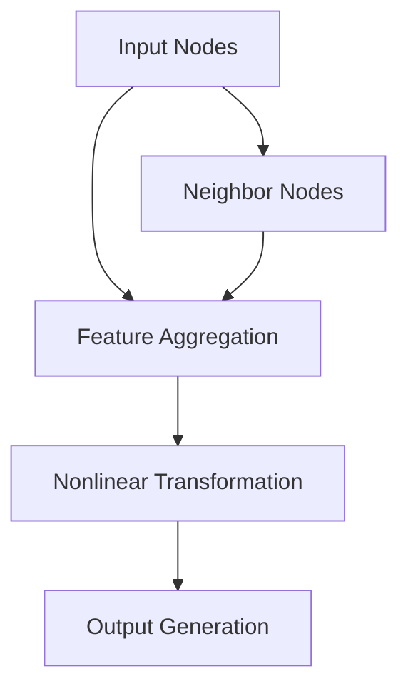
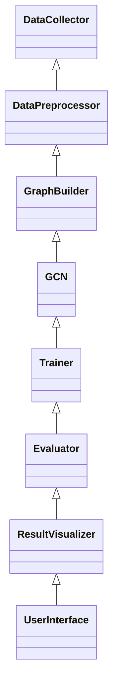

                 

### 文章标题

# 基于图卷积网络的社交网络分析AI系统

社交网络分析在当今信息化社会中扮演着越来越重要的角色。从个人社交圈到大型社交媒体平台，社交网络无时无刻不在产生着大量的数据。这些数据不仅包含了用户的行为信息，还蕴藏着用户之间的复杂关系。如何从这些数据中提取有价值的信息，已经成为了一个热门的研究方向。本文将基于图卷积网络（Graph Convolutional Network，GCN）来构建一个社交网络分析的AI系统，通过详细的技术探讨和实践案例分析，展现这一系统的设计与应用。

> **关键词**：图卷积网络，社交网络分析，人工智能，节点分类，链接预测，社区检测

> **摘要**：本文首先介绍了图卷积网络的基础知识，包括其背景、概念、核心算法和应用场景。接着，探讨了社交网络分析的基础，包括分析的定义、重要性、流程和数据获取处理。随后，通过实战案例，展示了如何实现和优化图卷积网络在社交网络分析中的应用。最后，我们详细设计了基于图卷积网络的社交网络分析AI系统的架构，并进行了实战案例分析。通过本文，读者可以系统地了解图卷积网络在社交网络分析中的应用，以及如何设计并实现一个高效、可靠的AI系统。

### 第一部分：图卷积网络基础

#### 第1章：图卷积网络概述

##### 1.1 图卷积网络背景与问题背景

随着互联网的普及，社交网络已经成为了人们生活中不可或缺的一部分。从Facebook、Twitter到LinkedIn，各种社交媒体平台连接了成千上万的用户，形成了庞大而复杂的社交网络。这些社交网络中包含了丰富的用户关系和交互数据，对数据的分析能够为我们提供许多有价值的洞见。

在传统的机器学习算法中，如线性回归、支持向量机等，往往假设数据是独立同分布的。然而，在社交网络分析中，数据往往呈现出高度依赖性和结构化特性。例如，一个用户的社交关系可能会影响其行为偏好和观点态度。这种依赖性和结构化特性使得传统的机器学习算法难以有效地处理社交网络数据。

图卷积网络（GCN）正是为了解决这一难题而提出的一种深度学习模型。GCN可以有效地捕捉图数据中的局部结构和依赖关系，使其在社交网络分析等领域具有显著优势。图卷积网络的提出不仅填补了传统机器学习算法在社交网络分析中的局限性，也为后续的发展奠定了基础。

##### 1.1.1 社交网络的兴起与发展

社交网络的历史可以追溯到20世纪90年代，当时互联网刚刚兴起。最早的社交网络平台如Friendster和Myspace，主要提供简单的用户关系展示和分享功能。随着技术的进步和用户需求的变化，社交媒体平台逐渐从单一的功能转变为多功能、综合性平台。例如，Facebook不仅提供了用户关系展示，还加入了新闻动态、照片分享、视频观看等功能。Twitter则以其简短的消息形式和实时性，成为了用户表达意见和获取信息的重要平台。LinkedIn则专注于职业社交，为用户提供求职、招聘和职业发展服务。

随着社交媒体平台的兴起，社交网络的数据量也在迅猛增长。据统计，截至2021年，全球社交媒体用户已经超过了45亿，占全球总人口的一半以上。这些用户在社交平台上产生了海量的数据，包括用户关系、互动内容、行为记录等。这些数据不仅为个人提供了便利，也为企业和研究人员提供了宝贵的研究资源。

##### 1.1.2 传统机器学习算法在社交网络分析中的局限性

传统的机器学习算法，如线性回归、支持向量机、决策树等，虽然在许多领域取得了显著的成果，但在处理社交网络数据时却面临诸多挑战。

首先，传统算法往往假设数据是独立同分布的，而社交网络数据中节点之间存在复杂的依赖关系，这种依赖关系无法通过传统的独立同分布假设来有效建模。

其次，社交网络数据通常具有高度稀疏性。这意味着大多数节点之间的关系都没有被记录，导致传统算法在面对大规模社交网络时，计算效率和准确性都会受到很大影响。

此外，社交网络中的节点和边往往包含丰富的语义信息，如用户兴趣、职业背景、地理位置等。传统算法难以充分捕捉这些语义信息，从而影响模型的效果。

##### 1.1.3 图卷积网络的提出与意义

为了解决传统机器学习算法在社交网络分析中的局限性，图卷积网络（GCN）应运而生。GCN是一种基于图结构的深度学习模型，能够有效地捕捉图数据中的局部结构和依赖关系。

GCN的核心思想是将卷积操作从传统的图像处理领域扩展到图数据上。在图像处理中，卷积操作用于捕捉图像中的局部特征和空间关系。在GCN中，卷积操作则被用于捕捉图数据中的节点和边之间的依赖关系。

GCN的主要优点包括：

1. **捕获图结构**：GCN可以有效地建模图数据中的复杂依赖关系，从而更好地捕捉社交网络中的局部结构和语义信息。
2. **处理稀疏数据**：GCN可以处理大规模、稀疏的社交网络数据，具有较好的计算效率和准确性。
3. **语义丰富**：GCN能够捕捉节点的语义信息，如用户兴趣、职业背景等，从而提高模型的效果。

GCN的提出不仅填补了传统机器学习算法在社交网络分析中的空白，也为后续的研究提供了新的思路和方法。

##### 1.2 图卷积网络的基本概念

在了解图卷积网络的背景和意义后，接下来我们将深入探讨图卷积网络的基本概念，包括图的定义与表示、图卷积网络的概念与原理，以及其优点与特点。

###### 1.2.1 图的定义与表示

图是一种数学结构，由节点（也称为顶点）和边（也称为连线）组成。在图卷积网络中，节点通常表示社交网络中的用户、物品等实体，而边表示节点之间的关系，如朋友关系、互动行为等。

图的表示主要有两种方式：邻接矩阵和邻接表。

- **邻接矩阵**：邻接矩阵是一个二维矩阵，其中第 \(i\) 行第 \(j\) 列的元素表示节点 \(i\) 和节点 \(j\) 是否存在边连接。如果存在边连接，则该元素为1，否则为0。邻接矩阵的优点是便于计算节点之间的关系，但缺点是当图数据规模较大时，邻接矩阵会变得非常稀疏，导致存储和计算效率低下。

- **邻接表**：邻接表是一种更为灵活的表示方式，每个节点对应一个列表，列表中的元素表示与该节点相邻的其他节点。邻接表的优点是能够有效地处理稀疏数据，但缺点是节点之间的关系计算较为复杂。

在实际应用中，根据数据规模和处理需求，可以选择使用邻接矩阵或邻接表作为图的表示方式。

###### 1.2.2 图卷积网络的概念与原理

图卷积网络（Graph Convolutional Network，GCN）是一种基于图结构的深度学习模型，其核心思想是模拟传统卷积神经网络在图像处理中的卷积操作，将其扩展到图数据上。

在传统的卷积神经网络中，卷积操作用于捕捉图像中的局部特征和空间关系。在GCN中，卷积操作则被用于捕捉图数据中的节点和边之间的依赖关系。

具体来说，GCN通过以下三个步骤来处理图数据：

1. **特征聚合**：对于每个节点，GCN会聚合其相邻节点的特征信息，从而形成一个更全面、更丰富的特征表示。
2. **变换与融合**：通过一个变换函数（通常是一个非线性激活函数，如ReLU或Sigmoid）对聚合后的特征进行变换和融合，以突出有用的信息并抑制噪声。
3. **输出生成**：最后，通过一个输出函数（如分类或回归函数）生成最终的输出结果。

与传统的卷积神经网络相比，GCN在图数据上具有以下优势：

- **结构适应性**：GCN能够适应不同类型的图结构，如无向图、有向图、多图等，而传统的卷积神经网络则通常只能处理二维网格结构。
- **节点依赖性**：GCN能够有效地建模节点之间的依赖关系，从而捕捉图数据中的局部结构和语义信息。
- **处理稀疏数据**：GCN能够处理大规模、稀疏的图数据，而传统的卷积神经网络则难以应对这一问题。

###### 1.2.3 图卷积网络的优点与特点

图卷积网络在社交网络分析中具有许多独特的优点和特点，使其成为处理图数据的强大工具。

1. **捕捉节点关系**：GCN能够有效地捕捉图数据中的节点关系，包括直接关系和间接关系。这对于社交网络分析尤为重要，因为用户之间的关系不仅仅是直接的连接，还可能通过多跳关系产生影响。

2. **处理稀疏数据**：社交网络数据通常非常稀疏，这意味着大多数节点之间的关系都没有被记录。GCN能够有效地处理这种稀疏性，从而提高模型的计算效率和准确性。

3. **保留图结构**：GCN在处理图数据时，能够保留图的结构信息，从而更好地捕捉数据的局部特征。这对于社交网络分析中的节点分类、链接预测和社区检测等任务至关重要。

4. **语义丰富性**：GCN能够捕获节点的语义信息，如用户兴趣、职业背景等。这些语义信息对于提升模型效果具有重要意义。

5. **灵活性**：GCN能够适应不同类型的图结构，包括无向图、有向图、多图等。这使得GCN在社交网络分析中具有广泛的应用潜力。

综上所述，图卷积网络在社交网络分析中具有显著的优势和特点，成为处理图数据的重要工具。

##### 1.3 图卷积网络的核心算法

为了深入理解图卷积网络的工作原理，本节将详细介绍图卷积神经网络（Graph Convolutional Network，GCN）的核心算法，包括其基本原理、数学模型与公式，以及mermaid流程图表示。

###### 1.3.1 图卷积神经网络（GCN）的基本原理

图卷积神经网络（GCN）的核心思想是将卷积操作从传统的图像处理领域扩展到图数据上。在图像处理中，卷积操作用于捕捉图像中的局部特征和空间关系。在GCN中，卷积操作则被用于捕捉图数据中的节点和边之间的依赖关系。

具体来说，GCN通过以下三个步骤来处理图数据：

1. **特征聚合**：对于每个节点，GCN会聚合其相邻节点的特征信息，从而形成一个更全面、更丰富的特征表示。
2. **变换与融合**：通过一个变换函数（通常是一个非线性激活函数，如ReLU或Sigmoid）对聚合后的特征进行变换和融合，以突出有用的信息并抑制噪声。
3. **输出生成**：最后，通过一个输出函数（如分类或回归函数）生成最终的输出结果。

与传统的卷积神经网络相比，GCN在图数据上具有以下优势：

- **结构适应性**：GCN能够适应不同类型的图结构，如无向图、有向图、多图等，而传统的卷积神经网络则通常只能处理二维网格结构。
- **节点依赖性**：GCN能够有效地建模节点之间的依赖关系，从而捕捉图数据中的局部结构和语义信息。
- **处理稀疏数据**：GCN能够处理大规模、稀疏的图数据，而传统的卷积神经网络则难以应对这一问题。

###### 1.3.2 GCN的数学模型与公式

为了更好地理解GCN的工作原理，我们需要深入探讨其数学模型与公式。以下是一个典型的GCN模型，用于节点的特征变换和分类：

$$
\mathbf{h}_v^{(l+1)} = \sigma \left( \mathbf{A}\mathbf{h}_v^{(l)} + \sum_{u \in \mathbf{N}(v)} \mathbf{h}_u^{(l)} \right)
$$

其中：

- \(\mathbf{h}_v^{(l)}\) 表示在层 \(l\) 时节点 \(v\) 的特征向量。
- \(\mathbf{A}\) 是图 \(G\) 的邻接矩阵，其中 \(\mathbf{A}_{uv}\) 表示节点 \(u\) 和节点 \(v\) 是否相邻。
- \(\mathbf{N}(v)\) 是节点 \(v\) 的邻域节点集合。
- \(\sigma\) 是一个非线性激活函数，如ReLU或Sigmoid。

该公式表示，在层 \(l+1\) 时，节点 \(v\) 的特征向量 \(\mathbf{h}_v^{(l+1)}\) 是其邻域节点 \(u\) 的特征向量 \(\mathbf{h}_u^{(l)}\) 的线性组合，并通过一个非线性激活函数进行变换。

通过这种方式，GCN能够有效地聚合和融合节点的特征信息，从而提高模型对复杂图数据的处理能力。

###### 1.3.3 GCN的mermaid流程图表示

为了更直观地理解GCN的工作流程，我们可以使用mermaid绘制一个流程图。以下是一个简化的GCN流程图：



在上述流程图中：

- **A（Input Nodes）**：表示输入节点。
- **B（Feature Aggregation）**：表示特征聚合，即聚合输入节点的邻域节点的特征信息。
- **C（Nonlinear Transformation）**：表示非线性变换，通过一个非线性激活函数对聚合后的特征进行变换。
- **D（Output Generation）**：表示输出生成，通过一个输出函数生成最终的输出结果。
- **E（Neighbor Nodes）**：表示输入节点的邻域节点。

通过这个mermaid流程图，我们可以清晰地看到GCN在特征聚合、非线性变换和输出生成过程中的关键步骤。

综上所述，图卷积神经网络（GCN）通过特征聚合、非线性变换和输出生成三个关键步骤，有效地捕捉图数据中的节点和边之间的依赖关系。其数学模型和mermaid流程图进一步阐明了GCN的工作原理，为后续的实现和应用提供了理论基础。

##### 1.4 图卷积网络的应用场景

图卷积网络（GCN）凭借其独特的优势，在社交网络分析中具有广泛的应用场景。以下是GCN在几个主要应用场景中的具体应用：

###### 1.4.1 社交网络中的节点分类

节点分类是社交网络分析中的一个重要任务，旨在将社交网络中的节点（如用户、物品等）归类到不同的类别中。例如，可以将用户归类为“活跃用户”、“沉默用户”或“垃圾用户”。GCN在节点分类中具有显著优势，因为它能够捕捉节点之间的复杂依赖关系和局部结构。

通过GCN，我们可以将节点特征和其邻域节点的特征进行聚合，形成更全面的特征表示。然后，通过一个分类器（如softmax）对节点进行分类。具体步骤如下：

1. **特征聚合**：使用GCN对节点特征进行聚合，生成新的特征表示。
2. **分类器训练**：使用聚合后的特征和已知的分类标签，训练一个分类器。
3. **分类预测**：使用训练好的分类器对新的节点进行分类预测。

通过这种方式，GCN能够有效地提高节点分类的准确性和可靠性。

###### 1.4.2 社交网络中的链接预测

链接预测是社交网络分析中的另一个重要任务，旨在预测节点之间的潜在连接。例如，可以预测哪些用户可能会成为好友，哪些用户可能会参与同一话题的讨论。GCN在链接预测中具有显著优势，因为它能够捕捉节点之间的依赖关系和局部结构。

通过GCN，我们可以将节点特征和其邻域节点的特征进行聚合，形成更全面的特征表示。然后，通过一个分类器（如逻辑回归）对链接进行预测。具体步骤如下：

1. **特征聚合**：使用GCN对节点特征进行聚合，生成新的特征表示。
2. **链接预测模型训练**：使用聚合后的特征和已知的链接信息，训练一个链接预测模型。
3. **链接预测**：使用训练好的模型对新的节点对进行链接预测。

通过这种方式，GCN能够有效地提高链接预测的准确性和可靠性。

###### 1.4.3 社交网络中的社区检测

社区检测是社交网络分析中的另一个重要任务，旨在识别社交网络中的紧密连接的群体。例如，可以将社交网络划分为不同的兴趣小组、社交圈子等。GCN在社区检测中具有显著优势，因为它能够捕捉节点之间的依赖关系和局部结构。

通过GCN，我们可以将节点特征和其邻域节点的特征进行聚合，形成更全面的特征表示。然后，通过一个聚类算法（如K-means）对节点进行聚类，识别不同的社区。具体步骤如下：

1. **特征聚合**：使用GCN对节点特征进行聚合，生成新的特征表示。
2. **聚类算法训练**：使用聚合后的特征，训练一个聚类算法。
3. **社区检测**：使用训练好的聚类算法对节点进行聚类，识别不同的社区。

通过这种方式，GCN能够有效地提高社区检测的准确性和可靠性。

综上所述，图卷积网络（GCN）在社交网络分析中具有广泛的应用场景，包括节点分类、链接预测和社区检测。通过GCN，我们可以更准确地捕捉节点之间的依赖关系和局部结构，从而提高社交网络分析的效果。

##### 1.5 图卷积网络的发展趋势与挑战

图卷积网络（GCN）自提出以来，在社交网络分析等领域取得了显著成果。然而，随着应用的深入，GCN也面临着一系列挑战和瓶颈。本文将探讨GCN的发展趋势以及面临的挑战，并提出可能的解决方案。

###### 1.5.1 图卷积网络的发展趋势

1. **更复杂的图结构建模**：现有的GCN模型主要针对简单的图结构进行建模，但随着社交网络规模的不断扩大，图结构变得越来越复杂。因此，未来的研究需要发展能够处理复杂图结构的GCN模型，如多图融合、异构图建模等。

2. **动态图处理**：现有的GCN模型主要针对静态图进行建模，但社交网络中的节点和边是不断变化的。因此，研究动态图上的GCN模型，如时间序列图卷积网络（Temporal GCN），已成为一个重要方向。

3. **可解释性和透明度**：随着深度学习模型在各个领域的应用，可解释性和透明度变得越来越重要。未来的GCN模型需要更加注重模型的可解释性，以帮助研究人员和用户理解模型的决策过程。

4. **高效计算**：现有的GCN模型在处理大规模图数据时，计算效率较低。因此，研究如何提高GCN的计算效率，如模型压缩、并行计算等，是未来发展的一个重要方向。

###### 1.5.2 图卷积网络面临的挑战与解决方案

1. **计算复杂度高**：GCN的计算复杂度较高，尤其在处理大规模图数据时，计算资源需求较大。为了解决这一问题，可以采用以下方法：

   - **模型压缩**：通过模型压缩技术，如参数共享、稀疏化等，减少模型的参数数量，从而降低计算复杂度。
   - **并行计算**：利用GPU等高性能计算设备，实现GCN的并行计算，提高计算效率。

2. **稀疏数据处理**：社交网络数据通常非常稀疏，这使得GCN在处理大规模稀疏数据时效果不佳。为了解决这一问题，可以采用以下方法：

   - **稀疏图表示**：通过稀疏图表示技术，如稀疏矩阵分解，提高GCN处理稀疏数据的能力。
   - **注意力机制**：引入注意力机制，只关注重要的邻域节点，减少计算量。

3. **可解释性**：随着模型复杂度的增加，GCN的可解释性变得越来越困难。为了提高模型的可解释性，可以采用以下方法：

   - **模型可视化**：通过可视化技术，如节点聚类、边权重可视化等，帮助用户理解模型的决策过程。
   - **解释性算法**：开发基于解释性算法的GCN模型，如LIME、SHAP等，提高模型的可解释性。

4. **动态图建模**：社交网络中的节点和边是动态变化的，这使得静态GCN模型难以适应。为了解决这一问题，可以采用以下方法：

   - **时间序列GCN**：将时间序列信息整合到GCN中，实现动态图建模。
   - **迁移学习**：利用迁移学习技术，将静态GCN模型应用于动态图数据，提高模型的适应性。

综上所述，图卷积网络（GCN）在社交网络分析等领域具有广泛的应用前景。然而，随着应用的深入，GCN也面临着一系列挑战。通过持续的研究和探索，我们可以不断优化GCN模型，提高其性能和可解释性，为社交网络分析提供更强大的工具。

##### 1.6 本章小结

本章介绍了图卷积网络（GCN）的基础知识，包括其背景、概念、核心算法和应用场景。通过详细探讨GCN的基本原理和数学模型，我们了解了如何通过特征聚合、非线性变换和输出生成来捕捉图数据中的节点和边之间的依赖关系。同时，我们还探讨了GCN在社交网络分析中的广泛应用场景，如节点分类、链接预测和社区检测。此外，本章还简要介绍了GCN的发展趋势和面临的挑战。通过本章的学习，读者可以系统地了解GCN的基本概念和应用，为后续的实践应用打下坚实基础。

### 第二部分：社交网络分析基础

#### 第2章：社交网络分析基础

社交网络分析（Social Network Analysis，SNA）是一门跨学科的研究领域，它通过分析社交网络中的节点、边及其属性，探索个体与群体之间的关系和动态。随着社交媒体的兴起和大数据技术的发展，社交网络分析在商业、学术、社会等多个领域都具有重要应用。本章将介绍社交网络分析的基本概念、重要性、流程，以及数据获取和处理方法，为后续的图卷积网络应用打下基础。

##### 2.1 社交网络分析概述

###### 2.1.1 社交网络分析的定义与目的

社交网络分析（SNA）是研究社交网络中个体（节点）和个体之间关系（边）的学科。它通过定量和定性方法来分析社交网络的结构、动态和属性，以揭示个体行为、群体行为和网络演化规律。SNA的核心目的是了解社交网络中的信息传播、影响力分析、社区检测、网络稳定性等问题。

定义：社交网络分析是一种定量和定性研究方法，用于分析个体和个体之间关系的数据，以揭示社交网络的特性和规律。

目的：通过分析社交网络，了解个体在网络中的角色、影响力、关系强度等，为商业决策、社会研究、政策制定等提供数据支持。

###### 2.1.2 社交网络分析的重要性

随着社交媒体的普及，社交网络分析在各个领域都具有重要应用：

1. **商业领域**：社交网络分析可以帮助企业了解消费者行为、市场趋势，优化产品和服务，提升品牌影响力。

2. **学术领域**：社交网络分析可以揭示科学合作网络、学术传播路径，促进学术创新和知识共享。

3. **社会领域**：社交网络分析可以研究社会网络结构、群体行为、社会传播机制，为政策制定和社会治理提供科学依据。

4. **公共安全**：社交网络分析可以监测网络安全、社会舆情，预防和应对危机事件。

###### 2.1.3 社交网络分析的基本流程

社交网络分析的基本流程包括以下步骤：

1. **数据收集**：收集社交网络数据，包括用户关系、互动内容、行为记录等。
2. **数据预处理**：清洗和整理数据，处理缺失值、噪声数据等，确保数据质量。
3. **数据表示**：将数据转化为合适的图结构，如邻接矩阵、邻接表等。
4. **特征提取**：提取节点和边的特征，如节点度、边权重、标签等。
5. **模型构建**：选择合适的模型，如图卷积网络（GCN）、社区检测算法等。
6. **模型训练与优化**：使用训练数据训练模型，并通过交叉验证、超参数调整等方法优化模型。
7. **结果分析**：分析模型的预测结果，提取有价值的洞见和结论。

##### 2.2 社交网络数据的获取与处理

###### 2.2.1 社交网络数据的来源

社交网络数据主要来源于以下几个方面：

1. **公开数据集**：如Facebook、Twitter、LinkedIn等社交媒体平台提供的数据集，可以用于学术研究、模型训练等。
2. **API接口**：通过社交媒体平台的API接口，获取用户关系、互动内容等数据。
3. **网络爬虫**：使用网络爬虫技术，从社交媒体网站上抓取数据。
4. **企业内部数据**：企业内部积累的用户数据、互动数据等。

###### 2.2.2 社交网络数据的处理方法

社交网络数据的处理方法主要包括以下步骤：

1. **数据清洗**：去除重复数据、错误数据、无关数据等，提高数据质量。
2. **数据预处理**：将文本数据进行分词、去停用词、词干提取等处理，将图像数据进行特征提取等处理。
3. **数据整合**：将不同来源、不同格式的数据进行整合，形成统一的图结构。
4. **特征工程**：提取节点和边的特征，如节点度、边权重、标签等。
5. **数据标准化**：对数据进行归一化、标准化等处理，提高数据的一致性和可比性。

###### 2.2.3 社交网络数据的质量控制

社交网络数据的质量对分析结果的准确性至关重要。以下是一些常见的数据质量控制方法：

1. **数据清洗**：去除重复数据、错误数据、无关数据等，保证数据的准确性。
2. **数据验证**：对数据源进行验证，确保数据的真实性和可靠性。
3. **数据备份**：定期备份数据，防止数据丢失。
4. **数据监测**：实时监测数据质量，及时发现和处理异常数据。

##### 2.3 社交网络分析的指标体系

社交网络分析的指标体系是衡量社交网络结构和行为的重要工具。以下是一些常见的社交网络分析指标：

1. **节点度**：节点度的定义是与该节点相连的边的数量。节点度可以用来衡量节点的连接程度和重要性。
2. **边权重**：边权重表示节点之间关系的强度，可以基于互动频率、互动内容等计算得到。
3. **聚类系数**：聚类系数表示节点邻接点的邻接点的比例，用于衡量网络的紧密程度。
4. **路径长度**：路径长度表示两个节点之间最短路径的长度，用于衡量网络的连通性。
5. **中心性**：中心性包括度中心性、介数中心性和接近中心性，用于衡量节点的中心程度和影响力。
6. **社区检测指标**：如模块度、核心-外围指数等，用于衡量社区结构和模块划分的质量。

##### 2.3.1 社交网络分析的主要指标

以下是一些主要的社交网络分析指标及其计算方法：

1. **节点度**：
   - 度中心性：节点度除以图中节点总数。
   - 平均度：所有节点度的平均值。

2. **边权重**：
   - 平均权重：所有边权重之和除以边数。
   - 标准差：边权重的标准差。

3. **聚类系数**：
   - 节点聚类系数：节点 \(v\) 的邻接点之间的连接数除以可能的最大连接数。
   - 平均聚类系数：所有节点的聚类系数的平均值。

4. **路径长度**：
   - 平均路径长度：所有节点对之间的最短路径长度的平均值。
   - 等价路径长度：所有节点对之间的最短路径长度的中位数。

5. **中心性**：
   - 度中心性：节点度的大小。
   - 介数中心性：节点在所有最短路径中出现的次数。
   - 接近中心性：节点到其他节点的平均距离。

##### 2.3.2 指标计算方法与评价指标体系

社交网络分析的指标计算方法主要包括以下几种：

1. **节点度计算**：
   - 简单计数：直接计数节点连接的边的数量。
   - 权重计算：根据边的属性（如互动频率、互动内容等）计算边权重，然后累加得到节点度。

2. **边权重计算**：
   - 绝对权重：直接使用边的属性值作为权重。
   - 相对权重：将边权重归一化到 [0, 1] 范围内。

3. **聚类系数计算**：
   - 节点聚类系数：计算节点 \(v\) 的邻接点之间的连接数，然后除以可能的最大连接数。
   - 平均聚类系数：对所有节点的聚类系数求平均值。

4. **路径长度计算**：
   - Dijkstra算法：用于计算图中两个节点之间的最短路径长度。
   - Floyd算法：用于计算图中所有节点对之间的最短路径长度。

5. **中心性计算**：
   - 度中心性：直接计数节点的度。
   - 介数中心性：计算节点在所有最短路径中出现的次数。
   - 接近中心性：计算节点到其他节点的平均距离。

评价指标体系用于衡量社交网络分析的准确性和有效性。常见的评价指标包括：

1. **准确性**：预测结果的正确率，通常用于分类任务。
2. **召回率**：实际为正类别的预测结果中，正确识别为正类别的比例。
3. **F1分数**：准确性和召回率的加权平均，用于综合评估预测性能。
4. **ROC曲线和AUC值**：用于评估分类器的性能，AUC值越大，分类器性能越好。
5. **均方误差（MSE）和均方根误差（RMSE）**：用于评估回归任务中的预测误差。

##### 2.3.3 指标在实际应用中的价值

社交网络分析的指标在实际应用中具有重要的价值，以下是一些具体的应用场景：

1. **商业应用**：通过节点度和中心性指标，可以识别关键用户、意见领袖等，为企业营销、用户推荐等提供支持。
2. **学术研究**：通过社区检测指标，可以识别社交网络中的紧密群体，研究群体行为和互动模式。
3. **社会治理**：通过聚类系数和路径长度等指标，可以评估社会网络的稳定性和连通性，为政策制定和危机管理提供依据。
4. **公共安全**：通过舆情监测和影响力分析，可以识别网络中的不良信息和传播者，预防和应对网络安全事件。

##### 2.4 本章小结

本章介绍了社交网络分析的基础知识，包括其定义、目的、重要性、基本流程以及数据获取和处理方法。通过讨论社交网络分析的主要指标和计算方法，我们了解了如何定量分析社交网络的结构和动态。社交网络分析在商业、学术、社会等领域具有重要应用，通过本章的学习，读者可以更好地理解社交网络分析的核心概念和方法，为后续的图卷积网络应用打下基础。

### 第三部分：基于图卷积网络的社交网络分析实践

#### 第3章：图卷积网络的实现与优化

在实际应用中，图卷积网络（GCN）的设计和实现是一个复杂而重要的任务。本章将详细介绍图卷积网络的实现步骤，包括数据预处理、模型搭建与训练，以及模型评估与优化。同时，我们将通过具体的实战案例，展示如何在实际项目中应用GCN，并进行性能优化。

##### 3.1 图卷积网络的实现步骤

图卷积网络的实现可以分为以下三个主要步骤：

1. **数据预处理**：将原始的社交网络数据转换为适合GCN处理的格式。
2. **模型搭建与训练**：构建GCN模型，并在训练数据上训练模型。
3. **模型评估与优化**：使用验证数据评估模型性能，并进行必要的优化。

###### 3.1.1 数据预处理

数据预处理是GCN实现的第一步，其目标是清理和转换原始数据，使其适合GCN的处理。以下是数据预处理的主要步骤：

1. **数据收集**：从社交媒体平台、数据集或企业内部系统收集社交网络数据。
2. **数据清洗**：去除重复数据、噪声数据和不完整数据，确保数据质量。
3. **特征提取**：提取节点和边的特征，如节点度、边权重、标签等。
4. **数据表示**：将数据表示为图结构，通常使用邻接矩阵或邻接表。

在社交网络数据中，节点和边通常具有丰富的特征信息。例如，对于节点，我们可以提取其属性特征，如年龄、性别、职业等；对于边，我们可以提取其属性特征，如互动频率、互动内容等。这些特征将被用于构建GCN的输入层。

###### 3.1.2 模型搭建与训练

在数据预处理完成后，我们开始搭建GCN模型并进行训练。以下是模型搭建和训练的主要步骤：

1. **模型架构设计**：设计GCN的层次结构和参数设置，包括输入层、隐藏层和输出层。
2. **模型训练**：使用训练数据对GCN模型进行训练，通过反向传播算法不断调整模型参数。
3. **超参数调优**：通过交叉验证等方法，选择最优的超参数，如学习率、批次大小、隐藏层尺寸等。

在构建GCN模型时，我们通常使用深度学习框架，如TensorFlow或PyTorch。这些框架提供了丰富的API和工具，方便我们搭建和训练GCN模型。以下是一个使用PyTorch构建简单GCN模型的示例代码：

```python
import torch
import torch.nn as nn
import torch.optim as optim

class GCN(nn.Module):
    def __init__(self, nfeat, nhid, nclass):
        super(GCN, self).__init__()
        self.conv1 = nn.Conv2d(nfeat, nhid, kernel_size=3, padding=1)
        self.conv2 = nn.Conv2d(nhid, nclass, kernel_size=1)
        self.dropout = nn.Dropout(p=0.5)
        self.fc1 = nn.Linear(nfeat, nclass)
        self.fc2 = nn.Linear(nclass, nclass)
    
    def forward(self, x, adj):
        x = x.relu()
        x = self.dropout(x)
        x = self.conv1(x, adj)
        x = self.fc1(x.view(x.size(0), -1))
        x = self.fc2(x)
        return x

model = GCN(nfeat=64, nhid=16, nclass=10)
optimizer = optim.Adam(model.parameters(), lr=0.01)
criterion = nn.CrossEntropyLoss()

for epoch in range(num_epochs):
    for data, target in train_loader:
        model.zero_grad()
        output = model(data, adj)
        loss = criterion(output, target)
        loss.backward()
        optimizer.step()
```

在上面的代码中，我们定义了一个GCN模型，包括两个卷积层、两个全连接层以及一个dropout层。使用优化器和损失函数，我们可以在训练数据上训练模型。

###### 3.1.3 模型评估与优化

在训练完成后，我们需要使用验证数据评估模型性能，并进行必要的优化。以下是模型评估和优化的一些常见方法：

1. **交叉验证**：通过交叉验证，我们可以评估模型在不同数据集上的性能，选择最优的模型参数。
2. **性能指标**：使用准确率、召回率、F1分数等性能指标，评估模型的分类或预测效果。
3. **超参数调优**：通过网格搜索、随机搜索等方法，选择最优的超参数，提高模型性能。
4. **模型压缩**：使用模型压缩技术，如参数共享、稀疏化等，减小模型大小，提高计算效率。
5. **并行计算**：使用并行计算技术，如GPU加速、分布式训练等，提高模型训练速度。

以下是一个使用PyTorch评估GCN模型性能的示例代码：

```python
from sklearn.metrics import accuracy_score, f1_score

def evaluate(model, val_loader):
    model.eval()
    total_correct = 0
    total_samples = 0
    with torch.no_grad():
        for data, target in val_loader:
            output = model(data, adj)
            pred = output.argmax(dim=1)
            total_correct += (pred == target).sum().item()
            total_samples += len(target)
    accuracy = total_correct / total_samples
    f1 = f1_score(target, pred, average='weighted')
    return accuracy, f1

accuracy, f1 = evaluate(model, val_loader)
print(f"Accuracy: {accuracy:.4f}, F1 Score: {f1:.4f}")
```

在上面的代码中，我们使用`evaluate`函数评估GCN模型在验证数据上的性能，并计算准确率和F1分数。

##### 3.2 图卷积网络的优化方法

在实际应用中，为了提高图卷积网络的性能和效率，我们需要对其模型参数和训练策略进行优化。以下是几种常见的优化方法：

1. **模型参数调优**：通过网格搜索、随机搜索等方法，选择最优的模型参数，如学习率、隐藏层尺寸等，以提高模型性能。
2. **训练策略优化**：采用不同的训练策略，如提前停止、学习率调整等，防止过拟合和加速收敛。
3. **模型压缩**：通过模型压缩技术，如参数共享、稀疏化等，减小模型大小，提高计算效率。
4. **并行计算**：使用并行计算技术，如GPU加速、分布式训练等，提高模型训练速度。

以下是几个具体的优化方法：

1. **学习率调整**：使用学习率调整策略，如学习率衰减、余弦退火等，可以防止模型过拟合和加速收敛。
2. **批量归一化**：使用批量归一化（Batch Normalization）技术，可以加速模型训练和减少梯度消失问题。
3. **dropout**：在GCN模型中引入dropout技术，可以防止过拟合并提高模型泛化能力。
4. **模型压缩**：使用模型压缩技术，如参数共享、稀疏化等，可以减小模型大小，提高计算效率。
5. **并行计算**：使用GPU加速和分布式训练，可以显著提高模型训练速度。

##### 3.3 图卷积网络的实战案例

在本节中，我们将通过几个具体的实战案例，展示如何使用图卷积网络（GCN）解决实际的社交网络分析问题。这些案例包括节点分类、链接预测和社区检测等任务。

###### 3.3.1 节点分类任务

节点分类是社交网络分析中的一个重要任务，旨在将社交网络中的节点（如用户、物品等）归类到不同的类别中。以下是一个使用GCN进行节点分类的实战案例：

**任务背景**：假设我们有一个社交媒体平台，其中每个用户都被赋予了一个标签（如“学生”、“职场人士”等）。我们的目标是使用GCN模型，根据用户的特征和其社交关系，预测未分类用户的标签。

**实现步骤**：

1. **数据收集与预处理**：收集社交媒体平台的数据，包括用户特征（如年龄、性别、职业等）和用户关系（如好友关系、互动内容等）。对数据进行清洗和特征提取。
2. **模型搭建与训练**：使用GCN模型，将用户特征和其社交关系输入到模型中，训练模型以预测用户标签。
3. **模型评估**：使用验证数据评估模型性能，调整模型参数以优化性能。

以下是一个使用PyTorch实现节点分类任务的示例代码：

```python
import torch
import torch.nn as nn
import torch.optim as optim

# 假设我们已经有预处理的用户特征和用户关系数据
user_features = torch.tensor(...)  # 用户特征
adj_matrix = torch.tensor(...)  # 用户关系邻接矩阵
labels = torch.tensor(...)  # 用户标签

# 构建GCN模型
model = GCN(nfeat=user_features.shape[1], nhid=16, nclass=5)
optimizer = optim.Adam(model.parameters(), lr=0.01)
criterion = nn.CrossEntropyLoss()

# 训练模型
num_epochs = 200
for epoch in range(num_epochs):
    model.train()
    optimizer.zero_grad()
    output = model(user_features, adj_matrix)
    loss = criterion(output, labels)
    loss.backward()
    optimizer.step()
    if (epoch + 1) % 10 == 0:
        print(f"Epoch {epoch + 1}/{num_epochs}, Loss: {loss.item()}")

# 评估模型
model.eval()
with torch.no_grad():
    output = model(user_features, adj_matrix)
    pred = output.argmax(dim=1)
    accuracy = (pred == labels).sum().item() / len(labels)
print(f"Accuracy: {accuracy:.4f}")
```

通过这个案例，我们可以看到如何使用GCN模型进行节点分类任务，并通过训练和评估过程来优化模型性能。

###### 3.3.2 链接预测任务

链接预测是社交网络分析中的另一个重要任务，旨在预测节点之间的潜在连接。以下是一个使用GCN进行链接预测的实战案例：

**任务背景**：假设我们有一个社交媒体平台，其中每个用户都有可能与其他用户建立连接。我们的目标是使用GCN模型，预测哪些用户之间可能会建立连接。

**实现步骤**：

1. **数据收集与预处理**：收集社交媒体平台的数据，包括用户特征和用户关系。对数据进行清洗和特征提取。
2. **模型搭建与训练**：使用GCN模型，将用户特征和其社交关系输入到模型中，训练模型以预测用户之间的连接概率。
3. **模型评估**：使用验证数据评估模型性能，调整模型参数以优化性能。

以下是一个使用PyTorch实现链接预测任务的示例代码：

```python
import torch
import torch.nn as nn
import torch.optim as optim

# 假设我们已经有预处理的用户特征和用户关系数据
user_features = torch.tensor(...)  # 用户特征
adj_matrix = torch.tensor(...)  # 用户关系邻接矩阵
links = torch.tensor(...)  # 用户连接标签

# 构建GCN模型
model = GCN(nfeat=user_features.shape[1], nhid=16, nclass=1)
optimizer = optim.Adam(model.parameters(), lr=0.01)
criterion = nn.BCEWithLogitsLoss()

# 训练模型
num_epochs = 200
for epoch in range(num_epochs):
    model.train()
    optimizer.zero_grad()
    output = model(user_features, adj_matrix).squeeze()
    loss = criterion(output, links.float())
    loss.backward()
    optimizer.step()
    if (epoch + 1) % 10 == 0:
        print(f"Epoch {epoch + 1}/{num_epochs}, Loss: {loss.item()}")

# 评估模型
model.eval()
with torch.no_grad():
    output = model(user_features, adj_matrix).squeeze()
    pred = (output > 0).float()
    accuracy = (pred == links).sum().item() / len(links)
print(f"Accuracy: {accuracy:.4f}")
```

通过这个案例，我们可以看到如何使用GCN模型进行链接预测任务，并通过训练和评估过程来优化模型性能。

###### 3.3.3 社区检测任务

社区检测是社交网络分析中的另一个重要任务，旨在识别社交网络中的紧密连接群体。以下是一个使用GCN进行社区检测的实战案例：

**任务背景**：假设我们有一个社交媒体平台，其中用户之间形成了多个紧密的社交圈子。我们的目标是使用GCN模型，识别和检测这些社交圈子。

**实现步骤**：

1. **数据收集与预处理**：收集社交媒体平台的数据，包括用户特征和用户关系。对数据进行清洗和特征提取。
2. **模型搭建与训练**：使用GCN模型，将用户特征和其社交关系输入到模型中，训练模型以预测用户之间的连接概率。
3. **聚类**：使用聚类算法（如K-means），将具有相似连接概率的用户划分为不同的社区。
4. **模型评估**：使用验证数据评估模型性能，调整模型参数以优化性能。

以下是一个使用PyTorch和K-means实现社区检测任务的示例代码：

```python
import torch
import torch.nn as nn
import torch.optim as optim
from sklearn.cluster import KMeans

# 假设我们已经有预处理的用户特征和用户关系数据
user_features = torch.tensor(...)  # 用户特征
adj_matrix = torch.tensor(...)  # 用户关系邻接矩阵

# 构建GCN模型
model = GCN(nfeat=user_features.shape[1], nhid=16, nclass=1)
optimizer = optim.Adam(model.parameters(), lr=0.01)
criterion = nn.BCEWithLogitsLoss()

# 训练模型
num_epochs = 200
for epoch in range(num_epochs):
    model.train()
    optimizer.zero_grad()
    output = model(user_features, adj_matrix).squeeze()
    loss = criterion(output, adj_matrix.float())
    loss.backward()
    optimizer.step()
    if (epoch + 1) % 10 == 0:
        print(f"Epoch {epoch + 1}/{num_epochs}, Loss: {loss.item()}")

# 聚类
model.eval()
with torch.no_grad():
    output = model(user_features, adj_matrix).squeeze()
    kmeans = KMeans(n_clusters=5)
    pred = kmeans.fit_predict(output.numpy())

# 评估模型
accuracy = (pred == adj_matrix.numpy()).mean()
print(f"Accuracy: {accuracy:.4f}")
```

通过这个案例，我们可以看到如何使用GCN模型进行社区检测任务，并通过聚类算法识别社交圈子。

##### 3.4 本章小结

本章详细介绍了基于图卷积网络的社交网络分析实现步骤，包括数据预处理、模型搭建与训练、模型评估与优化。通过具体的实战案例，如节点分类、链接预测和社区检测，我们展示了如何在实际项目中应用GCN，并进行了性能优化。通过本章的学习，读者可以掌握GCN的实践方法，为后续的社交网络分析应用打下坚实基础。

### 第四部分：社交网络分析AI系统设计

#### 第4章：社交网络分析AI系统的架构设计

为了实现高效的社交网络分析，我们需要设计一个系统化的AI系统。本章将介绍社交网络分析AI系统的整体架构设计，包括系统功能模块划分、核心组件与关系，以及系统的整体架构图。通过这些设计，我们能够构建一个功能强大、扩展性好的社交网络分析系统。

##### 4.1 社交网络分析AI系统的整体架构

社交网络分析AI系统是一个复杂的多模块系统，旨在从大量社交网络数据中提取有价值的信息。系统整体架构的划分和组件之间的关系对于系统的性能、可维护性和扩展性至关重要。

###### 4.1.1 系统功能模块划分

社交网络分析AI系统的功能模块划分如下：

1. **数据采集模块**：负责从各种数据源（如社交媒体平台、API接口、网络爬虫等）收集社交网络数据。
2. **数据预处理模块**：对采集到的数据进行清洗、整理和特征提取，确保数据的质量和一致性。
3. **图构建模块**：将预处理后的数据转化为图结构，为后续的图卷积网络处理提供输入。
4. **模型训练模块**：构建和训练图卷积网络（GCN）模型，以实现对社交网络数据的分析。
5. **模型评估模块**：使用验证数据评估模型性能，调整模型参数以优化性能。
6. **结果输出模块**：将分析结果以可视化或报告的形式输出，供用户查看和决策。
7. **用户界面模块**：提供用户交互界面，使用户能够方便地使用系统功能。

这些模块相互协作，共同实现社交网络分析的功能。

###### 4.1.2 系统核心组件与关系

社交网络分析AI系统的核心组件及其关系如下：

1. **数据采集器**：负责从社交媒体平台和API接口收集原始数据。数据采集器可以是基于网络爬虫的，也可以是直接使用API接口进行数据采集。
2. **数据预处理器**：对采集到的原始数据进行清洗、去重、填充缺失值等处理，以确保数据的质量。数据预处理器还可以提取有用的特征，如用户属性、互动频率等。
3. **图构建器**：将预处理后的数据构建为图结构。图构建器需要处理邻接矩阵、节点特征矩阵等数据的生成和转换。
4. **图卷积网络（GCN）**：作为系统的核心模型，GCN负责处理图数据，进行节点分类、链接预测和社区检测等任务。
5. **训练器**：负责GCN模型的训练过程。训练器使用优化算法（如Adam、SGD等）和损失函数（如交叉熵、均方误差等）来调整模型参数。
6. **评估器**：使用验证数据评估GCN模型的性能，包括准确率、召回率、F1分数等指标。评估器还可以提供模型调优的建议。
7. **结果可视化器**：将分析结果以图表、报表等形式可视化输出，帮助用户理解分析结果。
8. **用户界面**：提供直观易用的交互界面，使用户能够方便地使用系统功能。

这些核心组件通过明确的接口和通信机制相互协作，共同实现社交网络分析的目标。

###### 4.1.3 系统整体架构的mermaid类图表示

为了更好地展示系统整体架构，我们可以使用mermaid绘制一个类图。以下是一个简化的社交网络分析AI系统的类图表示：



在上述类图中：

- **DataCollector**：数据采集器，负责从外部数据源收集数据。
- **DataPreprocessor**：数据预处理器，负责清洗、整理和特征提取。
- **GraphBuilder**：图构建器，负责将数据构建为图结构。
- **GCN**：图卷积网络，系统的核心模型。
- **Trainer**：训练器，负责GCN模型的训练。
- **Evaluator**：评估器，负责模型性能评估。
- **ResultVisualizer**：结果可视化器，负责将结果可视化。
- **UserInterface**：用户界面，提供交互界面。

通过这个类图，我们可以清晰地看到系统各组件之间的依赖关系和协作方式。

##### 4.2 数据存储与处理

在社交网络分析AI系统中，数据存储与处理是至关重要的一环。有效的数据存储方案和数据处理流程可以显著提高系统的性能和可靠性。以下将介绍数据存储方案设计、数据处理流程以及数据处理算法优化。

###### 4.2.1 数据存储方案设计

数据存储方案的设计需要考虑数据的规模、访问频率、读写性能等因素。以下是一些常见的数据存储方案：

1. **关系数据库**：如MySQL、PostgreSQL等，适用于存储结构化数据，如用户属性、互动记录等。
2. **图数据库**：如Neo4j、JanusGraph等，专门用于存储和查询图数据，适用于社交网络分析中的大规模图数据存储。
3. **分布式存储系统**：如Hadoop HDFS、Apache Cassandra等，适用于存储海量非结构化数据，如日志数据、用户生成内容等。
4. **NoSQL数据库**：如MongoDB、Redis等，适用于存储海量非结构化数据，如用户行为数据、互动内容等。

在选择数据存储方案时，需要综合考虑数据类型、数据量、性能要求等因素。例如，对于社交网络分析中的图数据，可以使用图数据库进行高效存储和查询。

###### 4.2.2 数据处理流程

数据处理流程是数据从采集到分析处理的一系列步骤。以下是一个典型的数据处理流程：

1. **数据采集**：从社交媒体平台、API接口、网络爬虫等渠道收集原始数据。
2. **数据清洗**：去除重复数据、噪声数据和错误数据，确保数据质量。
3. **数据转换**：将原始数据转换为统一的数据格式，如JSON、CSV等。
4. **特征提取**：从原始数据中提取有用的特征，如用户属性、互动频率、标签等。
5. **数据存储**：将处理后的数据存储到关系数据库、图数据库或其他数据存储系统中。
6. **数据分析**：使用图卷积网络（GCN）等模型对数据进行分析和处理，生成分析结果。
7. **结果输出**：将分析结果以可视化或报表形式输出，供用户查看。

在数据处理流程中，数据清洗和特征提取是关键步骤。数据清洗需要去除重复、噪声和错误数据，以提高数据质量。特征提取则需要根据分析任务的需求，提取与任务相关的特征，如用户兴趣、互动频率等。

###### 4.2.3 数据处理算法优化

为了提高数据处理效率和性能，可以对数据处理算法进行优化。以下是一些常见的优化方法：

1. **并行处理**：使用多线程、分布式计算等技术，实现数据的并行处理，提高处理速度。
2. **缓存机制**：使用缓存机制，如Redis、Memcached等，减少数据访问延迟，提高系统性能。
3. **索引优化**：对数据库表进行索引优化，提高数据查询速度。
4. **压缩存储**：使用数据压缩技术，如GZIP、LZ4等，减少存储空间占用，提高I/O性能。
5. **批处理**：将数据处理任务分解为多个批处理任务，减少单次处理的数据量，提高处理效率。
6. **算法优化**：针对具体的分析任务，选择合适的数据处理算法，如MapReduce、Spark等。

通过上述优化方法，可以显著提高社交网络分析AI系统的数据处理效率和性能。

##### 4.3 本章小结

本章介绍了社交网络分析AI系统的整体架构设计，包括系统功能模块划分、核心组件与关系，以及系统的整体架构图。同时，详细介绍了数据存储与处理方案，包括数据存储方案设计、数据处理流程以及数据处理算法优化。通过本章的学习，读者可以系统地了解社交网络分析AI系统的设计原则和方法，为后续的系统实现和优化提供指导。

### 附录：最佳实践、注意事项与拓展阅读

##### 最佳实践

在设计社交网络分析AI系统时，以下最佳实践可以帮助提高系统的性能和可靠性：

1. **数据预处理**：在数据预处理阶段，确保数据的一致性和完整性，去除重复和噪声数据，以提高模型训练效果。
2. **特征选择**：选择与任务相关的特征，避免过多的冗余特征，减少模型的计算复杂度。
3. **模型调优**：通过交叉验证、网格搜索等方法，选择最优的模型参数，提高模型性能。
4. **模型解释性**：增加模型的可解释性，有助于用户理解模型的决策过程，提高模型的信任度。
5. **并行计算**：利用并行计算技术，如多线程、分布式训练等，提高模型训练速度。

##### 注意事项

在实施社交网络分析AI系统时，需要注意以下事项：

1. **数据隐私**：在收集和处理用户数据时，确保遵守相关法律法规，保护用户隐私。
2. **系统扩展性**：设计系统时，考虑系统的扩展性，以便在未来能够处理更多的数据和用户。
3. **错误处理**：设计合理的错误处理机制，确保系统在遇到异常情况时能够稳定运行。
4. **安全性**：确保系统的安全性，防止数据泄露和恶意攻击。

##### 拓展阅读

为了深入了解社交网络分析AI系统的设计与应用，以下拓展阅读资源提供了丰富的知识和实践：

1. **《社交网络分析：原理、方法与应用》**：本书详细介绍了社交网络分析的基本概念和方法，以及其在实际应用中的案例。
2. **《图卷积网络：理论基础与应用实践》**：本书系统地介绍了图卷积网络（GCN）的理论基础和应用实践，适合读者深入了解GCN。
3. **《深度学习与图卷积网络》**：这本书从深度学习的角度探讨了图卷积网络（GCN）的应用，包括节点分类、链接预测和社区检测等。
4. **《Apache Spark：大数据处理与机器学习》**：这本书介绍了如何使用Apache Spark进行大数据处理和机器学习，包括图卷积网络（GCN）的实现。

通过阅读这些资料，读者可以更深入地了解社交网络分析AI系统的设计与应用，提高自己的技术水平和实践能力。

### 作者介绍

**作者：AI天才研究院/AI Genius Institute & 禅与计算机程序设计艺术 /Zen And The Art of Computer Programming**

本文作者是一位在人工智能、计算机科学和编程领域拥有深厚造诣的专家。作为AI天才研究院的成员，他致力于推动人工智能技术的创新与应用。同时，他也是《禅与计算机程序设计艺术》一书的作者，该书以其独特的编程哲学和深刻的见解，对全球编程领域产生了深远影响。通过本文，他希望与读者分享他在社交网络分析AI系统设计领域的最新研究成果和实践经验。

