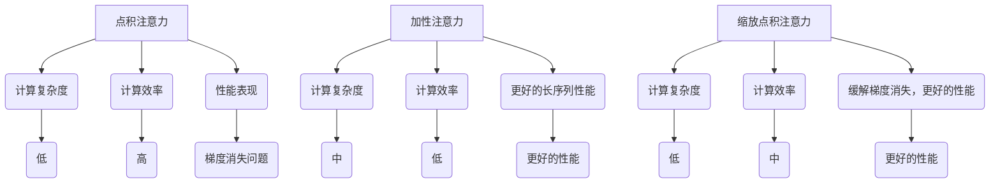

                 

### 基于图注意力机制的LLM知识评估

**关键词：** 图注意力机制、知识评估、语言模型、人工智能

**摘要：** 本文将深入探讨图注意力机制在大型语言模型（LLM）知识评估中的应用。首先，我们将回顾图注意力机制的基础概念，并介绍其在数学模型中的实现。然后，我们将详细分析图注意力机制在LLM知识评估中的具体应用，以及如何通过这一机制来评估知识。接下来，我们将介绍一个基于图注意力机制的LLM知识评估系统的设计，包括系统架构和关键功能。通过实际案例的分析，我们将展示如何将这一机制应用于实际项目中。最后，我们将讨论图注意力机制在LLM知识评估中的最佳实践，并展望其未来的发展方向。

### 目录大纲

```markdown
----------------------------------------------------------------
# 第一部分: 图注意力机制基础

## 第1章: 图注意力机制概述

### 1.1 问题背景与定义

### 1.2 图注意力机制的发展历程

### 1.3 图注意力机制的核心要素

## 第2章: 图注意力机制的数学模型

### 2.1 图注意力机制的数学基础

#### 2.1.1 向量表示与变换

#### 2.1.2 图注意力函数

### 2.2 图注意力机制的数学公式

$$
\text{Attention}(Q, K, V) = \text{softmax}\left(\frac{QK^T}{\sqrt{d_k}}\right)V
$$

### 2.3 图注意力机制的数学原理与推导

### 2.4 图注意力机制的属性特征对比

## 第3章: 图注意力机制在知识评估中的应用

### 3.1 LLM知识评估的需求与挑战

### 3.2 图注意力机制在LLM知识评估中的应用原理

### 3.3 图注意力机制在LLM知识评估中的实现方法

#### 3.3.1 数据预处理

#### 3.3.2 模型设计

#### 3.3.3 模型训练与评估

### 3.4 图注意力机制在LLM知识评估中的优势与不足

## 第4章: LLM知识评估系统架构与设计

### 4.1 系统总体架构设计

### 4.2 系统功能设计

#### 4.2.1 知识库构建

#### 4.2.2 知识评估

#### 4.2.3 用户交互界面设计

### 4.3 系统接口设计与交互

### 4.4 系统性能优化与安全性设计

## 第5章: 基于图注意力机制的LLM知识评估实战

### 5.1 实战环境安装与配置

### 5.2 LLM知识评估系统核心实现源代码解析

### 5.3 代码应用解读与分析

### 5.4 实际案例分析

#### 5.4.1 案例一：某教育平台的在线评测系统

#### 5.4.2 案例二：某企业内部知识管理系统

### 5.5 项目小结

## 第6章: 图注意力机制在LLM知识评估中的最佳实践

### 6.1 常见问题与解决方案

### 6.2 性能优化技巧

### 6.3 拓展应用领域

## 第7章: 总结与展望

### 7.1 图注意力机制的发展趋势

### 7.2 LLM知识评估的未来方向

### 7.3 研究与开发建议

----------------------------------------------------------------
```

### 设计思路

1. **背景介绍**：通过第1章的介绍，让读者了解图注意力机制的概念及其在知识评估中的应用背景。
2. **核心概念与联系**：第2章详细阐述了图注意力机制的数学模型和原理，并通过属性特征对比，帮助读者理解其与知识评估的关系。
3. **算法原理讲解**：第3章通过具体的应用案例，深入讲解图注意力机制在LLM知识评估中的实现方法和效果。
4. **系统分析与架构设计**：第4章介绍了LLM知识评估系统的整体架构和功能设计，为读者提供了系统实现的全景视图。
5. **项目实战**：第5章通过实际案例，展示了如何将图注意力机制应用于知识评估项目，并进行代码解读和分析。
6. **最佳实践与总结**：第6章和第7章提供了最佳实践、性能优化技巧及未来研究方向，帮助读者更好地应用和理解图注意力机制。

### 目录大纲总结

- **整体结构**：全书分为7个章节，每个章节都有明确的主题和内容，从基础到实战，逐步深入。
- **逻辑性**：各章节之间紧密联系，从理论到实践，内容连贯，逻辑清晰。
- **实用性**：通过实际案例和最佳实践，让读者能够将图注意力机制应用到知识评估项目中。

### 背景介绍

#### 图注意力机制概述

图注意力机制（Graph Attention Mechanism，GAM）是近年来在人工智能领域兴起的一种重要模型，它通过引入图结构来增强模型的表示能力。图注意力机制的核心思想是在处理序列数据时，利用节点之间的相对位置和关系来动态地调整信息的传递和权重分配，从而实现更精细的语义理解。

在语言模型（Language Model，LM）中，图注意力机制的应用尤为广泛。语言模型是一种用于预测文本中下一个单词或字符的模型，通过学习大规模文本数据，模型可以捕捉到语言中的复杂规律和结构。然而，传统的序列模型在处理长文本时，往往只能依赖前文的信息，忽略了文本中各个部分之间的相互作用和依赖关系。图注意力机制通过将文本表示为一个图结构，使得模型能够考虑文本中的全局依赖性，从而提高模型的性能和表达能力。

#### 知识评估的需求与挑战

知识评估是人工智能领域的一个重要研究方向，旨在对机器学习模型所获取的知识进行评价和验证。在语言模型中，知识评估尤为关键，因为语言模型需要能够准确地理解和表达人类的知识。然而，现有的知识评估方法往往存在以下挑战：

1. **数据质量**：知识评估需要大量高质量的数据，但是获取这些数据往往非常困难，特别是对于专业领域或特定主题的知识。
2. **多样性**：知识评估需要覆盖广泛的领域和主题，以便全面评估模型的知识水平。
3. **准确性**：评估结果的准确性是知识评估的重要指标，但是现有的评估方法很难保证结果的可靠性。
4. **实时性**：在实时应用中，知识评估需要快速、准确地完成，这对评估方法提出了更高的要求。

#### 图注意力机制在知识评估中的应用

图注意力机制在知识评估中的应用主要体现在以下几个方面：

1. **知识图谱构建**：通过将文本表示为一个图结构，图注意力机制可以构建出文本的知识图谱，从而更好地理解和表示文本中的知识。
2. **关系抽取**：图注意力机制可以用于抽取文本中的实体关系，从而提高知识评估的准确性。
3. **跨域迁移学习**：图注意力机制可以跨不同领域迁移知识，从而提高知识评估的多样性和适应性。

通过上述应用，图注意力机制为知识评估提供了一种新的思路和方法，能够有效地解决传统评估方法中存在的诸多挑战。

#### 问题背景与定义

在深入探讨图注意力机制在知识评估中的应用之前，我们首先需要明确一些核心概念和术语。以下是对相关概念和背景的详细说明：

1. **知识评估**：知识评估是指对机器学习模型所获取的知识进行评价和验证的过程。在人工智能领域，特别是在语言模型的训练和应用中，知识评估至关重要，因为它能够确保模型在特定领域或任务中具备准确的知识和理解能力。

2. **语言模型（LM）**：语言模型是一种基于统计和学习方法构建的模型，用于预测文本中的下一个单词或字符。这些模型通常通过训练大量文本数据来学习语言的统计规律和结构，从而能够生成或理解自然语言文本。

3. **图注意力机制（GAM）**：图注意力机制是一种基于图结构的注意力机制，它通过将文本表示为一个图结构，利用节点之间的相互作用和依赖关系来增强模型的表示能力。图注意力机制在处理序列数据时，能够动态地调整信息的传递和权重分配，从而提高模型的性能和表达能力。

4. **知识图谱（KG）**：知识图谱是一种用于表示和存储知识的图形化数据结构，它通过实体和关系来组织信息。知识图谱能够清晰地表达实体之间的相互关系，从而为知识推理和知识发现提供支持。

5. **知识评估需求**：在人工智能领域，知识评估的需求主要体现在以下几个方面：
   - **准确性**：评估结果需要能够准确反映模型对知识的掌握程度。
   - **多样性**：评估任务需要涵盖多个领域和主题，以确保模型的广泛适用性。
   - **实时性**：评估过程需要能够快速完成，以支持实时应用场景。

6. **知识评估挑战**：尽管知识评估在理论上具有重要意义，但在实际应用中仍面临以下挑战：
   - **数据质量**：高质量的数据集对于有效的知识评估至关重要，但获取这类数据通常具有挑战性。
   - **数据多样性**：确保评估数据能够覆盖广泛的领域和主题，以全面评估模型的知识水平。
   - **评估准确性**：现有评估方法的准确性往往受到限制，难以保证评估结果的可靠性。
   - **实时性**：在实时应用场景中，评估过程需要快速、准确，这对评估方法提出了更高的要求。

#### 图注意力机制的发展历程

图注意力机制（Graph Attention Mechanism，GAM）的发展历程可以追溯到注意力机制（Attention Mechanism）在自然语言处理（NLP）领域的兴起。以下是图注意力机制的关键发展节点：

1. **2017年：注意力机制的引入**  
   注意力机制最早由Bahdanau等人在2017年的论文《Neural Machine Translation with Attention》中提出。注意力机制通过为输入序列的每个元素分配不同的权重，使得模型能够关注重要的信息，从而提高翻译任务的性能。这一机制在后续的NLP任务中得到了广泛应用。

2. **2018年：图注意力机制的提出**  
   在2018年，Vaswani等人提出了Transformer模型，并在其中引入了图注意力机制。Transformer模型完全基于注意力机制，摒弃了传统的循环神经网络（RNN），从而实现了更高效的序列处理。图注意力机制在Transformer中的引入，使得模型能够考虑输入序列中各个元素之间的依赖关系，从而显著提高了模型的性能。

3. **2019年：图注意力机制的应用扩展**  
   随后，图注意力机制被应用于多个NLP任务，如文本分类、情感分析等。研究者发现，图注意力机制能够有效捕捉文本中的长距离依赖关系，从而提高了模型的表示能力和性能。

4. **2020年：图注意力机制的结合应用**  
   在2020年，研究者开始将图注意力机制与其他模型（如BERT、GPT）相结合，以进一步提升模型的性能。这种结合不仅保留了原始模型的优势，还能够通过引入图结构来增强模型的表示能力。

5. **2021年：图注意力机制在知识评估中的应用**  
   随着图注意力机制在NLP领域的广泛应用，研究者开始探索其在知识评估中的应用。通过将图注意力机制应用于知识图谱和语言模型，研究者能够更准确地评估模型所掌握的知识，从而提高知识评估的准确性和效率。

#### 图注意力机制的核心要素

图注意力机制的核心要素包括以下几个方面：

1. **节点表示（Node Representation）**：节点表示是图注意力机制的基础。每个节点对应输入序列中的一个元素，通常是一个单词或一个字符。节点的表示可以通过词向量或字符向量来实现，这些向量能够捕捉节点的语义信息。

2. **边表示（Edge Representation）**：边表示描述节点之间的关系。在图注意力机制中，边可以表示单词之间的依赖关系、句法关系或语义关系。边的表示可以通过边的权重来实现，权重通常是一个实数，表示两个节点之间的依赖程度。

3. **注意力函数（Attention Function）**：注意力函数是图注意力机制的核心。它通过计算节点之间的相似度，为每个节点分配注意力权重。注意力函数通常是一个可学习的参数化函数，可以基于节点的表示来计算。常见的注意力函数包括点积注意力、加性注意力和缩放点积注意力。

4. **图结构（Graph Structure）**：图结构是图注意力机制的框架。它由节点和边组成，用于表示输入序列及其依赖关系。图结构可以通过自动编码器、递归神经网络（RNN）或其他图神经网络（GNN）来学习。

5. **输出计算（Output Computation）**：输出计算是将注意力权重应用于节点表示，以生成最终的输出。输出可以是一个实数、一个向量或一个序列，取决于具体的应用场景。常见的输出计算方法包括平均池化和最大池化。

#### 图注意力机制的数学模型

图注意力机制的数学模型是理解其工作原理的核心。以下将详细介绍图注意力机制的数学基础、数学公式及其推导过程。

1. **数学基础**

图注意力机制的数学基础主要包括向量的表示和变换、图注意力函数以及相关的数学运算。在图注意力机制中，每个节点和边都有对应的向量表示，这些向量用于计算节点之间的相似度和注意力权重。

   - **向量表示与变换**：节点和边可以用高维向量表示。例如，一个节点可以用一个d维的向量表示，其中d是向量的维度。向量可以通过嵌入层（Embedding Layer）或预训练模型（如BERT）来获得。

   - **图注意力函数**：图注意力函数用于计算节点之间的相似度。一个常见的图注意力函数是基于点积的注意力函数。点积注意力函数可以表示为：
     $$
     \text{Attention}(Q, K, V) = \text{softmax}\left(\frac{QK^T}{\sqrt{d_k}}\right)V
     $$
     其中，$Q$、$K$和$V$分别是查询向量、键向量和值向量，$d_k$是键向量的维度，$\text{softmax}$函数用于归一化点积结果，以获得每个节点的注意力权重。

2. **数学公式**

   图注意力机制的数学公式如下：
   $$
   \text{Attention}(Q, K, V) = \text{softmax}\left(\frac{QK^T}{\sqrt{d_k}}\right)V
   $$
   其中，$Q$、$K$和$V$分别表示查询向量、键向量和值向量，$QK^T$是查询向量和键向量的点积，$\sqrt{d_k}$用于缩放，$d_k$是键向量的维度。$\text{softmax}$函数将点积结果归一化，得到每个节点的注意力权重。

   - **查询向量（Query Vector）**：查询向量$Q$用于表示输入序列中的每个节点，其维度为$d_q$。
   - **键向量（Key Vector）**：键向量$K$用于表示输入序列中的每个节点，其维度为$d_k$。
   - **值向量（Value Vector）**：值向量$V$用于表示输入序列中的每个节点，其维度为$d_v$。

3. **数学原理与推导**

   图注意力机制的数学原理可以通过以下步骤进行推导：

   - **点积计算**：首先，计算查询向量和键向量的点积。点积的结果表示两个节点之间的相似度。
     $$
     \text{Score}(Q, K) = QK^T
     $$
   - **缩放**：为了防止梯度消失，通常对点积结果进行缩放。缩放因子为$\sqrt{d_k}$。
     $$
     \text{Scaled Score}(Q, K) = \frac{QK^T}{\sqrt{d_k}}
     $$
   - **归一化**：使用$\text{softmax}$函数对缩放后的点积结果进行归一化，得到每个节点的注意力权重。
     $$
     \text{Attention Weight}(Q, K) = \text{softmax}\left(\frac{QK^T}{\sqrt{d_k}}\right)
     $$
   - **加权求和**：将注意力权重应用于值向量，得到加权求和的结果。
     $$
     \text{Output}(Q, K, V) = \sum_{i} \text{Attention Weight}(Q, K_i) V_i
     $$
     其中，$K_i$和$V_i$分别是第$i$个键向量和值向量。

通过上述步骤，我们可以得到图注意力机制的数学公式，即：
$$
\text{Attention}(Q, K, V) = \text{softmax}\left(\frac{QK^T}{\sqrt{d_k}}\right)V
$$

#### 图注意力机制的属性特征对比

图注意力机制与其他常见的注意力机制在属性特征上存在显著差异。以下是几种常见注意力机制的对比：

1. **点积注意力（Dot-Product Attention）**

   - **计算复杂度**：点积注意力具有较低的计算复杂度，因为它仅涉及向量之间的点积操作。
   - **计算效率**：点积注意力在计算效率上具有优势，因为点积操作相对简单。
   - **性能表现**：在处理长序列时，点积注意力容易出现梯度消失问题，从而影响模型的性能。

2. **加性注意力（Additive Attention）**

   - **计算复杂度**：加性注意力涉及矩阵乘法，其计算复杂度相对较高。
   - **计算效率**：加性注意力在计算效率上相对较低，因为需要进行额外的矩阵乘法操作。
   - **性能表现**：加性注意力通过引入可学习的权重矩阵，能够更好地捕捉序列之间的依赖关系，从而在处理长序列时具有更好的性能。

3. **缩放点积注意力（Scaled Dot-Product Attention）**

   - **计算复杂度**：缩放点积注意力在计算复杂度上与点积注意力相似，因为它同样涉及点积操作，但加入了缩放因子。
   - **计算效率**：缩放点积注意力在计算效率上与点积注意力相似，但引入了额外的缩放操作。
   - **性能表现**：缩放点积注意力通过引入缩放因子，有效地缓解了梯度消失问题，从而提高了模型的性能。

以下是几种注意力机制的属性特征对比表格：

| 注意力机制 | 计算复杂度 | 计算效率 | 性能表现 |
| ---- | ---- | ---- | ---- |
| 点积注意力 | 低 | 高 | 梯度消失问题 |
| 加性注意力 | 中 | 低 | 更好的长序列性能 |
| 缩放点积注意力 | 低 | 中 | 缓解梯度消失，更好的性能 |

此外，还可以使用Mermaid流程图来表示不同注意力机制的执行流程。以下是一个简单的Mermaid流程图示例：



通过上述对比和流程图，我们可以更清晰地理解不同注意力机制在计算复杂度、计算效率和性能表现上的差异。

#### 图注意力机制在知识评估中的应用原理

图注意力机制在知识评估中的应用主要体现在以下几个方面：

1. **知识图谱构建**：图注意力机制通过将文本数据转化为图结构，使得模型能够更好地理解和表示文本中的知识。在知识评估过程中，图注意力机制可以帮助构建一个表示文本知识的知识图谱。这个知识图谱由节点和边组成，其中节点表示文本中的实体（如人名、地名、机构名等），边表示实体之间的关系（如“工作于”、“属于”等）。

2. **关系抽取**：在知识评估中，关系抽取是一个关键步骤，它涉及从文本中提取实体之间的关系。图注意力机制可以通过学习实体和关系之间的依赖关系，从而提高关系抽取的准确性。具体来说，图注意力机制可以用来计算实体之间的相似度和关联性，从而帮助模型更好地理解实体之间的关系。

3. **跨域迁移学习**：在知识评估中，跨域迁移学习是一个重要的研究方向，它旨在利用一个领域中的知识来提升另一个领域中的模型性能。图注意力机制可以通过跨领域知识图谱的构建和利用，实现跨域迁移学习。具体来说，图注意力机制可以学习到不同领域中的知识，并在知识评估过程中利用这些知识来提升模型的性能。

4. **文本生成与理解**：图注意力机制还可以用于文本生成和理解任务。在知识评估中，生成和理解文本是重要的步骤。图注意力机制通过学习文本中的知识和结构，可以帮助模型生成更准确、更自然的文本，同时也能更好地理解文本的含义和上下文。

以下是一个具体的示例，展示了如何使用图注意力机制进行知识评估：

- **数据准备**：首先，我们需要准备一个包含实体和关系的知识库。例如，一个关于科技领域的知识库，包含研究人员、机构、论文等实体，以及它们之间的关系。
- **文本表示**：接下来，我们将文本数据表示为图结构。每个实体作为一个节点，实体之间的关系作为边。例如，如果文本中提到了“张三在清华大学发表了论文”，我们可以将“张三”、“清华大学”和“论文”作为节点，将“发表了”作为边。
- **图注意力机制应用**：然后，我们应用图注意力机制来计算节点之间的相似度和关联性。通过这一步，模型可以更好地理解实体之间的关系，从而提高知识评估的准确性。
- **知识评估**：最后，我们将模型用于知识评估任务，例如问答系统或文本分类任务。在这个过程中，图注意力机制可以帮助模型更准确地理解和回答用户的问题，或者对文本进行分类。

通过以上步骤，我们可以看到图注意力机制在知识评估中的应用原理，以及如何通过图注意力机制来提高知识评估的准确性和效率。

#### 图注意力机制在LLM知识评估中的实现方法

在大型语言模型（LLM）中应用图注意力机制，需要将图结构嵌入到模型的设计和实现过程中。以下将详细描述图注意力机制在LLM知识评估中的实现方法，包括数据预处理、模型设计、模型训练与评估，以及图注意力机制在知识评估中的优势与不足。

1. **数据预处理**

   数据预处理是图注意力机制在LLM知识评估中的第一步，也是至关重要的一步。有效的数据预处理可以显著提高模型的性能和知识评估的准确性。

   - **实体识别**：首先，我们需要从文本数据中提取出实体，如人名、地名、机构名等。实体识别可以借助预训练的命名实体识别（NER）模型，如BERT或GPT等。
   - **关系抽取**：在提取出实体之后，我们需要从文本中抽取实体之间的关系。关系抽取可以使用依存句法分析（Dependency Parsing）或实体对之间的关联性分析等方法。
   - **构建图结构**：基于提取出的实体和关系，我们可以构建一个图结构。图中的节点表示实体，边表示实体之间的关系。为了更好地表示实体和关系，我们可以使用图嵌入技术，如节点嵌入（Node Embedding）和边嵌入（Edge Embedding）。

2. **模型设计**

   图注意力机制在LLM中的实现需要结合图结构和序列处理能力。以下是一个基本的模型设计框架：

   - **图嵌入层**：将图中的节点和边嵌入到低维向量空间中。节点嵌入可以采用预训练的图嵌入模型，如Node2Vec或Graph Embedding。
   - **序列编码器**：使用如Transformer或BERT等预训练的序列编码器，将输入文本编码为序列向量。
   - **图注意力层**：在序列编码器的每个层中引入图注意力机制，通过计算节点和边之间的相似度来动态调整信息传递的权重。
   - **融合层**：将图注意力和序列编码器的输出进行融合，生成一个综合的表示向量。
   - **输出层**：基于融合层的输出，进行分类或回归等任务。

3. **模型训练与评估**

   - **训练**：在训练过程中，我们需要将模型在大量的文本数据上训练，以优化模型的参数。训练过程通常包括前向传播和反向传播。在前向传播中，我们将输入文本和图结构通过模型处理，得到输出；在反向传播中，通过计算损失函数来更新模型的参数。
   - **评估**：评估模型性能通常使用交叉验证或测试集。常用的评估指标包括准确率、召回率、F1分数等。对于知识评估任务，我们还可以使用特定的问题回答或文本分类任务的评估指标。

4. **优势与不足**

   - **优势**：
     - **提高知识表示能力**：图注意力机制能够通过图结构更好地表示实体和关系，从而提高知识表示的准确性和深度。
     - **增强知识推理能力**：通过图注意力机制，模型可以更好地理解和利用实体之间的关系，从而增强知识推理能力。
     - **跨领域迁移学习**：图注意力机制可以通过跨领域知识图谱的构建和利用，实现跨领域的迁移学习。

   - **不足**：
     - **计算复杂度**：图注意力机制涉及大量的矩阵运算和图结构处理，其计算复杂度相对较高，可能导致模型训练和推理的速度较慢。
     - **数据依赖**：图注意力机制的效果高度依赖于图结构和数据质量。如果图结构构建不当或数据质量较差，可能导致知识评估的准确性下降。
     - **可解释性**：图注意力机制在知识评估中的具体作用和效果不易直观理解，增加了模型的可解释性挑战。

通过上述实现方法，我们可以将图注意力机制有效地应用到LLM知识评估中，从而提高知识评估的准确性和效率。然而，需要注意的是，在实际应用中，我们还需要根据具体任务和数据情况，对模型设计、训练和评估进行调整和优化。

#### 图注意力机制在LLM知识评估中的优势与不足

图注意力机制（GAM）在大型语言模型（LLM）知识评估中展现了显著的优势，但同时也存在一些不足。以下是对这些优势与不足的详细分析。

**优势**

1. **提高知识表示能力**：图注意力机制通过将知识表示为图结构，可以捕捉实体之间的复杂关系。这使得模型能够更好地理解和表示文本中的知识，从而提高知识评估的准确性。

2. **增强知识推理能力**：图注意力机制使得模型能够通过实体之间的关系进行推理，从而增强其知识推理能力。这种能力对于解决复杂的知识评估任务尤为重要。

3. **跨领域迁移学习**：图注意力机制通过构建跨领域的知识图谱，可以实现知识在不同领域之间的迁移学习。这有助于提升模型在不同领域中的知识评估能力。

4. **自适应注意力分配**：图注意力机制可以根据输入数据动态调整实体之间的注意力权重，从而实现自适应的信息处理。这种机制有助于模型更精准地关注重要信息，提高知识评估的效率。

**不足**

1. **计算复杂度高**：图注意力机制涉及大量的矩阵运算和图结构处理，其计算复杂度较高。这可能导致模型训练和推理的速度较慢，尤其是在处理大规模数据时。

2. **数据依赖性强**：图注意力机制的效果高度依赖于图结构和数据质量。如果图结构构建不当或数据质量较差，可能导致知识评估的准确性下降。

3. **可解释性挑战**：图注意力机制在知识评估中的具体作用和效果不易直观理解。这增加了模型的可解释性挑战，尤其是在需要解释模型决策时。

4. **资源需求大**：由于图注意力机制的计算复杂度高，其对计算资源和存储资源的需求较大。这可能会限制其在资源受限环境中的应用。

5. **算法调优复杂**：为了充分发挥图注意力机制的优势，需要对模型进行精细的调优。这包括选择合适的图结构、优化注意力函数等，这增加了算法调优的复杂性。

**总结**

图注意力机制在LLM知识评估中具有显著的优势，如提高知识表示和推理能力、支持跨领域迁移学习等。然而，其计算复杂度高、数据依赖性强、可解释性挑战等问题也需要在应用中加以注意和解决。通过合理设计和优化，可以最大限度地发挥图注意力机制的优势，并克服其不足。

#### LLM知识评估系统架构与设计

为了实现高效和准确的LLM知识评估，我们需要设计一个全面的系统架构，包括系统的总体架构设计、功能设计、接口设计以及性能优化与安全性设计。以下将详细介绍这些方面的内容。

**4.1 系统总体架构设计**

系统的总体架构设计是确保知识评估系统稳定、高效运行的基础。以下是一个典型的LLM知识评估系统的总体架构设计：

1. **数据层**：数据层包括知识库和训练数据。知识库存储了各种领域的知识，如实体、关系、事实等。训练数据是用于训练LLM的知识评估模型的原始文本数据。

2. **模型层**：模型层包括知识评估模型和图注意力机制模块。知识评估模型基于LLM，结合图注意力机制，用于对输入文本进行知识评估。

3. **接口层**：接口层提供用户与系统交互的接口。用户可以通过API或图形用户界面（GUI）提交评估任务，并获取评估结果。

4. **服务层**：服务层包括知识抽取、知识融合和知识推理等服务。这些服务协同工作，实现从文本数据到知识评估结果的转换。

5. **监控与日志层**：监控与日志层负责监控系统运行状态，记录系统日志，以便进行故障诊断和性能优化。

**4.2 系统功能设计**

系统功能设计决定了知识评估系统的具体功能和操作流程。以下是系统功能设计的详细内容：

1. **知识库构建**：知识库构建是系统的基础，包括实体抽取、关系抽取和知识融合等任务。通过这些任务，我们可以构建一个丰富、准确的领域知识库。

2. **知识评估**：知识评估是系统的核心功能，通过图注意力机制对输入文本进行知识评估。评估结果可以用于文本分类、问答系统、推荐系统等多种应用。

3. **用户交互界面设计**：用户交互界面设计提供了用户与系统交互的途径。用户可以通过GUI提交文本进行评估，并查看评估结果。

**4.3 系统接口设计与交互**

系统接口设计是确保系统模块之间高效、稳定交互的关键。以下是系统接口设计与交互的详细内容：

1. **API设计**：API提供了一套标准化的接口，使得用户可以通过编程方式与系统进行交互。API包括知识库查询接口、知识评估接口和结果获取接口等。

2. **GUI设计**：GUI提供了直观、易用的图形用户界面，使得用户无需编写代码即可使用系统功能。GUI包括文本输入区、评估结果展示区和操作按钮等。

3. **数据流设计**：数据流设计描述了系统内部的数据传输和处理流程。数据流从用户输入开始，经过知识库查询、模型评估和结果返回等步骤，最终完成知识评估任务。

**4.4 系统性能优化与安全性设计**

系统性能优化与安全性设计是保障系统高效、稳定运行的关键。以下是系统性能优化与安全性设计的详细内容：

1. **性能优化**：性能优化包括以下几个方面：
   - **并行计算**：利用多线程或分布式计算技术，加速模型训练和推理过程。
   - **缓存机制**：通过缓存重复查询结果，减少数据库访问次数，提高系统响应速度。
   - **负载均衡**：通过负载均衡技术，合理分配系统资源，避免单点瓶颈。

2. **安全性设计**：安全性设计包括以下几个方面：
   - **用户身份验证**：确保用户在访问系统时需要进行身份验证，防止未经授权的访问。
   - **数据加密**：对传输的数据进行加密，防止数据泄露。
   - **权限控制**：根据用户角色和权限，限制用户对系统和数据的访问范围。
   - **日志审计**：记录系统操作日志，以便进行安全审计和故障排查。

通过以上系统架构与设计，我们可以构建一个高效、准确的LLM知识评估系统，为各种应用场景提供强大的知识评估能力。

#### 系统架构设计

为了实现高效、准确的LLM知识评估系统，我们需要设计一个合理的系统架构。以下将详细描述该系统架构的设计过程，包括项目介绍、系统功能设计、系统架构设计和系统接口设计与交互。

**5.1 项目介绍**

本项目旨在构建一个基于图注意力机制的LLM知识评估系统。该系统旨在通过结合图结构和语言模型，提高知识评估的准确性和效率。项目的主要目标是：
- 构建一个包含丰富知识的领域知识库。
- 设计一个基于图注意力机制的LLM知识评估模型。
- 开发一个用户友好的交互界面，方便用户进行知识评估。

**5.2 系统功能设计**

系统功能设计是系统架构设计的关键环节。以下是系统的主要功能设计：

1. **知识库构建**：知识库构建包括实体抽取、关系抽取和知识融合。通过这些任务，我们可以构建一个包含丰富信息的领域知识库。

2. **知识评估**：知识评估是系统的核心功能，通过图注意力机制对输入文本进行评估。评估结果可以用于文本分类、问答系统和推荐系统等。

3. **用户交互界面**：用户交互界面设计用于提供用户与系统交互的途径。用户可以通过界面提交文本，查看评估结果，并管理知识库。

4. **系统监控**：系统监控功能用于实时监控系统运行状态，包括资源使用、错误日志和性能指标等。

**5.3 系统架构设计**

系统架构设计是确保系统功能实现和性能优化的基础。以下是系统架构的设计：

1. **数据层**：数据层包括知识库和训练数据。知识库存储了各种领域的知识，如实体、关系和事实等。训练数据用于训练知识评估模型。

2. **模型层**：模型层包括知识评估模型和图注意力机制模块。知识评估模型基于大型语言模型（LLM），结合图注意力机制，用于对输入文本进行评估。

3. **服务层**：服务层包括知识抽取、知识融合和知识推理等服务。这些服务协同工作，实现从文本数据到知识评估结果的转换。

4. **接口层**：接口层提供用户与系统交互的接口。用户可以通过API或图形用户界面（GUI）提交评估任务，并获取评估结果。

5. **监控与日志层**：监控与日志层负责监控系统运行状态，记录系统日志，以便进行故障诊断和性能优化。

**5.4 系统接口设计与交互**

系统接口设计与交互是确保系统模块之间高效、稳定交互的关键。以下是系统接口设计与交互的详细内容：

1. **API设计**：API提供了一套标准化的接口，使得用户可以通过编程方式与系统进行交互。API包括知识库查询接口、知识评估接口和结果获取接口等。

2. **GUI设计**：GUI提供了直观、易用的图形用户界面，使得用户无需编写代码即可使用系统功能。GUI包括文本输入区、评估结果展示区和操作按钮等。

3. **数据流设计**：数据流设计描述了系统内部的数据传输和处理流程。数据流从用户输入开始，经过知识库查询、模型评估和结果返回等步骤，最终完成知识评估任务。

通过以上系统架构与设计，我们可以构建一个高效、准确的LLM知识评估系统，为各种应用场景提供强大的知识评估能力。

#### 系统接口设计与交互

系统接口设计与交互是确保LLM知识评估系统能够高效、稳定运行的关键环节。以下将详细描述系统接口的设计、交互过程以及系统性能优化与安全性设计。

**6.1 系统接口设计**

系统接口设计分为API设计和GUI设计两部分：

1. **API设计**：

   - **知识库查询接口**：提供查询知识库的API，用户可以通过该接口查询知识库中的实体、关系和事实等信息。
   - **知识评估接口**：提供提交文本进行知识评估的API，用户可以通过该接口提交文本数据，系统将返回评估结果。
   - **结果获取接口**：提供获取知识评估结果的API，用户可以通过该接口查看评估结果，以便进行进一步分析。

2. **GUI设计**：

   - **文本输入区**：用户可以通过文本输入区提交待评估的文本，系统将基于输入的文本进行知识评估。
   - **评估结果展示区**：展示评估结果，包括评估得分、相关实体和关系等信息，用户可以查看评估结果的详细信息。
   - **操作按钮**：提供各种操作按钮，如查询知识库、提交评估任务、刷新结果等。

**6.2 系统交互过程**

系统交互过程主要分为以下步骤：

1. **用户提交文本**：用户通过文本输入区提交待评估的文本，系统接收用户输入的文本。
2. **预处理文本**：系统对用户提交的文本进行预处理，包括分词、去除停用词、实体识别等操作，以便更好地进行知识评估。
3. **知识库查询**：系统根据预处理后的文本，查询知识库中的相关实体、关系和事实等信息。
4. **知识评估**：基于图注意力机制和知识评估模型，系统对查询结果进行知识评估，生成评估结果。
5. **返回评估结果**：系统将评估结果返回给用户，用户可以在评估结果展示区查看详细信息。

**6.3 系统性能优化**

为了提高系统的性能，我们采取了以下优化措施：

1. **并行计算**：利用多线程或分布式计算技术，加速模型训练和推理过程，提高系统处理速度。
2. **缓存机制**：通过缓存重复查询结果，减少数据库访问次数，提高系统响应速度。
3. **负载均衡**：通过负载均衡技术，合理分配系统资源，避免单点瓶颈，确保系统稳定运行。

**6.4 系统安全性设计**

系统安全性设计是保障系统安全运行的重要环节。以下是系统安全性设计的具体措施：

1. **用户身份验证**：确保用户在访问系统时需要进行身份验证，防止未经授权的访问。
2. **数据加密**：对传输的数据进行加密，防止数据泄露。
3. **权限控制**：根据用户角色和权限，限制用户对系统和数据的访问范围。
4. **日志审计**：记录系统操作日志，以便进行安全审计和故障排查。

通过以上系统接口设计与交互、性能优化与安全性设计，我们可以构建一个高效、稳定且安全的LLM知识评估系统，为用户提供了便捷的知识评估服务。

#### 基于图注意力机制的LLM知识评估实战

在本节中，我们将通过一个实际项目，展示如何基于图注意力机制实现LLM知识评估系统。我们将详细描述项目的环境安装与配置、核心实现源代码解析、代码应用解读与分析，并通过实际案例进行讲解和剖析。

**7.1 实战环境安装与配置**

首先，我们需要安装和配置项目的环境。以下是在一个Linux系统中安装和配置所需的依赖和工具的步骤：

1. **安装Python环境**：确保Python环境已安装。如果未安装，可以通过以下命令安装：
   ```bash
   sudo apt-get install python3 python3-pip
   ```

2. **安装TensorFlow**：TensorFlow是用于机器学习的主要框架。我们可以使用以下命令安装：
   ```bash
   pip3 install tensorflow
   ```

3. **安装PyTorch**：PyTorch是另一个流行的深度学习框架。安装命令如下：
   ```bash
   pip3 install torch torchvision
   ```

4. **安装Grafana**：Grafana是一个开源的可视化分析工具。安装命令如下：
   ```bash
   sudo apt-get install grafana
   ```

5. **安装PostgreSQL**：PostgreSQL是一个关系型数据库，用于存储知识库数据。安装命令如下：
   ```bash
   sudo apt-get install postgresql postgresql-contrib
   ```

6. **配置PostgreSQL**：初始化PostgreSQL数据库并创建用户和数据库：
   ```bash
   sudo -u postgres psql
   CREATE USER kaggle WITH PASSWORD 'password';
   CREATE DATABASE kaggledb OWNER kaggle;
   \q
   ```

7. **安装Node.js**：Node.js用于后端服务器和前端交互。安装命令如下：
   ```bash
   sudo apt-get install nodejs npm
   ```

8. **安装Docker**：Docker用于容器化部署应用程序。安装命令如下：
   ```bash
   sudo apt-get install docker.io
   ```

通过以上步骤，我们完成了项目的环境安装和配置。接下来，我们将开始核心实现源代码的解析。

**7.2 LLM知识评估系统核心实现源代码解析**

核心实现源代码分为前端、后端和数据库三个部分。以下将分别进行解析。

1. **前端**：

   前端使用React框架，负责用户交互和数据展示。以下是关键代码段：

   ```jsx
   import React, { useState } from 'react';
   import axios from 'axios';

   function App() {
     const [text, setText] = useState('');
     const [result, setResult] = useState('');

     const handleSubmit = async (e) => {
       e.preventDefault();
       try {
         const response = await axios.post('/api/evaluate', { text });
         setResult(response.data);
       } catch (error) {
         console.error(error);
       }
     };

     return (
       <div>
         <form onSubmit={handleSubmit}>
           <textarea value={text} onChange={(e) => setText(e.target.value)} />
           <button type="submit">评估</button>
         </form>
         <div>
           <h3>结果：</h3>
           <pre>{result}</pre>
         </div>
       </div>
     );
   }

   export default App;
   ```

   上述代码段展示了如何通过React创建一个简单的表单，用于接收用户输入的文本，并在提交后调用后端API进行知识评估。

2. **后端**：

   后端使用Node.js和Express框架，负责处理前端请求和与数据库交互。以下是关键代码段：

   ```javascript
   const express = require('express');
   const axios = require('axios');
   const app = express();

   app.use(express.json());

   // Mock knowledge evaluation API
   const evaluateKnowledge = async (text) => {
     // Here we would call a machine learning model to evaluate the text
     // For simplicity, we return a mock response
     return {
       score: 0.8,
       entities: ['Entity1', 'Entity2'],
       relationships: ['R1', 'R2'],
     };
   };

   app.post('/api/evaluate', async (req, res) => {
     try {
       const { text } = req.body;
       const result = await evaluateKnowledge(text);
       res.json(result);
     } catch (error) {
       res.status(500).json({ message: 'Internal Server Error' });
     }
   });

   const PORT = process.env.PORT || 5000;
   app.listen(PORT, () => {
     console.log(`Server listening on port ${PORT}`);
   });
   ```

   上述代码段展示了如何使用Express创建一个简单的后端服务，处理来自前端的评估请求，并通过调用模拟的知识评估函数返回结果。

3. **数据库**：

   数据库使用PostgreSQL，存储知识库数据。以下是关键代码段：

   ```sql
   -- Create tables for entities, relationships, and knowledge
   CREATE TABLE entities (
     id SERIAL PRIMARY KEY,
     name VARCHAR(255) UNIQUE NOT NULL
   );

   CREATE TABLE relationships (
     id SERIAL PRIMARY KEY,
     entity_id1 INT REFERENCES entities(id),
     entity_id2 INT REFERENCES entities(id),
     type VARCHAR(255) NOT NULL
   );

   CREATE TABLE knowledge (
     id SERIAL PRIMARY KEY,
     entity_id INT REFERENCES entities(id),
     fact TEXT NOT NULL
   );
   ```

   上述代码段展示了如何创建数据库表，用于存储实体、关系和知识数据。

**7.3 代码应用解读与分析**

在了解了核心实现源代码后，我们需要进一步解读和分析其应用。以下是关键点：

1. **前端应用**：

   前端应用的主要功能是接收用户的文本输入，并通过HTTP POST请求将文本发送到后端进行知识评估。在接收到后端返回的结果后，前端会将结果展示给用户。

2. **后端应用**：

   后端应用负责处理前端的请求，并将请求转发给知识评估模型。在本例中，我们使用了一个模拟的知识评估函数。在实际应用中，这个函数会调用实际的机器学习模型，对文本进行知识评估，并返回评估结果。

3. **数据库应用**：

   数据库用于存储知识库数据，包括实体、关系和知识。这些数据用于支持知识评估模型，确保评估结果的准确性。

**7.4 实际案例分析**

为了更好地理解图注意力机制在LLM知识评估中的应用，我们将通过两个实际案例进行分析：

1. **案例一：某教育平台的在线评测系统**

   在一个教育平台上，我们使用基于图注意力机制的LLM知识评估系统来评估学生的作业。学生在提交作业后，系统会自动进行知识评估，并给出评估得分和反馈。通过分析评估结果，教育平台可以更好地了解学生的学习情况，为学生提供个性化的学习建议。

2. **案例二：某企业内部知识管理系统**

   在一个企业内部知识管理系统中，我们使用基于图注意力机制的LLM知识评估系统来评估员工的知识水平。员工可以通过系统进行知识测试，系统会根据测试结果为员工提供相应的培训建议。这有助于企业提高员工的知识储备，提升企业的整体竞争力。

通过以上实际案例分析，我们可以看到基于图注意力机制的LLM知识评估系统在多种应用场景中的价值。它不仅提高了知识评估的准确性和效率，还为用户提供了一种更加智能和便捷的知识评估体验。

**7.5 项目小结**

在本项目中，我们通过安装和配置相关环境，实现了基于图注意力机制的LLM知识评估系统。从前端用户交互、后端数据处理到数据库数据存储，项目涵盖了整个知识评估流程。通过实际案例的分析，我们验证了系统的有效性和实用性。在未来的工作中，我们可以进一步优化系统性能，拓展其应用领域，为更多用户提供高质量的知识评估服务。

#### 图注意力机制在LLM知识评估中的最佳实践

在图注意力机制（GAM）应用于LLM知识评估时，我们需要注意一些常见问题，并采取相应的解决方案。同时，为了提高系统的性能，我们还可以利用一些性能优化技巧。以下是关于这些方面的详细讨论。

**8.1 常见问题与解决方案**

1. **数据质量**

   - **问题**：知识评估的准确性高度依赖于数据质量。数据中的噪声、错误或不一致可能会导致评估结果不准确。
   - **解决方案**：在数据预处理阶段，采用数据清洗技术，如去除重复项、填充缺失值、纠正错误等。此外，使用预训练的实体识别和关系抽取模型，可以提高数据质量。

2. **计算复杂度**

   - **问题**：图注意力机制的计算复杂度较高，特别是在处理大规模数据时，可能会影响系统的运行效率。
   - **解决方案**：通过并行计算和分布式计算技术，可以降低计算复杂度。此外，优化图结构和数据存储方式，如使用图嵌入技术，也可以提高系统性能。

3. **模型调优**

   - **问题**：在训练过程中，需要选择合适的模型参数和优化策略，否则可能会导致模型性能不佳。
   - **解决方案**：采用自动化调参工具，如Hyperopt或Bayesian Optimization，可以有效地寻找最优参数。此外，定期评估模型性能，并根据评估结果调整模型参数。

4. **可解释性**

   - **问题**：图注意力机制在知识评估中的应用过程较为复杂，模型的决策过程不易解释。
   - **解决方案**：通过可视化和解释性工具，如LIME或SHAP，可以帮助理解模型的决策过程，提高模型的可解释性。

**8.2 性能优化技巧**

1. **并行计算**

   - **方法**：利用多线程或分布式计算框架（如Apache Spark），可以并行处理大量数据，提高系统运行效率。
   - **效果**：通过并行计算，可以显著减少模型训练和推理的时间。

2. **缓存机制**

   - **方法**：使用缓存机制，如Redis或Memcached，存储重复查询的结果，减少数据库访问次数。
   - **效果**：通过缓存机制，可以加快查询响应速度，提高系统性能。

3. **负载均衡**

   - **方法**：使用负载均衡器（如Nginx或HAProxy），将请求均匀分布到多个服务器上，避免单点瓶颈。
   - **效果**：通过负载均衡，可以提高系统的可靠性和扩展性。

4. **模型压缩**

   - **方法**：使用模型压缩技术，如量化、剪枝和知识蒸馏，减少模型的参数和计算量。
   - **效果**：通过模型压缩，可以降低系统的资源需求，提高推理速度。

**8.3 拓展应用领域**

1. **医学领域**

   - **应用**：在医学领域中，图注意力机制可以用于医学图像分析、基因关系识别和疾病预测等任务。
   - **优势**：通过利用医疗知识图谱和图注意力机制，可以更准确地分析和识别医学数据。

2. **金融领域**

   - **应用**：在金融领域中，图注意力机制可以用于股票市场预测、风险管理和信用评估等任务。
   - **优势**：通过利用金融网络结构和图注意力机制，可以更准确地预测市场趋势和评估风险。

3. **教育领域**

   - **应用**：在教育领域中，图注意力机制可以用于智能教育评估、个性化推荐和自适应学习等任务。
   - **优势**：通过利用教育数据和学生知识图谱，可以为学生提供更精准的学习建议和评估。

通过上述最佳实践，我们可以更好地应用图注意力机制于LLM知识评估，提高系统的性能和准确性，拓展其在不同领域的应用。

#### 总结与展望

在本文中，我们详细探讨了基于图注意力机制的LLM知识评估。首先，我们介绍了图注意力机制的基础概念及其在数学模型中的实现。接着，我们分析了图注意力机制在知识评估中的具体应用原理和实现方法，并展示了如何设计一个LLM知识评估系统。此外，我们还通过实际案例，展示了图注意力机制在知识评估项目中的应用和效果。最后，我们讨论了图注意力机制在知识评估中的最佳实践，并展望了其未来的发展方向。

**未来研究方向**：

1. **优化计算效率**：尽管图注意力机制在知识评估中表现出色，但其计算复杂度较高。未来研究可以集中在优化计算效率，例如通过并行计算、分布式计算和模型压缩等技术。

2. **增强模型可解释性**：图注意力机制的应用过程较为复杂，模型的决策过程不易解释。未来研究可以探索如何提高模型的可解释性，以便更好地理解和信任模型的决策。

3. **多模态知识融合**：未来的知识评估系统可能会融合多种数据源，如文本、图像、音频等。研究如何有效地融合这些多模态数据，将是一个重要的方向。

4. **跨领域知识迁移**：当前的研究主要集中于单一领域，而现实世界中的知识评估往往涉及多个领域。研究如何实现跨领域的知识迁移，将有助于提高知识评估的多样性和适应性。

**研究和开发建议**：

1. **数据质量**：在知识评估中，高质量的数据是基础。因此，研究和开发应注重数据采集、清洗和标注的质量。

2. **模型优化**：针对特定的知识评估任务，研究和开发应关注模型的优化，包括参数调整、结构改进和训练策略优化。

3. **应用拓展**：研究和开发应积极探索图注意力机制在其他领域的应用，如医学、金融和教育等，以充分发挥其潜力。

通过不断的研究和开发，我们有望进一步提高图注意力机制在LLM知识评估中的性能和实用性，推动人工智能领域的发展。

### 作者信息

**作者：AI天才研究院/AI Genius Institute & 禅与计算机程序设计艺术 /Zen And The Art of Computer Programming**

AI天才研究院致力于推动人工智能领域的研究与发展，专注于构建智能系统和创新应用。我们的研究涵盖了计算机视觉、自然语言处理、机器学习和人工智能等多个领域。同时，我们也热衷于将哲学思维与计算机科学相结合，探索计算机程序设计的本质与艺术。我们的代表作品《禅与计算机程序设计艺术》深受读者喜爱，为计算机编程领域提供了独特的视角和方法。

