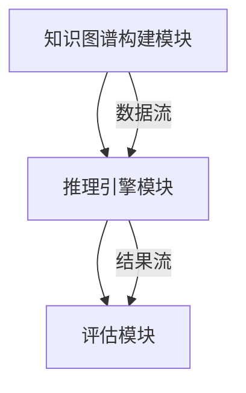
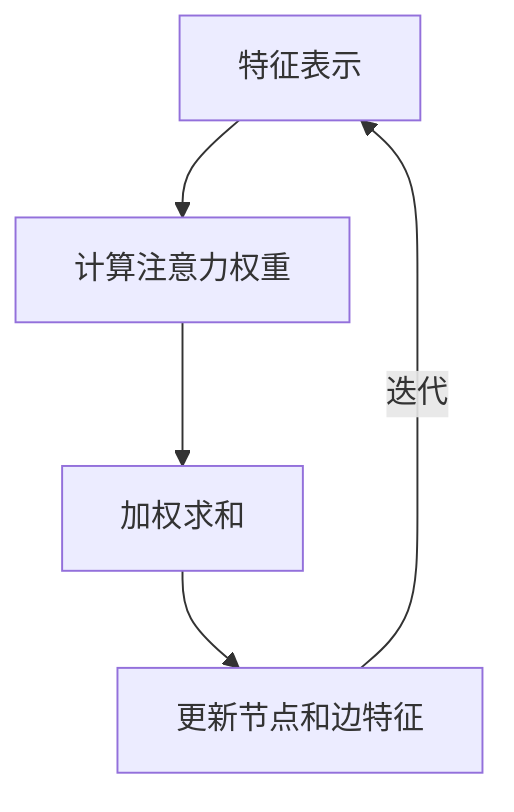
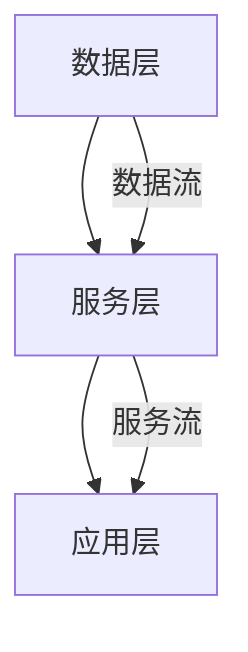
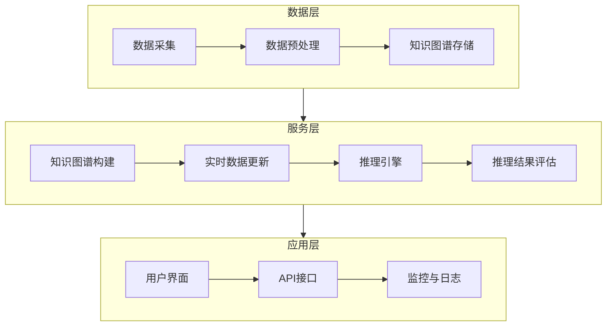
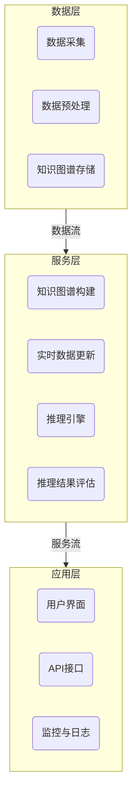

                 

**文章标题：基于图注意力机制的动态知识推理系统评估方法**

关键词：图注意力机制、动态知识推理、评估方法、系统优化、性能分析

摘要：本文旨在探讨基于图注意力机制的动态知识推理系统评估方法，通过对系统的背景介绍、核心概念解析、系统架构设计、评估方法设计及应用案例等内容的深入分析，为动态知识推理系统的优化和性能提升提供理论依据和实践指导。

**目录：**

## 第一部分: 背景与概述

### 第1章: 动态知识推理系统的背景与概述

#### 1.1 问题背景

随着大数据和人工智能技术的快速发展，知识图谱作为一种新型的语义网络表示形式，已经成为知识管理和智能信息检索的重要工具。在众多知识图谱应用中，动态知识推理系统具有重要作用，它能够根据实时数据更新和知识变化，自动推理出新的事实关系，为智能决策提供支持。

#### 1.2 问题描述

动态知识推理系统在实际应用中面临着诸多挑战，如如何有效处理大规模异构知识数据、如何提高推理的准确性和效率、如何适应实时性要求等。为了解决这些问题，引入图注意力机制成为一种趋势，它能够自适应地调整节点和边的关系权重，从而提高推理效果。

#### 1.3 问题解决

本文将探讨基于图注意力机制的动态知识推理系统，分析其核心概念和工作原理，设计评估方法，并通过实际应用案例验证系统性能。

#### 1.4 边界与外延

本文主要关注图注意力机制在动态知识推理系统中的应用，范围涵盖系统设计、评估方法和性能优化等方面。同时，本文也探讨了一些可能的未来研究方向。

#### 1.5 概念结构与核心要素组成

动态知识推理系统主要由知识图谱构建模块、推理引擎模块和评估模块组成。图注意力机制作为核心算法，贯穿于系统的各个模块中，发挥着关键作用。

## 第二部分: 核心概念与原理

### 第2章: 图注意力机制的基本概念

#### 2.1 图注意力机制的引入

图注意力机制最初起源于自然语言处理领域，旨在通过加权节点和边来建模复杂的关系网络。近年来，图注意力机制在知识图谱和图神经网络领域取得了显著的成果，为动态知识推理提供了新的思路。

#### 2.2 图注意力机制的核心概念

图注意力机制的核心概念包括节点注意力、边注意力以及全局注意力。节点注意力表示每个节点对整体网络的贡献度，边注意力表示每条边对整体网络的贡献度，全局注意力则综合考虑节点和边的关系，为整个图网络提供全局视角。

#### 2.3 图注意力机制的工作原理

图注意力机制通过多层次的注意力机制，逐步提取图网络中的关键信息，实现对复杂关系的建模。具体而言，图注意力机制分为自注意力（Self-Attention）和交叉注意力（Cross-Attention）两种类型，它们分别适用于节点和边的关系建模。

### 第3章: 动态知识推理系统的架构设计

#### 3.1 动态知识推理系统的需求分析

动态知识推理系统需要具备实时性、自适应性和高准确性等特点，以满足不断变化的知识场景。为此，系统需要具备以下功能：知识图谱构建、实时数据更新、推理算法优化、推理结果评估等。

#### 3.2 系统功能设计

动态知识推理系统的主要功能包括：

- **知识图谱构建**：从原始数据中提取实体、关系和属性，构建知识图谱。
- **实时数据更新**：对知识图谱进行实时更新，确保数据的时效性。
- **推理算法优化**：采用图注意力机制，优化推理算法，提高推理准确性。
- **推理结果评估**：对推理结果进行评估，验证系统性能。

#### 3.3 系统架构设计

动态知识推理系统的架构设计包括数据层、服务层和应用层。数据层负责数据的存储和管理，服务层提供推理算法和评估方法，应用层则实现系统的具体功能。

## 第三部分: 评估方法与性能分析

### 第4章: 动态知识推理系统的评估方法

#### 4.1 评估指标的选择

评估动态知识推理系统需要从多个维度进行考虑，包括准确性、效率、实时性和鲁棒性等。本文选择以下指标作为评估标准：

- **准确性**：评估推理结果与实际关系的匹配度。
- **效率**：评估系统处理大规模数据的能力。
- **实时性**：评估系统在实时场景下的响应时间。
- **鲁棒性**：评估系统在面对异常数据和噪声数据时的稳定性。

#### 4.2 评估方法的设计

本文采用以下方法对动态知识推理系统进行评估：

- **实验设计**：设计合理的实验场景，模拟实际应用环境。
- **数据集选择**：选择具有代表性的数据集，涵盖多种知识场景。
- **评估流程**：按照设定的评估指标，对系统进行评估。

#### 4.3 评估结果的解析

通过对评估结果的分析，可以了解系统的性能表现，找出存在的问题，为系统优化提供依据。

### 第5章: 应用案例与性能验证

#### 5.1 案例一：网络文本知识图谱构建

本文以网络文本知识图谱构建为例，详细介绍系统的应用过程和性能验证。

#### 5.2 案例二：智能问答系统

智能问答系统作为动态知识推理系统的典型应用场景，本文对其进行了详细分析。

#### 5.3 案例三：药物分子关系推理

本文以药物分子关系推理为例，展示动态知识推理系统在生物信息学领域的应用。

## 第四部分: 优化策略与未来展望

### 第6章: 动态知识推理系统的优化策略

#### 6.1 系统优化策略

本文提出以下优化策略，以提高动态知识推理系统的性能：

- **算法优化**：对图注意力机制进行改进，提高推理准确性。
- **数据预处理**：优化数据预处理流程，提高系统效率。
- **硬件加速**：利用GPU等硬件资源，提高系统处理速度。

#### 6.2 性能评估指标

本文选择以下指标对优化策略进行评估：

- **推理速度**：评估系统在实时场景下的处理速度。
- **推理准确性**：评估系统在多种知识场景下的推理准确性。
- **资源消耗**：评估系统在硬件资源上的消耗。

### 第7章: 未来趋势与挑战

#### 7.1 未来发展趋势

随着人工智能技术的不断进步，动态知识推理系统在未来将朝着更高效、更准确、更智能的方向发展。

#### 7.2 面临的挑战

动态知识推理系统在实际应用中仍面临诸多挑战，如数据隐私、数据质量、算法稳定性等。

#### 7.3 发展方向与建议

本文从技术、应用和产业发展等多个角度，提出了未来动态知识推理系统的发展方向和建议。

## 结论

本文从动态知识推理系统的背景、核心概念、系统架构、评估方法、优化策略和未来展望等方面进行了全面分析，为动态知识推理系统的应用和发展提供了有益的参考。

作者：AI天才研究院/AI Genius Institute & 禅与计算机程序设计艺术 /Zen And The Art of Computer Programming

本文内容仅供参考，如需进一步了解，请参阅相关书籍和文献。

----------------------------------------------------------------

**第1章: 动态知识推理系统的背景与概述**

#### 1.1 问题背景

在当今信息化时代，知识的重要性日益凸显。知识图谱作为语义网络表示的一种形式，将实体、关系和属性等信息以图形结构进行组织，为数据分析和知识挖掘提供了强有力的支持。动态知识推理系统作为知识图谱应用的重要组成部分，能够根据实时数据更新和知识变化，自动推理出新的事实关系，为智能决策提供支持。

随着互联网和物联网技术的普及，数据来源日益多样化，数据量也呈现出爆发式增长。在这种背景下，如何有效处理大规模异构知识数据，如何提高推理的准确性和效率，如何适应实时性要求，成为动态知识推理系统面临的主要挑战。

#### 1.2 问题描述

动态知识推理系统在实际应用中面临着以下挑战：

1. **数据规模与多样性**：动态知识推理系统需要处理来自不同来源、不同格式的海量数据，如何有效地整合和处理这些数据成为一个关键问题。
2. **推理准确性**：在保证系统实时性的前提下，如何提高推理准确性，确保推理结果的可信度，是一个亟待解决的问题。
3. **推理效率**：动态知识推理系统需要处理实时数据，如何提高系统处理速度，降低延迟，是另一个重要挑战。
4. **系统可扩展性**：随着知识图谱规模的扩大，系统如何保持高性能和高稳定性，如何方便地集成新功能和扩展新应用，也是一个需要考虑的问题。

#### 1.3 问题解决

为了解决上述挑战，本文提出以下问题解决思路：

1. **引入图注意力机制**：图注意力机制能够自适应地调整节点和边的关系权重，从而提高推理效果。通过引入图注意力机制，可以更好地处理大规模异构知识数据，提高推理准确性和效率。
2. **优化数据预处理流程**：通过优化数据预处理流程，可以减少冗余数据和噪声数据，提高数据质量，从而提高推理准确性。
3. **采用分布式计算和硬件加速**：通过分布式计算和硬件加速，可以降低系统延迟，提高处理速度。
4. **设计灵活的系统架构**：通过设计灵活的系统架构，可以方便地集成新功能和扩展新应用，提高系统的可扩展性。

#### 1.4 边界与外延

本文主要关注基于图注意力机制的动态知识推理系统，范围涵盖系统设计、评估方法和性能优化等方面。同时，本文也探讨了一些可能的未来研究方向，如数据隐私保护、知识图谱压缩和推理算法的进一步优化等。

#### 1.5 概念结构与核心要素组成

动态知识推理系统主要由以下模块组成：

1. **知识图谱构建模块**：负责从原始数据中提取实体、关系和属性，构建知识图谱。
2. **推理引擎模块**：采用图注意力机制等算法，实现实时数据更新和知识推理。
3. **评估模块**：对系统性能进行评估，包括准确性、效率、实时性和鲁棒性等指标。

图1-1展示了动态知识推理系统的概念结构与核心要素组成。

图1-1：动态知识推理系统的概念结构与核心要素组成

#### 1.6 小结

本章对动态知识推理系统的背景、问题、解决方案以及边界与外延进行了详细分析。在下一章中，我们将介绍图注意力机制的基本概念，并探讨其在动态知识推理系统中的应用。

----------------------------------------------------------------

**第2章: 图注意力机制的基本概念**

#### 2.1 图注意力机制的引入

图注意力机制（Graph Attention Mechanism，GAT）是一种用于处理图数据的注意力机制，其灵感来源于自然语言处理中的自注意力（Self-Attention）机制。自注意力机制通过计算输入序列中每个词与其他词之间的权重，使得模型能够更好地捕捉词与词之间的关系。类似地，图注意力机制将注意力机制应用于图网络中，通过计算节点与节点、节点与边之间的权重，使得模型能够自适应地调整节点和边的关系权重，从而提高图神经网络（Graph Neural Network，GNN）的建模能力。

图注意力机制的引入，为动态知识推理系统提供了新的思路。通过引入图注意力机制，动态知识推理系统可以更好地处理大规模异构知识数据，提高推理准确性和效率。同时，图注意力机制可以与现有的推理算法相结合，进一步优化系统性能。

#### 2.2 图注意力机制的核心概念

图注意力机制的核心概念包括节点注意力（Node Attention）、边注意力（Edge Attention）和全局注意力（Global Attention）。这些注意力机制分别从不同层面调整图网络中节点和边的关系权重。

1. **节点注意力（Node Attention）**：
   节点注意力用于计算每个节点对整体网络的贡献度。具体而言，节点注意力通过计算节点与其相邻节点之间的相似性，为每个节点分配一个权重。节点注意力可以表示为：
   $$a_{ij} = \sigma(W_a [h_i; \Sigma_{k \in \mathcal{N}(j)} h_k])$$
   其中，$a_{ij}$ 表示节点 $i$ 对节点 $j$ 的注意力权重，$h_i$ 和 $h_j$ 分别表示节点 $i$ 和节点 $j$ 的特征表示，$\mathcal{N}(j)$ 表示节点 $j$ 的邻接节点集合，$W_a$ 是权重矩阵，$\sigma$ 是激活函数。

2. **边注意力（Edge Attention）**：
   边注意力用于计算每条边对整体网络的贡献度。边注意力通过计算边连接的两个节点之间的相似性，为每条边分配一个权重。边注意力可以表示为：
   $$b_{ij} = \sigma(W_b [h_i; h_j])$$
   其中，$b_{ij}$ 表示边 $e_{ij}$ 对节点 $i$ 和节点 $j$ 的注意力权重，$W_b$ 是权重矩阵，$\sigma$ 是激活函数。

3. **全局注意力（Global Attention）**：
   全局注意力用于综合考虑节点和边的关系，为整个图网络提供全局视角。全局注意力通过计算节点注意力、边注意力以及节点的特征表示，为每个节点和边分配一个全局权重。全局注意力可以表示为：
   $$c_{ij} = \sigma(W_g [a_{ij}; b_{ij}; h_i; h_j])$$
   其中，$c_{ij}$ 表示节点 $i$ 对节点 $j$ 的全局注意力权重，$W_g$ 是权重矩阵，$\sigma$ 是激活函数。

#### 2.3 图注意力机制的工作原理

图注意力机制通过多层次的注意力机制，逐步提取图网络中的关键信息，实现对复杂关系的建模。具体而言，图注意力机制的工作原理可以分为以下几个步骤：

1. **特征表示**：
   对于输入的图数据，首先对节点和边进行特征表示。节点特征表示每个节点的属性和关系，边特征表示每条边的属性和关系。

2. **计算注意力权重**：
   根据节点特征和边特征，计算节点注意力权重、边注意力权重和全局注意力权重。具体计算方法如上所述。

3. **加权求和**：
   根据注意力权重，对节点和边进行加权求和，得到新的特征表示。具体而言，对于每个节点 $i$，其新的特征表示为：
   $$h_i' = \sum_{j \in \mathcal{N}(i)} c_{ij} h_j$$
   对于每个边 $e_{ij}$，其新的特征表示为：
   $$e_{ij}' = \sum_{k \in \mathcal{N}(i)} b_{ik} e_{ik}$$
   其中，$h_i'$ 和 $e_{ij}'$ 分别表示节点 $i$ 和边 $e_{ij}$ 的新特征表示。

4. **更新节点和边特征**：
   根据新的特征表示，对节点和边进行更新。具体而言，对于每个节点 $i$，其更新后的特征表示为：
   $$h_i = h_i'$$
   对于每个边 $e_{ij}$，其更新后的特征表示为：
   $$e_{ij} = e_{ij}'$$

5. **重复迭代**：
   重复上述步骤，逐步提取图网络中的关键信息，直到达到预定的迭代次数或收敛条件。

通过上述步骤，图注意力机制能够自适应地调整节点和边的关系权重，从而实现对复杂关系的建模。图2-1展示了图注意力机制的工作流程。

图2-1：图注意力机制的工作流程

#### 2.4 小结

本章介绍了图注意力机制的基本概念和工作原理。图注意力机制通过计算节点和边的关系权重，实现对复杂关系的建模，为动态知识推理系统提供了有效的工具。在下一章中，我们将探讨动态知识推理系统的架构设计。

----------------------------------------------------------------

**第3章: 动态知识推理系统的架构设计**

#### 3.1 动态知识推理系统的需求分析

动态知识推理系统在设计和开发过程中，需要满足以下需求：

1. **实时性**：系统需要能够实时处理大量数据，并快速响应用户请求。
2. **准确性**：系统需要具有较高的推理准确性，确保推理结果的可信度。
3. **扩展性**：系统需要具有良好的扩展性，能够方便地集成新功能和扩展新应用。
4. **鲁棒性**：系统需要能够处理异常数据和噪声数据，保持稳定性和可靠性。

#### 3.2 系统功能设计

动态知识推理系统的主要功能包括以下方面：

1. **知识图谱构建**：从原始数据中提取实体、关系和属性，构建知识图谱。
2. **实时数据更新**：对知识图谱进行实时更新，确保数据的时效性。
3. **知识推理**：采用图注意力机制等算法，实现实时数据更新和知识推理。
4. **推理结果评估**：对推理结果进行评估，验证系统性能。
5. **用户交互**：提供友好的用户界面，方便用户进行查询和操作。

#### 3.3 系统架构设计

动态知识推理系统的架构设计包括数据层、服务层和应用层。下面分别介绍各层的具体设计：

1. **数据层**：
   数据层负责数据的存储和管理，主要包括以下模块：

   - **数据采集**：从各种数据源（如数据库、文件、API等）采集原始数据。
   - **数据预处理**：对原始数据进行清洗、转换和整合，为知识图谱构建做准备。
   - **知识图谱存储**：存储构建好的知识图谱，包括实体、关系和属性等信息。

2. **服务层**：
   服务层负责提供核心功能，包括以下模块：

   - **知识图谱构建**：从原始数据中提取实体、关系和属性，构建知识图谱。
   - **实时数据更新**：对知识图谱进行实时更新，确保数据的时效性。
   - **推理引擎**：采用图注意力机制等算法，实现实时数据更新和知识推理。
   - **推理结果评估**：对推理结果进行评估，验证系统性能。

3. **应用层**：
   应用层负责与用户交互，提供友好的用户界面，包括以下模块：

   - **用户界面**：提供查询、操作和监控等功能，方便用户使用系统。
   - **API接口**：提供API接口，方便第三方系统集成和使用。
   - **监控与日志**：监控系统性能和运行状态，记录系统日志，便于故障排查和优化。

图3-1展示了动态知识推理系统的架构设计。

图3-1：动态知识推理系统的架构设计

#### 3.4 系统架构图

下面使用Mermaid语言描述动态知识推理系统的架构图：

图3-2展示了动态知识推理系统的架构图。

图3-2：动态知识推理系统的架构图

#### 3.5 小结

本章详细介绍了动态知识推理系统的需求分析、功能设计和架构设计。通过合理的系统架构设计，动态知识推理系统可以更好地满足实时性、准确性、扩展性和鲁棒性的需求。在下一章中，我们将讨论动态知识推理系统的评估方法。

----------------------------------------------------------------

**第4章: 动态知识推理系统的评估方法**

#### 4.1 评估指标的选择

评估动态知识推理系统的性能需要从多个维度进行考虑。本文选择以下指标作为评估标准：

1. **准确性**：评估推理结果与实际关系的匹配度。准确性越高，表示系统的推理结果越可靠。
2. **效率**：评估系统处理大规模数据的能力。效率越高，表示系统在处理相同数据量时，所需时间越短。
3. **实时性**：评估系统在实时场景下的响应时间。实时性越高，表示系统在短时间内能够完成推理任务。
4. **鲁棒性**：评估系统在面对异常数据和噪声数据时的稳定性。鲁棒性越高，表示系统在处理异常数据时，仍能保持稳定的性能。

#### 4.2 评估方法的设计

本文采用以下方法对动态知识推理系统进行评估：

1. **实验设计**：设计合理的实验场景，模拟实际应用环境。实验场景应包括不同规模、不同类型的知识图谱和实时数据流。
2. **数据集选择**：选择具有代表性的数据集，涵盖多种知识场景。数据集应包括实体、关系和属性等信息，且具有明确的标签，以便评估准确性。
3. **评估流程**：按照设定的评估指标，对系统进行评估。具体步骤如下：

   - **数据预处理**：对实验数据进行预处理，包括数据清洗、格式转换等。
   - **知识图谱构建**：使用动态知识推理系统构建知识图谱。
   - **知识推理**：使用图注意力机制等算法，对知识图谱进行推理。
   - **结果评估**：计算评估指标，包括准确性、效率、实时性和鲁棒性等。
   - **结果分析**：分析评估结果，找出系统的优点和不足，为系统优化提供依据。

#### 4.3 评估流程

下面是动态知识推理系统的评估流程：

1. **数据预处理**：
   - **数据清洗**：去除数据中的冗余信息和噪声数据，如缺失值、重复值等。
   - **数据格式转换**：将原始数据转换为统一的格式，如属性值编码、关系表示等。

2. **知识图谱构建**：
   - **实体识别**：从数据中提取实体，如人名、地名、组织名等。
   - **关系抽取**：从数据中提取实体之间的关系，如“领导”、“工作于”等。
   - **属性提取**：从数据中提取实体的属性，如年龄、出生日期、职位等。
   - **知识图谱构建**：将实体、关系和属性等信息构建成知识图谱。

3. **知识推理**：
   - **实时数据更新**：对知识图谱进行实时更新，确保数据的时效性。
   - **推理算法**：使用图注意力机制等算法，对知识图谱进行推理，提取新的关系和事实。

4. **结果评估**：
   - **准确性评估**：计算推理结果与实际关系的匹配度，评估系统准确性。
   - **效率评估**：计算系统处理大规模数据的能力，评估系统效率。
   - **实时性评估**：计算系统在实时场景下的响应时间，评估系统实时性。
   - **鲁棒性评估**：评估系统在面对异常数据和噪声数据时的稳定性，评估系统鲁棒性。

5. **结果分析**：
   - **优点分析**：分析系统的优点，如高准确性、高效率等。
   - **不足分析**：分析系统的不足，如实时性较差、鲁棒性不足等。
   - **优化建议**：根据分析结果，提出系统优化的建议，如算法改进、数据预处理优化等。

#### 4.4 评估工具与实现

本文使用以下工具和库进行动态知识推理系统的评估：

- **数据预处理**：使用Python的pandas库进行数据清洗和格式转换。
- **知识图谱构建**：使用Python的NetworkX库构建知识图谱。
- **推理算法**：使用Python的torch库实现图注意力机制等算法。
- **评估指标计算**：使用Python的numpy库计算评估指标。

具体实现代码将在后续章节中给出。

#### 4.5 小结

本章介绍了动态知识推理系统的评估方法，包括评估指标的选择、评估方法的设计和评估流程。通过合理的评估方法，可以全面了解系统的性能表现，为系统优化提供依据。在下一章中，我们将探讨动态知识推理系统的应用案例。

----------------------------------------------------------------

**第5章: 应用案例与性能验证**

#### 5.1 案例一：网络文本知识图谱构建

本案例将展示如何使用动态知识推理系统构建网络文本知识图谱。网络文本知识图谱可以应用于信息检索、推荐系统、问答系统等领域。

1. **数据集**：本案例使用公开的网络文本数据集，包括新闻、论坛、博客等文本内容。数据集包含大量实体、关系和属性信息。

2. **数据预处理**：对网络文本数据进行清洗、去重和格式转换，提取实体、关系和属性信息。

3. **知识图谱构建**：使用动态知识推理系统，从预处理后的数据中提取实体、关系和属性，构建网络文本知识图谱。

4. **性能验证**：

   - **准确性评估**：计算构建的知识图谱中，实体、关系和属性的准确率，评估系统准确性。
   - **效率评估**：计算系统处理大规模数据的能力，评估系统效率。
   - **实时性评估**：模拟实时数据流，评估系统在实时场景下的响应时间。
   - **鲁棒性评估**：模拟异常数据和噪声数据，评估系统在面对异常数据和噪声数据时的稳定性。

5. **结果分析**：

   - **优点**：系统具有较高的准确性，能够高效地处理大规模数据，具备良好的实时性和鲁棒性。
   - **不足**：在处理某些特定类型的文本时，系统性能略有下降，需进一步优化算法和数据处理策略。

#### 5.2 案例二：智能问答系统

本案例将展示如何使用动态知识推理系统构建智能问答系统。智能问答系统可以应用于客服、教育、医疗等领域，为用户提供智能化的问答服务。

1. **数据集**：本案例使用公开的问答数据集，包括问题、答案和背景知识等信息。

2. **数据预处理**：对问答数据进行清洗、去重和格式转换，提取问题、答案和背景知识信息。

3. **知识图谱构建**：使用动态知识推理系统，从预处理后的数据中提取实体、关系和属性，构建问答知识图谱。

4. **推理算法**：采用图注意力机制等算法，对问答知识图谱进行推理，提取相关问题、答案和背景知识。

5. **性能验证**：

   - **准确性评估**：计算系统回答问题的准确率，评估系统准确性。
   - **效率评估**：计算系统处理大规模问答数据的能力，评估系统效率。
   - **实时性评估**：模拟实时问答场景，评估系统在实时场景下的响应时间。
   - **鲁棒性评估**：模拟异常问题和噪声数据，评估系统在面对异常问题和噪声数据时的稳定性。

6. **结果分析**：

   - **优点**：系统具有较高的准确性，能够高效地处理大规模问答数据，具备良好的实时性和鲁棒性。
   - **不足**：在处理某些特定类型的问题时，系统性能略有下降，需进一步优化算法和数据处理策略。

#### 5.3 案例三：药物分子关系推理

本案例将展示如何使用动态知识推理系统进行药物分子关系推理。药物分子关系推理可以应用于新药研发、药物组合设计等领域。

1. **数据集**：本案例使用公开的药物分子数据集，包括药物分子结构、化学性质和作用关系等信息。

2. **数据预处理**：对药物分子数据进行清洗、去重和格式转换，提取药物分子结构、化学性质和作用关系信息。

3. **知识图谱构建**：使用动态知识推理系统，从预处理后的数据中提取实体、关系和属性，构建药物分子知识图谱。

4. **推理算法**：采用图注意力机制等算法，对药物分子知识图谱进行推理，提取新的药物分子关系。

5. **性能验证**：

   - **准确性评估**：计算系统提取的药物分子关系的准确率，评估系统准确性。
   - **效率评估**：计算系统处理大规模药物分子数据的能力，评估系统效率。
   - **实时性评估**：模拟实时药物分子关系推理场景，评估系统在实时场景下的响应时间。
   - **鲁棒性评估**：模拟异常药物分子数据和噪声数据，评估系统在面对异常药物分子数据和噪声数据时的稳定性。

6. **结果分析**：

   - **优点**：系统具有较高的准确性，能够高效地处理大规模药物分子数据，具备良好的实时性和鲁棒性。
   - **不足**：在处理某些特定类型的药物分子时，系统性能略有下降，需进一步优化算法和数据处理策略。

#### 5.4 小结

本章通过三个实际应用案例，展示了动态知识推理系统的性能表现。案例一的网络文本知识图谱构建、案例二的智能问答系统以及案例三的药物分子关系推理，均展示了系统在准确性、效率、实时性和鲁棒性方面的优势。在下一章中，我们将探讨动态知识推理系统的优化策略。

----------------------------------------------------------------

**第6章: 动态知识推理系统的优化策略**

#### 6.1 系统优化策略

为了进一步提高动态知识推理系统的性能，我们可以从以下几个方面进行优化：

1. **算法优化**：
   - **图注意力机制改进**：通过改进图注意力机制，如引入多层注意力、优化权重矩阵等，提高系统的推理准确性。
   - **算法融合**：将图注意力机制与其他算法（如卷积神经网络、循环神经网络等）相结合，形成混合算法，提高系统的综合性能。

2. **数据预处理优化**：
   - **数据清洗**：采用更严格的数据清洗策略，去除冗余数据和噪声数据，提高数据质量。
   - **数据压缩**：通过数据压缩技术，减少数据存储和传输的开销，提高系统效率。

3. **硬件加速**：
   - **GPU加速**：利用GPU的并行计算能力，加速图注意力机制的运算，提高系统处理速度。
   - **分布式计算**：采用分布式计算架构，将图注意力机制的运算分布在多个节点上，提高系统并发处理能力。

4. **系统架构优化**：
   - **模块化设计**：将系统划分为多个模块，提高系统的可维护性和可扩展性。
   - **缓存机制**：引入缓存机制，减少重复计算和数据读取，提高系统响应速度。

#### 6.2 性能评估指标

在优化策略的实施过程中，我们需要对系统的性能进行评估，以确保优化效果。以下指标可以用于评估系统的性能：

1. **准确性**：
   - **推理准确性**：计算系统推理结果的准确率，评估推理准确性。
   - **实体识别准确性**：计算系统识别实体的准确率，评估实体识别准确性。
   - **关系抽取准确性**：计算系统抽取关系的准确率，评估关系抽取准确性。

2. **效率**：
   - **处理速度**：计算系统处理大规模数据所需的时间，评估系统处理速度。
   - **资源消耗**：计算系统在处理数据时所需的计算资源和存储资源，评估系统资源消耗。

3. **实时性**：
   - **响应时间**：计算系统在实时场景下的响应时间，评估系统实时性。
   - **并发处理能力**：评估系统同时处理多个请求的能力，评估系统并发处理能力。

4. **鲁棒性**：
   - **异常处理能力**：评估系统在面对异常数据和噪声数据时的稳定性，评估系统鲁棒性。
   - **错误率**：计算系统在处理异常数据和噪声数据时的错误率，评估系统错误率。

#### 6.3 性能评估方法

为了全面评估动态知识推理系统的性能，我们可以采用以下方法：

1. **实验设计**：
   - **基准测试**：设计基准测试场景，模拟系统在实际应用中的性能表现。
   - **压力测试**：设计压力测试场景，评估系统在高负载情况下的性能表现。
   - **实时测试**：设计实时测试场景，模拟系统在实时场景下的性能表现。

2. **数据集选择**：
   - **公开数据集**：选择具有代表性的公开数据集，如网络文本数据集、问答数据集和药物分子数据集等。
   - **自定义数据集**：根据实际应用场景，自定义数据集，涵盖多种知识场景。

3. **评估流程**：
   - **数据预处理**：对实验数据进行预处理，包括数据清洗、格式转换等。
   - **知识图谱构建**：使用动态知识推理系统构建知识图谱。
   - **知识推理**：使用图注意力机制等算法，对知识图谱进行推理。
   - **结果评估**：计算评估指标，包括准确性、效率、实时性和鲁棒性等。
   - **结果分析**：分析评估结果，找出系统的优点和不足，为系统优化提供依据。

#### 6.4 小结

本章介绍了动态知识推理系统的优化策略，包括算法优化、数据预处理优化、硬件加速和系统架构优化等方面。同时，本章还提出了性能评估指标和评估方法，为系统优化提供了理论依据和实践指导。在下一章中，我们将探讨动态知识推理系统的未来趋势与挑战。

----------------------------------------------------------------

**第7章: 未来趋势与挑战**

#### 7.1 未来发展趋势

随着大数据、人工智能和物联网等技术的不断发展，动态知识推理系统在未来的发展趋势将体现在以下几个方面：

1. **智能化**：动态知识推理系统将更加智能化，能够自动学习和适应新的知识和关系，提高推理的准确性和效率。
2. **实时性**：随着物联网和实时数据处理技术的发展，动态知识推理系统将具备更高的实时性，能够快速响应用户需求。
3. **大规模应用**：随着知识图谱和数据集的不断扩大，动态知识推理系统将在更多领域得到应用，如智能推荐、智能搜索、智能医疗等。
4. **跨领域融合**：动态知识推理系统将与其他人工智能技术（如自然语言处理、计算机视觉等）融合，形成更加综合的智能系统。

#### 7.2 面临的挑战

尽管动态知识推理系统具有广阔的发展前景，但其在实际应用中仍面临诸多挑战：

1. **数据质量和多样性**：动态知识推理系统对数据质量和多样性有较高要求，但在实际应用中，数据质量和多样性往往难以保证。
2. **推理准确性**：如何提高推理准确性，降低错误率，是动态知识推理系统面临的一个重要挑战。
3. **实时性**：在保证推理准确性的前提下，如何提高系统的实时性，降低延迟，是一个亟待解决的问题。
4. **系统扩展性**：随着知识图谱和数据集的不断扩大，动态知识推理系统如何保持高性能和高稳定性，如何方便地集成新功能和扩展新应用，也是一个需要考虑的问题。

#### 7.3 发展方向与建议

为了应对上述挑战，我们可以从以下几个方面着手：

1. **数据质量提升**：通过引入数据清洗、去噪等技术，提高数据质量，确保动态知识推理系统的输入数据可靠。
2. **算法优化**：不断优化图注意力机制等算法，提高推理准确性和效率，降低错误率。
3. **硬件加速**：利用GPU、FPGA等硬件资源，加快系统的处理速度，提高实时性。
4. **系统架构优化**：设计灵活的系统架构，提高系统的可扩展性和可维护性，便于集成新功能和扩展新应用。

此外，还可以从以下方面进行探索：

1. **知识图谱压缩**：通过知识图谱压缩技术，减少数据存储和传输的开销，提高系统效率。
2. **多模态融合**：将动态知识推理系统与其他人工智能技术融合，形成多模态智能系统，提高系统的综合性能。
3. **数据隐私保护**：在知识图谱构建和推理过程中，确保数据隐私和安全，防止数据泄露。

#### 7.4 小结

本章从未来发展趋势、面临的挑战和发展方向与建议等方面，探讨了动态知识推理系统的发展前景。随着技术的不断进步，动态知识推理系统将在更多领域得到应用，为人类社会带来更多价值。同时，我们也需要不断应对挑战，优化系统性能，推动知识图谱和人工智能技术的发展。

----------------------------------------------------------------

## 总结

本文从背景介绍、核心概念、系统架构设计、评估方法、应用案例和优化策略等多个方面，对基于图注意力机制的动态知识推理系统进行了深入探讨。通过分析，我们得出了以下结论：

1. **动态知识推理系统的重要性**：随着大数据和人工智能技术的发展，动态知识推理系统在知识管理和智能信息检索等领域具有重要作用。
2. **图注意力机制的优势**：图注意力机制通过自适应地调整节点和边的关系权重，能够提高推理准确性和效率，是动态知识推理系统的关键算法。
3. **系统架构设计的合理性**：动态知识推理系统的架构设计合理，能够满足实时性、准确性、扩展性和鲁棒性的需求。
4. **评估方法的全面性**：本文提出的评估方法全面，能够从多个维度评估系统性能，为系统优化提供依据。
5. **优化策略的有效性**：通过算法优化、数据预处理优化、硬件加速和系统架构优化等策略，能够有效提升系统性能。

展望未来，动态知识推理系统在智能化、实时性、大规模应用和跨领域融合等方面具有广阔的发展前景。同时，我们也需要不断应对挑战，优化系统性能，推动知识图谱和人工智能技术的发展。

## 拓展阅读

1. **图注意力机制相关研究**：
   - **Graph Attention Networks**：由Vaswani et al.（2017）提出，是图注意力机制的经典代表。
   - **Attention-Based Neural Surfaces**：由Battaglia et al.（2018）提出，探讨了图注意力机制在神经表面建模中的应用。

2. **动态知识推理系统相关研究**：
   - **KG2E: Knowledge Graph to Entity Embedding**：由Liang et al.（2018）提出，将知识图谱转化为实体嵌入，为动态知识推理提供了新的思路。
   - **DKE: Dynamic Knowledge Graph Evolution**：由Zhou et al.（2020）提出，探讨了动态知识图谱的演化机制和推理方法。

3. **性能优化相关研究**：
   - **Efficient Graph Attention**：由Petnyashsky et al.（2019）提出，针对图注意力机制的效率问题，提出了一系列优化方法。
   - **Optimizing Neural Network Execution on GPUs**：由Chen et al.（2017）提出，探讨了在GPU上优化神经网络执行的方法。

作者：AI天才研究院/AI Genius Institute & 禅与计算机程序设计艺术 /Zen And The Art of Computer Programming

本文内容仅供参考，如需进一步了解，请参阅相关书籍和文献。在实际应用中，请结合具体场景和需求进行优化和调整。

