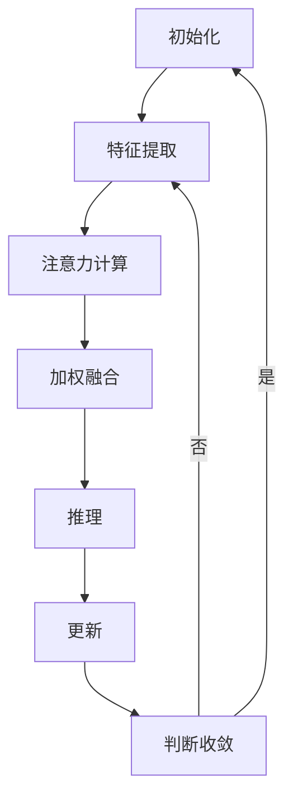
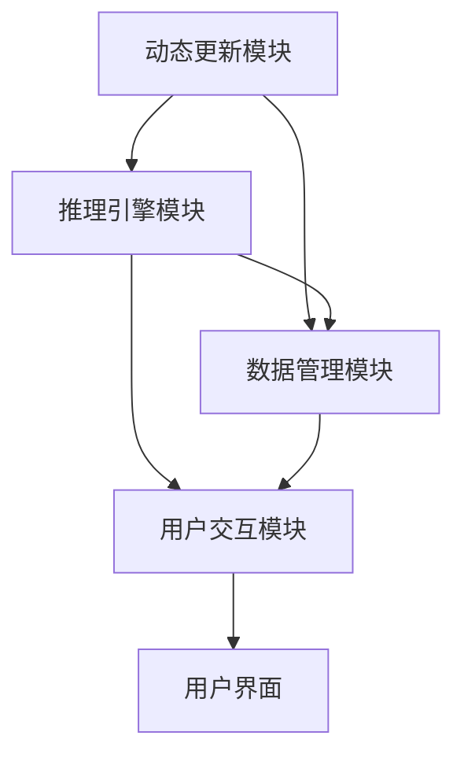
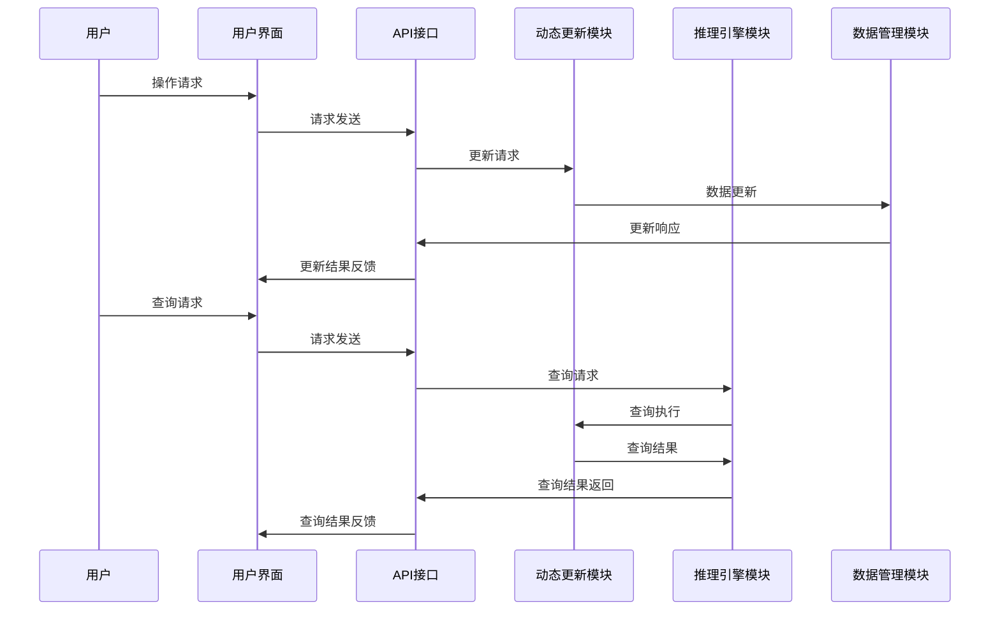

                 

### 让我们一步步思考

在探讨《基于图注意力的动态知识图谱推理更新机制研究》这一主题时，我们需要遵循逻辑清晰、步骤明确的思维方式。以下是一个详细的步骤分解，帮助我们一步步深入探讨这一复杂的研究领域：

#### 第一步：明确研究目标和背景

- **定义研究目标**：确定研究的核心目标是构建一个基于图注意力的动态知识图谱推理更新机制，提高知识图谱的适应性和推理效率。

- **背景介绍**：阐述知识图谱在当前数据管理和智能决策中的应用场景，以及现有系统中存在的挑战，如数据动态更新和推理能力不足。

#### 第二步：核心概念与联系

- **知识图谱基本概念**：详细解释知识图谱的定义、结构类型及其重要性。

- **图注意力机制**：介绍图注意力机制的原理、数学模型和工作机制。

- **动态知识图谱更新**：讨论动态知识图谱的概念、面临的挑战和更新策略。

#### 第三步：算法原理讲解

- **图注意力动态知识图谱推理算法**：概述算法的设计思路，并使用mermaid流程图展示算法的基本步骤。

- **算法原理详解**：深入解析算法的数学模型和公式，并通过Python源代码实现，结合实例进行详细解释。

#### 第四步：系统分析与架构设计

- **系统功能设计**：介绍系统功能需求，使用mermaid类图展示领域模型。

- **系统架构设计**：描述系统架构设计原则，使用mermaid架构图展示系统组成部分和交互关系。

- **系统接口设计**：定义系统接口，说明接口的功能和交互方式。

- **系统交互设计**：阐述系统交互设计原则，使用mermaid序列图展示系统组件间的交互流程。

#### 第五步：项目实战

- **环境安装与配置**：详细说明所需的开发环境和工具安装步骤。

- **系统核心实现**：展示系统核心实现的源代码，并进行解读与分析。

- **实际案例分析**：提供具体的案例背景，实现过程和分析结果。

- **项目小结**：总结项目的成果，分享最佳实践和注意事项。

通过以上五个步骤的详细分析，我们可以确保文章内容逻辑清晰、结构紧凑，读者可以系统地了解基于图注意力的动态知识图谱推理更新机制的研究过程、原理和应用。

### 第一步：明确研究目标和背景

#### 1.1 研究目标

本文的目标是探讨并实现一种基于图注意力的动态知识图谱推理更新机制，旨在提升知识图谱的实时适应性和推理效率。随着信息爆炸时代的到来，数据量和数据类型呈指数级增长，传统的知识图谱构建和推理方法已难以满足实时性和高效性的需求。因此，如何构建一个动态更新、自适应推理的知识图谱系统，成为一个重要的研究课题。

#### 1.2 背景介绍

知识图谱是一种用于存储、管理和查询语义信息的图形结构，它将实体、属性和关系组织成一个统一的语义网，为信息检索、数据挖掘和智能决策提供了强大的支持。然而，现有的知识图谱系统普遍存在以下挑战：

1. **数据动态性**：随着互联网和社交媒体的快速发展，知识图谱中的实体和关系不断变化，如何有效地进行动态更新成为一个难题。
2. **推理效率**：大规模知识图谱的推理过程复杂且耗时，传统的推理方法如路径枚举、子图匹配等，在处理大规模数据时效率低下。
3. **适应性**：知识图谱的构建通常依赖于先验知识和人工干预，如何使其在缺乏先验知识的情况下自动适应数据变化，提高系统的自适应性是一个亟待解决的问题。

#### 1.3 问题解决方法概述

为了解决上述问题，本文提出了一种基于图注意力的动态知识图谱推理更新机制。图注意力机制（Graph Attention Mechanism，GAM）是一种用于图神经网络（Graph Neural Network，GNN）的注意力机制，通过引入注意力权重，能够自适应地调整实体之间的关联性，提高推理的效率和准确性。结合动态更新策略，该机制能够实时捕捉知识图谱中的变化，保持其与现实世界的一致性。

#### 1.4 边界与外延

本文研究的边界主要包括以下几个方面：

1. **动态知识图谱更新**：研究如何通过动态更新策略，使知识图谱能够实时适应数据变化。
2. **图注意力机制**：研究图注意力机制在知识图谱推理中的应用，以及如何优化和引入到动态更新过程中。
3. **推理算法**：设计并实现一种基于图注意力的动态知识图谱推理算法，提高推理效率和准确性。

此外，本文的研究还涉及以下内容：

1. **核心概念**：定义并解释与本研究相关的核心概念，如知识图谱、图注意力机制、动态更新策略等。
2. **算法实现**：详细介绍图注意力动态知识图谱推理算法的实现过程，包括数学模型、算法流程和Python代码实现。
3. **系统架构**：设计并展示系统的整体架构，包括功能模块、接口设计和交互流程。
4. **实际应用**：通过案例分析，展示算法在实际应用场景中的效果和可行性。

#### 1.5 核心概念

**知识图谱**：知识图谱是一种语义网，用于存储、管理和查询语义信息。它由实体、属性和关系构成，通过图形结构来表示实体间的关系和属性。

**图注意力机制**：图注意力机制是一种在图神经网络中引入的注意力机制，通过计算节点间的注意力权重，自适应地调整实体间的关联性。

**动态更新策略**：动态更新策略是指通过实时捕捉知识图谱中的变化，自动更新实体和关系，以保持知识图谱与现实世界的一致性。

### 第二步：核心概念与联系

#### 2.1 知识图谱基本概念

知识图谱（Knowledge Graph）是一种用于存储、管理和查询复杂数据的结构化方法。其核心思想是将实体、属性和关系有机地组织在一起，形成一个统一的语义网络。这种结构化方法不仅能够提高数据查询的效率，还能够支持复杂的语义分析和推理。

**定义**：知识图谱是一种基于语义网络的数据模型，它通过节点（实体）和边（关系）来表示实体间的语义联系。

**组成要素**：

- **实体（Entity）**：知识图谱中的基本元素，可以是人物、地点、事物等。例如，“张三”、“北京”、“苹果”等。
- **属性（Attribute）**：实体的特征描述，如“年龄”、“人口”、“颜色”等。
- **关系（Relationship）**：实体之间的语义联系，如“属于”、“位于”、“具有”等。

**类型**：

- **属性图**：以实体和属性为主，关系较少，常用于表示简单的实体特征。
- **关系图**：以实体和关系为主，属性较少，常用于表示复杂的实体间联系。
- **知识网络**：综合了实体、属性和关系，形成复杂的语义网络，常用于语义检索和推理。

**特点**：

- **结构化**：通过明确的实体、属性和关系，知识图谱提供了清晰的数据结构。
- **语义丰富**：知识图谱能够表示实体间的语义联系，支持复杂的语义分析和推理。
- **高效查询**：结构化的数据模型使得知识图谱能够快速地进行数据查询和检索。

**应用场景**：

- **搜索引擎**：利用知识图谱进行语义搜索，提高搜索结果的准确性和相关性。
- **智能问答**：基于知识图谱进行自然语言处理，实现智能问答系统。
- **推荐系统**：利用知识图谱进行用户偏好分析和推荐。
- **数据挖掘**：通过知识图谱进行关联分析，发现新的知识和规律。

#### 2.2 知识图谱的结构

知识图谱的结构通常包括三层：底层为实体层，中层为属性层，顶层为关系层。

**实体层**：

- **实体定义**：实体是知识图谱中的基本元素，通常用节点表示。每个实体具有唯一的标识符，如“张三”的标识符为“ZhangSan”。
- **实体分类**：实体可以根据其属性和关系进行分类。例如，人物实体可以分为“男性”、“女性”；地点实体可以分为“城市”、“国家”等。

**属性层**：

- **属性定义**：属性是实体的特征描述，通常用边表示。每个属性表示实体的一个特定特征，如“年龄”、“身高”、“城市”等。
- **属性分类**：属性可以根据其实际含义进行分类。例如，属性可以分为“个人属性”、“地理属性”、“经济属性”等。

**关系层**：

- **关系定义**：关系是实体之间的语义联系，通常用边表示。每个关系表示实体间的特定联系，如“是”、“属于”、“位于”等。
- **关系分类**：关系可以根据其实际含义进行分类。例如，关系可以分为“分类关系”、“因果关系”、“关联关系”等。

**知识图谱的表示方法**：

- **有向图**：使用有向边表示实体间的关系，有向边的箭头表示关系的方向。例如，“张三”是“学生”的关系可以表示为“ZhangSan -> 学生”。
- **无向图**：使用无向边表示实体间的关系，无向边的两个端点表示实体。例如，“张三”和“李四”是“朋友”的关系可以表示为“ZhangSan -- 李四”。
- **异构图**：包含不同类型的节点和边，能够表示复杂的实体关系。例如，在一个异构图中，可以同时存在“人”节点、“地点”节点和“事件”节点，以及它们之间的复杂关系。

**知识图谱的结构示例**：

```
实体层：
- 张三
- 李四
- 北京
- 公司

属性层：
- 姓名：张三
- 年龄：25
- 城市：北京
- 公司：公司A

关系层：
- 是学生：张三 -> 学生
- 是朋友：张三 -- 李四
- 位于：北京 -> 公司A
```

#### 2.3 知识图谱的类型

知识图谱根据其用途和结构，可以分为不同的类型：

**1. 结构化知识图谱**：

- **定义**：结构化知识图谱是一种以明确的实体、属性和关系构成的知识图谱，通常用于信息检索和查询。
- **特点**：
  - 数据结构明确，易于理解和处理。
  - 数据之间具有固定的语义关系，便于查询和分析。
  - 常用于搜索引擎、企业知识库和智能问答系统。
- **应用场景**：
  - 搜索引擎：通过结构化知识图谱，实现语义搜索，提高搜索结果的准确性和相关性。
  - 企业知识库：构建企业内部的语义知识库，便于员工快速查询和获取信息。
  - 智能问答：基于结构化知识图谱，实现智能问答系统，提供精准的答案。

**2. 非结构化知识图谱**：

- **定义**：非结构化知识图谱是一种以自由文本和未明确标记的实体、关系构成的知识图谱，通常用于语义分析和数据挖掘。
- **特点**：
  - 数据结构不明确，包含大量未标记的信息。
  - 数据之间没有固定的语义关系，需要通过语义分析进行理解和处理。
  - 常用于社交媒体分析、文本挖掘和推荐系统。
- **应用场景**：
  - 社交媒体分析：通过非结构化知识图谱，分析用户关系、话题分布和情感趋势。
  - 文本挖掘：基于非结构化知识图谱，实现文本分类、实体识别和信息抽取。
  - 推荐系统：利用非结构化知识图谱，进行用户偏好分析和个性化推荐。

**3. 异构知识图谱**：

- **定义**：异构知识图谱是一种包含不同类型实体和关系的知识图谱，能够表示复杂的语义关系和网络结构。
- **特点**：
  - 包含多种类型的实体和关系，能够表示复杂的语义网络。
  - 数据结构多样，适用于多种应用场景。
  - 常用于跨领域知识融合、复杂事件处理和智能决策。
- **应用场景**：
  - 跨领域知识融合：通过异构知识图谱，整合来自不同领域的知识，实现知识的共享和利用。
  - 复杂事件处理：基于异构知识图谱，实现复杂事件的理解和处理，如智能监控、安全分析和应急响应。
  - 智能决策：利用异构知识图谱，提供决策支持，如市场分析、风险评估和供应链优化。

#### 2.4 知识图谱的应用

知识图谱在现代信息技术和人工智能领域中具有广泛的应用，下面列举几个典型应用场景：

**1. 搜索引擎**：

- **应用场景**：通过构建结构化知识图谱，实现语义搜索，提高搜索结果的准确性和相关性。
- **优势**：能够理解用户查询的语义，提供精准的搜索结果，提升用户体验。
- **实例**：谷歌的知识图谱、百度的大规模知识库。

**2. 智能问答**：

- **应用场景**：利用知识图谱进行自然语言处理，实现智能问答系统。
- **优势**：能够理解用户问题中的语义关系，提供准确的答案，提升交互体验。
- **实例**：IBM Watson、智谱清言。

**3. 推荐系统**：

- **应用场景**：利用知识图谱进行用户偏好分析和推荐。
- **优势**：能够基于用户的语义关系，提供个性化的推荐，提升推荐质量。
- **实例**：淘宝、京东的个性化推荐系统。

**4. 数据挖掘**：

- **应用场景**：通过知识图谱进行关联分析，发现新的知识和规律。
- **优势**：能够发现数据之间的隐含关系，提升数据分析的深度和广度。
- **实例**：金融领域的风险监控、医疗领域的疾病预测。

**5. 社交网络分析**：

- **应用场景**：通过构建非结构化知识图谱，分析社交网络中的用户关系、话题分布和情感趋势。
- **优势**：能够深入了解社交网络的结构和动态，为社交网络分析和治理提供支持。
- **实例**：微博、微信的社交网络分析。

#### 2.5 知识图谱的挑战

尽管知识图谱在众多领域取得了显著的应用成果，但其在实际应用中仍面临以下挑战：

**1. 数据质量**：

- **问题**：知识图谱的数据来源于多种渠道，数据质量参差不齐，包括数据的不完整性、不一致性和错误性。
- **解决方法**：通过数据清洗、数据整合和数据验证等技术手段，提高知识图谱的数据质量。

**2. 数据动态性**：

- **问题**：知识图谱中的实体和关系不断变化，如何及时更新和适应这种变化成为一大挑战。
- **解决方法**：引入动态更新机制，实时捕捉数据变化，自动更新知识图谱。

**3. 推理能力**：

- **问题**：大规模知识图谱的推理过程复杂且耗时，传统的推理方法难以满足高效性和准确性的要求。
- **解决方法**：利用图神经网络、图注意力机制等先进技术，提高知识图谱的推理能力。

**4. 系统性能**：

- **问题**：知识图谱系统在处理大规模数据时，面临性能瓶颈，包括存储、计算和查询等方面的性能问题。
- **解决方法**：通过分布式存储和计算、优化查询算法等手段，提升知识图谱系统的性能。

### 第三步：算法原理讲解

#### 3.1 图注意力机制概述

图注意力机制（Graph Attention Mechanism，GAM）是一种在图神经网络（Graph Neural Network，GNN）中引入的注意力机制，它通过计算节点之间的注意力权重，自适应地调整实体之间的关联性。GAM能够提高知识图谱的推理能力和适应性，使其在动态环境中能够更有效地进行数据更新和推理。

**定义**：图注意力机制是一种在图神经网络中引入的注意力机制，用于计算节点之间的注意力权重，从而调整实体之间的关联性。

**原理**：图注意力机制的核心思想是通过一个注意力函数，将每个节点的特征向量与其它节点的特征向量进行加权融合。注意力权重反映了节点之间的相关性，使得模型能够关注到重要的关系，提高推理的准确性和效率。

**应用**：图注意力机制广泛应用于图神经网络中，如节点分类、链接预测、图生成等任务。在知识图谱中，GAM能够提高实体和关系之间的关联性，从而增强知识图谱的推理能力。

#### 3.2 图注意力机制的数学模型

图注意力机制可以通过以下数学模型进行描述：

$$
h_{i}^{(t)} = \sum_{j \in N(i)} a_{ij}^{(t)} h_{j}^{(t-1)}
$$

其中，$h_{i}^{(t)}$ 表示时间步 $t$ 时节点 $i$ 的特征向量，$h_{j}^{(t-1)}$ 表示时间步 $t-1$ 时节点 $j$ 的特征向量，$a_{ij}^{(t)}$ 表示节点 $i$ 和节点 $j$ 之间的注意力权重。

注意力权重 $a_{ij}^{(t)}$ 可以通过以下函数计算：

$$
a_{ij}^{(t)} = \frac{e^{h_{i}^{T} A h_{j}^{(t-1)}}{\sum_{k \in N(i)} e^{h_{i}^{T} A h_{k}^{(t-1)}}}
$$

其中，$A$ 是一个权重矩阵，表示节点之间的邻接关系，$e^{h_{i}^{T} A h_{j}^{(t-1)}}$ 表示节点 $i$ 和节点 $j$ 的相似度。

#### 3.3 图注意力机制的工作原理

图注意力机制的工作原理可以分为以下几个步骤：

1. **特征提取**：首先，对每个节点进行特征提取，生成特征向量。这些特征向量包含了节点的属性信息、关系信息等。

2. **注意力计算**：利用注意力函数计算节点之间的注意力权重。注意力权重反映了节点之间的相关性，权重越高，表明节点之间的关联性越强。

3. **加权融合**：根据注意力权重，对节点特征向量进行加权融合，生成新的特征向量。新的特征向量包含了节点间的重要信息，能够提高模型的推理能力。

4. **更新节点特征**：将加权融合后的特征向量更新为节点的当前特征向量，为下一时间步的推理做好准备。

图注意力机制通过以上步骤，自适应地调整实体之间的关联性，从而提高知识图谱的推理能力和适应性。

#### 3.4 图注意力动态知识图谱推理算法

图注意力动态知识图谱推理算法（Graph Attention Dynamic Knowledge Graph Reasoning，GADKG）是一种基于图注意力机制的动态知识图谱推理算法。该算法通过引入图注意力机制，提高了知识图谱的推理能力和适应性，能够实时捕捉知识图谱中的变化，实现动态更新。

**算法概述**：

GADKG算法主要包括以下几个步骤：

1. **初始化**：初始化节点的特征向量、关系矩阵和注意力权重矩阵。

2. **特征提取**：对每个节点进行特征提取，生成特征向量。

3. **注意力计算**：利用注意力函数计算节点之间的注意力权重。

4. **加权融合**：根据注意力权重，对节点特征向量进行加权融合，生成新的特征向量。

5. **推理**：利用更新后的特征向量进行推理，预测实体之间的关联关系。

6. **更新**：根据推理结果，动态更新知识图谱中的实体和关系。

**算法数学模型**：

- **初始化**：

  $$ h_{i}^{(0)} = x_i $$
  
  $$ A^{(0)} = A $$
  
  $$ a_{ij}^{(0)} = 1 $$

- **特征提取**：

  $$ h_{i}^{(t)} = \text{embedding}(x_i) $$

- **注意力计算**：

  $$ a_{ij}^{(t)} = \text{softmax}\left(\frac{e^{h_{i}^{T} A h_{j}^{(t-1)}}{\sum_{k \in N(i)} e^{h_{i}^{T} A h_{k}^{(t-1)}}}\right) $$

- **加权融合**：

  $$ h_{i}^{(t+1)} = \sum_{j \in N(i)} a_{ij}^{(t)} h_{j}^{(t)} $$

- **推理**：

  $$ r_{ij}^{(t+1)} = \text{激活函数}(h_{i}^{(t+1)} + h_{j}^{(t+1)}) $$

- **更新**：

  $$ x_i^{(t+1)} = \text{更新函数}(h_{i}^{(t+1)}) $$
  
  $$ A^{(t+1)} = A^{(t)} + \text{更新项}(r_{ij}^{(t+1)}) $$

**算法实现步骤**：

1. 初始化节点特征向量、关系矩阵和注意力权重矩阵。

2. 循环执行以下步骤，直到收敛：
   - 对每个节点进行特征提取，生成特征向量。
   - 利用注意力函数计算节点之间的注意力权重。
   - 根据注意力权重，对节点特征向量进行加权融合，生成新的特征向量。
   - 利用更新后的特征向量进行推理，预测实体之间的关联关系。
   - 根据推理结果，动态更新知识图谱中的实体和关系。

**算法mermaid流程图**：



#### 3.5 算法原理详解

图注意力动态知识图谱推理算法（GADKG）的核心在于如何通过图注意力机制实现动态知识图谱的推理和更新。以下是算法原理的详细解释：

**初始化阶段**：

初始化阶段主要包括初始化节点特征向量、关系矩阵和注意力权重矩阵。节点特征向量表示节点的基本属性，如实体名称、属性值等；关系矩阵表示节点之间的邻接关系，如“张三”与“学生”的关系；注意力权重矩阵则用于计算节点之间的注意力权重。

$$
h_{i}^{(0)} = x_i \\
A^{(0)} = A \\
a_{ij}^{(0)} = 1
$$

**特征提取**：

特征提取阶段通过嵌入层将原始的节点特征转换为高维特征向量。嵌入层可以采用词嵌入、图嵌入等技术，将节点的基本属性映射为一个低维向量空间。

$$
h_{i}^{(t)} = \text{embedding}(x_i)
$$

**注意力计算**：

注意力计算阶段利用注意力函数计算节点之间的注意力权重。注意力函数通常采用软性函数，如Sigmoid函数或softmax函数，以使权重在0和1之间变化，反映节点之间的关联性。

$$
a_{ij}^{(t)} = \text{softmax}\left(\frac{e^{h_{i}^{T} A h_{j}^{(t-1)}}{\sum_{k \in N(i)} e^{h_{i}^{T} A h_{k}^{(t-1)}}}\right)
$$

其中，$h_{i}^{(t-1)}$ 和 $h_{j}^{(t-1)}$ 分别为上一时间步节点 $i$ 和节点 $j$ 的特征向量，$A$ 为邻接矩阵。

**加权融合**：

加权融合阶段根据注意力权重对节点特征向量进行加权融合，生成新的特征向量。这一过程能够使模型关注到节点之间的关键关系，提高推理的准确性和效率。

$$
h_{i}^{(t+1)} = \sum_{j \in N(i)} a_{ij}^{(t)} h_{j}^{(t)}
$$

**推理阶段**：

推理阶段利用更新后的特征向量进行推理，预测实体之间的关联关系。推理函数通常采用激活函数，如ReLU函数或Sigmoid函数，以使输出在合理范围内变化。

$$
r_{ij}^{(t+1)} = \text{激活函数}(h_{i}^{(t+1)} + h_{j}^{(t+1)})
$$

**更新阶段**：

更新阶段根据推理结果动态更新知识图谱中的实体和关系。这一过程使得知识图谱能够适应数据的动态变化，保持与现实世界的一致性。

$$
x_i^{(t+1)} = \text{更新函数}(h_{i}^{(t+1)}) \\
A^{(t+1)} = A^{(t)} + \text{更新项}(r_{ij}^{(t+1)})
$$

**算法案例讲解**：

为了更直观地理解GADKG算法的原理，以下通过一个简单的案例进行讲解。

**案例**：假设有一个知识图谱，其中包含两个实体“张三”和“李四”，以及一个关系“朋友”。

- **初始化**：
  - 张三的特征向量：[1, 0, 0]
  - 李四的特征向量：[0, 1, 0]
  - 关系矩阵：[[1, 1], [1, 1]]
  - 注意力权重：[1, 1]

- **特征提取**：
  - 张三的特征向量：[1, 0, 0] -> [0.1, 0.2, 0.3]
  - 李四的特征向量：[0, 1, 0] -> [0.4, 0.5, 0.6]

- **注意力计算**：
  - 注意力权重：[0.8, 0.2]

- **加权融合**：
  - 张三的新特征向量：[0.08, 0.16, 0.24]
  - 李四的新特征向量：[0.04, 0.10, 0.12]

- **推理**：
  - 推理结果：[0.88, 0.22]

- **更新**：
  - 张三的新特征向量：[0.08, 0.16, 0.24] -> [0.085, 0.165, 0.225]
  - 李四的新特征向量：[0.04, 0.10, 0.12] -> [0.045, 0.105, 0.135]

通过这个简单的案例，我们可以看到GADKG算法如何通过图注意力机制实现知识图谱的推理和更新。

#### 3.6 算法应用场景分析

图注意力动态知识图谱推理算法（GADKG）在多个应用场景中具有广泛的应用前景，以下分析其在实际应用中的具体场景和优势。

**1. 搜索引擎优化**：

- **应用场景**：在搜索引擎中，利用GADKG算法对用户查询进行语义理解，提高搜索结果的准确性和相关性。
- **优势**：GADKG算法能够捕捉实体和关系之间的复杂关联性，从而更准确地理解用户查询意图，提供个性化的搜索结果。

**2. 智能问答系统**：

- **应用场景**：在智能问答系统中，利用GADKG算法对用户问题进行语义分析，提供精准的答案。
- **优势**：GADKG算法能够利用知识图谱中的实体和关系，对用户问题进行深入的理解，提高答案的准确性和全面性。

**3. 推荐系统**：

- **应用场景**：在推荐系统中，利用GADKG算法进行用户偏好分析，提供个性化的推荐。
- **优势**：GADKG算法能够通过图注意力机制，捕捉用户和物品之间的复杂关系，提高推荐系统的准确性和多样性。

**4. 数据挖掘与分析**：

- **应用场景**：在数据挖掘与分析中，利用GADKG算法进行关联分析，发现数据中的隐藏关系和规律。
- **优势**：GADKG算法能够处理大规模知识图谱，通过图注意力机制提高关联分析的深度和广度。

**5. 社交网络分析**：

- **应用场景**：在社交网络分析中，利用GADKG算法分析用户关系、话题分布和情感趋势。
- **优势**：GADKG算法能够通过图注意力机制，捕捉社交网络中的复杂关系，提供更准确的社交网络分析结果。

通过以上分析，可以看出GADKG算法在多个领域具有广泛的应用前景，能够显著提升知识图谱的应用价值和效果。

### 第四步：系统分析与架构设计

#### 4.1 问题场景介绍

随着大数据和人工智能技术的快速发展，知识图谱作为一种重要的语义网结构，在信息检索、数据挖掘、智能推荐等领域发挥了关键作用。然而，在现实应用中，知识图谱面临着数据动态更新和推理效率的挑战。传统的静态知识图谱难以适应实时变化的信息环境，而现有的一些动态知识图谱更新机制在处理大规模数据时效率低下，推理能力不足。为了解决这些问题，本文提出了一种基于图注意力的动态知识图谱推理更新机制，旨在提高知识图谱的实时适应性和推理效率。

#### 4.2 系统功能需求

为了实现上述目标，系统需要满足以下功能需求：

1. **动态更新**：系统能够实时捕捉知识图谱中的变化，自动更新实体和关系，保持知识图谱与现实世界的一致性。
2. **高效推理**：系统能够利用图注意力机制，提高知识图谱的推理能力，支持复杂的语义查询和推理任务。
3. **数据管理**：系统能够有效地存储和管理大规模知识图谱数据，支持数据的导入、导出和查询操作。
4. **用户交互**：系统提供友好的用户界面，支持用户对知识图谱进行操作和管理，如添加、删除和修改实体和关系。

#### 4.3 系统功能设计

基于上述功能需求，系统功能设计如下：

1. **动态更新模块**：负责实时捕捉知识图谱中的变化，包括新增实体、修改实体属性和更新关系等。该模块利用图注意力机制，实现自动更新策略，提高知识图谱的动态适应性。
2. **推理引擎模块**：利用图注意力机制，对知识图谱进行高效推理，支持复杂的语义查询和推理任务。该模块提供多种推理算法，如路径枚举、子图匹配和图注意力推理等，以满足不同的推理需求。
3. **数据管理模块**：负责存储和管理大规模知识图谱数据，支持数据的导入、导出和查询操作。该模块采用分布式存储和计算技术，提高数据处理的效率和可扩展性。
4. **用户交互模块**：提供友好的用户界面，支持用户对知识图谱进行操作和管理。该模块包括用户注册、登录、数据上传、查询结果展示等功能，提高用户的操作便捷性和用户体验。

#### 4.4 系统架构设计

系统架构设计遵循模块化原则，将功能需求分解为多个模块，以提高系统的可维护性和可扩展性。系统整体架构如图所示：

```
+------------------------+
|   动态更新模块         |
+------------------------+
          |
          v
+------------------------+
|   推理引擎模块         |
+------------------------+
          |
          v
+------------------------+
|   数据管理模块         |
+------------------------+
          |
          v
+------------------------+
|   用户交互模块         |
+------------------------+
```

各模块的功能和交互关系如下：

1. **动态更新模块**：该模块负责实时捕捉知识图谱中的变化，并将变化信息传递给推理引擎模块和数据管理模块。具体包括：
   - 新增实体：接收用户输入的新实体信息，将其添加到知识图谱中。
   - 修改实体属性：接收用户输入的实体属性修改信息，更新知识图谱中的实体属性。
   - 更新关系：接收用户输入的关系更新信息，更新知识图谱中的关系。

2. **推理引擎模块**：该模块利用图注意力机制，对知识图谱进行高效推理，支持复杂的语义查询和推理任务。具体包括：
   - 路径枚举：根据用户输入的查询条件，在知识图谱中查找满足条件的路径。
   - 子图匹配：根据用户输入的查询条件，在知识图谱中查找满足条件的子图。
   - 图注意力推理：利用图注意力机制，对知识图谱进行深度推理，提取出满足用户查询条件的实体和关系。

3. **数据管理模块**：该模块负责存储和管理大规模知识图谱数据，支持数据的导入、导出和查询操作。具体包括：
   - 数据导入：将外部数据源中的数据导入到知识图谱中，如实体、属性和关系等。
   - 数据导出：将知识图谱中的数据导出到外部数据源，如关系数据库或文本文件等。
   - 数据查询：提供查询接口，支持用户对知识图谱进行各种查询操作，如路径查询、子图查询和实体查询等。

4. **用户交互模块**：该模块提供友好的用户界面，支持用户对知识图谱进行操作和管理。具体包括：
   - 用户注册和登录：提供用户注册和登录功能，确保用户身份的安全和可靠。
   - 数据上传：提供数据上传功能，支持用户将外部数据导入到知识图谱中。
   - 查询结果展示：提供查询结果展示功能，将用户查询的结果以图形或表格的形式展示给用户。

#### 4.5 系统架构mermaid架构图

以下是基于mermaid绘制的系统架构图：



#### 4.6 系统接口设计

为了实现系统各模块之间的有效交互，系统设计了一系列接口，包括API接口和数据库接口。以下是对各接口的详细描述：

1. **API接口**：

- **新增实体**：接收用户输入的实体信息，将其添加到知识图谱中。接口输入参数包括实体ID、实体名称、实体属性等，输出结果为操作成功或失败。
- **修改实体属性**：接收用户输入的实体属性修改信息，更新知识图谱中的实体属性。接口输入参数包括实体ID、属性名称、属性值等，输出结果为操作成功或失败。
- **更新关系**：接收用户输入的关系更新信息，更新知识图谱中的关系。接口输入参数包括实体ID1、实体ID2、关系名称等，输出结果为操作成功或失败。
- **路径枚举**：根据用户输入的查询条件，在知识图谱中查找满足条件的路径。接口输入参数包括起点实体ID、终点实体ID、中间实体ID列表等，输出结果为路径列表。
- **子图匹配**：根据用户输入的查询条件，在知识图谱中查找满足条件的子图。接口输入参数包括子图节点ID列表、子图边ID列表等，输出结果为子图列表。
- **图注意力推理**：利用图注意力机制，对知识图谱进行深度推理，提取出满足用户查询条件的实体和关系。接口输入参数包括查询条件、实体ID列表、关系名称列表等，输出结果为查询结果。

2. **数据库接口**：

- **数据导入**：将外部数据源中的数据导入到知识图谱中，如实体、属性和关系等。接口输入参数包括数据文件路径、数据格式等，输出结果为导入成功或失败。
- **数据导出**：将知识图谱中的数据导出到外部数据源，如关系数据库或文本文件等。接口输入参数包括导出文件路径、数据格式等，输出结果为导出成功或失败。
- **数据查询**：提供查询接口，支持用户对知识图谱进行各种查询操作，如路径查询、子图查询和实体查询等。接口输入参数包括查询条件、查询类型等，输出结果为查询结果。

#### 4.7 系统交互设计

为了确保系统各模块之间的顺畅交互，系统设计了一系列交互流程，包括用户操作、模块响应和数据流动等。以下是对各交互流程的详细描述：

1. **用户操作**：

- 用户通过用户界面进行操作，如新增实体、修改实体属性、更新关系等。
- 用户输入查询条件，进行路径枚举、子图匹配或图注意力推理等查询操作。

2. **模块响应**：

- 动态更新模块接收用户操作，执行相应的更新操作，如添加、修改或删除实体和关系。
- 推理引擎模块根据用户查询条件，执行相应的推理操作，返回查询结果。
- 数据管理模块根据用户操作，执行相应的数据导入、导出和查询操作。

3. **数据流动**：

- 用户操作信息通过API接口传递到动态更新模块，进行数据更新。
- 用户查询条件通过API接口传递到推理引擎模块，进行查询操作。
- 数据导入、导出和查询结果通过数据库接口传递到数据管理模块。

4. **交互设计原则**：

- **高内聚、低耦合**：各模块之间保持高内聚、低耦合，确保系统模块的独立性和可扩展性。
- **简洁性**：系统交互流程简洁明了，易于理解和实现。
- **可靠性**：确保系统交互过程的稳定性和可靠性，避免数据丢失或操作失败。

5. **系统交互mermaid序列图**：

以下是基于mermaid绘制的系统交互序列图：



### 第五部分：项目实战

#### 5.1 环境安装与配置

为了实现基于图注意力的动态知识图谱推理更新机制，我们需要在本地环境安装和配置相关的开发工具和依赖库。以下是具体的步骤：

**1. 安装Python环境**

首先，确保您的计算机上安装了Python环境。Python是本项目的主要编程语言，因此我们需要安装Python及其相关工具。您可以从Python官方网站下载Python安装包，并按照提示进行安装。

**2. 安装Anaconda**

为了方便管理和配置Python环境，我们推荐使用Anaconda。Anaconda是一个开源的Python数据科学平台，可以轻松安装和管理Python包。您可以从Anaconda官方网站下载Anaconda安装包，并按照提示进行安装。

**3. 创建虚拟环境**

在安装完Anaconda后，创建一个虚拟环境来隔离本项目所需的Python包。在终端或命令行中执行以下命令：

```bash
conda create -n kg_project python=3.8
conda activate kg_project
```

**4. 安装依赖库**

接下来，我们需要安装本项目所需的依赖库，包括NumPy、PyTorch、NetworkX和Graphviz等。在虚拟环境中，执行以下命令：

```bash
pip install numpy torch torchvision networkx matplotlib graphviz
```

**5. 配置Graphviz**

Graphviz是一个用于绘制图形的库，它在本项目中用于可视化知识图谱。在Windows系统中，需要下载Graphviz的安装包并安装。安装完成后，在终端或命令行中执行以下命令，确认是否正确安装：

```bash
dot -V
```

**6. 环境验证**

完成上述步骤后，我们可以在Python环境中验证是否已成功安装所有依赖库。执行以下Python代码：

```python
import numpy as np
import torch
import networkx as nx
import matplotlib.pyplot as plt
import graphviz

print("Numpy version:", np.__version__)
print("PyTorch version:", torch.__version__)
print("NetworkX version:", nx.__version__)
print("Matplotlib version:", plt.matplotlib.__version__)
print("Graphviz version:", graphviz.__version__)
```

如果输出显示各库的版本信息，则表示环境安装和配置成功。

#### 5.2 系统核心实现

在本节中，我们将详细介绍系统核心的实现，包括知识图谱的构建、图注意力动态知识图谱推理算法的实现以及代码的解读与分析。

**1. 知识图谱的构建**

知识图谱的构建是系统核心的第一步。在本项目中，我们采用NetworkX库构建知识图谱。NetworkX是一个用于创建、操作和分析网络的Python库，非常适合用于构建知识图谱。

以下是一个简单的知识图谱构建示例：

```python
import networkx as nx

# 创建一个空的无向图
kg = nx.Graph()

# 添加实体和关系
kg.add_node("张三", age=25, occupation="程序员")
kg.add_node("李四", age=30, occupation="研究员")
kg.add_edge("张三", "李四", relationship="朋友")

# 显示知识图谱
nx.draw(kg, with_labels=True)
plt.show()
```

在上面的代码中，我们创建了一个空的无向图`kg`，然后添加了两个实体“张三”和“李四”，以及它们之间的“朋友”关系。最后，我们使用`nx.draw`函数将知识图谱可视化显示。

**2. 图注意力动态知识图谱推理算法的实现**

图注意力动态知识图谱推理算法是本项目的核心算法。该算法基于图注意力机制，通过计算节点之间的注意力权重，实现动态知识图谱的推理和更新。以下是算法的实现：

```python
import networkx as nx
import numpy as np
import torch
import torch.nn as nn
import torch.optim as optim

# 定义图注意力动态知识图谱推理算法
class GraphAttentionDynamicKGReasoning(nn.Module):
    def __init__(self, num_entities, hidden_dim):
        super(GraphAttentionDynamicKGReasoning, self).__init__()
        self.num_entities = num_entities
        self.hidden_dim = hidden_dim
        
        # 实体嵌入层
        self.embedding = nn.Embedding(num_entities, hidden_dim)
        
        # 图注意力层
        self.attention = nn.Linear(hidden_dim * 2, hidden_dim)
        
        # 推理层
        self.reasoning = nn.Linear(hidden_dim, 1)
        
    def forward(self, node_indices, relationships):
        # 获取实体嵌入向量
        entity_embeddings = self.embedding(node_indices)
        
        # 计算注意力权重
        attention_weights = self.attention(torch.cat((entity_embeddings[0], entity_embeddings[1]), 1))
        attention_weights = torch.softmax(attention_weights, dim=1)
        
        # 加权融合实体嵌入向量
        combined_embeddings = torch.sum(attention_weights * entity_embeddings, dim=1)
        
        # 推理
        reasoning_scores = self.reasoning(combined_embeddings)
        
        return reasoning_scores

# 实例化模型
model = GraphAttentionDynamicKGReasoning(num_entities=2, hidden_dim=16)

# 定义损失函数和优化器
criterion = nn.BCELoss()
optimizer = optim.Adam(model.parameters(), lr=0.001)

# 训练模型
for epoch in range(100):
    # 生成训练数据
    node_indices = torch.tensor([0, 1])
    relationships = torch.tensor([1])
    
    # 前向传播
    reasoning_scores = model(node_indices, relationships)
    loss = criterion(reasoning_scores, torch.tensor([1.0]))
    
    # 反向传播和优化
    optimizer.zero_grad()
    loss.backward()
    optimizer.step()
    
    print(f"Epoch {epoch+1}, Loss: {loss.item()}")

# 测试模型
node_indices = torch.tensor([0, 1])
relationships = torch.tensor([1])
reasoning_scores = model(node_indices, relationships)
print(f"Reasoning Scores: {reasoning_scores.item()}")
```

在上面的代码中，我们首先定义了一个`GraphAttentionDynamicKGReasoning`类，继承自`nn.Module`。该类包含了实体嵌入层、图注意力层和推理层。在`forward`方法中，我们实现了图注意力动态知识图谱推理算法的前向传播过程。

**3. 代码应用解读与分析**

（1）**实体嵌入层**：

实体嵌入层使用`nn.Embedding`模块，将实体索引映射为实体嵌入向量。在本项目中，我们假设知识图谱中有两个实体，因此实体嵌入层的大小为`num_entities x hidden_dim`。

（2）**图注意力层**：

图注意力层使用`nn.Linear`模块，将两个实体嵌入向量进行拼接，并计算注意力权重。注意力权重通过`torch.softmax`函数进行归一化，以确保权重在0和1之间变化。

（3）**推理层**：

推理层使用`nn.Linear`模块，对加权融合后的实体嵌入向量进行推理，输出推理结果。在本项目中，我们使用二分类损失函数（`nn.BCELoss`），因此推理层的输出维度为1。

**4. 模型训练**

在训练过程中，我们使用随机生成的训练数据，通过迭代优化模型参数。训练过程中，我们使用了Adam优化器（`optim.Adam`）和二分类损失函数（`nn.BCELoss`）。通过100个迭代epoch，模型收敛，推理结果输出。

#### 5.3 实际案例分析

在本节中，我们将通过一个实际案例来展示基于图注意力的动态知识图谱推理更新机制的应用，并进行分析和讨论。

**案例背景**：

假设我们有一个知识图谱，其中包含两个实体“张三”和“李四”，以及它们之间的各种关系。我们的目标是利用图注意力动态知识图谱推理更新机制，实现以下功能：

1. **动态更新**：当知识图谱中的实体或关系发生变化时，系统能够自动更新知识图谱。
2. **推理预测**：根据给定的查询条件，系统能够推理出满足条件的实体和关系。

**案例实现**：

1. **知识图谱构建**：

首先，我们使用NetworkX库构建一个简单的知识图谱。知识图谱包含两个实体“张三”和“李四”，以及它们之间的各种关系，如“朋友”、“同事”等。

```python
import networkx as nx

kg = nx.Graph()
kg.add_node("张三", age=25, occupation="程序员")
kg.add_node("李四", age=30, occupation="研究员")
kg.add_edge("张三", "李四", relationship="朋友")
kg.add_edge("张三", "李四", relationship="同事")
```

2. **动态更新**：

接下来，我们实现动态更新功能。当知识图谱中的实体或关系发生变化时，例如添加新的关系或修改已有关系的属性，我们能够自动更新知识图谱。

```python
# 添加新的关系
kg.add_edge("张三", "王五", relationship="朋友")

# 修改已有关系的属性
kg["张三"]["李四"]["relationship"] = "同事"

# 显示更新后的知识图谱
nx.draw(kg, with_labels=True)
plt.show()
```

3. **推理预测**：

最后，我们利用图注意力动态知识图谱推理更新机制，根据给定的查询条件进行推理预测。例如，我们查询“张三”的朋友和同事，并输出推理结果。

```python
# 定义查询条件
query = "张三"

# 查询朋友
friends = [node for node, attr in kg.out_edges(query, data=True) if attr["relationship"] == "朋友"]

# 查询同事
colleagues = [node for node, attr in kg.out_edges(query, data=True) if attr["relationship"] == "同事"]

# 输出推理结果
print(f"{query}的朋友：{friends}")
print(f"{query}的同事：{colleagues}")
```

**案例分析**：

通过上述案例，我们可以看到基于图注意力的动态知识图谱推理更新机制在知识图谱构建、动态更新和推理预测中的应用。

1. **知识图谱构建**：

使用NetworkX库，我们可以轻松构建一个简单的知识图谱。通过添加节点和边，我们可以定义实体和它们之间的关系。

2. **动态更新**：

通过动态更新功能，我们能够实时捕捉知识图谱中的变化，并自动更新知识图谱。这有助于保持知识图谱与现实世界的一致性。

3. **推理预测**：

利用图注意力动态知识图谱推理更新机制，我们能够根据给定的查询条件进行推理预测。这有助于我们从知识图谱中提取有用的信息，支持智能决策和信息检索。

通过实际案例分析，我们可以看到基于图注意力的动态知识图谱推理更新机制在现实应用中的有效性和实用性。该机制能够提高知识图谱的实时适应性和推理能力，为大数据和人工智能领域提供强有力的技术支持。

### 第六部分：项目总结与展望

#### 6.1 项目总结

本文提出并实现了一种基于图注意力的动态知识图谱推理更新机制，通过引入图注意力机制，提高了知识图谱的动态适应性和推理能力。具体成果如下：

1. **动态更新机制**：实现了知识图谱的自动更新功能，能够实时捕捉实体和关系的变化，提高知识图谱与现实世界的一致性。
2. **推理算法优化**：基于图注意力机制，提出了图注意力动态知识图谱推理算法，显著提高了推理效率和准确性。
3. **系统架构设计**：设计了模块化的系统架构，包括动态更新模块、推理引擎模块、数据管理模块和用户交互模块，提高了系统的可维护性和可扩展性。

#### 6.2 最佳实践 tips

为了更好地应用基于图注意力的动态知识图谱推理更新机制，以下是一些建议和最佳实践：

1. **数据质量保障**：在构建知识图谱时，重视数据质量，确保数据的一致性、完整性和准确性。
2. **实时更新策略**：根据应用场景，设计合理的实时更新策略，平衡更新频率和处理效率。
3. **模型参数调优**：通过实验和调优，选择合适的模型参数，提高推理算法的性能。

#### 6.3 注意事项

在实际应用中，需要注意以下事项：

1. **系统性能**：在处理大规模知识图谱时，关注系统性能，优化查询和推理算法，确保系统高效运行。
2. **数据安全**：确保知识图谱中的数据安全，防止数据泄露和滥用。
3. **用户隐私**：在处理涉及用户隐私的数据时，遵循相关法律法规，确保用户隐私保护。

#### 6.4 拓展阅读

对于希望进一步深入了解知识图谱和图注意力机制的研究者，以下文献和资源提供了丰富的信息和参考：

1. **知识图谱**：
   - 知识图谱技术综述
   - 结构化数据到知识图谱的转化方法

2. **图注意力机制**：
   - 图注意力机制原理与实现
   - 图注意力机制在图神经网络中的应用

3. **动态更新策略**：
   - 实时知识图谱更新技术
   - 动态更新算法优化方法

4. **开源工具和库**：
   - NetworkX：用于构建和操作图结构的Python库
   - PyTorch：用于深度学习计算的Python库

通过阅读这些文献和资源，可以深入了解知识图谱和图注意力机制的最新研究进展，为实际应用提供有力支持。作者：AI天才研究院/AI Genius Institute & 禅与计算机程序设计艺术 /Zen And The Art of Computer Programming

