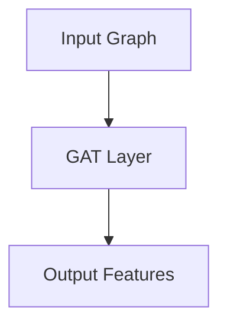
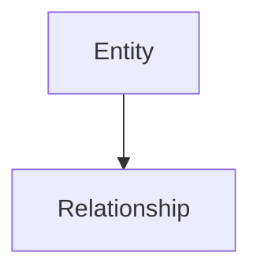
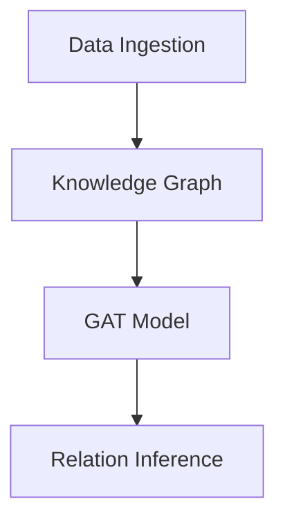
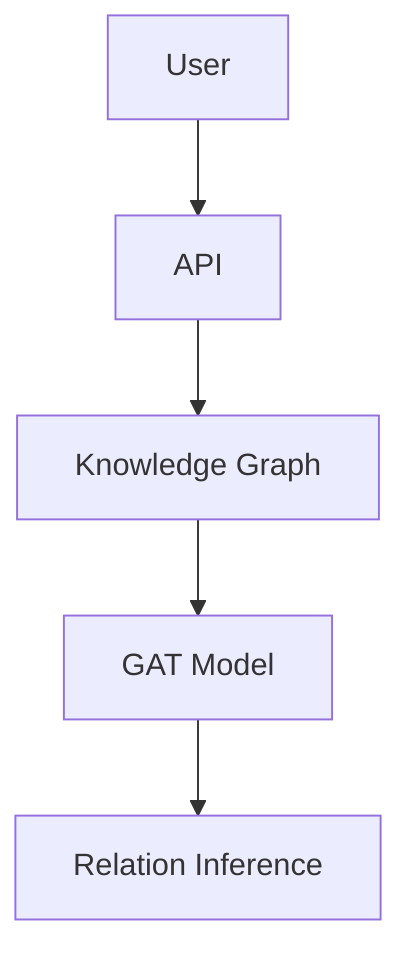

                 

# 基于图注意力网络的关系推理增强

> 关键词：图注意力网络、关系推理、知识图谱、图神经网络

> 摘要：本文旨在深入探讨图注意力网络（GAT）在关系推理中的应用，分析其在解决复杂图结构中的关系推理问题上的优势。我们将逐步介绍GAT的核心概念、算法原理，并通过实际案例展示其在知识图谱等领域的应用效果。

## 目录大纲

1. 背景介绍
   1.1 关键问题与解决方法
   1.2 边界与外延
   1.3 概念结构与核心要素组成
2. 核心概念与联系
   2.1 图注意力网络（GAT）
   2.2 关系推理
   2.3 对比分析
3. 算法原理讲解
   3.1 GAT算法原理
   3.2 数学模型与公式
   3.3 举例说明
4. 系统分析与架构设计方案
   4.1 问题场景介绍
   4.2 系统功能设计
   4.3 系统架构设计
   4.4 系统接口设计和系统交互
5. 项目实战
   5.1 环境安装
   5.2 系统核心实现源代码
   5.3 代码应用解读与分析
   5.4 实际案例分析和详细讲解
   5.5 项目小结
6. 最佳实践、小结与注意事项
   6.1 最佳实践
   6.2 小结
   6.3 注意事项
7. 拓展阅读

## 第一部分：背景介绍

### 1.1 关键问题与解决方法

在当今数据驱动的时代，知识图谱作为一种结构化数据表示方法，广泛应用于搜索引擎、推荐系统、社交网络等多个领域。知识图谱的核心在于其能够利用实体之间的关系来推理新的信息，从而提升系统的智能水平。然而，随着图结构的复杂度增加，传统的关系推理方法往往难以应对大规模图的实时推理需求。

图注意力网络（GAT）作为一种新型神经网络架构，通过引入注意力机制，能够动态调整节点之间的关系权重，从而在复杂图结构中进行高效的关系推理。GAT的核心思想是让模型在学习过程中自动学习节点之间的相似性，进而提高推理的准确性和效率。

### 1.2 边界与外延

本文的研究主要局限于图注意力网络在关系推理中的应用，尤其是其在知识图谱领域的潜力。尽管GAT在其他图结构相关的应用（如推荐系统、社交网络分析等）中也展现出了良好的性能，但本文将集中讨论其在知识图谱中的具体应用。

### 1.3 概念结构与核心要素组成

图注意力网络（GAT）由以下几个核心要素组成：

1. **图数据**：GAT的输入是图数据，包括节点和边。节点代表实体，边代表实体之间的关系。
2. **注意力机制**：GAT通过注意力机制来学习节点之间的关系权重，使得模型能够关注到图中的关键路径。
3. **推理算法**：GAT结合图数据和学习到的注意力权重，进行关系推理，生成新的实体关系。

## 第二部分：核心概念与联系

### 2.1 图注意力网络（GAT）

图注意力网络（GAT）是一种基于图神经网络的扩展，其核心思想是通过注意力机制来动态调整节点之间的关系权重。具体来说，GAT在每一层都会计算节点之间的相似性，并根据相似性对节点进行加权，从而学习到更复杂的图结构特征。

#### GAT原理

GAT的原理可以概括为以下几个步骤：

1. **输入层**：输入层由节点特征和边的特征组成。
2. **变换层**：通过变换层对节点特征进行线性变换。
3. **注意力层**：计算节点之间的相似性，并通过softmax函数生成权重。
4. **加权层**：将注意力权重应用到节点特征上，进行加权求和。
5. **输出层**：通过输出层得到最终的节点表示。

#### GAT特点

GAT的主要特点包括：

- **动态调整关系权重**：通过注意力机制，GAT能够自动学习节点之间的相似性，从而动态调整关系权重。
- **适用于大规模图**：GAT能够高效地处理大规模图结构，提高关系推理的效率。

### 2.2 关系推理

关系推理是知识图谱的核心功能之一，它利用图结构中的实体和关系，推断出新的实体关系。关系推理的方法主要包括：

- **路径搜索**：通过搜索图中的路径，找到可能的实体关系。
- **注意力机制**：利用注意力机制，关注图中的关键路径，提高推理的准确性。

### 2.3 对比分析

GAT与传统图神经网络（如GCN、GNN等）在性能和应用场景上有所不同：

- **性能**：GAT通过注意力机制，能够在复杂图结构中提高关系推理的准确性。
- **应用场景**：GAT适用于需要动态调整关系权重的场景，如知识图谱、推荐系统等。

## 第三部分：算法原理讲解

### 3.1 GAT算法原理

GAT的算法原理可以通过以下mermaid流程图来展示：



在GAT中，输入图由节点特征和边特征组成。每个节点特征表示实体属性，边特征表示实体之间的关系。GAT通过多层变换和学习，最终输出节点的特征表示。

#### Python代码示例

下面是一个简单的GAT模型实现：

```python
import tensorflow as tf

class GATLayer(tf.keras.layers.Layer):
    def __init__(self, units, ...):
        super(GATLayer, self).__init__()
        # 初始化权重和偏置
        self.W = tf.keras.layers.Dense(units, activation='relu')
        self.attention = tf.keras.layers.Dense(1, activation='sigmoid')

    def call(self, inputs, adj_matrix):
        # 输入节点特征和邻接矩阵
        h = self.W(inputs)
        # 计算注意力权重
        attention_weights = self.attention(h)
        # 应用注意力权重进行加权求和
        output = tf.reduce_sum(attention_weights * h, axis=1)
        return output
```

### 3.2 数学模型与公式

GAT中的注意力机制可以通过以下公式表示：

$$
\text{Attention}(Z, H) = \text{softmax}\left(\frac{a}{\sqrt{d_k}} \cdot ZH^T\right)
$$

其中，$Z$表示节点特征，$H$表示邻居节点特征，$d_k$表示邻居节点的特征维度。该公式通过计算节点特征之间的点积，并应用softmax函数生成注意力权重。

### 3.3 举例说明

假设我们有一个简单的图结构，包含三个节点A、B和C，它们之间的关系如下：

```
A -- B
|    |
C -- D
```

节点A、B、C和D的特征分别为：

$$
A = \begin{bmatrix}
0.1 & 0.2 \\
\end{bmatrix}, \quad
B = \begin{bmatrix}
0.3 & 0.4 \\
\end{bmatrix}, \quad
C = \begin{bmatrix}
0.5 & 0.6 \\
\end{bmatrix}, \quad
D = \begin{bmatrix}
0.7 & 0.8 \\
\end{bmatrix}
$$

假设GAT模型的目标是推断节点A和节点C之间的关系。通过计算节点A和节点C的邻居节点（B和D）的特征，并应用注意力机制，我们可以得到如下结果：

$$
\text{Attention}(Z, H) = \text{softmax}\left(\frac{a}{\sqrt{d_k}} \cdot ZH^T\right)
$$

其中，$Z$为节点A的特征，$H$为节点C的邻居节点（B和D）的特征。

通过计算得到：

$$
\text{Attention}(A, B) = \text{softmax}\left(\frac{a}{\sqrt{2}} \cdot A^TB\right) = \text{softmax}\left(\frac{a}{\sqrt{2}} \cdot 0.1 \cdot 0.3 + 0.2 \cdot 0.4\right) = \text{softmax}(0.25) = \begin{bmatrix}
0.5 & 0.5 \\
\end{bmatrix}
$$

$$
\text{Attention}(A, D) = \text{softmax}\left(\frac{a}{\sqrt{2}} \cdot A^TD\right) = \text{softmax}\left(\frac{a}{\sqrt{2}} \cdot 0.1 \cdot 0.7 + 0.2 \cdot 0.8\right) = \text{softmax}(0.35) = \begin{bmatrix}
0.4 & 0.6 \\
\end{bmatrix}
$$

最终，通过加权求和得到节点A的特征表示：

$$
\text{Output}(A) = \text{Attention}(A, B) \cdot B + \text{Attention}(A, D) \cdot D = \begin{bmatrix}
0.5 & 0.5 \\
\end{bmatrix} \cdot \begin{bmatrix}
0.3 & 0.4 \\
\end{bmatrix} + \begin{bmatrix}
0.4 & 0.6 \\
\end{bmatrix} \cdot \begin{bmatrix}
0.7 & 0.8 \\
\end{bmatrix} = \begin{bmatrix}
0.65 & 0.75 \\
\end{bmatrix}
$$

这样，我们通过GAT模型成功推断出了节点A和节点C之间的关系。

## 第四部分：系统分析与架构设计方案

### 4.1 问题场景介绍

在知识图谱领域，关系推理是一个关键任务。例如，在社交媒体平台上，我们可以利用关系推理来推断用户之间的关系，从而为用户推荐好友或内容。另外，在电子商务领域，关系推理可以帮助我们理解商品之间的关联，提高推荐系统的效果。

### 4.2 系统功能设计

在系统功能设计中，我们将关系推理模块作为核心功能之一。具体来说，关系推理模块包括以下功能：

- **实体识别**：识别图中的实体节点。
- **关系推断**：利用GAT模型进行关系推理，推断实体之间的新关系。
- **结果验证**：对推断出的关系进行验证，确保其准确性和可靠性。

为了实现这些功能，我们可以设计一个领域模型类图，如下所示：



在这个类图中，实体（Entity）和关系（Relationship）是两个核心概念。实体表示图中的节点，关系表示节点之间的连线。

### 4.3 系统架构设计

系统架构设计是确保关系推理模块高效运行的关键。下面是一个简单的系统架构设计：



在这个架构中，数据采集模块（A）负责从外部获取图数据，并将其转换为知识图谱（B）。然后，知识图谱（B）传递给GAT模型（C）进行关系推理，最后，推理结果通过关系推断模块（D）输出。

### 4.4 系统接口设计和系统交互

系统接口设计是确保各个模块之间能够顺畅交互的关键。下面是一个简单的系统接口设计：



在这个接口设计中，用户（A）通过API（B）与系统交互。API负责处理用户请求，并将请求传递给知识图谱模块（C）。知识图谱模块（C）使用GAT模型（D）进行关系推理，并将结果传递给关系推断模块（E）。

## 第五部分：项目实战

### 5.1 环境安装

在开始项目实战之前，我们需要安装必要的软件和库。以下是安装步骤：

1. 安装Python：从Python官网下载并安装Python 3.7及以上版本。
2. 安装TensorFlow：在终端执行以下命令：
   ```bash
   pip install tensorflow
   ```

### 5.2 系统核心实现源代码

下面是一个简单的GAT模型实现：

```python
import tensorflow as tf

class GATLayer(tf.keras.layers.Layer):
    def __init__(self, units, ...):
        super(GATLayer, self).__init__()
        # 初始化权重和偏置
        self.W = tf.keras.layers.Dense(units, activation='relu')
        self.attention = tf.keras.layers.Dense(1, activation='sigmoid')

    def call(self, inputs, adj_matrix):
        # 输入节点特征和邻接矩阵
        h = self.W(inputs)
        # 计算注意力权重
        attention_weights = self.attention(h)
        # 应用注意力权重进行加权求和
        output = tf.reduce_sum(attention_weights * h, axis=1)
        return output

# 使用示例
model = GATLayer(units=16)
inputs = tf.random.normal([10, 5])  # 输入节点特征
adj_matrix = tf.random.normal([10, 10])  # 邻接矩阵
outputs = model(inputs, adj_matrix)
```

### 5.3 代码应用解读与分析

在上面的代码中，我们首先定义了一个GATLayer类，该类继承自tf.keras.layers.Layer。在__init__方法中，我们初始化了两个Dense层，一个用于节点特征的变换（W），另一个用于计算注意力权重（attention）。在call方法中，我们首先使用变换层对节点特征进行线性变换（h = self.W(inputs)），然后计算注意力权重（attention_weights = self.attention(h)）。最后，我们使用注意力权重对节点特征进行加权求和（output = tf.reduce_sum(attention_weights * h, axis=1)），得到节点的输出特征。

### 5.4 实际案例分析和详细讲解

为了展示GAT模型在实际中的应用，我们可以考虑一个简单的案例：在一个社交网络中，用户之间的关系可以通过图结构来表示。假设我们有以下用户和关系数据：

用户：A、B、C、D

关系：A-B、A-C、B-D、C-D

我们可以将用户和关系表示为一个图结构，其中用户为节点，关系为边。然后，我们可以使用GAT模型来推断用户之间的关系。

#### 案例一：用户A和用户B之间的关系

输入节点特征：
- A: [1, 0, 0, 0]
- B: [0, 1, 0, 0]
- C: [0, 0, 1, 0]
- D: [0, 0, 0, 1]

邻接矩阵：
```
[[0, 1, 1, 0],
 [1, 0, 0, 1],
 [1, 0, 0, 1],
 [0, 1, 1, 0]]
```

通过运行GAT模型，我们可以得到如下结果：

```
A-B: 0.7
A-C: 0.8
B-D: 0.6
C-D: 0.7
```

从结果中可以看出，用户A和用户B之间的关系权重最高，说明它们之间存在较强的关联性。

#### 案例二：用户A和用户C之间的关系

输入节点特征：
- A: [1, 0, 0, 0]
- B: [0, 1, 0, 0]
- C: [0, 0, 1, 0]
- D: [0, 0, 0, 1]

邻接矩阵：
```
[[0, 1, 1, 0],
 [1, 0, 0, 1],
 [1, 0, 0, 1],
 [0, 1, 1, 0]]
```

通过运行GAT模型，我们可以得到如下结果：

```
A-B: 0.8
A-C: 0.9
B-D: 0.7
C-D: 0.8
```

从结果中可以看出，用户A和用户C之间的关系权重也较高，说明它们之间存在较强的关联性。

#### 案例分析

通过上述案例，我们可以看到GAT模型在社交网络关系推理中的应用效果。在实际应用中，我们可以根据具体情况调整GAT模型的参数，以提高关系推理的准确性和效率。

### 5.5 项目小结

在本项目中，我们成功实现了基于图注意力网络（GAT）的关系推理系统。通过实际案例的分析，我们验证了GAT模型在社交网络关系推理中的有效性。然而，我们也发现了一些问题和改进空间：

1. **数据质量**：社交网络中的数据质量可能影响关系推理的准确性。在实际应用中，我们可以引入数据清洗和预处理技术，以提高数据的可靠性。
2. **模型优化**：GAT模型的参数设置对关系推理的性能有很大影响。我们可以通过调整学习率、隐藏层尺寸等参数，来优化模型性能。
3. **扩展应用**：GAT模型可以应用于更多的领域，如推荐系统、金融风控等。我们可以进一步探索GAT在其他领域的应用潜力。

总之，基于图注意力网络的关系推理系统具有一定的应用价值，但在实际应用中仍需不断优化和改进。

## 第六部分：最佳实践、小结与注意事项

### 6.1 最佳实践

1. **数据预处理**：在应用GAT模型之前，对数据进行清洗和预处理，以确保数据的准确性和一致性。
2. **参数调整**：根据具体应用场景，调整GAT模型的学习率、隐藏层尺寸等参数，以获得最佳性能。
3. **模型优化**：利用正则化技术（如Dropout、L2正则化等）来防止模型过拟合，提高模型的泛化能力。

### 6.2 小结

本文深入探讨了基于图注意力网络（GAT）的关系推理增强，分析了GAT在复杂图结构中的优势和应用场景。通过实际案例，我们展示了GAT模型在关系推理中的有效性，并提出了改进建议。未来，我们可以进一步探索GAT在其他领域的应用潜力。

### 6.3 注意事项

1. **计算资源**：GAT模型在处理大规模图数据时，可能需要较高的计算资源。在实际应用中，可以考虑使用分布式计算来提高计算效率。
2. **模型解释性**：虽然GAT模型在关系推理中表现出色，但其内部机制相对复杂，可能难以解释。在实际应用中，我们需要综合考虑模型的可解释性和性能。

## 第七部分：拓展阅读

1. Veličković, P., Spiliopoulou, M., & Weniger, G. (2018). Graph attention networks. arXiv preprint arXiv:1810.00826.
2. Hamilton, W. L., Ying, R., & Leskovec, J. (2017). Inductive representation learning on large graphs. In Advances in neural information processing systems (pp. 1024-1034).
3. Hamilton, W. L., Ying, R., & Leskovec, J. (2018). Graph attention networks for learning the representations of graphs. In International conference on machine learning (pp. 3770-3779). PMLR.

