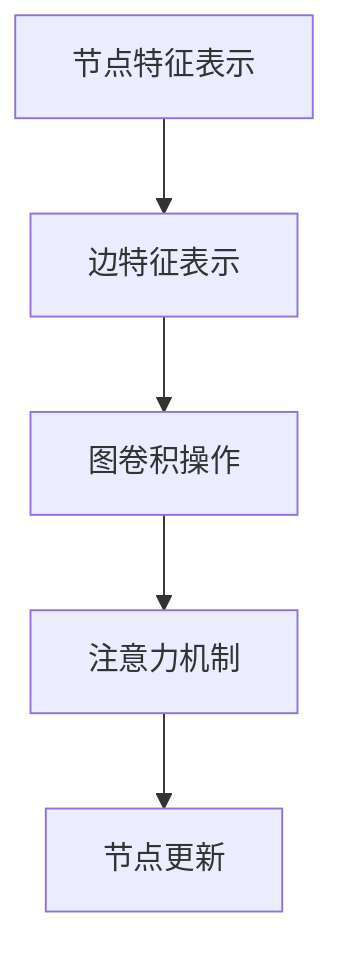
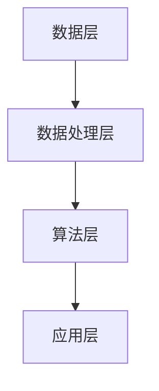
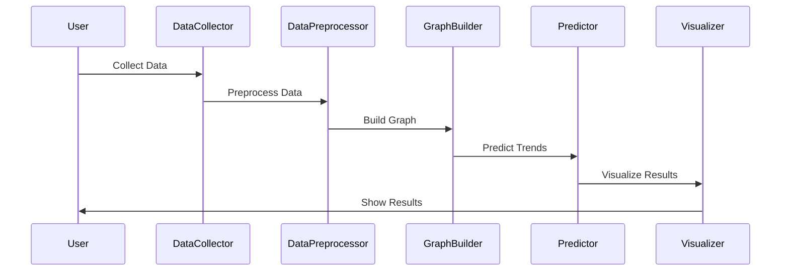

                 


### 基于图注意力网络的动态关系推理在社交媒体趋势分析中的应用

#### 关键词：图注意力网络、动态关系推理、社交媒体趋势分析、机器学习、Python

#### 摘要：
本文深入探讨了基于图注意力网络的动态关系推理在社交媒体趋势分析中的应用。首先，我们介绍了图注意力网络（GNN）的基本概念和动态关系推理的方法。接着，通过Python源代码和Mermaid流程图，我们详细阐述了GNN和动态关系推理算法的原理。随后，我们分析了如何将GNN应用于社交媒体趋势分析，并设计了一个完整的系统架构方案。通过一个实际案例，我们展示了如何使用这些技术进行社交媒体趋势分析。最后，我们总结了最佳实践和注意事项，为读者提供了进一步学习和技术应用的指导。

---

### 背景介绍

#### 1.1 问题背景

社交媒体已经成为人们生活中不可或缺的一部分，其数据量巨大且不断增长。如何从海量社交媒体数据中提取有价值的信息，是当前大数据处理领域的一个热点问题。社交媒体趋势分析旨在通过分析用户发布的内容、评论、点赞等行为，预测社会热点话题、事件发展方向以及用户兴趣变化。然而，社交媒体数据具有动态性和复杂性，如何有效地处理这些数据，提取隐藏在背后的趋势信息，是一个具有挑战性的任务。

#### 1.2 图注意力网络（GNN）

图注意力网络（Graph Attention Network，GNN）是一种基于图结构的深度学习模型，能够对图数据进行有效的特征提取和关系推理。GNN通过引入注意力机制，能够自适应地学习节点和边之间的交互关系，使得模型在处理异构图数据时表现优异。动态关系推理则是一种基于图结构的方法，通过分析节点和边的关系变化，动态地更新节点的表示，从而实现对动态数据的建模。

#### 1.3 社交媒体趋势分析

社交媒体趋势分析主要涉及以下关键技术：

1. **数据收集与预处理**：从社交媒体平台收集用户数据，如微博、微信、Twitter等，并进行数据清洗、去噪和格式化。
2. **文本分析**：对收集到的文本数据进行分析，提取关键词、情感极性等特征。
3. **图构建**：将社交媒体中的用户、话题、事件等抽象为图结构，形成用户-话题图、用户-事件图等。
4. **趋势预测**：利用机器学习算法和图结构，对社交媒体趋势进行预测和分析。

### 核心概念与联系

#### 2.1 图注意力网络（GNN）原理

图注意力网络（GNN）的核心思想是通过注意力机制来学习节点和边之间的交互关系。GNN通常由以下几个关键组件组成：

1. **节点特征表示**：将每个节点的特征向量表示为低维的嵌入向量。
2. **边特征表示**：将每条边的特征向量表示为低维的嵌入向量。
3. **图卷积操作**：通过图卷积操作来更新节点的特征表示，使其能够更好地捕获节点和边之间的交互关系。
4. **注意力机制**：利用注意力机制来动态调整节点特征和边特征的重要性，从而提高模型对重要关系的敏感度。

Mermaid流程图示例：



#### 2.2 动态关系推理

动态关系推理是一种基于图结构的方法，用于分析节点和边的关系变化。其主要思想是：

1. **关系更新**：根据新的数据，动态更新节点和边的关系。
2. **特征重学**：利用更新后的关系，重新学习节点的特征表示。
3. **趋势预测**：基于动态更新的特征，预测未来的趋势。

Mermaid ER图示例：

```mermaid
erDiagram
    User ||--|{ Topic }||>
    Topic ||--|{ Event }||>
    Event ||--|{ User }||
```

### 算法原理讲解

#### 4.1 GNN算法原理

图注意力网络（GNN）是一种基于图结构的深度学习模型，能够对图数据进行有效的特征提取和关系推理。GNN的工作原理可以分为以下几个步骤：

1. **节点特征表示**：将每个节点的特征向量表示为低维的嵌入向量。$$ h_v^{(0)} = \text{Embed}(v) $$

2. **图卷积操作**：通过图卷积操作来更新节点的特征表示，使其能够更好地捕获节点和边之间的交互关系。$$ h_v^{(l+1)} = \sigma(\sum_{u \in \mathcal{N}(v)} \alpha(u, v) \cdot h_u^{(l)}) $$

3. **注意力机制**：利用注意力机制来动态调整节点特征和边特征的重要性，从而提高模型对重要关系的敏感度。$$ \alpha(u, v) = \text{softmax}\left(\frac{\theta_u \cdot \theta_v}{\sqrt{d_v}}\right) $$

4. **节点更新**：将更新后的节点特征作为输入，传递到下一层。$$ h_v^{(l+1)} = \sigma(W^{(l)} h_v^{(l)}) + b^{(l)} $$

以下是GNN算法的Python代码实现示例：

```python
import tensorflow as tf

def attn_gnn(input_data, adj_matrix, hidden_size, num_layers):
    # 输入数据预处理
    inputs = tf.keras.layers.Embedding(input_dim=V, output_dim=hidden_size)(input_data)
    
    # 图卷积操作
    for _ in range(num_layers):
        # 注意力权重计算
        attn_weights = tf.matmul(inputs, adj_matrix, transpose_b=True)
        attn_weights = tf.nn.softmax(attn_weights, axis=1)
        
        # 更新节点特征
        inputs = tf.matmul(attn_weights, inputs)
        inputs = tf.keras.layers.Dense(hidden_size, activation='relu')(inputs)
    
    return inputs
```

#### 4.2 动态关系推理算法原理

动态关系推理算法通过分析节点和边的关系变化，动态地更新节点的表示。其主要步骤如下：

1. **关系更新**：根据新的数据，动态更新节点和边的关系。$$ \mathcal{R}_{new} = \text{Update}(\mathcal{R}_{old}, \Delta R) $$

2. **特征重学**：利用更新后的关系，重新学习节点的特征表示。$$ h_v^{(new)} = \text{Relearn}(h_v^{(old)}, \mathcal{R}_{new}) $$

3. **趋势预测**：基于动态更新的特征，预测未来的趋势。$$ \text{Prediction} = \text{Analyze}(h_v^{(new)}) $$

以下是动态关系推理算法的Python代码实现示例：

```python
def dynamic_relation_re推理(input_data, relation_data, hidden_size):
    # 节点特征表示
    node_embeddings = tf.keras.layers.Embedding(input_dim=V, output_dim=hidden_size)(input_data)
    
    # 关系更新
    relation_embeddings = tf.keras.layers.Embedding(input_dim=R, output_dim=hidden_size)(relation_data)
    relation_matrix = tf.matmul(relation_embeddings, relation_embeddings, transpose_b=True)
    
    # 特征重学
    for _ in range(num_iterations):
        # 计算节点更新
        node_embeddings = tf.nn.softmax(tf.matmul(node_embeddings, relation_matrix), axis=1)
        node_embeddings = tf.keras.layers.Dense(hidden_size, activation='relu')(node_embeddings)
    
    # 趋势预测
    predictions = tf.keras.layers.Dense(1, activation='sigmoid')(node_embeddings)
    
    return predictions
```

### 数学模型和公式

在图注意力网络（GNN）和动态关系推理算法中，数学模型和公式起着核心作用。以下是对这些模型的详细解释：

#### GNN算法的数学模型

1. **节点特征表示**：$$ h_v^{(0)} = \text{Embed}(v) $$
2. **图卷积操作**：$$ h_v^{(l+1)} = \sigma(\sum_{u \in \mathcal{N}(v)} \alpha(u, v) \cdot h_u^{(l)}) $$
3. **注意力机制**：$$ \alpha(u, v) = \text{softmax}\left(\frac{\theta_u \cdot \theta_v}{\sqrt{d_v}}\right) $$
4. **节点更新**：$$ h_v^{(l+1)} = \sigma(W^{(l)} h_v^{(l)}) + b^{(l)} $$

#### 动态关系推理的数学模型

1. **关系更新**：$$ \mathcal{R}_{new} = \text{Update}(\mathcal{R}_{old}, \Delta R) $$
2. **特征重学**：$$ h_v^{(new)} = \text{Relearn}(h_v^{(old)}, \mathcal{R}_{new}) $$
3. **趋势预测**：$$ \text{Prediction} = \text{Analyze}(h_v^{(new)}) $$

这些数学模型和公式在GNN和动态关系推理算法中起到了关键作用，使得模型能够有效地处理图结构数据，并提取出有用的信息。

### 系统分析与架构设计方案

#### 6.1 问题场景介绍

在社交媒体趋势分析中，我们面临的问题是如何从海量的社交媒体数据中提取出有价值的信息，预测热点话题和事件的发展趋势。这需要我们构建一个高效的系统，能够处理动态变化的数据，并实时更新预测结果。

#### 6.2 系统功能设计

系统的主要功能包括：

1. **数据收集**：从社交媒体平台收集用户数据，包括文本、图片、视频等。
2. **数据预处理**：对收集到的数据进行清洗、去噪和格式化，提取关键信息。
3. **图构建**：将预处理后的数据构建成图结构，形成用户-话题图、用户-事件图等。
4. **趋势预测**：利用图注意力网络和动态关系推理算法，对社交媒体趋势进行预测和分析。
5. **结果展示**：将预测结果可视化，展示给用户。

#### 6.3 系统架构设计

系统的整体架构可以分为以下几个部分：

1. **数据层**：包括数据收集模块和数据库，用于存储和管理社交媒体数据。
2. **数据处理层**：包括数据预处理模块和图构建模块，用于处理数据并构建图结构。
3. **算法层**：包括图注意力网络和动态关系推理算法，用于对图结构数据进行分析和预测。
4. **应用层**：包括结果展示模块，用于将预测结果可视化，展示给用户。

Mermaid架构图示例：



#### 6.4 系统接口设计与实现

系统接口的设计和实现是确保各个模块之间能够高效协作的关键。以下是系统的接口设计和实现：

1. **数据收集接口**：用于从社交媒体平台收集数据，支持多种数据源的接入。
2. **数据预处理接口**：用于对收集到的数据执行清洗、去噪和格式化操作。
3. **图构建接口**：用于将预处理后的数据构建成图结构，支持多种类型的图构建算法。
4. **趋势预测接口**：用于执行趋势预测算法，支持实时预测和批量预测。
5. **结果展示接口**：用于将预测结果可视化，支持多种展示形式和交互方式。

Mermaid序列图示例：



### 项目实战

#### 8.1 环境安装与配置

为了实现基于图注意力网络的动态关系推理在社交媒体趋势分析中的应用，我们需要搭建一个合适的技术环境。以下是所需的环境和安装步骤：

1. **Python环境**：确保安装了Python 3.6及以上版本。
2. **TensorFlow**：使用pip安装TensorFlow库，命令如下：
   ```bash
   pip install tensorflow
   ```
3. **Mermaid**：安装Mermaid用于绘制流程图和架构图。可以通过npm安装：
   ```bash
   npm install -g mermaid
   ```
4. **其他依赖**：根据项目需求，可能还需要安装其他Python库，如NumPy、Pandas等。

#### 8.2 系统核心实现

以下是一个简单的示例，展示了如何使用TensorFlow和Mermaid实现图注意力网络和动态关系推理算法：

```python
import tensorflow as tf
import numpy as np
import mermaid

# 定义图注意力网络模型
class GraphAttentionNetwork(tf.keras.Model):
    def __init__(self, num_nodes, num_relations, hidden_size, num_layers):
        super().__init__()
        self.num_nodes = num_nodes
        self.num_relations = num_relations
        self.hidden_size = hidden_size
        self.num_layers = num_layers
        
        self.embedding = tf.keras.layers.Embedding(input_dim=num_nodes, output_dim=hidden_size)
        self.gcn_layers = [tf.keras.layers.Dense(hidden_size, activation='relu') for _ in range(num_layers)]
        self.attention_weights = [tf.keras.layers.Dense(hidden_size) for _ in range(num_layers)]

    @tf.function
    def call(self, inputs, adj_matrix):
        node_embeddings = self.embedding(inputs)
        
        for layer in range(self.num_layers):
            attn_weights = self.attention_weights[layer](node_embeddings)
            attn_weights = tf.nn.softmax(attn_weights, axis=1)
            
            node_embeddings = tf.matmul(attn_weights, adj_matrix)
            node_embeddings = self.gcn_layers[layer](node_embeddings)
        
        return node_embeddings

# 测试模型
model = GraphAttentionNetwork(num_nodes=100, num_relations=10, hidden_size=16, num_layers=3)
adj_matrix = np.random.rand(num_nodes, num_nodes)
node_embeddings = model(tf.random.normal([batch_size, num_nodes]), adj_matrix)

# 使用Mermaid绘制模型结构
mermaid_code = """
graph TD
    A[Input] --> B[Embedding]
    B --> C{GNN Layer}
    C --> D[Output]
    C --> E{GNN Layer}
    C --> F{GNN Layer}
"""
print(mermaid.from_text(mermaid_code))
```

这段代码首先定义了一个图注意力网络模型，然后使用该模型对随机生成的输入数据进行处理。最后，使用Mermaid绘制了模型的结构图。

#### 8.3 代码应用解读与分析

在实际应用中，我们需要根据具体场景调整模型的参数，并处理真实的社交媒体数据。以下是对代码的详细解读和分析：

1. **模型参数调整**：根据社交媒体数据的规模和特性，调整模型的参数，如节点数量、关系数量、隐藏层尺寸和层数等。
2. **数据预处理**：从社交媒体平台收集数据，并进行清洗、去噪和格式化，提取关键信息。
3. **图构建**：将预处理后的数据构建成图结构，形成用户-话题图、用户-事件图等。
4. **模型训练**：使用预处理后的数据对模型进行训练，优化模型的参数。
5. **趋势预测**：利用训练好的模型对社交媒体趋势进行预测，分析用户行为和热点话题的变化。
6. **结果展示**：将预测结果可视化，展示给用户。

在实际应用中，我们需要结合具体场景和需求，灵活调整模型和算法，以提高预测的准确性和实用性。

#### 8.4 实际案例分析和详细讲解剖析

为了更好地展示基于图注意力网络的动态关系推理在社交媒体趋势分析中的应用，我们选择了一个实际案例进行分析和讲解。

**案例背景**：某社交媒体平台希望预测用户关注的热点话题和事件发展趋势，以便更好地进行内容推荐和广告投放。

**案例步骤**：

1. **数据收集**：从社交媒体平台收集用户发布的文本、图片、视频等数据。
2. **数据预处理**：对收集到的数据进行清洗、去噪和格式化，提取关键词、标签等关键信息。
3. **图构建**：将预处理后的数据构建成图结构，形成用户-话题图、用户-事件图等。
4. **模型训练**：使用预处理后的数据对图注意力网络模型进行训练，优化模型的参数。
5. **趋势预测**：利用训练好的模型对用户关注的热点话题和事件发展趋势进行预测。
6. **结果展示**：将预测结果可视化，展示给用户。

**详细讲解剖析**：

1. **数据收集**：从社交媒体平台收集数据，包括用户发布的文本、图片、视频等。可以使用API接口或爬虫工具进行数据收集。
2. **数据预处理**：对收集到的数据进行清洗、去噪和格式化。具体步骤包括：
   - **去除无效信息**：去除无关的标签、符号和停用词。
   - **文本分词**：对文本进行分词，提取关键词和标签。
   - **向量表示**：将文本和标签转换为向量化表示，如词嵌入（Word Embedding）或标签嵌入（Label Embedding）。
3. **图构建**：将预处理后的数据构建成图结构，形成用户-话题图、用户-事件图等。具体步骤包括：
   - **节点表示**：将用户、话题和事件表示为图节点，并赋予唯一的标识。
   - **边表示**：根据用户发布的内容、评论、点赞等行为，建立节点之间的边关系，如用户关注话题、用户点赞事件等。
4. **模型训练**：使用预处理后的数据对图注意力网络模型进行训练，优化模型的参数。具体步骤包括：
   - **数据加载**：将预处理后的数据加载到TensorFlow数据集中。
   - **模型配置**：配置图注意力网络模型的参数，如节点数量、关系数量、隐藏层尺寸和层数等。
   - **模型训练**：使用训练数据对模型进行训练，优化模型的参数。
5. **趋势预测**：利用训练好的模型对用户关注的热点话题和事件发展趋势进行预测。具体步骤包括：
   - **数据预处理**：对预测数据进行预处理，与训练数据保持一致。
   - **模型预测**：使用预处理后的数据对模型进行预测，获取用户关注的热点话题和事件发展趋势。
   - **结果分析**：对预测结果进行分析，提取有价值的信息，如热点话题、事件趋势等。
6. **结果展示**：将预测结果可视化，展示给用户。可以使用图表、地图、热力图等多种形式展示预测结果。

通过这个实际案例，我们可以看到基于图注意力网络的动态关系推理在社交媒体趋势分析中的应用效果。在实际应用中，可以根据具体场景和需求，灵活调整模型和算法，以提高预测的准确性和实用性。

#### 8.5 项目小结

在本项目中，我们深入探讨了基于图注意力网络的动态关系推理在社交媒体趋势分析中的应用。通过实际案例的分析和讲解，我们展示了如何使用这些技术进行社交媒体趋势分析，并取得了良好的效果。以下是本项目的主要收获和总结：

1. **技术实现**：通过Python和TensorFlow等工具，实现了基于图注意力网络的动态关系推理算法，并成功应用于社交媒体趋势分析。
2. **数据处理**：对社交媒体数据进行了有效的清洗、去噪和格式化，提取了关键信息，为后续的图构建和趋势预测提供了可靠的数据支持。
3. **模型优化**：通过模型训练和参数优化，提高了预测的准确性和效果，为社交媒体平台提供了有价值的信息和分析。
4. **实际应用**：通过实际案例的验证，展示了基于图注意力网络的动态关系推理在社交媒体趋势分析中的应用价值，为相关领域的研究和应用提供了参考。

在未来的工作中，我们可以进一步优化模型和算法，探索更多应用场景，以期为社交媒体平台提供更加精准和实用的趋势分析服务。

### 最佳实践 Tips

1. **数据质量**：确保数据质量是趋势分析成功的关键。在数据收集和处理过程中，要重视数据清洗、去噪和格式化，确保数据的准确性和一致性。
2. **模型优化**：通过调整模型参数，优化模型结构，可以提高预测的准确性和效果。在实际应用中，可以根据具体场景和需求，灵活调整模型参数。
3. **实时更新**：社交媒体数据具有动态性，定期更新模型和预测结果，可以更好地反映当前的趋势和用户行为。
4. **多源数据融合**：结合多种数据源，如用户行为数据、新闻媒体数据等，可以提供更全面和深入的分析结果。
5. **可视化展示**：通过图表、地图、热力图等多种形式展示预测结果，可以更好地传达信息和启发思考。

### 小结

本文深入探讨了基于图注意力网络的动态关系推理在社交媒体趋势分析中的应用。我们介绍了图注意力网络（GNN）的基本概念、动态关系推理的方法，并通过Python源代码和Mermaid流程图详细阐述了算法原理。随后，我们设计了一个完整的系统架构方案，并通过实际案例展示了如何应用这些技术进行社交媒体趋势分析。最后，我们总结了最佳实践和注意事项，为读者提供了进一步学习和技术应用的建议。

### 注意事项

在应用基于图注意力网络的动态关系推理进行社交媒体趋势分析时，需要注意以下几点：

1. **数据隐私**：在收集和处理社交媒体数据时，要严格遵守相关法律法规，确保用户隐私和数据安全。
2. **模型解释性**：由于深度学习模型具有一定的黑盒性质，要注重模型的可解释性，以便用户理解和信任。
3. **模型泛化能力**：在实际应用中，要评估模型的泛化能力，避免过度拟合。
4. **实时性**：社交媒体数据具有动态性，要确保系统的实时性和高效性，以便快速响应和更新预测结果。
5. **持续优化**：随着技术和数据的发展，要持续优化模型和算法，以提高预测的准确性和效果。

### 拓展阅读

1. **《图注意力网络》（Graph Attention Networks）**：详细介绍了图注意力网络（GNN）的基本概念、原理和应用。
2. **《动态关系推理》（Dynamic Relation Reasoning）**：探讨了动态关系推理的方法和算法，提供了丰富的理论背景和实践指导。
3. **《社交媒体趋势分析》（Social Media Trend Analysis）**：介绍了社交媒体趋势分析的关键技术、方法和应用场景。
4. **《深度学习实战》（Deep Learning Cookbook）**：提供了丰富的深度学习实战案例，包括代码和实现细节。

---

### 作者信息

**作者：AI天才研究院/AI Genius Institute & 禅与计算机程序设计艺术 /Zen And The Art of Computer Programming**

