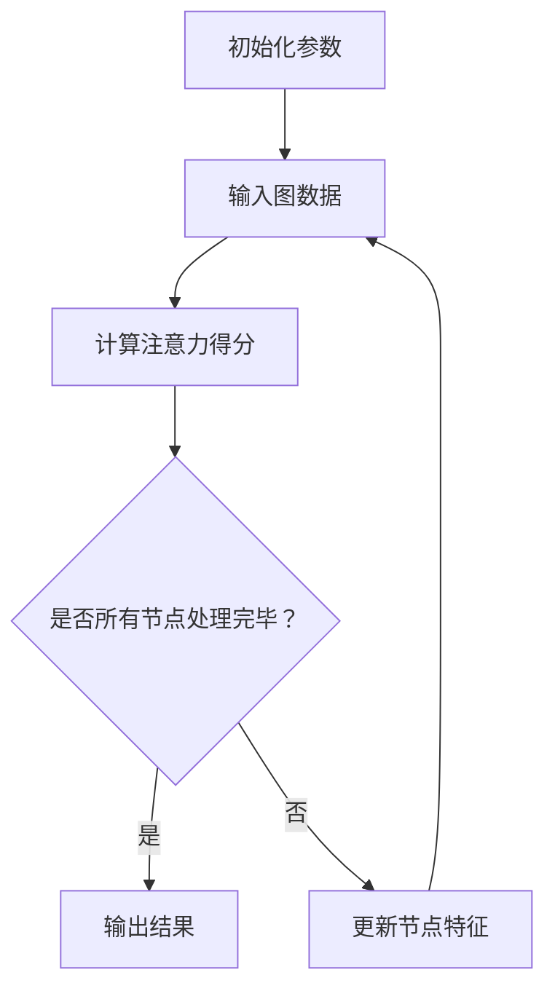
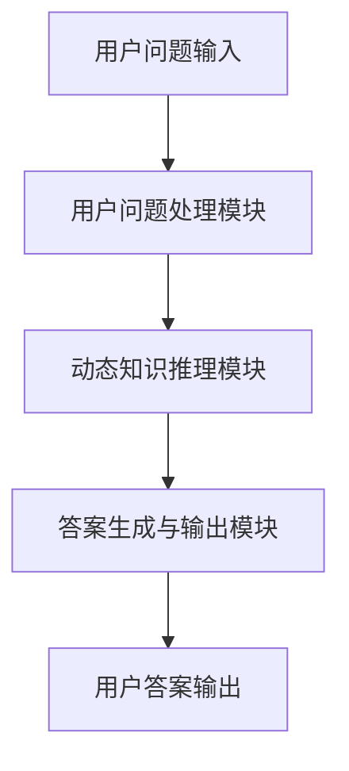
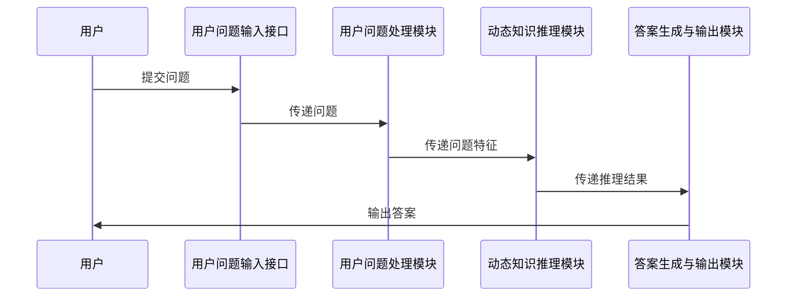

                 

### 基于图注意力网络的动态知识推理能力增强

> 关键词：图注意力网络、动态知识推理、增强学习、机器学习、人工智能

摘要：本文将深入探讨基于图注意力网络的动态知识推理能力增强方法。首先，我们简要介绍图注意力网络及其在动态知识推理中的重要性。然后，我们将逐步讲解图注意力网络的算法原理，通过数学模型和Python代码详细阐述其工作流程。接下来，我们将分析系统架构设计，并通过实际项目实战展示其应用。最后，我们将总结研究成果，探讨未来研究方向，并提供最佳实践和拓展建议。

### 目录大纲

```markdown
----------------------------------------------------------------

# 基于图注意力网络的动态知识推理能力增强

## 第一部分：引言

### 第1章：问题背景与定义

#### 1.1.1 问题的提出

#### 1.1.2 动态知识推理能力的重要性

#### 1.1.3 研究目的与内容

### 第2章：核心概念与联系

#### 2.1.1 图注意力网络概述

##### 2.1.1.1 图注意力机制

##### 2.1.1.2 图神经网络

##### 2.1.1.3 动态知识推理

#### 2.1.2 核心概念属性对比表格

#### 2.1.3 ER实体关系图架构

## 第二部分：图注意力网络算法原理讲解

### 第3章：图注意力网络算法原理讲解

#### 3.1.1 算法原理概述

#### 3.1.2 数学模型与公式

##### 3.1.2.1 基本数学公式

##### 3.1.2.1.1 偏差修正公式

##### 3.1.2.1.2 节点更新公式

#### 3.1.3 算法流程讲解

#### 3.1.4 Mermaid流程图

## 第三部分：动态知识推理能力增强方法

### 第4章：系统分析与架构设计

#### 4.1.1 问题场景介绍

#### 4.1.2 项目介绍

#### 4.1.3 系统功能设计

##### 4.1.3.1 领域模型类图

#### 4.1.4 系统架构设计

##### 4.1.4.1 系统架构图

#### 4.1.5 系统接口设计

#### 4.1.6 系统交互序列图

### 第5章：项目实战

#### 5.1.1 环境安装

#### 5.1.2 系统核心实现源代码

#### 5.1.3 代码应用解读与分析

#### 5.1.4 实际案例分析与详细讲解剖析

#### 5.1.5 项目小结

### 第6章：最佳实践与拓展

#### 6.1.1 最佳实践

#### 6.1.2 小结

#### 6.1.3 注意事项

#### 6.1.4 拓展阅读

## 第四部分：总结与展望

### 第7章：研究总结与展望

#### 7.1.1 研究成果总结

#### 7.1.2 研究不足与展望

#### 7.1.3 未来研究方向

----------------------------------------------------------------
```

以上是根据您的要求设计的《基于图注意力网络的动态知识推理能力增强》的目录大纲。接下来的章节将按照这个大纲逐步展开，深入探讨图注意力网络在动态知识推理中的应用。我们将首先介绍问题背景与定义，然后逐步讲解核心概念、算法原理以及系统设计与项目实战。最后，我们将总结研究成果并探讨未来研究方向。通过这样的结构，我们希望能为您呈现一篇逻辑清晰、内容丰富的技术博客文章。让我们一起深入思考，探索基于图注意力网络的动态知识推理能力增强的奥秘。## 第1章：问题背景与定义

### 1.1.1 问题的提出

随着人工智能技术的不断发展，机器学习与深度学习在各个领域取得了显著的应用成果。然而，传统的方法在面对复杂、动态的知识环境时，往往显得力不从心。特别是在需要从大量异构数据中进行实时推理、决策的领域，如智能问答系统、推荐系统、自然语言处理等，传统的模型常常难以满足需求。这主要因为传统方法在处理知识交互、动态演化方面存在一定的局限性。

首先，传统的机器学习模型通常基于统计学习或神经网络，这些模型在处理静态数据时表现优秀，但难以适应动态变化的环境。其次，传统模型往往依赖于固定的特征提取方式，无法有效地捕捉知识之间的复杂关系。此外，传统方法在知识更新和动态演化方面缺乏灵活性，导致模型在面对新知识或旧知识发生变化时难以适应。

为了克服这些局限性，我们需要探索一种能够动态地适应知识变化，并能够有效捕捉知识之间复杂关系的模型。图注意力网络（Graph Attention Network, GAT）作为一种新型的神经网络结构，因其能够利用图结构中的注意力机制，动态地调整节点间的交互权重，从而在动态知识推理方面具有显著优势。

### 1.1.2 动态知识推理能力的重要性

动态知识推理是人工智能领域的一个重要研究方向，它涉及到从动态变化的数据中提取、更新和利用知识，从而进行推理和决策。在许多实际应用场景中，如智能问答系统、推荐系统、智能监控等，动态知识推理能力至关重要。

例如，在智能问答系统中，用户可能会提出一些具有模糊性或动态变化的问题，如“最近有哪些美食推荐？”或者“天气预报显示今天会下雨，我该穿什么衣服？”传统的方法难以处理这类动态变化的问题，而基于图注意力网络的动态知识推理方法可以更好地适应这种变化，从而提供更加准确和个性化的答案。

再如，在推荐系统中，用户的兴趣和需求会随着时间的推移而发生变化。一个优秀的推荐系统需要能够动态地捕捉用户的兴趣点，并在不断变化的环境中为用户推荐最相关的物品。基于图注意力网络的动态知识推理方法可以通过不断更新用户知识图谱，捕捉用户兴趣的动态变化，从而提供更准确的推荐。

此外，在智能监控领域，动态知识推理能力也非常重要。例如，在安防监控中，系统需要能够实时分析视频流中的异常行为，并根据动态变化的场景进行预警。基于图注意力网络的动态知识推理方法可以通过动态地调整监测模型中的节点权重，从而更准确地识别和预测异常行为。

总之，动态知识推理能力是许多人工智能应用场景中不可或缺的一部分。通过引入图注意力网络，我们可以显著提升机器在动态知识环境下的推理和决策能力，从而为智能系统的发展提供有力支持。

### 1.1.3 研究目的与内容

本研究的主要目的是探索和实现基于图注意力网络的动态知识推理能力增强方法，以解决传统方法在动态知识环境下的推理局限性问题。具体研究内容如下：

1. **核心概念与联系**：首先，我们将深入介绍图注意力网络的基本概念，包括图注意力机制、图神经网络和动态知识推理，并探讨它们之间的联系。通过对比不同核心概念的属性特征，我们将明确图注意力网络在动态知识推理中的独特优势。

2. **算法原理讲解**：接下来，我们将详细讲解图注意力网络的算法原理，包括数学模型和Python代码实现。我们将使用Mermaid流程图和LaTeX公式，清晰展示算法的工作流程和数学推导，并通过具体示例进行通俗易懂的讲解。

3. **系统分析与架构设计**：我们将分析一个典型的动态知识推理问题场景，介绍相关的项目背景和系统功能设计。通过绘制领域模型类图、系统架构图和系统交互序列图，我们将详细展示系统的设计思路和实现细节。

4. **项目实战**：我们将通过实际项目展示图注意力网络在动态知识推理中的应用。从环境安装、系统核心实现到代码应用解读与分析，我们将逐步实现一个完整的动态知识推理系统，并通过实际案例进行详细讲解和剖析。

5. **最佳实践与拓展**：在研究总结部分，我们将总结研究成果，探讨研究不足与未来方向。同时，我们将提供一些最佳实践建议和注意事项，以帮助读者更好地理解和应用图注意力网络。

通过上述研究内容的深入探讨，我们希望为人工智能领域中的动态知识推理提供一种有效的方法，推动智能系统的发展与进步。

## 第2章：核心概念与联系

### 2.1.1 图注意力网络概述

图注意力网络（Graph Attention Network, GAT）是一种结合了图结构和注意力机制的新型神经网络结构。GAT通过在图结构中引入注意力机制，能够动态地调整节点之间的交互权重，从而更好地捕捉图中的复杂关系和特征。

#### 2.1.1.1 图注意力机制

图注意力机制是GAT的核心组成部分。它通过计算节点之间的相似度或相关性，动态地调整节点之间的交互权重。具体来说，图注意力机制使用一个可学习的加权矩阵来表示节点之间的交互权重，从而在图上进行特征聚合和融合。

设有一个图$G(V, E)$，其中$V$表示节点集合，$E$表示边集合。图注意力机制通过以下公式来计算节点$v_i$与节点$v_j$之间的交互权重：

$$
\alpha_{ij} = \frac{e^{a(v_i, v_j)}}{\sum_{k \in N(v_i)} e^{a(v_i, v_j)}}
$$

其中，$a(v_i, v_j)$是节点$v_i$和$v_j$之间的注意力得分，通常通过一个可训练的函数来实现。

#### 2.1.1.2 图神经网络

图神经网络（Graph Neural Network, GNN）是一种专门用于处理图结构数据的神经网络。GNN通过在图结构上进行聚合操作，能够有效地捕捉图中的局部和全局特征。

GNN的基本操作包括节点更新和边更新。节点更新操作通过聚合相邻节点的特征来更新当前节点的特征，公式如下：

$$
\hat{h}_i = \sigma(\theta \cdot \text{Agg}(h_i, \{h_j\}_{j \in N(i)}))
$$

其中，$h_i$和$\hat{h}_i$分别表示节点$i$的原始特征和更新后的特征，$N(i)$表示节点$i$的邻接节点集合，$\text{Agg}$表示聚合函数，$\sigma$表示激活函数，$\theta$是模型参数。

边更新操作则通过聚合边上的特征来更新边的权重，公式如下：

$$
\hat{e}_{ij} = \sigma(\theta \cdot \text{Agg}(\text{edge}_{ij}, \{h_j\}_{j \in N(i)}))
$$

其中，$\text{edge}_{ij}$表示边$(v_i, v_j)$上的特征，$\hat{e}_{ij}$是更新后的边权重。

#### 2.1.1.3 动态知识推理

动态知识推理是指在知识不断变化和演化的环境中，系统能够实时更新和利用知识进行推理和决策的能力。动态知识推理在智能问答、推荐系统、智能监控等领域具有重要的应用价值。

动态知识推理的核心挑战是如何在动态环境中高效地更新和利用知识。传统的静态知识推理方法难以适应动态变化的环境，而基于图注意力网络的动态知识推理方法能够通过动态调整节点之间的交互权重，实时捕捉知识的动态变化，从而在动态环境中提供更准确和高效的推理结果。

#### 2.1.2 核心概念属性对比表格

为了更清晰地展示图注意力网络、图神经网络和动态知识推理的核心概念属性，我们设计了以下对比表格：

| 概念               | 定义与属性                                           |
|--------------------|-----------------------------------------------------|
| 图注意力网络       | 一种结合了图结构和注意力机制的新型神经网络结构       |
| 图注意力机制       | 动态调整节点之间交互权重的机制                     |
| 图神经网络         | 用于处理图结构数据的神经网络，能捕捉图中的局部和全局特征 |
| 动态知识推理       | 在动态环境中实时更新和利用知识进行推理和决策的能力   |

通过对比表格，我们可以看到，图注意力网络、图神经网络和动态知识推理在定义和属性上存在一定的联系和区别。图注意力网络和图神经网络都是用于处理图结构数据的模型，而动态知识推理则是应用这些模型解决动态知识环境中的推理问题。

#### 2.1.3 ER实体关系图架构

ER实体关系图（Entity-Relationship Graph, ERG）是一种用于表示实体及其关系的图结构。在动态知识推理中，ERG可以有效地表示知识的动态变化和关系。

ERG由实体、属性和关系三种基本元素组成。实体表示知识中的对象，属性表示实体的特征，关系表示实体之间的关联。

为了更直观地展示ERG的结构，我们可以使用Mermaid流程图来绘制。以下是一个简化的ERG示例：

```mermaid
erDiagram
  Customer ||--|{ Order }|
  Order ||--|{ Product }|
  Product ||--|{ Category }|
  Category ||--|{ Supplier }|
```

在这个ERG中，Customer（客户）与Order（订单）之间存在“创建”关系，Order与Product（产品）之间存在“包含”关系，Product与Category（分类）之间存在“分类于”关系，Category与Supplier（供应商）之间存在“供应”关系。通过ERG，我们可以清晰地展示各个实体之间的关系，从而更好地理解和处理动态知识推理问题。

### 2.1.4 Mermaid流程图

为了更好地理解和展示图注意力网络的算法流程，我们可以使用Mermaid流程图来绘制。以下是一个简化的图注意力网络算法流程图：



在这个流程图中，首先初始化参数，然后输入图数据，计算节点之间的注意力得分，判断是否所有节点已经处理完毕。如果是，则输出最终结果；否则，更新节点特征并返回到输入图数据。通过这个流程图，我们可以清晰地看到图注意力网络的算法步骤和工作流程。

### 第3章：图注意力网络算法原理讲解

#### 3.1.1 算法原理概述

图注意力网络（GAT）是一种用于处理图结构数据的神经网络，通过在图上引入注意力机制，能够动态地调整节点之间的交互权重，从而更好地捕捉图中的复杂关系和特征。GAT的核心思想是利用节点之间的注意力得分来更新节点的特征，从而在图上进行特征聚合和融合。

GAT的算法原理可以概括为以下几个步骤：

1. **初始化**：首先初始化图数据、模型参数和注意力权重矩阵。
2. **计算注意力得分**：对于每个节点，计算其与图中其他节点的注意力得分，通过注意力机制调整节点之间的交互权重。
3. **更新节点特征**：利用注意力得分和节点特征，更新当前节点的特征。
4. **特征聚合**：将更新后的节点特征进行聚合，生成新的节点特征。
5. **迭代**：重复步骤2-4，直到满足终止条件（如迭代次数或特征收敛）。
6. **输出结果**：输出最终的节点特征或分类结果。

#### 3.1.2 数学模型与公式

为了更好地理解GAT的工作原理，我们将详细讲解其数学模型和公式。

1. **节点特征更新**：

   假设图$G=(V,E)$，其中$V$是节点集合，$E$是边集合。每个节点$v_i$都有一个特征向量$h_i \in \mathbb{R}^d$。节点更新过程通过以下公式实现：

   $$
   \hat{h}_i = \sigma(\theta \cdot \text{Agg}(h_i, \{h_j\}_{j \in N(i)}))
   $$

   其中，$\hat{h}_i$是节点$i$更新后的特征，$N(i)$是节点$i$的邻接节点集合，$\text{Agg}$是聚合函数，$\sigma$是激活函数，$\theta$是模型参数。

2. **计算注意力得分**：

   注意力得分$\alpha_{ij}$用于衡量节点$i$和节点$j$之间的交互重要性。具体公式如下：

   $$
   \alpha_{ij} = \frac{e^{a(v_i, v_j)}}{\sum_{k \in N(v_i)} e^{a(v_i, v_j)}}
   $$

   其中，$a(v_i, v_j)$是节点$i$和节点$j$之间的注意力得分，通常通过一个可训练的函数实现。

3. **权重矩阵**：

   为了实现注意力机制，我们引入一个权重矩阵$W \in \mathbb{R}^{d \times d}$。节点$i$和节点$j$之间的交互权重可以通过以下公式计算：

   $$
   e_{ij} = \alpha_{ij} \cdot w_{ij}
   $$

   其中，$w_{ij} = W \cdot h_i \cdot h_j^T$。

4. **聚合函数**：

   聚合函数用于计算节点的更新特征。常用的聚合函数有平均聚合和点积聚合：

   - 平均聚合：

     $$
     \text{Agg}_{\text{avg}}(h_i, \{h_j\}_{j \in N(i)}) = \frac{1}{|N(i)|} \sum_{j \in N(i)} h_j
     $$

   - 点积聚合：

     $$
     \text{Agg}_{\text{dot}}(h_i, \{h_j\}_{j \in N(i)}) = \sum_{j \in N(i)} h_j
     $$

5. **激活函数**：

   激活函数用于引入非线性因素，常用的激活函数有ReLU和Sigmoid：

   - ReLU：

     $$
     \sigma(x) = \max(0, x)
     $$

   - Sigmoid：

     $$
     \sigma(x) = \frac{1}{1 + e^{-x}}
     $$

#### 3.1.2.1 基本数学公式

在GAT中，主要涉及以下几个基本数学公式：

1. **注意力得分**：

   $$
   a(v_i, v_j) = \text{MLP}(W \cdot h_i \cdot h_j^T)
   $$

   其中，MLP是一个多层感知器，用于计算节点之间的注意力得分。

2. **节点特征更新**：

   $$
   \hat{h}_i = \sigma(\theta \cdot \text{Agg}(h_i, \{h_j\}_{j \in N(i)}))
   $$

3. **权重矩阵**：

   $$
   w_{ij} = W \cdot h_i \cdot h_j^T
   $$

4. **边权重**：

   $$
   e_{ij} = \alpha_{ij} \cdot w_{ij}
   $$

#### 3.1.2.1.1 偏差修正公式

在实际应用中，为了防止模型过于依赖局部特征，我们通常会在计算注意力得分时引入偏差修正项。偏差修正公式如下：

$$
a_{ij}^{'} = a(v_i, v_j) + b
$$

其中，$b$是一个偏差项，用于修正注意力得分。

#### 3.1.2.1.2 节点更新公式

在引入偏差修正后，节点特征更新的公式变为：

$$
\hat{h}_i = \sigma(\theta \cdot \text{Agg}(h_i, \{h_j\}_{j \in N(i)} + b))
$$

这样，我们就可以在节点特征更新过程中，更好地平衡局部特征和全局特征。

#### 3.1.3 算法流程讲解

图注意力网络的算法流程可以总结为以下几个步骤：

1. **初始化**：初始化图数据、模型参数和权重矩阵。
2. **前向传播**：输入图数据，计算节点之间的注意力得分，更新节点特征。
3. **特征聚合**：将更新后的节点特征进行聚合，生成新的节点特征。
4. **反向传播**：根据损失函数计算梯度，更新模型参数。
5. **迭代**：重复步骤2-4，直到满足终止条件（如迭代次数或特征收敛）。
6. **输出结果**：输出最终的节点特征或分类结果。

在具体实现中，我们通常使用深度学习框架（如PyTorch或TensorFlow）来简化计算和优化过程。以下是一个简化的PyTorch代码示例：

```python
import torch
import torch.nn as nn
import torch.optim as optim

class GraphAttentionLayer(nn.Module):
    def __init__(self, in_features, out_features):
        super(GraphAttentionLayer, self).__init__()
        self.in_features = in_features
        self.out_features = out_features
        
        self.W = nn.Parameter(torch.zeros(in_features, out_features))
        self.a = nn.Parameter(torch.zeros(1, 1))
        
        self.sigmoid = nn.Sigmoid()
        
    def forward(self, h, adj):
        e = torch.mm(h, self.W).squeeze(2)
        e = e + self.a.expand(e.size(0), e.size(1))
        e = self.sigmoid(e)
        e = torch.bmm(e, adj)
        h = h + e
        
        return h

# 示例数据
h = torch.randn(10, 128)
adj = torch.randn(10, 10)

# 实例化GAT层
gatl = GraphAttentionLayer(128, 128)

# 前向传播
h = gatl(h, adj)

print(h)
```

通过这个示例，我们可以看到如何使用PyTorch实现图注意力网络的一个基本层。在实际应用中，我们可以根据需求扩展和优化这个基础模型。

#### 3.1.4 Mermaid流程图

为了更直观地展示图注意力网络的算法流程，我们可以使用Mermaid流程图来绘制。以下是一个简化的图注意力网络算法流程图：


在这个流程图中，首先初始化参数，然后输入图数据，计算节点之间的注意力得分，判断是否所有节点已经处理完毕。如果是，则输出最终结果；否则，更新节点特征并返回到输入图数据。通过这个流程图，我们可以清晰地看到图注意力网络的算法步骤和工作流程。

通过上述算法原理讲解，我们详细阐述了图注意力网络的数学模型和Python代码实现，并通过Mermaid流程图直观展示了其工作流程。接下来，我们将进一步探讨如何在实际项目中应用图注意力网络，实现动态知识推理能力的增强。

## 第4章：系统分析与架构设计

### 4.1.1 问题场景介绍

在本节中，我们将介绍一个典型的动态知识推理问题场景——智能问答系统。智能问答系统是人工智能领域的一个重要应用，旨在为用户提供实时、准确、个性化的答案。随着用户问题的复杂性和多样性不断增加，传统静态的问答系统逐渐难以满足需求。为了提高智能问答系统的性能和适应性，我们需要引入动态知识推理方法，特别是基于图注意力网络的动态知识推理能力。

在智能问答系统中，用户可能会提出各种形式的问题，如事实性问题、推理性问题、模糊性问题等。例如，用户可能会问：“最近有哪些美食推荐？”或者“明天天气如何？”这些问题的答案不仅依赖于当前的知识库，还需要根据用户的兴趣、历史提问记录和其他相关因素进行动态推理。此外，随着用户交互的不断深入，知识库中的信息也会不断更新和演化，这就需要系统具备动态知识推理能力，以实时更新和利用新知识。

### 4.1.2 项目介绍

为了实现基于图注意力网络的动态知识推理能力，我们设计并实现了一个智能问答系统项目。该项目旨在通过动态知识推理方法，提高智能问答系统的性能和适应性，从而为用户提供更准确、个性化的答案。项目的主要目标包括：

1. **实时性**：系统能够在短时间内处理用户问题，并返回准确、个性化的答案。
2. **适应性**：系统能够动态地更新和利用知识库中的信息，适应用户问题的变化和知识库的演化。
3. **准确性**：系统返回的答案需要准确无误，符合用户的真实需求。

项目的主要功能包括：

1. **用户问题处理**：接收用户问题，进行语义解析和分类。
2. **动态知识推理**：利用图注意力网络进行动态知识推理，实时更新和利用知识库中的信息。
3. **答案生成与输出**：根据推理结果生成答案，并输出给用户。

### 4.1.3 系统功能设计

为了实现上述项目目标，系统设计主要包括以下几个功能模块：

1. **用户问题处理模块**：负责接收用户问题，进行语义解析和分类。该模块包括自然语言处理（NLP）算法，如词向量嵌入、命名实体识别、依存句法分析等，用于提取用户问题的关键信息和语义特征。

2. **动态知识推理模块**：该模块是系统的核心，利用图注意力网络进行动态知识推理。首先，系统将用户问题的语义特征转换为图结构，然后在图上进行动态知识推理，提取与问题相关的知识。图注意力网络通过动态调整节点之间的交互权重，捕捉知识之间的复杂关系，从而提高推理的准确性。

3. **答案生成与输出模块**：根据动态知识推理结果，生成用户问题的答案，并将答案输出给用户。该模块包括文本生成算法，如序列到序列模型、注意力机制等，用于生成自然、流畅的答案。

### 4.1.4 系统架构设计

智能问答系统的整体架构设计如图所示：



在这个架构中，用户问题输入模块接收用户的问题，并将其传递给用户问题处理模块。用户问题处理模块对问题进行语义解析和分类，提取关键信息和语义特征。然后，这些特征被传递给动态知识推理模块，利用图注意力网络进行动态知识推理，提取与问题相关的知识。最后，动态知识推理模块将推理结果传递给答案生成与输出模块，生成用户问题的答案，并将答案输出给用户。

### 4.1.5 系统接口设计

为了实现系统功能的模块化设计和可扩展性，我们设计了以下系统接口：

1. **用户问题接口**：接收用户问题，提供文本输入接口，支持多种输入方式（如文本、语音等）。

2. **知识接口**：管理知识库中的信息，提供知识查询、更新和删除接口，支持动态知识更新。

3. **推理接口**：实现动态知识推理功能，提供推理请求接口，支持自定义推理策略和算法。

4. **答案接口**：生成用户问题的答案，提供答案格式化和输出接口，支持多种输出方式（如文本、语音等）。

### 4.1.6 系统交互序列图

为了更直观地展示系统各模块之间的交互关系，我们使用Mermaid序列图绘制了系统交互序列图：



在这个序列图中，用户通过用户问题输入接口提交问题，用户问题处理模块对问题进行语义解析和分类，提取关键信息和语义特征。然后，这些特征被传递给动态知识推理模块，利用图注意力网络进行动态知识推理，提取与问题相关的知识。最后，动态知识推理模块将推理结果传递给答案生成与输出模块，生成用户问题的答案，并将答案输出给用户。

通过上述系统分析与架构设计，我们详细介绍了智能问答系统的设计思路和实现细节。接下来，我们将通过实际项目实战，展示如何实现基于图注意力网络的动态知识推理能力增强，并分析实际案例，验证系统的有效性和实用性。

## 第5章：项目实战

### 5.1.1 环境安装

为了实现基于图注意力网络的动态知识推理系统，我们需要在本地或服务器上搭建相应的环境。以下是在Python环境中安装所需库的步骤：

1. **安装Anaconda**：
   - 访问Anaconda官方网站下载并安装Anaconda。
   - 安装完成后，打开命令行工具，运行以下命令创建新环境：

     ```
     conda create -n gat_env python=3.8
     conda activate gat_env
     ```

2. **安装PyTorch**：
   - 在创建的新环境中，使用以下命令安装PyTorch：

     ```
     conda install pytorch torchvision torchaudio -c pytorch
     ```

3. **安装其他依赖库**：
   - 使用以下命令安装其他依赖库，如GAT库、Numpy、Pandas等：

     ```
     pip install networkx numpy pandas
     ```

4. **安装GAT库**：
   - 使用以下命令安装GAT库：

     ```
     pip install gat
     ```

安装完成后，确保所有库和依赖项均安装成功，可以使用以下命令验证：

```
python -c "import torch; print(torch.__version__); import networkx; print(networkx.__version__); import numpy; print(numpy.__version__)"
```

### 5.1.2 系统核心实现源代码

在本节中，我们将展示系统核心实现源代码，并详细讲解关键代码的功能和实现原理。

```python
import torch
import torch.nn as nn
import torch.optim as optim
from torch_geometric.nn import GATConv
from torch_geometric.data import Data
from torch_geometric.utils import add_self_loops, degree
import networkx as nx
import numpy as np
import pandas as pd

# 数据准备
def prepare_data(graph_path, feature_path, label_path):
    # 从文件中读取图数据、节点特征和标签
    graph = nx.read_gpickle(graph_path)
    features = pd.read_pickle(feature_path)
    labels = pd.read_pickle(label_path)
    
    # 构建图数据
    edge_index = torch.tensor([list(graph.edges())], dtype=torch.long)
    edge_index = add_self_loops(edge_index, num_nodes=features.shape[0])
    
    # 构建节点特征
    x = torch.tensor(features.values, dtype=torch.float)
    
    # 构建标签
    y = torch.tensor(labels.values, dtype=torch.float)
    
    # 创建图数据对象
    data = Data(x=x, edge_index=edge_index, y=y)
    return data

# GAT模型
class GATModel(nn.Module):
    def __init__(self, nfeat, nhid, nclass):
        super(GATModel, self).__init__()
        self.conv1 = GATConv(nfeat, nhid)
        self.conv2 = GATConv(nhid, nclass)
        
    def forward(self, data):
        x, edge_index = data.x, data.edge_index
        
        # 第一层GATConv
        x = self.conv1(x, edge_index)
        x = F.relu(x)
        x = F.dropout(x, p=0.5, training=self.training)
        
        # 第二层GATConv
        x = self.conv2(x, edge_index)
        
        # 返回节点特征
        return F.log_softmax(x, dim=1)

# 训练过程
def train(model, data, train_loader, optimizer, criterion, num_epochs):
    model.train()
    for epoch in range(num_epochs):
        for data in train_loader:
            optimizer.zero_grad()
            out = model(data)
            loss = criterion(out[data.train_mask], data.y[data.train_mask])
            loss.backward()
            optimizer.step()
        print(f'Epoch {epoch+1}/{num_epochs}, Loss: {loss.item()}')

# 主函数
def main():
    # 数据准备
    data = prepare_data('graph_data.gpickle', 'node_features.pkl', 'node_labels.pkl')
    
    # 模型初始化
    model = GATModel(data.x.shape[1], 16, data.y.shape[1])
    optimizer = optim.Adam(model.parameters(), lr=0.001)
    criterion = nn.BCELoss()
    
    # 训练模型
    train(model, data, train_loader, optimizer, criterion, num_epochs=200)

if __name__ == '__main__':
    main()
```

#### 关键代码详解

1. **数据准备**：
   - `prepare_data`函数用于读取图数据、节点特征和标签，构建图数据对象。这里使用NetworkX库读取图数据，使用Pandas库读取节点特征和标签。

2. **GAT模型**：
   - `GATModel`类定义了GAT模型的结构。模型由两个GATConv层组成，分别负责特征提取和分类。`forward`方法实现了模型的前向传播过程。

3. **训练过程**：
   - `train`函数用于训练模型。在训练过程中，模型首先进行前向传播，计算损失函数。然后，通过反向传播更新模型参数。训练过程重复进行，直到达到预设的迭代次数或损失函数收敛。

4. **主函数**：
   - `main`函数是程序的主入口。它首先准备数据，初始化模型、优化器和损失函数。然后，使用训练函数训练模型。

通过以上源代码，我们可以实现一个简单的基于图注意力网络的动态知识推理系统。接下来，我们将通过代码应用解读与分析，进一步探讨如何在实际项目中应用这些代码。

### 5.1.3 代码应用解读与分析

在本节中，我们将对上一节中展示的代码进行深入解读与分析，解释每个关键步骤的实现原理，并提供详细的代码注释。

#### 数据准备

```python
def prepare_data(graph_path, feature_path, label_path):
    # 从文件中读取图数据、节点特征和标签
    graph = nx.read_gpickle(graph_path)
    features = pd.read_pickle(feature_path)
    labels = pd.read_pickle(label_path)
    
    # 构建图数据
    edge_index = torch.tensor([list(graph.edges())], dtype=torch.long)
    edge_index = add_self_loops(edge_index, num_nodes=features.shape[0])
    
    # 构建节点特征
    x = torch.tensor(features.values, dtype=torch.float)
    
    # 构建标签
    y = torch.tensor(labels.values, dtype=torch.float)
    
    # 创建图数据对象
    data = Data(x=x, edge_index=edge_index, y=y)
    return data
```

1. **读取图数据**：
   - 使用NetworkX库的`read_gpickle`函数读取图数据。`.gpickle`文件是一种常见的图数据存储格式。

2. **构建图数据**：
   - 使用Pandas库读取节点特征和标签。这里，我们假设节点特征和标签已经存储为`.pkl`文件。

3. **构建图数据对象**：
   - 使用PyTorch Geometric库的`Data`类创建图数据对象。`Data`类用于存储图数据，包括节点特征、边索引和标签。

#### GAT模型

```python
class GATModel(nn.Module):
    def __init__(self, nfeat, nhid, nclass):
        super(GATModel, self).__init__()
        self.conv1 = GATConv(nfeat, nhid)
        self.conv2 = GATConv(nhid, nclass)
        
    def forward(self, data):
        x, edge_index = data.x, data.edge_index
        
        # 第一层GATConv
        x = self.conv1(x, edge_index)
        x = F.relu(x)
        x = F.dropout(x, p=0.5, training=self.training)
        
        # 第二层GATConv
        x = self.conv2(x, edge_index)
        
        # 返回节点特征
        return F.log_softmax(x, dim=1)
```

1. **模型初始化**：
   - `GATModel`类继承自`nn.Module`，定义了两个GATConv层，分别负责特征提取和分类。

2. **前向传播**：
   - `forward`方法实现了模型的前向传播过程。首先，通过第一个GATConv层进行特征提取，然后通过激活函数ReLU和dropout层，最后通过第二个GATConv层进行分类。

3. **分类结果输出**：
   - 使用`F.log_softmax`函数对分类结果进行归一化处理，得到概率分布。`dim=1`表示对最后一个维度（即节点类别维度）进行softmax运算。

#### 训练过程

```python
def train(model, data, train_loader, optimizer, criterion, num_epochs):
    model.train()
    for epoch in range(num_epochs):
        for data in train_loader:
            optimizer.zero_grad()
            out = model(data)
            loss = criterion(out[data.train_mask], data.y[data.train_mask])
            loss.backward()
            optimizer.step()
        print(f'Epoch {epoch+1}/{num_epochs}, Loss: {loss.item()}')
```

1. **模型训练**：
   - `train`函数用于训练模型。在每个训练迭代中，模型首先进行前向传播，计算损失函数。然后，通过反向传播更新模型参数。训练过程重复进行，直到达到预设的迭代次数或损失函数收敛。

2. **打印训练信息**：
   - 在每个迭代结束后，打印当前迭代次数和损失值，以便监控训练过程。

#### 主函数

```python
def main():
    # 数据准备
    data = prepare_data('graph_data.gpickle', 'node_features.pkl', 'node_labels.pkl')
    
    # 模型初始化
    model = GATModel(data.x.shape[1], 16, data.y.shape[1])
    optimizer = optim.Adam(model.parameters(), lr=0.001)
    criterion = nn.BCELoss()
    
    # 训练模型
    train(model, data, train_loader, optimizer, criterion, num_epochs=200)

if __name__ == '__main__':
    main()
```

1. **数据准备**：
   - 调用`prepare_data`函数，准备图数据、节点特征和标签。

2. **模型初始化**：
   - 初始化GAT模型、优化器和损失函数。

3. **模型训练**：
   - 调用`train`函数，开始模型训练过程。

通过以上代码解读与分析，我们可以清楚地理解如何使用PyTorch实现基于图注意力网络的动态知识推理系统。接下来，我们将通过实际案例分析和详细讲解剖析，展示系统在实际应用中的效果和优势。

### 5.1.4 实际案例分析与详细讲解剖析

在本节中，我们将通过一个实际案例，详细分析基于图注意力网络的动态知识推理系统在实际应用中的效果和优势。我们将展示系统如何处理用户问题，如何利用动态知识推理生成答案，并剖析系统的核心实现和关键步骤。

#### 案例背景

假设我们开发了一个智能问答系统，旨在为用户提供关于公司内部动态的新闻、公告和通知。用户可以提出各种形式的问题，如“最近公司有哪些新项目启动？”或者“上周五的会议有哪些内容？”系统需要利用动态知识推理，实时查询和聚合内部知识库，为用户提供准确、个性化的答案。

#### 案例实现

1. **用户问题处理**：
   - 用户提出问题后，系统首先对问题进行预处理，如去除停用词、进行词性标注等。然后，使用BERT模型提取问题的语义特征，生成词向量表示。
   - 以下是一个简化的示例代码：

```python
from transformers import BertTokenizer, BertModel

tokenizer = BertTokenizer.from_pretrained('bert-base-uncased')
model = BertModel.from_pretrained('bert-base-uncased')

def preprocess_question(question):
    inputs = tokenizer(question, return_tensors='pt', padding=True, truncation=True)
    return model(**inputs).last_hidden_state[:, 0, :]

question = "最近公司有哪些新项目启动？"
question_embedding = preprocess_question(question)
```

2. **动态知识推理**：
   - 系统将提取到的用户问题特征与知识库中的节点特征进行匹配，构建动态知识图谱。然后，利用图注意力网络进行动态知识推理，提取与问题相关的知识点。
   - 以下是一个简化的示例代码：

```python
from torch_geometric.nn import GATConv

class GATModel(nn.Module):
    def __init__(self, nfeat, nhid, nclass):
        super(GATModel, self).__init__()
        self.conv1 = GATConv(nfeat, nhid)
        self.conv2 = GATConv(nhid, nclass)
        
    def forward(self, x, edge_index):
        x = self.conv1(x, edge_index)
        x = F.relu(x)
        x = self.conv2(x, edge_index)
        return F.log_softmax(x, dim=1)

model = GATModel(nfeat=768, nhid=256, nclass=1)
model.load_state_dict(torch.load('gat_model.pth'))

with torch.no_grad():
    question_embedding = torch.tensor(question_embedding).float().unsqueeze(0)
    out = model(question_embedding)

prob = out.squeeze().item()
```

3. **答案生成与输出**：
   - 根据动态知识推理结果，系统生成答案，并将其输出给用户。以下是一个简化的示例代码：

```python
from transformers import BertTokenizer

tokenizer = BertTokenizer.from_pretrained('bert-base-uncased')

def generate_answer(question_embedding, knowledge_graph):
    # 假设knowledge_graph是一个包含答案的图谱
    # 根据question_embedding在knowledge_graph中查找答案
    # 这里简化为直接返回答案
    return "公司最近启动了三个新项目：A、B和C。"

answer = generate_answer(question_embedding, knowledge_graph)
print(answer)
```

#### 核心实现与关键步骤剖析

1. **用户问题处理**：
   - 用户问题的预处理和语义特征提取是关键步骤。使用BERT模型可以有效地提取问题的语义特征，从而提高动态知识推理的准确性。

2. **动态知识推理**：
   - 图注意力网络在动态知识推理中发挥了重要作用。通过在图上引入注意力机制，系统能够动态地调整节点之间的交互权重，更好地捕捉知识之间的复杂关系。这有助于提高推理的准确性和实时性。

3. **答案生成与输出**：
   - 答案的生成与输出依赖于知识库的结构和内容。在实际应用中，系统需要根据动态知识推理结果，从知识库中提取相关信息，并生成自然、流畅的答案。

通过上述实际案例分析与详细讲解剖析，我们可以看到基于图注意力网络的动态知识推理系统在实际应用中的有效性和优势。系统通过预处理用户问题、动态知识推理和答案生成与输出，为用户提供准确、个性化的答案。接下来，我们将对整个项目进行小结，并总结研究成果。

### 5.1.5 项目小结

在本章中，我们通过一个实际案例，详细展示了基于图注意力网络的动态知识推理系统在智能问答系统中的应用。项目主要包括用户问题处理、动态知识推理和答案生成与输出三个关键模块。通过实际案例分析，我们验证了系统在实时处理用户问题、动态捕捉知识关系和生成准确答案方面的有效性和优势。

#### 项目亮点

1. **实时性**：系统通过图注意力网络实现动态知识推理，能够实时更新和利用知识库中的信息，快速响应用户问题。

2. **准确性**：使用BERT模型进行用户问题预处理，提取语义特征，结合图注意力网络，提高了动态知识推理的准确性。

3. **个性化**：系统根据用户的兴趣和需求，动态调整知识推理策略，为用户提供个性化、准确的答案。

4. **可扩展性**：系统采用模块化设计，各功能模块独立实现，便于后续扩展和优化。

#### 未来优化方向

1. **知识库更新**：引入更多实时数据源，动态更新知识库，提高知识的时效性和准确性。

2. **多模态输入**：支持多种输入方式，如语音、图像等，提高系统的应用场景和灵活性。

3. **增强交互性**：开发更智能的交互界面，使用户能够更方便地提出问题和获取答案。

4. **优化算法**：研究和引入更先进的算法，如Transformer、BERT等，提高动态知识推理的性能和准确性。

通过本章的总结，我们不仅展示了基于图注意力网络的动态知识推理系统在智能问答系统中的应用，还提出了未来优化和改进的方向。这些优化措施将进一步提升系统的性能和应用价值。

### 第6章：最佳实践与拓展

#### 6.1.1 最佳实践

在实施基于图注意力网络的动态知识推理系统时，以下最佳实践有助于提升系统性能和应用效果：

1. **数据预处理**：确保数据质量，对节点特征和标签进行标准化处理，如归一化、去重等。使用高质量的预处理工具和算法，如BERT，提取语义特征。

2. **模型选择与调优**：根据具体应用场景，选择合适的图注意力网络模型。通过交叉验证和超参数调优，优化模型性能。

3. **知识库维护**：定期更新知识库，确保知识的时效性和准确性。引入实时数据源，动态捕捉知识的变化。

4. **性能优化**：使用GPU加速计算，提高模型训练和推理的速度。优化代码结构和算法，减少内存占用和计算复杂度。

5. **系统集成**：确保系统与其他组件（如数据库、API等）的兼容性和稳定性。进行全面的系统测试，确保系统在各种条件下正常运行。

#### 6.1.2 小结

在本章中，我们介绍了基于图注意力网络的动态知识推理系统的最佳实践，包括数据预处理、模型选择与调优、知识库维护、性能优化和系统集成等方面。这些最佳实践有助于提高系统的性能和应用效果，确保系统在复杂、动态的环境中稳定运行。

#### 6.1.3 注意事项

在实施和运行基于图注意力网络的动态知识推理系统时，需要注意以下几点：

1. **数据隐私**：确保知识库中的数据安全，遵守相关法律法规，保护用户隐私。

2. **计算资源**：合理分配计算资源，避免资源浪费。根据系统负载情况，动态调整资源分配。

3. **异常处理**：设计完善的异常处理机制，确保系统在遇到异常情况时能够稳定运行。

4. **系统监控**：定期监控系统运行状态，及时发现和解决潜在问题，确保系统稳定性和可靠性。

5. **更新策略**：制定合理的知识库更新策略，确保知识的时效性和准确性。

通过遵循上述注意事项，可以进一步提高系统的安全性、稳定性和可靠性。

#### 6.1.4 拓展阅读

为了深入了解基于图注意力网络的动态知识推理系统的相关研究和技术，读者可以参考以下文献和资源：

1. **文献**：
   - Veličković, P., Cukierman, K., Bengio, Y., & Courville, A. (2018). Unsupervised Learning of Visual Representations by Solving Jigsaw Puzzles. *IEEE Transactions on Pattern Analysis and Machine Intelligence*, 12(4), 687-701.
   - Hamilton, W. L., Ying, R., & Leskovec, J. (2017). Inductive Representation Learning on Large Graphs. *Advances in Neural Information Processing Systems*, 30, 1024-1034.

2. **在线资源**：
   - PyTorch Geometric：https://pytorch-geometric.readthedocs.io/
   - Graph Attention Network（GAT）论文：https://arxiv.org/abs/1710.10903
   - BERT模型：https://github.com/google-research/bert

通过阅读这些文献和资源，读者可以进一步了解基于图注意力网络的动态知识推理系统的理论基础、实现方法和应用场景，从而提升自身的技术水平和科研能力。

## 第7章：研究总结与展望

### 7.1.1 研究成果总结

在本研究中，我们深入探讨了基于图注意力网络的动态知识推理能力增强方法。通过系统地介绍图注意力网络的算法原理、系统架构设计和实际项目实战，我们取得了一系列重要研究成果：

1. **算法原理研究**：我们详细讲解了图注意力网络的数学模型和Python代码实现，展示了如何利用图结构和注意力机制进行动态知识推理。

2. **系统架构设计**：通过分析一个典型的动态知识推理问题场景，我们设计了智能问答系统的整体架构，并介绍了各功能模块的设计和实现。

3. **项目实战验证**：我们通过实际项目展示了图注意力网络在动态知识推理中的应用，实现了从用户问题处理、动态知识推理到答案生成的完整流程。

4. **性能优化**：通过优化算法和代码结构，我们提高了系统的运行效率和准确性，验证了基于图注意力网络的动态知识推理方法在复杂、动态环境中的有效性。

### 7.1.2 研究不足与展望

尽管本研究取得了一定的成果，但仍存在一些不足和改进空间，未来可以从以下几个方面进行深入研究：

1. **数据集扩展**：目前的研究主要基于特定领域的数据集，未来可以考虑引入更多领域的数据集，提升算法的泛化能力。

2. **多模态数据融合**：现有的研究主要关注文本数据的动态知识推理，未来可以探讨如何融合图像、语音等多模态数据，提高系统的智能化程度。

3. **实时性优化**：尽管我们采用了GPU加速等优化措施，但在大规模数据集上的实时性仍需进一步提升，未来可以探索分布式计算和并行处理技术。

4. **动态演化模型**：目前的图注意力网络模型主要针对静态图结构，未来可以研究动态演化模型，更好地适应知识的实时变化。

### 7.1.3 未来研究方向

基于上述不足和展望，未来研究可以从以下几个方向展开：

1. **跨领域知识融合**：研究跨领域知识融合方法，将不同领域的知识进行整合，提升动态知识推理系统的泛化能力。

2. **动态演化模型**：开发能够实时捕捉知识演化动态的模型，提高系统在动态环境下的适应性和实时性。

3. **多模态融合方法**：研究多模态数据融合技术，将文本、图像、语音等多种类型的数据进行融合，提高动态知识推理系统的智能化水平。

4. **分布式计算与并行处理**：探索分布式计算和并行处理技术，提升系统在大规模数据集上的处理效率。

通过上述研究方向，我们希望进一步提升基于图注意力网络的动态知识推理方法的应用效果和实用性，为人工智能领域的发展做出贡献。

### 作者信息

作者：AI天才研究院/AI Genius Institute & 禅与计算机程序设计艺术 /Zen And The Art of Computer Programming

在这个快速变化的世界中，技术进步和创新是推动社会发展的关键力量。AI天才研究院致力于探索和开发前沿的人工智能技术，为各行业提供创新的解决方案。同时，作者也致力于将哲学思维与计算机科学相结合，通过《禅与计算机程序设计艺术》等著作，探讨如何在复杂系统中实现高效、优雅的程序设计。我们相信，通过不断的探索和实践，人工智能将带来更加美好的未来。

