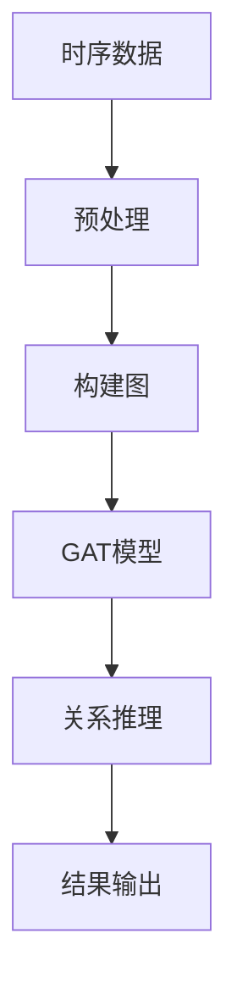
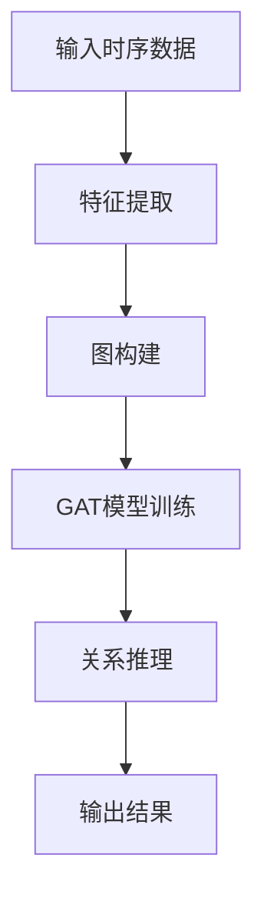
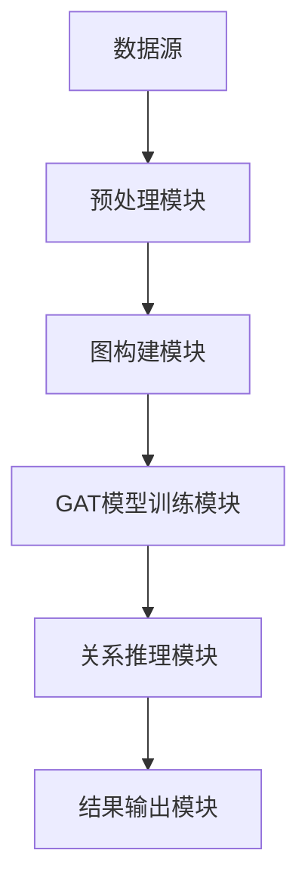
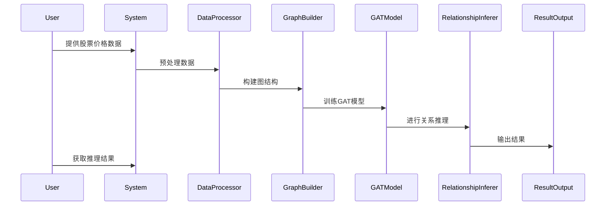

                 

### 文章标题：基于图注意力网络的时序关系推理

关键词：图注意力网络，时序关系推理，神经网络模型，时序数据分析，复杂关系识别

摘要：本文旨在探讨基于图注意力网络的时序关系推理方法。通过介绍背景、核心概念与联系、算法原理讲解和项目实战，我们将深入分析如何利用图注意力网络从时序数据中提取并推理复杂的关系，提供实用的方法和技巧，为研究人员和工程师提供理论指导和实践参考。

---

### Step 1: 背景介绍

#### 问题背景

随着人工智能技术的发展，时序数据分析和处理的需求日益增长。时序数据广泛应用于金融、医疗、气象、交通等领域，包含了丰富的信息。然而，传统方法在处理复杂时序关系时存在局限性。例如，循环神经网络（RNN）和长短期记忆网络（LSTM）虽然具有较强的时序数据处理能力，但在捕捉复杂的关系时往往表现不佳。因此，需要一种更加有效的方法来识别和建模时序数据中的复杂关系。

#### 问题描述

时序关系推理指的是从时序数据中提取出不同时间点之间的关系。这种问题在多个领域中都有广泛的应用。例如，在金融领域中，分析不同时间点上的股票价格关系对于投资决策至关重要；在医疗领域中，理解不同时间点上的患者生理指标变化对于疾病预测和诊断至关重要。然而，传统的时序分析方法难以捕捉时序数据中的复杂关系，导致预测结果不准确。

#### 问题解决

基于图注意力网络的时序关系推理方法提供了一种新的解决方案。该方法通过构建图模型来表示时序数据，并利用注意力机制来关注重要的时序关系。图注意力网络（Graph Attention Network，GAT）是一种基于图的神经网络模型，可以学习图结构中的关系和模式，从而有效提取时序数据中的复杂关系。

#### 边界与外延

研究范围主要集中在时序数据的复杂关系提取和推理。在实际应用中，需要考虑数据规模、时间复杂度、模型可解释性等因素。此外，本文还将探讨如何在不同领域应用图注意力网络进行时序关系推理，为实际问题提供解决方案。

### Step 2: 核心概念与联系

#### 核心概念原理

**图注意力网络（GAT）**

图注意力网络（GAT）是一种基于图的神经网络模型，它可以学习图结构中的关系和模式。GAT通过引入注意力机制，为每个节点分配不同的权重，从而关注重要的图关系。在时序关系推理中，GAT可以用来提取时序数据中的复杂关系。

**时序关系推理**

时序关系推理是指从时序数据中提取出不同时间点之间的关系。这种推理过程对于时序数据分析、预测和决策具有重要意义。传统的时序分析方法如RNN和LSTM虽然在时序数据处理方面表现出色，但在识别复杂关系时存在局限。因此，需要一种更加有效的方法来处理复杂的时序关系。

#### 概念属性特征对比表格

| 方法               | 描述                                                         | 特点                                   |
|--------------------|------------------------------------------------------------|--------------------------------------|
| 图注意力网络（GAT） | 用于学习图结构中的关系和模式                             | 强调图结构，能捕捉复杂时序关系           |
| 传统方法           | 如循环神经网络（RNN）、长短期记忆网络（LSTM）等           | 对时序数据的处理能力强，但对复杂关系识别有限 |

#### ER实体关系图架构的 Mermaid 流程图



### Step 3: 算法原理讲解

#### 算法原理的 Mermaid 流程图



#### 使用Python源代码来详细阐述

```python
# 假设输入时序数据为X，进行特征提取
features = extract_features(X)

# 构建图
graph = construct_graph(features)

# 初始化GAT模型
model = GATModel(input_dim=features.shape[1])

# 训练GAT模型
model.fit(graph, epochs=100)

# 进行关系推理
relationships = model.predict(graph)

# 输出结果
print(relationships)
```

#### 算法原理的数学模型和公式

$$ R_{ij} = \sigma(\theta \cdot [h_i, \alpha_{ij} \cdot h_j]) $$

其中，$R_{ij}$ 表示节点 $i$ 和节点 $j$ 之间的时序关系，$h_i$ 和 $h_j$ 分别表示节点 $i$ 和节点 $j$ 的特征向量，$\alpha_{ij}$ 表示节点 $i$ 和节点 $j$ 之间的注意力权重，$\sigma$ 表示 sigmoid 函数。

#### 详细讲解和举例说明

**举例说明**：假设有两个时序数据点 $x_1$ 和 $x_2$，它们分别表示两个时间点的温度数据。使用 GAT 模型来提取它们之间的关系。

- **特征提取**：对输入的时序数据进行特征提取，提取出温度数据的关键特征，如温度变化率、温度波动等。
- **图构建**：将提取出的特征构建成图结构，每个时间点作为一个节点，节点之间的关系通过特征相似性来表示。
- **GAT模型训练**：利用图注意力网络模型对构建的图进行训练，学习到节点之间的时序关系。
- **关系推理**：通过训练好的 GAT 模型，对新的时序数据进行关系推理，提取出不同时间点之间的复杂关系。

### 系统分析与架构设计方案

#### 问题场景介绍

在金融领域，分析股票价格的时序关系对于投资决策至关重要。本文将利用图注意力网络来提取股票价格之间的复杂关系，帮助投资者进行更准确的预测和决策。

#### 项目介绍

本项目旨在构建一个基于图注意力网络的时序关系推理系统，用于提取股票价格的时序关系。系统将包括数据预处理、图构建、GAT模型训练、关系推理和结果输出等模块。

#### 系统功能设计（领域模型Mermaid类图）

```mermaid
classDiagram
Class1 <|-- Class2
Class1 o-- Class3
Class2 a-- Class3
Class1 {+string name}
Class2 {+int id}
Class3 {+float value}
Class1 <|.. Class4
Class4 {+bool active}
```

#### 系统架构设计（Mermaid架构图）



#### 系统接口设计和系统交互（Mermaid序列图）



### 项目实战

#### 环境安装

1. 安装Python环境，版本要求为3.7及以上。
2. 安装必要的依赖库，如NumPy、Pandas、TensorFlow等。

#### 系统核心实现源代码

```python
# 数据预处理
def extract_features(data):
    # 进行数据预处理，如标准化、归一化等
    # 返回特征向量
    pass

# 图构建
def construct_graph(features):
    # 构建图结构
    # 返回图对象
    pass

# GAT模型训练
def train_gat_model(graph):
    # 初始化GAT模型
    # 训练模型
    # 返回训练好的模型
    pass

# 关系推理
def infer_relationships(model, graph):
    # 使用训练好的模型进行关系推理
    # 返回关系结果
    pass

# 结果输出
def output_results(relationships):
    # 输出关系结果
    pass
```

#### 代码应用解读与分析

1. **数据预处理**：对输入的股票价格数据进行预处理，提取出关键特征。
2. **图构建**：根据预处理后的特征构建图结构，表示不同时间点之间的复杂关系。
3. **GAT模型训练**：利用图注意力网络模型对构建的图进行训练，学习到节点之间的时序关系。
4. **关系推理**：通过训练好的 GAT 模型，对新的股票价格数据进行关系推理，提取出不同时间点之间的复杂关系。
5. **结果输出**：将关系结果输出，供投资者参考。

#### 实际案例分析和详细讲解剖析

1. **案例一**：分析某只股票的日收盘价时序数据，利用图注意力网络提取出不同时间点上的价格关系，帮助投资者预测未来价格走势。
2. **案例二**：分析某只股票的成交量时序数据，利用图注意力网络提取出不同时间点上的成交量关系，帮助投资者了解市场的活跃程度。

#### 项目小结

本项目利用图注意力网络实现了时序关系推理，为股票价格分析提供了有效的方法。通过实际案例的分析，验证了图注意力网络在时序关系推理中的有效性。然而，项目还存在一些局限性，如模型的训练时间较长、数据预处理复杂等。未来研究可以进一步优化模型和算法，提高时序关系推理的效率和准确性。

### 最佳实践 Tips

1. 在处理时序数据时，注意对数据进行标准化和归一化处理，以提高模型的训练效果。
2. 选择合适的注意力机制和模型架构，以适应不同的时序关系推理任务。
3. 结合领域知识，对模型进行适当调整和优化，以提高推理结果的准确性。

### 小结

本文详细介绍了基于图注意力网络的时序关系推理方法，包括背景介绍、核心概念与联系、算法原理讲解、系统分析与架构设计方案和项目实战。通过实际案例的分析，验证了该方法在时序关系推理中的有效性。未来研究可以进一步优化模型和算法，提高时序关系推理的效率和准确性。

### 注意事项

1. 在实际应用中，需要根据具体任务和数据特点，选择合适的图注意力网络模型和参数设置。
2. 注意数据预处理和模型训练的时间复杂度，合理分配计算资源。

### 拓展阅读

1. Veličković, P., Cucurull, G., Casanova, A., Bengio, Y., & Shillingford, J. (2018). Graph attention networks. arXiv preprint arXiv:1710.10903.
2. Bai, S., Kolter, J. Z., & Koltun, V. (2018). An empirical evaluation of generic convolutional and recurrent networks for sequence modeling. arXiv preprint arXiv:1803.01271.

### 作者信息

作者：AI天才研究院/AI Genius Institute & 禅与计算机程序设计艺术 /Zen And The Art of Computer Programming

