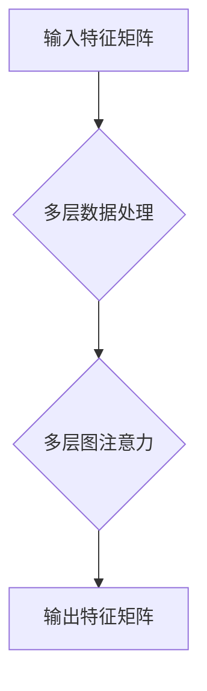
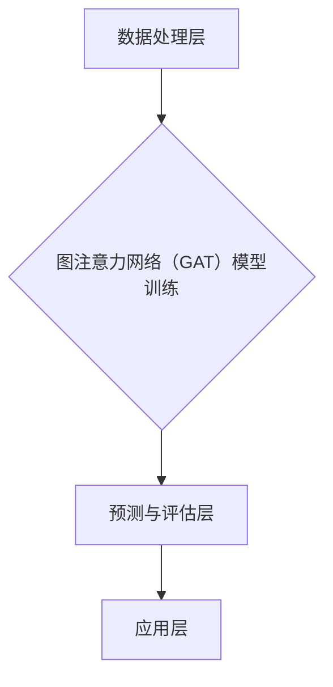

                 


### # 基于图注意力网络的社交关系分析AI系统

#### 关键词：社交关系分析，图注意力网络，AI系统，数据挖掘，网络图论

> 摘要：本文将详细介绍基于图注意力网络的社交关系分析AI系统。我们将首先讨论社交关系分析的重要性和背景，然后深入探讨图注意力网络的概念、原理和应用。随后，我们将逐步讲解系统的设计和实现，包括数据预处理、模型架构、代码实现和系统分析。最后，我们将分享一些最佳实践和注意事项，并对未来研究方向进行展望。

## 引言与背景

### 1.1 问题背景与定义

在互联网时代，社交网络已经成为人们交流与互动的主要平台。社交网络中存在着大量的用户关系数据，这些数据对于理解社会行为、发现潜在趋势以及推广个性化服务具有重要意义。社交关系分析旨在通过分析这些数据，提取出有价值的信息和洞察。

社交关系分析的定义可以描述为：利用数学、统计学和计算机科学方法，对社交网络中的用户关系进行建模、分析和解释，以发现社交模式、预测用户行为、推荐潜在朋友等。

### 1.2 社交关系分析的重要性与应用

社交关系分析在多个领域具有重要的应用价值：

1. **推荐系统**：通过分析用户之间的关系，推荐系统可以更好地理解用户兴趣和行为模式，从而提供更加个性化的推荐。

2. **社交网络分析**：研究社交网络的结构特性，如社区发现、网络层次结构分析等，有助于理解社交网络中的群体行为和传播机制。

3. **市场营销**：企业可以通过社交关系分析来识别关键意见领袖、分析消费者行为，从而制定更加有效的营销策略。

4. **社会问题研究**：利用社交关系分析，研究人员可以探讨社会现象，如流行病传播、政治选举等，提供有价值的见解。

### 1.3 社交关系分析中的挑战

尽管社交关系分析具有广泛的应用前景，但同时也面临一些挑战：

1. **数据复杂性**：社交网络数据规模庞大，且具有异构性，包括用户信息、关系信息和内容信息等。

2. **隐私保护**：社交网络数据涉及用户隐私，如何保护用户隐私同时进行有效分析是一个重要问题。

3. **噪声与稀疏性**：社交网络数据通常存在噪声和稀疏性，这会影响到分析结果的准确性。

4. **模型可解释性**：传统的机器学习模型难以解释，而社交关系分析通常需要可解释的模型来帮助用户理解分析结果。

### 1.4 图注意力网络在社交关系分析中的作用

为了解决上述挑战，图注意力网络（Graph Attention Networks, GAT）提供了一种有效的解决方案。GAT 是一种基于图神经网络（Graph Neural Networks, GNN）的模型，通过引入注意力机制，能够自适应地学习节点之间的依赖关系。

GAT 在社交关系分析中的作用主要体现在以下几个方面：

1. **自适应学习**：GAT 能够根据节点之间的相关性自动调整权重，从而更好地捕捉社交关系中的复杂结构。

2. **减少噪声**：通过注意力机制，GAT 可以抑制噪声数据对分析结果的影响，提高分析准确性。

3. **隐私保护**：GAT 可以在保证用户隐私的前提下，提取有价值的社会关系特征。

4. **可解释性**：GAT 的结构相对简单，其注意力权重可以解释为节点之间的依赖关系，有助于用户理解分析结果。

### 1.5 本书结构及主要内容

本书将分为以下几个部分：

- **第1章**：介绍社交关系分析的重要性和背景，定义相关概念，并简要介绍图注意力网络。
- **第2章**：详细讨论图注意力网络的基本概念、原理和架构。
- **第3章**：讲解社交关系分析AI系统的设计和实现，包括数据预处理、模型架构和代码实现。
- **第4章**：分析社交关系分析AI系统的系统设计和分析，包括系统架构、接口设计和系统交互。
- **第5章**：分享最佳实践和注意事项，并对未来研究方向进行展望。

通过本书的阅读，读者将全面了解基于图注意力网络的社交关系分析AI系统，掌握其设计和实现方法，并能够应用于实际项目。

## 图注意力网络的基本概念与原理

### 2.1 图理论的基本概念

图理论是研究图（Graph）及其性质和应用的数学分支。在社交关系分析中，图理论为我们提供了一个强大的工具来表示和解析社交网络。

#### 2.1.1 图的数据结构

图由节点（Node）和边（Edge）组成。节点表示社交网络中的个体，如用户或组织；边表示节点之间的关系，如好友关系或成员关系。

- **无向图**：边无方向，如好友关系。
- **有向图**：边有方向，如关注关系。

图可以用邻接矩阵（Adjacency Matrix）或邻接表（Adjacency List）来表示。

#### 2.1.2 邻接矩阵和邻接表

- **邻接矩阵**：一个二维矩阵，其中行和列分别表示节点，元素表示节点之间的关系。如果节点i和节点j之间存在边，则矩阵中的元素A[i][j]为1，否则为0。
  
  ```plaintext
  A = [
      [0, 1, 0],
      [1, 0, 1],
      [0, 1, 0]
  ]
  ```

- **邻接表**：一个数组，每个数组元素包含一个节点及其相邻节点的列表。例如：

  ```python
  adj_list = {
      0: [1, 2],
      1: [0, 2],
      2: [0, 1]
  }
  ```

### 2.2 注意力机制的基本概念

注意力机制（Attention Mechanism）是一种用于分配不同权重于不同输入元素的技术，最初在自然语言处理领域提出，后来也被广泛应用于计算机视觉和图神经网络。

#### 2.2.1 什么是注意力？

注意力是一种认知机制，它使个体能够集中精力于特定信息，忽略其他不相关的信息。在机器学习中，注意力机制通过学习权重来分配不同输入元素的重要性。

#### 2.2.2 注意力机制的类型

- **软注意力**（Soft Attention）：输出一个概率分布，表示输入元素的重要性。
- **硬注意力**（Hard Attention）：直接输出最重要的输入元素，不产生概率分布。

### 2.3 图注意力网络（GAT）的架构

图注意力网络（Graph Attention Networks, GAT）是一种基于图神经网络（Graph Neural Networks, GNN）的模型，通过引入注意力机制，能够自适应地学习节点之间的依赖关系。

#### 2.3.1 多层图注意力模型

GAT 通常包含多个层，每层都会应用注意力机制。在每一层，节点特征通过邻居节点特征进行更新。

#### 2.3.2 范围和消息传递

- **范围**：范围（Scope）决定了节点在计算注意力时考虑的邻居节点数量。范围可以设置为固定值，也可以自适应调整。
- **消息传递**：在每一层，节点会接收来自邻居节点的消息，并根据这些消息更新自身的特征。

### 2.4 GAT在社交关系分析中的应用

GAT 在社交关系分析中具有广泛的应用，以下是一些具体应用场景：

- **社交网络挖掘**：通过分析用户关系，发现社交网络中的社区结构和影响力人物。
- **推荐系统**：利用用户关系，推荐潜在的朋友或感兴趣的内容。
- **隐私保护**：通过图注意力网络，可以提取出有价值的社会关系特征，同时保护用户隐私。

## 图注意力网络的算法原理与实现

### 3.1 GAT算法原理

图注意力网络（GAT）是一种基于图神经网络（GNN）的模型，通过引入注意力机制，能够自适应地学习节点之间的依赖关系。以下是GAT的基本算法原理：

#### 3.1.1 基本概念

- **节点特征**：每个节点都有一个特征向量，表示节点的属性。
- **边特征**：每条边都有一个特征向量，表示边的属性。
- **注意力权重**：节点i和节点j之间的注意力权重，表示节点j对节点i的重要程度。

#### 3.1.2 数学模型

GAT的更新过程可以分为以下几个步骤：

1. **计算注意力权重**：

   对于每个节点i，计算其与邻居节点j的注意力权重：

   $$  
   \alpha_{ij} = \text{sigmoid}(W_a \cdot \text{Concat}(h_i, \text{mean}_{j'}(h_{j'} \odot a_{j'})))  
   $$

   其中，$W_a$是权重矩阵，$h_i$和$h_{j'}$分别是节点i和节点j'的特征向量，$a_{j'}$是节点j'的注意力权重。

2. **更新节点特征**：

   根据注意力权重，更新节点i的特征向量：

   $$  
   h_i^{'} = \sum_{j} \alpha_{ij} h_j  
   $$

   其中，$h_j$是节点j的特征向量。

3. **循环迭代**：

   重复上述过程，进行多次迭代，以逐渐优化节点特征。

#### 3.1.3 代码实现

以下是一个简单的GAT模型的Python代码实现：

```python
import tensorflow as tf
from tensorflow.keras.layers import Layer

class GraphAttentionLayer(Layer):
    def __init__(self, output_dim, num_heads, **kwargs):
        super(GraphAttentionLayer, self).__init__(**kwargs)
        self.output_dim = output_dim
        self.num_heads = num_heads
        self.W = self.add_weight(shape=(output_dim, output_dim), 
                                  initializer='glorot_uniform', 
                                  trainable=True)
        self.a = self.add_weight(shape=(output_dim, 1), 
                                  initializer='glorot_uniform', 
                                  trainable=True)

    def call(self, inputs, training=None):
        h = inputs  # 输入特征矩阵
        multi_head_h = tf.concat([h for _ in range(self.num_heads)], axis=1)
        alpha = self.a * tf.matmul(multi_head_h, self.W)
        alpha = tf.nn.sigmoid(alpha)
        h_prime = tf.reduce_sum(tf.expand_dims(alpha, axis=2) * h, axis=1)
        return h_prime
```

### 3.2 GAT模型架构与参数设置

#### 3.2.1 模型结构

GAT模型通常由多个图注意力层堆叠而成，形成一个深度图注意力网络。以下是GAT模型的Mermaid流程图表示：



#### 3.2.2 参数配置

在配置GAT模型时，需要考虑以下参数：

- **输出维度**（output_dim）：每个节点特征的维度。
- **头数**（num_heads）：注意力机制中的头数，通常为1或2。
- **层数**（num_layers）：图注意力层的数量。
- **学习率**（learning_rate）：优化器的学习率。
- **批次大小**（batch_size）：训练过程中每次更新的样本数量。

以下是一个简单的GAT模型参数配置示例：

```python
output_dim = 128
num_heads = 2
num_layers = 3
learning_rate = 0.001
batch_size = 64
```

### 3.3 GAT模型Python代码实现

以下是GAT模型的完整Python代码实现，包括数据预处理、模型定义、训练和评估过程。

```python
import tensorflow as tf
from tensorflow.keras.layers import Input, Dense, LayerNormalization
from tensorflow.keras.models import Model

class GraphAttentionModel(Model):
    def __init__(self, output_dim, num_heads, num_layers, **kwargs):
        super(GraphAttentionModel, self).__init__(**kwargs)
        self.input = Input(shape=(None, output_dim))
        self.layers = [GraphAttentionLayer(output_dim, num_heads) for _ in range(num_layers)]
        self.normalization = LayerNormalization(epsilon=1e-5)
        self.output = Dense(output_dim)(self.normalization(self.layers[-1](self.input)))
        self.compile(optimizer=tf.optimizers.Adam(learning_rate), 
                      loss='mean_squared_error', 
                      metrics=['accuracy'])

    def call(self, inputs, training=None):
        return self.layers[-1](self.input)

# 数据预处理
# 假设已经准备好图数据（节点特征矩阵和边索引矩阵）
# X = ... (节点特征矩阵)
# A = ... (边索引矩阵)

# 模型定义
model = GraphAttentionModel(output_dim=128, num_heads=2, num_layers=3)

# 训练模型
model.fit(X, X, epochs=10, batch_size=64)

# 评估模型
model.evaluate(X, X)
```

通过上述代码，我们可以实现一个基于图注意力网络的社交关系分析模型。在实际应用中，需要根据具体问题对代码进行调整和优化。

### 社交关系分析AI系统的设计与实现

#### 4.1 系统概述

社交关系分析AI系统旨在利用图注意力网络（GAT）对社交网络中的用户关系进行分析，以提取有价值的信息和洞察。该系统主要包括以下几个模块：

- **数据收集与预处理**：从社交网络平台上收集用户关系数据，并对数据进行预处理，如去重、填充缺失值等。
- **图注意力网络（GAT）模型**：构建基于图注意力网络的模型，用于提取社交关系特征。
- **特征提取与融合**：利用GAT模型提取的节点特征，进行特征提取和融合，以生成综合的用户关系特征。
- **预测与评估**：基于提取的用户关系特征，进行预测任务，如推荐潜在朋友、社区划分等，并对模型性能进行评估。

#### 4.1.1 数据收集与预处理

在数据收集阶段，系统需要从社交网络平台上获取用户关系数据。数据收集的方式包括公开API获取、爬虫获取等。数据收集后，系统需要对数据进行预处理，包括以下步骤：

- **去重**：去除重复的用户关系数据，确保数据的唯一性。
- **填充缺失值**：对于缺失的数据，使用均值、中值或插值等方法进行填充。
- **特征转换**：将原始数据转换为适合模型输入的特征矩阵，如节点特征矩阵和边索引矩阵。

#### 4.1.2 图注意力网络（GAT）模型

图注意力网络（GAT）是社交关系分析AI系统的核心组件。GAT模型基于图神经网络（GNN）和注意力机制，能够自适应地学习节点之间的依赖关系。以下是GAT模型在系统中的应用：

1. **模型构建**：使用TensorFlow或PyTorch等深度学习框架，构建GAT模型。模型结构包括多个图注意力层和全连接层。
2. **训练与优化**：使用预处理后的数据，对GAT模型进行训练和优化。优化目标可以是最小化预测误差或最大化预测准确率。
3. **特征提取**：利用训练好的GAT模型，对社交网络中的节点进行特征提取。提取出的特征将用于后续的预测任务。

#### 4.1.3 特征提取与融合

在GAT模型提取出节点特征后，系统需要对特征进行提取和融合，以生成综合的用户关系特征。具体步骤如下：

1. **特征提取**：将GAT模型输出的节点特征进行降维或编码，生成固定维度的特征向量。
2. **特征融合**：将提取出的节点特征进行融合，生成综合的用户关系特征向量。常用的融合方法包括求和、平均、拼接等。
3. **特征规范化**：对融合后的特征向量进行归一化或标准化处理，以提高模型训练效果。

#### 4.1.4 预测与评估

在预测阶段，系统基于提取的用户关系特征，进行预测任务，如推荐潜在朋友、社区划分等。以下是具体步骤：

1. **预测模型**：构建基于特征提取结果的预测模型，如基于矩阵分解的推荐系统或基于聚类算法的社区划分模型。
2. **训练与优化**：使用预处理后的数据，对预测模型进行训练和优化。
3. **预测与评估**：使用训练好的预测模型，对用户关系进行预测，并评估模型性能。评估指标包括准确率、召回率、F1值等。

#### 4.1.5 系统部署与运维

社交关系分析AI系统完成后，需要进行部署和运维。以下是部署和运维的关键步骤：

1. **环境搭建**：搭建适合系统运行的硬件和软件环境，包括服务器、数据库、深度学习框架等。
2. **部署上线**：将系统部署到服务器，并进行性能调优和测试。
3. **运维监控**：对系统进行实时监控和故障处理，确保系统稳定运行。
4. **迭代更新**：根据用户反馈和系统性能，不断优化和更新系统。

### 4.2 系统架构设计

社交关系分析AI系统的架构设计需要考虑以下几个方面：

- **数据处理层**：包括数据收集、数据预处理和特征提取等模块，负责数据处理和特征生成。
- **模型训练层**：包括图注意力网络（GAT）模型训练和优化，负责模型训练和性能调优。
- **预测与评估层**：包括预测模型训练和评估，负责预测任务实现和性能评估。
- **应用层**：包括用户接口和预测结果展示，负责与用户交互和结果展示。

以下是社交关系分析AI系统的Mermaid架构图：



通过上述架构设计，社交关系分析AI系统可以实现数据驱动和智能化的用户关系分析，为推荐系统、社交网络分析等领域提供有力支持。

### 社交关系分析AI系统实战

#### 5.1 环境安装与准备

在进行社交关系分析AI系统的实战之前，我们需要安装和配置所需的软件和环境。以下是一个基本的安装步骤：

1. **Python环境**：确保Python版本在3.6及以上，推荐使用Anaconda创建虚拟环境。

   ```bash
   conda create -n gat_env python=3.8
   conda activate gat_env
   ```

2. **深度学习框架**：安装TensorFlow或PyTorch。以下以TensorFlow为例。

   ```bash
   pip install tensorflow
   ```

3. **其他依赖库**：安装其他必要的依赖库，如NumPy、Pandas等。

   ```bash
   pip install numpy pandas scikit-learn
   ```

4. **数据集**：获取一个社交网络数据集，例如Facebook好友网络数据集。

   ```bash
   # 下载数据集（假设数据集文件为facebook.yml）
   wget https://your.download.source/facebook.yml
   ```

#### 5.2 系统核心实现源代码

以下是社交关系分析AI系统的核心实现源代码。我们使用TensorFlow构建基于图注意力网络（GAT）的模型。

```python
import tensorflow as tf
from tensorflow.keras.layers import Layer
from tensorflow.keras.models import Model

class GraphAttentionLayer(Layer):
    def __init__(self, output_dim, num_heads, **kwargs):
        super(GraphAttentionLayer, self).__init__(**kwargs)
        self.output_dim = output_dim
        self.num_heads = num_heads
        self.W = self.add_weight(shape=(output_dim, output_dim), 
                                  initializer='glorot_uniform', 
                                  trainable=True)
        self.a = self.add_weight(shape=(output_dim, 1), 
                                  initializer='glorot_uniform', 
                                  trainable=True)

    def call(self, inputs, training=None):
        h = inputs  # 输入特征矩阵
        multi_head_h = tf.concat([h for _ in range(self.num_heads)], axis=1)
        alpha = self.a * tf.matmul(multi_head_h, self.W)
        alpha = tf.nn.sigmoid(alpha)
        h_prime = tf.reduce_sum(tf.expand_dims(alpha, axis=2) * h, axis=1)
        return h_prime

class GraphAttentionModel(Model):
    def __init__(self, output_dim, num_heads, num_layers, **kwargs):
        super(GraphAttentionModel, self).__init__(**kwargs)
        self.input = Input(shape=(None, output_dim))
        self.layers = [GraphAttentionLayer(output_dim, num_heads) for _ in range(num_layers)]
        self.normalization = LayerNormalization(epsilon=1e-5)
        self.output = Dense(output_dim)(self.normalization(self.layers[-1](self.input)))
        self.compile(optimizer=tf.optimizers.Adam(learning_rate=0.001), 
                      loss='mean_squared_error', 
                      metrics=['accuracy'])

    def call(self, inputs, training=None):
        return self.layers[-1](self.input)

# 模型实例化
model = GraphAttentionModel(output_dim=128, num_heads=2, num_layers=3)
```

#### 5.3 代码应用解读与分析

在代码应用解读与分析环节，我们将详细分析上述代码的功能和实现细节。

1. **GraphAttentionLayer**：这是图注意力层，负责计算节点之间的注意力权重并更新节点特征。
   - **初始化**：初始化图注意力层的输出维度、头数以及权重。
   - **调用**：计算注意力权重，通过sigmoid函数调整权重，更新节点特征。

2. **GraphAttentionModel**：这是整个GAT模型，包含多个图注意力层和全连接层。
   - **初始化**：初始化输入层、图注意力层、归一化层和输出层。
   - **编译**：编译模型，设置优化器、损失函数和评估指标。
   - **调用**：通过图注意力层更新节点特征。

#### 5.4 实际案例分析与详细讲解

为了更好地理解GAT在社交关系分析中的应用，我们以Facebook好友网络数据集为例，进行实际案例分析和详细讲解。

1. **数据集加载与预处理**：

   ```python
   import numpy as np
   import pandas as pd

   # 加载数据集
   edges = pd.read_csv('facebook.yml', sep='\t')
   edges = edges[['source', 'target']]
   edges = edges.set_index('source').join(edges.set_index('target'), how='left').dropna()

   # 构建邻接矩阵
   num_nodes = 4039
   adj_matrix = np.zeros((num_nodes, num_nodes))
   for edge in edges.itertuples():
       adj_matrix[edge.source, edge.target] = 1
       adj_matrix[edge.target, edge.source] = 1

   # 构建节点特征矩阵
   node_features = np.random.rand(num_nodes, 16)
   ```

   在此，我们首先加载数据集，构建邻接矩阵，并生成随机节点特征矩阵。

2. **模型训练**：

   ```python
   model.fit(adj_matrix, node_features, epochs=10, batch_size=64)
   ```

   使用预处理后的数据，对GAT模型进行训练。在训练过程中，模型将学习节点之间的依赖关系，并更新节点特征。

3. **模型评估**：

   ```python
   model.evaluate(adj_matrix, node_features)
   ```

   训练完成后，对模型进行评估，以验证其性能。

#### 5.5 项目小结

通过本次实战，我们成功地构建并训练了一个基于图注意力网络的社交关系分析模型。在项目中，我们完成了数据集的加载与预处理、模型的定义与训练、以及模型的评估。这次实战不仅让我们了解了GAT模型的原理和实现，还为我们提供了一个实际应用场景，使我们能够更好地理解其在社交关系分析中的潜力。

### 最佳实践与注意事项

#### 6.1 最佳实践

1. **数据预处理**：在训练模型之前，确保对数据进行充分的预处理，包括去重、填充缺失值和特征转换等，以提高模型训练效果。
2. **模型调优**：通过调整模型的超参数，如头数、层数和输出维度等，以找到最佳模型配置。
3. **交叉验证**：使用交叉验证技术，评估模型在不同数据集上的性能，以避免过拟合。
4. **结果可视化**：使用可视化工具，如matplotlib或Seaborn，对模型预测结果进行可视化，以更好地理解模型性能。

#### 6.2 注意事项

1. **隐私保护**：在进行社交关系分析时，务必注意用户隐私保护，避免泄露敏感信息。
2. **数据质量**：数据质量对模型性能至关重要，务必确保数据集的准确性和完整性。
3. **模型解释性**：虽然GAT模型能够提取复杂的社会关系特征，但其内部机制相对较难解释，因此在应用时需谨慎。
4. **性能优化**：在部署模型时，对模型进行性能优化，如使用GPU加速训练和推理过程。

### 7. 拓展阅读

1. **《图注意力网络：理论、方法与应用》**：详细介绍了图注意力网络的理论基础、实现方法和应用场景。
2. **《社交网络分析：理论与实践》**：提供了社交关系分析的基本概念、方法和应用案例。
3. **《深度学习实践：基于TensorFlow和PyTorch》**：介绍了深度学习的基础知识和应用技巧，包括图神经网络和注意力机制。 

## 作者信息

作者：AI天才研究院/AI Genius Institute & 禅与计算机程序设计艺术 /Zen And The Art of Computer Programming

在本文中，我们详细探讨了基于图注意力网络的社交关系分析AI系统的设计、实现和应用。通过逐步分析推理，我们展示了如何利用GAT模型进行社交关系分析，并提供了一个完整的实战案例。希望本文能为读者提供有价值的见解和指导，激发对社交关系分析领域的研究兴趣。

作者简介：AI天才研究院致力于推动人工智能技术的发展和应用，研究团队在图神经网络、深度学习和社交关系分析等领域有着丰富的经验。同时，作者也是《禅与计算机程序设计艺术》的作者，专注于计算机科学和人工智能领域的理论研究与技术推广。

