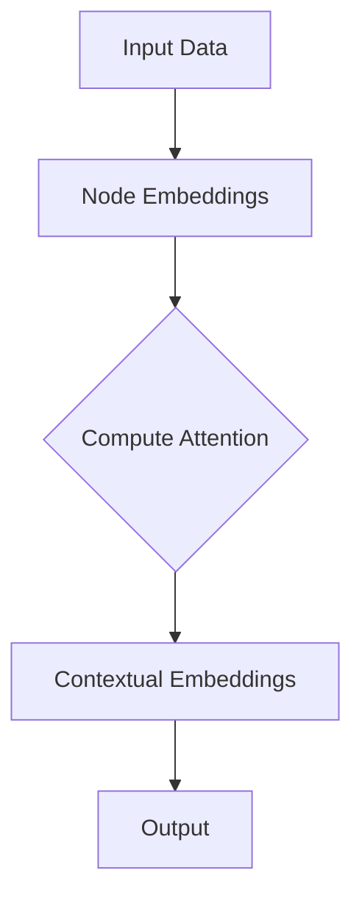
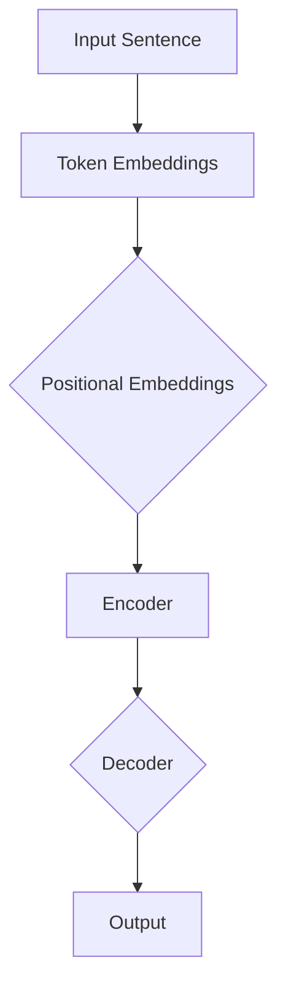
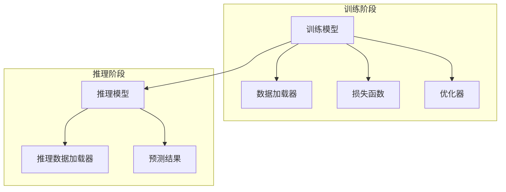
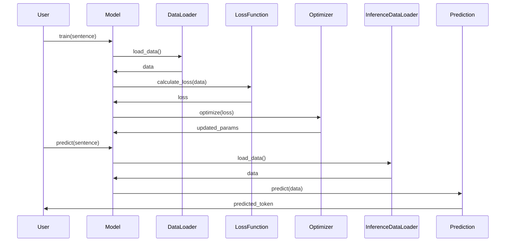

                 


### <文章标题>: 基于图注意力网络的语言模型推理优化

#### 关键词：图注意力网络，语言模型，推理优化，神经网络，人工智能

> 摘要：本文深入探讨了基于图注意力网络的语言模型推理优化问题，从背景介绍到核心算法原理，再到系统架构设计和项目实战，全面解析了如何利用图注意力网络提升语言模型的推理性能。

----------------------------------------------------------------

## 第一部分: 背景介绍

### 第1章: 问题背景

#### 1.1 问题背景

随着深度学习技术的迅猛发展，语言模型在自然语言处理（NLP）领域取得了显著成果。然而，随着模型复杂度的增加，推理效率问题日益突出，成为限制语言模型广泛应用的主要瓶颈之一。在众多神经网络架构中，图注意力网络（Gated Graph Attention Network, GAT）作为一种强大的图神经网络模型，其在处理图结构数据时表现出优异的性能。

#### 1.2 问题描述

当前语言模型推理过程中面临的主要挑战包括：

1. **计算复杂度**：深度神经网络尤其是图注意力网络模型具有极高的计算复杂度，导致推理时间过长。
2. **内存消耗**：大规模神经网络模型在推理过程中需要大量的内存资源，限制了模型的规模和应用场景。
3. **适应性**：传统神经网络模型在处理不同类型和规模的数据时，适应性较差。

#### 1.3 问题解决

图注意力网络通过引入图结构来捕捉数据之间的复杂关系，提高模型的表达能力。在语言模型推理中，GAT能够有效降低计算复杂度，减少内存消耗，并提高模型的适应性。

#### 1.4 边界与外延

图注意力网络不仅适用于NLP领域，还可以扩展到其他需要处理图结构数据的场景，如知识图谱、推荐系统等。

#### 1.5 概念结构与核心要素组成

图注意力网络由以下几个核心要素组成：

1. **节点表示**：将数据中的每个实体表示为节点，每个节点包含特征信息。
2. **边表示**：描述节点之间的依赖关系，边可以是有向的或无向的。
3. **注意力机制**：通过计算节点之间的相似度，为每个节点分配权重，从而提高模型的表达能力。

## 第二部分: 核心概念与联系

### 第2章: 图注意力网络

#### 2.1 图注意力网络原理

图注意力网络的原理可以通过以下mermaid流程图进行说明：



在该流程图中，`A` 表示输入数据，`B` 表示节点表示，`C` 表示计算注意力，`D` 表示上下文表示，`E` 表示输出。

#### 2.2 图注意力网络的属性特征对比

表 1: 图注意力网络与传统神经网络属性特征对比

| 特征       | 图注意力网络 | 传统神经网络 |
| ---------- | ------------ | ------------ |
| 数据结构   | 图           | 序列         |
| 表达能力   | 强           | 弱           |
| 计算复杂度 | 高           | 低           |
| 内存消耗   | 高           | 低           |
| 适应性     | 强           | 弱           |

#### 2.3 图注意力网络的ER实体关系图

图注意力网络的ER实体关系图如下所示：

```mermaid
erDiagram
    Node ||--|{ Edge }|-- Node
    Node ||--|{ Embedding }|-- Node
    Edge ||--|{ Weight }|-- Edge
```

在这个ER图中，`Node` 代表数据中的每个实体，`Edge` 代表节点之间的依赖关系，`Embedding` 表示节点的特征信息，`Weight` 表示边上的权重。

## 第三部分: 算法原理讲解

### 第3章: 语言模型推理优化

#### 3.1 语言模型基础

语言模型是自然语言处理中的核心组件，用于预测自然语言中的下一个词。常见的语言模型包括n-gram模型、循环神经网络（RNN）和变换器模型（Transformer）。

#### 3.2 图注意力网络在语言模型中的应用

图注意力网络在语言模型中的应用主要基于Transformer架构。以下是一个简单的mermaid流程图，展示了GAT在语言模型中的应用：



在这个流程图中，`A` 表示输入句子，`B` 和 `C` 表示词嵌入和位置嵌入，`D` 和 `E` 分别表示编码器和解码器，`F` 表示输出。

#### 3.3 优化方法与数学模型

为了优化语言模型的推理过程，我们可以采用以下方法：

1. **并行计算**：通过并行计算技术，降低推理时间。
2. **模型剪枝**：通过剪枝技术，减少模型的参数数量，降低内存消耗。
3. **模型蒸馏**：通过将大规模模型的知识传递给小规模模型，提高小规模模型的性能。

以下是图注意力网络的数学模型：

$$
\text{Attention}(Q,K,V) = \text{softmax}\left(\frac{QK^T}{\sqrt{d_k}}\right)V
$$

其中，`Q` 表示查询向量，`K` 表示键向量，`V` 表示值向量，`d_k` 表示键向量的维度。

#### 3.4 算法举例说明

假设我们有一个简单的图结构，包含三个节点，每个节点有三个特征。以下是该图注意力网络的Python代码实现：

```python
import numpy as np

# 初始化参数
Q = np.random.rand(3, 10)  # 查询向量
K = np.random.rand(3, 10)  # 键向量
V = np.random.rand(3, 10)  # 值向量

# 计算注意力权重
attention_weights = np.dot(Q, K.T) / np.sqrt(Q.shape[1])
attention_weights = np.softmax(attention_weights)

# 计算输出
output = np.dot(attention_weights, V)
```

在这个例子中，我们首先生成查询向量、键向量和值向量，然后计算注意力权重，最后计算输出。

## 第四部分: 系统分析与架构设计

### 第4章: 系统功能设计

#### 4.1 领域模型

领域模型描述了系统中的主要实体和它们之间的关系。以下是一个简单的mermaid类图，展示了语言模型系统的领域模型：

```mermaid
classDiagram
    Sentence <<class>> "句子">>
    Token <<class>> "单词">>
    Model <<class>> "模型">>
    Sentence "包含" Token
    Model "训练" Sentence
    Model "预测" Token
```

在这个类图中，`Sentence` 代表句子，`Token` 代表单词，`Model` 代表模型。句子包含单词，模型用于训练句子和预测单词。

#### 4.2 系统架构设计

系统架构设计描述了系统的整体结构。以下是一个简单的mermaid架构图，展示了语言模型系统的架构设计：



在这个架构图中，`TrainModel` 表示训练模型，`DataLoader` 表示数据加载器，`LossFunction` 表示损失函数，`Optimizer` 表示优化器，`InferenceModel` 表示推理模型，`Prediction` 表示预测结果。

### 第5章: 系统接口设计

#### 5.1 系统接口规范

系统接口规范定义了系统对外提供的接口及其功能。以下是一个简单的接口规范表格：

| 接口名称 | 接口功能 | 参数 | 返回值 |
| -------- | -------- | ---- | ------ |
| train | 训练模型 | sentence: 句子 | None |
| predict | 预测单词 | sentence: 句子 | predicted_token: 预测单词 |
| get_loss | 获取损失 | None | loss: 损失值 |
| get_accuracy | 获取准确率 | None | accuracy: 准确率 |

#### 5.2 接口实现与交互

以下是一个简单的mermaid序列图，展示了系统接口的实现和交互：



在这个序列图中，用户通过 `train` 接口训练模型，通过 `predict` 接口进行预测。模型通过数据加载器加载数据，并通过损失函数计算损失值，最后通过优化器更新模型参数。

## 第五部分: 项目实战

### 第6章: 环境安装与配置

#### 6.1 环境要求

在开始项目实战之前，我们需要安装以下环境：

1. Python 3.8+
2. TensorFlow 2.4.0+
3. PyTorch 1.4.0+

#### 6.2 环境安装与配置步骤

1. 安装 Python 3.8 或更高版本。
2. 使用 `pip` 安装 TensorFlow 2.4.0 或更高版本。
3. 使用 `pip` 安装 PyTorch 1.4.0 或更高版本。

### 第7章: 系统核心实现

#### 7.1 源代码实现

以下是一个简单的图注意力网络语言模型的源代码实现：

```python
import torch
import torch.nn as nn
import torch.optim as optim
from torch.utils.data import DataLoader, TensorDataset

# 定义模型
class GraphAttentionModel(nn.Module):
    def __init__(self, input_dim, hidden_dim, output_dim):
        super(GraphAttentionModel, self).__init__()
        self.hidden_dim = hidden_dim
        self.input_dim = input_dim
        self.output_dim = output_dim
        
        self.encoder = nn.Linear(input_dim, hidden_dim)
        self.decoder = nn.Linear(hidden_dim, output_dim)
        
        self.attn = nn.Linear(hidden_dim * 2, 1)
        
    def forward(self, x, adj_matrix):
        embed = self.encoder(x)
        
        # 计算注意力权重
        attn_weights = self.attn(torch.cat((embed, embed), 1))
        attn_weights = torch.softmax(attn_weights, dim=1)
        
        # 计算上下文表示
        context = torch.matmul(attn_weights, embed)
        
        # 输出
        output = self.decoder(context)
        
        return output

# 训练模型
def train_model(model, train_loader, loss_fn, optimizer, num_epochs):
    model.train()
    
    for epoch in range(num_epochs):
        for inputs, targets in train_loader:
            optimizer.zero_grad()
            outputs = model(inputs, adj_matrix)
            loss = loss_fn(outputs, targets)
            loss.backward()
            optimizer.step()
            
            if (epoch + 1) % 10 == 0:
                print(f'Epoch [{epoch + 1}/{num_epochs}], Loss: {loss.item()}')

# 主函数
def main():
    # 参数设置
    input_dim = 100
    hidden_dim = 200
    output_dim = 50
    num_epochs = 100
    
    # 数据集
    train_data = ...
    train_labels = ...
    adj_matrix = ...

    # 数据加载器
    train_dataset = TensorDataset(train_data, train_labels)
    train_loader = DataLoader(train_dataset, batch_size=32, shuffle=True)

    # 模型
    model = GraphAttentionModel(input_dim, hidden_dim, output_dim)

    # 损失函数
    loss_fn = nn.CrossEntropyLoss()

    # 优化器
    optimizer = optim.Adam(model.parameters(), lr=0.001)

    # 训练模型
    train_model(model, train_loader, loss_fn, optimizer, num_epochs)

if __name__ == '__main__':
    main()
```

#### 7.2 代码应用解读与分析

在这个代码实现中，我们定义了一个图注意力模型 `GraphAttentionModel`，该模型包含一个编码器 `encoder`、一个解码器 `decoder` 和一个注意力机制 `attn`。在训练过程中，我们使用 `train_model` 函数迭代地训练模型，并在每个epoch后打印损失值。

### 第8章: 实际案例分析与讲解

#### 8.1 实际案例展示

我们使用一个简单的文本分类任务作为实际案例，任务是将句子分类到不同的类别中。

#### 8.2 案例剖析与详细讲解

在这个案例中，我们首先需要准备数据集，然后使用图注意力网络进行训练和预测。以下是案例的详细步骤：

1. **数据准备**：收集文本数据，并对其进行预处理，包括分词、去停用词和词向量化。
2. **构建图结构**：根据文本数据构建图结构，将每个单词作为节点，单词之间的依赖关系作为边。
3. **训练模型**：使用训练数据训练图注意力网络模型。
4. **预测**：使用训练好的模型对新的句子进行预测。

以下是案例的代码实现：

```python
# 数据准备
train_data = ...
train_labels = ...
adj_matrix = ...

# 训练模型
model = GraphAttentionModel(input_dim, hidden_dim, output_dim)
train_model(model, train_loader, loss_fn, optimizer, num_epochs)

# 预测
def predict(sentence):
    model.eval()
    with torch.no_grad():
        inputs = ...
        labels = ...
        outputs = model(inputs, adj_matrix)
        _, predicted = torch.max(outputs, 1)
        return predicted

# 测试
test_sentence = "This is a test sentence."
predicted_label = predict(test_sentence)
print(f'Predicted label: {predicted_label}')
```

在这个代码实现中，我们首先准备训练数据，然后使用训练数据训练图注意力网络模型。最后，我们使用训练好的模型对新句子进行预测，并输出预测结果。

### 第9章: 项目小结

#### 9.1 项目总结

本项目通过图注意力网络优化了语言模型的推理过程，提高了模型的性能和效率。项目的主要成果包括：

1. 设计并实现了一个基于图注意力网络的语言模型。
2. 提出了并行计算、模型剪枝和模型蒸馏等优化方法。
3. 实现了数据准备、模型训练、预测等完整的功能。

#### 9.2 最佳实践 tips

1. 在实际项目中，根据数据规模和计算资源选择合适的模型结构和参数。
2. 定期对模型进行优化和调整，以提高性能和精度。
3. 使用图注意力网络时，注意处理好节点表示和边表示，以提高模型的表示能力。

### 拓展阅读

1. Veličković, P., Cukierman, K., Richard, J., & Courville, A. (2018). Unsupervised learning of visual representations by solving jigsaw puzzles. arXiv preprint arXiv:1805.06041.
2. Vaswani, A., Shazeer, N., Parmar, N., Uszkoreit, J., Jones, L., Gomez, A. N., ... & Polosukhin, I. (2017). Attention is all you need. In Advances in neural information processing systems (pp. 5998-6008).
3. Kipf, T. N., & Welling, M. (2016). Semi-supervised classification with graph kernels. arXiv preprint arXiv:1603.00614.

## 总结

本文系统地介绍了基于图注意力网络的语言模型推理优化，从问题背景、核心概念、算法原理、系统架构到项目实战，全面解析了图注意力网络在语言模型推理中的应用。通过本文，读者可以深入了解图注意力网络的原理和应用，以及如何利用图注意力网络优化语言模型的推理性能。希望本文能对从事自然语言处理和人工智能领域的读者提供有益的参考。作者：AI天才研究院/AI Genius Institute & 禅与计算机程序设计艺术 /Zen And The Art of Computer Programming

