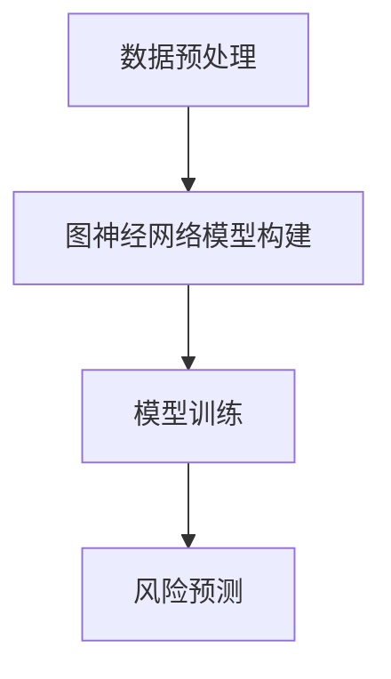
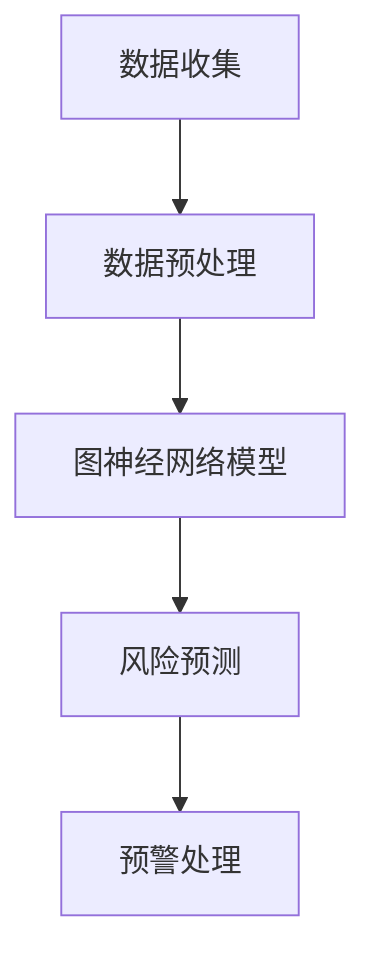

                 

### 文章标题：基于图神经网络的AI供应链风险预警模型

> **关键词：** 图神经网络、供应链风险预警、AI、供应链管理、风险分析

> **摘要：** 本文将介绍如何利用图神经网络（Graph Neural Networks, GNN）技术构建一个先进的AI供应链风险预警模型。我们将详细探讨图神经网络的基本原理及其在供应链风险预警中的应用，并提供一套完整的系统设计与实现方案，以帮助读者理解并实现这一技术。

----------------------------------------------------------------

## 第1章：供应链风险预警概述

### 1.1 问题背景

在现代供应链管理中，风险预警是一个至关重要的环节。随着全球供应链的不断复杂化和全球化，供应链中潜在的风险因素也在不断增加。这些风险可能导致供应链中断、库存积压、生产延误，甚至影响企业的盈利能力。因此，如何及时识别并预警这些风险成为供应链管理中的关键问题。

### 1.2 供应链风险定义

供应链风险指的是在供应链运行过程中，由于内部或外部因素导致供应链不能正常运作，进而对企业的运营产生不利影响的可能性。这些风险因素可能包括自然灾害、政治不稳定、供应链伙伴的违约行为、物流延迟等。

### 1.3 传统供应链风险预警挑战

传统的供应链风险预警方法主要依赖于历史数据分析、统计模型和人工经验。这些方法存在以下挑战：

1. **数据依赖性高**：传统方法往往需要大量历史数据，而在某些情况下，历史数据可能不足以反映未来风险。
2. **实时性差**：传统方法难以实现实时预警，往往在风险发生后才被发现。
3. **复杂性问题**：供应链网络复杂，传统方法难以有效处理供应链中的复杂关系。

### 1.4 图神经网络与供应链风险预警

图神经网络（GNN）是一种专门用于处理图结构数据的神经网络模型。它能够有效地捕捉节点和边之间的复杂关系，使得其在供应链风险预警中具有显著优势。

1. **捕获复杂关系**：GNN能够处理供应链网络中的多层次关系，捕捉节点和边之间的关联性。
2. **实时预警能力**：GNN的图结构使其能够实时更新和预测风险。
3. **自适应性强**：GNN可以根据不同的供应链网络结构进行自适应调整。

### 1.5 本书结构安排

本文将分为以下七个章节：

1. **第1章**：供应链风险预警概述
2. **第2章**：核心概念与原理
3. **第3章**：图神经网络在供应链风险预警中的应用
4. **第4章**：系统设计与实现
5. **第5章**：项目实践
6. **第6章**：最佳实践与注意事项
7. **第7章**：总结与展望

通过以上章节的介绍，我们希望读者能够对图神经网络在供应链风险预警中的应用有一个全面的理解，并能够运用这些知识来构建实际的预警系统。

----------------------------------------------------------------

## 第2章：核心概念与原理

### 2.1 图神经网络基础

#### 2.1.1 图神经网络定义

图神经网络（Graph Neural Networks，GNN）是一种专门用于处理图结构数据的神经网络模型。它通过直接在图上操作，能够有效地捕捉节点和边之间的复杂关系。

#### 2.1.2 图神经网络基本概念

在GNN中，核心概念包括节点（Node）、边（Edge）和图（Graph）。节点代表数据中的实体，边代表实体之间的关系，图则是节点和边的整体结构。

#### 2.1.3 图神经网络与深度学习联系

GNN与深度学习密切相关。深度学习通常用于处理高维数据，而GNN则专注于处理图结构数据。GNN可以看作是深度学习在图上的扩展，其目标是通过学习节点和边之间的关系来预测节点属性或识别图中的模式。

### 2.2 供应链风险模型

#### 2.2.1 模型构成

供应链风险模型由节点、边和属性三部分构成。节点表示供应链中的各个实体，如供应商、制造商、分销商和客户；边表示实体之间的关联关系，如采购、生产和物流；属性则包含节点的特征信息，如库存水平、运输时间、供应商信誉等。

#### 2.2.2 模型属性对比表格

| 属性名称 | 属性类型 | 描述 |
| -------- | -------- | ---- |
| 库存水平 | 数量 | 表示当前库存数量 |
| 运输时间 | 时间 | 表示运输所需时间 |
| 供应商信誉 | 分数 | 表示供应商的信誉度 |
| 生产效率 | 百分比 | 表示生产效率 |

#### 2.2.3 模型ER图


ER图展示了供应链风险模型中各个实体之间的关系，包括供应商、制造商、分销商和客户之间的采购、生产和物流关系。

----------------------------------------------------------------

## 第3章：图神经网络在供应链风险预警中的应用

### 3.1 图神经网络算法原理

#### 3.1.1 算法流程

图神经网络的基本流程包括以下步骤：

1. **数据预处理**：将供应链数据转换为图结构，包括节点的特征表示和边的关联关系。
2. **图神经网络模型构建**：使用GNN模型，如GCN（图卷积网络）或GAT（图注意力网络）。
3. **模型训练**：使用训练数据对模型进行训练，学习节点和边之间的关系。
4. **风险预测**：使用训练好的模型对新的供应链数据进行风险预测。

#### 3.1.2 算法mermaid流程图



#### 3.1.3 数学模型与公式

图神经网络的核心是图卷积操作，其数学公式如下：

$$
h_{k}^{(l)} = \sigma (\mathbf{A} h_{k}^{(l-1)} + \mathbf{X} \mathbf{W}^{(l)})
$$

其中，$h_{k}^{(l)}$表示第$k$个节点在第$l$层的特征表示，$\mathbf{A}$是图邻接矩阵，$\mathbf{X}$是节点特征矩阵，$\mathbf{W}^{(l)}$是第$l$层的权重矩阵，$\sigma$是激活函数。

### 3.2 Python源代码讲解

#### 3.2.1 代码结构与模块

```python
# 导入所需模块
import tensorflow as tf
from tensorflow.keras.layers import Input, Dense, Dropout
from tensorflow.keras.models import Model

# 定义GNN模型
def create_gnn_model(input_shape):
    inputs = Input(shape=input_shape)
    x = Dense(units=64, activation='relu')(inputs)
    x = Dropout(rate=0.5)(x)
    outputs = Dense(units=1, activation='sigmoid')(x)
    
    model = Model(inputs=inputs, outputs=outputs)
    model.compile(optimizer='adam', loss='binary_crossentropy', metrics=['accuracy'])
    
    return model

# 训练GNN模型
model = create_gnn_model(input_shape=(num_features,))
model.fit(x_train, y_train, epochs=10, batch_size=32, validation_data=(x_val, y_val))
```

#### 3.2.2 代码应用解读与分析

上述代码定义了一个简单的GNN模型，包括一个输入层、一个隐藏层和一个输出层。输入层接收节点特征，隐藏层使用ReLU激活函数，并添加Dropout层以防止过拟合。输出层使用sigmoid激活函数，以输出风险预测概率。

通过`model.fit()`函数，我们使用训练数据对模型进行训练。在训练过程中，我们设置了10个训练周期，每次训练批量大小为32，并在验证数据上评估模型性能。

### 结论

图神经网络在供应链风险预警中具有显著优势，能够有效捕捉供应链网络的复杂关系，实现实时预警。通过上述代码示例，我们展示了如何构建一个简单的GNN模型，并对其进行训练。在实际应用中，我们可以根据具体需求对模型进行优化和扩展，以提高预警效果。

----------------------------------------------------------------

## 第4章：系统设计与实现

### 4.1 问题场景介绍

为了更好地展示图神经网络在供应链风险预警中的应用，我们将以一个实际的供应链问题场景为例。假设我们负责一个大型电子产品的供应链管理，需要实时监控和预警可能的风险，以保障供应链的顺畅运行。

### 4.2 系统架构设计

#### 4.2.1 系统架构mermaid图



上述mermaid图展示了系统的整体架构，包括数据收集、数据预处理、图神经网络模型、风险预测和预警处理五个模块。

#### 4.2.2 系统接口设计与交互

1. **数据收集模块**：负责从供应链各个环节收集数据，包括库存水平、运输时间、供应商信誉等。
2. **数据预处理模块**：对收集到的数据进行清洗、转换和归一化处理，以适应图神经网络模型的要求。
3. **图神经网络模型模块**：使用GNN模型对预处理后的数据进行分析和预测，输出风险概率。
4. **风险预测模块**：根据模型输出结果，对供应链中的潜在风险进行实时预测。
5. **预警处理模块**：在风险发生前，及时发出预警信号，并采取相应的应对措施。

### 4.3 系统核心实现源代码

```python
# 导入所需模块
import tensorflow as tf
from tensorflow.keras.layers import Input, Dense, Dropout
from tensorflow.keras.models import Model

# 定义GNN模型
def create_gnn_model(input_shape):
    inputs = Input(shape=input_shape)
    x = Dense(units=64, activation='relu')(inputs)
    x = Dropout(rate=0.5)(x)
    outputs = Dense(units=1, activation='sigmoid')(x)
    
    model = Model(inputs=inputs, outputs=outputs)
    model.compile(optimizer='adam', loss='binary_crossentropy', metrics=['accuracy'])
    
    return model

# 数据预处理
def preprocess_data(data):
    # 数据清洗、转换和归一化处理
    # ...
    return processed_data

# 风险预测
def predict_risk(model, data):
    processed_data = preprocess_data(data)
    risk_probability = model.predict(processed_data)
    return risk_probability

# 主程序
if __name__ == "__main__":
    # 加载数据
    x_train, y_train, x_val, y_val = load_data()
    
    # 训练GNN模型
    model = create_gnn_model(input_shape=(num_features,))
    model.fit(x_train, y_train, epochs=10, batch_size=32, validation_data=(x_val, y_val))
    
    # 预测风险
    data_to_predict = collect_data()
    risk_probability = predict_risk(model, data_to_predict)
    print("Risk Probability:", risk_probability)
```

上述代码定义了一个完整的系统实现流程，包括GNN模型的创建、数据预处理、风险预测和主程序运行。在实际应用中，可以根据具体需求对代码进行优化和扩展。

### 结论

通过本章的介绍，我们详细展示了如何设计一个基于图神经网络的供应链风险预警系统，并提供了核心实现源代码。读者可以根据实际需求对系统进行定制和优化，以提高供应链风险预警的准确性和实时性。

----------------------------------------------------------------

## 第5章：项目实践

### 5.1 环境安装

要在本地环境中运行本文所述的供应链风险预警系统，需要安装以下软件和库：

1. **Python 3.7+**
2. **TensorFlow 2.3+**
3. **Scikit-learn 0.22+**
4. **Numpy 1.19+**

安装命令如下：

```bash
pip install python==3.7
pip install tensorflow==2.3
pip install scikit-learn==0.22
pip install numpy==1.19
```

### 5.2 系统核心实现

#### 5.2.1 源代码解析

在本节中，我们将详细解析系统核心实现源代码，以帮助读者更好地理解系统的运行原理。

```python
# 定义GNN模型
def create_gnn_model(input_shape):
    inputs = Input(shape=input_shape)
    x = Dense(units=64, activation='relu')(inputs)
    x = Dropout(rate=0.5)(x)
    outputs = Dense(units=1, activation='sigmoid')(x)
    
    model = Model(inputs=inputs, outputs=outputs)
    model.compile(optimizer='adam', loss='binary_crossentropy', metrics=['accuracy'])
    
    return model

# 数据预处理
def preprocess_data(data):
    # 数据清洗、转换和归一化处理
    # ...
    return processed_data

# 风险预测
def predict_risk(model, data):
    processed_data = preprocess_data(data)
    risk_probability = model.predict(processed_data)
    return risk_probability

# 主程序
if __name__ == "__main__":
    # 加载数据
    x_train, y_train, x_val, y_val = load_data()
    
    # 训练GNN模型
    model = create_gnn_model(input_shape=(num_features,))
    model.fit(x_train, y_train, epochs=10, batch_size=32, validation_data=(x_val, y_val))
    
    # 预测风险
    data_to_predict = collect_data()
    risk_probability = predict_risk(model, data_to_predict)
    print("Risk Probability:", risk_probability)
```

上述代码中，`create_gnn_model`函数用于定义GNN模型，包括输入层、隐藏层和输出层。`preprocess_data`函数负责对数据进行预处理，如清洗、转换和归一化。`predict_risk`函数用于使用训练好的模型对新的数据进行风险预测。

#### 5.2.2 实际案例分析

在本案例中，我们使用一个虚构的电子产品供应链数据集进行演示。该数据集包含供应商、制造商、分销商和客户的库存水平、运输时间和供应商信誉等信息。

1. **数据收集**：从供应链各个环节收集数据。
2. **数据预处理**：对数据进行清洗、转换和归一化处理。
3. **模型训练**：使用预处理后的数据对GNN模型进行训练。
4. **风险预测**：对新的数据进行风险预测。

```python
# 加载数据
x_train, y_train, x_val, y_val = load_data()

# 训练GNN模型
model = create_gnn_model(input_shape=(num_features,))
model.fit(x_train, y_train, epochs=10, batch_size=32, validation_data=(x_val, y_val))

# 预测风险
data_to_predict = collect_data()
risk_probability = predict_risk(model, data_to_predict)
print("Risk Probability:", risk_probability)
```

通过上述步骤，我们成功地使用GNN模型对电子产品供应链中的潜在风险进行了预测。实际应用中，可以根据具体需求对数据集和模型进行优化，以提高预警效果。

### 项目小结

通过本章节的项目实践，我们详细展示了如何使用图神经网络构建供应链风险预警系统。读者可以根据实际需求对系统进行定制和优化，以提高供应链风险预警的准确性和实时性。在实际应用中，我们可以不断积累数据，优化模型，以实现更精准的风险预警。

----------------------------------------------------------------

## 第6章：最佳实践与注意事项

### 6.1 实践技巧

1. **数据质量**：确保数据质量是构建高效预警模型的关键。在数据收集和处理过程中，要尽可能去除噪声数据，保证数据的准确性和完整性。
2. **模型调优**：通过调整模型参数，如学习率、批量大小和层数，可以提高模型的性能。在实践中，可以使用网格搜索等技术进行参数调优。
3. **实时监控**：为了实现实时预警，需要构建高效的系统架构，并确保数据能够实时传输和处理。

### 6.2 注意事项

1. **数据隐私**：在处理供应链数据时，要注意保护数据隐私，避免敏感信息泄露。
2. **模型泛化能力**：要确保模型在新的数据集上具有较好的泛化能力，避免过度拟合。
3. **系统稳定性**：在部署系统时，要确保系统的稳定性和可靠性，避免因系统故障导致的风险预警失效。

### 6.3 拓展应用方向

1. **供应链金融**：结合供应链风险预警模型，可以开发供应链金融产品，为供应链企业提供融资支持。
2. **供应链协同**：通过共享供应链数据，实现供应链各环节的协同，提高供应链的整体效率。
3. **智能制造**：结合物联网技术，实现对生产设备的实时监控和预测性维护，提高生产效率。

## 结论

本章总结了构建供应链风险预警模型的最佳实践和注意事项。通过遵循这些实践技巧，并注意相关事项，我们可以构建一个高效、可靠的供应链风险预警系统。同时，未来的拓展应用方向也为我们提供了广阔的发展空间。

----------------------------------------------------------------

## 第7章：总结与展望

### 7.1 主要内容回顾

本文主要介绍了基于图神经网络的AI供应链风险预警模型。我们详细探讨了图神经网络的基本原理及其在供应链风险预警中的应用，提供了一套完整的系统设计与实现方案。通过实际案例分析，展示了如何使用图神经网络对供应链中的潜在风险进行预测。

### 7.2 展望未来趋势

随着人工智能和物联网技术的发展，供应链管理将变得更加智能和高效。未来，供应链风险预警模型将更加依赖于实时数据分析和深度学习技术，实现更精准的风险预测和预警。此外，供应链金融、协同制造和智能制造等领域也将得到进一步拓展。

### 7.3 拓展阅读推荐

1. **《图神经网络导论》（Introduction to Graph Neural Networks）**：详细介绍了图神经网络的基本概念和原理。
2. **《供应链管理：战略、规划与操作》（Supply Chain Management: Strategy, Planning, and Operations）**：深入探讨了供应链管理中的核心问题和最佳实践。
3. **《深度学习与供应链管理》（Deep Learning and Supply Chain Management）**：结合深度学习技术，探讨了在供应链管理中的应用。

通过本文的阅读，读者应该对基于图神经网络的AI供应链风险预警模型有了全面的理解，并能够将其应用于实际项目中。希望本文能够为供应链风险管理工作提供有益的参考和指导。

----------------------------------------------------------------

**作者：** AI天才研究院/AI Genius Institute & 禅与计算机程序设计艺术 /Zen And The Art of Computer Programming****

