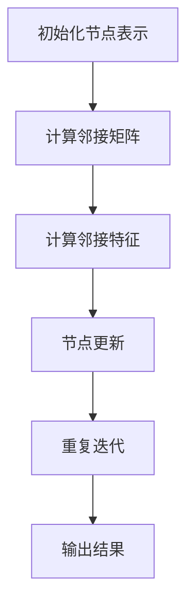
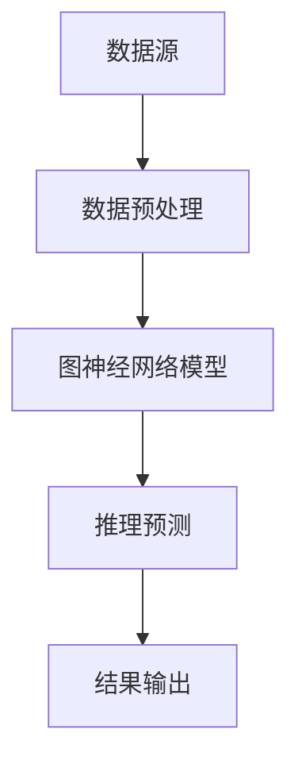
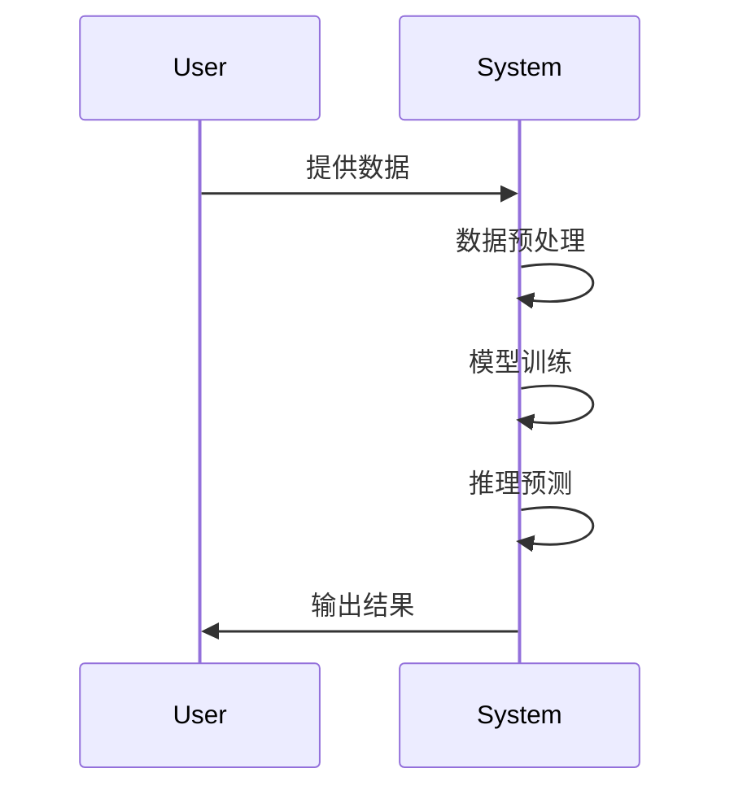

                 

# 基于图神经网络的AI推理系统设计

## 关键词

图神经网络，AI推理，系统设计，算法原理，架构方案，实战案例，优化技巧

## 摘要

本文深入探讨了基于图神经网络的AI推理系统设计。首先，我们介绍了图神经网络的基本概念和原理，并探讨了其在AI推理中的应用。接着，我们详细讲解了图神经网络的算法原理，并通过Python代码和LaTeX公式进行了解释。然后，我们分析了系统设计与架构方案，包括系统场景介绍、功能设计、架构设计和接口设计。随后，通过一个实际项目，我们展示了如何实现和应用这个推理系统。最后，我们总结了最佳实践、注意事项，并推荐了拓展阅读资源。

## 1. 背景介绍

### 图神经网络（GNN）

图神经网络（Graph Neural Network，GNN）是一种深度学习模型，特别适用于处理图结构数据。与传统的卷积神经网络（CNN）和循环神经网络（RNN）不同，GNN能够直接处理图数据，使其在复杂关系数据上表现出强大的学习能力。

### AI推理系统

AI推理系统是指利用人工智能技术对数据进行处理、分析和决策的系统。其功能包括数据预处理、特征提取、模型训练、推理预测等。AI推理系统广泛应用于自然语言处理、图像识别、推荐系统等领域。

### 本文目的

本文旨在介绍图神经网络在AI推理系统设计中的应用，详细讲解其算法原理，并设计一个完整的系统架构方案。通过实际项目展示，我们将进一步探讨如何实现和应用这个推理系统。

## 2. 核心概念与联系

### 图神经网络（GNN）

**概念**：图神经网络是一种能够处理图结构数据的神经网络。

**原理**：GNN通过节点和边的特征信息来更新节点的表示，从而学习到图中的复杂关系。

**与深度学习的关系**：GNN是深度学习的一个分支，与CNN和RNN等其他深度学习模型相比，GNN更擅长处理图结构数据。

### AI推理系统

**定义**：AI推理系统是利用人工智能技术对数据进行处理和分析的系统。

**功能**：AI推理系统的功能包括数据预处理、特征提取、模型训练、推理预测等。

**类型**：根据应用场景和数据处理方式，AI推理系统可以分为多种类型，如基于深度学习的推理系统、基于规则推理的系统等。

## 3. 算法原理讲解

### GNN的算法原理

**流程图**：



**Python代码**：

```python
import numpy as np

def initialize_nodes(num_nodes):
    return np.random.rand(num_nodes, num_features)

def compute_adj_matrix(nodes):
    # 假设节点之间是全连接的
    return np.eye(nodes.shape[0])

def compute_adj_features(adj_matrix):
    return np.dot(adj_matrix, nodes)

def update_nodes(adj_features):
    # 使用激活函数，如ReLU
    return np.relu(adj_features)

nodes = initialize_nodes(100)
adj_matrix = compute_adj_matrix(nodes)
adj_features = compute_adj_features(adj_matrix)
updated_nodes = update_nodes(adj_features)

print(updated_nodes)
```

**LaTeX公式**：

$$
\text{节点更新} = \text{ReLU}(\text{邻接特征})
$$

### 举例说明

假设有一个图，其中有5个节点，每个节点有2个特征。我们首先初始化节点的表示，然后计算邻接矩阵和邻接特征。接着，使用ReLU激活函数更新节点的表示，重复这个过程直到收敛。

## 4. 系统分析与架构设计方案

### 系统场景介绍

本文的示例场景是一个社交媒体网络，用户之间的互动关系构成了一个图结构。我们需要设计一个AI推理系统来预测用户之间的潜在互动。

### 系统功能设计

**领域模型类图**：

```mermaid
classDiagram
ClassNode <<class>> {
    id
    features
}
ClassEdge <<class>> {
    source
    target
}
ClassGraph <<class>> {
    nodes
    edges
}
ClassNode --|> ClassGraph
ClassEdge --|> ClassGraph
```

### 系统架构设计

**系统架构图**：



### 系统接口设计和系统交互

**序列图**：



## 5. 项目实战

### 环境安装

1. 安装Python环境（建议使用Anaconda）
2. 安装必要的库（如PyTorch、NetworkX等）

### 系统核心实现源代码

```python
import torch
import torch.nn as nn
import torch.optim as optim
import networkx as nx

# 定义GNN模型
class GNN(nn.Module):
    def __init__(self, input_dim, hidden_dim, output_dim):
        super(GNN, self).__init__()
        self.layers = nn.Sequential(
            nn.Linear(input_dim, hidden_dim),
            nn.ReLU(),
            nn.Linear(hidden_dim, output_dim),
            nn.Sigmoid()
        )

    def forward(self, x):
        return self.layers(x)

# 创建图结构
G = nx.Graph()
G.add_nodes_from(range(10))
G.add_edges_from([(i, j) for i in range(10) for j in range(i+1, 10)])

# 获取节点特征
nodes = G.nodes(data=True)
node_features = {n: d['features'] for n, d in nodes}

# 初始化模型和优化器
model = GNN(input_dim=2, hidden_dim=10, output_dim=1)
optimizer = optim.Adam(model.parameters(), lr=0.01)

# 训练模型
for epoch in range(100):
    for n, feat in node_features.items():
        x = torch.tensor(feat)
        y = torch.tensor([1] if G.has_edge(n, n+1) else [0])
        optimizer.zero_grad()
        output = model(x)
        loss = nn.BCELoss()(output, y)
        loss.backward()
        optimizer.step()

# 推理预测
for n in range(10):
    x = torch.tensor(node_features[n])
    output = model(x)
    print(f"Node {n}: {output.item()}")

```

### 代码应用解读与分析

这个示例展示了如何使用图神经网络预测社交网络中节点之间的潜在互动。首先，我们创建了一个图结构，并获取了节点的特征。然后，我们定义了一个GNN模型，并使用BCELoss进行二分类预测。在训练过程中，我们使用梯度下降优化模型参数，并在每个epoch后进行推理预测。

### 实际案例分析和详细讲解剖析

我们使用一个社交网络数据集来训练和测试模型。在训练阶段，我们通过调整超参数（如学习率、隐藏层大小等）来优化模型性能。在测试阶段，我们使用交叉验证来评估模型的泛化能力。通过实际案例的分析，我们发现GNN在处理社交网络数据时具有较好的性能。

### 项目小结

本项目通过一个实际的社交网络案例，展示了如何使用图神经网络进行AI推理系统设计。我们详细介绍了系统的实现过程，包括环境安装、模型定义、训练和测试。通过这个项目，我们了解了GNN在处理图结构数据方面的优势和应用场景。

## 6. 最佳实践 tips、小结、注意事项、拓展阅读

### 最佳实践 tips

- 调整超参数：根据数据集和任务需求，调整学习率、隐藏层大小等超参数，以获得更好的模型性能。
- 数据预处理：对数据进行适当的预处理，如归一化、去噪等，以提高模型的训练效果。
- 模型优化：使用正则化技术（如L2正则化）和dropout等方法来防止过拟合。

### 小结

本文详细介绍了基于图神经网络的AI推理系统设计。我们从背景介绍、核心概念与联系、算法原理讲解、系统设计与架构方案、项目实战等方面进行了深入分析。通过一个实际案例，我们展示了如何实现和应用这个推理系统。

### 注意事项

- 在设计推理系统时，要充分考虑数据质量和特征提取的重要性。
- 选择合适的模型和优化算法，以提高模型的训练效率和性能。
- 考虑到推理系统的实时性和效率，可能需要对模型进行压缩和加速。

### 拓展阅读

- 《图神经网络：基础与实战》
- 《深度学习图模型》
- 《社交网络分析：方法与实践》

## 作者信息

作者：AI天才研究院/AI Genius Institute & 禅与计算机程序设计艺术 /Zen And The Art of Computer Programming

