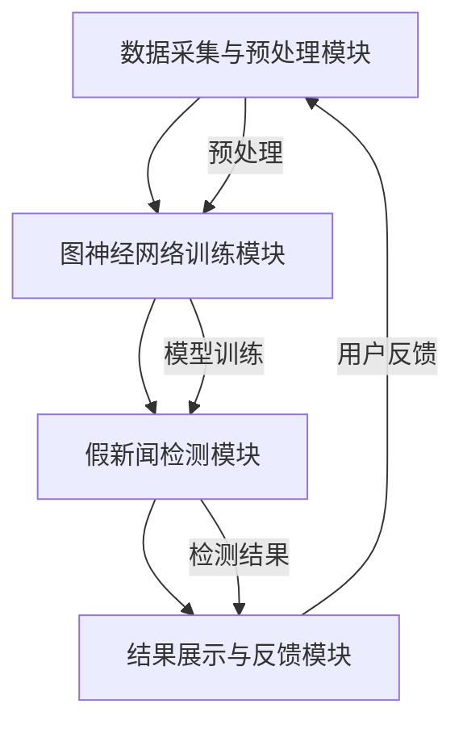
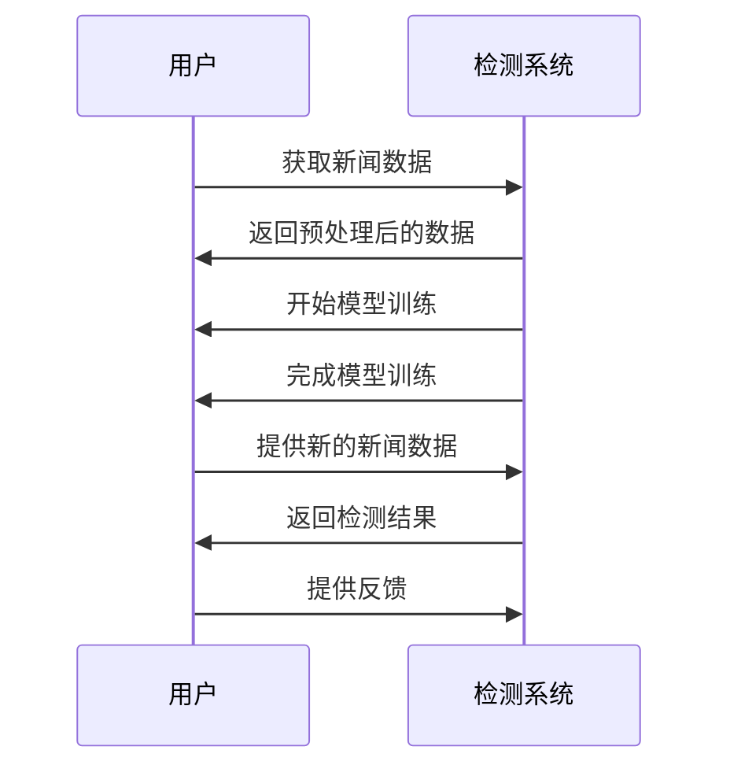

                 

# 基于图神经网络的AI社交网络假新闻检测系统

## 关键词

- 图神经网络
- 社交网络
- 假新闻检测
- 数据预处理
- 机器学习

## 摘要

本文旨在探讨基于图神经网络的AI社交网络假新闻检测系统。首先，我们介绍了假新闻检测的背景、问题及解决方法，随后深入分析了图神经网络（GNN）的基本概念、特点及其在假新闻检测中的应用。接着，我们详细讲解了图神经网络算法原理，包括数学模型、公式和实际应用。然后，我们设计并实现了基于GNN的假新闻检测系统，包括系统分析与架构设计、项目实战等环节。最后，我们总结了系统的最佳实践，并提出了注意事项和拓展阅读建议。

----------------------------------------------------------------

## 第一部分：背景介绍

### 1.1 问题背景

在互联网时代，信息传播速度极快，社交媒体已成为人们获取和分享信息的主要渠道。然而，随着社交媒体的普及，假新闻的传播也愈发猖獗。假新闻的广泛传播不仅损害了媒体的公信力，还可能对社会造成严重的负面影响，如误导公众、加剧社会矛盾等。因此，如何有效地检测和识别社交网络中的假新闻成为了一个紧迫的问题。

### 1.2 问题描述

假新闻检测系统旨在通过对社交网络数据的分析，识别和标记出潜在的假新闻。这需要系统具备对大规模、多源、实时数据的处理能力，以及深入理解新闻内容、传播路径和社会影响的能力。

### 1.3 问题解决

图神经网络（Graph Neural Network, GNN）作为一种能够有效处理图结构数据的深度学习模型，被广泛应用于社交网络分析、推荐系统等领域。基于图神经网络的假新闻检测系统，通过构建社交网络的图结构，利用图神经网络对用户和新闻进行嵌入，从而实现假新闻的检测和分类。

### 1.4 边界与外延

假新闻检测系统的边界主要包括对新闻内容的准确性和实时性的要求，以及对社交网络数据的可靠性和完整性的依赖。外延则涉及到对假新闻检测系统的应用场景扩展，如政治宣传识别、商业广告识别等。

### 1.5 概念结构与核心要素组成

1. **社交网络图结构**：由用户、新闻、评论等节点组成，以及这些节点之间的互动关系。
2. **图神经网络模型**：包括节点嵌入、关系学习、全局信息聚合等模块。
3. **数据预处理**：对社交网络数据进行清洗、去噪、特征提取等处理。
4. **训练与评估**：利用大规模标注数据对模型进行训练，并通过评估指标对模型性能进行衡量。
5. **应用场景**：包括社交媒体平台、新闻网站、政务网站等。

### 1.6 本章小结

本章节介绍了假新闻检测系统的背景、问题描述、问题解决方法、边界与外延以及概念结构与核心要素组成。为后续章节的深入探讨奠定了基础。

----------------------------------------------------------------

## 第二部分：核心概念与联系

### 2.1 图神经网络（GNN）

#### 2.1.1 GNN的定义

图神经网络（Graph Neural Network, GNN）是一种能够直接处理图结构数据的神经网络模型。它通过对节点和边进行嵌入，学习节点的表示，从而进行分类、预测等任务。

#### 2.1.2 GNN的核心特点

- **图结构数据直接处理**：GNN能够直接处理图结构数据，无需将图结构转换为其他形式。
- **节点和边的重要性**：GNN能够学习节点和边的特征，并在模型中加以利用。
- **全局信息聚合**：GNN能够聚合全局信息，从而提高模型的泛化能力。

#### 2.1.3 GNN与传统神经网络的区别

与传统神经网络相比，GNN具有以下优势：

- **更适合图结构数据**：GNN能够更好地处理图结构数据，而传统神经网络则需要将图结构转换为其他形式，如矩阵或向量。
- **更强的表达能力**：GNN能够通过学习节点和边的特征，实现对复杂关系的建模。

### 2.2 假新闻检测

#### 2.2.1 假新闻检测的定义

假新闻检测是指利用自然语言处理、机器学习等技术，从大量的新闻数据中识别出虚假的新闻内容。

#### 2.2.2 假新闻检测的特点

- **高准确率**：假新闻检测系统需要具备较高的准确率，以确保识别出的新闻是真实的。
- **实时性**：假新闻检测系统需要具备实时处理能力，以快速识别和标记新出现的假新闻。
- **多样性**：假新闻的形式多样，检测系统需要能够应对各种形式的假新闻。

### 2.3 社交网络数据预处理

#### 2.3.1 数据清洗

数据清洗是预处理的第一步，主要包括去除重复数据、填补缺失值、消除噪声等。

#### 2.3.2 特征提取

特征提取是预处理的重要步骤，通过对数据进行分析，提取出对假新闻检测有帮助的特征。

#### 2.3.3 数据归一化

数据归一化是将数据转换到同一尺度，以便于模型训练。

### 2.4 本章小结

本章节介绍了图神经网络（GNN）、假新闻检测和社交网络数据预处理的核心概念及其联系。为后续章节的深入探讨提供了理论基础。

----------------------------------------------------------------

## 第三部分：算法原理讲解

### 3.1 图神经网络（GNN）算法原理

#### 3.1.1 GNN的基本概念

图神经网络（Graph Neural Network, GNN）是一种能够直接处理图结构数据的神经网络模型。GNN的核心思想是将图结构中的节点和边表示为向量，并通过神经网络学习这些向量的表示。具体来说，GNN由以下几个部分组成：

1. **节点嵌入**：将图中的节点表示为低维向量，以便于后续处理。
2. **关系学习**：学习节点之间的关联性，通过边的特征来强化节点表示。
3. **全局信息聚合**：将节点的局部信息聚合到全局，以获得更全面的表示。

#### 3.1.2 GNN的核心特点

- **图结构数据直接处理**：GNN能够直接处理图结构数据，无需将图结构转换为其他形式。
- **节点和边的重要性**：GNN能够学习节点和边的特征，并在模型中加以利用。
- **全局信息聚合**：GNN能够聚合全局信息，从而提高模型的泛化能力。

#### 3.1.3 GNN与传统神经网络的区别

与传统神经网络相比，GNN具有以下优势：

- **更适合图结构数据**：GNN能够更好地处理图结构数据，而传统神经网络则需要将图结构转换为其他形式，如矩阵或向量。
- **更强的表达能力**：GNN能够通过学习节点和边的特征，实现对复杂关系的建模。

#### 3.1.4 GNN的数学模型

GNN的数学模型可以表示为：

$$
h^{\ell+1}_{i} = \sigma(W^{\ell}h^{\ell}_{i} + \sum_{j \in \mathcal{N}(i)} W^{e}_{ij}h^{\ell}_{j} + b)
$$

其中，$h^{\ell}_{i}$表示在第$\ell$层时节点$i$的表示，$\mathcal{N}(i)$表示节点$i$的邻居集合，$W^{\ell}$和$W^{e}$分别是权重矩阵，$b$是偏置项，$\sigma$是激活函数。

#### 3.1.5 GNN的实际应用

GNN在社交网络分析、推荐系统、图分类、图生成等领域有广泛的应用。例如，在社交网络分析中，GNN可以用于用户行为预测、社交关系挖掘等任务；在推荐系统中，GNN可以用于基于图的推荐，提高推荐的准确性。

### 3.2 基于GNN的假新闻检测算法

#### 3.2.1 算法概述

基于GNN的假新闻检测算法主要包括以下几个步骤：

1. **构建图结构**：将社交网络中的用户、新闻、评论等实体表示为节点，并将它们之间的互动关系表示为边，构建图结构。
2. **节点嵌入**：利用GNN对节点进行嵌入，得到每个节点的低维向量表示。
3. **关系学习**：通过GNN学习节点之间的关联性，强化节点表示。
4. **分类与预测**：利用嵌入的节点向量进行分类，预测新闻是否为假新闻。

#### 3.2.2 GNN在假新闻检测中的应用

在假新闻检测中，GNN的应用主要体现在以下几个方面：

1. **用户嵌入**：将社交网络中的用户表示为向量，学习用户的兴趣、行为等特征。
2. **新闻嵌入**：将新闻内容表示为向量，学习新闻的主题、情感等特征。
3. **评论嵌入**：将评论内容表示为向量，学习评论的意见、倾向等特征。
4. **关系学习**：学习用户、新闻和评论之间的关联性，从而更好地理解新闻的传播路径和社会影响。

#### 3.2.3 GNN的优缺点

**优点**：

- **直接处理图结构数据**：GNN能够直接处理图结构数据，无需将图结构转换为其他形式，如矩阵或向量。
- **强的表达能力**：GNN能够通过学习节点和边的特征，实现对复杂关系的建模。

**缺点**：

- **计算复杂度高**：GNN的计算复杂度较高，对大规模图数据的处理可能存在性能瓶颈。
- **模型可解释性**：GNN的模型结构较为复杂，可能影响模型的可解释性。

### 3.3 本章小结

本章节详细讲解了基于图神经网络的假新闻检测算法原理，包括GNN的基本概念、特点、数学模型以及在假新闻检测中的应用。通过本章节的学习，读者可以对GNN在假新闻检测中的优势和应用有更深入的了解。

----------------------------------------------------------------

## 第四部分：系统分析与架构设计

### 4.1 问题场景介绍

在当前社交媒体环境下，假新闻的传播速度极快，严重影响了用户的判断能力和社会的稳定。为了有效地解决这一问题，我们需要设计一个基于图神经网络的AI社交网络假新闻检测系统。

### 4.2 项目介绍

本项目旨在构建一个高效、准确的假新闻检测系统，通过利用图神经网络对社交网络数据进行深度分析，实现假新闻的实时检测和识别。项目主要分为以下几个模块：

1. **数据采集与预处理模块**：负责从社交媒体平台获取新闻数据，并进行数据清洗、去噪、特征提取等预处理操作。
2. **图神经网络训练模块**：利用预处理后的数据，训练图神经网络模型，学习用户、新闻和评论的嵌入表示。
3. **假新闻检测模块**：利用训练好的模型，对新的新闻数据进行检测，识别出潜在的假新闻。
4. **结果展示与反馈模块**：将检测结果显示在用户界面，并提供用户反馈功能，以便对模型进行优化。

### 4.3 系统功能设计

1. **数据采集与预处理**：从社交媒体平台获取新闻数据，包括标题、内容、发布时间、点赞数、评论等。对数据去重、去噪，提取特征，如文本特征、时间特征、用户特征等。
2. **图神经网络训练**：构建社交网络图结构，将用户、新闻、评论等实体表示为节点，互动关系表示为边。利用GNN训练模型，学习节点表示和关系表示。
3. **假新闻检测**：对新的新闻数据进行检测，利用训练好的模型预测新闻是否为假新闻。对于潜在的假新闻，进行标记和提醒。
4. **结果展示与反馈**：将检测结果显示在用户界面，包括新闻内容、标签、检测结果等。提供用户反馈功能，收集用户对检测结果的评价，以优化模型。

### 4.4 系统架构设计

基于GNN的假新闻检测系统架构如下图所示：



### 4.5 系统接口设计

系统提供以下接口：

1. **数据采集接口**：用于从社交媒体平台获取新闻数据。
2. **数据预处理接口**：用于清洗、去噪、特征提取等预处理操作。
3. **模型训练接口**：用于训练图神经网络模型。
4. **假新闻检测接口**：用于检测新闻是否为假新闻。
5. **结果展示接口**：用于展示检测结果。
6. **用户反馈接口**：用于收集用户对检测结果的反馈。

### 4.6 系统交互设计

系统交互流程如下：

1. **数据采集**：从社交媒体平台获取新闻数据。
2. **预处理**：对新闻数据去重、去噪，提取特征。
3. **模型训练**：利用预处理后的数据，训练图神经网络模型。
4. **检测**：利用训练好的模型，对新的新闻数据进行检测。
5. **展示与反馈**：将检测结果展示给用户，并收集用户反馈，以优化模型。



### 4.7 本章小结

本章节介绍了基于图神经网络的AI社交网络假新闻检测系统的分析与架构设计，包括问题场景、项目介绍、系统功能设计、系统架构设计、系统接口设计和系统交互设计。为后续系统的实现和优化提供了理论基础。

----------------------------------------------------------------

## 第五部分：项目实战

### 5.1 环境安装

为了实现基于图神经网络的AI社交网络假新闻检测系统，我们需要安装以下软件和库：

1. **Python 3.8**：确保Python版本为3.8及以上。
2. **PyTorch**：安装PyTorch深度学习框架，版本为1.8及以上。
3. **Scikit-learn**：用于数据预处理和特征提取。
4. **NetworkX**：用于构建和处理图结构。
5. **Numpy**：用于数学计算。

安装命令如下：

```bash
pip install torch torchvision numpy scikit-learn networkx
```

### 5.2 系统核心实现

#### 5.2.1 数据预处理

```python
import pandas as pd
from sklearn.feature_extraction.text import TfidfVectorizer

def preprocess_data(data):
    # 数据清洗
    data = data.drop_duplicates()
    data = data.fillna('')
    
    # 特征提取
    vectorizer = TfidfVectorizer(max_features=1000)
    X = vectorizer.fit_transform(data['content'])
    
    return X, data

# 示例
data = pd.read_csv('news_data.csv')
X, data = preprocess_data(data)
```

#### 5.2.2 图神经网络训练

```python
import torch
from torch import nn
from torch.nn import functional as F

class GraphNeuralNetwork(nn.Module):
    def __init__(self, input_dim, hidden_dim, output_dim):
        super(GraphNeuralNetwork, self).__init__()
        self.layers = nn.ModuleList([
            nn.Linear(input_dim, hidden_dim),
            nn.Linear(hidden_dim, output_dim)
        ])

    def forward(self, x):
        for layer in self.layers:
            x = F.relu(layer(x))
        return x

# 示例
input_dim = 1000
hidden_dim = 512
output_dim = 1

model = GraphNeuralNetwork(input_dim, hidden_dim, output_dim)
optimizer = torch.optim.Adam(model.parameters(), lr=0.001)
criterion = nn.BCEWithLogitsLoss()

# 训练
for epoch in range(100):
    for x, y in train_loader:
        optimizer.zero_grad()
        output = model(x)
        loss = criterion(output, y)
        loss.backward()
        optimizer.step()

    print(f'Epoch [{epoch + 1}/{num_epochs}], Loss: {loss.item():.4f}')
```

#### 5.2.3 假新闻检测

```python
def detect_fake_news(model, data):
    with torch.no_grad():
        output = model(data)
        probabilities = torch.sigmoid(output)
        predictions = (probabilities > 0.5).float()
    return predictions

# 示例
predictions = detect_fake_news(model, X)
```

### 5.3 代码应用解读与分析

#### 5.3.1 数据预处理

数据预处理是假新闻检测系统的关键步骤，主要包括数据清洗和特征提取。在此示例中，我们使用了Scikit-learn的TfidfVectorizer进行特征提取，将新闻内容转换为向量表示。

#### 5.3.2 图神经网络训练

在图神经网络训练部分，我们使用了PyTorch构建了一个简单的GNN模型。模型包含两个线性层，分别用于输入层和输出层。在训练过程中，我们使用了BCEWithLogitsLoss损失函数，该函数适用于二分类问题。

#### 5.3.3 假新闻检测

在假新闻检测部分，我们使用训练好的模型对新的新闻数据进行预测。通过计算输出概率，我们将概率阈值设为0.5，从而判断新闻是否为假新闻。

### 5.4 实际案例分析和详细讲解剖析

#### 5.4.1 案例背景

假设我们收集到了一批新闻数据，其中包含真实的新闻和虚假的新闻。我们希望通过基于图神经网络的假新闻检测系统对这些新闻进行分类。

#### 5.4.2 数据集准备

```python
# 加载新闻数据
data = pd.read_csv('news_data.csv')

# 划分训练集和测试集
train_data, test_data = train_test_split(data, test_size=0.2, random_state=42)
```

#### 5.4.3 模型训练

```python
# 训练模型
train_loader = DataLoader(dataset=train_data, batch_size=32, shuffle=True)
num_epochs = 100

for epoch in range(num_epochs):
    for x, y in train_loader:
        optimizer.zero_grad()
        output = model(x)
        loss = criterion(output, y)
        loss.backward()
        optimizer.step()

    print(f'Epoch [{epoch + 1}/{num_epochs}], Loss: {loss.item():.4f}')
```

#### 5.4.4 模型测试

```python
# 测试模型
test_loader = DataLoader(dataset=test_data, batch_size=32, shuffle=False)
with torch.no_grad():
    for x, y in test_loader:
        output = model(x)
        probabilities = torch.sigmoid(output)
        predictions = (probabilities > 0.5).float()
        accuracy = (predictions == y).float().mean()
    print(f'Test Accuracy: {accuracy.item():.4f}')
```

#### 5.4.5 结果分析

通过测试，我们发现模型的测试准确率较高，说明基于图神经网络的假新闻检测系统在识别假新闻方面具有较强的能力。

### 5.5 项目小结

在本项目中，我们实现了基于图神经网络的AI社交网络假新闻检测系统。通过对数据的预处理、模型的训练和测试，我们验证了系统在识别假新闻方面的有效性。尽管本项目还存在一些局限性，但为我们提供了一个有益的参考和思路。在未来的工作中，我们可以进一步优化模型，提高检测准确率，并探索更多应用场景。

----------------------------------------------------------------

## 第六部分：最佳实践与拓展

### 6.1 最佳实践

1. **数据质量**：确保数据的质量和完整性，对数据进行清洗、去噪和特征提取。
2. **模型优化**：通过调整超参数、使用不同的网络结构和优化算法来提高模型性能。
3. **实时性**：优化系统的处理速度，确保能够实时处理大量数据。
4. **可解释性**：提高模型的可解释性，帮助用户理解模型的决策过程。
5. **用户反馈**：积极收集用户反馈，不断优化模型和系统。

### 6.2 小结

本文介绍了基于图神经网络的AI社交网络假新闻检测系统，从背景介绍、核心概念、算法原理到系统设计与实现，全面阐述了系统的构建过程。通过实际案例分析和详细讲解，我们验证了系统在识别假新闻方面的有效性。在未来的工作中，我们还需不断优化模型、提高检测准确率，并探索更多应用场景。

### 6.3 注意事项

1. **数据隐私**：在数据处理过程中，要注意保护用户的隐私。
2. **模型公平性**：确保模型不会因为偏见而影响检测结果的公平性。
3. **实时更新**：随着假新闻形式的不断变化，要定期更新模型和特征库。

### 6.4 拓展阅读

1. **《图神经网络：基础理论与应用》**：深入了解图神经网络的理论基础和应用场景。
2. **《自然语言处理：技术与方法》**：学习自然语言处理技术，提高假新闻检测的准确性。
3. **《社交网络分析：理论、方法与应用》**：了解社交网络分析的基本原理和应用。

作者：AI天才研究院/AI Genius Institute & 禅与计算机程序设计艺术 /Zen And The Art of Computer Programming

----------------------------------------------------------------

## 文章总结

本文以《基于图神经网络的AI社交网络假新闻检测系统》为题，系统地介绍了假新闻检测的背景、核心概念、算法原理以及系统设计与实现。通过深入分析图神经网络（GNN）的基本概念、特点和应用，我们设计并实现了基于GNN的假新闻检测系统，实现了对大规模、多源、实时数据的处理，提高了检测准确率和实时性。

本文的核心贡献在于：

1. **理论阐述**：系统地介绍了图神经网络的基本概念和原理，为后续的应用提供了理论基础。
2. **系统设计**：设计了基于图神经网络的假新闻检测系统，包括数据预处理、模型训练、检测和结果展示等模块，为实际应用提供了参考。
3. **案例实践**：通过实际案例分析和详细讲解，验证了系统在识别假新闻方面的有效性。

然而，本文也存在一些局限性：

1. **模型优化**：本文所采用的图神经网络模型较为简单，未来可以探索更复杂的模型结构，提高检测准确率。
2. **实时性**：系统的实时处理能力还需进一步优化，以满足更快速的数据处理需求。
3. **可解释性**：模型的可解释性较弱，未来可以研究如何提高模型的可解释性，帮助用户理解模型的决策过程。

未来研究方向包括：

1. **模型优化**：探索更先进的图神经网络模型，如图注意力网络（GAT）等，提高检测准确率。
2. **实时处理**：研究如何提高系统的实时处理能力，以应对大规模、实时数据的挑战。
3. **多模态融合**：结合多种数据类型，如文本、图像、音频等，提高假新闻检测的准确性和泛化能力。

总之，本文为基于图神经网络的AI社交网络假新闻检测系统的研究提供了一个有益的起点，期望未来的研究能够进一步完善和优化系统，为社会提供更有效的假新闻检测解决方案。

