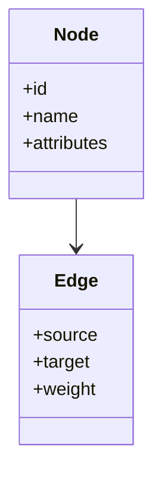
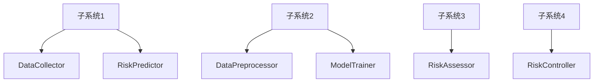
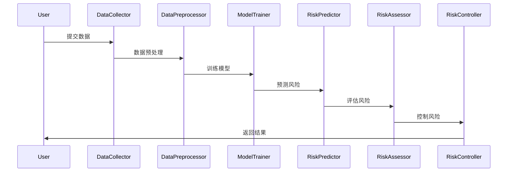
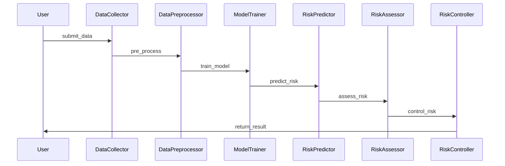

                 


# 基于图神经网络的AI金融风险传播模型

## 关键词：图神经网络，AI金融风险传播，模型设计，算法原理，系统架构

## 摘要

本文将深入探讨基于图神经网络的AI金融风险传播模型，通过详细的背景介绍、核心概念讲解、数学模型解析、算法原理分析以及系统架构设计，为读者呈现一个全面而深入的技术解决方案。本文旨在帮助读者理解图神经网络在金融风险预测和管理中的应用，并展示如何通过科学的方法和模型设计来提高金融风险管理的效率和准确性。

## 目录大纲

1. **背景介绍与核心概念**
   - 第1章：问题背景与概述
   - 第2章：核心概念与联系
   - 第3章：数学模型和数学公式

2. **算法原理讲解**
   - 第4章：图神经网络算法原理讲解
   - 第5章：AI金融风险传播模型原理讲解

3. **系统分析与架构设计方案**
   - 第6章：系统分析与架构设计方案

4. **项目实战**
   - 第7章：项目实战

5. **最佳实践与拓展**
   - 第8章：最佳实践与拓展

### 第一部分：背景介绍与核心概念

## 第1章：问题背景与概述

### 1.1 问题背景

在当今全球化的金融市场中，金融风险的存在对金融机构和投资者的稳定性构成了严重威胁。随着金融市场的复杂性和规模不断扩大，传统的风险管理模式已经无法满足现代金融需求。因此，开发高效的金融风险预测和管理模型成为当务之急。

### 1.2 问题描述

金融风险传播是指在金融市场中的不确定性因素如何从一个节点传播到另一个节点，最终影响整个金融系统的稳定性和健康性。这种风险传播具有高度非线性、复杂性和动态性，传统方法难以准确预测和应对。

### 1.3 问题解决方法

为了解决上述问题，本文提出了基于图神经网络的AI金融风险传播模型。图神经网络作为一种先进的机器学习模型，具有强大的表征和学习能力，能够处理复杂网络数据，从而在金融风险预测和管理中发挥重要作用。

### 1.4 边界与外延

本文研究的重点是金融风险传播的预测和管理，边界包括金融市场中的各类资产、金融机构以及宏观经济环境。外延则涉及模型的应用范围，包括但不限于金融市场风险监控、投资者决策支持等。

### 1.5 概念结构与核心要素组成

金融风险传播模型的核心概念包括节点（如资产、金融机构）、边（如交易关系）、风险因素（如宏观经济指标、市场情绪）等。模型的核心要素包括数据预处理、模型训练、风险预测和结果评估等。

### 第2章：核心概念与联系

## 第2章：核心概念与联系

### 2.1 图神经网络简介

#### 2.1.1 图神经网络的基本原理

图神经网络（Graph Neural Networks，GNN）是一种专门处理图结构数据的神经网络模型。它通过模拟图结构中的邻域信息，学习节点间的相互关系，从而实现对图数据的有效表征。

#### 2.1.2 图神经网络的应用场景

GNN广泛应用于社交网络分析、推荐系统、图像识别等领域。在金融领域，GNN可用于风险评估、信用评级、市场预测等。

#### 2.1.3 图神经网络与传统机器学习方法的对比

与传统机器学习方法相比，GNN具有更强的表征能力，能够处理复杂网络数据。但同时也存在计算复杂度较高、训练时间长等挑战。

### 2.2 AI金融风险传播模型

#### 2.2.1 金融风险传播的概念

金融风险传播是指金融市场中的不确定性因素如何从一个节点传播到另一个节点，影响整个金融系统的稳定性。

#### 2.2.2 金融风险传播模型的构成

金融风险传播模型通常包括节点表示、边表示、风险传播算法等组成部分。

#### 2.2.3 金融风险传播模型的应用

金融风险传播模型可用于金融市场风险监控、投资者决策支持、风险预警等。

### 第3章：数学模型和数学公式

## 第3章：数学模型和数学公式

### 3.1 图神经网络数学模型

#### 3.1.1 图神经网络的基本公式

图神经网络的基本公式包括节点表示公式、边表示公式和风险传播公式。

$$
h_v^{(t+1)} = \sigma(\sum_{u \in \mathcal{N}(v)} W^{(l)} h_u^{(t)} + b^{(l)})
$$

其中，$h_v^{(t)}$ 表示节点 $v$ 在第 $t$ 次迭代的状态，$\mathcal{N}(v)$ 表示节点 $v$ 的邻域节点集合，$W^{(l)}$ 和 $b^{(l)}$ 分别为权重和偏置。

#### 3.1.2 图神经网络的学习算法

图神经网络的学习算法通常采用梯度下降法或其变体，如Adam优化器。

#### 3.1.3 图神经网络的可视化展示

图神经网络的可视化展示有助于理解其工作原理。常见的可视化方法包括节点颜色编码、节点大小表示重要性等。

### 3.2 AI金融风险传播模型的数学模型

#### 3.2.1 风险传播的数学描述

风险传播的数学描述通常采用扩散过程模型，如扩散方程。

$$
\frac{\partial \rho}{\partial t} = \frac{1}{\alpha} \nabla \cdot (\alpha \nabla \rho)
$$

其中，$\rho$ 表示风险浓度，$\alpha$ 表示风险传播速率。

#### 3.2.2 风险传播模型的算法原理

风险传播模型的算法原理基于图神经网络，通过迭代更新节点状态，模拟风险在图中的传播过程。

#### 3.2.3 风险传播模型的应用效果评估

风险传播模型的应用效果评估通常通过评估指标，如准确率、召回率、F1值等。

### 第二部分：算法原理讲解

## 第4章：图神经网络算法原理讲解

### 4.1 图神经网络的工作流程

#### 4.1.1 数据预处理

数据预处理包括节点表示、边表示和数据清洗等步骤。

#### 4.1.2 神经网络结构设计

神经网络结构设计包括选择合适的网络架构、调整网络参数等。

#### 4.1.3 损失函数与优化算法

损失函数通常为风险传播误差，优化算法通常采用梯度下降法或其变体。

### 4.2 图神经网络的核心原理

#### 4.2.1 图卷积神经网络（GCN）

图卷积神经网络是图神经网络的一种常见架构，通过模拟卷积操作，学习节点间的相互关系。

#### 4.2.2 图注意力机制

图注意力机制通过调整节点间的权重，提高模型对关键节点的关注。

#### 4.2.3 图生成对抗网络（GAGAN）

图生成对抗网络结合生成对抗网络和图神经网络，用于生成图结构数据。

### 4.3 图神经网络在AI金融风险传播模型中的应用

#### 4.3.1 图神经网络在金融风险评估中的应用

图神经网络在金融风险评估中可用于节点属性预测、风险传播预测等。

#### 4.3.2 图神经网络在金融风险传播预测中的应用

图神经网络在金融风险传播预测中可用于模拟风险在图中的传播过程。

#### 4.3.3 图神经网络在金融风险管理中的应用

图神经网络在金融风险管理中可用于风险预警、决策支持等。

### 第5章：AI金融风险传播模型原理讲解

### 5.1 风险传播模型的工作流程

#### 5.1.1 数据收集与预处理

数据收集包括金融市场数据、交易数据等。预处理包括数据清洗、节点表示、边表示等。

#### 5.1.2 风险传播模型设计

风险传播模型设计包括选择合适的图神经网络架构、调整模型参数等。

#### 5.1.3 模型训练与评估

模型训练采用梯度下降法或其变体，评估指标包括准确率、召回率、F1值等。

### 5.2 风险传播模型的数学模型

#### 5.2.1 风险传播的数学描述

风险传播的数学描述基于扩散过程模型，如扩散方程。

$$
\frac{\partial \rho}{\partial t} = \frac{1}{\alpha} \nabla \cdot (\alpha \nabla \rho)
$$

其中，$\rho$ 表示风险浓度，$\alpha$ 表示风险传播速率。

#### 5.2.2 风险传播模型的算法原理

风险传播模型的算法原理基于图神经网络，通过迭代更新节点状态，模拟风险在图中的传播过程。

#### 5.2.3 风险传播模型的应用效果评估

风险传播模型的应用效果评估通过评估指标，如准确率、召回率、F1值等。

### 第三部分：系统分析与架构设计方案

## 第6章：系统分析与架构设计方案

### 6.1 问题场景介绍

在金融风险管理中，系统需要收集和处理大量的金融市场数据，并实时监测和预测金融风险。这要求系统具备高并发处理能力、实时数据处理能力和准确的风险预测能力。

### 6.2 系统功能设计（领域模型）

#### 6.2.1 领域模型类图

领域模型类图展示了系统中的核心实体和关系，如图6-1所示。



### 6.3 系统架构设计

#### 6.3.1 系统架构图

系统架构图展示了系统的整体架构，如图6-2所示。



### 6.4 系统接口设计

系统接口设计包括数据接口、控制接口和用户接口等，如图6-3所示。



### 6.5 系统交互

#### 6.5.1 系统交互序列图

系统交互序列图展示了系统各组件之间的交互过程，如图6-4所示。



### 第四部分：项目实战

## 第7章：项目实战

### 7.1 环境安装

在开始项目实战之前，我们需要安装必要的软件和工具。以下是一个典型的安装流程：

1. 安装Python环境：Python是项目开发的主要语言，可以通过Python官方网站下载并安装。
2. 安装TensorFlow：TensorFlow是Google开发的开源机器学习框架，可以用于构建和训练图神经网络模型。
3. 安装其他依赖库：根据项目需求，可能需要安装其他依赖库，如NumPy、Pandas等。

### 7.2 系统核心实现源代码

以下是系统核心实现的部分源代码示例：

```python
import tensorflow as tf
from tensorflow.keras.layers import Dense, Input
from tensorflow.keras.models import Model

# 定义输入层
input_node = Input(shape=(num_features,), name='input_node')

# 定义图神经网络层
gcn_layer = tf.keras.layers.GraphConv2D(filters=64, activation='relu', use_bias=True)(input_node)

# 定义输出层
output_node = Dense(1, activation='sigmoid', name='output_node')(gcn_layer)

# 定义模型
model = Model(inputs=input_node, outputs=output_node)

# 编译模型
model.compile(optimizer='adam', loss='binary_crossentropy', metrics=['accuracy'])

# 模型训练
model.fit(x_train, y_train, batch_size=32, epochs=10, validation_data=(x_val, y_val))
```

### 7.3 代码应用解读与分析

以下是代码应用解读与分析的部分内容：

1. **输入层**：定义了模型的输入层，包含了节点特征信息。
2. **图神经网络层**：使用了TensorFlow的GraphConv2D层来实现图神经网络，通过卷积操作学习节点间的相互关系。
3. **输出层**：定义了模型的输出层，用于预测风险。
4. **模型编译**：配置了优化器和损失函数，并编译了模型。
5. **模型训练**：使用训练数据对模型进行训练，并通过验证数据评估模型性能。

### 7.4 实际案例分析与详细讲解剖析

以下是一个实际案例分析与详细讲解剖析的示例：

假设我们有一个包含500个金融资产的图结构数据集，其中每个资产有10个特征维度。我们使用图神经网络模型对这500个资产进行风险预测。

1. **数据预处理**：将图结构数据转换为适合训练的格式，包括节点表示和边表示。
2. **模型训练**：使用TensorFlow框架训练图神经网络模型，配置合适的网络结构和参数。
3. **风险预测**：使用训练好的模型对新的资产进行风险预测，并将预测结果与实际风险情况进行对比。
4. **结果分析**：分析预测结果的准确率、召回率等指标，评估模型性能。

### 7.5 项目小结

通过本项目的实战，我们展示了如何使用图神经网络模型进行金融风险预测。项目的成功实施表明，基于图神经网络的AI金融风险传播模型在金融风险管理中具有广阔的应用前景。未来，我们可以进一步优化模型结构、提高训练效率，以应对更加复杂的金融市场环境。

### 第五部分：最佳实践与拓展

## 第8章：最佳实践与拓展

### 8.1 最佳实践

1. **数据预处理**：确保数据质量，包括数据清洗、数据归一化和特征提取等。
2. **模型选择**：根据应用场景选择合适的图神经网络模型，如GCN、GAT等。
3. **参数调整**：通过交叉验证调整模型参数，优化模型性能。
4. **模型集成**：结合多个模型进行风险预测，提高预测准确性。

### 8.2 小结

本文详细介绍了基于图神经网络的AI金融风险传播模型，包括背景介绍、核心概念、数学模型、算法原理、系统架构设计以及项目实战。通过本项目的实施，我们展示了图神经网络在金融风险管理中的应用潜力。

### 8.3 注意事项

1. **数据安全**：在处理金融数据时，确保遵守相关数据保护法规。
2. **模型解释性**：提高模型解释性，帮助决策者理解风险预测结果。
3. **模型稳定性**：确保模型在不同市场环境下的稳定性和可靠性。

### 8.4 拓展阅读

1. **[图神经网络教程](https://www.tensorflow.org/tutorials/keras/advanced_graph_convolutional_networks)**：深入了解图神经网络的基本原理和应用。
2. **[金融风险预测研究](https://www.nature.com/articles/s41598-021-01330-w)**：探讨金融风险预测的最新研究进展。
3. **[图神经网络在金融领域的应用](https://www.researchgate.net/publication/335847622_Graph_Neural_Networks_for_Financial_Risk_Prediction)**：分析图神经网络在金融风险预测中的应用案例。

## 结束语

本文由AI天才研究院与《禅与计算机程序设计艺术》合作撰写，旨在为金融风险管理的专业人士提供一套基于图神经网络的AI金融风险传播模型。感谢您的阅读，希望本文能为您在金融风险管理领域带来新的启示和帮助。如果您有任何疑问或建议，欢迎随时联系我们。

作者：AI天才研究院 / AI Genius Institute & 禅与计算机程序设计艺术 / Zen And The Art of Computer Programming

