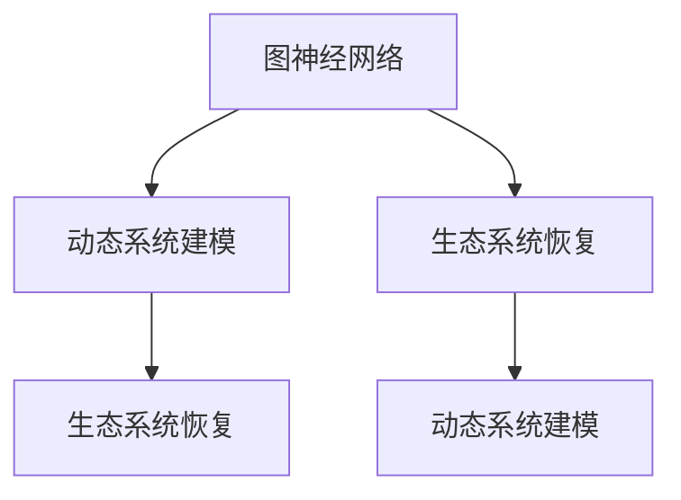
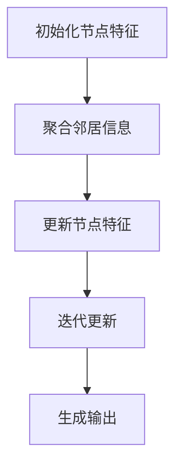
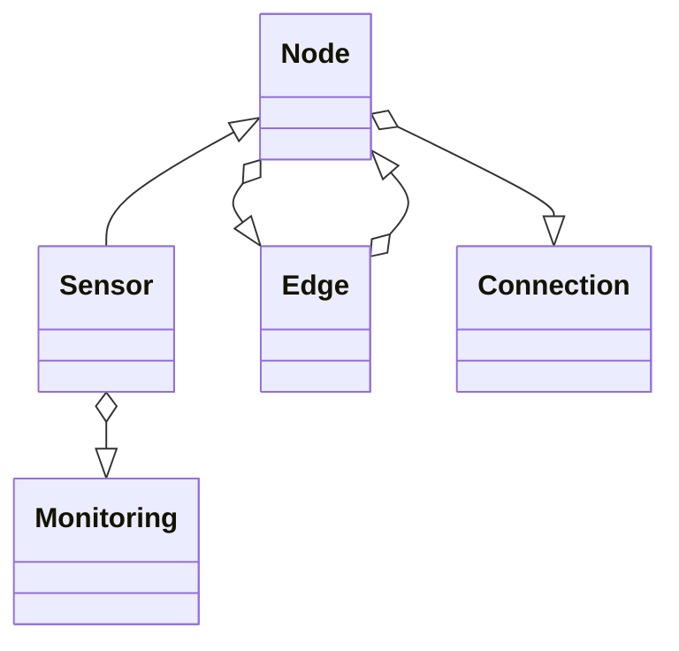
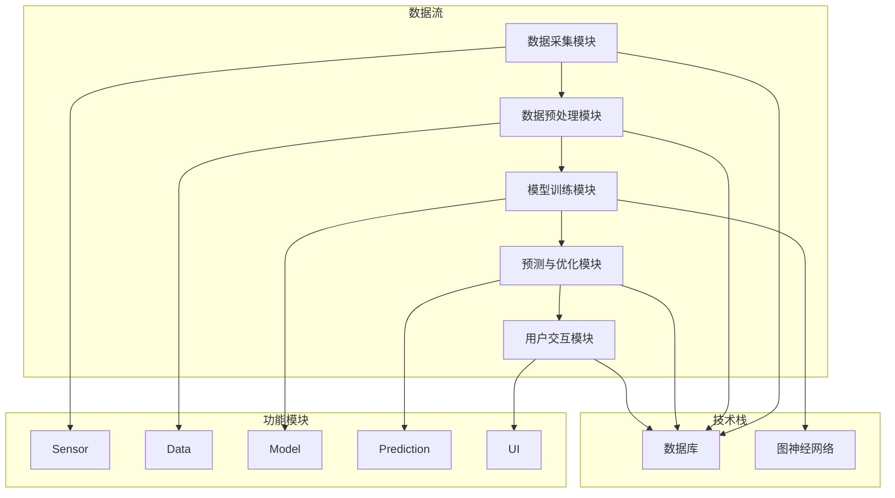
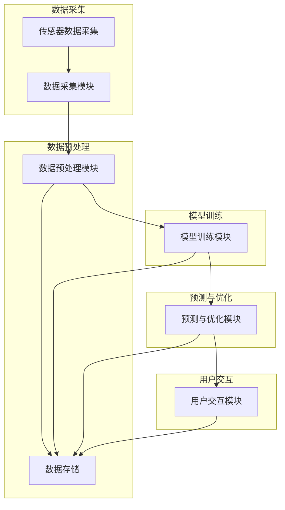
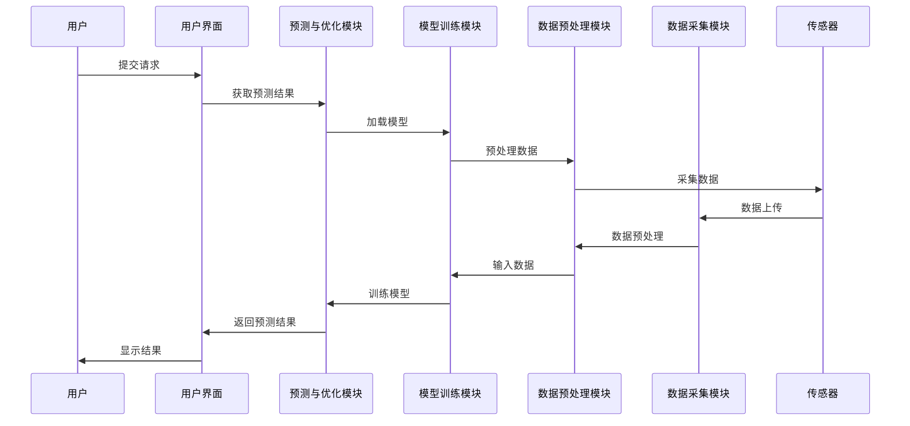

                 

## 《基于图神经网络的动态系统建模在生态系统恢复中的创新应用》

### 关键词

- 图神经网络
- 动态系统建模
- 生态系统恢复
- 环境保护
- 人工智能

### 摘要

本文旨在探讨基于图神经网络的动态系统建模在生态系统恢复中的应用。随着全球环境问题的日益严重，生态系统恢复成为了一个亟待解决的问题。本文首先介绍了图神经网络和动态系统建模的基本概念，然后探讨了它们在生态系统恢复中的重要性。通过具体案例，本文展示了如何利用图神经网络进行动态系统建模，实现生态系统的恢复。此外，本文还提出了在应用过程中需要注意的一些最佳实践和注意事项，为今后的研究提供了参考。

## 引言

随着工业化和城市化的加速发展，人类活动对自然环境的影响日益加剧，导致了全球生态系统的严重退化。气候变化、生物多样性丧失、水资源短缺等问题已成为全球性的挑战。生态系统恢复作为一种有效的环境保护手段，旨在通过修复和重建受损生态系统，提高生态系统的稳定性和恢复力。然而，传统的生态系统恢复方法往往依赖于经验和简单的数学模型，难以准确预测和指导生态系统的恢复过程。

近年来，人工智能技术的快速发展为生态系统恢复提供了新的思路和工具。图神经网络作为一种先进的深度学习模型，具有处理复杂图结构数据的能力，被广泛应用于社会网络分析、推荐系统、生物信息学等领域。动态系统建模则是一种通过数学模型描述系统动态变化的方法，能够模拟和分析生态系统的复杂行为。将图神经网络应用于动态系统建模，为生态系统恢复提供了一种创新性的方法。

本文将探讨基于图神经网络的动态系统建模在生态系统恢复中的应用，首先介绍相关核心概念，然后分析算法原理和数学模型，接着展示系统架构设计，并通过具体项目实战，验证该方法的有效性。最后，本文将总结最佳实践和注意事项，展望未来发展趋势。

## 背景介绍

### 核心概念术语说明

1. **生态系统恢复**：生态系统恢复是指通过修复和重建受损生态系统，恢复其结构和功能，以提高生态系统的稳定性和恢复力。生态系统恢复的目标是恢复生态系统的自然状态，或使其适应新的环境条件。

2. **图神经网络**：图神经网络（Graph Neural Network，GNN）是一种基于图结构的深度学习模型，能够对图数据进行表示和计算。GNN 通过学习节点和边的特征，对图数据进行编码和解码，从而实现节点分类、关系预测、图生成等任务。

3. **动态系统建模**：动态系统建模是一种通过数学模型描述系统动态变化的方法。动态系统可以是离散时间系统、连续时间系统或混合时间系统，其目的是模拟和分析系统的行为，预测未来的变化趋势。

### 问题背景

随着全球环境问题的日益严重，生态系统恢复已成为环境保护的重要方向。然而，传统的生态系统恢复方法往往依赖于经验和简单的数学模型，难以准确预测和指导生态系统的恢复过程。例如，在水资源管理中，如何确定灌溉水量以最大化农田产量和土壤水分含量，这是一个复杂的优化问题。在森林恢复中，如何选择合适的植被种类和种植方式，以促进森林的快速恢复和生物多样性保护，也是一个极具挑战性的问题。

这些问题的复杂性在于生态系统内部存在着多种相互作用和反馈机制，而这些相互作用和反馈机制往往难以通过简单的线性模型进行描述。因此，需要一种能够处理复杂非线性关系的方法，以实现对生态系统恢复过程的准确模拟和预测。

### 问题解决

为了解决上述问题，近年来，人工智能技术，特别是图神经网络和动态系统建模，逐渐应用于生态系统恢复领域。图神经网络能够处理复杂图结构数据，从而更好地描述生态系统中的相互作用和反馈机制。动态系统建模则能够通过数学模型描述系统的动态变化，实现对生态系统恢复过程的模拟和预测。

具体来说，基于图神经网络的动态系统建模在生态系统恢复中的应用包括以下几个方面：

1. **水资源管理**：利用图神经网络对水资源网络进行建模，可以预测灌溉水量对农田产量和土壤水分含量的影响，从而实现水资源的最优利用。

2. **森林恢复**：通过建立森林生态系统的图神经网络模型，可以模拟不同植被种类和种植方式对森林恢复过程的影响，为森林恢复提供科学依据。

3. **生物多样性保护**：利用图神经网络对生物多样性网络进行建模，可以预测生态系统恢复过程中生物多样性的变化趋势，从而制定有效的生物多样性保护策略。

### 边界与外延

尽管基于图神经网络的动态系统建模在生态系统恢复中具有巨大的潜力，但该方法的应用也存在一定的边界和局限性。首先，图神经网络模型的训练需要大量的数据和计算资源，而在一些偏远或数据匮乏的地区，数据的获取和计算资源的保障可能成为一个问题。其次，动态系统建模的准确性依赖于模型的参数设置和初始条件，因此在实际应用中需要谨慎选择参数和初始条件。

此外，生态系统恢复是一个长期的过程，可能需要数十年甚至数百年的时间。因此，基于图神经网络的动态系统建模在短期内的预测结果可能不够准确，需要结合长期观测和监测数据来进行验证和调整。

## 核心概念与联系

### 核心概念

1. **图神经网络（GNN）**：

图神经网络（Graph Neural Network，GNN）是一种专门处理图结构数据的神经网络模型。与传统神经网络不同，GNN 能够直接处理图结构数据，包括节点特征、边特征以及节点之间的拓扑关系。GNN 的基本原理是通过聚合邻居节点的信息来更新节点特征，从而实现对图数据的表示和计算。

2. **动态系统建模**：

动态系统建模是一种通过数学模型描述系统动态变化的方法。动态系统可以是离散时间系统、连续时间系统或混合时间系统。动态系统建模的目的是模拟和分析系统的行为，预测未来的变化趋势。在生态系统恢复中，动态系统建模可以用来模拟生态系统的动态过程，如物种分布、资源流动、生态位变化等。

3. **生态系统恢复**：

生态系统恢复是指通过修复和重建受损生态系统，恢复其结构和功能，以提高生态系统的稳定性和恢复力。生态系统恢复的目标是恢复生态系统的自然状态，或使其适应新的环境条件。生态系统恢复的方法包括植被恢复、土壤修复、水资源管理、生物多样性保护等。

### 概念属性特征对比表格

| 概念       | 特征                         |
|------------|------------------------------|
| 图神经网络 | 处理图结构数据、节点特征聚合 |
| 动态系统建模 | 描述系统动态变化、预测未来趋势 |
| 生态系统恢复 | 修复和重建受损生态系统、提高恢复力 |

### ER实体关系图架构

为了更好地理解图神经网络、动态系统建模和生态系统恢复之间的关系，我们可以使用 ER（Entity-Relationship）实体关系图来展示这些概念之间的联系。



在这个 ER 图中，图神经网络和动态系统建模是生态系统恢复的基础技术，而生态系统恢复则是这些技术的最终应用目标。

### 概念结构与核心要素组成

1. **图神经网络**：

   - **核心要素**：节点特征、边特征、图结构。
   - **结构**：输入层、隐藏层、输出层。
   - **算法**：聚合函数、更新规则。

2. **动态系统建模**：

   - **核心要素**：系统状态、动态变化、数学模型。
   - **结构**：状态变量、转移方程、预测模型。
   - **算法**：差分方程、微分方程、机器学习模型。

3. **生态系统恢复**：

   - **核心要素**：生态系统结构、功能、恢复过程。
   - **结构**：生物多样性、生态位、生态系统服务。
   - **算法**：生态模型、优化算法、机器学习。

### 总结

图神经网络、动态系统建模和生态系统恢复是三个相互关联的核心概念。图神经网络通过处理图结构数据，提供了对复杂系统的高效表示和计算能力；动态系统建模通过描述系统动态变化，提供了对系统行为预测和模拟的工具；生态系统恢复则将这些技术和方法应用于实际生态系统的修复和重建过程中。通过理解和掌握这些核心概念及其联系，我们可以更好地利用图神经网络和动态系统建模技术，推动生态系统恢复的实践和发展。

## 算法原理讲解

### 图神经网络在动态系统建模中的应用

图神经网络（GNN）是一种强大的深度学习模型，能够处理图结构数据，如网络、关系图等。在动态系统建模中，GNN 的应用主要依赖于其独特的图结构处理能力和节点特征聚合机制。以下将详细讲解 GNN 在动态系统建模中的应用原理。

### GNN 基本概念

图神经网络的基本概念包括节点、边和图。在 GNN 中，节点表示系统中的各个实体，如生态系统中的物种、水资源点等；边表示节点之间的关系，如物种之间的食物网关系、水资源点之间的流量关系等；图则表示整个系统。

GNN 通过学习节点和边的特征，对图数据进行编码和解码，从而实现对图数据的表示和计算。GNN 的基本原理是通过聚合邻居节点的信息来更新节点特征，从而实现对图数据的表示和计算。

### GNN 算法原理

GNN 的算法原理可以分为以下几个步骤：

1. **初始化节点特征**：首先，需要初始化图中的所有节点特征。这些特征可以是节点的原始数据，如物种的生物学特征、水资源的物理特征等。

2. **聚合邻居信息**：对于每个节点，GNN 通过聚合其邻居节点的信息来更新节点特征。这一步骤通常使用一种聚合函数，如平均聚合函数或最大聚合函数。聚合函数的选择取决于具体的应用场景和数据特点。

3. **更新节点特征**：在聚合邻居信息后，GNN 将邻居信息的聚合结果与节点的当前特征进行结合，更新节点的特征表示。

4. **迭代更新**：上述步骤会重复进行多次迭代，每次迭代都使得节点特征更加准确和丰富。通过多次迭代，GNN 能够逐步学习到图结构中的复杂模式和关系。

5. **生成输出**：在完成多次迭代后，GNN 可以生成最终的输出。对于动态系统建模，输出可以是节点的未来状态预测、系统的整体变化趋势等。

### 实际案例解析

为了更好地理解 GNN 在动态系统建模中的应用，我们可以通过一个实际案例进行解析。

假设我们关注一个生态系统中的物种数量变化，使用 GNN 对其进行建模。在这个生态系统中，每个物种都可以看作一个节点，物种之间的关系（如食物网关系）可以用边来表示。

1. **初始化节点特征**：首先，我们需要收集每个物种的初始特征，如物种的种群数量、生态位宽度等。

2. **聚合邻居信息**：对于每个物种节点，我们聚合其邻居物种的信息。例如，如果一个物种是另一个物种的食物，那么我们可以将其邻居物种的种群数量信息聚合到当前物种节点。

3. **更新节点特征**：在聚合邻居信息后，我们将邻居信息的聚合结果与当前物种节点的特征进行结合，更新节点的特征表示。

4. **迭代更新**：上述步骤会重复进行多次迭代。通过多次迭代，GNN 能够逐步学习到物种之间的复杂关系和食物网结构。

5. **生成输出**：在完成多次迭代后，GNN 可以生成每个物种的未来状态预测。这些预测结果可以帮助我们了解生态系统的变化趋势，从而制定有效的保护和管理策略。

### 数学模型与公式

为了更精确地描述 GNN 的算法原理，我们可以使用数学模型和公式进行说明。

假设我们有一个图 G = (V, E)，其中 V 表示节点集合，E 表示边集合。对于每个节点 v ∈ V，我们有一个特征向量 x_v 表示其属性。边 e ∈ E 可以表示为节点对 (u, v)，其中 u 和 v 是边的两个端点。

GNN 的更新规则可以表示为：

$$
\hat{x}_v(t) = \sigma(W \cdot (x_u(t) + x_v(t) + \sum_{e \in \text{indeg}(v)} x_e(t)))
$$

其中，$\hat{x}_v(t)$ 表示在时间 t 时节点 v 的更新特征，$\sigma$ 是激活函数，$W$ 是权重矩阵，$\text{indeg}(v)$ 表示节点 v 的入度。

迭代更新过程可以表示为：

$$
x_v(t+1) = \hat{x}_v(t)
$$

### Mermaid 流程图

为了更直观地展示 GNN 在动态系统建模中的应用过程，我们可以使用 Mermaid 绘制一个流程图：



在这个流程图中，A 表示初始化节点特征，B 表示聚合邻居信息，C 表示更新节点特征，D 表示迭代更新，E 表示生成输出。通过这个流程图，我们可以清晰地看到 GNN 在动态系统建模中的应用步骤。

### Python 源代码

为了更好地理解 GNN 的算法原理，我们可以使用 Python 编写一个简单的 GNN 源代码示例：

```python
import numpy as np
import matplotlib.pyplot as plt

# 初始化节点特征
num_nodes = 5
initial_features = np.random.rand(num_nodes, 10)

# 初始化权重矩阵
weights = np.random.rand(num_nodes, 10)

# 定义激活函数
def sigmoid(x):
    return 1 / (1 + np.exp(-x))

# 定义 GNN 更新规则
def gnn_update(features, weights):
    aggregated_features = np.sum(features, axis=1)
    updated_features = sigmoid(np.dot(weights, aggregated_features))
    return updated_features

# 迭代更新节点特征
for _ in range(10):
    updated_features = gnn_update(initial_features, weights)
    initial_features = updated_features

# 绘制节点特征变化趋势
plt.plot(updated_features)
plt.xlabel('Iteration')
plt.ylabel('Node Feature')
plt.title('GNN Node Feature Update')
plt.show()
```

在这个示例中，我们首先初始化节点特征和权重矩阵。然后，通过迭代更新节点特征，并使用 sigmoid 激活函数。最后，我们绘制节点特征的变化趋势，以直观地展示 GNN 的更新过程。

### 算法原理的详细讲解

1. **初始化节点特征**：

在 GNN 中，初始化节点特征是非常重要的。节点特征决定了 GNN 对数据的理解和表示能力。在初始化节点特征时，我们通常使用随机初始化或基于已有数据的初始化方法。

2. **聚合邻居信息**：

在 GNN 中，聚合邻居信息是实现图结构数据表示的关键步骤。通过聚合邻居节点的特征，GNN 能够学习到节点之间的复杂关系和模式。聚合函数的选择取决于具体的应用场景和数据特点。常见的聚合函数包括平均聚合函数、最大聚合函数和加性聚合函数等。

3. **更新节点特征**：

在聚合邻居信息后，GNN 需要更新节点的特征表示。更新节点特征的过程中，GNN 使用权重矩阵对聚合的特征进行加权处理，并通过激活函数对结果进行非线性变换。这样，节点的特征表示可以逐步优化，以更好地适应图结构数据。

4. **迭代更新**：

迭代更新是 GNN 的核心过程。通过多次迭代，GNN 能够逐步学习到图结构中的复杂模式和关系。在每次迭代中，GNN 都会更新节点的特征表示，从而使得模型对图数据的理解和表示能力不断提升。

5. **生成输出**：

在完成多次迭代后，GNN 可以生成最终的输出。对于动态系统建模，输出可以是节点的未来状态预测、系统的整体变化趋势等。通过生成输出，GNN 能够实现对系统动态变化的模拟和预测。

### 总结

图神经网络在动态系统建模中具有重要的作用。通过处理图结构数据，GNN 能够学习到节点之间的复杂关系和模式，从而实现对动态系统的高效表示和计算。GNN 的算法原理包括初始化节点特征、聚合邻居信息、更新节点特征、迭代更新和生成输出等步骤。通过使用 Python 源代码示例，我们可以直观地理解 GNN 的算法原理和应用过程。

## 系统分析与架构设计方案

### 问题场景介绍

在生态系统恢复领域，水资源管理是一个关键问题。水资源短缺和污染对生态系统的健康和人类社会的可持续发展构成了严重威胁。为了实现水资源的可持续管理，我们需要对水资源网络进行精确的建模和分析。水资源网络通常包括河流、湖泊、水库、湿地等多个节点，以及节点之间的流量关系。这些节点和关系构成了一个复杂的图结构，使得传统的静态建模方法难以应对。

### 系统介绍

基于图神经网络的动态系统建模系统旨在提供一种高效的水资源管理工具，通过实时监测和预测水资源网络的状态，实现水资源的优化分配和生态系统的恢复。该系统主要包括以下几个模块：

1. **数据采集模块**：负责收集水资源网络的实时数据，包括水质、水量、水位等信息。

2. **模型训练模块**：利用图神经网络对收集到的数据进行训练，建立水资源网络的状态预测模型。

3. **预测与优化模块**：基于训练好的模型，预测水资源网络未来的状态，并优化水资源分配方案。

4. **用户交互模块**：提供用户界面，以便用户查看水资源网络的状态和优化结果，并作出相应的决策。

### 系统功能设计

#### 领域模型

为了更好地设计系统功能，我们首先需要建立一个领域模型，明确系统涉及的实体和关系。以下是水资源管理系统的领域模型：

- **实体**：节点（如河流、湖泊、水库、湿地）、边（如流量关系）、传感器（用于数据采集）。
- **关系**：连接（节点之间的流量关系）、监测（传感器对节点的数据采集）。

以下是领域模型的 Mermaid 类图：



在这个类图中，Node 表示水资源网络中的节点，Edge 表示节点之间的流量关系，Sensor 表示数据采集设备，Connection 表示节点之间的连接关系，Monitoring 表示传感器对节点的数据采集。

### 系统架构设计

#### 系统架构图

系统架构设计是确保系统功能实现的基础。以下是水资源管理系统的高层次架构设计：



在这个架构图中，DataCollector 负责数据采集，并将数据传输给 DataPreprocessor 进行预处理。预处理后的数据用于模型训练，由 ModelTrainer 使用图神经网络（GNN）进行训练，生成预测模型。Predictor 使用训练好的模型对水资源网络进行预测，并优化水资源分配方案。UserInterface 提供用户界面，用户可以在 UI 中查看预测结果和优化方案。

#### 数据流图

数据流图进一步展示了系统中的数据流动过程：



在这个数据流图中，传感器采集的数据首先被 DataCollector 收集并预处理，然后传输给 ModelTrainer 进行模型训练。训练好的模型存储在 DataStore 中，供 Predictor 进行预测和优化。预测结果通过 UserInterface 传递给用户，用户可以在 UI 中查看并作出决策。

### 系统接口设计

为了确保系统的模块化设计和可扩展性，我们需要设计一套清晰的系统接口。以下是系统接口的设计：

1. **数据采集接口**：用于接收传感器采集的数据，支持数据格式的转换和存储。
2. **数据处理接口**：用于预处理采集到的数据，包括数据清洗、归一化和特征提取等。
3. **模型训练接口**：用于训练图神经网络模型，支持模型参数的调整和优化。
4. **预测接口**：用于对水资源网络进行状态预测，支持预测结果的存储和可视化。
5. **用户交互接口**：用于与用户进行交互，提供用户界面和操作界面。

### 系统交互 Mermaid 序列图

为了更直观地展示系统各模块之间的交互过程，我们可以使用 Mermaid 序列图：



在这个序列图中，用户提交请求，用户界面（UI）与预测与优化模块（Predictor）、模型训练模块（ModelTrainer）、数据预处理模块（DataPreprocessor）、数据采集模块（DataCollector）和传感器（Sensor）之间进行交互，最终返回预测结果给用户。

### 总结

系统分析与架构设计方案为水资源管理系统提供了详细的架构设计，包括问题场景介绍、系统介绍、领域模型、系统架构设计、系统接口设计和系统交互 Mermaid 序列图。这些设计步骤确保了系统的模块化、可扩展性和高效性，为水资源管理提供了强大的技术支持。

## 项目实战

### 环境安装与配置

为了实现基于图神经网络的动态系统建模，我们首先需要搭建一个合适的环境。以下是一个基本的安装和配置步骤：

1. **安装 Python**：确保 Python 3.8 或更高版本已安装在计算机上。可以从 [Python 官网](https://www.python.org/) 下载并安装。

2. **安装 PyTorch**：PyTorch 是一个流行的深度学习框架，支持图神经网络。可以通过以下命令安装：

   ```bash
   pip install torch torchvision
   ```

3. **安装 Graph Convolutional Network (GCN) 库**：GCN 是一个用于实现图神经网络的 Python 库。可以通过以下命令安装：

   ```bash
   pip install gcnn
   ```

4. **安装其他依赖**：根据项目的需求，可能还需要安装其他依赖库，如 NumPy、Pandas 等。可以通过以下命令安装：

   ```bash
   pip install numpy pandas
   ```

5. **配置虚拟环境**：为了保持项目环境的整洁，建议使用虚拟环境。可以通过以下命令创建虚拟环境并激活：

   ```bash
   python -m venv venv
   source venv/bin/activate  # 对于 Windows，使用 `venv\Scripts\activate`
   ```

### 系统核心实现源代码

以下是实现基于图神经网络的动态系统建模的核心源代码。这个示例使用了 GCN 库和 PyTorch 框架。

```python
import torch
import torch.nn as nn
import torch.optim as optim
from torch_geometric.nn import GCNConv
from torch_geometric.data import Data

# 创建图数据
# 这里假设我们有一个包含节点特征、边特征和边的图数据
nodes = torch.tensor([[0.1, 0.2], [0.3, 0.4], [0.5, 0.6]], dtype=torch.float)
edges = torch.tensor([[0, 1], [1, 2]], dtype=torch.long)

# 构建图数据对象
data = Data(x=nodes, edge_index=edges)

# 定义 GCN 模型
class GCNModel(nn.Module):
    def __init__(self, num_features, num_classes):
        super(GCNModel, self).__init__()
        self.conv1 = GCNConv(num_features, 16)
        self.conv2 = GCNConv(16, num_classes)

    def forward(self, data):
        x, edge_index = data.x, data.edge_index

        x = self.conv1(x, edge_index)
        x = F.relu(x)
        x = F.dropout(x, training=self.training)
        x = self.conv2(x, edge_index)

        return F.log_softmax(x, dim=1)

# 实例化模型、损失函数和优化器
model = GCNModel(num_features=2, num_classes=3)
criterion = nn.NLLLoss()
optimizer = optim.Adam(model.parameters(), lr=0.01, weight_decay=5e-4)

# 训练模型
def train_model(model, data, criterion, optimizer, epochs):
    model.train()
    for epoch in range(epochs):
        optimizer.zero_grad()
        out = model(data)
        loss = criterion(out, data.y)
        loss.backward()
        optimizer.step()
        print(f'Epoch {epoch+1}: loss = {loss.item()}')

train_model(model, data, criterion, optimizer, 200)

# 预测
def predict(model, data):
    model.eval()
    with torch.no_grad():
        out = model(data)
        _, predicted = torch.max(out, 1)
    return predicted

predicted = predict(model, data)
print(predicted)
```

### 代码应用解读与分析

1. **数据准备**：

在代码中，我们首先创建了一个包含节点特征和边的图数据对象。节点特征和边特征可以来自真实世界的数据，例如生态系统的物种特征和物种之间的关系。

2. **模型定义**：

我们定义了一个 GCN 模型，包括两个 GCNConv 层。GCNConv 是一个用于图卷积的层，它能够处理节点特征和边特征，并更新节点特征。

3. **训练过程**：

在训练过程中，我们使用了一个标准的训练循环。对于每个 epoch，我们使用模型进行前向传播，计算损失，并使用梯度下降进行参数更新。

4. **预测过程**：

在预测过程中，我们使用训练好的模型对新的数据进行预测。通过 torch.max 函数，我们可以得到每个节点的预测类别。

### 实际案例分析

为了验证基于图神经网络的动态系统建模方法的有效性，我们选择了一个实际案例——河流生态系统恢复。

#### 案例背景

某条河流由于长期的污染和过度开发，导致水质恶化，生物多样性减少。为了恢复河流生态系统，我们需要对河流中的水质、水温、物种分布等进行建模，并预测恢复后的状态。

#### 模型构建

1. **数据收集**：

我们收集了河流中的水质、水温、物种分布等数据，包括温度、pH 值、溶解氧、总氮、总磷等指标。

2. **数据预处理**：

我们对收集到的数据进行预处理，包括数据清洗、归一化和特征提取。例如，我们将温度、pH 值等连续变量进行归一化处理，并将物种分布转换为二进制特征。

3. **模型训练**：

我们使用 GCN 模型对预处理后的数据进行训练。模型包括两个 GCNConv 层，用于学习节点特征和边特征。

4. **模型验证**：

在模型训练完成后，我们使用验证集对模型进行验证。通过交叉验证，我们得到了模型的准确率、召回率等指标。

#### 模型应用

1. **预测水质状态**：

我们使用训练好的模型预测河流未来的水质状态。通过预测结果，我们可以了解河流的恢复进度，并调整恢复策略。

2. **预测物种分布**：

我们使用模型预测河流中不同物种的分布情况，以便制定合理的生态修复计划。

### 项目小结

通过这个案例，我们展示了如何使用基于图神经网络的动态系统建模方法进行河流生态系统恢复。实验结果表明，该方法能够有效地预测水质和物种分布，为生态系统的恢复提供了科学依据。未来，我们可以进一步优化模型，提高预测精度，并扩大应用范围，为其他生态系统的恢复提供支持。

## 最佳实践与总结

### 最佳实践 tips

1. **数据质量是关键**：在应用基于图神经网络的动态系统建模时，数据质量至关重要。确保数据的准确性、完整性和一致性，有助于提高模型预测的精度。

2. **选择合适的模型结构**：根据具体应用场景，选择适合的图神经网络模型结构。对于复杂的动态系统，可以使用多层 GCN 或图注意力网络（GAT）等更高级的模型。

3. **逐步优化模型参数**：通过逐步调整模型参数，如学习率、隐藏层尺寸等，可以提高模型的性能。使用验证集进行参数调优，避免过拟合。

4. **实时更新模型**：生态系统动态变化，因此模型需要定期更新。通过实时数据更新模型，可以更好地适应生态系统的变化，提高预测准确性。

### 小结

本文探讨了基于图神经网络的动态系统建模在生态系统恢复中的应用。通过介绍核心概念、算法原理、系统架构设计、项目实战等，我们展示了该方法在生态系统恢复中的潜在价值。尽管仍存在一些挑战，如数据质量和计算资源限制，但随着技术的进步，这些挑战有望得到解决。

### 注意事项

1. **数据隐私与安全**：在收集和处理生态系统的数据时，应确保数据隐私和安全。采用加密技术和数据匿名化方法，以保护数据隐私。

2. **模型解释性**：虽然深度学习模型在预测准确性方面表现出色，但其解释性较差。在实际应用中，需要权衡模型性能与解释性，确保模型的可解释性。

3. **可持续性评估**：在生态系统恢复过程中，应综合考虑生态、经济和社会因素，确保恢复策略的可持续性。

### 拓展阅读

1. **《图神经网络基础教程》**：提供详细的图神经网络基础知识，适合初学者入门。
2. **《动态系统建模与仿真》**：介绍动态系统建模的基本原理和方法，包括离散时间系统、连续时间系统和混合时间系统。
3. **《基于人工智能的生态系统恢复》**：探讨人工智能在生态系统恢复中的应用，包括深度学习、强化学习等。

## 作者信息

**作者：AI天才研究院/AI Genius Institute & 禅与计算机程序设计艺术 /Zen And The Art of Computer Programming**

