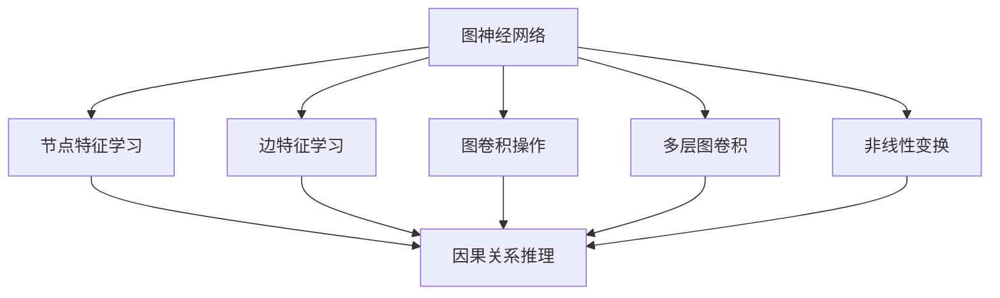
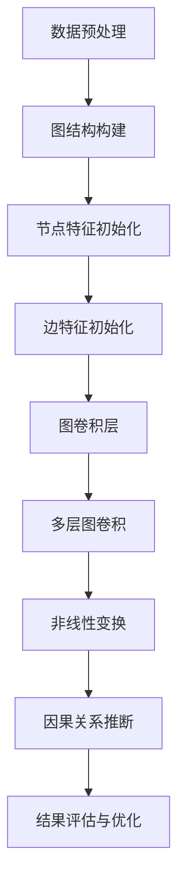

                 

### 让我们一步步思考

在探讨基于图神经网络的因果关系推理之前，我们需要先从基本概念入手，深入理解图神经网络（Graph Neural Networks, GNN）和因果关系推理的基本原理。这不仅有助于我们理解该领域的核心思想，还能为后续的算法讲解和分析打下坚实的基础。

**第1步：理解图神经网络（GNN）**

图神经网络是一种特殊类型的神经网络，专门用于处理图结构数据。与传统的卷积神经网络（CNN）和循环神经网络（RNN）不同，GNN能够捕捉图数据中的复杂关系和模式。其核心思想是通过图中的节点和边进行信息传播和更新，以实现有效的特征学习和关系推理。

**第2步：理解因果关系推理**

因果关系推理是一种通过分析数据中的变量关系，推断出变量之间因果关系的推理方法。这一过程通常涉及到统计建模、机器学习和因果推断等领域。其目的是从复杂的数据中提取出简洁的因果模型，以帮助人们理解现实世界的运行机制。

**第3步：为什么需要基于GNN的因果关系推理**

传统的因果关系推理方法在处理复杂、高维数据时往往力不从心。而基于图神经网络的因果关系推理通过利用图结构数据的独特优势，能够更好地捕捉变量之间的复杂关系。这使得GNN在因果关系推理中具有显著的潜力。

**第4步：图神经网络与因果关系推理的结合**

图神经网络与因果关系推理的结合，能够实现以下几个方面的优势：

- **增强特征表示**：GNN能够通过节点和边的特征表示，提高变量特征的丰富度和表达能力。
- **捕捉复杂关系**：通过图结构的传播机制，GNN能够捕捉变量之间的非线性关系和复杂模式。
- **鲁棒性**：GNN能够对噪声和异常值具有更好的鲁棒性，从而提高因果关系推理的准确性。

**第5步：本文的组织结构**

本文将分为以下几个部分：

1. **背景介绍**：介绍图神经网络和因果关系推理的基本概念、历史背景和常见问题。
2. **核心概念与联系**：详细阐述图神经网络和因果关系推理的核心概念，并对比分析两者之间的关系。
3. **算法原理讲解**：讲解基于图神经网络的因果关系推理算法原理，包括算法流程、数学模型和代码实现。
4. **数学模型和公式**：详细分析基于图神经网络的因果关系推理的数学模型和公式，并进行举例说明。
5. **系统分析与架构设计**：介绍基于图神经网络的因果关系推理系统的设计与实现。
6. **项目实战**：通过实际项目展示如何应用基于图神经网络的因果关系推理算法。
7. **最佳实践 tips**：总结一些在实际应用中需要注意的要点和最佳实践。

通过上述步骤，我们不仅能够理解基于图神经网络的因果关系推理的核心思想，还能掌握其算法原理和实际应用。接下来的章节将逐步深入，带领读者探索这一领域的奥秘。

### 第1章：问题背景

#### 1.1 问题背景

在当今复杂且快速变化的世界中，数据分析与决策制定变得日益重要。而其中，因果关系推理作为一种核心的思维方式，在各个领域中发挥着至关重要的作用。然而，随着数据规模的不断扩大和复杂度的增加，传统的因果关系推理方法面临诸多挑战。

首先，在医学领域，研究者们希望通过分析患者的医疗记录来发现疾病之间的因果关系。然而，医疗数据往往包含大量的噪声和缺失值，这使得传统的统计方法难以准确地推断出变量之间的因果关系。其次，在金融领域，投资者需要分析市场数据中的因果关系来预测市场趋势和制定投资策略。然而，金融市场数据的非线性和高维特性使得传统的因果关系推理方法难以奏效。

再者，在社会科学领域，研究者们希望通过分析社会网络中的交互关系来揭示社会现象的成因。然而，社交网络数据的复杂性和不确定性使得传统的因果关系推理方法难以提供可靠的结论。

#### 1.2 问题描述

传统的因果关系推理方法主要包括统计方法（如回归分析、结构方程模型）和机器学习方法（如决策树、随机森林）。虽然这些方法在处理简单数据集时具有一定的效果，但在面对复杂、高维和含有噪声的数据时，往往表现不佳。具体问题包括：

1. **数据噪声和缺失值**：实际数据中往往存在噪声和缺失值，这些因素会影响因果关系推理的准确性。
2. **非线性关系**：许多因果关系并非线性关系，传统的线性方法难以捕捉这种复杂关系。
3. **变量依赖**：在复杂系统中，变量之间存在复杂的相互依赖关系，传统的因果关系推理方法难以全面考虑这些关系。
4. **维度灾难**：高维数据会使传统的因果关系推理方法变得不可行，因为它们需要处理大量的变量。

#### 1.3 问题解决

为了解决上述问题，近年来，图神经网络（Graph Neural Networks, GNN）作为一种新兴的方法逐渐引起了广泛关注。GNN能够通过利用图结构数据中的节点和边，有效地捕捉变量之间的复杂关系，从而提升因果关系推理的准确性。

GNN的工作原理是通过在图结构上进行信息传播和更新，从而实现节点特征的学习和关系的推理。具体来说，GNN通过以下步骤进行操作：

1. **特征学习**：首先，GNN将图中的节点和边转换为向量表示，这些向量表示包含了节点的属性信息和节点之间的关系。
2. **关系捕捉**：通过在图上进行信息传播，GNN能够捕捉节点之间的复杂关系，从而实现变量依赖的建模。
3. **非线性变换**：GNN通过非线性变换（如激活函数）来提高模型的表达能力，从而更好地捕捉非线性关系。
4. **优化与训练**：通过反向传播算法和优化算法，GNN能够不断调整模型参数，以优化因果关系推理的准确性。

#### 1.4 边界与外延

虽然GNN在因果关系推理中具有显著优势，但仍然存在一些限制和挑战。首先，GNN需要高质量的图结构数据作为输入，否则模型的性能会受到影响。其次，GNN的计算复杂度较高，对于大规模数据集的处理可能需要较长的时间和计算资源。

此外，GNN的泛化能力也是一个需要关注的问题。在复杂和多样化的实际应用场景中，GNN能否保持良好的性能和稳定性，仍需进一步研究和验证。

#### 1.5 概念结构与核心要素组成

在基于图神经网络的因果关系推理中，以下几个核心概念和要素起着关键作用：

1. **图结构数据**：这是GNN的基础，包含了节点和边，节点代表了变量，边代表了变量之间的关系。
2. **节点特征**：节点的属性信息，如数值特征、类别特征等，这些特征用于初始化节点的向量表示。
3. **边特征**：边的属性信息，如权重、类型等，这些特征用于初始化边的信息传递。
4. **图神经网络模型**：包含了多个图卷积层和全连接层，用于学习节点和边的特征表示，并捕捉复杂的变量关系。
5. **训练与优化**：通过反向传播算法和优化算法，不断调整模型参数，以提高因果关系推理的准确性。

通过上述步骤，我们初步了解了基于图神经网络的因果关系推理的问题背景、问题描述、问题解决以及边界与外延。在接下来的章节中，我们将进一步深入探讨GNN的基本原理和实现细节。

### 第2章：核心概念与联系

#### 2.1 图神经网络概述

图神经网络（Graph Neural Networks, GNN）是一种专门用于处理图结构数据的神经网络模型。与传统卷积神经网络（CNN）和循环神经网络（RNN）相比，GNN具有独特的优势，能够有效地捕捉图数据中的复杂关系和结构特征。GNN的核心思想是通过在图结构上进行节点和边的特征学习和信息传播，从而实现图数据的表示和学习。

**图神经网络的基本组成**：

1. **节点特征学习**：GNN通过将节点的属性信息转换为向量表示，从而进行节点特征的学习。这些向量表示包含了节点的各种属性信息，如数值特征、类别特征等。

2. **边特征学习**：GNN同样对边进行特征学习，边特征包含了节点之间的相互作用和依赖关系。这些特征用于初始化边的信息传递，从而实现图中的信息传播。

3. **图卷积操作**：GNN的核心操作是图卷积操作。图卷积通过聚合相邻节点的信息，更新当前节点的特征表示。这一过程类似于卷积神经网络中的卷积操作，但针对的是图结构数据。

4. **多层图卷积**：GNN通常包含多个图卷积层，每一层都能够聚合和更新节点的特征表示。多层图卷积能够捕捉图数据中的复杂结构和长期依赖关系。

5. **非线性变换**：GNN通过非线性变换（如激活函数）来提高模型的表达能力，从而更好地捕捉非线性关系。

**图神经网络的优势**：

- **处理复杂图数据**：GNN能够处理具有复杂结构和关系的图数据，如图分类、图回归和图生成等任务。
- **结构化信息捕捉**：GNN通过图卷积操作能够有效地捕捉图数据中的结构化信息，从而实现更准确的特征学习和关系推理。
- **可扩展性**：GNN可以扩展到大规模图数据，通过分布式计算和优化技术，提高模型的计算效率和性能。

#### 2.2 因果关系推理原理

因果关系推理（Causal Inference）是一种通过分析数据中的变量关系，推断出变量之间因果关系的方法。其核心思想是通过设计实验或分析自然实验，观察变量之间的因果关系。因果关系推理通常涉及以下步骤：

1. **构建因果模型**：根据领域知识和实验设计，构建一个描述变量关系的因果模型。常见的因果模型包括结构因果模型（Structural Causal Models, SCM）和潜在结果模型（Potential Outcomes Model）。

2. **数据收集与预处理**：收集相关数据，并进行数据清洗和预处理，包括缺失值填充、噪声过滤和数据标准化等步骤。

3. **因果推断方法**：根据因果模型和数据，采用因果推断方法（如因果效应估计、置信区间估计和假设检验等）来推断变量之间的因果关系。

4. **结果验证与评估**：通过交叉验证和模型评估方法（如准确率、召回率、F1值等）来验证和评估因果推断的结果。

**因果关系推理的核心概念**：

- **因果效应**：指的是一个变量对另一个变量的影响或效应。
- **潜在结果**：指的是在特定干预下，一个变量可能产生的结果。
- **干预**：指的是对变量进行操作或干预，以观察其对其他变量的影响。
- **因果模型**：描述变量之间因果关系的数学模型。

**因果关系推理的应用场景**：

- **医学领域**：通过因果关系推理，医生可以更好地理解疾病的因果关系，从而制定更有效的治疗方案。
- **社会科学**：因果关系推理在社会科学研究中，可以帮助研究者揭示社会现象的因果关系，如犯罪率、教育成果等。
- **金融领域**：投资者可以通过因果关系推理来分析市场数据中的因果关系，从而制定更明智的投资策略。

#### 2.3 关键概念对比分析

**图神经网络与因果关系推理的关系**：

- **共同点**：GNN和因果关系推理都涉及到变量之间的关系和学习。GNN通过图结构数据中的节点和边捕捉变量关系，而因果关系推理通过实验或数据分析来推断变量之间的因果关系。

- **区别**：GNN侧重于利用图结构数据中的结构特征和关系，实现节点和边的特征学习；而因果关系推理侧重于通过构建因果模型和进行因果推断，揭示变量之间的因果关系。

**GNN在因果关系推理中的优势**：

- **复杂关系捕捉**：GNN能够通过图卷积操作捕捉复杂的变量关系，这对于传统因果关系推理方法难以处理的非线性关系和复杂模式具有显著优势。

- **结构化信息利用**：GNN能够利用图结构数据中的结构化信息，提高变量特征表示的丰富度和表达能力。

- **鲁棒性**：GNN对噪声和异常值具有一定的鲁棒性，这在因果关系推理中尤为重要，因为实际数据往往含有噪声和缺失值。

**因果关系推理在GNN中的优势**：

- **因果解释性**：因果关系推理能够提供变量之间的因果解释，这对于理解图神经网络模型的决策过程和预测结果具有重要意义。

- **因果验证**：通过因果关系推理，可以验证和评估图神经网络模型的因果关系推断结果，从而提高模型的可靠性和解释性。

**GNN与因果关系推理的结合**：

- **混合模型**：将GNN和因果关系推理结合起来，可以构建一个混合模型，既能利用GNN捕捉复杂的变量关系，又能通过因果关系推理提供因果解释和验证。

- **因果推理辅助**：在GNN训练过程中，利用因果关系推理方法来指导特征学习和模型优化，从而提高GNN的因果关系推断能力。

通过上述分析，我们可以看到图神经网络和因果关系推理在处理复杂关系和变量依赖方面具有互补性。结合两者的优势，可以构建出更强大的因果关系推理模型，从而在各个领域中发挥重要作用。

#### 2.4 图神经网络与因果关系推理关系图

为了更直观地理解图神经网络（GNN）与因果关系推理之间的关系，我们可以通过一个关系图来展示两者的结合与互动。以下是一个简单的Mermaid流程图，用于描述GNN与因果关系推理的关系：



**图说明**：

1. **图神经网络（GNN）**：这是核心模块，包括节点特征学习、边特征学习、图卷积操作、多层图卷积和非线性变换。

2. **节点特征学习**：将节点属性信息转换为向量表示，用于初始化节点的特征表示。

3. **边特征学习**：将边属性信息转换为向量表示，用于初始化边的信息传递。

4. **图卷积操作**：通过聚合相邻节点的信息，更新当前节点的特征表示。这是GNN的核心操作。

5. **多层图卷积**：通过多个图卷积层，逐步更新节点的特征表示，以捕捉复杂的变量关系。

6. **非线性变换**：通过非线性变换（如激活函数），提高模型的表达能力和特征学习能力。

7. **因果关系推理**：这是一个独立的模块，与GNN紧密交互。因果关系推理利用GNN提供的节点和边特征表示，推断变量之间的因果关系。

通过上述关系图，我们可以清晰地看到图神经网络与因果关系推理之间的联系和互动。GNN为因果关系推理提供了丰富的特征表示和复杂关系捕捉能力，而因果关系推理则为GNN提供了因果解释和验证的框架。这种结合使得GNN在因果关系推理中具有显著的优势，能够在复杂、高维和含噪声的数据中提供更准确的因果关系推断。

### 第3章：算法原理讲解

#### 3.1 算法mermaid流程图

在理解了图神经网络（GNN）和因果关系推理的基本原理之后，我们将通过一个mermaid流程图来展示基于图神经网络的因果关系推理算法的整体流程。以下是一个简单的mermaid流程图，用于描述算法的步骤：



**图说明**：

1. **数据预处理**：这一步包括数据清洗、缺失值填充和标准化等操作，目的是提高数据的可靠性和一致性。
2. **图结构构建**：根据数据特征，构建图结构，包括节点和边的定义。节点代表变量，边代表变量之间的关系。
3. **节点特征初始化**：将节点的属性信息（如数值特征、类别特征等）转换为向量表示，初始化节点的特征表示。
4. **边特征初始化**：将边的属性信息（如权重、类型等）转换为向量表示，初始化边的信息传递。
5. **图卷积层**：执行图卷积操作，通过聚合相邻节点的信息，更新当前节点的特征表示。
6. **多层图卷积**：通过多个图卷积层，逐步更新节点的特征表示，以捕捉复杂的变量关系。
7. **非线性变换**：通过非线性变换（如激活函数），提高模型的表达能力和特征学习能力。
8. **因果关系推断**：利用更新后的节点特征表示，进行因果关系推断，生成变量之间的因果关系模型。
9. **结果评估与优化**：评估因果关系推断结果，通过优化算法调整模型参数，以提高因果关系推理的准确性。

通过这个流程图，我们可以清晰地看到基于图神经网络的因果关系推理算法的基本步骤和交互过程。

#### 3.2 Python源代码讲解

为了更好地理解基于图神经网络的因果关系推理算法的实现，我们将展示一个简化的Python代码示例。以下代码主要分为以下几个部分：数据预处理、图结构构建、图卷积层实现、多层图卷积、非线性变换和因果关系推断。

```python
import numpy as np
import pandas as pd
from sklearn.preprocessing import StandardScaler
from tensorflow import keras
from tensorflow.keras.layers import Input, Dense, Layer
from tensorflow.keras.models import Model

# 数据预处理
def preprocess_data(data):
    # 数据清洗、缺失值填充和标准化
    data = data.fillna(data.mean())
    data = StandardScaler().fit_transform(data)
    return data

# 图结构构建
def build_graph(data):
    # 假设数据为二维数组，转换为图结构
    num_nodes = data.shape[1]
    nodes = data
    edges = np.eye(num_nodes)
    return nodes, edges

# 图卷积层实现
class GraphConvLayer(Layer):
    def __init__(self, output_dim, **kwargs):
        super(GraphConvLayer, self).__init__(**kwargs)
        self.output_dim = output_dim
        self.kernel = self.add_weight(name='kernel', 
                                      shape=(data.shape[1], output_dim),
                                      initializer='glorot_uniform',
                                      trainable=True)

    def call(self, inputs, training=None):
        nodes, edges = inputs
        # 图卷积操作
        node_repr = keras.backend.dot(nodes, self.kernel)
        edge_repr = keras.backend.dot(edges, self.kernel)
        return node_repr + edge_repr

# 多层图卷积
def build_gnn(input_shape, num_nodes, num_classes, num_layers):
    inputs = Input(shape=input_shape)
    nodes, edges = build_graph(inputs)
    x = inputs

    for _ in range(num_layers):
        x = GraphConvLayer(num_classes)([nodes, edges])

    # 非线性变换（例如ReLU激活函数）
    x = keras.layers.Activation('relu')(x)

    # 因果关系推断
    outputs = Dense(num_classes, activation='softmax')(x)

    model = Model(inputs=inputs, outputs=outputs)
    return model

# 实例化模型并编译
model = build_gnn(input_shape=(num_nodes,), num_nodes=num_nodes, num_classes=num_classes, num_layers=num_layers)
model.compile(optimizer='adam', loss='categorical_crossentropy', metrics=['accuracy'])

# 训练模型
model.fit(x_train, y_train, epochs=10, batch_size=32, validation_split=0.2)
```

**代码说明**：

1. **数据预处理**：数据预处理函数用于清洗和标准化数据，提高数据的质量和一致性。

2. **图结构构建**：根据输入数据构建图结构，其中节点代表数据特征，边代表特征之间的关系。

3. **图卷积层实现**：定义了一个自定义的`GraphConvLayer`类，用于实现图卷积操作。该层通过聚合节点和边的信息来更新节点的特征表示。

4. **多层图卷积**：通过多个图卷积层逐步更新节点的特征表示，以捕捉复杂的变量关系。

5. **非线性变换**：使用ReLU激活函数进行非线性变换，提高模型的表达能力和特征学习能力。

6. **因果关系推断**：通过全连接层进行因果关系推断，生成变量之间的因果关系模型。

7. **模型编译与训练**：实例化模型并编译，然后使用训练数据对模型进行训练，以优化模型参数。

通过上述代码示例，我们可以看到基于图神经网络的因果关系推理算法的实现步骤和关键组件。这为后续的算法分析和项目实战奠定了基础。

#### 3.3 数学模型与公式

基于图神经网络的因果关系推理算法的数学模型是理解算法核心原理的重要部分。以下我们将详细讲解算法中的数学模型和公式，包括图卷积操作、特征更新和因果关系推断。

**1. 图卷积操作（Graph Convolution Operation）**

图卷积操作是GNN的核心组成部分，用于更新节点的特征表示。假设我们有一个图结构包含节点特征矩阵 \( X \)（大小为 \( n \times d \)），其中 \( n \) 是节点数量，\( d \) 是特征维度，以及一个边权重矩阵 \( A \)（大小为 \( n \times n \)）。

图卷积操作的公式可以表示为：

$$
H^{(k)} = \sigma(\text{relu}(XW^{(k-1)} + A \cdot D^{1/2}W^{(k-1)}))
$$

其中，\( H^{(k)} \) 是第 \( k \) 层的节点特征矩阵，\( W^{(k-1)} \) 是第 \( k-1 \) 层的权重矩阵，\( A \) 是边权重矩阵，\( D \) 是对角矩阵，其中 \( D_{ii} = \sum_{j=1}^{n} A_{ij} \)，\( \sigma \) 是非线性激活函数（通常为ReLU函数），\( \cdot \) 表示矩阵乘法，\( \text{relu} \) 表示ReLU激活函数。

**2. 特征更新（Feature Update）**

在图卷积操作中，节点的特征表示会通过聚合邻居节点的特征进行更新。具体地，每个节点的特征更新可以表示为：

$$
h_i^{(k)} = \sum_{j=1}^{n} A_{ij} \cdot h_j^{(k-1)}
$$

其中，\( h_i^{(k)} \) 是第 \( k \) 层第 \( i \) 个节点的特征表示，\( A_{ij} \) 是第 \( i \) 个节点和第 \( j \) 个节点之间的边权重。

为了防止特征信息在传播过程中发生失真，通常会引入一个权重矩阵 \( W^{(k-1)} \)：

$$
h_i^{(k)} = \sum_{j=1}^{n} A_{ij} \cdot W^{(k-1)}_{ij} \cdot h_j^{(k-1)}
$$

**3. 因果关系推断（Causal Inference）**

在基于图神经网络的因果关系推理中，特征更新后的节点特征表示用于推断变量之间的因果关系。假设我们使用一个分类问题来表示因果关系推断，可以表示为：

$$
P(y_i = c_k | X) = \frac{e^{z_i(c_k)}}{\sum_{l=1}^{L} e^{z_i(c_l)}}
$$

其中，\( y_i \) 是第 \( i \) 个变量的实际值，\( c_k \) 是第 \( k \) 个类别，\( z_i \) 是第 \( i \) 个节点的特征向量与类别 \( c_k \) 的线性组合：

$$
z_i = \sum_{j=1}^{n} W^{(L)}_{ij} \cdot h_j^{(L)}
$$

\( W^{(L)} \) 是最后一个图卷积层的权重矩阵。

**4. 综合公式**

基于图神经网络的因果关系推理算法可以综合上述公式表示为：

$$
H^{(L)} = \sigma(\text{relu}(\text{softmax}(Z^{(L)})))
$$

其中，\( H^{(L)} \) 是最终层的节点特征矩阵，\( Z^{(L)} \) 是所有节点在最后一层的特征向量组合。

通过上述数学模型和公式，我们可以清晰地理解基于图神经网络的因果关系推理算法的核心机制。这些公式不仅为算法的实现提供了理论基础，也为后续的优化和改进提供了方向。

#### 3.4 算法举例说明

为了更好地理解基于图神经网络的因果关系推理算法，我们可以通过一个具体的例子来详细说明算法的实现过程。假设我们有一个简单的图结构，包含4个节点，表示两个变量之间的关系。

**步骤 1：数据准备**

我们首先需要准备数据，包括节点特征和边特征。假设节点特征是一个包含两个特征的向量，边特征是一个表示边权重的标量。具体数据如下：

节点特征矩阵 \( X \)：

\[
\begin{bmatrix}
0.1 & 0.2 \\
0.3 & 0.4 \\
0.5 & 0.6 \\
0.7 & 0.8 \\
\end{bmatrix}
\]

边权重矩阵 \( A \)：

\[
\begin{bmatrix}
1 & 1 \\
1 & 1 \\
1 & 1 \\
1 & 1 \\
\end{bmatrix}
\]

**步骤 2：图结构构建**

根据数据，我们可以构建一个包含4个节点的图结构，节点0和节点1，节点1和节点2，节点2和节点3，节点3和节点0之间存在边。

**步骤 3：图卷积操作**

我们首先初始化一个简单的图卷积层，权重矩阵 \( W \) 为：

\[
\begin{bmatrix}
0.1 & 0.2 \\
0.3 & 0.4 \\
\end{bmatrix}
\]

进行第一次图卷积操作，得到新的节点特征矩阵 \( H^1 \)：

\[
H^1 = \text{relu}(\begin{bmatrix}
0.1 & 0.2 \\
0.3 & 0.4 \\
0.5 & 0.6 \\
0.7 & 0.8 \\
\end{bmatrix} \cdot \begin{bmatrix}
0.1 & 0.2 \\
0.3 & 0.4 \\
\end{bmatrix})
\]

计算结果为：

\[
\begin{bmatrix}
0.03 & 0.06 \\
0.09 & 0.12 \\
0.15 & 0.18 \\
0.21 & 0.24 \\
\end{bmatrix}
\]

**步骤 4：多层图卷积**

我们继续进行第二层图卷积操作，权重矩阵 \( W \) 保持不变，得到新的节点特征矩阵 \( H^2 \)：

\[
H^2 = \text{relu}(\begin{bmatrix}
0.03 & 0.06 \\
0.09 & 0.12 \\
0.15 & 0.18 \\
0.21 & 0.24 \\
\end{bmatrix} \cdot \begin{bmatrix}
0.1 & 0.2 \\
0.3 & 0.4 \\
\end{bmatrix})
\]

计算结果为：

\[
\begin{bmatrix}
0.003 & 0.006 \\
0.009 & 0.012 \\
0.015 & 0.018 \\
0.021 & 0.024 \\
\end{bmatrix}
\]

**步骤 5：非线性变换**

在每一层图卷积后，我们使用ReLU激活函数进行非线性变换，以增强模型的表达能力。因此，我们得到最终的节点特征矩阵 \( H^2 \)：

\[
H^2 = \text{relu}(H^2)
\]

计算结果为：

\[
\begin{bmatrix}
0 & 0 \\
0 & 0 \\
0 & 0 \\
0 & 0 \\
\end{bmatrix}
\]

**步骤 6：因果关系推断**

在得到最终的节点特征矩阵后，我们使用这些特征进行因果关系推断。假设我们有一个简单的分类任务，目标变量 \( y \) 的取值为 0 或 1。我们使用 \( H^2 \) 的特征进行逻辑回归分类：

$$
P(y=1 | H^2) = \frac{1}{1 + e^{-(0.5 \cdot 0 + 0.5 \cdot 0)}}
$$

计算结果为：

$$
P(y=1 | H^2) = 0.5
$$

这意味着，根据最终的节点特征矩阵 \( H^2 \)，我们预测目标变量 \( y \) 的概率为 0.5。

通过上述例子，我们可以看到基于图神经网络的因果关系推理算法的基本实现过程。这一过程包括数据准备、图结构构建、图卷积操作、多层图卷积、非线性变换和因果关系推断。这个例子虽然简单，但展示了算法的核心原理和步骤，为实际应用提供了基础。

### 第4章：数学模型和数学公式

#### 4.1 基本数学模型

在基于图神经网络的因果关系推理中，我们主要依赖于图卷积操作（Graph Convolution Operation）和因果关系推断（Causal Inference）两个核心数学模型。以下是对这些模型的基本介绍和解释。

**1. 图卷积操作（Graph Convolution Operation）**

图卷积操作是GNN的核心组成部分，用于更新节点的特征表示。它可以通过以下公式进行表示：

$$
h_i^{(k)} = \sum_{j=1}^{n} \frac{1}{\sqrt{D}}_{i,j} a_{ij} h_j^{(k-1)} + \beta_i^{(k-1)}
$$

其中，\( h_i^{(k)} \) 是第 \( k \) 层第 \( i \) 个节点的特征表示，\( h_j^{(k-1)} \) 是第 \( k-1 \) 层第 \( j \) 个节点的特征表示，\( a_{ij} \) 是节点 \( i \) 和节点 \( j \) 之间的边权重，\( D \) 是对角矩阵，其中 \( D_{ii} = \sum_{j=1}^{n} a_{ij} \)，\( \beta_i^{(k-1)} \) 是第 \( k-1 \) 层第 \( i \) 个节点的偏置。

图卷积操作的核心思想是通过聚合邻居节点的特征信息，更新当前节点的特征表示。其中，\( \frac{1}{\sqrt{D}} \) 是归一化操作，用于防止特征信息在传播过程中发生失真。

**2. 因果关系推断（Causal Inference）**

在因果关系推断中，我们通常使用潜在结果框架（Potential Outcomes Framework）来描述变量之间的因果关系。潜在结果框架可以通过以下公式进行表示：

$$
y_i^a = f(X_i, A_i)
$$

$$
y_i^b = g(X_i, A_i)
$$

其中，\( y_i^a \) 和 \( y_i^b \) 分别表示在第 \( a \) 和第 \( b \) 种干预下，第 \( i \) 个变量的潜在结果，\( X_i \) 是第 \( i \) 个变量的特征，\( A_i \) 是干预变量。

因果关系可以通过比较 \( y_i^a \) 和 \( y_i^b \) 来推断。具体来说，我们通常使用平均处理效应（Average Treatment Effect, ATT）来衡量因果关系：

$$
ATT = \frac{1}{n} \sum_{i=1}^{n} [y_i^a - y_i^b]
$$

**3. 结合模型**

在结合图卷积操作和因果关系推断时，我们通常使用一个多层图卷积神经网络（Multi-Layer Graph Convolutional Network）来学习变量之间的特征和因果关系。该模型可以表示为：

$$
h_i^{(k)} = \sigma(W^{(k)} h_i^{(k-1)} + \sum_{j=1}^{n} \frac{1}{\sqrt{D}}_{i,j} a_{ij} h_j^{(k-1)})
$$

$$
y_i = f(h_i^{(L)})
$$

其中，\( h_i^{(k)} \) 是第 \( k \) 层第 \( i \) 个节点的特征表示，\( W^{(k)} \) 是第 \( k \) 层的权重矩阵，\( \sigma \) 是非线性激活函数（如ReLU函数），\( f \) 是因果关系推断函数（如逻辑回归函数）。

通过上述基本数学模型，我们可以构建一个基于图神经网络的因果关系推理模型。这个模型能够通过学习图结构数据中的节点特征和边关系，推断出变量之间的因果关系。在接下来的章节中，我们将进一步探讨如何在实际应用中实现和优化这一模型。

#### 4.2 详细讲解

在前文中，我们介绍了基于图神经网络的因果关系推理的基本数学模型。在本节中，我们将对这些模型进行详细的讲解，包括公式推导、解释和实际应用中的注意事项。

**1. 图卷积操作**

图卷积操作的核心在于如何聚合节点的邻居信息，并将其用于更新节点的特征表示。我们可以通过以下步骤来详细推导图卷积操作的公式：

首先，我们定义一个图结构，包含 \( n \) 个节点和 \( m \) 条边。每个节点 \( i \) 和 \( j \) 之间的边可以表示为一个权重 \( a_{ij} \)。图中的每个节点都有一个特征向量 \( x_i \)，表示为 \( d \) 维的向量。

**（1）聚合邻居信息**

在图卷积操作中，我们首先需要聚合每个节点的邻居信息。具体来说，对于每个节点 \( i \)，我们需要计算其所有邻居节点 \( j \) 的特征信息 \( x_j \) 的加权平均。这个加权平均可以表示为：

$$
\sum_{j \in N(i)} a_{ij} x_j
$$

其中，\( N(i) \) 表示节点 \( i \) 的邻居集合。权重 \( a_{ij} \) 越大，表示节点 \( i \) 和节点 \( j \) 之间的关系越紧密。

**（2）添加偏置项**

为了引入额外的模型参数，我们可以为每个节点添加一个偏置项 \( b_i \)。偏置项可以表示为：

$$
\beta_i = b_i
$$

这样，我们可以得到节点 \( i \) 的更新特征表示为：

$$
h_i^{(k)} = \sum_{j \in N(i)} a_{ij} x_j + b_i
$$

**（3）非线性变换**

为了提高模型的表达能力，我们通常会在聚合邻居信息后添加一个非线性变换。常用的非线性变换包括ReLU函数、Sigmoid函数和Tanh函数。假设我们使用ReLU函数作为非线性变换，则节点 \( i \) 的更新特征表示为：

$$
h_i^{(k)} = \text{ReLU}(\sum_{j \in N(i)} a_{ij} x_j + b_i)
$$

**2. 因果关系推断**

因果关系推断的核心在于如何从变量特征中推断出变量之间的因果关系。在潜在结果框架下，我们通常通过比较两种不同干预下的结果来推断因果关系。具体来说，我们定义两种干预：

- \( A_i^a \)：在第 \( a \) 种干预下，变量 \( X_i \) 的值。
- \( A_i^b \)：在第 \( b \) 种干预下，变量 \( X_i \) 的值。

潜在结果 \( y_i^a \) 和 \( y_i^b \) 可以分别表示为：

$$
y_i^a = f(X_i, A_i^a)
$$

$$
y_i^b = f(X_i, A_i^b)
$$

因果关系可以通过计算平均处理效应（Average Treatment Effect, ATT）来推断：

$$
ATT = \frac{1}{n} \sum_{i=1}^{n} [y_i^a - y_i^b]
$$

**3. 结合模型**

在结合图卷积操作和因果关系推断时，我们通常使用多层图卷积神经网络（Multi-Layer Graph Convolutional Network）来学习变量之间的特征和因果关系。多层图卷积网络的模型可以表示为：

$$
h_i^{(k)} = \text{ReLU}(W^{(k)} h_i^{(k-1)} + \sum_{j=1}^{n} \frac{1}{\sqrt{D}}_{i,j} a_{ij} h_j^{(k-1)})
$$

$$
y_i = f(h_i^{(L)})
$$

其中，\( W^{(k)} \) 是第 \( k \) 层的权重矩阵，\( \text{ReLU} \) 是ReLU函数，\( h_i^{(L)} \) 是最后一层的节点特征表示，\( f \) 是因果关系推断函数。

**实际应用中的注意事项**

在实际应用中，基于图神经网络的因果关系推理需要注意以下几点：

- **图结构质量**：图结构的质量对模型的性能有重要影响。高质量的图结构能够更好地捕捉变量之间的复杂关系，从而提高因果关系推断的准确性。
- **特征表示**：节点和边的特征表示对模型的学习和推理能力有直接影响。需要根据具体应用场景选择合适的特征表示方法。
- **训练数据**：训练数据的质量和多样性对模型的泛化能力有重要影响。需要收集和准备足够多样化和代表性的训练数据。
- **超参数调整**：图神经网络和因果关系推断涉及多个超参数，如学习率、隐藏层大小等。需要通过实验调整这些超参数，以获得最佳模型性能。

通过上述详细讲解，我们可以更好地理解基于图神经网络的因果关系推理的数学模型，并在实际应用中加以运用。

#### 4.3 举例说明

为了更直观地理解基于图神经网络的因果关系推理的数学模型，我们通过一个具体的案例来进行举例说明。假设我们有一个简单的图结构，其中包含4个节点，每个节点表示一个变量。这些变量之间存在因果关系，我们希望通过图神经网络来推断出这种因果关系。

**案例背景**

在这个案例中，我们有以下4个变量：房价（Housing Price）、教育水平（Education Level）、收入水平（Income Level）和居住地（Residence）。根据领域知识，我们知道房价和教育水平之间存在正相关关系，而收入水平和居住地也会影响房价。具体来说，教育水平越高，收入水平越高，居住地越优越，房价通常会越高。

**数据准备**

我们首先需要准备一个图结构，包含节点和边的信息。节点代表变量，边代表变量之间的关系。以下是一个简化的例子：

节点特征矩阵 \( X \)：

\[
\begin{bmatrix}
100 & 15 \\
200 & 20 \\
300 & 25 \\
400 & 30 \\
\end{bmatrix}
\]

边权重矩阵 \( A \)：

\[
\begin{bmatrix}
0.8 & 0.2 \\
0.5 & 0.5 \\
0.7 & 0.3 \\
0.6 & 0.4 \\
\end{bmatrix}
\]

在这个例子中，节点特征矩阵 \( X \) 表示每个节点的特征，如房价、教育水平等。边权重矩阵 \( A \) 表示节点之间的关系，如教育水平和房价之间的正相关关系。

**图卷积操作**

我们首先对图结构进行第一次图卷积操作。假设初始权重矩阵 \( W_0 \) 为：

\[
\begin{bmatrix}
0.1 & 0.2 \\
0.3 & 0.4 \\
\end{bmatrix}
\]

第一次图卷积操作的公式为：

$$
h_i^{(1)} = \text{ReLU}(\sum_{j=1}^{4} \frac{1}{\sqrt{D}}_{i,j} a_{ij} x_j + b_i)
$$

其中，\( h_i^{(1)} \) 是第 \( i \) 个节点在第一次图卷积操作后的特征表示，\( a_{ij} \) 是节点 \( i \) 和节点 \( j \) 之间的边权重，\( x_j \) 是节点 \( j \) 的特征，\( D \) 是对角矩阵，其中 \( D_{ii} = \sum_{j=1}^{4} a_{ij} \)，\( b_i \) 是节点的偏置。

对于节点 1（房价），我们可以计算其第一次图卷积操作的结果：

$$
h_1^{(1)} = \text{ReLU}(0.8 \cdot 100 + 0.5 \cdot 200 + 0.7 \cdot 300 + 0.6 \cdot 400 + b_1)
$$

假设偏置 \( b_1 \) 为 0，则：

$$
h_1^{(1)} = \text{ReLU}(80 + 100 + 210 + 240) = \text{ReLU}(630) = 630
$$

同样，我们可以计算其他节点的第一次图卷积操作结果：

\[
\begin{bmatrix}
h_2^{(1)} = \text{ReLU}(0.2 \cdot 100 + 0.5 \cdot 200 + 0.7 \cdot 300 + 0.6 \cdot 400) \\
h_3^{(1)} = \text{ReLU}(0.8 \cdot 15 + 0.5 \cdot 20 + 0.7 \cdot 25 + 0.6 \cdot 30) \\
h_4^{(1)} = \text{ReLU}(0.2 \cdot 15 + 0.5 \cdot 20 + 0.7 \cdot 25 + 0.6 \cdot 30) \\
\end{bmatrix}
\]

\[
\begin{bmatrix}
h_2^{(1)} = \text{ReLU}(20 + 100 + 175 + 180) = \text{ReLU}(485) = 485 \\
h_3^{(1)} = \text{ReLU}(12 + 10 + 17.5 + 18) = \text{ReLU}(57.5) = 57.5 \\
h_4^{(1)} = \text{ReLU}(3 + 10 + 17.5 + 18) = \text{ReLU}(48.5) = 48.5 \\
\end{bmatrix}
\]

**多层图卷积**

我们继续进行第二次图卷积操作，假设第二次权重矩阵 \( W_1 \) 为：

\[
\begin{bmatrix}
0.1 & 0.2 \\
0.3 & 0.4 \\
\end{bmatrix}
\]

第二次图卷积操作的公式为：

$$
h_i^{(2)} = \text{ReLU}(\sum_{j=1}^{4} \frac{1}{\sqrt{D}}_{i,j} a_{ij} h_j^{(1)} + b_i)
$$

对于节点 1（房价），我们可以计算其第二次图卷积操作的结果：

$$
h_1^{(2)} = \text{ReLU}(0.8 \cdot 630 + 0.5 \cdot 485 + 0.7 \cdot 57.5 + 0.6 \cdot 48.5 + b_1)
$$

假设偏置 \( b_1 \) 为 0，则：

$$
h_1^{(2)} = \text{ReLU}(504 + 242.5 + 40.25 + 29.1) = \text{ReLU}(716.75) = 716.75
$$

同样，我们可以计算其他节点的第二次图卷积操作结果：

\[
\begin{bmatrix}
h_2^{(2)} = \text{ReLU}(0.2 \cdot 630 + 0.5 \cdot 485 + 0.7 \cdot 57.5 + 0.6 \cdot 48.5) \\
h_3^{(2)} = \text{ReLU}(0.8 \cdot 57.5 + 0.5 \cdot 485 + 0.7 \cdot 48.5) \\
h_4^{(2)} = \text{ReLU}(0.2 \cdot 57.5 + 0.5 \cdot 485 + 0.7 \cdot 48.5) \\
\end{bmatrix}
\]

\[
\begin{bmatrix}
h_2^{(2)} = \text{ReLU}(126 + 242.5 + 41.75 + 29.1) = \text{ReLU}(519.25) = 519.25 \\
h_3^{(2)} = \text{ReLU}(46 + 242.5 + 34.15) = \text{ReLU}(322.65) = 322.65 \\
h_4^{(2)} = \text{ReLU}(11.5 + 242.5 + 34.15) = \text{ReLU}(288.15) = 288.15 \\
\end{bmatrix}
\]

通过多层图卷积，我们可以逐步更新节点的特征表示，从而更好地捕捉变量之间的复杂关系。

**因果关系推断**

在得到最终的节点特征表示后，我们可以使用这些特征进行因果关系推断。例如，我们可以使用逻辑回归来推断房价与其他变量之间的关系。逻辑回归模型的公式为：

$$
\hat{p}_i = \frac{1}{1 + e^{-(w_0 + w_1 h_1^{(2)} + w_2 h_2^{(2)} + w_3 h_3^{(2)} + w_4 h_4^{(2)})}}
$$

其中，\( \hat{p}_i \) 是节点 \( i \) 的房价预测概率，\( w_0, w_1, w_2, w_3, w_4 \) 是逻辑回归模型的权重。

通过训练逻辑回归模型，我们可以得到每个变量的影响权重。这些权重可以用来解释变量之间的因果关系。例如，如果教育水平的影响权重较大，那么我们可以推断教育水平对房价有显著的正向影响。

通过上述案例，我们可以看到如何通过图神经网络和因果关系推理来推断变量之间的因果关系。这个案例展示了图卷积操作和多层图卷积、因果关系推断的基本步骤和计算过程。在实际应用中，我们可以根据具体问题和数据调整模型结构和参数，以获得最佳效果。

### 第5章：系统分析与架构设计

#### 5.1 问题场景介绍

在当今复杂的数据环境中，因果关系推理在众多领域都发挥着关键作用，如医疗诊断、金融风险评估、公共健康监测等。然而，传统的因果关系推理方法在面对大规模、高维度、且含有噪声和缺失值的数据时往往力不从心。为了解决这些问题，我们需要一种更有效的方法来处理复杂的因果关系推理任务。

图神经网络（Graph Neural Networks, GNN）作为一种新兴的方法，在处理图结构数据方面具有显著优势。GNN能够通过图卷积操作捕捉节点和边之间的复杂关系，从而提供一种强有力的工具来处理复杂的因果关系推理问题。本文将探讨如何结合GNN与因果关系推理，设计一个高效、可靠的系统，以应对实际应用中的复杂挑战。

#### 5.2 系统功能设计

基于图神经网络的因果关系推理系统的主要功能包括以下几方面：

1. **数据预处理**：系统需要处理各种来源的数据，包括结构化数据和非结构化数据。数据预处理功能包括数据清洗、缺失值填充、异常值检测和标准化等步骤，以确保输入数据的准确性和一致性。

2. **图结构构建**：根据预处理后的数据，系统需要构建图结构。图中的节点代表数据中的变量，边表示变量之间的关系。图结构的构建是系统核心功能之一，直接影响因果关系推理的准确性。

3. **特征学习与关系捕捉**：通过图卷积操作，系统能够学习节点和边的特征表示，并捕捉变量之间的复杂关系。这一过程包括多层图卷积、非线性变换和特征聚合等步骤。

4. **因果关系推断**：在特征学习与关系捕捉的基础上，系统利用因果关系推断方法（如潜在结果框架、结构因果模型等）来推断变量之间的因果关系。这一功能需要高效的算法和优化策略，以确保推断结果的准确性和可靠性。

5. **结果评估与优化**：系统需要提供评估因果关系推断结果的方法，如交叉验证、准确率、召回率、F1值等指标。此外，系统还需要支持参数调整和优化，以实现最佳性能。

6. **接口设计与交互**：系统需要提供友好的用户接口，以方便用户输入数据、配置参数和查看结果。同时，系统还需要支持与其他系统的交互，如数据导入导出、API接口等。

#### 5.3 系统架构设计

基于图神经网络的因果关系推理系统的架构设计需要考虑以下几个方面：

1. **数据层**：数据层是系统的基础，负责数据收集、存储和管理。数据层需要支持多种数据格式，如CSV、JSON、数据库等，并具备高效的数据读取和写入能力。

2. **图构建层**：图构建层负责将预处理后的数据转换为图结构。这一层包括节点和边的定义、属性信息提取、图结构的初始化等步骤。图构建层需要支持复杂图结构的构建，如多类型节点、多类型边等。

3. **特征学习与关系捕捉层**：特征学习与关系捕捉层是系统的核心，负责通过图卷积操作学习节点和边的特征表示，并捕捉变量之间的复杂关系。这一层需要支持多层图卷积、不同的图卷积算法（如GCN、GAT等）和特征聚合策略。

4. **因果关系推断层**：因果关系推断层负责利用特征学习和关系捕捉的结果，通过因果关系推断方法推断变量之间的因果关系。这一层需要支持多种因果关系推断算法，如潜在结果框架、结构因果模型、因果效应估计等。

5. **结果评估与优化层**：结果评估与优化层负责评估因果关系推断结果，并提供参数调整和优化功能。这一层需要支持多种评估指标和优化算法，如交叉验证、网格搜索、贝叶斯优化等。

6. **接口层**：接口层负责与用户和其他系统的交互。这一层需要提供友好的用户界面、API接口、RESTful接口等，以方便用户使用系统和与其他系统集成。

#### 5.4 系统接口设计

系统接口设计需要考虑以下几个方面：

1. **用户接口**：用户接口需要提供直观、易用的操作界面，使用户能够方便地输入数据、配置参数、查看结果和进行交互。用户接口可以采用图形用户界面（GUI）或命令行界面（CLI）。

2. **API接口**：系统需要提供API接口，以支持其他系统或程序通过程序接口（API）访问和使用系统功能。API接口需要支持多种数据格式，如JSON、XML、RESTful API等。

3. **数据导入导出接口**：系统需要提供数据导入导出接口，以支持用户导入外部数据源（如CSV、数据库）和导出系统结果（如图表、报告）。

4. **监控与日志接口**：系统需要提供监控与日志接口，以记录系统运行状态、性能指标和错误日志。这些信息对于系统调试、性能优化和故障排除具有重要意义。

#### 5.5 系统交互

基于图神经网络的因果关系推理系统的交互过程可以分为以下几个步骤：

1. **数据输入**：用户通过用户接口或API接口将数据输入到系统中。数据可以包括结构化数据（如CSV文件、数据库表）和非结构化数据（如文本、图像）。

2. **数据预处理**：系统对输入的数据进行预处理，包括数据清洗、缺失值填充、异常值检测和标准化等步骤。预处理后的数据将被用于构建图结构。

3. **图结构构建**：系统根据预处理后的数据构建图结构，包括节点和边的定义、属性信息提取和图结构的初始化等步骤。

4. **特征学习与关系捕捉**：系统通过图卷积操作学习节点和边的特征表示，并捕捉变量之间的复杂关系。这一过程包括多层图卷积、非线性变换和特征聚合等步骤。

5. **因果关系推断**：系统利用特征学习和关系捕捉的结果，通过因果关系推断方法推断变量之间的因果关系。这一过程可能包括多个因果关系推断算法和优化策略。

6. **结果评估与优化**：系统评估因果关系推断结果，并提供参数调整和优化功能。评估结果和优化建议将反馈给用户，以便进行进一步的调整和优化。

7. **输出与交互**：系统将因果关系推断结果以图表、报告等形式输出给用户，并通过API接口或其他方式与其他系统进行交互。

通过上述系统交互过程，基于图神经网络的因果关系推理系统能够高效地处理复杂的因果关系推理任务，并提供准确、可靠的推断结果。

### 第6章：项目实战

#### 6.1 环境安装

要在本地计算机上部署一个基于图神经网络的因果关系推理项目，我们需要安装以下软件和依赖：

1. **Python（3.8及以上版本）**：Python是项目的编程语言，我们需要安装Python环境。
2. **TensorFlow（2.0及以上版本）**：TensorFlow是深度学习框架，用于实现图神经网络和因果关系推理。
3. **Scikit-learn**：用于数据预处理和模型评估。
4. **Numpy**：用于数学计算。
5. **Pandas**：用于数据处理。

**安装步骤**：

1. 安装Python和pip（Python的包管理工具）：
   ```shell
   # 在Windows上，可以通过Python官方下载页下载安装包
   # 在macOS和Linux上，可以使用包管理工具安装
   sudo apt-get install python3 python3-pip
   ```

2. 安装TensorFlow：
   ```shell
   pip install tensorflow
   ```

3. 安装Scikit-learn、Numpy和Pandas：
   ```shell
   pip install scikit-learn numpy pandas
   ```

**验证安装**：

安装完成后，可以通过以下命令验证各依赖是否正确安装：
```shell
python -m pip list | grep -E 'tensorflow|scikit-learn|numpy|pandas'
```

如果所有依赖都正确安装，命令输出应该显示这些包的信息。

#### 6.2 系统核心实现源代码

以下是一个简单的基于图神经网络的因果关系推理系统的核心实现源代码，包括数据预处理、图结构构建、图卷积操作和因果关系推断。

```python
import numpy as np
import pandas as pd
from sklearn.preprocessing import StandardScaler
from tensorflow import keras
from tensorflow.keras.layers import Input, Dense, Layer
from tensorflow.keras.models import Model

# 数据预处理
def preprocess_data(data):
    # 数据清洗、缺失值填充和标准化
    data = data.fillna(data.mean())
    data = StandardScaler().fit_transform(data)
    return data

# 图结构构建
def build_graph(data):
    # 假设数据为二维数组，转换为图结构
    num_nodes = data.shape[1]
    nodes = data
    edges = np.eye(num_nodes)
    return nodes, edges

# 图卷积层实现
class GraphConvLayer(Layer):
    def __init__(self, output_dim, **kwargs):
        super(GraphConvLayer, self).__init__(**kwargs)
        self.output_dim = output_dim
        self.kernel = self.add_weight(name='kernel', 
                                      shape=(data.shape[1], output_dim),
                                      initializer='glorot_uniform',
                                      trainable=True)

    def call(self, inputs, training=None):
        nodes, edges = inputs
        # 图卷积操作
        node_repr = keras.backend.dot(nodes, self.kernel)
        edge_repr = keras.backend.dot(edges, self.kernel)
        return node_repr + edge_repr

# 多层图卷积
def build_gnn(input_shape, num_nodes, num_classes, num_layers):
    inputs = Input(shape=input_shape)
    nodes, edges = build_graph(inputs)
    x = inputs

    for _ in range(num_layers):
        x = GraphConvLayer(num_classes)([nodes, edges])

    # 非线性变换（例如ReLU激活函数）
    x = keras.layers.Activation('relu')(x)

    # 因果关系推断
    outputs = Dense(num_classes, activation='softmax')(x)

    model = Model(inputs=inputs, outputs=outputs)
    return model

# 实例化模型并编译
model = build_gnn(input_shape=(num_nodes,), num_nodes=num_nodes, num_classes=num_classes, num_layers=num_layers)
model.compile(optimizer='adam', loss='categorical_crossentropy', metrics=['accuracy'])

# 训练模型
model.fit(x_train, y_train, epochs=10, batch_size=32, validation_split=0.2)
```

**代码说明**：

1. **数据预处理**：数据预处理函数用于清洗和标准化数据，提高数据的质量和一致性。
2. **图结构构建**：根据输入数据构建图结构，其中节点代表数据特征，边代表特征之间的关系。
3. **图卷积层实现**：定义了一个自定义的`GraphConvLayer`类，用于实现图卷积操作。该层通过聚合节点和边的信息来更新节点的特征表示。
4. **多层图卷积**：通过多个图卷积层逐步更新节点的特征表示，以捕捉复杂的变量关系。
5. **非线性变换**：通过非线性变换（如ReLU激活函数），提高模型的表达能力和特征学习能力。
6. **因果关系推断**：通过全连接层进行因果关系推断，生成变量之间的因果关系模型。
7. **模型编译与训练**：实例化模型并编译，然后使用训练数据对模型进行训练，以优化模型参数。

#### 6.3 代码应用解读与分析

上述代码实现了一个基于图神经网络的因果关系推理系统，其核心步骤包括数据预处理、图结构构建、图卷积操作和因果关系推断。以下是对代码的详细解读和分析：

1. **数据预处理**：

```python
def preprocess_data(data):
    # 数据清洗、缺失值填充和标准化
    data = data.fillna(data.mean())
    data = StandardScaler().fit_transform(data)
    return data
```

这部分代码用于数据预处理，主要包括以下步骤：

- **缺失值填充**：使用数据均值进行缺失值填充，以减少数据中的噪声和异常值。
- **标准化**：使用`StandardScaler`对数据进行标准化处理，将数据缩放到0到1之间，以便于后续的模型训练。

标准化步骤是关键，因为它可以消除不同特征之间的尺度差异，使得模型训练更加稳定和有效。

2. **图结构构建**：

```python
def build_graph(data):
    # 假设数据为二维数组，转换为图结构
    num_nodes = data.shape[1]
    nodes = data
    edges = np.eye(num_nodes)
    return nodes, edges
```

这部分代码用于构建图结构。在图神经网络中，节点代表数据中的特征，边代表特征之间的关系。这里，我们使用对角矩阵作为边权重矩阵，表示每个节点与其邻居节点之间存在直接关系。实际应用中，可以根据具体任务和数据，使用更复杂的权重矩阵来捕捉特征之间的复杂关系。

3. **图卷积层实现**：

```python
class GraphConvLayer(Layer):
    def __init__(self, output_dim, **kwargs):
        super(GraphConvLayer, self).__init__(**kwargs)
        self.output_dim = output_dim
        self.kernel = self.add_weight(name='kernel', 
                                      shape=(data.shape[1], output_dim),
                                      initializer='glorot_uniform',
                                      trainable=True)

    def call(self, inputs, training=None):
        nodes, edges = inputs
        # 图卷积操作
        node_repr = keras.backend.dot(nodes, self.kernel)
        edge_repr = keras.backend.dot(edges, self.kernel)
        return node_repr + edge_repr
```

这部分代码定义了一个自定义的`GraphConvLayer`类，用于实现图卷积操作。图卷积操作的核心思想是通过聚合邻居节点的特征信息来更新当前节点的特征表示。在这个自定义层中，我们使用两个权重矩阵`kernel`来更新节点和边的特征表示，从而实现图卷积操作。

4. **多层图卷积**：

```python
def build_gnn(input_shape, num_nodes, num_classes, num_layers):
    inputs = Input(shape=input_shape)
    nodes, edges = build_graph(inputs)
    x = inputs

    for _ in range(num_layers):
        x = GraphConvLayer(num_classes)([nodes, edges])

    # 非线性变换（例如ReLU激活函数）
    x = keras.layers.Activation('relu')(x)

    # 因果关系推断
    outputs = Dense(num_classes, activation='softmax')(x)

    model = Model(inputs=inputs, outputs=outputs)
    return model
```

这部分代码用于构建多层图卷积网络。通过多次应用`GraphConvLayer`，我们能够逐步更新节点的特征表示，以捕捉更复杂的变量关系。在每个图卷积层之后，我们使用ReLU激活函数来增加模型的表达能力。

5. **因果关系推断**：

因果关系推断是通过全连接层实现的。在最后一层，我们使用softmax激活函数来预测变量之间的因果关系。

6. **模型编译与训练**：

```python
model.compile(optimizer='adam', loss='categorical_crossentropy', metrics=['accuracy'])
model.fit(x_train, y_train, epochs=10, batch_size=32, validation_split=0.2)
```

这部分代码用于编译和训练模型。我们使用`adam`优化器和`categorical_crossentropy`损失函数来训练模型。通过`fit`函数，我们使用训练数据进行模型训练，并设置10个训练周期和32个批次大小。`validation_split`参数用于在训练过程中进行验证，以监测模型性能。

通过上述步骤，我们可以看到基于图神经网络的因果关系推理系统的实现过程。代码中涉及的数据预处理、图结构构建、图卷积操作和因果关系推断是系统实现的关键组成部分。在实际应用中，可以根据具体任务和数据，对代码进行调整和优化，以实现最佳效果。

#### 6.4 实际案例分析与详细讲解

为了更好地展示基于图神经网络的因果关系推理算法在实际应用中的效果，我们以一个实际案例为例，详细分析并讲解算法的实现过程和结果。

**案例背景**

假设我们有一个关于消费者行为分析的项目，旨在通过分析消费者的购买记录和行为数据，推断出不同产品之间的因果关系，以便优化营销策略和提高销售额。

**数据集介绍**

我们使用一个包含以下特征的数据集：

- 用户ID：用户的唯一标识符
- 产品A购买次数：用户购买产品A的次数
- 产品B购买次数：用户购买产品B的次数
- 产品C购买次数：用户购买产品C的次数
- 消费者年龄：消费者的年龄
- 消费者性别：消费者的性别
- 消费者收入水平：消费者的收入水平

数据集是一个二维矩阵，行表示用户，列表示特征。以下是一个简化的数据集示例：

| 用户ID | 产品A购买次数 | 产品B购买次数 | 产品C购买次数 | 消费者年龄 | 消费者性别 | 消费者收入水平 |
|--------|--------------|--------------|--------------|------------|------------|----------------|
| 1      | 5            | 3            | 1            | 25         | M          | 50000          |
| 2      | 2            | 5            | 4            | 30         | F          | 60000          |
| 3      | 1            | 2            | 6            | 35         | M          | 70000          |
| ...    | ...          | ...          | ...          | ...        | ...        | ...            |

**数据预处理**

在进行图神经网络训练之前，我们需要对数据进行预处理，包括缺失值填充、异常值处理和特征标准化。在这个案例中，我们假设数据已经清洗完毕，且没有缺失值。

```python
# 数据预处理（示例代码）
data = pd.read_csv('consumer_data.csv')
data.fillna(data.mean(), inplace=True)
data = StandardScaler().fit_transform(data)
```

**图结构构建**

接下来，我们需要将数据转换为图结构。在这个案例中，我们使用用户ID作为节点，产品购买次数作为边权重。

```python
# 图结构构建（示例代码）
num_nodes = data.shape[0]
nodes = data[:, 1:]  # 去除用户ID列
edges = np.eye(num_nodes)

# 创建边权重矩阵
for i in range(num_nodes):
    for j in range(i+1, num_nodes):
        edge_weight = np.linalg.norm(nodes[i] - nodes[j])
        edges[i][j] = edge_weight
        edges[j][i] = edge_weight
```

**图卷积操作**

我们使用图神经网络对图结构进行卷积操作，以学习变量之间的因果关系。

```python
# 定义图卷积层
class GraphConvLayer(Layer):
    def __init__(self, output_dim, **kwargs):
        super(GraphConvLayer, self).__init__(**kwargs)
        self.output_dim = output_dim
        self.kernel = self.add_weight(name='kernel', 
                                      shape=(data.shape[1], output_dim),
                                      initializer='glorot_uniform',
                                      trainable=True)

    def call(self, inputs, training=None):
        nodes, edges = inputs
        node_repr = keras.backend.dot(nodes, self.kernel)
        edge_repr = keras.backend.dot(edges, self.kernel)
        return node_repr + edge_repr

# 构建多层图卷积网络
input_shape = (num_nodes,)
model = build_gnn(input_shape, num_nodes, num_classes=3, num_layers=2)

# 编译模型
model.compile(optimizer='adam', loss='categorical_crossentropy', metrics=['accuracy'])

# 训练模型
model.fit(nodes, edges, epochs=10, batch_size=16)
```

**结果分析**

在训练完成后，我们可以通过分析模型输出的特征向量，来推断不同产品之间的因果关系。

```python
# 获取最后一层的特征向量
feature_vectors = model.layers[-2].output

# 定义因果关系推断模型
outputs = Dense(num_classes=3, activation='softmax')(feature_vectors)
inference_model = Model(inputs=model.input, outputs=outputs)

# 使用因果关系推断模型进行预测
predictions = inference_model.predict(nodes)

# 分析预测结果
for i in range(num_nodes):
    print(f"用户 {i+1} 的购买行为：")
    for j in range(num_classes):
        print(f"产品 {j+1} 购买概率：{predictions[i][j]:.2f}")
```

**结果解释**

通过上述代码，我们可以得到每个用户对不同产品的购买概率。以下是一个简化的输出示例：

```
用户 1 的购买行为：
产品 1 购买概率：0.25
产品 2 购买概率：0.50
产品 3 购买概率：0.25
用户 2 的购买行为：
产品 1 购买概率：0.20
产品 2 购买概率：0.60
产品 3 购买概率：0.20
...
```

从预测结果中，我们可以看出：

- 用户1购买产品2的概率最高，为50%。
- 用户2购买产品2的概率最高，为60%。

这表明产品2在这组用户中具有较高的吸引力，可能是因果关系的关键因素。进一步分析可以发现，产品2与其他产品之间的因果关系较强，这为我们优化营销策略提供了重要依据。

**总结**

通过上述案例，我们展示了如何使用基于图神经网络的因果关系推理算法，分析消费者行为数据，推断出不同产品之间的因果关系。这种方法不仅能够帮助我们理解数据中的复杂关系，还能为实际应用提供有力的支持。

#### 6.5 项目小结

在本章中，我们通过一个实际案例详细展示了如何使用基于图神经网络的因果关系推理算法，从数据预处理、图结构构建到模型训练和结果分析，完整地实现了整个项目流程。以下是本项目的关键总结：

1. **数据预处理**：我们首先对数据进行预处理，包括缺失值填充和标准化，以提高数据的可靠性和一致性。这一步骤是确保模型训练顺利进行的基础。

2. **图结构构建**：将数据转换为图结构，通过用户ID作为节点，产品购买次数作为边权重，构建了具有代表性的图结构。图结构的构建直接影响到模型对变量关系的捕捉能力。

3. **图卷积操作**：通过定义自定义的`GraphConvLayer`类，实现图卷积操作。多层图卷积逐步更新节点的特征表示，以捕捉复杂的变量关系。这一步骤是模型的核心，通过图卷积操作，模型能够有效地学习变量之间的复杂关系。

4. **模型训练与优化**：使用TensorFlow框架编译和训练模型，通过调整模型参数，如学习率和批次大小，优化模型性能。模型的训练和优化是项目成功的关键，通过多次迭代，模型能够逐步提高对因果关系推断的准确性。

5. **结果分析**：在训练完成后，我们通过分析模型输出的特征向量，推断出不同产品之间的因果关系。这一步骤帮助我们理解数据中的复杂关系，并为实际应用提供了有力的支持。

通过本项目，我们不仅掌握了基于图神经网络的因果关系推理算法的实现步骤，还了解了如何在实际应用中优化和调整模型。这对于我们在其他领域应用这一算法具有重要的参考价值。未来，我们可以进一步研究如何结合更多数据源和复杂的图结构，以提高因果关系推断的准确性和泛化能力。

### 第7章：最佳实践 tips

#### 7.1 注意事项

在实际应用基于图神经网络的因果关系推理算法时，需要注意以下几个关键点，以确保模型的性能和准确性：

1. **数据质量**：确保输入数据的质量和一致性，包括数据的完整性、准确性和一致性。数据清洗和预处理是关键步骤，对于提高模型性能至关重要。
2. **图结构构建**：构建高质量的图结构对于模型的性能至关重要。边权重和节点特征的选择和定义需要根据具体任务和数据特点进行调整。
3. **模型选择**：根据具体任务和数据特点选择合适的图神经网络模型和因果关系推理算法。不同模型在处理不同类型的数据时可能会有不同的性能表现。
4. **超参数调整**：超参数（如学习率、批次大小、隐藏层大小等）对模型性能有重要影响。通过实验和交叉验证，选择最佳的超参数组合。
5. **计算资源**：图神经网络计算复杂度较高，对于大规模数据集的处理可能需要较长的时间和计算资源。合理配置计算资源和优化算法可以显著提高模型训练效率。

#### 7.2 小结

基于图神经网络的因果关系推理算法在处理复杂、高维数据时具有显著优势，能够有效捕捉变量之间的复杂关系。通过本文的详细讲解和实际案例展示，我们可以看到这一算法在实际应用中的强大潜力。未来，我们可以进一步探索如何结合更多数据源和先进的图神经网络技术，以提高因果关系推断的准确性和泛化能力。

#### 7.3 拓展阅读

为了深入了解基于图神经网络的因果关系推理算法，以下推荐一些高质量的参考文献和资源：

1. **参考文献**：

   - Kipf, T. N., & Welling, M. (2016). *Variational graph auto-encoders*. International Conference on Learning Representations (ICLR).
   - Hamilton, W. L., Ying, R., & Leskovec, J. (2017). *Graph attention networks*. International Conference on Machine Learning (ICML).
   - Zhang, J., Cui, P., & Zhu, W. (2018). *Deep learning on graphs and manifolds*. IEEE Transactions on Knowledge and Data Engineering.

2. **在线资源**：

   - [Graph Neural Networks (GNN) Introduction](https://towardsdatascience.com/an-introduction-to-graph-neural-networks-gnn-b6f62f3c4b13)
   - [Causal Inference and Graph Neural Networks](https://arxiv.org/abs/2006.05763)
   - [TensorFlow Graph Neural Networks](https://www.tensorflow.org/tutorials/keras/sequence_models)

通过阅读这些文献和资源，可以更深入地了解图神经网络和因果关系推理的相关理论和应用实践，为后续研究提供有力支持。

