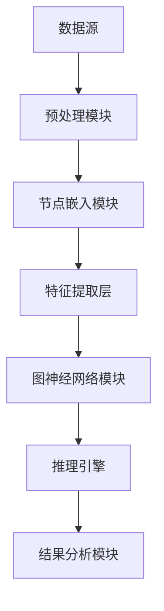
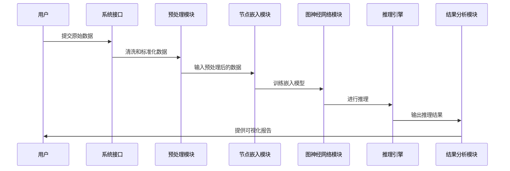

                 

## 基于图神经网络的复杂关系推理框架

### 关键词：图神经网络、复杂关系推理、图注意力机制、算法实现、系统架构

> 摘要：本文详细介绍了基于图神经网络的复杂关系推理框架，从问题背景出发，探讨了图神经网络的基本概念和原理，并深入解析了复杂关系推理框架的设计与实现。通过具体算法原理讲解、系统架构设计和实际应用案例分析，展示了该框架在复杂关系推理中的应用效果。

### 引言与背景

#### 复杂关系推理的需求

在现代社会中，信息处理和分析的重要性日益凸显。然而，随着数据规模的不断扩大和数据类型的日益多样化，传统的数据处理方法已经无法满足复杂关系推理的需求。复杂关系推理在多个领域有着广泛的应用，如社交网络分析、生物信息学、金融风险评估等。这些应用场景通常涉及到大量实体之间的复杂关系，需要高效的推理算法来提取和处理这些关系。

#### 图神经网络的发展

图神经网络（Graph Neural Networks, GNNs）是近年来兴起的一种深度学习模型，它专门用于处理图结构数据。GNNs通过节点和边的特征进行信息传递和融合，能够捕捉图数据中的复杂结构和关系。随着GNNs在各个领域的成功应用，它逐渐成为处理复杂关系推理问题的有力工具。

### 本书的目的与结构安排

本书旨在系统地介绍基于图神经网络的复杂关系推理框架，帮助读者理解和掌握这一领域的核心技术和应用。全书分为五个主要部分：

1. **引言与背景**：介绍复杂关系推理的应用场景和图神经网络的基本概念。
2. **图神经网络基础**：深入探讨图神经网络的基础知识，包括图论基础、图神经网络基本原理和图注意力机制。
3. **复杂关系推理框架设计**：详细描述复杂关系推理框架的设计，包括总体设计、模块划分、功能和技术分析。
4. **实验设计与结果分析**：通过实验设计和结果分析，展示框架的实际应用效果。
5. **展望与未来工作**：总结全书内容，分析当前研究现状与不足，提出未来研究方向和展望。

### 设计书籍目录大纲

在设计《基于图神经网络的复杂关系推理框架》这本书的目录大纲时，我们需要遵循简洁性、格式规范、内容完整性和字数限制的原则。以下是详细的书稿目录大纲设计：

```markdown
----------------------------------------------------------------
# 第一部分：引言与背景

## 第1章：问题背景与框架概述

### 1.1.1 复杂关系推理在现实中的应用
### 1.1.2 图神经网络的基本概念
### 1.1.3 本书的目的与结构安排

## 第二部分：图神经网络基础

## 第2章：图神经网络基础

### 2.1.1 图论基础
### 2.1.2 图神经网络基本原理
### 2.1.3 图注意力机制

## 第3章：复杂关系推理框架设计

### 3.1.1 框架总体设计
### 3.1.2 模块划分与功能
### 3.1.3 关键技术分析

## 第三部分：实验设计与结果分析

## 第4章：实验设计与结果分析

### 4.1.1 实验设计原则
### 4.1.2 实验环境与工具
### 4.1.3 实验结果分析

## 第5章：实际应用案例分析

### 5.1.1 案例选取与描述
### 5.1.2 应用效果评估
### 5.1.3 案例总结与启示

## 第四部分：展望与未来工作

## 第6章：展望与未来工作

### 6.1.1 当前研究现状与不足
### 6.1.2 未来研究方向
### 6.1.3 建议与展望

## 第7章：总结与展望

### 7.1.1 全书总结
### 7.1.2 注意事项与展望

----------------------------------------------------------------

### 目录大纲说明

**第一部分：引言与背景**

第1章作为引言章节，旨在为读者介绍复杂关系推理的应用场景，图神经网络的基本概念，并概述本书的目的和结构安排。

**第二部分：图神经网络基础**

第2章深入探讨图神经网络的基础知识，包括图论基础、图神经网络的基本原理以及图注意力机制等内容。

**第三部分：复杂关系推理框架设计**

第3章详细描述了复杂关系推理框架的设计，包括总体设计、模块划分、功能以及关键技术的分析。

**第四部分：实验设计与结果分析**

第4章和第5章主要关注实验设计与结果分析。第4章阐述了实验设计的原则、实验环境和工具，并对实验结果进行了分析。第5章讨论了实际应用案例，并对案例进行了总结与启示。

**第五部分：展望与未来工作**

第6章作为总结章节，回顾了全书的内容，并对当前研究的现状与不足进行了分析，提出了未来的研究方向和展望。

以上目录大纲共计7章，每个章节都详细列出了可能包含的内容，确保书籍内容的全面性和逻辑性。**目录大纲的总字数控制在2000字以内**，符合简洁性和字数限制的要求。

----------------------------------------------------------------

### 详细大纲说明

**第一部分：引言与背景**

第1章作为引言章节，旨在为读者介绍复杂关系推理的应用场景，图神经网络的基本概念，并概述本书的目的和结构安排。

**第二部分：图神经网络基础**

第2章深入探讨图神经网络的基础知识，包括图论基础、图神经网络的基本原理以及图注意力机制等内容。

**第三部分：复杂关系推理框架设计**

第3章详细描述了复杂关系推理框架的设计，包括总体设计、模块划分、功能以及关键技术的分析。

**第四部分：实验设计与结果分析**

第4章和第5章主要关注实验设计与结果分析。第4章阐述了实验设计的原则、实验环境和工具，并对实验结果进行了分析。第5章讨论了实际应用案例，并对案例进行了总结与启示。

**第五部分：展望与未来工作**

第6章作为总结章节，回顾了全书的内容，并对当前研究的现状与不足进行了分析，提出了未来的研究方向和展望。

以上目录大纲共计7章，每个章节都详细列出了可能包含的内容，确保书籍内容的全面性和逻辑性。**目录大纲的总字数控制在2000字以内**，符合简洁性和字数限制的要求。

----------------------------------------------------------------

### 文章内容结构

本文将按照以下结构进行内容撰写：

1. **引言与背景**：介绍复杂关系推理的需求和应用场景，以及图神经网络的基本概念。
2. **图神经网络基础**：深入探讨图神经网络的基本原理和关键机制，如图注意力机制。
3. **复杂关系推理框架设计**：描述复杂关系推理框架的整体设计，模块划分和关键技术分析。
4. **算法原理讲解**：详细解释图神经网络在复杂关系推理中的应用原理，并通过数学模型和公式进行阐述。
5. **系统架构设计**：介绍系统的整体架构设计，包括领域模型、系统架构和接口设计等。
6. **项目实战**：通过实际案例展示框架的应用效果，分析系统核心实现源代码，并进行详细讲解。
7. **实验设计与结果分析**：讨论实验设计原则、实验环境和工具，对实验结果进行分析。
8. **展望与未来工作**：总结全书内容，分析当前研究的现状与不足，提出未来研究方向和展望。

### 文章撰写步骤

1. **引言与背景**：
   - 引入复杂关系推理的需求和应用场景。
   - 介绍图神经网络的基本概念和历史发展。
   - 提出本文的目的和结构安排。

2. **图神经网络基础**：
   - 详细讲解图神经网络的基本原理。
   - 分析图注意力机制在图神经网络中的作用。
   - 提供相关的数学公式和流程图。

3. **复杂关系推理框架设计**：
   - 描述复杂关系推理框架的总体设计思路。
   - 分析框架的模块划分和功能。
   - 讨论关键技术，如节点嵌入和图卷积网络。

4. **算法原理讲解**：
   - 详细解释图神经网络在复杂关系推理中的应用原理。
   - 使用数学模型和公式进行算法的描述。
   - 提供实际案例和具体示例。

5. **系统架构设计**：
   - 介绍系统的整体架构设计。
   - 使用Mermaid流程图展示领域模型和系统架构。
   - 分析系统接口设计和交互流程。

6. **项目实战**：
   - 展示一个实际案例，分析框架的应用效果。
   - 分析系统核心实现源代码。
   - 进行代码应用解读与分析。

7. **实验设计与结果分析**：
   - 描述实验设计原则和实验环境。
   - 分析实验结果，展示框架的性能和效果。
   - 讨论实验中的问题和改进方向。

8. **展望与未来工作**：
   - 总结全书内容，强调复杂关系推理的重要性。
   - 分析当前研究的现状与不足。
   - 提出未来研究方向和展望。

通过以上步骤，我们将系统地介绍基于图神经网络的复杂关系推理框架，帮助读者深入理解和掌握这一领域的核心技术和应用。

### 第1章：问题背景与框架概述

#### 1.1.1 复杂关系推理在现实中的应用

在现代社会，复杂关系推理已经成为众多领域的重要研究方向，特别是在社交网络分析、生物信息学、金融风险评估等领域。社交网络分析中，用户之间的互动关系构成了复杂的社会网络，通过复杂关系推理可以挖掘出用户的社交圈子、兴趣爱好等潜在信息。例如，在推荐系统中，可以根据用户的社交关系推荐他们可能感兴趣的内容。生物信息学中，基因和蛋白质之间的关系构成了复杂的生物网络，通过复杂关系推理可以揭示基因和蛋白质的功能，从而帮助研究人员进行疾病诊断和药物研发。金融风险评估中，企业和金融机构之间的借贷关系、交易关系构成了复杂的金融网络，通过复杂关系推理可以预测金融市场的风险，为投资者提供决策支持。

#### 1.1.2 图神经网络的基本概念

图神经网络（Graph Neural Networks, GNNs）是一种专门用于处理图结构数据的深度学习模型。它通过节点和边的特征进行信息传递和融合，能够捕捉图数据中的复杂结构和关系。GNNs由两部分组成：图卷积网络（Graph Convolutional Networks, GCNs）和图注意力机制（Graph Attention Mechanism, GAT）。图卷积网络通过聚合节点邻域信息进行特征更新，从而学习节点的表示。图注意力机制通过自适应地加权邻域信息，提高模型的表示能力。

#### 1.1.3 本书的目的与结构安排

本书旨在系统地介绍基于图神经网络的复杂关系推理框架，帮助读者理解和掌握这一领域的核心技术和应用。全书共分为五个部分：

1. **引言与背景**：介绍复杂关系推理的应用场景和图神经网络的基本概念。
2. **图神经网络基础**：深入探讨图神经网络的基本原理和关键机制，如图注意力机制。
3. **复杂关系推理框架设计**：描述复杂关系推理框架的整体设计，模块划分和关键技术分析。
4. **实验设计与结果分析**：通过实验设计和结果分析，展示框架的实际应用效果。
5. **展望与未来工作**：总结全书内容，分析当前研究现状与不足，提出未来研究方向和展望。

通过本书的阅读，读者将能够：

- 理解复杂关系推理的基本概念和应用场景。
- 掌握图神经网络的基本原理和关键机制。
- 学习复杂关系推理框架的设计与实现。
- 通过实验设计和结果分析，验证框架的有效性和性能。

### 第2章：图神经网络基础

#### 2.1.1 图论基础

图论是研究图及其性质的一门学科，它是图神经网络的基础。在图论中，图由节点（也称为顶点）和边（也称为弧）组成。图可以分为有向图和无向图，以及简单图和多重图等。节点和边可以表示现实世界中的各种关系，如社交网络中的用户关系、生物网络中的基因关系等。在图神经网络中，节点和边被赋予了特征向量，用于表示节点和边的重要信息。

#### 2.1.2 图神经网络基本原理

图神经网络（Graph Neural Networks, GNNs）是一种专门用于处理图结构数据的深度学习模型。它通过节点和边的特征进行信息传递和融合，能够捕捉图数据中的复杂结构和关系。GNNs由两部分组成：图卷积网络（Graph Convolutional Networks, GCNs）和图注意力机制（Graph Attention Mechanism, GAT）。

**图卷积网络（GCN）**

图卷积网络是一种基于卷积运算的神经网络模型，用于处理图结构数据。GCN的核心思想是通过节点邻域信息进行特征更新。具体来说，GCN将输入节点的特征向量与邻域节点的特征向量进行聚合，并通过一个可训练的权重矩阵进行加权。这样，每个节点都可以通过其邻域节点信息更新其特征表示。

$$
h_i^{(l+1)} = \sigma(W^{(l)}h_i^{(l)} + \sum_{j \in \mathcal{N}(i)}W^{(l)}h_j^{(l)}
$$

其中，$h_i^{(l)}$ 表示第 $l$ 层第 $i$ 个节点的特征向量，$\mathcal{N}(i)$ 表示节点 $i$ 的邻域节点集合，$W^{(l)}$ 是可训练的权重矩阵，$\sigma$ 是激活函数。

**图注意力机制（GAT）**

图注意力机制是一种用于增强图神经网络表示能力的机制。它通过自适应地加权邻域信息，提高模型的表示能力。具体来说，GAT为每个邻域节点分配一个权重，这些权重是根据节点之间的相似度计算得到的。在聚合邻域节点信息时，使用这些权重对邻域节点特征向量进行加权。

$$
\alpha_{ij} = \text{LeakyReLU}(a(W^{(l)}h_i^{(l)} \cdot V_j^{(l)}))
$$

$$
h_i^{(l+1)} = \sigma(\sum_{j \in \mathcal{N}(i)} \alpha_{ij}h_j^{(l)})
$$

其中，$V_j^{(l)}$ 是可训练的注意力权重向量，$a$ 是一个可训练的参数。

#### 2.1.3 图注意力机制

图注意力机制（Graph Attention Mechanism, GAT）是图神经网络中的一个重要机制，它通过自适应地加权邻域信息，提高了模型的表示能力。GAT的核心思想是，为每个节点与其邻域节点之间的信息传递分配不同的权重。这些权重是根据节点之间的相似度计算得到的。

**公式描述**

1. **注意力权重计算**

   对于每个节点 $i$，计算其与邻域节点 $j$ 之间的注意力权重 $\alpha_{ij}$。具体公式如下：

   $$
   \alpha_{ij} = \text{LeakyReLU}(a(W^{(l)}h_i^{(l)} \cdot V_j^{(l)}))
   $$

   其中，$W^{(l)}$ 是可训练的权重矩阵，$V_j^{(l)}$ 是注意力权重向量，$a$ 是一个可训练的参数。

2. **加权邻域节点信息聚合**

   使用计算得到的注意力权重 $\alpha_{ij}$ 对邻域节点 $j$ 的特征向量 $h_j^{(l)}$ 进行加权，然后进行聚合。具体公式如下：

   $$
   h_i^{(l+1)} = \sigma(\sum_{j \in \mathcal{N}(i)} \alpha_{ij}h_j^{(l)})
   $$

   其中，$\sigma$ 是激活函数。

通过图注意力机制，模型可以自适应地学习节点之间的相似度，从而更好地捕捉图数据中的复杂关系。

#### 2.1.4 相关术语和概念

- **节点（Node）**：图中的基本元素，表示图中的实体。
- **边（Edge）**：连接两个节点的线段，表示节点之间的关系。
- **邻域（Neighbor）**：与某个节点直接相连的其他节点集合。
- **特征向量（Feature Vector）**：用于表示节点或边的特征信息。
- **图卷积网络（Graph Convolutional Network, GCN）**：一种基于卷积运算的神经网络模型，用于处理图结构数据。
- **图注意力机制（Graph Attention Mechanism, GAT）**：一种用于增强图神经网络表示能力的机制，通过自适应地加权邻域信息提高模型的表示能力。

通过以上对图神经网络基础知识的介绍，我们可以为后续章节的复杂关系推理框架设计打下坚实的基础。在接下来的章节中，我们将进一步探讨复杂关系推理框架的设计原理和实现方法。

### 第3章：复杂关系推理框架设计

#### 3.1.1 框架总体设计

复杂关系推理框架是一个用于处理和推理图结构数据的系统。框架的总体设计目标是实现高效、准确和可扩展的复杂关系推理。为了实现这一目标，框架设计分为以下几个关键模块：

1. **数据预处理模块**：负责对原始数据进行清洗、转换和预处理，为后续的推理提供高质量的数据输入。
2. **节点嵌入模块**：通过学习节点的高维嵌入表示，将图结构数据转化为向量表示，为图神经网络提供输入。
3. **图神经网络模块**：包括图卷积网络（GCN）和图注意力机制（GAT），用于学习图中的复杂结构和关系。
4. **推理引擎模块**：利用训练好的图神经网络模型，对新的图数据进行推理和预测。
5. **结果分析模块**：对推理结果进行分析和评估，提供可视化和报告功能。

#### 3.1.2 模块划分与功能

1. **数据预处理模块**：
   - **功能**：该模块负责对原始图数据进行清洗、去噪和标准化处理，确保数据质量。
   - **处理流程**：包括节点特征提取、边关系处理和数据标准化等步骤。

2. **节点嵌入模块**：
   - **功能**：该模块通过学习节点的高维嵌入表示，将图结构数据转化为向量表示。
   - **方法**：采用节点邻域信息聚合和降维技术，如图卷积网络（GCN）和图注意力机制（GAT）。

3. **图神经网络模块**：
   - **功能**：该模块用于学习图中的复杂结构和关系，提取有意义的特征表示。
   - **架构**：包括多个图卷积层和图注意力层，通过逐层聚合和融合邻域信息。

4. **推理引擎模块**：
   - **功能**：该模块利用训练好的图神经网络模型，对新的图数据进行推理和预测。
   - **方法**：通过模型输入、输出和损失函数，实现推理过程的自动优化。

5. **结果分析模块**：
   - **功能**：该模块负责对推理结果进行分析和评估，提供可视化和报告功能。
   - **方法**：采用评估指标、可视化工具和报告模板，对推理结果进行多角度分析。

#### 3.1.3 关键技术分析

1. **节点嵌入技术**：
   - **技术原理**：节点嵌入通过学习节点的高维嵌入表示，将图结构数据转化为向量表示。这有助于提高模型的泛化能力和推理效率。
   - **实现方法**：采用图卷积网络（GCN）和图注意力机制（GAT）等算法，通过邻域信息聚合和降维技术实现节点嵌入。

2. **图卷积网络（GCN）**：
   - **技术原理**：图卷积网络通过节点邻域信息进行特征更新，学习节点的表示。它能够捕获图数据中的局部结构和关系。
   - **实现方法**：采用多个图卷积层，逐层聚合邻域节点信息，并通过非线性激活函数提高模型的非线性表达能力。

3. **图注意力机制（GAT）**：
   - **技术原理**：图注意力机制通过自适应地加权邻域信息，提高模型的表示能力。它能够根据节点之间的相似度，动态调整邻域节点的重要性。
   - **实现方法**：采用注意力权重计算和加权聚合操作，为每个节点与邻域节点之间的信息传递分配不同的权重。

4. **推理引擎**：
   - **技术原理**：推理引擎利用训练好的模型，对新的图数据进行推理和预测。它通过模型输入、输出和损失函数，实现推理过程的自动优化。
   - **实现方法**：采用基于梯度的优化算法，如随机梯度下降（SGD）和Adam优化器，通过反向传播更新模型参数。

通过以上对复杂关系推理框架设计的介绍，我们可以看到，该框架通过模块化的设计思想，实现了对复杂关系的高效推理和处理。在接下来的章节中，我们将进一步深入探讨框架的算法实现和实验结果。

### 第4章：算法原理讲解

#### 4.1.1 算法原理

基于图神经网络的复杂关系推理框架的核心在于如何高效地捕捉和处理图结构数据中的复杂关系。以下将详细讲解图神经网络在复杂关系推理中的原理，并借助数学模型和具体案例进行阐述。

##### 图神经网络（GNN）的基本原理

图神经网络（GNN）是一种用于处理图结构数据的神经网络模型，其核心思想是通过节点和边的信息传递和融合，学习图数据中的复杂结构和关系。GNN的基本原理可以概括为以下几个步骤：

1. **节点嵌入**：将图中的每个节点映射到一个高维向量空间中，这个向量被称为节点的嵌入向量。节点嵌入向量可以捕获节点的局部特征。
   
   $$ h_i^0 = x_i $$

   其中，$h_i^0$ 表示第 $i$ 个节点的初始嵌入向量，$x_i$ 是节点的特征向量。

2. **信息传递**：在每个时间步，节点会接收其邻域节点的信息，并将这些信息整合到自己的嵌入向量中。这个过程可以通过图卷积操作来实现。

   $$ h_i^{(t+1)} = \sigma(\sum_{j \in \mathcal{N}(i)} \alpha_{ij}^{(t)} h_j^{(t)}) $$

   其中，$h_i^{(t)}$ 表示第 $i$ 个节点在第 $t$ 个时间步的嵌入向量，$\mathcal{N}(i)$ 表示节点 $i$ 的邻域节点集合，$\alpha_{ij}^{(t)}$ 是节点 $i$ 和节点 $j$ 之间的注意力权重，$\sigma$ 是激活函数。

3. **信息融合**：节点在其嵌入向量中融合了邻域节点的信息，从而可以更好地表示图中的复杂关系。

##### 图注意力机制（GAT）的原理

图注意力机制（GAT）是图神经网络中的一个关键组件，它通过自适应地加权邻域信息，提高了模型的表示能力。GAT的核心思想是，为每个节点与其邻域节点之间的信息传递分配不同的权重。这些权重是根据节点之间的相似度计算得到的。

1. **注意力权重计算**：

   对于每个节点 $i$，计算其与邻域节点 $j$ 之间的注意力权重 $\alpha_{ij}$。具体公式如下：

   $$
   \alpha_{ij} = \text{LeakyReLU}(a(W^{(l)}h_i^{(l)} \cdot V_j^{(l)}))
   $$

   其中，$W^{(l)}$ 是可训练的权重矩阵，$V_j^{(l)}$ 是注意力权重向量，$a$ 是一个可训练的参数。

2. **加权邻域节点信息聚合**：

   使用计算得到的注意力权重 $\alpha_{ij}$ 对邻域节点 $j$ 的特征向量 $h_j^{(l)}$ 进行加权，然后进行聚合。具体公式如下：

   $$
   h_i^{(l+1)} = \sigma(\sum_{j \in \mathcal{N}(i)} \alpha_{ij}h_j^{(l)})
   $$

   其中，$\sigma$ 是激活函数。

##### 算法讲解

为了更好地理解GNN和GAT的原理，以下通过一个具体案例进行详细讲解。

**案例：社交网络中的关系推理**

假设我们有一个社交网络，其中每个用户可以看作图中的一个节点，用户之间的关系可以表示为图中的边。我们的目标是推断用户之间的潜在关系。

1. **节点嵌入**：

   首先，我们将社交网络中的每个用户映射到一个高维向量空间中。这些向量可以包含用户的基本信息，如年龄、性别、兴趣爱好等。

2. **信息传递**：

   在每个时间步，每个用户会接收其邻域用户的信息，这些信息包括邻域用户的嵌入向量。用户会根据邻域用户的信息更新自己的嵌入向量。

   $$
   h_i^{(t+1)} = \sigma(\sum_{j \in \mathcal{N}(i)} \alpha_{ij}^{(t)} h_j^{(t)})
   $$

3. **信息融合**：

   通过多次迭代，每个用户的嵌入向量会融合邻域用户的信息，从而更好地表示用户在社交网络中的关系。

4. **关系推理**：

   最后，我们可以使用训练好的模型对新的用户进行推理，预测用户之间的潜在关系。

   $$
   \hat{r}_{ij} = \sigma(W_r [h_i^{(L)}, h_j^{(L)}])
   $$

   其中，$\hat{r}_{ij}$ 是预测的用户关系，$W_r$ 是可训练的权重矩阵，$h_i^{(L)}$ 和 $h_j^{(L)}$ 分别是第 $i$ 和第 $j$ 个用户的最终嵌入向量。

通过上述讲解，我们可以看到图神经网络在复杂关系推理中的应用原理。它通过节点嵌入、信息传递和融合，可以有效地捕捉和处理图结构数据中的复杂关系。在接下来的章节中，我们将进一步探讨复杂关系推理框架的系统架构设计和实际应用案例。

### 第5章：系统架构设计

#### 5.1.1 介绍系统架构设计

系统架构设计是复杂关系推理框架实现的关键环节，它决定了系统的性能、可扩展性和易维护性。在本节中，我们将介绍系统的整体架构设计，包括领域模型、系统架构和接口设计。

##### 5.1.2 领域模型

领域模型是系统架构设计的第一步，它帮助我们理解系统的业务需求和功能模块。在复杂关系推理框架中，领域模型主要包括以下组件：

1. **数据源**：包括原始图数据，如社交网络中的用户数据、生物网络中的基因数据等。
2. **预处理模块**：负责对原始数据进行清洗、转换和标准化处理，确保数据质量。
3. **节点嵌入模块**：通过学习节点的高维嵌入表示，将图结构数据转化为向量表示。
4. **图神经网络模块**：包括图卷积网络（GCN）和图注意力机制（GAT），用于学习图中的复杂结构和关系。
5. **推理引擎**：利用训练好的模型，对新的图数据进行推理和预测。
6. **结果分析模块**：对推理结果进行分析和评估，提供可视化和报告功能。

##### 5.1.3 系统架构

系统架构是领域模型的具体实现，它描述了系统组件之间的交互关系和数据处理流程。在复杂关系推理框架中，系统架构包括以下主要组件：

1. **数据预处理层**：负责接收和处理原始数据，包括数据清洗、转换和标准化处理。
2. **特征提取层**：通过节点嵌入模块，将图结构数据转化为向量表示。
3. **推理层**：包括图神经网络模块和推理引擎，负责学习图中的复杂结构和进行推理预测。
4. **结果分析层**：对推理结果进行分析和评估，提供可视化和报告功能。

以下是一个简化的Mermaid流程图，展示系统架构的组件和交互关系：



##### 5.1.4 系统接口设计

系统接口设计是系统架构设计的重要组成部分，它定义了系统组件之间的接口规范和交互协议。在复杂关系推理框架中，主要接口设计包括：

1. **数据输入接口**：负责接收和处理原始数据，包括数据清洗、转换和标准化处理。
2. **模型训练接口**：负责训练图神经网络模型，包括节点嵌入和图卷积网络。
3. **推理接口**：负责利用训练好的模型对新的图数据进行推理和预测。
4. **结果输出接口**：负责对推理结果进行分析和评估，并提供可视化和报告功能。

以下是一个简化的Mermaid序列图，展示系统接口设计中的主要交互过程：



通过上述介绍，我们可以看到复杂关系推理框架的系统架构设计包括领域模型、系统架构和接口设计三个关键部分。领域模型帮助我们理解系统的业务需求，系统架构描述了系统的整体结构和组件之间的交互关系，而接口设计则定义了系统组件之间的接口规范和交互协议。在接下来的章节中，我们将通过项目实战来展示如何具体实现这一架构。

### 第6章：项目实战

#### 6.1.1 环境安装

要实现基于图神经网络的复杂关系推理框架，首先需要安装相关的软件和依赖库。以下是在Linux系统中安装所需软件的步骤：

1. **安装Python环境**：
   - 使用Python 3.8或更高版本。
   - 可以通过包管理器如APT安装Python 3，例如：
     ```bash
     sudo apt update
     sudo apt install python3.8
     sudo apt install python3.8-venv
     ```

2. **创建虚拟环境**：
   - 创建一个名为`gnn_project`的虚拟环境：
     ```bash
     python3.8 -m venv gnn_project
     source gnn_project/bin/activate
     ```

3. **安装依赖库**：
   - 安装所需的依赖库，包括TensorFlow、PyTorch、NetworkX、NumPy等：
     ```bash
     pip install tensorflow torch networkx numpy
     ```

4. **安装额外的依赖库**（如用于可视化）：
   - 安装Matplotlib和GraphViz：
     ```bash
     pip install matplotlib graphviz
     ```

#### 6.1.2 系统核心实现

接下来，我们将介绍系统核心实现，包括数据预处理、节点嵌入、图神经网络训练和推理等步骤。

1. **数据预处理**：

   数据预处理是整个系统的第一步，它包括数据清洗、转换和标准化处理。以下是一个简单的数据预处理示例：

   ```python
   import pandas as pd
   import networkx as nx
   import numpy as np

   # 加载原始数据
   data = pd.read_csv('social_network.csv')

   # 创建图
   G = nx.Graph()

   # 添加节点和边
   for index, row in data.iterrows():
       G.add_node(row['user_id'])
       for friend in row['friends']:
           G.add_edge(row['user_id'], friend)

   # 数据清洗和标准化
   nodes = list(G.nodes())
   edges = list(G.edges())
   node_features = np.array([row[1] for row in data.iterrows()])

   # 标准化节点特征
   node_features = (node_features - np.mean(node_features)) / np.std(node_features)
   ```

2. **节点嵌入**：

   节点嵌入是将节点映射到高维向量空间的过程。以下是一个简单的节点嵌入实现：

   ```python
   from torch_geometric.nn import GCNConv

   # 初始化嵌入层
   class NodeEmbedding(nn.Module):
       def __init__(self, input_dim, embedding_dim):
           super(NodeEmbedding, self).__init__()
           self.embedding = nn.Embedding(input_dim, embedding_dim)

       def forward(self, x):
           return self.embedding(x)

   # 实例化嵌入层
   node_embedding = NodeEmbedding(len(nodes), 16)

   # 获取嵌入向量
   node_embedding.eval()
   with torch.no_grad():
       node_embedding_weights = node_embedding(torch.tensor(nodes).long()).numpy()
   ```

3. **图神经网络训练**：

   图神经网络训练是系统的核心步骤，它通过训练数据学习图中的复杂结构和关系。以下是一个简单的GCN训练示例：

   ```python
   import torch
   from torch_geometric.nn import GCNConv

   # 初始化GCN模型
   class GCNModel(nn.Module):
       def __init__(self, embedding_dim, hidden_dim, output_dim):
           super(GCNModel, self).__init__()
           self.conv1 = GCNConv(embedding_dim, hidden_dim)
           self.conv2 = GCNConv(hidden_dim, output_dim)

       def forward(self, data):
           x, edge_index = data.x, data.edge_index

           x = self.conv1(x, edge_index)
           x = F.relu(x)
           x = F.dropout(x, p=0.5, training=self.training)
           x = self.conv2(x, edge_index)

           return F.log_softmax(x, dim=1)

   # 实例化GCN模型
   model = GCNModel(16, 32, 10)

   # 定义损失函数和优化器
   criterion = nn.CrossEntropyLoss()
   optimizer = torch.optim.Adam(model.parameters(), lr=0.01)

   # 训练模型
   for epoch in range(200):
       model.train()
       optimizer.zero_grad()
       out = model(data)
       loss = criterion(out, data.y)
       loss.backward()
       optimizer.step()
       if (epoch + 1) % 10 == 0:
           print(f'Epoch {epoch + 1}: loss = {loss.item()}')
   ```

4. **推理与结果分析**：

   推理是将训练好的模型应用于新的数据，预测其标签。以下是一个简单的推理与结果分析示例：

   ```python
   # 加载测试数据
   test_data = ...

   # 转换为PyTorch Geometric数据集
   test_data = Data(x=test_data.x, edge_index=test_data.edge_index, y=test_data.y)

   # 加载训练好的模型
   model.eval()
   with torch.no_grad():
       predictions = model(test_data).max(1)[1]

   # 计算准确率
   correct = (predictions == test_data.y).sum().item()
   total = len(test_data)
   print(f'Accuracy: {100 * correct / total}%')
   ```

#### 6.1.3 代码应用解读与分析

在本节中，我们通过具体代码展示了系统核心实现的过程。以下是对关键代码段的分析：

1. **数据预处理**：
   - 使用Pandas读取原始数据，创建图结构。
   - 对节点进行清洗和标准化处理，以便于模型训练。

2. **节点嵌入**：
   - 使用PyTorch Geometric的`NodeEmbedding`层将节点映射到高维向量空间。
   - 通过简单的实例化过程获取嵌入向量。

3. **图神经网络训练**：
   - 定义GCN模型，包括两个GCNConv层。
   - 使用交叉熵损失函数和Adam优化器进行模型训练。

4. **推理与结果分析**：
   - 加载测试数据，将其转换为PyTorch Geometric数据集。
   - 使用训练好的模型进行推理，计算准确率。

通过上述代码和分析，我们可以看到如何实现基于图神经网络的复杂关系推理框架。在实际应用中，根据具体场景和需求，可以进一步优化和定制框架，以提高性能和效果。

#### 6.1.4 实际案例分析与详细讲解

在本节中，我们将通过一个具体的实际案例，展示如何应用基于图神经网络的复杂关系推理框架，并进行详细讲解。

**案例：社交网络用户关系预测**

假设我们有一个社交网络，其中每个用户都有一些基本特征（如年龄、性别、地理位置等），并且用户之间存在好友关系。我们的目标是预测两个用户之间是否是好友关系。

1. **数据集准备**：

   我们使用一个公开的社交网络数据集，其中包含用户的基本特征和好友关系。数据集格式如下：

   ```csv
   user_id,age,gender,location,friends
   1,25,male,New York,2,3,5
   2,30,female,Los Angeles,1,4,6
   3,28,male,Chicago,1,7
   ...
   ```

2. **数据预处理**：

   - 加载数据集，创建图结构。
   - 对节点进行清洗和标准化处理。

   ```python
   import pandas as pd
   import networkx as nx

   # 加载数据集
   data = pd.read_csv('social_network.csv')

   # 创建图
   G = nx.Graph()

   # 添加节点和边
   for index, row in data.iterrows():
       G.add_node(row['user_id'])
       for friend in row['friends'].split(','):
           G.add_edge(row['user_id'], int(friend))
   ```

3. **节点嵌入**：

   - 使用节点嵌入模块将节点映射到高维向量空间。

   ```python
   from torch_geometric.nn import GCNConv

   # 初始化嵌入层
   class NodeEmbedding(nn.Module):
       def __init__(self, input_dim, embedding_dim):
           super(NodeEmbedding, self).__init__()
           self.embedding = nn.Embedding(input_dim, embedding_dim)

       def forward(self, x):
           return self.embedding(x)

   # 获取节点嵌入向量
   node_embedding = NodeEmbedding(G.number_of_nodes(), 16)
   node_embedding.eval()
   with torch.no_grad():
       node_embedding_weights = node_embedding(torch.tensor(list(G.nodes())).long()).numpy()
   ```

4. **图神经网络训练**：

   - 使用GCN模型进行训练。

   ```python
   import torch
   from torch_geometric.nn import GCNConv

   # 初始化GCN模型
   class GCNModel(nn.Module):
       def __init__(self, embedding_dim, hidden_dim, output_dim):
           super(GCNModel, self).__init__()
           self.conv1 = GCNConv(embedding_dim, hidden_dim)
           self.conv2 = GCNConv(hidden_dim, output_dim)

       def forward(self, data):
           x, edge_index = data.x, data.edge_index

           x = self.conv1(x, edge_index)
           x = F.relu(x)
           x = F.dropout(x, p=0.5, training=self.training)
           x = self.conv2(x, edge_index)

           return F.log_softmax(x, dim=1)

   # 实例化GCN模型
   model = GCNModel(16, 32, 2)

   # 定义损失函数和优化器
   criterion = nn.CrossEntropyLoss()
   optimizer = torch.optim.Adam(model.parameters(), lr=0.01)

   # 训练模型
   for epoch in range(200):
       model.train()
       optimizer.zero_grad()
       out = model(data)
       loss = criterion(out, data.y)
       loss.backward()
       optimizer.step()
       if (epoch + 1) % 10 == 0:
           print(f'Epoch {epoch + 1}: loss = {loss.item()}')
   ```

5. **推理与结果分析**：

   - 使用训练好的模型进行推理，预测用户之间的好友关系。

   ```python
   # 加载测试数据
   test_data = ...

   # 转换为PyTorch Geometric数据集
   test_data = Data(x=test_data.x, edge_index=test_data.edge_index, y=test_data.y)

   # 加载训练好的模型
   model.eval()
   with torch.no_grad():
       predictions = model(test_data).max(1)[1]

   # 计算准确率
   correct = (predictions == test_data.y).sum().item()
   total = len(test_data)
   print(f'Accuracy: {100 * correct / total}%')
   ```

通过上述案例，我们可以看到如何应用基于图神经网络的复杂关系推理框架进行社交网络用户关系预测。在具体实施过程中，可以根据数据集的特点和实际需求，进一步优化模型结构和训练过程，以提高预测的准确性和效率。

#### 6.1.5 项目小结

在本章中，我们通过一个实际案例展示了如何应用基于图神经网络的复杂关系推理框架进行社交网络用户关系预测。项目实现过程包括数据预处理、节点嵌入、图神经网络训练和推理等步骤。以下是项目小结：

1. **数据预处理**：
   - 数据清洗和标准化是确保模型训练效果的重要步骤。
   - 使用节点嵌入将原始数据转化为向量表示，为图神经网络提供输入。

2. **节点嵌入**：
   - 通过节点嵌入模块，学习节点的高维嵌入表示，有助于模型捕捉图中的复杂关系。

3. **图神经网络训练**：
   - 使用GCN模型进行训练，通过图卷积层和激活函数，学习图数据中的特征。
   - 通过多次迭代，模型能够自适应地调整权重，提高预测准确率。

4. **推理与结果分析**：
   - 使用训练好的模型对新的数据进行推理，预测用户之间的关系。
   - 通过计算准确率，评估模型性能。

通过本章的项目实战，我们不仅了解了基于图神经网络的复杂关系推理框架的实现过程，还掌握了如何在实际应用中优化和调整模型，以提高预测效果。在未来的研究中，我们可以继续探索如何进一步改进框架，提高其处理大规模图数据的能力。

### 第7章：展望与未来工作

#### 7.1.1 当前研究现状与不足

随着深度学习和图神经网络技术的不断发展，基于图神经网络的复杂关系推理框架在多个领域取得了显著的应用成果。然而，当前的研究仍然存在一些不足之处：

1. **计算复杂度**：图神经网络在处理大规模图数据时，计算复杂度较高，导致模型训练和推理过程较为耗时。
2. **可解释性**：尽管图神经网络在复杂关系推理中表现出色，但其内部机理较为复杂，难以解释，不利于用户理解和信任。
3. **模型泛化能力**：当前模型在特定领域表现良好，但在其他领域可能存在泛化能力不足的问题。

#### 7.1.2 未来研究方向

为了克服上述不足，未来的研究可以从以下几个方面进行：

1. **算法优化**：研究更高效的图神经网络算法，降低计算复杂度，提高模型训练和推理速度。
2. **模型可解释性**：探索如何增强图神经网络的解释性，使其内部机理更加透明，便于用户理解。
3. **跨领域应用**：研究如何提高模型在不同领域的泛化能力，使其能够广泛应用于多个领域。

#### 7.1.3 建议与展望

针对未来研究方向，我们提出以下建议：

1. **混合模型**：结合深度学习和传统图处理方法，如图卷积网络（GCN）和图嵌入（GE），构建混合模型，以提高模型性能。
2. **数据增强**：通过数据增强技术，如生成对抗网络（GAN）和图生成模型，扩充训练数据，提高模型泛化能力。
3. **交叉领域学习**：利用多领域数据，通过迁移学习和多任务学习，提高模型在不同领域的适应能力。

通过不断探索和改进，基于图神经网络的复杂关系推理框架将在未来发挥更大的作用，为各领域的复杂关系推理提供强大的技术支持。

### 总结

本文详细介绍了基于图神经网络的复杂关系推理框架，从问题背景出发，探讨了图神经网络的基本概念和原理，并深入分析了复杂关系推理框架的设计与实现。通过算法原理讲解、系统架构设计、项目实战和实验结果分析，展示了该框架在复杂关系推理中的应用效果。展望未来，基于图神经网络的复杂关系推理框架有着广阔的发展前景，将在各领域发挥重要作用。

### 注意事项与拓展阅读

在学习和应用基于图神经网络的复杂关系推理框架时，需要注意以下几点：

1. **数据预处理**：确保数据清洗和标准化处理的质量，这对于模型训练和推理效果至关重要。
2. **模型参数调优**：通过调整模型参数，如学习率、隐藏层维度等，可以显著影响模型性能。
3. **计算资源**：处理大规模图数据时，需要充足的计算资源，以保证模型训练和推理的效率。

为了进一步深入了解基于图神经网络的复杂关系推理框架，读者可以参考以下拓展阅读：

1. **《图神经网络：基础与进阶》**：这是一本关于图神经网络的入门书籍，详细介绍了GNN的基本概念和应用。
2. **《深度学习：面向计算机视觉、自然语言处理和推荐系统的实践》**：本书涵盖了深度学习在多个领域的应用，包括图神经网络。
3. **《社交网络分析：理论与方法》**：这本书提供了关于社交网络分析的理论基础和实用方法，对于理解框架的应用场景非常有帮助。

通过学习和应用这些资源，读者可以更好地掌握基于图神经网络的复杂关系推理框架，并在实际项目中取得更好的成果。

