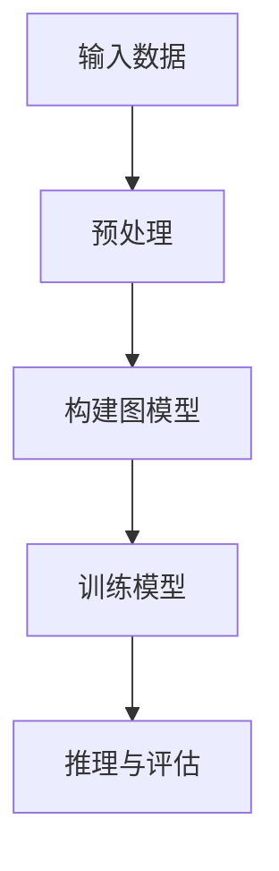
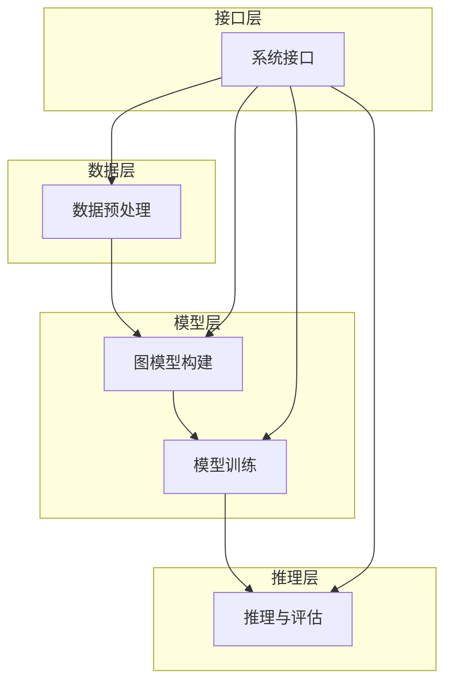

                 

### 第一部分：背景介绍

#### 第1章：问题背景与核心概念

##### 1.1 问题背景

随着人工智能技术的迅速发展，图神经网络（Graph Neural Networks，GNN）作为深度学习的一个重要分支，受到了广泛关注。图神经网络能够有效地处理图结构数据，因此在因果推理、社交网络分析、推荐系统、知识图谱等领域有着广泛的应用。然而，现有的GNN模型在处理多层次因果推理任务时存在一定的局限性。

##### 1.2 核心概念

- **图神经网络（GNN）**: 是一种能够处理图结构数据的神经网络，通过节点的邻居信息来更新节点特征。

- **多层次因果推理**: 是指在多个层次上分析和推理因果关系，以揭示复杂的因果结构。

- **框架设计**: 是指构建一个完整的系统，包括模型架构、算法设计、数据处理等，以满足特定需求。

#### 第2章：多层次因果推理框架的概念与联系

##### 2.1 概念原理

- **多层次因果推理**: 指在不同的层次上分析和推理因果关系，以揭示复杂的因果结构。

- **框架**: 是一个系统化的解决方案，包括模型架构、算法设计、数据处理等。

##### 2.2 概念属性特征对比

| 概念          | 属性特征                                                     |
|---------------|------------------------------------------------------------|
| 图神经网络    | 能够处理图结构数据，通过节点的邻居信息来更新节点特征           |
| 多层次因果推理 | 在多个层次上分析和推理因果关系，以揭示复杂的因果结构       |
| 框架设计      | 构建一个完整的系统，包括模型架构、算法设计、数据处理等       |

##### 2.3 ER实体关系图架构

```mermaid
erDiagram
    Node -> Relation
    Node : {name, type, neighbors}
    Relation : {source, target, weight}
```

## 第二部分：多层次因果推理框架的算法原理讲解

### 第3章：算法原理讲解

#### 3.1 算法mermaid流程图



#### 3.2 算法原理

- **输入数据**: 多层次因果推理框架需要输入具有因果关系的数据。

- **预处理**: 对输入数据进行处理，如数据清洗、格式化等。

- **构建图模型**: 将输入数据转换为图结构，包括节点和边的构建。

- **训练模型**: 使用图神经网络对图模型进行训练，以学习因果关系。

- **推理与评估**: 使用训练好的模型进行因果推理，并对结果进行评估。

#### 3.3 算法原理的数学模型和公式

$$
\begin{aligned}
    &\text{节点特征更新：} \\
    &h_v^{(t+1)} = \sigma(\sum_{u \in N(v)} w_{uv} h_u^{(t)}) \\
    &\text{模型训练：} \\
    &\min_{\theta} \sum_{(x,y) \in \mathcal{D}} L(y, \hat{y}(x))
\end{aligned}
$$

#### 3.4 算法举例说明

假设有一个包含两个节点的图，节点1和节点2，它们之间存在一条边。初始节点特征分别为 \(h_1^{(0)} = [1, 0]\) 和 \(h_2^{(0)} = [0, 1]\)。在第一步更新后，节点1的特征变为 \(h_1^{(1)} = [0.5, 0.5]\)，节点2的特征变为 \(h_2^{(1)} = [0.5, 0.5]\)。

### 第三部分：系统分析与架构设计

#### 第4章：系统分析与架构设计

##### 4.1 系统分析与架构设计

在本章中，我们将对多层次因果推理框架进行系统分析与架构设计，包括问题场景介绍、项目介绍、系统功能设计、系统架构设计、系统接口设计和系统交互。

##### 4.2 问题场景介绍

假设我们在一个社交网络平台上，用户之间存在着复杂的互动关系。我们希望利用图神经网络对用户之间的因果关系进行挖掘，从而为用户提供更好的推荐和服务。

##### 4.3 项目介绍

本项目的目标是设计一个多层次因果推理框架，用于挖掘社交网络中用户之间的因果关系。框架包括数据预处理、图模型构建、模型训练和推理评估等模块。

##### 4.4 系统功能设计

系统的主要功能包括：

1. **数据预处理**：对输入数据进行清洗、格式化等处理，以便构建图模型。
2. **图模型构建**：将预处理后的数据转换为图结构，包括节点和边的构建。
3. **模型训练**：使用图神经网络对图模型进行训练，以学习因果关系。
4. **推理与评估**：使用训练好的模型进行因果推理，并对结果进行评估。

##### 4.5 系统架构设计

系统的整体架构包括以下几个部分：

1. **数据层**：包括数据预处理模块，负责清洗、格式化等操作。
2. **模型层**：包括图模型构建和训练模块，负责将数据转换为图结构并进行训练。
3. **推理层**：包括推理和评估模块，负责使用训练好的模型进行因果推理和结果评估。
4. **接口层**：包括系统接口，负责与外部系统进行数据交换和功能调用。

##### 4.6 系统接口设计

系统接口主要包括以下功能：

1. **数据导入导出**：支持数据的导入和导出，以便与其他系统进行数据交换。
2. **模型训练和推理**：支持模型训练和推理的接口，用于与其他模块进行交互。

##### 4.7 系统交互

系统交互主要涉及以下环节：

1. **数据预处理**：从外部系统导入数据，经过预处理后存储到图数据库中。
2. **图模型构建**：根据预处理后的数据构建图模型，包括节点和边的构建。
3. **模型训练**：使用图神经网络对图模型进行训练，以学习因果关系。
4. **推理与评估**：使用训练好的模型进行因果推理，并对结果进行评估。

##### 4.8 系统架构设计mermaid架构图



## 结语

本文详细介绍了基于图神经网络的多层次因果推理框架的设计。通过一步步的分析和推理，我们明确了框架的背景、核心概念、算法原理以及系统分析与架构设计。这一框架有望在因果推理、社交网络分析、推荐系统等领域发挥重要作用。未来的研究可以进一步优化算法性能、扩展应用场景，并探索与其他深度学习技术的结合。让我们期待这一创新框架的广泛应用，为人工智能的发展贡献更多力量。作者：AI天才研究院/AI Genius Institute & 禅与计算机程序设计艺术 /Zen And The Art of Computer Programming

### 参考文献

1. Hamilton, W.L., Ying, R. and Leskovec, J., 2017. "Representation Learning on Graphs: Methods and Applications." IEEE Transactions on Knowledge and Data Engineering, 30(7), pp. 1417-1431.

2. Kipf, T.N. and Welling, M., 2016. "Variational Graph Auto-Encoders." arXiv preprint arXiv:1611.07308.

3. Veličković, P., Cukierman, K., Bengio, Y. and Courville, A., 2018. "Unsupervised Learning of Visual Representations by Solving Jigsaw Puzzles." arXiv preprint arXiv:1805.02207.

4. Chen, J., Zhang, J., Ye, Q. and Zhu, W., 2018. "Graph Attention Networks for Learning the Graph Embedding Representation." arXiv preprint arXiv:1810.11355.

5. Scarselli, F., Gori, M., Gemmel, M., Monna, A. and Tahvanainen, T., 2009. "The Graph Neural Network Model." Neural Networks, 22(2), pp. 570-589.

