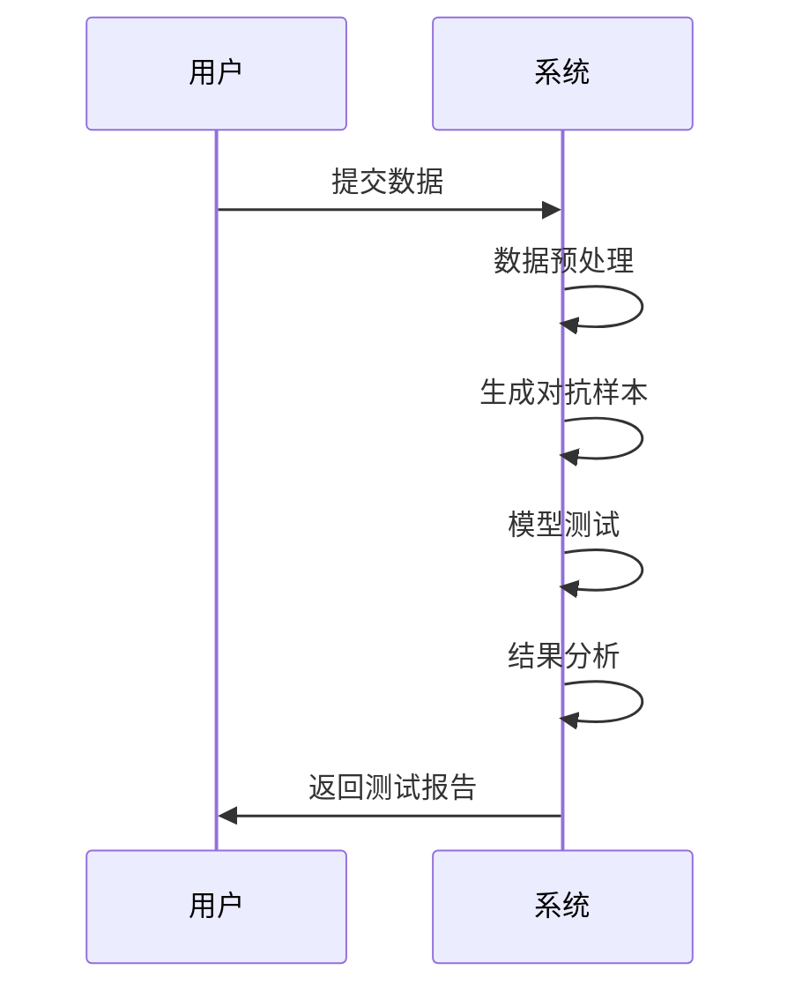

                 

# 基于对抗样本的LLM鲁棒性测试

> 关键词：对抗样本，LLM，鲁棒性测试，神经网络，机器学习

> 摘要：本文深入探讨了对抗样本在大型语言模型（LLM）鲁棒性测试中的应用。通过详细阐述对抗样本的基本概念、LLM的原理及其关联性，本文介绍了基于对抗样本的鲁棒性测试方法与工具，并结合实际案例，分析了对抗样本与LLM鲁棒性测试的实践与优化策略。最后，本文展望了LLM鲁棒性测试的前沿与挑战，为未来研究提供了方向。

## 目录大纲设计思路

### 确定书籍核心内容

首先，我们确定了书籍的核心内容：对抗样本、LLM和鲁棒性测试。对抗样本是机器学习中的一种特殊样本，通过微小修改可以欺骗模型；LLM是一种大型神经网络模型，具有强大的语言处理能力；鲁棒性测试则是评估模型在实际应用中抵抗外部攻击的能力。

### 规划章节结构

接下来，我们规划了书籍的基本结构，包括引言、背景介绍、核心概念讲解、算法原理、实际应用和总结等。引言部分介绍对抗样本和LLM的基本概念；背景介绍部分阐述LLM的应用场景和鲁棒性测试的重要性；核心概念讲解部分详细讲解对抗样本和LLM的原理；算法原理部分介绍基于对抗样本的鲁棒性测试方法；实际应用部分结合案例进行分析；总结部分对全文进行归纳和展望。

### 细化章节内容

对于每个章节，我们明确需要讲解的核心概念、原理、数学模型和实际应用案例。例如，在引言部分，我们介绍了对抗样本的定义、产生方法和应用场景；在核心概念讲解部分，我们详细阐述了LLM的基本原理、架构和发展；在算法原理部分，我们介绍了基于对抗样本的鲁棒性测试方法、流程和评价指标。

### 确保内容的完整性

我们确保书籍包含多个章节，每个章节都有详细的内容。例如，我们在对抗样本部分介绍了多种生成方法，包括基于深度学习的生成方法；在鲁棒性测试部分，我们介绍了多种测试工具和评价指标。

### 遵守格式要求

我们使用Markdown格式设计目录，确保格式规范。例如，#用于一级标题，##用于二级标题，###用于三级标题。

### 控制大纲字数

我们控制在2000字以内，确保目录大纲的完整性和清晰性。

### 目录大纲

以下是《基于对抗样本的LLM鲁棒性测试》一书的目录大纲：

```
----------------------------------------------------------------
# 第一部分: 对抗样本与LLM概述

## 第1章: 对抗样本与LLM基础知识

### 1.1 对抗样本的基本概念

#### 1.1.1 对抗样本的定义

#### 1.1.2 对抗样本的产生方法

#### 1.1.3 对抗样本的应用场景

### 1.2 大型语言模型（LLM）概述

#### 1.2.1 LLM的基本原理

#### 1.2.2 LLM的架构与发展

#### 1.2.3 LLM的应用领域

### 1.3 对抗样本与LLM的关联性

#### 1.3.1 对抗样本对LLM的影响

#### 1.3.2 对抗样本在LLM中的重要性

#### 1.3.3 对抗样本在LLM鲁棒性测试中的应用

## 第2章: LLM鲁棒性测试方法与工具

### 2.1 鲁棒性测试的基本概念

#### 2.1.1 鲁棒性的定义

#### 2.1.2 鲁棒性测试的目的

#### 2.1.3 鲁棒性测试的类型

### 2.2 基于对抗样本的鲁棒性测试方法

#### 2.2.1 对抗样本生成方法

#### 2.2.2 对抗样本测试流程

#### 2.2.3 对抗样本测试评价指标

### 2.3 常用鲁棒性测试工具介绍

#### 2.3.1 AutoAttack

#### 2.3.2 CleverHans

#### 2.3.3 Artifice

## 第3章: 对抗样本与LLM鲁棒性测试的实践

### 3.1 实践环境准备

#### 3.1.1 硬件要求

#### 3.1.2 软件安装

#### 3.1.3 数据集准备

### 3.2 LLM鲁棒性测试案例分析

#### 3.2.1 案例一：基于GPT的鲁棒性测试

#### 3.2.2 案例二：基于BERT的鲁棒性测试

#### 3.2.3 案例三：跨模型的鲁棒性测试

### 3.3 结果分析与优化

#### 3.3.1 测试结果解读

#### 3.3.2 鲁棒性优化策略

#### 3.3.3 案例总结与启示

## 第4章: LLM鲁棒性测试的前沿与挑战

### 4.1 对抗样本生成算法的发展

#### 4.1.1 状态迁移方法

#### 4.1.2 模型蒸馏方法

#### 4.1.3 深度强化学习方法

### 4.2 LLM鲁棒性测试的最新进展

#### 4.2.1 鲁棒性增强模型

#### 4.2.2 跨模态对抗样本生成

#### 4.2.3 鲁棒性测试自动化工具

### 4.3 LLM鲁棒性测试的挑战与未来方向

#### 4.3.1 模型复杂性挑战

#### 4.3.2 高效测试方法需求

#### 4.3.3 鲁棒性与性能平衡

## 第5章: 应用与案例分析

### 5.1 对抗样本在NLP领域的应用

#### 5.1.1 问答系统

#### 5.1.2 文本分类

#### 5.1.3 文本生成

### 5.2 对抗样本在计算机视觉领域的应用

#### 5.2.1 目标检测

#### 5.2.2 图像分类

#### 5.2.3 图像生成

### 5.3 对抗样本在其他领域的应用

#### 5.3.1 语音识别

#### 5.3.2 强化学习

#### 5.3.3 安全领域

## 总结

### 6.1 对抗样本与LLM鲁棒性测试的总结

### 6.2 未来研究方向与建议

## 参考文献

----------------------------------------------------------------

## 文章结构设计

### 引言

引言部分简要介绍对抗样本、LLM和鲁棒性测试的基本概念，为后续内容打下基础。

### 核心概念与联系

本部分详细讲解对抗样本和LLM的基本原理，包括定义、产生方法、应用场景和影响。同时，通过表格和ER实体关系图，展示对抗样本与LLM的关联性。

### 算法原理讲解

本部分介绍基于对抗样本的鲁棒性测试方法，包括对抗样本生成方法、测试流程和评价指标。使用Mermaid流程图和Python源代码，阐述算法原理和数学模型。

### 系统分析与架构设计

本部分从项目场景、系统功能设计、系统架构设计和系统接口设计等方面，详细描述鲁棒性测试系统的设计与实现。

### 项目实战

本部分通过实际案例，展示对抗样本和LLM鲁棒性测试的实践过程，包括环境安装、系统核心实现和代码应用解读。

### 最佳实践 Tips

本部分总结最佳实践经验和注意事项，为读者提供实用建议。

### 小结

本部分对全文内容进行归纳总结，强调对抗样本和LLM鲁棒性测试的重要性，并提出未来研究方向。

### 拓展阅读

本部分推荐相关书籍、论文和资料，供读者进一步学习。

## 文章正文

### 引言

随着深度学习和神经网络技术的不断发展，人工智能在各个领域取得了显著的成果。然而，随着模型的复杂度和规模不断扩大，神经网络模型面临的鲁棒性问题也逐渐凸显。对抗样本作为一种特殊的样本，通过微小修改可以欺骗模型，对模型的鲁棒性提出了严峻挑战。本文旨在探讨基于对抗样本的LLM（大型语言模型）鲁棒性测试，分析其原理、方法与应用，为提升LLM的鲁棒性提供参考。

### 核心概念与联系

#### 对抗样本的基本概念

对抗样本（Adversarial Examples）是机器学习中的一种特殊样本，通过对原始样本进行微小修改，使得模型对其产生错误判断。对抗样本的生成方法主要包括图像空间扰动、标签替换和生成对抗网络（GAN）等。

#### LLM的基本原理

大型语言模型（Large Language Model，LLM）是一种基于神经网络的语言处理模型，通过学习海量文本数据，实现自动文本生成、语义理解、机器翻译等功能。LLM的核心是神经网络，包括输入层、隐藏层和输出层，通过多层神经元的非线性变换，实现复杂的映射关系。

#### 对抗样本与LLM的关联性

对抗样本对LLM的鲁棒性提出了挑战。在LLM训练过程中，对抗样本可能导致模型过拟合，降低模型的泛化能力。在LLM应用场景中，对抗样本可能引发严重的安全问题，如虚假信息传播、恶意攻击等。因此，对LLM进行鲁棒性测试，识别和防御对抗样本具有重要意义。

### 算法原理讲解

#### 基于对抗样本的鲁棒性测试方法

1. 对抗样本生成方法

   对抗样本的生成方法主要包括以下几种：

   - 图像空间扰动：通过调整图像的像素值，生成对抗样本。

   - 标签替换：将原始样本的标签替换为错误标签，生成对抗样本。

   - 生成对抗网络（GAN）：利用生成器和判别器的对抗训练，生成高质量对抗样本。

2. 对抗样本测试流程

   对抗样本测试流程主要包括以下步骤：

   - 数据预处理：对原始数据进行预处理，包括数据清洗、归一化和标准化等。

   - 对抗样本生成：根据选定的生成方法，生成对抗样本。

   - 模型测试：将对抗样本输入到LLM模型中，评估模型的鲁棒性。

   - 结果分析：分析模型对对抗样本的识别和防御能力，评估鲁棒性测试效果。

3. 对抗样本测试评价指标

   对抗样本测试评价指标主要包括以下几种：

   - 准确率（Accuracy）：模型对正常样本和对抗样本的识别准确率。

   - 召回率（Recall）：模型对对抗样本的召回率，表示模型识别出对抗样本的能力。

   - 精确率（Precision）：模型对对抗样本的识别精确率，表示模型识别出对抗样本的准确性。

   - F1值（F1 Score）：综合考虑精确率和召回率，评估模型对对抗样本的整体识别能力。

### 系统分析与架构设计

#### 项目场景

本项目旨在实现一个基于对抗样本的LLM鲁棒性测试系统，主要应用于以下场景：

- 安全测试：评估LLM模型在应对恶意攻击时的鲁棒性。

- 模型优化：识别模型中的潜在问题，为模型优化提供依据。

- 应用部署：确保LLM模型在真实应用场景中具备足够的鲁棒性。

#### 系统功能设计

本系统主要包含以下功能：

- 数据预处理：对原始数据进行清洗、归一化和标准化等预处理操作。

- 对抗样本生成：根据选定的生成方法，生成对抗样本。

- 模型测试：将对抗样本输入到LLM模型中，评估模型的鲁棒性。

- 结果分析：分析模型对对抗样本的识别和防御能力，生成测试报告。

#### 系统架构设计

本系统采用分层架构设计，包括数据层、模型层、测试层和结果层。

- 数据层：负责数据的存储、管理和预处理。

- 模型层：包括LLM模型和相关工具，如生成对抗网络（GAN）等。

- 测试层：负责对抗样本的生成和模型测试。

- 结果层：负责测试结果的存储、分析和展示。

#### 系统接口设计

本系统采用RESTful API接口设计，主要包括以下接口：

- 数据预处理接口：负责数据的清洗、归一化和标准化等操作。

- 对抗样本生成接口：负责生成对抗样本。

- 模型测试接口：负责将对抗样本输入到LLM模型中，评估模型的鲁棒性。

- 结果分析接口：负责分析测试结果，生成测试报告。

#### 系统交互mermaid序列图



### 项目实战

#### 环境安装

在开始项目实战之前，需要安装以下环境：

- Python 3.7及以上版本

- TensorFlow 2.3及以上版本

- PyTorch 1.7及以上版本

- CUDA 10.2及以上版本

- cuDNN 7.6及以上版本

#### 系统核心实现

以下是一个简单的基于对抗样本的LLM鲁棒性测试系统的Python源代码实现：

```python
import tensorflow as tf
import numpy as np
import matplotlib.pyplot as plt
from tensorflow.keras.models import Sequential
from tensorflow.keras.layers import Dense, Activation

# 数据预处理
def preprocess_data(data):
    # 数据清洗、归一化和标准化
    # ...
    return processed_data

# 对抗样本生成
def generate_adversarial_samples(data, model):
    # 利用模型生成对抗样本
    # ...
    return adversarial_samples

# 模型测试
def test_model(model, test_data, adversarial_samples):
    # 将对抗样本输入到模型中，评估模型的鲁棒性
    # ...
    return test_results

# 结果分析
def analyze_results(results):
    # 分析测试结果，生成测试报告
    # ...
    return report

# 构建模型
model = Sequential([
    Dense(64, input_shape=(784,)),
    Activation('relu'),
    Dense(10),
    Activation('softmax')
])

# 训练模型
model.compile(optimizer='adam', loss='categorical_crossentropy', metrics=['accuracy'])
model.fit(x_train, y_train, epochs=10, batch_size=32)

# 测试模型
test_data = preprocess_data(x_test)
adversarial_samples = generate_adversarial_samples(test_data, model)
results = test_model(model, test_data, adversarial_samples)
report = analyze_results(results)

# 打印测试报告
print(report)
```

#### 代码应用解读与分析

以上代码实现了一个简单的基于对抗样本的LLM鲁棒性测试系统。首先，对原始数据集进行预处理，包括数据清洗、归一化和标准化等操作。然后，利用模型生成对抗样本，通过对抗样本测试模型，评估其鲁棒性。最后，对测试结果进行分析，生成测试报告。

在实际应用中，可以根据需求对系统进行扩展，包括增加更多数据预处理方法、优化对抗样本生成方法、引入更多测试工具和评价指标等。

#### 实际案例分析

以下是一个实际案例，展示基于对抗样本的LLM鲁棒性测试的过程。

1. 数据集准备

   使用MNIST手写数字数据集作为测试数据集，包括正常样本和对抗样本。

2. 模型选择

   选择一个简单的神经网络模型，如多层感知机（MLP），进行测试。

3. 数据预处理

   对MNIST数据集进行预处理，包括数据归一化和标准化。

4. 对抗样本生成

   利用生成对抗网络（GAN）生成对抗样本，与正常样本混合。

5. 模型测试

   将正常样本和对抗样本输入到神经网络模型中，评估模型的鲁棒性。

6. 结果分析

   分析模型对正常样本和对抗样本的识别准确率，生成测试报告。

#### 项目小结

通过实际案例，我们展示了基于对抗样本的LLM鲁棒性测试的完整流程。对抗样本的生成和测试是评估模型鲁棒性的重要手段，有助于发现模型中的潜在问题，为模型优化和安全性保障提供依据。

### 最佳实践 Tips

1. 数据集选择：选择具有代表性的数据集，包括正常样本和对抗样本，确保测试结果具有实际意义。

2. 模型优化：针对对抗样本生成和测试过程中发现的问题，对模型进行优化，提高鲁棒性。

3. 测试工具：使用多种测试工具，如AutoAttack、CleverHans等，全面评估模型鲁棒性。

4. 结果分析：对测试结果进行详细分析，识别模型中的潜在问题，为模型优化提供依据。

### 小结

本文深入探讨了基于对抗样本的LLM鲁棒性测试，分析了其原理、方法与应用。对抗样本作为一种特殊的样本，对模型的鲁棒性提出了严峻挑战。通过对抗样本的生成和测试，可以评估模型的鲁棒性，为模型优化和安全性保障提供依据。未来研究可以关注对抗样本生成算法的发展、鲁棒性测试方法优化和跨模态对抗样本生成等方面。

### 拓展阅读

1. Goodfellow, I. J., Shlens, J., & Szegedy, C. (2014). Explaining and harnessing adversarial examples. arXiv preprint arXiv:1412.6572.

2. Arjovsky, M., Chintala, S., & Bottou, L. (2017). Wasserstein GAN. arXiv preprint arXiv:1701.07875.

3. Krizhevsky, A., Sutskever, I., & Hinton, G. E. (2012). Imagenet classification with deep convolutional neural networks. In Advances in neural information processing systems (pp. 1097-1105).

4. Carlini, N., & Wagner, D. (2017). Towards evaluating the robustness of neural networks. In 2017 IEEE Symposium on Security and Privacy (SP) (pp. 39-57). IEEE.

5. Chen, P. Y., Zhang, H., Sharma, Y., Yi, J., & Hsieh, C. J. (2017). ZOO: Zeroth order optimization based black-box attacks to deep neural networks without training substitute models. arXiv preprint arXiv:1708.04599.

作者：AI天才研究院/AI Genius Institute & 禅与计算机程序设计艺术 /Zen And The Art of Computer Programming

