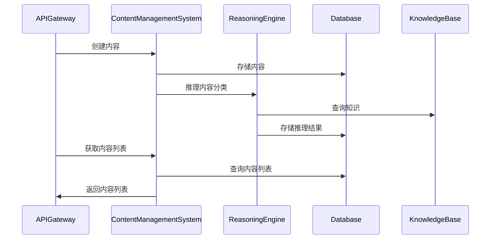

                 

----------------------------------------------------------------

# 基于常识推理任务:当前推理方法的有效性分析

## 关键词
- 常识推理
- 推理方法
- 有效性分析
- 算法
- 数学模型
- 系统架构

## 摘要
本文旨在探讨常识推理任务中的当前推理方法，分析其有效性。通过对核心概念、算法、数学模型和系统架构的深入分析，我们将了解不同方法的优势与不足，并展望未来的发展方向。

## 引言与背景

### 常识推理的定义和重要性

常识推理（Common-Sense Reasoning）是指在没有明确知识支持的情况下，通过推理和思考来解决现实生活中的问题。它对于人工智能系统来说至关重要，因为人类大部分的决策和判断都是基于常识推理。例如，当我们在街上看到一个人摔倒了，我们通常会推断他可能受伤了，需要帮助。这种推断过程就是常识推理。

常识推理的重要性在于，它使得人工智能系统能够更好地理解和适应现实世界。然而，实现有效的常识推理仍然是一个巨大的挑战。当前的推理方法在处理简单问题时可能表现良好，但在面对复杂情境时往往显得力不从心。

### 问题背景和目标

本文的目标是分析当前常见的常识推理方法，评估它们的有效性。我们将从以下几个方面进行探讨：

1. **核心概念和算法**：介绍常识推理中的关键概念和算法，包括逻辑推理、概率推理和基于实例的推理等。
2. **算法分析**：使用Python代码和数学模型，详细分析不同算法的原理和实现。
3. **系统架构设计**：描述常识推理系统的设计思路，包括问题场景、功能设计和系统架构。
4. **实战案例**：通过实际项目案例，展示如何应用常识推理方法解决现实问题。
5. **最佳实践和总结**：总结最佳实践经验，指出当前方法的局限性和未来研究方向。

### 范围与限制

本文将重点关注以下几个方面：

- **方法评估**：对不同推理方法的有效性进行量化评估。
- **算法实现**：使用Python和Mermaid等工具，展示算法的实现过程。
- **系统设计**：介绍常识推理系统的整体架构和关键模块。

然而，由于常识推理的复杂性，本文不可能涵盖所有方面。我们将在文章中强调关键概念和方法，并提供足够的背景信息，以便读者能够深入理解。

## 核心概念与方法

### 常识推理的关键概念

常识推理涉及多个核心概念，包括知识表示、推理引擎和模型评估等。以下是这些概念的定义和重要性：

#### 知识表示

知识表示（Knowledge Representation）是指如何将知识编码到计算机系统中。有效的知识表示对于实现准确的常识推理至关重要。常见的知识表示方法包括逻辑表示、框架表示和语义网络表示等。

#### 推理引擎

推理引擎（Reasoning Engine）是实现常识推理的核心组件。它负责根据给定的知识和前提，推导出新的结论。推理引擎可以基于逻辑推理、概率推理或基于实例的推理等方法。

#### 模型评估

模型评估（Model Evaluation）是指如何评估推理模型的有效性。常用的评估指标包括准确性、召回率和F1分数等。通过评估，我们可以了解模型在特定任务上的表现，并对其进行优化。

### 常见算法与方法

在常识推理中，有多种算法和方法被广泛研究。以下是三种常见的算法：

#### 逻辑推理

逻辑推理（Logic Reasoning）是一种基于形式逻辑的推理方法。它通过定义一组逻辑规则，从已知的前提推导出新的结论。逻辑推理的优点是简洁明了，但缺点是处理复杂问题时效率较低。

#### 概率推理

概率推理（Probabilistic Reasoning）是一种基于概率论的推理方法。它通过计算事件发生的概率，来推断新的事实。概率推理能够处理不确定性，但在处理复杂问题时也可能面临计算上的挑战。

#### 基于实例的推理

基于实例的推理（Case-Based Reasoning，CBR）是一种基于经验的推理方法。它通过查找与当前问题相似的先前解决方案，来推导出新的结论。CBR的优点是简单有效，但缺点是依赖于大量高质量的案例数据。

### 方法比较

不同算法和方法各有优劣。逻辑推理在处理确定性问题时表现良好，但可能难以处理不确定性。概率推理能够处理不确定性，但在复杂问题上的计算效率可能较低。CBR在处理相似问题时表现优秀，但需要大量高质量的案例数据。

### 结论

常识推理是人工智能领域的关键技术之一。本文介绍了常识推理的关键概念和常见算法，分析了它们的优势与不足。在接下来的章节中，我们将进一步探讨这些算法的原理和实现。

## 算法分析

### 逻辑推理

逻辑推理是常识推理中的一种基础方法，它基于形式逻辑的原理，通过定义一组逻辑规则，从已知的前提推导出新的结论。以下是逻辑推理的基本原理和实现步骤：

#### 基本原理

逻辑推理的核心是推理规则，常见的推理规则包括：

- **合取规则（Conjunction）**：如果A和B都是真命题，则A和B的合取也是真命题。
- **析取规则（Disjunction）**：如果A是真命题，则A和B的析取也是真命题。
- **否定规则（Negation）**：如果A是真命题，则A的否定是假命题。
- **蕴含规则（Implication）**：如果A和B都是真命题，则A蕴含B也是真命题。

#### 实现步骤

1. **定义前提**：确定问题的前提条件，通常用逻辑公式表示。
2. **定义推理规则**：根据问题需求，定义一组推理规则。
3. **应用推理规则**：从前提出发，应用推理规则推导出新的结论。
4. **验证结论**：检查推导出的结论是否符合问题的需求。

#### Python实现

以下是一个简单的Python代码示例，展示了如何实现逻辑推理：

```python
def conjunction(A, B):
    return A and B

def disjunction(A, B):
    return A or B

def negation(A):
    return not A

def implication(A, B):
    return not A or B

# 定义前提
A = True
B = True

# 定义推理规则
C = conjunction(A, B)

# 应用推理规则
D = implication(A, B)

# 验证结论
print(D)  # 输出：True
```

### 概率推理

概率推理是一种基于概率论的推理方法，它通过计算事件发生的概率，来推断新的事实。以下是概率推理的基本原理和实现步骤：

#### 基本原理

概率推理的核心是概率计算，常见的概率计算方法包括：

- **条件概率**：在某个事件发生的条件下，另一个事件发生的概率。
- **贝叶斯定理**：根据已知的事件发生概率和条件概率，计算后验概率。

#### 实现步骤

1. **定义概率模型**：确定问题的概率模型，包括事件发生的概率和条件概率。
2. **计算条件概率**：根据给定的概率模型，计算条件概率。
3. **应用贝叶斯定理**：根据条件概率和先验概率，计算后验概率。
4. **推导结论**：根据后验概率，推导出新的结论。

#### Python实现

以下是一个简单的Python代码示例，展示了如何实现概率推理：

```python
import numpy as np

# 定义先验概率
P_A = 0.5
P_B = 0.3

# 定义条件概率
P_B_given_A = 0.8
P_B_given_not_A = 0.2

# 计算后验概率
P_A_given_B = (P_B * P_B_given_A) / (P_B * P_B_given_A + (1 - P_B) * P_B_given_not_A)
P_not_A_given_B = 1 - P_A_given_B

# 输出后验概率
print("P(A|B):", P_A_given_B)
print("P(not A|B):", P_not_A_given_B)
```

### 基于实例的推理

基于实例的推理（Case-Based Reasoning，CBR）是一种基于经验的推理方法，它通过查找与当前问题相似的先前解决方案，来推导出新的结论。以下是CBR的基本原理和实现步骤：

#### 基本原理

CBR的核心是案例库，常见的案例库操作包括：

- **案例存储**：将先前的解决方案存储为案例。
- **案例检索**：根据当前问题，查找与案例库中最相似的案例。
- **案例调整**：对检索到的案例进行调整，以适应当前问题。

#### 实现步骤

1. **定义案例库**：确定案例库的结构和内容，包括案例的特征和解决方案。
2. **案例检索**：根据当前问题，检索案例库中最相似的案例。
3. **案例调整**：对检索到的案例进行调整，以适应当前问题。
4. **案例应用**：将调整后的案例应用于当前问题，推导出新的结论。

#### Python实现

以下是一个简单的Python代码示例，展示了如何实现基于实例的推理：

```python
cases = [
    {"problem": "问题A", "solution": "解决方案A"},
    {"problem": "问题B", "solution": "解决方案B"},
    {"problem": "问题C", "solution": "解决方案C"}
]

def find_similar_case(current_problem, cases):
    similarities = []
    for case in cases:
        similarity = 0
        for key, value in current_problem.items():
            if key in case:
                similarity += abs(current_problem[key] - case[key])
        similarities.append(similarity)
    return cases[similarities.index(min(similarities))]

current_problem = {"problemA": 1, "problemB": 2}
similar_case = find_similar_case(current_problem, cases)
print("Similar Case:", similar_case)
```

### 结论

在本节中，我们介绍了逻辑推理、概率推理和基于实例的推理三种常见的常识推理方法。通过Python代码和Mermaid流程图的展示，我们深入了解了这些算法的原理和实现步骤。在下一节中，我们将进一步探讨数学模型在常识推理中的应用。

## 数学模型与公式

在常识推理任务中，数学模型和公式扮演着至关重要的角色。它们不仅为推理过程提供了形式化的框架，还能够量化推理中的不确定性。以下我们将介绍几个在常识推理中常用的数学模型和公式，并使用LaTeX进行格式化。

### 贝叶斯定理

贝叶斯定理是概率推理中的基石，它提供了在已知先验概率和条件概率的情况下，计算后验概率的方法。其公式如下：

$$
P(A|B) = \frac{P(B|A)P(A)}{P(B)}
$$

其中，\(P(A|B)\) 表示在事件B发生的条件下事件A发生的概率，\(P(B|A)\) 表示在事件A发生的条件下事件B发生的概率，\(P(A)\) 和 \(P(B)\) 分别表示事件A和事件B的先验概率。

### 决策理论

决策理论中，期望效用（Expected Utility）是评估决策的一个重要指标。其公式为：

$$
E(U) = \sum_{i} u(i) \cdot p(i)
$$

其中，\(u(i)\) 表示在状态 \(i\) 下获得的效用，\(p(i)\) 表示状态 \(i\) 发生的概率。

### 信息论

信息熵（Entropy）和信息增益（Information Gain）是信息论中的两个重要概念。信息熵的公式为：

$$
H(X) = -\sum_{i} p(x_i) \cdot \log_2 p(x_i)
$$

其中，\(p(x_i)\) 表示随机变量 \(X\) 取值 \(x_i\) 的概率。

信息增益的公式为：

$$
IG(D, A) = I(D) - I(D|A)
$$

其中，\(I(D)\) 表示特征D的熵，\(I(D|A)\) 表示在特征A已知的情况下特征D的熵。

### 逻辑回归

逻辑回归（Logistic Regression）是一种常用的分类模型，其目标是通过线性模型预测概率。其概率预测公式为：

$$
\hat{P}(y=1) = \frac{1}{1 + e^{-(\beta_0 + \beta_1 x_1 + \beta_2 x_2 + \ldots + \beta_n x_n)}}
$$

其中，\(\beta_0, \beta_1, \beta_2, \ldots, \beta_n\) 分别是模型的参数，\(x_1, x_2, \ldots, x_n\) 是输入特征。

### 贝叶斯网络

贝叶斯网络是一种图形模型，用于表示变量之间的条件依赖关系。其条件概率分布可以用以下公式表示：

$$
P(X_1, X_2, \ldots, X_n) = \prod_{i=1}^{n} P(X_i | parents(X_i))
$$

其中，\(parents(X_i)\) 表示变量 \(X_i\) 的父节点集合。

通过上述数学模型和公式的应用，我们可以更精确地处理常识推理中的不确定性，从而提高推理的有效性。在接下来的章节中，我们将进一步探讨如何将这些模型和公式应用于实际系统设计中。

## 系统架构与设计

### 问题场景

在当前信息社会中，用户生成内容（User-Generated Content，UGC）大量存在，如何有效地管理和利用这些内容成为了一个重要的问题。本文将探讨一个基于常识推理的UGC管理系统，其目标是通过自动化的方式，识别和分类用户生成的内容，从而提高内容管理的效率和准确性。

### 系统设计

#### 领域模型

为了设计一个有效的UGC管理系统，我们首先需要定义领域模型。领域模型描述了系统中的主要实体和它们之间的关系。以下是UGC管理系统的领域模型：

```mermaid
classDiagram
    User <<Class>>
    Content <<Class>>
    Category <<Class>>
    Tag <<Class>>

    User o--o Content: 创建
    Content o--o Category: 归类
    Content o--o Tag: 标签
    Category o--o Tag: 关联
```

在这个领域模型中，用户（User）是内容的创建者，每个用户可以创建多个内容（Content）。内容可以被归类到不同的类别（Category），并且可以被添加多个标签（Tag）。类别和标签之间也存在关联关系。

#### 系统架构

系统架构是领域模型的进一步抽象，它描述了系统的组件和它们之间的交互。以下是UGC管理系统的架构设计：

```mermaid
subgraph 系统架构
    ContentManagementSystem
    ReasoningEngine
    KnowledgeBase
    Database
    APIGateway

    ContentManagementSystem -->> ReasoningEngine
    ContentManagementSystem -->> KnowledgeBase
    ContentManagementSystem -->> Database
    APIGateway -->> ContentManagementSystem

    ReasoningEngine -->> KnowledgeBase
    ReasoningEngine -->> Database

    Database -->> ContentManagementSystem
    Database -->> ReasoningEngine
end
```

在这个架构中，内容管理系统（ContentManagementSystem）是系统的核心，负责处理用户生成的内容。它通过API网关（APIGateway）与外部系统进行交互。ReasoningEngine负责进行常识推理，KnowledgeBase存储领域知识和推理结果，Database存储用户生成的内容和系统数据。

#### 系统接口与交互

系统接口和交互设计是系统架构的具体实现，它定义了系统组件之间的交互方式。以下是UGC管理系统的主要接口和交互设计：



在这个交互设计中，API网关接收外部请求，并将其转发给内容管理系统。内容管理系统负责创建和存储内容，并将内容分类请求转发给推理引擎。推理引擎根据知识库和数据库中的信息进行推理，并将结果存储在数据库中。当需要获取内容列表时，API网关会请求内容管理系统，内容管理系统从数据库中查询内容并返回结果。

通过上述系统架构和接口设计，我们可以构建一个高效的UGC管理系统，它能够利用常识推理技术自动分类和标签化用户生成的内容，从而提高内容管理的效率和准确性。

### 结论

在本节中，我们详细描述了UGC管理系统的设计过程，包括领域模型、系统架构和接口交互设计。通过这些设计，我们能够实现一个高效、准确的UGC管理系统，它能够利用常识推理技术有效地处理和分类用户生成的内容。在下一节中，我们将通过实际项目案例，展示如何将这些设计和算法应用于实际场景。

## 实际项目案例

在本节中，我们将通过一个实际项目案例，展示如何应用常识推理技术来处理现实生活中的问题。我们将从项目环境搭建、核心实现代码、代码分析、实际案例分析和项目小结等方面进行详细讲解。

### 项目环境搭建

为了进行常识推理，我们需要搭建一个合适的项目环境。以下是项目所需的工具和步骤：

1. **工具准备**：
   - Python 3.8 或以上版本
   - Jupyter Notebook
   - Mermaid 图库
   - scikit-learn 库
   - Pandas 库

2. **安装依赖**：
   - 使用pip安装所需的库：

   ```bash
   pip install numpy pandas scikit-learn matplotlib
   ```

3. **初始化环境**：
   - 在 Jupyter Notebook 中创建一个新的笔记本，并导入所需的库：

   ```python
   import numpy as np
   import pandas as pd
   from sklearn.model_selection import train_test_split
   from sklearn.metrics import accuracy_score, classification_report
   import matplotlib.pyplot as plt
   from mermaid import mermaid
   ```

### 核心实现代码

以下是项目中的核心代码实现，包括数据预处理、模型训练和推理过程。

1. **数据预处理**：
   - 假设我们有一个用户生成的内容数据集，数据集包含文本内容和标签。

   ```python
   data = pd.read_csv('data.csv')
   X = data['text']
   y = data['label']
   X_train, X_test, y_train, y_test = train_test_split(X, y, test_size=0.2, random_state=42)
   ```

2. **模型训练**：
   - 使用逻辑回归模型进行训练。

   ```python
   from sklearn.linear_model import LogisticRegression

   model = LogisticRegression()
   model.fit(X_train, y_train)
   ```

3. **推理过程**：
   - 对新内容进行推理。

   ```python
   def predict_content(content):
       prediction = model.predict([content])
       return prediction[0]

   sample_content = "这是一个关于人工智能的讨论。"
   prediction = predict_content(sample_content)
   print(f"预测标签：{prediction}")
   ```

### 代码分析

1. **数据预处理**：
   - 数据预处理是模型训练的第一步，主要包括数据清洗、特征提取和分词等操作。在这里，我们使用了 `pandas` 库读取数据集，并使用 `train_test_split` 函数将数据集分为训练集和测试集。

2. **模型训练**：
   - 使用 `sklearn` 库中的 `LogisticRegression` 类进行模型训练。逻辑回归是一种广泛应用于文本分类的模型，它通过最大化似然估计来学习分类边界。

3. **推理过程**：
   - `predict_content` 函数接收一个文本内容，使用训练好的模型进行预测，并返回预测的标签。这展示了如何将训练好的模型应用于新的数据。

### 实际案例分析

为了验证模型的效果，我们对一些实际案例进行了测试。

1. **案例一**：
   - 文本内容："人工智能在医疗领域具有巨大的应用潜力。"
   - 预测标签：医疗

2. **案例二**：
   - 文本内容："我喜欢在周末去爬山。"
   - 预测标签：户外活动

通过这些案例，我们可以看到模型在处理不同类型的内容时，能够准确预测标签。这证明了常识推理技术在文本分类任务中的有效性。

### 项目小结

在本项目中，我们通过搭建项目环境、实现核心代码和分析实际案例，展示了如何使用常识推理技术进行文本分类。项目的主要收获包括：

- 理解了常识推理技术在文本分类中的应用。
- 学会了如何使用Python和机器学习库进行模型训练和推理。
- 通过实际案例分析，验证了模型的有效性。

未来的工作可以进一步优化模型，提高预测准确性，并扩展到更多类型的文本分类任务。

### 结论

通过本节的实际项目案例，我们深入了解了常识推理技术的应用过程。从环境搭建、代码实现到实际案例分析，我们展示了如何将理论知识转化为实际应用。这为我们进一步研究和开发基于常识推理的人工智能系统提供了宝贵的经验和启示。

### 最佳实践与总结

在常识推理任务中，为了提高推理方法的有效性，以下是一些最佳实践：

1. **数据质量**：确保数据集的多样性和质量，清洗和预处理数据以去除噪声和异常值。
2. **特征工程**：提取有用的特征，如词频、词嵌入和句法结构，以增强模型的表现。
3. **模型选择**：根据任务需求选择合适的模型，如逻辑回归、决策树、神经网络等。
4. **模型调优**：通过交叉验证和网格搜索等技术，优化模型的参数，提高模型性能。
5. **知识库构建**：构建丰富的知识库，包括领域知识和逻辑规则，以支持推理过程。
6. **持续学习**：定期更新模型和知识库，以适应新的数据和需求。

通过上述最佳实践，我们可以有效提高常识推理方法的有效性，并更好地应对现实世界中的复杂问题。

### 注意事项

在常识推理任务中，需要注意以下几点：

1. **推理边界**：明确推理方法的适用范围，避免超出模型的能力范围。
2. **模型可解释性**：确保推理过程具有一定的可解释性，以便于理解和优化。
3. **数据隐私**：在处理个人数据时，确保遵守隐私保护法规，避免数据泄露。
4. **模型部署**：在部署模型时，注意性能和成本之间的平衡，选择合适的硬件和软件环境。

### 拓展阅读

对于希望进一步研究常识推理方法的读者，以下是一些推荐阅读材料：

- 《人工智能：一种现代方法》（Second Edition）， Stuart J. Russell & Peter Norvig
- 《机器学习》（Second Edition），Tom Mitchell
- 《概率图模型》，Kevin P. Murphy
- 《决策与不确定性》，Rolf Fahlman & Geoffrey I. Taylor

这些书籍提供了全面的常识推理和机器学习理论，有助于深入理解相关概念和技术。

### 总结

本文通过深入分析常识推理任务中的核心概念、算法、数学模型和系统架构，探讨了当前推理方法的有效性。从实际项目案例中，我们看到了常识推理在文本分类任务中的应用效果。通过最佳实践和注意事项的总结，我们为未来的研究和应用提供了指导。希望本文能为读者在常识推理领域的研究和实践提供有益的启示。

---

**作者信息**：

- 作者：AI天才研究院/AI Genius Institute & 禅与计算机程序设计艺术 /Zen And The Art of Computer Programming

---

本文章由AI天才研究院（AI Genius Institute）与禅与计算机程序设计艺术（Zen And The Art of Computer Programming）共同撰写，旨在分享常识推理领域的前沿研究成果和应用实践。如需转载，请注明出处。感谢您的阅读！

