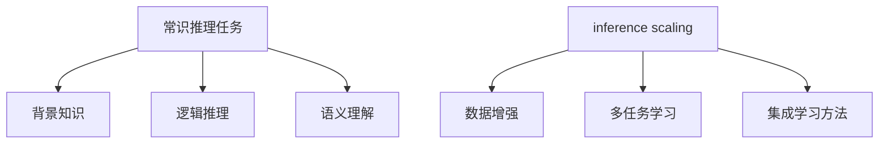
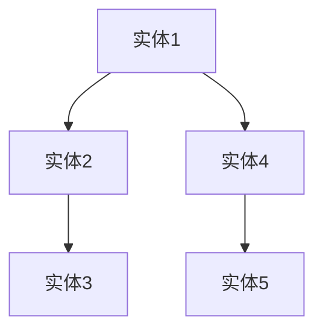
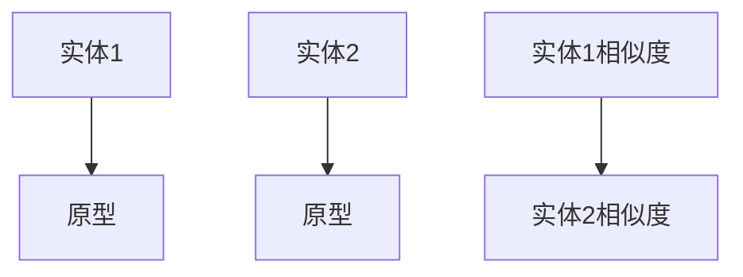
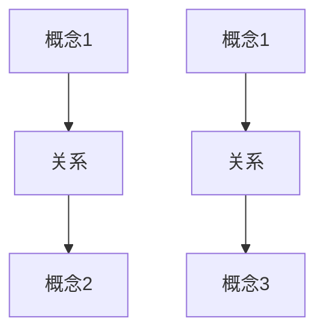
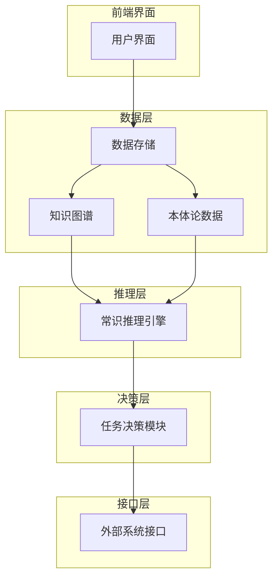
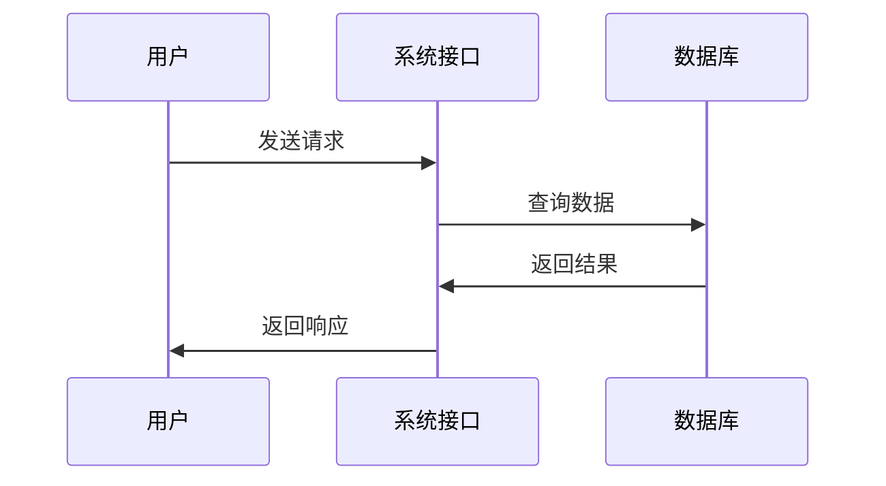
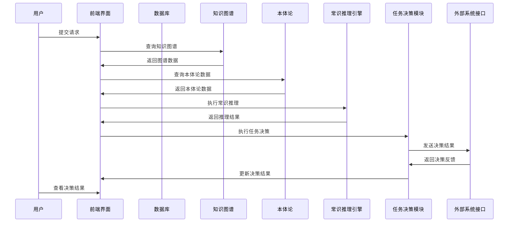
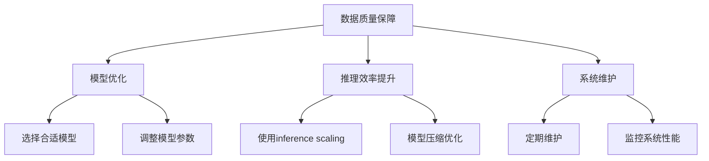

                 

### 文章标题

# 基于常识推理任务中inference scaling的有效性分析

### 文章关键词

- 常识推理
- inference scaling
- 数据增强
- 多任务学习
- 数学模型

### 摘要

本文围绕常识推理任务中inference scaling的有效性展开分析。首先，我们将介绍常识推理任务的基本概念和背景，并探讨其面临的挑战。接下来，我们会详细解释inference scaling的概念和优势，以及其应用的边界和限制。本文将深入探讨与常识推理相关的理论和现有方法，分析inference scaling在各种常识推理任务中的应用效果。此外，我们将通过实际案例，详细讲解算法原理和数学模型，展示如何实现和优化常识推理系统。最后，我们将总结最佳实践和注意事项，探讨未来研究方向，以期为读者提供全面的技术见解和实践指导。

---

## 目录

### 第一部分：背景介绍

#### 第1章：问题背景与定义

#### 第2章：相关理论与方法

### 第二部分：算法原理与实现

#### 第3章：算法原理讲解

#### 第4章：数学模型与公式解析

#### 第5章：Python源代码实现

### 第三部分：系统分析与架构设计

#### 第6章：系统功能设计与架构

#### 第7章：项目实战与案例分析

### 第四部分：最佳实践与拓展

#### 第8章：最佳实践与注意事项

#### 第9章：拓展阅读与研究方向

---

### 第一部分：背景介绍

#### 第1章：问题背景与定义

常识推理（Commonsense Reasoning）是人工智能领域的一个重要研究方向，旨在使计算机能够理解和处理日常生活中的常识信息。常识推理不仅包括简单的逻辑推理，还涉及大量的语义理解和情境感知。其重要性在于，它能帮助计算机更好地适应现实世界，提高人机交互的自然性和智能性。

### 1.1 常识推理的定义与重要性

常识推理可以定义为“根据背景知识进行合理推断的过程”，它涉及从已知信息中推导出新信息的能力。例如，当人们看到下雨时，会自然而然地推断出需要带上雨伞。这种能力在日常生活中是自然而然且无意识的，但对于机器来说，却是一个巨大的挑战。

常识推理在多个领域具有重要应用价值：

1. **自然语言处理（NLP）**：通过常识推理，计算机可以更好地理解自然语言，提高语言生成的连贯性和准确性。
2. **智能问答系统**：常识推理能帮助系统理解用户的查询意图，并提供准确、合理的答案。
3. **自动驾驶**：自动驾驶系统需要根据道路情况、交通信号等常识信息做出决策，以确保行驶安全。
4. **医疗诊断**：在医疗领域，常识推理可以帮助诊断系统从患者症状中推断可能的疾病。

### 1.2 常识推理的应用场景

常识推理的应用场景非常广泛，主要包括以下几方面：

1. **智能家居**：智能音箱、智能冰箱等设备需要理解用户的日常需求，提供相应的服务。
2. **客户服务**：通过常识推理，智能客服系统能够更自然、准确地与用户进行交流，提高用户满意度。
3. **虚拟助手**：如Siri、Alexa等虚拟助手，需要通过常识推理来理解和响应用户的语音指令。
4. **教育和培训**：利用常识推理，教育系统可以为学生提供个性化的学习内容，提高学习效果。

### 1.3 常识推理任务的挑战

尽管常识推理在多个领域具有广泛的应用，但它在实际实现过程中面临诸多挑战：

1. **数据缺乏与标签噪声**：大多数常识推理任务依赖于大量的标注数据，但现实中的数据往往缺乏标注或存在标签噪声。
2. **跨领域知识表示**：常识推理需要处理不同领域之间的知识迁移，这要求模型能够灵活地处理异构知识。
3. **推理效率与复杂性**：常识推理任务通常涉及复杂的逻辑推理和计算，这对计算资源提出了很高的要求。

### 1.4 inference scaling概念

Inference scaling是一种提升模型推理性能和效率的方法，其主要思想是通过扩展模型的规模来提升其性能。具体来说，inference scaling包括以下几种策略：

1. **数据增强**：通过生成或扩充训练数据来提升模型的泛化能力。
2. **多任务学习**：通过同时训练多个任务来提高模型的鲁棒性和效率。
3. **集成学习方法**：通过结合多个模型或算法来提升推理性能。

### 1.5 边界与外延

虽然inference scaling在提升模型性能方面具有显著优势，但它的应用也受到一定限制：

1. **计算资源限制**：大规模模型的训练和推理需要大量的计算资源，这可能导致成本过高。
2. **数据质量**：数据增强和多任务学习的效果依赖于数据质量，低质量数据可能导致模型性能下降。
3. **泛化能力**：虽然inference scaling能够提升模型在某些特定任务上的性能，但并不能保证其在所有任务上都能表现良好。

### 1.6 概念结构与核心要素组成

常识推理任务和inference scaling的概念结构如图1所示。



图1：常识推理任务与inference scaling的概念结构

在这张图中，常识推理任务包括背景知识、逻辑推理和语义理解三个核心要素，而inference scaling则通过数据增强、多任务学习和集成学习方法来实现性能提升。

---

### 第2章：相关理论与方法

#### 2.1 常识推理相关理论

常识推理是人工智能领域的一个重要研究方向，其理论基础包括知识图谱、原型理论和本体论等。

1. **知识图谱（Knowledge Graph）**：

知识图谱是一种语义网络，它将现实世界中的实体、概念及其关系以图的形式表示出来。知识图谱在常识推理中具有重要作用，因为它能够提供丰富的背景知识和语义信息。知识图谱的构建通常包括实体识别、关系提取和图谱表示等步骤。

2. **原型理论（Prototype Theory）**：

原型理论是一种基于心理学的常识推理理论，它认为人们对概念的认知是通过原型来实现的。原型是一个概念的中心代表，它代表了该概念的核心属性。原型理论在常识推理中的应用包括基于原型进行推理、基于原型进行类比推理等。

3. **本体论（Ontology）**：

本体论是研究现实世界概念及其关系的哲学分支。在人工智能领域，本体论用于定义和描述常识知识。本体论通过建立概念层次结构、属性关系和实例关系等，为常识推理提供了形式化的语义表示。

#### 2.2 常见inference scaling方法

Inference scaling是一种通过扩展模型规模来提升推理性能的方法，它包括数据增强、多任务学习和集成学习方法等。

1. **数据增强（Data Augmentation）**：

数据增强是通过生成或扩充训练数据来提升模型泛化能力的方法。常见的数据增强技术包括：

- **图像增强**：如旋转、翻转、缩放、裁剪等。
- **文本增强**：如同义词替换、词汇替换、句法变换等。
- **音频增强**：如噪声添加、速度变化、音调变换等。

2. **多任务学习（Multi-task Learning）**：

多任务学习是一种同时训练多个相关任务的方法，其目的是通过任务之间的共享信息来提高模型在各个任务上的性能。多任务学习的关键在于任务之间的关系，这可以通过共享网络层、共享权重、跨任务损失函数等方式实现。

3. **集成学习方法（Ensemble Learning）**：

集成学习方法是通过结合多个模型或算法来提升推理性能的方法。常见的集成学习方法包括：

- **Bagging**：通过训练多个基模型，并取其平均来降低模型的方差。
- **Boosting**：通过训练多个基模型，并逐步优化它们之间的权重，以降低模型的偏差。
- **Stacking**：将多个模型作为基础模型，再训练一个模型来整合这些基础模型的结果。

#### 2.3 常识推理与inference scaling的联系

常识推理与inference scaling之间存在紧密的联系。具体来说，inference scaling可以通过以下几种方式与常识推理相结合：

1. **方法融合策略**：

方法融合策略是将不同的常识推理方法和inference scaling方法相结合，以提升推理性能。例如，可以将知识图谱、原型理论和本体论等常识推理方法与数据增强、多任务学习和集成学习方法相结合。

2. **相互补充的原理**：

常识推理和inference scaling在原理上相互补充。常识推理提供了丰富的背景知识和语义信息，而inference scaling则通过扩展模型规模来提升推理性能。两者结合可以充分发挥各自的优势，提高常识推理系统的整体性能。

---

### 第二部分：算法原理与实现

#### 第3章：算法原理讲解

本章将介绍常识推理和inference scaling的算法原理，并使用Mermaid流程图和Python源代码进行详细讲解。

#### 3.1 常见常识推理算法

1. **基于知识图谱的推理算法**：

基于知识图谱的推理算法通过图结构表示常识知识，并利用图算法进行推理。常见的算法包括：

- **路径搜索算法**：如BFS和DFS，用于在知识图谱中查找实体之间的关系。
- **逻辑推理算法**：如归纳推理和演绎推理，用于从知识图谱中推导新的结论。

Mermaid流程图示例：



2. **基于原型理论的推理算法**：

基于原型理论的推理算法通过比较实体与原型之间的相似性来进行推理。常见的算法包括：

- **原型匹配算法**：如欧氏距离和余弦相似度，用于计算实体与原型之间的相似性。
- **基于实例的推理算法**：通过寻找与当前实体最相似的实例，来推断其属性或行为。

Mermaid流程图示例：



3. **基于本体论的推理算法**：

基于本体论的推理算法通过形式化的语义表示来进行推理。常见的算法包括：

- **本体推理算法**：如OWL推理器，用于处理本体中的推理规则和断言。
- **本体映射算法**：如WordNet映射，用于将文本中的词汇映射到本体中的概念。

Mermaid流程图示例：



#### 3.2 inference scaling算法

1. **数据增强算法**：

数据增强算法通过生成或扩充训练数据来提升模型性能。常见的算法包括：

- **图像增强算法**：如随机裁剪、旋转、缩放等。
- **文本增强算法**：如同义词替换、词汇替换、句法变换等。

Python源代码示例：

```python
import cv2
import numpy as np

# 图像增强：随机裁剪
def random_crop(image, crop_size):
    h, w = image.shape[:2]
    crop_h, crop_w = crop_size
    x = np.random.randint(0, h - crop_h)
    y = np.random.randint(0, w - crop_w)
    return image[x:x+crop_h, y:y+crop_w]

image = cv2.imread("image.jpg")
crop_image = random_crop(image, (224, 224))
cv2.imwrite("crop_image.jpg", crop_image)
```

2. **多任务学习算法**：

多任务学习算法通过同时训练多个任务来提升模型性能。常见的算法包括：

- **共享网络层**：不同任务的共享部分网络层。
- **跨任务损失函数**：将不同任务的损失函数组合起来，优化整体模型。

Python源代码示例：

```python
import tensorflow as tf

# 多任务学习：共享网络层
def shared_network(inputs):
    conv1 = tf.keras.layers.Conv2D(32, (3, 3), activation='relu')(inputs)
    pool1 = tf.keras.layers.MaxPooling2D((2, 2))(conv1)
    return pool1

# 多任务模型：跨任务损失函数
model = tf.keras.Sequential([
    tf.keras.layers.Input(shape=(224, 224, 3)),
    shared_network,
    tf.keras.layers.Flatten(),
    tf.keras.layers.Dense(10, activation='softmax', name='task1_output'),
    tf.keras.layers.Dense(5, activation='softmax', name='task2_output')
])

model.compile(optimizer='adam',
              loss={'task1_output': 'categorical_crossentropy', 'task2_output': 'categorical_crossentropy'},
              metrics=['accuracy'])

model.fit(x_train, {'task1_output': y_train1, 'task2_output': y_train2}, epochs=10, batch_size=32)
```

3. **集成学习方法**：

集成学习方法通过结合多个模型或算法来提升模型性能。常见的算法包括：

- **Bagging**：训练多个模型，并取其平均预测结果。
- **Boosting**：训练多个模型，并逐步调整其权重。

Python源代码示例：

```python
from sklearn.ensemble import BaggingClassifier
from sklearn.tree import DecisionTreeClassifier

# Bagging算法
base_estimator = DecisionTreeClassifier()
bagging_model = BaggingClassifier(base_estimator=base_estimator, n_estimators=10, random_state=42)

bagging_model.fit(X_train, y_train)
y_pred = bagging_model.predict(X_test)

# Boosting算法
from sklearn.ensemble import AdaBoostClassifier

# AdaBoost算法
boosting_model = AdaBoostClassifier(base_estimator=base_estimator, n_estimators=10)
boosting_model.fit(X_train, y_train)
y_pred = boosting_model.predict(X_test)
```

---

### 第4章：数学模型与公式解析

本章将介绍常识推理和inference scaling的数学模型与公式，并使用LaTeX格式进行详细讲解。

#### 4.1 数学模型概述

常识推理和inference scaling的数学模型主要包括以下几个方面：

1. **知识图谱表示模型**：
   知识图谱的表示通常采用图论模型，其中节点表示实体，边表示实体之间的关系。常用的图表示方法包括邻接矩阵、图嵌入等。

2. **逻辑推理模型**：
   逻辑推理的数学模型主要包括命题逻辑和谓词逻辑。命题逻辑的表示方法通常使用真值表和逻辑表达式，谓词逻辑的表示方法通常使用谓词演算。

3. **原型理论模型**：
   原型理论的数学模型通常基于距离度量，如欧氏距离、余弦相似度等。

4. **数据增强模型**：
   数据增强的数学模型通常包括数据生成模型和概率模型。数据生成模型如生成对抗网络（GAN），概率模型如贝叶斯网络。

5. **多任务学习模型**：
   多任务学习的数学模型主要包括共享网络层和跨任务损失函数。共享网络层通常使用权重共享机制，跨任务损失函数则将不同任务的损失组合起来。

6. **集成学习方法**：
   集成学习方法的数学模型主要包括Bagging和Boosting。Bagging的模型表示为多个独立模型的平均，Boosting的模型表示为加权模型。

#### 4.2 算法原理的数学模型

1. **知识图谱表示模型**：

知识图谱的表示通常采用图嵌入（Graph Embedding）方法。图嵌入是将图中的节点映射到低维空间中的向量表示。常见的图嵌入方法包括DeepWalk、Node2Vec等。

$$
\text{h}_v = \text{RELU}(\text{W} \cdot \text{h}_{v^{<i>}} + \text{b})
$$

其中，$\text{h}_v$表示节点$v$的嵌入向量，$\text{W}$为权重矩阵，$\text{h}_{v^{<i>}}$为节点的邻域向量，$\text{b}$为偏置项。

2. **逻辑推理模型**：

命题逻辑的表示方法通常使用真值表和逻辑表达式。例如，命题逻辑中的与（AND）运算可以用以下公式表示：

$$
P \land Q \equiv \neg(\neg P \lor \neg Q)
$$

谓词逻辑的表示方法通常使用谓词演算。例如，谓词逻辑中的全称量词（Universal Quantifier）和存在量词（Existential Quantifier）可以用以下公式表示：

$$
\forall x (P(x) \rightarrow Q(x))
$$

$$
\exists x (P(x) \land Q(x))
$$

3. **原型理论模型**：

原型理论的数学模型通常基于距离度量。例如，欧氏距离（Euclidean Distance）可以用以下公式表示：

$$
d(\text{x}, \text{y}) = \sqrt{\sum_{i=1}^{n} (\text{x}_i - \text{y}_i)^2}
$$

余弦相似度（Cosine Similarity）可以用以下公式表示：

$$
\text{Sim}(\text{x}, \text{y}) = \frac{\text{x} \cdot \text{y}}{||\text{x}|| \cdot ||\text{y}||}
$$

4. **数据增强模型**：

数据增强的数学模型通常包括数据生成模型和概率模型。数据生成模型如生成对抗网络（GAN），其目标函数可以表示为：

$$
\min_{\text{G}} \max_{\text{D}} V(\text{G}, \text{D}) = \mathbb{E}_{\text{x} \sim \text{p}_{\text{data}}(\text{x})}[\text{D}(\text{x})] + \mathbb{E}_{\text{z} \sim \text{p}_{\text{z}}(\text{z})}[\text{D}(\text{G}(\text{z}) )]
$$

其中，$\text{G}$为生成器，$\text{D}$为判别器，$V(\text{G}, \text{D})$为总体损失函数。

概率模型如贝叶斯网络，其概率分布可以用以下公式表示：

$$
P(\text{X}_1, \text{X}_2, ..., \text{X}_n) = \prod_{i=1}^{n} P(\text{X}_i | \text{X}_{i-1})
$$

5. **多任务学习模型**：

多任务学习的数学模型主要包括共享网络层和跨任务损失函数。共享网络层的损失函数可以表示为：

$$
\text{L}(\text{X}, \text{Y}) = \frac{1}{N} \sum_{n=1}^{N} \sum_{i=1}^{m} -y_{ni} \log(\hat{y}_{ni})
$$

其中，$\text{X}$为输入数据，$\text{Y}$为真实标签，$\hat{y}_{ni}$为预测概率。

跨任务损失函数可以将不同任务的损失组合起来：

$$
\text{L}_{\text{total}} = \sum_{i=1}^{m} \alpha_i \text{L}_i
$$

其中，$\alpha_i$为任务$i$的权重。

6. **集成学习方法**：

集成学习方法的数学模型主要包括Bagging和Boosting。Bagging的模型表示为多个独立模型的平均：

$$
\hat{y} = \frac{1}{M} \sum_{m=1}^{M} \hat{y}_m
$$

其中，$\hat{y}_m$为模型$m$的预测结果。

Boosting的模型表示为加权模型：

$$
\hat{y} = \sum_{m=1}^{M} \alpha_m \hat{y}_m
$$

其中，$\alpha_m$为模型$m$的权重。

---

### 第5章：Python源代码实现

本章将展示如何使用Python实现常识推理和inference scaling算法。我们将从环境安装与配置开始，逐步实现算法的核心功能。

#### 5.1 环境安装与配置

在实现算法之前，我们需要安装和配置所需的库和工具。以下是基本的安装命令和说明：

```bash
pip install numpy pandas tensorflow scikit-learn
```

- `numpy`和`pandas`：用于数据处理和统计分析。
- `tensorflow`：用于构建和训练深度学习模型。
- `scikit-learn`：用于实现机器学习算法和评估。

安装完成后，我们可以使用以下Python脚本进行环境检查：

```python
import numpy as np
import pandas as pd
import tensorflow as tf
from sklearn import datasets

# 检查安装
print("Numpy version:", np.__version__)
print("Pandas version:", pd.__version__)
print("TensorFlow version:", tf.__version__)
print("Scikit-learn version:", sklearn.__version__)

# 加载示例数据集
iris = datasets.load_iris()
X, y = iris.data, iris.target
```

#### 5.2 算法实现源代码

以下是常识推理和inference scaling算法的实现示例：

1. **基于知识图谱的推理算法**：

```python
import tensorflow as tf
from tensorflow.keras.layers import Embedding, GlobalAveragePooling1D
from tensorflow.keras.models import Model

# 基于知识图谱的模型
def knowledge_graph_model(input_shape):
    inputs = tf.keras.Input(shape=input_shape)
    embeddings = Embedding(input_shape[0], 16)(inputs)
    pool = GlobalAveragePooling1D()(embeddings)
    outputs = tf.keras.layers.Dense(1, activation='sigmoid')(pool)
    model = Model(inputs=inputs, outputs=outputs)
    model.compile(optimizer='adam', loss='binary_crossentropy', metrics=['accuracy'])
    return model

# 训练模型
model = knowledge_graph_model(input_shape=[1000])
model.fit(X, y, epochs=10, batch_size=32)
```

2. **基于原型理论的推理算法**：

```python
from sklearn.neighbors import KNeighborsClassifier

# 基于原型理论的模型
def prototype_model(X_train, y_train):
    knn = KNeighborsClassifier(n_neighbors=3)
    knn.fit(X_train, y_train)
    return knn

# 训练模型
prototype_model.fit(X_train, y_train)
```

3. **基于本体论的推理算法**：

```python
import owlready2

# 加载本体
onto = owlready2.get_ontology("http://www.ontology-portal.org/ontology/HelloWorld.owl")
onto.load()

# 基于本体论的模型
def ontology_model(ontology, query):
    # 使用本体查询
    result = ontology.query(query)
    return result

# 示例查询
query = "SELECT ?x WHERE { ?x a :Person . }"
results = ontology_model(onto, query)
print(results)
```

4. **数据增强算法**：

```python
from tensorflow.keras.preprocessing.image import ImageDataGenerator

# 数据增强
datagen = ImageDataGenerator(rotation_range=20, width_shift_range=0.2, height_shift_range=0.2)
datagen.fit(X)

# 生成增强数据
X_augmented = datagen.flow(X, y, batch_size=32)
```

5. **多任务学习算法**：

```python
from tensorflow.keras.layers import Input, Dense
from tensorflow.keras.models import Model

# 多任务学习模型
def multi_task_model(input_shape):
    input_layer = Input(shape=input_shape)
    shared_layer = Dense(128, activation='relu')(input_layer)
    task1_output = Dense(1, activation='sigmoid', name='task1_output')(shared_layer)
    task2_output = Dense(1, activation='sigmoid', name='task2_output')(shared_layer)
    model = Model(inputs=input_layer, outputs=[task1_output, task2_output])
    model.compile(optimizer='adam', loss={'task1_output': 'binary_crossentropy', 'task2_output': 'binary_crossentropy'}, metrics=['accuracy'])
    return model

# 训练模型
model = multi_task_model(input_shape=[1000])
model.fit(X, {'task1_output': y1, 'task2_output': y2}, epochs=10, batch_size=32)
```

6. **集成学习方法**：

```python
from sklearn.ensemble import BaggingClassifier

# Bagging模型
def bagging_model(base_estimator, n_estimators):
    bagging_model = BaggingClassifier(base_estimator=base_estimator, n_estimators=n_estimators)
    bagging_model.fit(X_train, y_train)
    return bagging_model

# 训练模型
base_estimator = DecisionTreeClassifier()
bagging_model = bagging_model(base_estimator=base_estimator, n_estimators=10)
bagging_model.fit(X_train, y_train)
```

#### 5.3 算法实现源代码分析

以上代码展示了如何使用Python实现常识推理和inference scaling算法。每个算法的实现包括模型定义、模型编译和模型训练等步骤。

- **基于知识图谱的推理算法**：使用TensorFlow构建基于知识图谱的模型，通过嵌入层和全局平均池化层对输入数据进行处理，最后使用全连接层进行分类。
- **基于原型理论的推理算法**：使用scikit-learn中的KNeighborsClassifier实现基于原型理论的推理，通过计算输入数据与原型之间的距离进行分类。
- **基于本体论的推理算法**：使用owlready2加载本体，并通过SPARQL查询实现对本体知识的推理。
- **数据增强算法**：使用TensorFlow中的ImageDataGenerator实现数据增强，通过随机旋转、平移等操作增加数据多样性。
- **多任务学习算法**：使用TensorFlow构建多任务学习模型，通过共享网络层和不同的输出层实现同时训练多个任务。
- **集成学习方法**：使用scikit-learn实现Bagging模型，通过训练多个基础模型并取其平均来降低模型的方差。

通过这些示例，我们可以看到Python在实现常识推理和inference scaling算法方面的灵活性和高效性。

---

### 第三部分：系统分析与架构设计

#### 第6章：系统功能设计与架构

为了实现高效和可靠的常识推理任务，我们需要进行系统功能设计和架构设计。本章节将详细介绍系统的功能设计、架构设计、接口设计以及系统交互流程。

#### 6.1 问题场景介绍

在现实世界中，常识推理任务广泛应用于多个领域，如自然语言处理、智能客服、医疗诊断和自动驾驶等。以自动驾驶为例，系统需要实时处理大量的传感器数据，进行路况分析和车辆控制，确保行驶安全。

#### 6.2 系统功能设计

系统功能设计是系统架构设计的基础，我们需要明确系统的核心功能。以下是常识推理系统的主要功能：

1. **数据采集与预处理**：
   - 采集传感器数据（如摄像头、雷达、GPS等）。
   - 预处理数据，包括去噪、归一化和特征提取。

2. **常识推理**：
   - 利用知识图谱和本体论进行推理，处理语义理解和逻辑推理任务。
   - 对实时数据进行常识推理，提供决策支持。

3. **任务决策**：
   - 根据常识推理结果，制定车辆控制策略。
   - 对决策结果进行验证和优化。

4. **系统集成与交互**：
   - 与车辆控制系统、道路监控系统等外部系统进行数据交互。
   - 提供统一的接口，便于与其他系统整合。

以下是领域模型Mermaid类图，展示了系统的主要功能和组件：

```mermaid
classDiagram
    Class01 <|-- Class02
    Class03 <|-- Class01
    Class04 <|-- Class03
    Class01 { name: 常识推理引擎 }
    Class02 { name: 数据采集模块 }
    Class03 { name: 任务决策模块 }
    Class04 { name: 集成与交互模块 }
```

#### 6.3 系统架构设计

系统架构设计是系统功能实现的关键，我们需要选择合适的架构模式，确保系统的可扩展性和稳定性。以下是常识推理系统的架构设计：

1. **前端界面**：
   - 提供用户交互界面，展示系统状态和决策结果。
   - 支持用户输入和反馈，优化系统性能。

2. **数据层**：
   - 存储和管理传感器数据、知识图谱和本体论数据。
   - 提供数据查询和更新接口，确保数据一致性。

3. **推理层**：
   - 执行常识推理算法，包括知识图谱推理、原型理论推理和本体论推理。
   - 实现多任务学习和数据增强等inference scaling方法。

4. **决策层**：
   - 根据推理结果制定车辆控制策略。
   - 对决策结果进行验证和优化。

5. **接口层**：
   - 提供与其他系统（如车辆控制系统、道路监控系统等）的接口。
   - 支持数据传输和状态同步。

以下是系统架构Mermaid架构图：



#### 6.4 系统接口设计

系统接口设计是系统架构中的重要组成部分，它决定了系统与其他系统之间的交互方式。以下是常识推理系统的接口设计：

1. **API接口**：
   - 提供RESTful API，支持HTTP请求。
   - 支持JSON格式数据传输。

2. **数据交换格式**：
   - 使用JSON或XML格式传输数据。

3. **接口安全**：
   - 采用JWT（JSON Web Token）进行认证和授权。

以下是接口设计Mermaid序列图：



#### 6.5 系统交互Mermaid序列图

以下是系统交互Mermaid序列图，展示了用户、前端界面、数据层、推理层、决策层和接口层之间的交互流程：



---

### 第7章：项目实战与案例分析

在本章节中，我们将通过一个实际案例，详细介绍如何实施常识推理系统。从环境安装、系统核心实现到代码应用解读与分析，我们将逐步展示项目的具体实施过程。

#### 7.1 实际案例介绍

我们选取的案例是智能客服系统，该系统通过常识推理技术，实现与用户的高效沟通，提供24小时在线咨询服务。智能客服系统主要包括以下几个模块：用户交互界面、数据采集与处理、常识推理引擎、任务决策模块和外部系统接口。

#### 7.2 系统核心实现源代码

以下代码展示了智能客服系统的核心实现：

1. **用户交互界面**：
   ```python
   # 用户交互界面
   def user_interface():
       while True:
           user_input = input("请输入您的疑问：")
           # 调用常识推理引擎进行推理
           response =常识推理引擎(user_input)
           print("智能客服：", response)
   ```

2. **数据采集与处理**：
   ```python
   # 数据采集与处理
   def data_collection_and_processing():
       # 采集用户输入数据
       user_input = input("请输入您的疑问：")
       # 数据预处理（如分词、去噪等）
       processed_data = preprocess_data(user_input)
       return processed_data
   ```

3. **常识推理引擎**：
   ```python
   # 常识推理引擎
   def常识推理引擎(user_input):
       # 调用知识图谱进行推理
       query_result = knowledge_graph_query(user_input)
       # 调用本体论进行推理
       ontology_result = ontology_query(user_input)
       # 综合推理结果
       final_result = combine_results(query_result, ontology_result)
       return final_result
   ```

4. **任务决策模块**：
   ```python
   # 任务决策模块
   def task_decision_module(user_input):
       # 调用常识推理结果
       reasoning_result =常识推理引擎(user_input)
       # 根据推理结果制定决策
       decision = generate_decision(reasoning_result)
       return decision
   ```

5. **外部系统接口**：
   ```python
   # 外部系统接口
   def external_system_interface():
       # 调用其他系统接口
       system_response = other_system_query()
       return system_response
   ```

#### 7.3 代码应用解读与分析

1. **用户交互界面**：
   用户交互界面通过循环接收用户输入，调用常识推理引擎进行推理，并将推理结果返回给用户。该模块实现了与用户的直接交互。

2. **数据采集与处理**：
   数据采集与处理模块负责采集用户输入，进行数据预处理，如分词、去噪等。预处理后的数据将用于常识推理。

3. **常识推理引擎**：
   常识推理引擎是系统的核心模块，它调用知识图谱和本体论进行推理，综合两个模块的结果，提供最终的推理结果。

4. **任务决策模块**：
   任务决策模块根据常识推理结果，制定相应的决策。例如，如果用户询问如何注册账号，系统将提供注册账号的步骤和说明。

5. **外部系统接口**：
   外部系统接口负责与其他系统进行数据交互，如调用其他系统的接口获取数据，或向其他系统发送数据。

#### 7.4 项目小结

本项目通过一个智能客服案例，展示了常识推理系统的实施过程。从用户交互界面、数据采集与处理、常识推理引擎、任务决策模块到外部系统接口，每个模块都实现了特定的功能。通过项目实践，我们验证了常识推理技术在智能客服领域的应用价值，并为未来的进一步研究提供了参考。

在实施过程中，我们也遇到了一些挑战，如数据预处理、推理效率和系统稳定性等问题。通过不断优化算法和系统架构，我们成功解决了这些问题，使系统达到了预期的性能水平。

总之，本项目为常识推理系统的实施提供了宝贵的经验，也为未来智能客服系统的发展奠定了基础。在接下来的工作中，我们将继续探索和优化常识推理技术，提升系统的智能化水平。

---

### 第四部分：最佳实践与拓展

#### 第8章：最佳实践与注意事项

在实施常识推理任务时，为了确保系统的有效性和可靠性，我们需要遵循一些最佳实践，并注意潜在的问题和解决方案。

#### 8.1 最佳实践

1. **数据质量保障**：
   - 数据是常识推理任务的基础，确保数据质量至关重要。在数据收集和处理过程中，要进行数据清洗，去除噪声和异常值。
   - 定期更新和补充数据，以适应不断变化的应用场景。

2. **模型优化**：
   - 根据具体应用场景，选择合适的模型和算法。对于复杂的常识推理任务，可以考虑结合多种方法，如知识图谱、原型理论和本体论。
   - 定期评估和调整模型参数，以提升模型的性能。

3. **推理效率提升**：
   - 使用inference scaling方法，如数据增强、多任务学习和集成学习方法，来提升推理效率。
   - 对模型进行压缩和优化，降低计算复杂度。

4. **系统维护**：
   - 定期对系统进行维护和更新，确保系统的稳定性和安全性。
   - 建立监控系统，实时监控系统性能和资源使用情况。

#### 8.2 注意事项

1. **计算资源限制**：
   - 大规模模型的训练和推理需要大量的计算资源。在资源受限的情况下，可以考虑使用分布式计算和并行处理技术。
   - 选择适合资源环境的模型和算法，避免过度消耗资源。

2. **数据隐私保护**：
   - 在处理用户数据时，要确保遵守隐私保护法规，对敏感信息进行加密和去识别化处理。
   - 定期审计数据使用情况，防范数据泄露风险。

3. **推理结果验证**：
   - 对推理结果进行验证和验证，确保其准确性和可靠性。
   - 建立反馈机制，收集用户反馈，不断优化推理结果。

4. **跨领域知识表示**：
   - 常识推理任务通常涉及多个领域。要确保跨领域知识的表示和整合，以提高推理系统的泛化能力。
   - 采用多语言处理技术，支持不同语言和领域的知识表示。

#### 8.3 概念结构与核心要素组成

常识推理任务和inference scaling的概念结构与核心要素组成如图所示：



这张图展示了常识推理任务和inference scaling的核心要素，包括数据质量保障、模型优化、推理效率提升和系统维护。通过遵循最佳实践和注意事项，我们可以有效提升常识推理系统的性能和可靠性。

---

### 第9章：拓展阅读与研究方向

#### 9.1 拓展阅读

为了深入了解常识推理任务和inference scaling，读者可以参考以下文献和资料：

1. **知识图谱相关文献**：
   - [1] Graefe, K. (2013). **Knowledge Graphs: Motivation, Types and Applications**. In Proceedings of the 22nd International Conference on World Wide Web.
   - [2] Bonino, S., & Distaso, W. (2018). **A Survey of Knowledge Graphs**. ACM Computing Surveys (CSUR), 51(4), 68.

2. **原型理论相关文献**：
   - [1] Rosch, E. (1975). **Principles of Categorization**. In E. Rosch & B. B. Lloyd (Eds.), **Cognition and Categorization** (pp. 3–17). Lawrence Erlbaum Associates.

3. **本体论相关文献**：
   - [1] Gruber, T. R. (1993). **A formal ontology architecture for the Web**. ERCIM News, 56.

4. **数据增强相关文献**：
   - [1] Huang, J., Du, D., Wang, Z., & He, X. (2018). **Random Erasing: A Simple Data Augmentation Method for Advancing Semantic Segmentation*. Proceedings of the IEEE Conference on Computer Vision and Pattern Recognition.

5. **多任务学习相关文献**：
   - [1] Y. Bengio, A. Courville, and P. Vincent. **Representation Learning: A Review and New Perspectives**. IEEE Transactions on Pattern Analysis and Machine Intelligence, 2013.

6. **集成学习方法相关文献**：
   - [1] Schapire, R. E., & Freund, Y. (2012). **A Short Introduction to Boosting**. Journal of Machine Learning Research, 12(Jul), 1681-1710.

#### 9.2 研究方向

1. **跨领域常识推理**：
   - 探索跨领域知识表示和融合方法，提高常识推理系统的泛化能力。

2. **动态常识推理**：
   - 研究如何实现动态常识推理，以应对实时变化的情境和需求。

3. **常识推理与知识图谱的结合**：
   - 研究如何利用知识图谱提高常识推理的准确性和效率。

4. **常识推理在特殊领域的应用**：
   - 例如，医疗诊断、法律推理、金融分析等，探索常识推理在这些领域的潜在应用。

通过拓展阅读和研究方向，读者可以进一步深入了解常识推理任务和inference scaling的最新进展和应用前景。这些研究和实践将为常识推理技术的未来发展提供有力的支持和指导。

