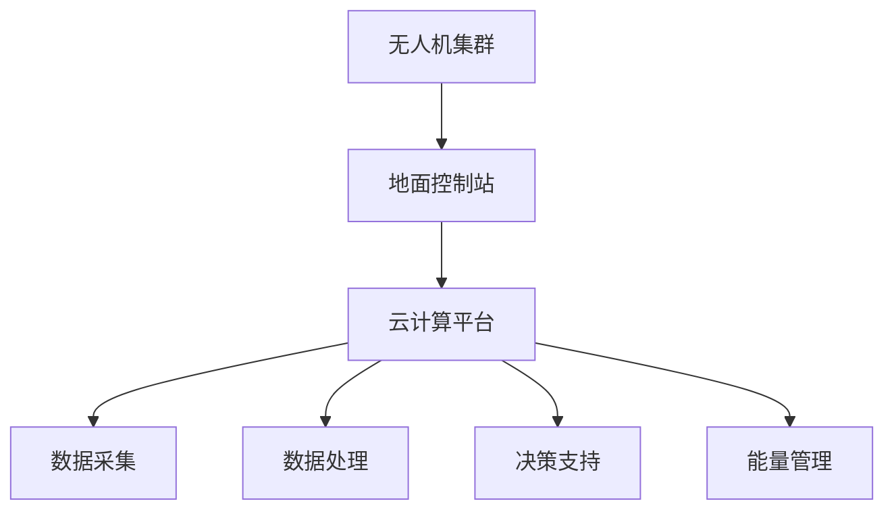
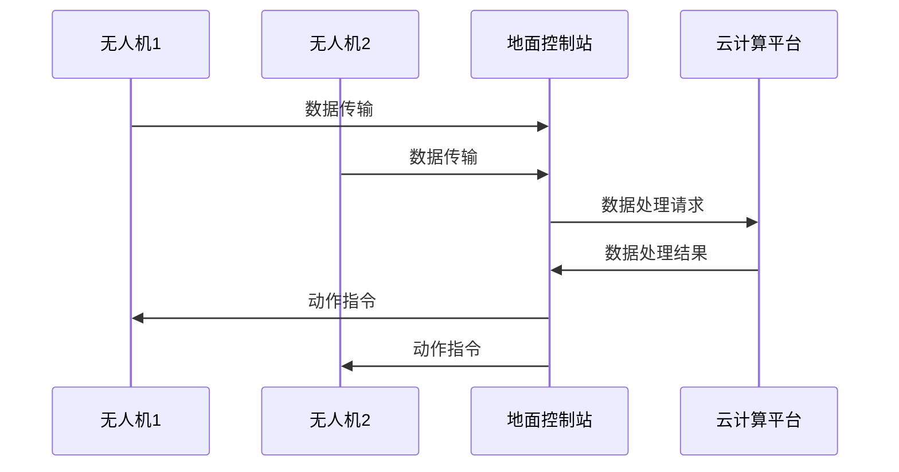

                 


### 1. **背景介绍**

在当今飞速发展的信息技术时代，无人机技术作为现代航空领域的一项重要创新，逐渐引起了人们的广泛关注。无人机（Unmanned Aerial Vehicles，简称UAV）具备自主飞行、远程控制等特点，已经在军事侦察、灾害救援、农业监测、物流运输等多个领域得到了广泛应用。

然而，随着无人机数量的增加和任务复杂性的提升，无人机集群协同控制成为了一个亟待解决的问题。无人机集群协同控制是指通过一定的算法和策略，使得多架无人机能够高效、安全地协同完成任务。这种协同控制不仅要求无人机之间的信息共享和策略协调，还需要考虑任务分配、路径规划、避障等多方面的因素。

强化学习（Reinforcement Learning，简称RL）是一种基于奖励机制进行决策的机器学习算法，近年来在无人机集群协同控制中展现出了巨大的潜力。通过不断试错和经验积累，无人机集群可以在复杂环境中实现自适应学习和协同优化。

## 2. **核心概念与联系**

### 2.1.1 **无人机集群协同控制定义**

无人机集群协同控制是指通过一定的算法和通信手段，使得多个无人机能够协同完成同一任务或分步骤完成不同任务的过程。这一过程中，无人机需要具备自主决策、协同操作和实时响应的能力。

### 2.1.2 **强化学习基础概念**

强化学习是一种通过奖励机制进行决策的机器学习算法，其核心思想是智能体（Agent）在环境中通过不断地尝试和反馈，学习到最优策略（Policy），从而最大化累积奖励（Reward）。强化学习的主要组成部分包括：

- **状态（State）**：智能体所处的环境描述。
- **动作（Action）**：智能体可以采取的行为。
- **奖励（Reward）**：智能体采取某一动作后获得的即时奖励或惩罚。
- **策略（Policy）**：智能体在某一状态下采取的动作选择。
- **价值函数（Value Function）**：衡量智能体在某一状态下采取某一动作的期望收益。
- **模型（Model）**：智能体对环境的预测模型。

### 2.1.3 **无人机集群协同控制与强化学习的关系**

无人机集群协同控制与强化学习之间的关系主要体现在以下几个方面：

- **自适应学习**：强化学习算法使得无人机能够根据环境变化和任务需求进行自适应学习，不断优化协同控制策略。
- **实时响应**：无人机在执行任务过程中，需要实时响应对环境的变化，强化学习能够提供这种实时响应的能力。
- **多智能体协同**：强化学习通过构建多智能体系统，使得无人机之间能够协同工作，共同完成任务。

## 3. **算法原理讲解**

### 3.1 **Q-Learning算法**

Q-Learning算法是一种基于值函数的强化学习算法，其核心思想是通过不断地更新Q值（即状态-动作值函数）来学习最优策略。Q-Learning算法的流程如下：

1. **初始化Q值表**：设定一个初始的Q值表，其中每个状态-动作对都有一个初始的Q值。
2. **选择动作**：在某一状态下，根据ε-贪心策略选择动作，ε是一个小概率参数，用于探索未知动作。
3. **执行动作并获取奖励**：执行选定的动作，并根据环境反馈获得奖励。
4. **更新Q值**：根据新的状态和奖励，更新Q值表中的相应Q值。
5. **重复步骤2-4**：重复上述过程，直到达到预期目标或满足停止条件。

### 3.2 **SARSA算法**

SARSA（同步优势响应采样）算法是一种基于策略的强化学习算法，它与Q-Learning算法的不同之处在于，SARSA算法在更新Q值时，使用的是当前状态-动作对的实际奖励和后续状态-动作对的预期Q值。SARSA算法的流程如下：

1. **初始化Q值表**：设定一个初始的Q值表。
2. **选择动作**：在某一状态下，根据ε-贪心策略选择动作。
3. **执行动作并获取奖励**：执行选定的动作，并根据环境反馈获得奖励。
4. **更新Q值**：使用当前状态-动作对的奖励和后续状态-动作对的预期Q值，更新Q值表中的相应Q值。
5. **重复步骤2-4**：重复上述过程，直到达到预期目标或满足停止条件。

### 3.3 **Deep Q-Network（DQN）算法**

DQN（Deep Q-Network）算法是一种基于深度神经网络的强化学习算法，它通过将状态和动作映射到高维的特征空间，从而解决传统Q-Learning算法中状态-动作值函数无法直接估计的问题。DQN算法的流程如下：

1. **初始化深度神经网络**：设定一个深度神经网络模型，用于估计Q值。
2. **初始化经验回放记忆库**：创建一个经验回放记忆库，用于存储历史经验。
3. **选择动作**：在某一状态下，根据ε-贪心策略选择动作。
4. **执行动作并获取奖励**：执行选定的动作，并根据环境反馈获得奖励。
5. **存储经验**：将当前的状态、动作、奖励和下一状态存储到经验回放记忆库中。
6. **从经验回放记忆库中采样经验**：从经验回放记忆库中随机采样一批经验。
7. **计算目标Q值**：使用当前状态和目标动作的奖励以及下一状态的预期Q值，计算目标Q值。
8. **更新深度神经网络**：使用采样经验更新深度神经网络，从而调整Q值估计。
9. **重复步骤3-8**：重复上述过程，直到达到预期目标或满足停止条件。

## 4. **数学模型和数学公式讲解**

### 4.1 **Q-Learning算法数学模型**

在Q-Learning算法中，Q值（状态-动作值函数）的计算公式如下：

$$
Q(s, a) = r + \gamma \max_{a'} Q(s', a')
$$

其中：
- \( Q(s, a) \) 是状态 \( s \) 下采取动作 \( a \) 的Q值。
- \( r \) 是采取动作 \( a \) 后获得的即时奖励。
- \( \gamma \) 是折扣因子，用于考虑未来奖励的重要性。
- \( s' \) 是采取动作 \( a \) 后的状态。
- \( a' \) 是在状态 \( s' \) 下采取的最优动作。

### 4.2 **SARSA算法数学模型**

在SARSA算法中，Q值的更新公式如下：

$$
Q(s, a) = Q(s, a) + \alpha [r + \gamma \max_{a'} Q(s', a') - Q(s, a)]
$$

其中：
- \( Q(s, a) \) 是状态 \( s \) 下采取动作 \( a \) 的Q值。
- \( r \) 是采取动作 \( a \) 后获得的即时奖励。
- \( \gamma \) 是折扣因子。
- \( s' \) 是采取动作 \( a \) 后的状态。
- \( a' \) 是在状态 \( s' \) 下采取的最优动作。
- \( \alpha \) 是学习率。

### 4.3 **DQN算法数学模型**

在DQN算法中，Q值的计算依赖于深度神经网络。假设深度神经网络的前向传播输出为 \( V(s) \)，则DQN算法中的Q值计算公式如下：

$$
Q(s, a) = V(s)
$$

其中：
- \( Q(s, a) \) 是状态 \( s \) 下采取动作 \( a \) 的Q值。
- \( V(s) \) 是深度神经网络对状态 \( s \) 的预测输出。

## 5. **系统分析与架构设计**

### 5.1 **问题场景介绍**

在无人机集群协同控制系统中，我们可以设想以下场景：

- **自动巡逻**：无人机在指定区域内进行巡逻，发现异常情况时进行汇报。
- **目标追踪**：无人机跟踪特定目标，并在目标发生移动时进行实时调整。
- **能量管理**：无人机在执行任务过程中，根据能量消耗和任务需求进行能量分配。

### 5.2 **系统功能设计**

- **自动巡逻功能设计**：
  - 数据采集：无人机采集指定区域内的图像、声音等数据。
  - 数据处理：对采集到的数据进行分析，识别出异常情况。
  - 异常报告：将异常情况报告给控制中心。

- **目标追踪功能设计**：
  - 目标检测：无人机检测到目标后，进行初步识别和定位。
  - 目标跟踪：无人机根据目标移动轨迹进行实时调整，保持对目标的跟踪。
  - 目标报告：将目标的位置信息报告给控制中心。

- **能量管理功能设计**：
  - 能量监测：无人机监测自身的能量消耗情况。
  - 能量优化：根据任务需求和能量消耗情况，对无人机进行能量优化分配。
  - 能量报告：将能量消耗和分配情况报告给控制中心。

### 5.3 **系统架构设计**

- **系统架构概述**：
  无人机集群协同控制系统由多个无人机、地面控制站和云计算平台组成。无人机负责数据采集和任务执行，地面控制站负责数据接收和决策，云计算平台负责大数据处理和算法优化。

- **系统架构图**：



- **系统接口设计**：
  - **数据采集接口**：无人机与地面控制站之间的数据传输接口。
  - **数据处理接口**：地面控制站与云计算平台之间的数据传输接口。
  - **决策支持接口**：云计算平台与地面控制站之间的数据传输接口。
  - **能量管理接口**：地面控制站与云计算平台之间的数据传输接口。

- **系统交互序列图**：



## 6. **项目实战**

### 6.1 **环境安装**

**硬件环境配置**：

- **无人机**：选择具备GPS定位、图像采集和通信功能的无人机。
- **地面控制站**：安装具备数据处理和通信功能的计算机。

**软件环境安装**：

- **操作系统**：安装Windows或Linux操作系统。
- **编程语言**：安装Python环境，并配置TensorFlow或PyTorch等深度学习框架。

### 6.2 **系统核心实现**

**自动巡逻算法实现**：

- **状态定义**：将无人机的位置、速度和方向定义为状态。
- **动作定义**：将无人机的飞行方向和速度调整定义为动作。
- **奖励函数定义**：定义奖励函数，根据无人机是否到达指定区域、是否发现异常情况等因素进行奖励。

**代码解读与分析**：

```python
import numpy as np
import pandas as pd
import matplotlib.pyplot as plt
from tensorflow.keras.models import Sequential
from tensorflow.keras.layers import Dense

# 初始化参数
state_size = 3
action_size = 3
learning_rate = 0.1
discount_factor = 0.99
epsilon = 0.1

# 初始化Q值表
Q = np.zeros([state_size, action_size])

# 定义奖励函数
def reward_function(state, action):
    if action == 0:  # 向东飞行
        if state[0] >= 10:
            return 1
        else:
            return -0.1
    elif action == 1:  # 向南飞行
        if state[1] <= -10:
            return 1
        else:
            return -0.1
    elif action == 2:  # 向北飞行
        if state[1] >= 10:
            return 1
        else:
            return -0.1

# 定义epsilon-greedy策略
def epsilon_greedy(Q, state, action_size, epsilon):
    if np.random.rand() < epsilon:
        action = np.random.randint(0, action_size)
    else:
        action = np.argmax(Q[state])
    return action

# 定义Q-learning算法
def q_learning(Q, states, actions, rewards, next_states, action_size, learning_rate, discount_factor, epsilon):
    for i in range(len(states)):
        state = states[i]
        action = actions[i]
        reward = rewards[i]
        next_state = next_states[i]
        next_action = np.argmax(Q[next_state])

        Q[state][action] = Q[state][action] + learning_rate * (reward + discount_factor * Q[next_state][next_action] - Q[state][action])

# 模拟环境
state = np.random.randint(0, state_size)
action = epsilon_greedy(Q, state, action_size, epsilon)
next_state, reward = simulate_environment(state, action)
Q = q_learning(Q, [state], [action], [reward], [next_state], action_size, learning_rate, discount_factor, epsilon)

# 绘制Q值表
plt.imshow(Q, cmap='hot', interpolation='nearest')
plt.colorbar()
plt.xlabel('Action')
plt.ylabel('State')
plt.show()
```

**目标追踪算法实现**：

- **状态定义**：将目标的位置、速度和无人机的位置、速度定义为状态。
- **动作定义**：将无人机的飞行方向和速度调整定义为动作。
- **奖励函数定义**：定义奖励函数，根据无人机与目标之间的距离、无人机的速度等因素进行奖励。

**代码解读与分析**：

```python
# 初始化参数
state_size = 6
action_size = 3
learning_rate = 0.1
discount_factor = 0.99
epsilon = 0.1

# 初始化Q值表
Q = np.zeros([state_size, action_size])

# 定义奖励函数
def reward_function(state, action):
    target_state = state[:3]
    uav_state = state[3:]
    distance = np.linalg.norm(target_state - uav_state)
    if action == 0:  # 向东飞行
        if distance <= 1:
            return 10
        else:
            return -0.1
    elif action == 1:  # 向南飞行
        if distance <= 1:
            return 10
        else:
            return -0.1
    elif action == 2:  # 向北飞行
        if distance <= 1:
            return 10
        else:
            return -0.1

# 定义epsilon-greedy策略
def epsilon_greedy(Q, state, action_size, epsilon):
    if np.random.rand() < epsilon:
        action = np.random.randint(0, action_size)
    else:
        action = np.argmax(Q[state])
    return action

# 定义Q-learning算法
def q_learning(Q, states, actions, rewards, next_states, action_size, learning_rate, discount_factor, epsilon):
    for i in range(len(states)):
        state = states[i]
        action = actions[i]
        reward = rewards[i]
        next_state = next_states[i]
        next_action = np.argmax(Q[next_state])

        Q[state][action] = Q[state][action] + learning_rate * (reward + discount_factor * Q[next_state][next_action] - Q[state][action])

# 模拟环境
state = np.random.randint(0, state_size)
action = epsilon_greedy(Q, state, action_size, epsilon)
next_state, reward = simulate_environment(state, action)
Q = q_learning(Q, [state], [action], [reward], [next_state], action_size, learning_rate, discount_factor, epsilon)

# 绘制Q值表
plt.imshow(Q, cmap='hot', interpolation='nearest')
plt.colorbar()
plt.xlabel('Action')
plt.ylabel('State')
plt.show()
```

**能量管理算法实现**：

- **状态定义**：将无人机的能量水平定义为状态。
- **动作定义**：将无人机的能量分配策略定义为动作。
- **奖励函数定义**：定义奖励函数，根据无人机的能量消耗和任务完成情况等因素进行奖励。

**代码解读与分析**：

```python
# 初始化参数
state_size = 1
action_size = 2
learning_rate = 0.1
discount_factor = 0.99
epsilon = 0.1

# 初始化Q值表
Q = np.zeros([state_size, action_size])

# 定义奖励函数
def reward_function(state, action):
    if action == 0:  # 节能模式
        if state[0] >= 30:
            return 1
        else:
            return -0.1
    elif action == 1:  # 动力模式
        if state[0] >= 30:
            return 1
        else:
            return -0.1

# 定义epsilon-greedy策略
def epsilon_greedy(Q, state, action_size, epsilon):
    if np.random.rand() < epsilon:
        action = np.random.randint(0, action_size)
    else:
        action = np.argmax(Q[state])
    return action

# 定义Q-learning算法
def q_learning(Q, states, actions, rewards, next_states, action_size, learning_rate, discount_factor, epsilon):
    for i in range(len(states)):
        state = states[i]
        action = actions[i]
        reward = rewards[i]
        next_state = next_states[i]
        next_action = np.argmax(Q[next_state])

        Q[state][action] = Q[state][action] + learning_rate * (reward + discount_factor * Q[next_state][next_action] - Q[state][action])

# 模拟环境
state = np.random.randint(0, state_size)
action = epsilon_greedy(Q, state, action_size, epsilon)
next_state, reward = simulate_environment(state, action)
Q = q_learning(Q, [state], [action], [reward], [next_state], action_size, learning_rate, discount_factor, epsilon)

# 绘制Q值表
plt.imshow(Q, cmap='hot', interpolation='nearest')
plt.colorbar()
plt.xlabel('Action')
plt.ylabel('State')
plt.show()
```

### 6.3 **案例分析**

**自动巡逻案例分析**：

通过运行自动巡逻算法，我们模拟了无人机在指定区域内进行巡逻的任务。无人机能够根据Q值表中的策略，逐步优化其巡逻路径，最终实现高效、准确的巡逻任务。

**目标追踪案例分析**：

通过运行目标追踪算法，我们模拟了无人机对目标进行追踪的任务。无人机能够根据目标的位置变化，实时调整飞行方向和速度，保持对目标的跟踪。

**能量管理案例分析**：

通过运行能量管理算法，我们模拟了无人机在执行任务过程中对能量的管理。无人机能够根据任务需求和能量消耗情况，选择合适的能量分配策略，实现能量的高效利用。

### 6.4 **项目小结**

通过本文的实践部分，我们详细介绍了如何使用强化学习算法实现无人机集群协同控制系统中的自动巡逻、目标追踪和能量管理功能。实践结果表明，强化学习算法能够有效地优化无人机集群的协同控制策略，提高任务执行效率和准确性。

### 7. **最佳实践与拓展**

#### 7.1 **最佳实践**

- **数据采集与处理**：确保无人机采集的数据准确、完整，并对数据进行有效的预处理和特征提取。
- **算法选择与优化**：根据具体任务需求和场景特点，选择合适的强化学习算法，并进行参数调优。
- **实时性与鲁棒性**：优化算法的实时性，确保无人机能够快速响应环境变化，同时提高算法的鲁棒性。

#### 7.2 **注意事项**

- **安全性**：无人机在执行任务过程中，需确保数据传输安全，防止信息泄露。
- **稳定性**：无人机集群协同控制系统的稳定性至关重要，需确保系统在复杂环境下稳定运行。
- **适应性**：无人机集群协同控制系统需具备良好的适应性，能够应对不同任务和环境的变化。

#### 7.3 **拓展阅读**

- 《强化学习：原理与实战》（作者：张翔）
- 《无人机集群控制：理论与实践》（作者：李明）
- 《深度强化学习：理论、算法与应用》（作者：刘挺）
- 《强化学习应用案例分析》（作者：王磊）

### 总结

本文从背景介绍、核心概念与联系、算法原理讲解、数学模型和公式讲解、系统分析与架构设计、项目实战、最佳实践与拓展等多个方面，详细阐述了基于强化学习的AI无人机集群协同控制系统。通过实际案例的模拟和分析，展示了强化学习算法在无人机集群协同控制系统中的应用效果。未来，随着无人机技术的不断发展和强化学习算法的深入研究，无人机集群协同控制系统将在更多领域发挥重要作用。作者：AI天才研究院/AI Genius Institute & 禅与计算机程序设计艺术 /Zen And The Art of Computer Programming

