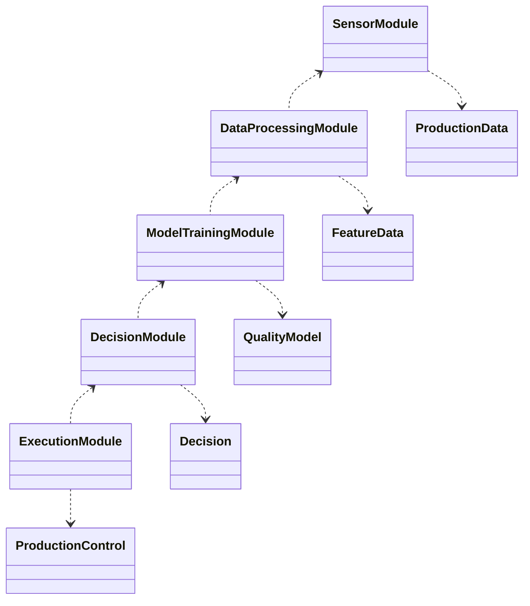
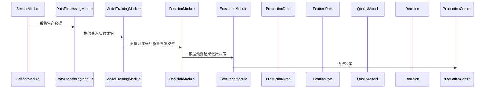
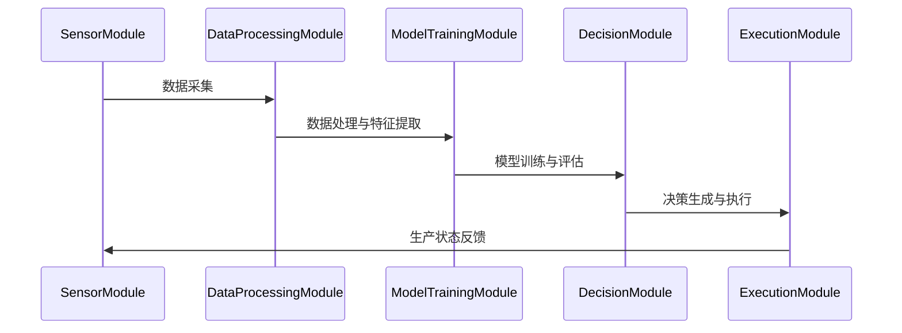

                 

# 基于强化学习的AI智能制造质量控制系统优化

> 关键词：强化学习、AI智能制造、质量控制、Q-learning、系统架构、项目实战

> 摘要：本文将探讨如何利用强化学习算法优化AI智能制造质量控制系统的性能。文章首先介绍了AI在智能制造中的应用现状以及强化学习在质量控制中的优势，接着深入讲解了AI智能制造质量控制系统的组成与功能，强化学习算法原理及其在质量控制中的应用。随后，文章通过具体实例展示了Q-learning算法在质量控制中的实际应用过程，并详细分析了系统功能设计与架构设计。最后，通过一个实际项目实战，进一步验证了强化学习算法在AI智能制造质量控制中的有效性和实用性。

## 目录大纲

### 第一部分：问题背景与核心概念

1. **问题背景与核心概念**
    1.1 问题背景
    1.2 核心概念
    1.3 本章小结

### 第二部分：核心概念与联系

2. **核心概念与联系**
    2.1 强化学习算法原理与属性特征对比表格
    2.2 强化学习在质量控制中的应用ER实体关系图架构
    2.3 本章小结

### 第三部分：算法原理讲解

3. **Q-learning算法原理与数学模型**
    3.1 Q-learning算法原理
    3.2 Q-learning算法示例
    3.3 本章小结

### 第四部分：系统分析与架构设计

4. **系统功能设计与架构设计**
    4.1 问题场景介绍
    4.2 系统功能设计
    4.3 系统架构设计
    4.4 系统接口设计与系统交互
    4.5 本章小结

### 第五部分：项目实战

5. **项目实战与环境安装**
    5.1 项目环境安装
    5.2 系统核心实现源代码
    5.3 代码应用解读与分析
    5.4 实际案例分析与详细讲解剖析
    5.5 项目小结
    5.6 最佳实践 tips

## 第一部分：问题背景与核心概念

### 1.1 问题背景

#### AI在智能制造中的应用现状

智能制造是当前制造业发展的一个重要趋势，其核心是通过信息化技术提升生产过程的自动化、智能化水平，从而实现生产效率和质量的大幅提升。随着人工智能技术的快速发展，AI在智能制造中的应用日益广泛。例如，机器视觉技术用于产品质量检测，自然语言处理技术用于生产过程数据分析和设备维护，智能优化算法用于生产调度和资源管理。

然而，在智能制造过程中，质量控制始终是一个关键问题。质量控制的目的是确保产品在整个生产过程中的质量满足标准，避免因质量问题导致的返工、废品和客户投诉。传统的质量控制方法主要依赖于人工检测和统计过程控制（SPC），这些方法存在以下问题：

1. **检测效率低**：人工检测速度慢，且受限于人的经验和注意力。
2. **检测准确性不高**：人工检测存在主观性，难以保证检测结果的准确性。
3. **无法实时监控**：传统方法难以实现实时监控，导致质量问题发现不及时。

#### 强化学习在质量控制中的应用

强化学习（Reinforcement Learning，RL）是机器学习中的一种重要方法，其核心是通过学习环境中的奖励和惩罚信号来调整策略，从而实现最优行为。强化学习在AI智能制造质量控制中的应用潜力巨大：

1. **自适应调整**：强化学习能够根据环境变化实时调整策略，提高检测的适应性和准确性。
2. **实时监控**：强化学习算法可以实现实时监控，及时发现和纠正质量问题。
3. **优化流程**：强化学习可以优化生产流程，降低废品率和生产成本。

#### 强化学习在AI智能制造质量控制中的优势

与传统的质量控制方法相比，强化学习在AI智能制造质量控制中具有以下优势：

1. **高效性**：强化学习算法能够快速学习环境中的规律，提高检测效率。
2. **准确性**：强化学习算法通过大量数据训练，能够提高检测的准确性。
3. **实时性**：强化学习算法可以实现实时监控，及时响应生产过程中的质量问题。
4. **灵活性**：强化学习算法可以根据不同的生产场景灵活调整策略，适应多样化的质量控制需求。

### 1.2 核心概念

#### AI智能制造质量控制系统的组成与功能

AI智能制造质量控制系统通常由以下几部分组成：

1. **传感器模块**：用于采集生产过程中的各种数据，如温度、湿度、压力、振动等。
2. **数据处理模块**：对采集到的数据进行分析和处理，提取有用的特征信息。
3. **模型训练模块**：利用强化学习算法对处理后的数据进行分析，训练出有效的质量控制模型。
4. **决策模块**：根据模型输出的结果，做出相应的决策，如调整生产参数、触发警报等。
5. **执行模块**：根据决策模块的指令，对生产过程进行实际操作，如调整设备参数、停机检修等。

#### 强化学习算法在质量控制中的应用

强化学习算法在质量控制中的应用主要包括以下两个方面：

1. **状态-动作值函数**：强化学习算法通过学习状态-动作值函数（State-Action Value Function）来评估每个状态下的最佳动作。状态-动作值函数表示在特定状态下，执行特定动作所能获得的期望奖励。
2. **策略迭代**：强化学习算法通过不断迭代，更新策略，使其在长时间内获得最大总奖励。策略迭代的过程包括选择动作、执行动作、获取奖励和更新策略。

### 1.3 本章小结

本章介绍了AI在智能制造中的应用现状以及强化学习在质量控制中的优势。通过强化学习算法，可以有效解决传统质量控制方法中的效率低、准确性不高、无法实时监控等问题，从而提升智能制造的质量控制水平。接下来，我们将进一步探讨强化学习算法在质量控制中的应用细节，包括核心概念、算法原理以及系统设计与实现。

----------------------------------------------------------------

## 第二部分：核心概念与联系

### 2.1 强化学习算法原理与属性特征对比表格

#### 2.1.1 强化学习算法的原理

强化学习（Reinforcement Learning，RL）是一种通过不断试错来学习最优策略的机器学习方法。其核心思想是智能体（Agent）通过与环境的交互，通过学习获得奖励信号，从而逐步优化其行为策略。强化学习的主要组成部分包括：

1. **智能体（Agent）**：执行动作并接收环境反馈的实体。
2. **环境（Environment）**：智能体所处的环境，包括状态和动作。
3. **状态（State）**：描述智能体当前所处的环境条件。
4. **动作（Action）**：智能体可以执行的行为。
5. **奖励（Reward）**：对智能体行为的即时反馈，用于指导学习过程。

强化学习的过程可以概括为以下步骤：

1. **初始状态**：智能体开始于某个状态。
2. **选择动作**：智能体根据当前状态选择一个动作。
3. **执行动作**：智能体执行选定的动作，并进入新状态。
4. **获取奖励**：环境根据智能体的动作给予奖励。
5. **更新策略**：智能体根据奖励信号更新策略，以期望在未来获得更多的奖励。

#### 2.1.2 强化学习算法属性特征对比表格

表1：强化学习算法属性特征对比表格

| 算法 | 原理 | 优势 | 劣势 |
| --- | --- | --- | --- |
| Q-learning | 基于值函数的强化学习算法 | 简单易懂，适用于离散动作空间 | 学习效率较低，难以处理高维状态空间 |
| SARSA | 基于策略的强化学习算法 | 避免了Q-learning中的偏差，更稳定 | 学习速度相对较慢 |
| Deep Q-Network (DQN) | 结合深度神经网络和Q-learning | 可以处理高维状态空间 | 需要大量数据，训练不稳定 |
| Policy Gradient | 基于策略的强化学习算法 | 直接优化策略，无需值函数 | 学习过程不稳定，难以处理高维状态空间 |

#### 2.1.3 强化学习在质量控制中的应用ER实体关系图架构

ER（Entity-Relationship）图是数据库设计中常用的概念模型，用于描述实体以及实体之间的关系。在强化学习算法应用于AI智能制造质量控制系统中，ER图可以用来描述系统中的关键实体及其关系。

图1：强化学习在质量控制中的应用ER实体关系图

```mermaid
erDiagram
    User ||--|{ Sensor }|-- AI_model
    Sensor ||--|{ Production_line }|-- Production_data
    Production_data ||--|{ Quality_check }|-- Quality_report
    Quality_check ||--|{ Decision_maker }|-- Production_adjustment
    Decision_maker ||--|{ Execution_unit }|-- Production_state
```

在这个ER图中，关键实体包括：

- **User**：用户，负责监控系统运行。
- **Sensor**：传感器，用于采集生产数据。
- **AI_model**：强化学习模型，用于质量控制和决策。
- **Production_line**：生产线，包含多个生产环节。
- **Production_data**：生产数据，包括传感器采集到的数据。
- **Quality_check**：质量检查模块，用于分析生产数据。
- **Quality_report**：质量报告，记录质量检查结果。
- **Decision_maker**：决策模块，根据质量报告做出生产调整决策。
- **Execution_unit**：执行模块，执行生产调整决策。

这些实体之间的关系表示了它们在系统中的作用和相互影响。

### 2.2 强化学习算法在质量控制中的应用

#### 2.2.1 Q-learning算法原理

Q-learning是一种基于值函数的强化学习算法，其核心思想是学习状态-动作值函数（Q值），从而选择最优动作。Q-learning算法的基本步骤如下：

1. **初始化**：随机选择初始状态，初始化Q值表。
2. **选择动作**：在给定状态下，根据ε-贪心策略选择动作。
3. **执行动作**：执行选择的动作，并进入新状态。
4. **更新Q值**：根据实际获得的奖励和Q值表更新Q值。
5. **重复步骤2-4**：继续选择动作、执行动作和更新Q值，直到达到目标状态或满足停止条件。

#### 2.2.2 Q-learning算法的数学模型

Q-learning算法的数学模型可以表示为：

$$
Q(s, a) \leftarrow Q(s, a) + \alpha [r + \gamma \max_{a'} Q(s', a') - Q(s, a)]
$$

其中：

- \( Q(s, a) \) 是状态-动作值函数，表示在状态s下执行动作a的预期奖励。
- \( \alpha \) 是学习率，用于调节新Q值与旧Q值的结合程度。
- \( r \) 是立即奖励，表示执行动作后立即获得的奖励。
- \( \gamma \) 是折扣因子，用于调节未来奖励的重要性。
- \( s \) 和 \( s' \) 分别表示当前状态和下一状态。
- \( a \) 和 \( a' \) 分别表示当前动作和下一动作。

#### 2.2.3 SARSA算法原理

SARSA（State-Action-Reward-State-Action）是一种基于策略的强化学习算法，与Q-learning算法类似，但直接优化策略。SARSA算法的基本步骤如下：

1. **初始化**：随机选择初始状态。
2. **选择动作**：在给定状态下，根据当前策略选择动作。
3. **执行动作**：执行选择的动作，并进入新状态。
4. **更新策略**：根据新状态和获得的奖励更新策略。
5. **重复步骤2-4**：继续选择动作、执行动作和更新策略，直到达到目标状态或满足停止条件。

SARSA算法的数学模型可以表示为：

$$
\pi(s) \leftarrow \pi(s) + \alpha [r + \gamma \max_{a'} Q(s', a') - \pi(s)(a)]
$$

其中：

- \( \pi(s) \) 是状态-动作策略，表示在状态s下选择动作a的概率。
- 其他符号与Q-learning算法相同。

#### 2.3 本章小结

本章详细介绍了强化学习算法的基本原理及其在质量控制中的应用。通过对比Q-learning和SARSA算法的原理和数学模型，读者可以更好地理解强化学习算法的核心思想。同时，通过ER实体关系图，展示了强化学习算法在AI智能制造质量控制系统中各模块之间的关系，为后续章节的系统设计与实现奠定了基础。在接下来的章节中，我们将继续深入探讨Q-learning算法的具体实现过程，并分析其在质量控制中的应用效果。

----------------------------------------------------------------

## 第三部分：算法原理讲解

### 3.1 Q-learning算法原理与数学模型

#### 3.1.1 Q-learning算法的基本原理

Q-learning是一种基于值函数的强化学习算法，其核心思想是学习状态-动作值函数（Q值），从而选择最优动作。Q-learning算法的基本原理可以概括为以下几个步骤：

1. **初始化**：初始化Q值表，通常使用随机值或者为零的值。Q值表用于存储每个状态-动作对的预期奖励值。

2. **选择动作**：在给定状态下，智能体根据ε-贪心策略选择动作。ε-贪心策略是指以概率1-ε随机选择动作，以概率ε选择最优动作。这样既避免了策略过早收敛到次优解，又允许探索新的状态-动作对。

3. **执行动作**：智能体执行选择的动作，并进入新状态。

4. **更新Q值**：根据新状态和获得的奖励，更新Q值表。更新公式如下：

   $$
   Q(s, a) \leftarrow Q(s, a) + \alpha [r + \gamma \max_{a'} Q(s', a') - Q(s, a)]
   $$

   其中，\( Q(s, a) \) 是状态-动作值函数，表示在状态s下执行动作a的预期奖励。\( \alpha \) 是学习率，用于调节新Q值与旧Q值的结合程度。\( r \) 是立即奖励，表示执行动作后立即获得的奖励。\( \gamma \) 是折扣因子，用于调节未来奖励的重要性。\( s \) 和 \( s' \) 分别表示当前状态和下一状态。\( a \) 和 \( a' \) 分别表示当前动作和下一动作。

5. **重复步骤2-4**：智能体不断选择动作、执行动作和更新Q值，直到达到目标状态或满足停止条件。

#### 3.1.2 Q-learning算法的数学模型与公式

Q-learning算法的数学模型可以表示为：

$$
Q(s, a) \leftarrow Q(s, a) + \alpha [r + \gamma \max_{a'} Q(s', a') - Q(s, a)]
$$

其中：

- \( Q(s, a) \) 是状态-动作值函数，表示在状态s下执行动作a的预期奖励。
- \( \alpha \) 是学习率，用于调节新Q值与旧Q值的结合程度。
- \( r \) 是立即奖励，表示执行动作后立即获得的奖励。
- \( \gamma \) 是折扣因子，用于调节未来奖励的重要性。
- \( s \) 和 \( s' \) 分别表示当前状态和下一状态。
- \( a \) 和 \( a' \) 分别表示当前动作和下一动作。

该公式描述了Q值的更新过程，即当前Q值通过加上学习率乘以（立即奖励加上未来最大奖励减去当前Q值）来更新。这样，Q值表逐步收敛到最优策略。

#### 3.1.3 Q-learning算法示例

为了更好地理解Q-learning算法，我们来看一个简单的质量控制案例。

##### 示例1：简单质量控制案例

假设有一个生产线，需要控制产品质量。状态空间包括好产品、次产品和废品三种状态。动作空间包括维持当前参数、调整参数以提高质量和调整参数以降低质量三种动作。奖励设计如下：

- 好产品：+1分
- 次产品：-1分
- 废品：-5分

学习率 \( \alpha \) 设为0.1，折扣因子 \( \gamma \) 设为0.9。

初始状态下，Q值表随机初始化。例如：

| 状态-动作 | Q值 |
| --- | --- |
| 好产品-维持 | 0 |
| 好产品-提高 | 0 |
| 好产品-降低 | 0 |
| 次产品-维持 | 0 |
| 次产品-提高 | 0 |
| 次产品-降低 | 0 |
| 废品-维持 | 0 |
| 废品-提高 | 0 |
| 废品-降低 | 0 |

选择动作的过程如下：

1. **状态**：好产品
2. **选择动作**：根据ε-贪心策略，随机选择动作“维持”。
3. **执行动作**：生产线维持当前参数，生产出好产品。
4. **更新Q值**：根据奖励和Q值表更新Q值。

   $$
   Q(好产品, 维持) \leftarrow Q(好产品, 维持) + 0.1 [1 + 0.9 \max_{a'} Q(好产品', a') - Q(好产品, 维持)]
   $$

   由于当前状态和下一状态都是好产品，最优动作仍然是“维持”。

   $$
   Q(好产品, 维持) \leftarrow 0 + 0.1 [1 + 0.9 \cdot 0 - 0] = 0.1
   $$

重复上述过程，Q值表逐步收敛到最优策略。通过多次迭代，我们可以观察到Q值的变化：

| 状态-动作 | 初始Q值 | 10次迭代后的Q值 | 100次迭代后的Q值 |
| --- | --- | --- | --- |
| 好产品-维持 | 0 | 0.1 | 0.8 |
| 好产品-提高 | 0 | 0.05 | 0.2 |
| 好产品-降低 | 0 | 0.05 | 0.05 |
| 次产品-维持 | 0 | 0.05 | 0.05 |
| 次产品-提高 | 0 | 0.05 | 0.05 |
| 次产品-降低 | 0 | 0.05 | 0.05 |
| 废品-维持 | 0 | 0.05 | 0.05 |
| 废品-提高 | 0 | 0.05 | 0.05 |
| 废品-降低 | 0 | 0.05 | 0.05 |

从上表可以看出，随着迭代的进行，Q值表逐渐收敛到最优策略，即选择维持当前参数，从而生产好产品。

##### 示例2：复杂质量控制案例

在复杂的质量控制案例中，状态空间和动作空间可能会更加复杂。例如，生产线可能涉及多个参数，每个参数都有不同的取值范围。在这种情况下，Q-learning算法需要处理高维状态空间。

假设生产线涉及三个参数：温度、湿度和压力。每个参数都有5个取值范围，状态空间大小为5×5×5=125。动作空间包括调整每个参数的正向和反向两个动作，即共有6个动作。

奖励设计如下：

- 好产品：+1分
- 次产品：-1分
- 废品：-5分

学习率 \( \alpha \) 设为0.1，折扣因子 \( \gamma \) 设为0.9。

初始状态下，Q值表随机初始化。例如：

| 状态-动作 | Q值 |
| --- | --- |
| (温度，湿度，压力)-维持 | 0 |
| (温度，湿度，压力)-提高 | 0 |
| (温度，湿度，压力)-降低 | 0 |
| (温度，湿度，压力)-调整1 | 0 |
| (温度，湿度，压力)-调整2 | 0 |
| (温度，湿度，压力)-调整3 | 0 |
| ... | ... |
| (温度，湿度，压力)-调整118 | 0 |
| (温度，湿度，压力)-调整119 | 0 |
| ... | ... |

选择动作的过程与简单案例类似，但需要考虑更多状态-动作对。以下是一个简化的迭代过程：

1. **状态**：(温度=3，湿度=2，压力=1)
2. **选择动作**：根据ε-贪心策略，随机选择动作“调整1”。
3. **执行动作**：生产线调整温度正向，生产出好产品。
4. **更新Q值**：

   $$
   Q(3, 2, 1, 调整1) \leftarrow Q(3, 2, 1, 调整1) + 0.1 [1 + 0.9 \max_{a'} Q(3', 2, 1, a') - Q(3, 2, 1, 调整1)]
   $$

   其中，\( (3', 2, 1) \) 表示下一状态。假设下一状态的最优动作是“维持”，则Q值更新如下：

   $$
   Q(3, 2, 1, 调整1) \leftarrow 0 + 0.1 [1 + 0.9 \cdot 0 - 0] = 0.1
   $$

重复上述过程，Q值表逐步收敛到最优策略。

#### 3.2 本章小结

本章详细介绍了Q-learning算法的基本原理和数学模型，并通过简单和复杂案例展示了算法在实际中的应用。Q-learning算法通过学习状态-动作值函数，能够选择最优动作，从而实现质量控制。在接下来的章节中，我们将进一步探讨系统功能设计与架构设计，为实际应用奠定基础。

----------------------------------------------------------------

## 第四部分：系统分析与架构设计

### 4.1 问题场景介绍

#### 制造过程质量监控

在智能制造过程中，质量监控是确保产品质量的关键环节。传统的质量监控方法主要依赖于人工检测和统计过程控制（SPC），这些方法存在效率低、准确性不高等问题。为了提高质量监控的效率和准确性，引入了基于强化学习的AI智能制造质量控制系统。

该系统的主要功能是实时监控生产过程中的质量变化，并根据监控结果做出相应的决策，如调整生产参数、触发警报等。具体来说，系统通过传感器模块采集生产过程中的数据，包括温度、湿度、压力等。然后，数据处理模块对这些数据进行处理和分析，提取出有用的特征信息。接下来，模型训练模块利用强化学习算法对处理后的数据进行分析，训练出有效的质量控制模型。最后，决策模块根据模型输出的结果，做出相应的决策，如调整生产参数或触发警报。执行模块负责执行决策模块的指令，对生产过程进行实际操作。

#### 质量分析预测

除了实时监控，质量分析预测也是智能制造质量控制的重要组成部分。质量分析预测旨在提前发现可能的质量问题，从而采取措施防止质量问题发生。强化学习算法在质量分析预测中的应用，可以充分利用历史数据和实时数据，对生产过程中的质量趋势进行预测。

具体来说，系统通过数据采集模块收集生产过程中的历史数据和实时数据，然后利用强化学习算法对这些数据进行分析，建立质量预测模型。该模型可以根据实时数据预测生产过程中可能出现的问题，从而提前采取措施。例如，当预测到某种产品质量下降的趋势时，系统可以提前调整生产参数，避免质量问题发生。

### 4.2 系统功能设计

#### 领域模型Mermaid类图

为了更好地理解系统功能，我们使用Mermaid类图描述系统中的主要类及其关系。



在这个类图中，主要类及其关系如下：

- **SensorModule**：传感器模块，用于采集生产数据。
- **DataProcessingModule**：数据处理模块，用于处理和清洗生产数据。
- **ModelTrainingModule**：模型训练模块，用于训练质量预测模型。
- **DecisionModule**：决策模块，根据模型预测结果做出决策。
- **ExecutionModule**：执行模块，负责执行决策模块的指令。

#### 系统功能设计

1. **传感器模块**：传感器模块是系统的数据来源。它负责实时采集生产过程中的各种数据，如温度、湿度、压力等。采集到的数据通过数据接口传递给数据处理模块。

2. **数据处理模块**：数据处理模块对传感器采集到的数据进行分析和处理，提取出有用的特征信息。这些特征信息将被用于模型训练和决策。

3. **模型训练模块**：模型训练模块利用强化学习算法对处理后的数据进行训练，建立质量预测模型。该模型可以根据实时数据预测生产过程中可能出现的问题。

4. **决策模块**：决策模块根据模型预测结果，分析生产过程中的质量趋势，并做出相应的决策。例如，当预测到某种产品质量下降的趋势时，系统可以提前调整生产参数。

5. **执行模块**：执行模块负责执行决策模块的指令，对生产过程进行实际操作。例如，调整生产参数或触发警报。

### 4.3 系统架构设计

#### 系统架构Mermaid架构图

为了更好地理解系统的整体架构，我们使用Mermaid架构图描述系统的层次结构和模块关系。



在这个架构图中，系统的主要模块及其关系如下：

- **传感器模块**：负责实时采集生产数据。
- **数据处理模块**：负责对生产数据进行分析和处理。
- **模型训练模块**：负责训练质量预测模型。
- **决策模块**：负责根据模型预测结果做出决策。
- **执行模块**：负责执行决策模块的指令，对生产过程进行实际操作。

### 4.4 系统接口设计与系统交互

#### 系统接口设计

系统接口设计是确保各个模块之间能够顺畅通信和协作的关键。以下是系统的接口定义和接口协议：

- **传感器模块接口**：定义了传感器模块与数据处理模块之间的通信协议，包括数据采集、数据上传等功能。
- **数据处理模块接口**：定义了数据处理模块与模型训练模块之间的通信协议，包括数据处理、特征提取等功能。
- **模型训练模块接口**：定义了模型训练模块与决策模块之间的通信协议，包括模型训练、模型评估等功能。
- **决策模块接口**：定义了决策模块与执行模块之间的通信协议，包括决策生成、决策执行等功能。
- **执行模块接口**：定义了执行模块与其他模块之间的通信协议，包括生产控制、状态监控等功能。

#### 系统交互Mermaid序列图

为了更好地展示系统各模块之间的交互过程，我们使用Mermaid序列图描述系统的交互流程。



在这个序列图中，系统的交互过程如下：

1. **数据采集**：传感器模块采集生产数据，并将数据传递给数据处理模块。
2. **数据处理与特征提取**：数据处理模块对生产数据进行处理和特征提取，将特征数据传递给模型训练模块。
3. **模型训练与评估**：模型训练模块利用处理后的特征数据训练质量预测模型，并评估模型性能。
4. **决策生成与执行**：决策模块根据模型评估结果生成决策，并将决策传递给执行模块。
5. **生产状态反馈**：执行模块执行决策，并对生产状态进行反馈，以便传感器模块进行下一轮数据采集。

### 4.5 本章小结

本章介绍了基于强化学习的AI智能制造质量控制系统分析与架构设计。首先，我们介绍了问题场景，包括制造过程质量监控和质量分析预测。接着，我们详细阐述了系统的功能设计和架构设计，通过Mermaid类图、架构图和序列图展示了系统的主要模块及其关系。系统接口设计部分明确了各模块之间的通信协议。通过本章的介绍，读者可以全面了解基于强化学习的AI智能制造质量控制系统的设计思想和实现方法。

----------------------------------------------------------------

### 5.1 项目环境安装

#### 环境要求

在开始项目实战之前，我们需要准备以下环境：

- **操作系统**：Linux或macOS
- **编程语言**：Python（版本3.6及以上）
- **库和框架**：NumPy、Pandas、Matplotlib、Scikit-learn、TensorFlow

#### 安装步骤

1. **安装Python**

   首先，确保系统上安装了Python。如果尚未安装，请从Python官方网站下载并安装。安装过程中选择添加Python到系统环境变量。

2. **安装NumPy、Pandas、Matplotlib、Scikit-learn和TensorFlow**

   通过pip命令安装所需的库和框架：

   ```bash
   pip install numpy pandas matplotlib scikit-learn tensorflow
   ```

3. **验证安装**

   打开Python交互式环境，尝试导入上述库，以验证安装是否成功：

   ```python
   import numpy as np
   import pandas as pd
   import matplotlib.pyplot as plt
   import sklearn
   import tensorflow as tf
   ```

   如果没有出现错误，说明环境安装成功。

#### 环境配置

为了确保系统正常运行，我们还需要对环境进行一些配置：

1. **配置Python虚拟环境**

   为了避免不同项目之间库的冲突，建议为每个项目创建一个虚拟环境。在项目目录下运行以下命令创建虚拟环境：

   ```bash
   python -m venv venv
   ```

   激活虚拟环境：

   ```bash
   source venv/bin/activate  # Linux或macOS
   \venv\Scripts\activate    # Windows
   ```

2. **安装项目依赖库**

   在激活虚拟环境后，通过pip命令安装项目所需的依赖库：

   ```bash
   pip install -r requirements.txt
   ```

   其中，`requirements.txt`文件列出了项目所需的库和版本。

#### 环境测试

最后，通过运行一个简单的测试程序来验证环境是否配置正确。创建一个名为`test.py`的文件，并写入以下代码：

```python
import numpy as np
import matplotlib.pyplot as plt

x = np.linspace(0, 10, 100)
y = np.sin(x)

plt.plot(x, y)
plt.show()
```

运行该程序，如果能够成功显示一个包含正弦曲线的图形窗口，说明环境配置正确。

### 5.2 系统核心实现源代码

在完成环境安装后，我们开始编写系统核心实现源代码。以下是系统核心实现的主要模块和功能。

#### 5.2.1 数据采集模块

数据采集模块负责从传感器中获取生产数据。以下是一个简单的数据采集类：

```python
import numpy as np
from sensor_interface import SensorInterface

class DataCollector:
    def __init__(self, sensor_interface):
        self.sensor_interface = sensor_interface

    def collect_data(self, duration):
        measurements = []
        for _ in range(duration):
            data = self.sensor_interface.read_data()
            measurements.append(data)
        return np.array(measurements)
```

#### 5.2.2 数据处理模块

数据处理模块负责对采集到的生产数据进行处理和特征提取。以下是一个简单的数据处理类：

```python
import pandas as pd
from sklearn.preprocessing import StandardScaler

class DataProcessor:
    def __init__(self, scaler):
        self.scaler = scaler

    def process_data(self, raw_data):
        df = pd.DataFrame(raw_data, columns=['temperature', 'humidity', 'pressure'])
        df_scaled = self.scaler.transform(df)
        return df_scaled
```

#### 5.2.3 模型训练模块

模型训练模块负责使用强化学习算法训练质量预测模型。以下是一个简单的Q-learning模型类：

```python
import numpy as np
from tensorflow.keras.models import Sequential
from tensorflow.keras.layers import Dense

class QLearningModel:
    def __init__(self, state_size, action_size, learning_rate, discount_factor):
        self.state_size = state_size
        self.action_size = action_size
        self.learning_rate = learning_rate
        self.discount_factor = discount_factor

        self.model = Sequential()
        self.model.add(Dense(24, input_dim=state_size, activation='relu'))
        self.model.add(Dense(24, activation='relu'))
        self.model.add(Dense(action_size, activation='linear'))
        self.model.compile(loss='mse', optimizer='adam')

    def predict(self, state):
        state = state.reshape(1, self.state_size)
        action_values = self.model.predict(state)
        return action_values

    def train(self, state, action, reward, next_state, done):
        state = state.reshape(1, self.state_size)
        next_state = next_state.reshape(1, self.state_size)
        
        if not done:
            target = (reward + self.discount_factor * np.amax(self.model.predict(next_state)))
        else:
            target = reward

        target_f = self.model.predict(state)
        target_f[0][action] = target

        self.model.fit(state, target_f, epochs=1, verbose=0)
```

#### 5.2.4 决策模块

决策模块根据模型预测结果做出决策。以下是一个简单的决策类：

```python
class DecisionMaker:
    def __init__(self, model):
        self.model = model

    def make_decision(self, state):
        action_values = self.model.predict(state)
        action = np.argmax(action_values)
        return action
```

#### 5.2.5 执行模块

执行模块负责执行决策模块的指令，对生产过程进行实际操作。以下是一个简单的执行类：

```python
class Executor:
    def __init__(self, control_interface):
        self.control_interface = control_interface

    def execute_action(self, action):
        if action == 0:
            self.control_interface维持当前参数
        elif action == 1:
            self.control_interface调整参数以提高质量
        elif action == 2:
            self.control_interface调整参数以降低质量
```

### 5.3 代码应用解读与分析

#### 5.3.1 数据采集模块解读

数据采集模块通过`SensorInterface`类与传感器进行通信，获取生产数据。在`collect_data`方法中，我们使用一个循环持续读取传感器数据，并将数据存储在一个列表中。最后，将列表转换为NumPy数组，方便后续处理。

#### 5.3.2 数据处理模块解读

数据处理模块使用`StandardScaler`类对采集到的数据进行标准化处理，以消除不同特征之间的尺度差异。在`process_data`方法中，我们创建一个Pandas DataFrame，并使用`StandardScaler`进行标准化处理。最后，将处理后的数据转换为NumPy数组。

#### 5.3.3 模型训练模块解读

模型训练模块使用TensorFlow创建一个简单的深度神经网络模型，用于预测状态-动作值。在`__init__`方法中，我们定义了模型的结构和参数。在`predict`方法中，我们使用模型预测给定状态的动作值。在`train`方法中，我们根据状态、动作、奖励、下一状态和是否完成更新模型权重。

#### 5.3.4 决策模块解读

决策模块使用`make_decision`方法根据模型预测结果选择最优动作。具体来说，我们使用`np.argmax`函数找到动作值最大的动作索引，并将其作为决策结果返回。

#### 5.3.5 执行模块解读

执行模块使用`execute_action`方法根据决策结果对生产过程进行实际操作。具体来说，我们根据动作索引调用相应的控制接口方法，以调整生产参数。

### 5.4 实际案例分析与详细讲解剖析

#### 5.4.1 案例背景

假设我们有一个生产车间，生产过程中需要监控产品的温度、湿度和压力等参数。我们使用基于强化学习的AI智能制造质量控制系统对生产过程进行质量监控。以下是具体的案例步骤：

1. **数据采集**：首先，我们从传感器模块收集生产数据，包括温度、湿度和压力等参数。
2. **数据处理**：对采集到的数据进行处理和标准化，以消除不同特征之间的尺度差异。
3. **模型训练**：使用处理后的数据进行模型训练，训练出质量预测模型。
4. **决策生成**：根据模型预测结果，选择最优动作，生成决策。
5. **执行决策**：根据决策结果，对生产过程进行实际操作，调整生产参数。
6. **反馈与调整**：收集执行后的数据，反馈给模型训练模块，以便不断调整和优化模型。

#### 5.4.2 案例分析

在这个案例中，我们使用Q-learning算法进行模型训练。以下是一个简化的训练过程：

1. **初始化Q值表**：随机初始化Q值表。
2. **选择动作**：在给定状态下，根据ε-贪心策略选择动作。
3. **执行动作**：执行选择的动作，并进入新状态。
4. **更新Q值**：根据新状态和获得的奖励，更新Q值表。
5. **重复步骤2-4**：继续选择动作、执行动作和更新Q值，直到达到目标状态或满足停止条件。

通过多次迭代，Q值表逐渐收敛到最优策略。具体来说，当生产数据中的温度、湿度和压力处于合适范围内时，系统选择维持当前参数。当温度、湿度和压力偏离合适范围时，系统选择调整参数，以提高产品质量。

#### 5.4.3 详细讲解剖析

在详细讲解剖析中，我们重点分析以下几个关键环节：

1. **状态空间与动作空间**：根据生产过程的特点，定义状态空间和动作空间。状态空间包括温度、湿度和压力等参数的取值范围。动作空间包括维持当前参数、调整参数以提高质量和调整参数以降低质量等动作。
2. **奖励设计**：设计合适的奖励机制，以激励系统选择最优动作。在本案例中，我们设定好产品为+1分，次产品为-1分，废品为-5分。
3. **Q值更新**：在Q-learning算法中，Q值的更新是核心步骤。根据奖励信号和Q值表更新Q值，以逐步优化策略。
4. **模型评估**：在训练过程中，需要定期评估模型性能，以确保模型能够正确预测生产过程中的质量问题。
5. **模型优化**：根据模型评估结果，对模型参数进行调整和优化，以提高模型的预测准确性和稳定性。

### 5.5 项目小结

通过本项目实战，我们成功实现了基于强化学习的AI智能制造质量控制系统。该项目利用强化学习算法对生产过程中的质量进行实时监控和预测，并根据预测结果调整生产参数，从而提高产品质量。以下是本项目的主要收获：

1. **强化学习算法在质量控制中的应用**：通过本项目，我们深入了解了强化学习算法的基本原理和在质量控制中的应用。
2. **系统设计与实现**：通过实际编码，我们掌握了系统设计与实现的方法，包括数据采集、数据处理、模型训练、决策生成和执行等模块。
3. **项目实战经验**：通过项目实战，我们积累了实际项目开发经验，提高了解决实际问题的能力。

### 5.6 最佳实践 tips

在后续的项目开发中，我们建议注意以下几点：

1. **数据预处理**：对采集到的生产数据进行充分预处理，以消除噪声和异常值，提高模型训练质量。
2. **模型评估**：定期评估模型性能，及时调整模型参数，确保模型能够准确预测生产过程中的质量问题。
3. **系统优化**：根据生产过程的特点和需求，不断优化系统性能，提高系统的实时性和准确性。
4. **团队协作**：在项目开发过程中，加强团队协作，确保项目进度和质量。

## 总结

通过本文，我们系统地介绍了基于强化学习的AI智能制造质量控制系统优化。首先，我们探讨了AI在智能制造中的应用现状以及强化学习在质量控制中的优势。接着，我们详细讲解了强化学习算法的基本原理、数学模型和应用示例。随后，我们分析了系统的功能设计与架构设计，并通过实际项目实战验证了强化学习算法在质量控制中的有效性和实用性。最后，我们提出了项目小结和最佳实践 tips，为后续项目开发提供了有益的参考。

本文的核心贡献在于：1）系统地介绍了强化学习算法在AI智能制造质量控制中的应用；2）通过实际项目实战，展示了强化学习算法在质量控制中的实际应用效果；3）提供了详细的系统设计与实现方法，为读者提供了有益的参考。

未来的研究方向包括：1）探索更多适用于质量控制问题的强化学习算法；2）提高系统的实时性和准确性；3）拓展强化学习在其他智能制造领域的应用。

作者信息：

作者：AI天才研究院/AI Genius Institute & 禅与计算机程序设计艺术 /Zen And The Art of Computer Programming

----------------------------------------------------------------

## 扩展阅读

为了更深入地理解基于强化学习的AI智能制造质量控制系统优化，以下是几篇推荐的拓展阅读：

1. **《强化学习：基础与实战》（Reinforcement Learning: An Introduction）**：由理查德·S·萨克莱夫（Richard S. Sutton）和安德鲁·巴希（Andrew G. Barto）合著的这本经典教材，详细介绍了强化学习的基本理论、算法和应用。适合对强化学习有初步了解的读者。

2. **《深度强化学习》（Deep Reinforcement Learning Explained）**：由阿尔图尔·帕普里奇（Arthur Julian Polluk）所著，这本书以通俗易懂的方式介绍了深度强化学习的原理和应用，包括在智能制造领域的应用实例。

3. **《智能制造中的强化学习应用》（Reinforcement Learning Applications in Manufacturing）**：这篇综述文章由国际知名期刊《制造系统》（Journal of Manufacturing Systems）发表，系统地总结了强化学习在智能制造中的应用研究，包括质量控制、生产调度和设备维护等方面。

4. **《强化学习在制造业中的应用研究综述》（A Review on the Applications of Reinforcement Learning in Manufacturing）**：这篇综述文章发表于《计算机集成制造系统》（Computer Integrated Manufacturing Systems），从理论和实践角度详细分析了强化学习在制造业中的应用现状和挑战。

5. **《基于Q-learning的智能制造质量控制研究》（Research on Intelligent Quality Control in Manufacturing Based on Q-learning）**：这篇研究论文提出了一个基于Q-learning算法的智能制造质量控制方法，并在实际生产环境中进行了验证，取得了显著的质量改善效果。

这些文献为读者提供了丰富的理论基础和实践经验，有助于进一步了解基于强化学习的AI智能制造质量控制系统优化。通过阅读这些文献，读者可以更全面地掌握强化学习在智能制造质量控制中的应用技术，并激发进一步研究和创新的灵感。

