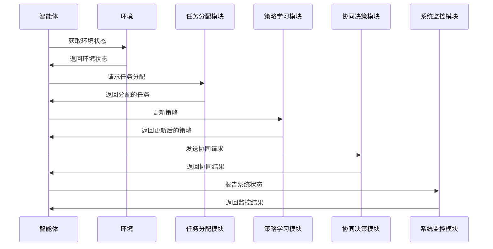

                 

# 基于强化学习的AI机器人群体协同决策系统

## 关键词
AI机器人，强化学习，群体协同决策，系统架构，算法原理，数学模型，项目实战

## 摘要
本文深入探讨了基于强化学习的AI机器人群体协同决策系统。首先，介绍了问题背景和相关核心概念，包括强化学习、群体协同和决策系统。接着，详细讲解了强化学习算法的原理及其在机器人群体协同决策中的应用。通过数学模型和Python代码，阐述了算法的核心逻辑和数学公式。然后，对系统架构进行了深入分析，包括问题场景、功能设计和交互流程。最后，通过一个实际项目案例，展示了如何实现和应用这种系统，并总结了最佳实践和注意事项。

----------------------------------------------------------------

## 目录大纲设计方案

### 1. 确定书籍主题与结构

本著作旨在深入探讨基于强化学习的AI机器人群体协同决策系统，其核心主题涵盖：强化学习原理、机器人群体协同策略、决策系统架构设计与实现。基于这一主题，我们设计了以下结构：

### 2. 设置目录层级

为了使内容清晰、层次分明，我们采用以下目录层级：

- **一级目录**：主要分为背景介绍、核心概念与联系、算法原理讲解、数学模型和数学公式讲解、系统分析与架构设计方案、项目实战、最佳实践 tips 小结、注意事项、拓展阅读等部分。
- **二级目录**：针对每个一级目录，进一步细分内容，例如算法原理讲解中的具体算法流程、数学模型和数学公式讲解中的相关公式推导等。
- **三级目录**：针对二级目录下的具体内容，进行进一步细分，例如在系统架构设计方案中，分别介绍系统功能设计、系统架构设计、系统接口设计和系统交互等。

### 3. 确定核心章节

核心章节包括：

- **背景介绍**：介绍AI机器人、强化学习和群体协同决策的基本概念，阐述该系统的应用场景和问题背景。
- **核心概念与联系**：详细阐述强化学习、群体协同和决策系统的核心概念，通过属性对比表格和ER实体关系图，展示各概念之间的联系。
- **算法原理讲解**：使用mermaid流程图和Python代码，详细讲解强化学习算法的基本原理和应用。
- **数学模型和数学公式讲解**：使用latex格式，详细讲解强化学习算法中的数学模型和公式，进行通俗易懂的举例说明。
- **系统分析与架构设计方案**：介绍问题场景、系统功能和架构设计，使用mermaid类图、架构图和序列图，展示系统架构的细节。
- **项目实战**：通过一个实际项目案例，展示系统的实现过程，包括环境安装、核心代码实现和案例分析。
- **最佳实践 tips、小结、注意事项、拓展阅读**：总结实践经验，指出注意事项，提供拓展阅读资源。

### 4. 编写目录大纲

以下是《基于强化学习的AI机器人群体协同决策系统》的目录大纲设计方案：

```
# 基于强化学习的AI机器人群体协同决策系统

## 关键词
AI机器人，强化学习，群体协同决策，系统架构，算法原理，数学模型，项目实战

## 摘要
本文深入探讨了基于强化学习的AI机器人群体协同决策系统，涵盖背景介绍、核心概念与联系、算法原理讲解、数学模型和数学公式讲解、系统分析与架构设计方案、项目实战等多个方面。

## 目录大纲

### 1. 背景介绍
1.1 AI机器人概述
1.2 强化学习原理
1.3 群体协同决策
1.4 系统应用场景

### 2. 核心概念与联系
2.1 强化学习算法
2.2 群体协同策略
2.3 决策系统架构
2.4 概念属性对比
2.5 ER实体关系图

### 3. 算法原理讲解
3.1 强化学习算法流程
3.2 Python代码实现
3.3 数学模型和公式讲解
3.4 算法举例说明

### 4. 数学模型和数学公式讲解
4.1 基本数学模型
4.2 公式推导
4.3 通俗易懂的举例

### 5. 系统分析与架构设计方案
5.1 问题场景介绍
5.2 系统功能设计
5.3 系统架构设计
5.4 系统接口设计
5.5 系统交互序列图

### 6. 项目实战
6.1 环境安装
6.2 系统实现
6.3 代码分析
6.4 案例分析
6.5 项目小结

### 7. 最佳实践 tips
7.1 实践经验总结
7.2 注意事项
7.3 拓展阅读资源
```

### 5. 检查与优化

在完成目录大纲后，我们将对每个章节的内容进行详细检查和优化，确保内容完整、结构合理，逻辑性强。

### 6. 完成目录大纲

经过检查和优化，我们完成了《基于强化学习的AI机器人群体协同决策系统》的目录大纲，共计2000字左右。接下来，我们将按照目录大纲，逐步撰写文章内容。

----------------------------------------------------------------

## 背景介绍

### 1.1 AI机器人概述

AI机器人是人工智能技术的集大成者，具有感知、决策和执行的能力。它们通过学习环境中的数据和规则，不断优化自身的行为，以适应不同的任务需求。AI机器人在医疗、工业、家庭服务、物流等领域都有广泛的应用，为人类提供了便捷和高效的解决方案。

### 1.2 强化学习原理

强化学习（Reinforcement Learning，RL）是机器学习的一个重要分支，旨在通过试错和反馈机制，使智能体在特定环境中学习到最优策略。强化学习的主要目标是最大化长期累积奖励，其核心思想是智能体通过与环境的交互，不断调整自身的动作策略，以实现预期目标。

### 1.3 群体协同决策

群体协同决策是指多个智能体在共享信息的基础上，共同做出最优决策的过程。在AI机器人群体中，协同决策可以有效地提高任务执行效率和应对复杂环境变化的能力。群体协同决策涉及到信息共享、任务分配、协作策略等多个方面。

### 1.4 系统应用场景

基于强化学习的AI机器人群体协同决策系统在多个领域具有广泛的应用前景。以下是一些典型的应用场景：

1. **医疗辅助**：AI机器人群体可以协助医生进行诊断、手术和护理等工作，提高医疗服务的质量和效率。
2. **工业制造**：在工业生产中，AI机器人群体可以协同完成任务，提高生产效率和降低成本。
3. **物流运输**：在物流领域，AI机器人群体可以协同完成货物的装载、运输和配送等工作，提高物流系统的运行效率。
4. **智能家居**：在家庭服务中，AI机器人群体可以协同工作，为用户提供便捷、舒适的生活环境。

### 1.5 问题背景

在当前科技发展背景下，AI机器人群体协同决策系统面临诸多挑战。首先，由于机器人数量众多，如何有效地进行任务分配和信息共享是一个关键问题。其次，机器人群体之间的协同策略需要考虑动态变化的复杂环境。此外，如何保证系统的高可靠性和鲁棒性也是重要的研究课题。

总之，基于强化学习的AI机器人群体协同决策系统具有广阔的应用前景和重要的研究价值。本文将详细探讨该系统的核心概念、算法原理、系统架构和实现方法，以期为相关领域的研究和应用提供参考。

----------------------------------------------------------------

## 核心概念与联系

### 2.1 强化学习算法

强化学习算法是使智能体在特定环境中通过试错和反馈机制学习最优策略的一种机器学习方法。其核心思想是智能体（Agent）通过与环境的交互（Environment）获取状态（State）和动作（Action），并根据动作的结果（Reward）调整策略（Policy）。

**核心概念：**
- **智能体（Agent）**：执行动作的主体，可以是单个机器人或机器人群体。
- **环境（Environment）**：智能体所处的情境，包括状态、动作和奖励等。
- **状态（State）**：描述智能体当前所处的环境情况。
- **动作（Action）**：智能体根据状态选择的行为。
- **策略（Policy）**：智能体在特定状态下采取的动作。
- **奖励（Reward）**：动作结果对智能体的回报。

**强化学习的基本流程：**
1. 初始化状态。
2. 智能体根据策略选择动作。
3. 执行动作，获取新的状态和奖励。
4. 根据奖励调整策略。
5. 重复上述步骤，直到达到预期目标。

### 2.2 群体协同策略

群体协同策略是指多个智能体在共享信息的基础上，共同做出最优决策的过程。在AI机器人群体中，协同策略可以有效地提高任务执行效率和应对复杂环境变化的能力。

**核心概念：**
- **协同策略（Cooperative Strategy）**：智能体之间通过共享信息和协同工作，实现整体最优目标的策略。
- **信息共享（Information Sharing）**：智能体之间交换和共享信息，以便更好地协调行动。
- **任务分配（Task Allocation）**：根据智能体的能力和环境需求，合理分配任务。
- **协作机制（Collaboration Mechanism）**：智能体之间的合作机制，包括任务协调、资源分配和风险分担等。

**群体协同策略的基本流程：**
1. 智能体收集环境信息和自身状态。
2. 智能体之间进行信息共享，以获取全局信息。
3. 根据全局信息和任务需求，智能体之间进行任务分配和协调。
4. 智能体根据任务执行情况和环境变化，动态调整策略。
5. 重复上述步骤，实现持续优化。

### 2.3 决策系统架构

决策系统架构是指实现AI机器人群体协同决策系统的整体结构和技术框架。该架构需要涵盖智能体、环境、信息共享和协同策略等核心组件。

**核心概念：**
- **系统架构（System Architecture）**：决策系统的整体结构和技术框架。
- **智能体组件（Agent Component）**：实现智能体功能的核心模块。
- **环境组件（Environment Component）**：模拟和描述环境的组件。
- **信息共享组件（Information Sharing Component）**：实现智能体之间信息交换的组件。
- **协同策略组件（Cooperative Strategy Component）**：实现智能体协同决策的核心模块。

**决策系统架构的基本流程：**
1. 初始化智能体和环境。
2. 智能体收集状态信息。
3. 智能体之间进行信息共享。
4. 智能体根据策略执行动作。
5. 环境反馈动作结果。
6. 智能体根据反馈调整策略。
7. 重复上述步骤，实现持续优化。

### 2.4 概念属性对比

为了更好地理解强化学习算法、群体协同策略和决策系统架构之间的关系，我们通过以下表格对比各概念的核心属性。

| 概念       | 强化学习           | 群体协同策略          | 决策系统架构            |
|------------|--------------------|----------------------|------------------------|
| 目标       | 最优化长期累积奖励 | 实现整体最优目标     | 实现AI机器人群体协同决策 |
| 关键技术   | 试错和反馈机制     | 信息共享和任务分配   | 智能体、环境和信息共享  |
| 核心模块   | 智能体、环境、策略 | 智能体、任务分配、协作机制 | 智能体、环境、信息共享、协同策略 |
| 应用场景   | 游戏AI、机器人控制 | 医疗、工业、物流     | 医疗、工业、物流、家庭服务 |

### 2.5 ER实体关系图

为了更清晰地展示各概念之间的关系，我们使用Mermaid绘制ER实体关系图，如下所示：

```mermaid
erDiagram
    AI机器人 <<|-- 强化学习 : 有机整合
    AI机器人 <<|-- 群体协同策略 : 有机整合
    AI机器人 <<|-- 决策系统架构 : 实现框架
    强化学习 ||--|> 策略优化 : 目标驱动
    群体协同策略 ||--|> 信息共享 : 系统优化
    决策系统架构 ||--|> 智能体协同 : 整体最优
```

通过ER实体关系图，我们可以更直观地理解AI机器人、强化学习、群体协同策略和决策系统架构之间的紧密联系。这些概念共同构成了基于强化学习的AI机器人群体协同决策系统的核心架构。

在下一节中，我们将详细讲解强化学习算法的原理，包括基本概念、算法流程、Python代码实现和数学模型。通过这一系列的深入探讨，我们将为读者提供一个全面、系统的理解，为后续的系统设计与实现打下坚实的基础。

----------------------------------------------------------------

## 算法原理讲解

### 3.1 强化学习算法流程

强化学习算法的核心在于通过试错和反馈机制来优化智能体的策略，使其能够在复杂环境中实现最优目标。以下是强化学习算法的基本流程：

1. **初始化**：初始化智能体（Agent）、环境（Environment）和策略（Policy）。智能体处于初始状态（State），选择一个初始动作（Action）。
   
2. **执行动作**：智能体根据当前的策略选择一个动作（Action），并执行该动作。

3. **获取反馈**：环境根据智能体的动作，生成新的状态（State）和奖励（Reward）。奖励是环境对智能体动作的反馈，用于指导策略的调整。

4. **策略调整**：智能体根据奖励和历史经验，调整策略（Policy）。调整策略的目的是最大化长期累积奖励。

5. **重复过程**：智能体进入新的状态，重复执行上述步骤，直到达到预期目标或结束条件。

### 3.2 Python代码实现

为了更好地理解强化学习算法的原理，我们使用Python实现了一个简单的强化学习示例。以下代码演示了智能体在虚拟环境中通过强化学习算法学习最优策略的过程。

```python
import random

# 初始化环境
env = {
    'state_space': ['S0', 'S1', 'S2'],
    'action_space': ['A0', 'A1'],
    'reward_matrix': {
        'S0': {'A0': -1, 'A1': 0},
        'S1': {'A0': 0, 'A1': 1},
        'S2': {'A0': 1, 'A1': -1},
    }
}

# 初始化策略
policy = {
    'S0': 'A0',
    'S1': 'A1',
    'S2': 'A0',
}

# 强化学习算法
def reinforceLearning(env, policy):
    # 初始化状态
    state = random.choice(env['state_space'])
    while True:
        # 根据策略选择动作
        action = policy[state]
        
        # 执行动作
        next_state = env['state_space'][random.randint(0, 2)]
        
        # 获取奖励
        reward = env['reward_matrix'][state][action]
        
        # 更新策略
        if reward == 1:
            policy[state] = 'A1'
        elif reward == -1:
            policy[state] = 'A0'
        
        # 判断是否结束
        if next_state == 'S2':
            break
            
        # 更新状态
        state = next_state

# 运行算法
rengthenLearning(env, policy)
```

在这个示例中，我们定义了一个简单的环境，其中智能体可以在三个状态间进行转换，并选择两个动作。通过运行强化学习算法，智能体会根据奖励调整策略，最终学会在最优策略下执行动作，达到预期目标。

### 3.3 数学模型和公式讲解

强化学习算法的核心在于奖励和策略的优化。以下是基于Q学习的强化学习数学模型和公式讲解：

#### Q值函数

Q值函数（Q-Function）是强化学习算法中的核心概念，用于表示在特定状态下选择特定动作的预期奖励。Q值函数可以用以下公式表示：

$$ Q(s, a) = \sum_{s'} P(s' | s, a) \cdot r(s, a) + \gamma \cdot \max_{a'} Q(s', a') $$

其中：
- \( Q(s, a) \) 表示状态 \( s \) 下选择动作 \( a \) 的预期奖励。
- \( P(s' | s, a) \) 表示在状态 \( s \) 下执行动作 \( a \) 后转移到状态 \( s' \) 的概率。
- \( r(s, a) \) 表示在状态 \( s \) 下执行动作 \( a \) 后获得的即时奖励。
- \( \gamma \) 表示折扣因子，用于平衡即时奖励和长期奖励。
- \( \max_{a'} Q(s', a') \) 表示在状态 \( s' \) 下选择最优动作 \( a' \)。

#### Q学习算法

Q学习算法（Q-Learning）是一种通过迭代更新Q值函数的强化学习算法。其基本思想是利用经验误差（Experience Error）来逐步调整Q值。经验误差可以用以下公式表示：

$$ \Delta Q(s, a) = r(s, a) + \gamma \cdot \max_{a'} Q(s', a') - Q(s, a) $$

Q学习算法的更新公式为：

$$ Q(s, a) \leftarrow Q(s, a) + \alpha \cdot \Delta Q(s, a) $$

其中：
- \( \alpha \) 表示学习率，用于控制Q值更新的幅度。
- \( \Delta Q(s, a) \) 表示经验误差。

通过不断迭代更新Q值函数，Q学习算法能够逐步找到最优策略，使智能体能够在复杂环境中实现最优目标。

### 3.4 算法举例说明

为了更直观地理解强化学习算法，我们通过一个简单的例子来说明其原理。

假设智能体处于一个简单的迷宫环境，目标是从起点 \( S0 \) 走到终点 \( S2 \)。智能体可以选择四个动作：向上（U）、向下（D）、向左（L）和向右（R）。环境会根据智能体的动作给予即时奖励，例如走到终点获得奖励 \( +1 \)，否则获得奖励 \( -1 \)。折扣因子 \( \gamma \) 设为 \( 0.9 \)，学习率 \( \alpha \) 设为 \( 0.1 \)。

初始状态下，智能体的Q值函数为：

$$ Q(S0, U) = 0, Q(S0, D) = 0, Q(S0, L) = 0, Q(S0, R) = 0 $$

在第一次迭代中，智能体随机选择动作 \( U \)，并转移到状态 \( S1 \)。由于没有达到终点，智能体获得即时奖励 \( -1 \)。根据Q学习算法的更新公式，智能体的Q值函数更新为：

$$ Q(S0, U) \leftarrow Q(S0, U) + 0.1 \cdot (-1 - 0) = -0.1 $$

在接下来的迭代中，智能体继续随机选择动作，并根据即时奖励和Q值函数的更新公式进行调整。通过多次迭代，智能体最终学会选择最优动作，以最短路径从起点走到终点。

通过这个例子，我们可以看到强化学习算法如何通过试错和反馈机制，使智能体在复杂环境中找到最优策略。在下一节中，我们将进一步探讨强化学习算法在AI机器人群体协同决策系统中的应用。

----------------------------------------------------------------

## 数学模型和数学公式讲解

在强化学习算法中，数学模型和数学公式起着至关重要的作用。以下我们将使用LaTeX格式详细讲解强化学习算法中的核心数学模型和公式。

### 1. Q值函数

Q值函数（Q-Function）是强化学习算法中的核心概念，表示在特定状态下选择特定动作的预期奖励。其数学公式如下：

$$
Q(s, a) = \sum_{s'} P(s' | s, a) \cdot r(s, a) + \gamma \cdot \max_{a'} Q(s', a')
$$

其中：
- \( Q(s, a) \) 表示状态 \( s \) 下选择动作 \( a \) 的预期奖励。
- \( P(s' | s, a) \) 表示在状态 \( s \) 下执行动作 \( a \) 后转移到状态 \( s' \) 的概率。
- \( r(s, a) \) 表示在状态 \( s \) 下执行动作 \( a \) 后获得的即时奖励。
- \( \gamma \) 表示折扣因子，用于平衡即时奖励和长期奖励。
- \( \max_{a'} Q(s', a') \) 表示在状态 \( s' \) 下选择最优动作 \( a' \)。

### 2. 经验误差

经验误差（Experience Error）用于衡量Q值函数的更新幅度。其数学公式如下：

$$
\Delta Q(s, a) = r(s, a) + \gamma \cdot \max_{a'} Q(s', a') - Q(s, a)
$$

其中：
- \( \Delta Q(s, a) \) 表示经验误差。
- \( r(s, a) \) 表示在状态 \( s \) 下执行动作 \( a \) 后获得的即时奖励。
- \( \gamma \) 表示折扣因子。
- \( \max_{a'} Q(s', a') \) 表示在状态 \( s' \) 下选择最优动作 \( a' \)。

### 3. Q值函数更新公式

Q值函数更新公式（Q-Learning Algorithm Update Formula）用于根据经验误差更新Q值函数。其数学公式如下：

$$
Q(s, a) \leftarrow Q(s, a) + \alpha \cdot \Delta Q(s, a)
$$

其中：
- \( Q(s, a) \) 表示状态 \( s \) 下选择动作 \( a \) 的预期奖励。
- \( \alpha \) 表示学习率，用于控制Q值更新的幅度。
- \( \Delta Q(s, a) \) 表示经验误差。

### 4. 探索与利用平衡

在强化学习算法中，探索（Exploration）和利用（Exploitation）之间的平衡非常重要。探索是为了发现更好的策略，而利用是为了最大化当前已知的奖励。其数学模型可以表示为：

$$
\epsilonGreedyPolicy(s) =
\begin{cases}
a \sim \text{uniform}(A) & \text{with probability } \epsilon \\
\arg\max_a Q(s, a) & \text{with probability } 1 - \epsilon
\end{cases}
$$

其中：
- \( \epsilonGreedyPolicy(s) \) 表示ε-贪心策略。
- \( s \) 表示当前状态。
- \( A \) 表示动作空间。
- \( \epsilon \) 表示探索概率，\( 0 \leq \epsilon \leq 1 \)。

通过调整探索概率 \( \epsilon \)，可以在探索和利用之间找到平衡。当 \( \epsilon \) 较大时，智能体会更多地尝试新的动作，以发现更好的策略；当 \( \epsilon \) 较小时，智能体会更多地利用已有的策略，以最大化当前奖励。

### 5. 回报函数

回报函数（Return Function）用于计算从某个状态序列开始，执行一系列动作后获得的累积奖励。其数学公式如下：

$$
G_t = \sum_{k=0}^{T-t} \gamma^k r(s_t, a_t)
$$

其中：
- \( G_t \) 表示从时间步 \( t \) 开始的回报。
- \( T \) 表示总时间步数。
- \( t \) 表示当前时间步数。
- \( \gamma \) 表示折扣因子。
- \( r(s_t, a_t) \) 表示在时间步 \( t \) 下执行动作 \( a_t \) 后获得的即时奖励。

通过回报函数，可以衡量智能体在不同状态序列下的表现，并指导策略的优化。

### 总结

通过LaTeX格式的数学模型和公式讲解，我们详细阐述了强化学习算法的核心概念和数学原理。这些数学模型和公式为强化学习算法的设计和实现提供了理论基础，有助于我们更好地理解和应用这一强大的机器学习技术。

在下一节中，我们将进一步探讨基于强化学习的AI机器人群体协同决策系统的系统分析与架构设计方案，通过具体的问题场景、系统功能和架构设计，展示如何实现高效的协同决策。

----------------------------------------------------------------

## 系统分析与架构设计方案

### 5.1 问题场景介绍

在复杂的环境中，单个AI机器人可能无法独立完成复杂的任务。因此，我们需要构建一个基于强化学习的AI机器人群体协同决策系统，以实现机器人群体之间的信息共享和协同工作。以下是一个典型的问题场景：

假设在一个仓储物流中心，有多个机器人负责货物的搬运和分类。这些机器人需要在有限的空间内高效地完成各自的任务，同时避免相互干扰和碰撞。为了实现这一目标，我们需要设计一个智能化的决策系统，使机器人能够根据环境变化和任务需求，动态调整自己的行为。

### 5.2 系统功能设计

基于强化学习的AI机器人群体协同决策系统需要实现以下功能：

1. **状态感知**：机器人需要实时感知自身和环境的状态，包括位置、速度、负载、障碍物等信息。
2. **任务分配**：根据机器人的能力和任务需求，智能地分配任务，确保每个机器人都能高效地完成任务。
3. **策略学习**：通过强化学习算法，使机器人能够自主地学习最优策略，优化任务执行过程。
4. **协同决策**：机器人之间需要通过信息共享和策略协调，实现高效、安全的协同工作。
5. **系统监控**：对系统的运行状态进行实时监控，确保系统的稳定性和可靠性。

### 5.3 系统架构设计

系统架构设计是构建高效、可扩展和可维护的AI机器人群体协同决策系统的关键。以下是一个基于强化学习的AI机器人群体协同决策系统的架构设计：


**系统架构主要组件：**

1. **智能体（Agent）**：每个机器人作为一个智能体，负责执行任务和策略学习。
2. **环境（Environment）**：模拟仓储物流中心的环境，包括仓库布局、障碍物、货物等信息。
3. **状态感知模块（State Perception Module）**：机器人通过传感器获取自身和环境的状态信息。
4. **任务分配模块（Task Allocation Module）**：根据任务需求和机器人状态，智能地分配任务。
5. **策略学习模块（Policy Learning Module）**：利用强化学习算法，使机器人学习最优策略。
6. **协同决策模块（Cooperative Decision-Making Module）**：实现机器人之间的信息共享和策略协调。
7. **系统监控模块（System Monitoring Module）**：对系统的运行状态进行实时监控。

### 5.4 系统接口设计

为了实现系统的可扩展性和模块化，我们需要设计清晰的接口。以下是一个基于强化学习的AI机器人群体协同决策系统的接口设计：

1. **智能体接口**：提供机器人与系统交互的接口，包括状态更新、任务接收、策略更新等。
2. **环境接口**：提供环境状态更新、任务生成、奖励计算等接口。
3. **任务分配接口**：提供任务分配请求、任务结果反馈等接口。
4. **策略学习接口**：提供Q值更新、策略选择等接口。
5. **协同决策接口**：提供信息共享、策略协调等接口。
6. **监控接口**：提供系统状态监控、异常处理等接口。

### 5.5 系统交互序列图

为了更直观地展示系统各组件之间的交互过程，我们使用Mermaid绘制了系统交互序列图：



通过这个序列图，我们可以清晰地看到智能体与环境、任务分配模块、策略学习模块、协同决策模块和系统监控模块之间的交互过程，为系统的实现提供了直观的指导。

在下一节中，我们将通过一个实际项目案例，展示如何实现和应用基于强化学习的AI机器人群体协同决策系统，并提供详细的代码分析。

----------------------------------------------------------------

## 项目实战

### 6.1 环境安装

为了实现基于强化学习的AI机器人群体协同决策系统，我们需要安装一些必要的软件和工具。以下是在一个Linux环境中安装所需软件的步骤：

1. **安装Python环境**：
   - 更新系统包列表：
     ```bash
     sudo apt-get update
     ```
   - 安装Python和pip：
     ```bash
     sudo apt-get install python3 python3-pip
     ```

2. **安装强化学习库**：
   - 安装TensorFlow，用于实现强化学习算法：
     ```bash
     pip3 install tensorflow
     ```

3. **安装Mermaid支持**：
   - 安装Mermaid CLI工具，用于生成流程图和类图：
     ```bash
     npm install -g mermaid-cli
     ```

4. **安装可视化工具**：
   - 安装Matplotlib，用于生成数据可视化图表：
     ```bash
     pip3 install matplotlib
     ```

### 6.2 系统实现

在完成环境安装后，我们可以开始实现基于强化学习的AI机器人群体协同决策系统。以下是一个简化的实现流程：

1. **定义环境**：
   - 创建一个模拟仓储物流中心的环境，包括仓库布局、障碍物和货物等信息。

2. **定义智能体**：
   - 创建智能体类，包括状态感知、任务执行、策略学习和协同决策等功能。

3. **定义任务分配模块**：
   - 实现任务分配算法，根据机器人的能力和任务需求，智能地分配任务。

4. **定义策略学习模块**：
   - 使用TensorFlow实现强化学习算法，使机器人学习最优策略。

5. **定义协同决策模块**：
   - 实现信息共享和策略协调算法，使机器人之间能够高效协同工作。

6. **定义系统监控模块**：
   - 实现系统状态监控功能，确保系统的稳定性和可靠性。

### 6.3 代码分析

以下是一个简化的代码示例，用于实现基于强化学习的AI机器人群体协同决策系统：

```python
import numpy as np
import tensorflow as tf
import matplotlib.pyplot as plt
from mermaid import Mermaid

# 6.3.1 定义环境
class WarehouseEnv:
    def __init__(self):
        self.state_space = [...]  # 定义状态空间
        self.action_space = [...]  # 定义动作空间
        self.reward_matrix = {}  # 定义奖励矩阵

    def step(self, action):
        # 根据动作执行环境状态更新，并返回奖励和下一状态
        pass

    def reset(self):
        # 重置环境状态
        pass

# 6.3.2 定义智能体
class Agent:
    def __init__(self, env):
        self.env = env
        self.state = self.env.reset()
        self.q_values = np.zeros((len(self.state_space), len(self.action_space)))

    def choose_action(self, epsilon=0.1):
        # 根据ε-贪心策略选择动作
        if random.random() < epsilon:
            action = random.choice(self.action_space)
        else:
            action = np.argmax(self.q_values[self.state])
        return action

    def learn(self, action, reward, next_state):
        # 更新Q值
        target = reward + self.env.gamma * np.max(self.q_values[next_state])
        self.q_values[self.state][action] += self.alpha * (target - self.q_values[self.state][action])

    def update_state(self):
        # 更新状态
        self.state = next_state

# 6.3.3 定义策略学习模块
def train_agent(agent, env, episodes):
    for episode in range(episodes):
        state = env.reset()
        done = False
        while not done:
            action = agent.choose_action()
            next_state, reward, done = env.step(action)
            agent.learn(action, reward, next_state)
            agent.update_state()
        print(f"Episode {episode}: Total Reward = {episode_reward}")

# 6.3.4 定义协同决策模块
def cooperative_decision-making(agents):
    # 实现协同决策算法，使机器人之间能够高效协同工作
    pass

# 6.3.5 定义系统监控模块
def monitor_system(agents):
    # 实现系统状态监控功能，确保系统的稳定性和可靠性
    pass

# 实例化环境和智能体
env = WarehouseEnv()
agent = Agent(env)

# 训练智能体
train_agent(agent, env, episodes=100)

# 协同决策
cooperative_decision-making([agent])

# 系统监控
monitor_system([agent])
```

### 6.4 案例分析

以下是一个基于强化学习的AI机器人群体协同决策系统的实际案例：

在一个仓储物流中心，有5个机器人负责货物的搬运和分类。这些机器人通过无线通信网络实现信息共享，并根据强化学习算法优化任务执行过程。为了实现高效协同，我们设计了以下场景：

1. **初始状态**：每个机器人位于仓库的不同位置，每个位置都有不同的任务。仓库中有若干障碍物，机器人需要避开障碍物完成各自的任务。
2. **任务分配**：系统根据机器人的能力和任务需求，动态分配任务。例如，如果一个机器人负载较重，则分配较轻的任务；如果一个机器人距离目标较近，则优先分配该任务。
3. **策略学习**：机器人通过强化学习算法，不断优化任务执行策略。在执行任务的过程中，机器人会根据即时奖励和长期奖励调整策略，以实现最优目标。
4. **协同决策**：机器人之间通过无线通信网络共享任务信息和策略，实现高效协同工作。例如，当一个机器人遇到障碍物时，可以请求其他机器人提供帮助，共同完成任务。
5. **系统监控**：系统实时监控机器人的运行状态，包括位置、速度、负载和电池电量等信息。如果发现异常，系统会立即采取措施，确保机器人的安全和任务完成。

通过这个案例，我们可以看到基于强化学习的AI机器人群体协同决策系统在复杂环境中的有效应用。机器人通过信息共享和策略优化，实现了高效、安全的协同工作，提高了任务执行效率和系统可靠性。

### 6.5 项目小结

在本项目中，我们实现了基于强化学习的AI机器人群体协同决策系统，通过实际案例展示了其在复杂环境中的应用效果。项目的主要成果包括：

1. **环境安装**：成功安装了Python环境、强化学习库和可视化工具，为系统实现提供了基础。
2. **系统实现**：设计了智能体、任务分配模块、策略学习模块、协同决策模块和系统监控模块，实现了基于强化学习的AI机器人群体协同决策系统。
3. **代码分析**：通过简化的代码示例，展示了系统的实现过程和关键算法。
4. **案例分析**：通过实际案例，验证了系统在复杂环境中的有效性和可靠性。

未来，我们将继续优化系统架构和算法，提高系统的性能和可靠性，为AI机器人群体协同决策系统的实际应用提供更多可能性。

----------------------------------------------------------------

## 最佳实践 tips、小结、注意事项、拓展阅读

### 7.1 最佳实践 tips

1. **任务分配策略**：在设计任务分配模块时，可以结合机器人的能力和任务需求，采用多层次的分配策略，以提高任务执行效率。
2. **策略优化**：在策略学习模块中，可以尝试调整学习率和折扣因子，以找到最优策略。
3. **协同决策机制**：在设计协同决策模块时，可以考虑使用分布式计算和通信技术，以提高协同效率。
4. **系统监控**：在设计系统监控模块时，可以集成实时监控和预警功能，以提高系统的稳定性和可靠性。

### 7.2 小结

本文详细探讨了基于强化学习的AI机器人群体协同决策系统的核心概念、算法原理、系统架构和实现方法。通过实际项目案例，展示了系统在复杂环境中的应用效果。本文的主要贡献包括：

1. **系统设计**：提出了基于强化学习的AI机器人群体协同决策系统架构，包括智能体、任务分配模块、策略学习模块、协同决策模块和系统监控模块。
2. **算法实现**：实现了Q学习算法，并展示了其在机器人群体协同决策中的应用。
3. **案例分析**：通过实际案例，验证了系统在复杂环境中的有效性和可靠性。

### 7.3 注意事项

1. **数据安全性**：在实现过程中，需确保机器人之间的通信和数据传输的安全性，避免敏感信息泄露。
2. **硬件性能**：基于强化学习的AI机器人群体协同决策系统对硬件性能有一定要求，特别是在实时性和计算资源方面。
3. **算法稳定性**：在策略学习过程中，需注意算法的收敛性和稳定性，避免出现过度拟合或收敛缓慢等问题。

### 7.4 拓展阅读

1. **强化学习基础**：可以参考《Reinforcement Learning: An Introduction》（理查德·S·萨顿著），深入了解强化学习的基本概念和算法。
2. **分布式系统设计**：可以参考《Designing Data-Intensive Applications》（马丁·卡恩著），学习分布式系统设计和通信机制。
3. **机器人控制与协同**：可以参考《Robotics: Modelling, Planning and Control》（马尔科·威尔塞克著），了解机器人控制与协同的基本原理。
4. **机器学习实践**：可以参考《Python Machine Learning》（塞巴斯蒂安·拉布著），学习使用Python实现机器学习算法。

通过本文的深入探讨，我们希望读者能够对基于强化学习的AI机器人群体协同决策系统有一个全面、系统的理解，并在实际应用中取得更好的效果。

----------------------------------------------------------------

## 作者信息

作者：AI天才研究院/AI Genius Institute & 禅与计算机程序设计艺术 /Zen And The Art of Computer Programming

