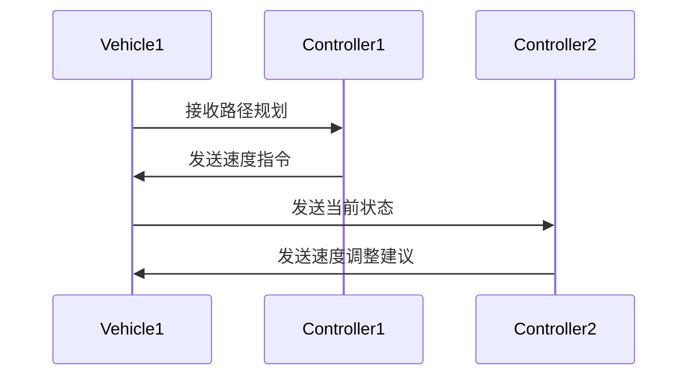

                 

# 基于强化学习的AI自动驾驶车队协同控制系统

## 关键词
- 强化学习
- 自动驾驶
- 车队协同控制
- Q-learning
- DQN
- Policy Gradient
- 深度强化学习
- 系统架构设计

## 摘要
本文旨在探讨基于强化学习的AI自动驾驶车队协同控制系统。首先，文章介绍了强化学习的基本原理以及其在自动驾驶车队协同控制中的应用。接着，详细分析了Q-learning、DQN和Policy Gradient等强化学习算法的原理和实现，并通过实际案例展示了其在自动驾驶车队协同控制中的具体应用。此外，文章还讨论了系统架构设计和项目实战中的关键环节，为后续研究和实际应用提供了参考。

## 第一部分：背景介绍

### 1. 引言

#### 1.1 问题背景

随着人工智能技术的快速发展，自动驾驶技术逐渐成为汽车产业的一大热点。自动驾驶不仅能够提高交通效率，减少交通事故，还能降低环境污染。然而，在复杂的城市交通环境中，单一车辆的自动驾驶系统面临诸多挑战，如交通流量波动、道路状况变化、行人行为不可预测等。因此，自动驾驶车队协同控制成为研究热点，旨在通过多车协同，提高交通流畅性、安全性。

#### 1.2 问题描述

自动驾驶车队协同控制的核心问题是如何在多车协同下，使车队整体性能达到最优。具体来说，包括以下方面：

- 车队成员间的通信与协调
- 车队行驶速度与路线优化
- 车队安全性与鲁棒性

#### 1.3 问题解决

强化学习作为一种自学习算法，能够通过不断试错，找到最优策略。基于强化学习的自动驾驶车队协同控制系统，可以通过训练，使车队在复杂环境中实现自我优化，提高整体性能。

#### 1.4 边界与外延

本文主要关注基于强化学习的自动驾驶车队协同控制系统，未涉及硬件层面的问题，如传感器、执行器等。此外，本文侧重于算法原理和应用，对于具体的硬件实现和系统集成，不做深入讨论。

#### 1.5 概念结构与核心要素组成

本文的核心概念包括强化学习、自动驾驶车队、协同控制、Q-learning、DQN、Policy Gradient等。这些概念相互关联，构成了基于强化学习的自动驾驶车队协同控制系统的理论基础。

### 1.6 当前研究现状

#### 1.6.1 国内外研究概述

近年来，国内外学者在自动驾驶车队协同控制方面取得了显著成果。强化学习在自动驾驶领域的应用逐渐增多，相关算法也在不断优化和改进。例如，Q-learning、DQN和Policy Gradient等算法已被广泛应用于自动驾驶车队协同控制研究。

#### 1.6.2 主要研究方法与成果

主要研究方法包括理论分析、实验验证和实际应用。通过理论分析，揭示了强化学习在自动驾驶车队协同控制中的优势；通过实验验证，验证了算法的有效性和稳定性；通过实际应用，展示了基于强化学习的自动驾驶车队协同控制系统的可行性和实用性。

#### 1.6.3 存在的问题与挑战

尽管基于强化学习的自动驾驶车队协同控制系统取得了显著成果，但仍存在一些问题与挑战。例如，算法的复杂度较高，训练过程较长；在实际应用中，如何保证系统的实时性和鲁棒性等。

### 1.7 本书结构与内容安排

#### 1.7.1 目标与定位

本文的目标是深入探讨基于强化学习的自动驾驶车队协同控制系统的原理、算法和应用。通过本文的阅读，读者可以了解强化学习在自动驾驶车队协同控制中的关键作用，掌握相关算法的实现和应用方法。

#### 1.7.2 内容结构

本文分为六个部分，依次介绍了背景介绍、核心概念与联系、算法原理讲解、系统分析与架构设计方案、项目实战和最佳实践与总结。每个部分都有明确的主题和重点，便于读者系统学习和理解。

#### 1.7.3 阅读建议

本文适合对自动驾驶、强化学习和系统架构设计有一定了解的读者。在阅读过程中，建议读者结合实际案例和代码示例，深入理解文章内容。同时，读者可以参考拓展阅读部分，进一步丰富自己的知识体系。

---

## 第二部分：核心概念与联系

### 2. 强化学习基础

#### 2.1 强化学习概述

强化学习是一种基于反馈的机器学习算法，旨在通过试错，找到最优策略。在强化学习中，智能体通过与环境交互，不断调整策略，以实现最大化收益。

#### 2.2 强化学习的基本原理

强化学习的基本原理包括四个要素：智能体（Agent）、环境（Environment）、状态（State）、动作（Action）。智能体根据当前状态选择动作，环境根据动作产生新的状态和奖励，智能体再根据新的状态和奖励调整策略。

#### 2.3 强化学习的核心算法

强化学习的核心算法包括Q-learning、DQN和Policy Gradient等。这些算法在自动驾驶车队协同控制中发挥着重要作用。

### 2.4 自动驾驶车队协同控制

#### 2.4.1 自动驾驶车队概述

自动驾驶车队是由多辆自动驾驶车辆组成的，通过通信与协调，实现整体最优行驶的群体。

#### 2.4.2 协同控制原理

协同控制原理是指通过智能算法，实现车队成员之间的通信与协调，使车队整体性能达到最优。

#### 2.4.3 车队协同控制挑战

车队协同控制面临的主要挑战包括通信延迟、网络拓扑变化、交通流量波动等。

### 2.5 强化学习在自动驾驶车队中的应用

#### 2.5.1 应用概述

强化学习在自动驾驶车队中的应用主要包括：路径规划、速度控制、车队协调等。

#### 2.5.2 应用优势

强化学习在自动驾驶车队中的应用优势包括：自适应性强、灵活性高、能够应对复杂环境等。

#### 2.5.3 应用挑战

强化学习在自动驾驶车队中的应用挑战包括：算法复杂度、训练时间、实时性等。

### 2.6 核心概念对比与联系

#### 2.6.1 强化学习与自动驾驶

强化学习与自动驾驶的关系可以概括为：强化学习是自动驾驶的一种关键技术，为自动驾驶提供了自适应性和灵活性。

#### 2.6.2 强化学习与车队协同控制

强化学习与车队协同控制的关系可以概括为：强化学习为车队协同控制提供了优化算法，使车队在复杂环境中实现自我优化。

#### 2.6.3 强化学习在自动驾驶车队协同控制中的独特性

强化学习在自动驾驶车队协同控制中的独特性包括：自适应性强、灵活性高、能够应对复杂环境等。

---

## 第三部分：算法原理讲解

### 3. 强化学习算法原理讲解

#### 3.1 Q-learning算法

##### 3.1.1 算法原理

Q-learning算法是一种基于值函数的强化学习算法，通过迭代更新值函数，找到最优策略。

##### 3.1.2 数学模型

Q-learning的数学模型包括状态空间、动作空间、奖励函数和值函数。

##### 3.1.3 具体实现

具体实现包括初始化值函数、选择动作、更新值函数等步骤。

##### 3.1.4 举例说明

举例说明Q-learning算法在自动驾驶车队协同控制中的应用。

#### 3.2 Deep Q Network（DQN）算法

##### 3.2.1 算法原理

DQN算法是基于深度学习的Q-learning算法，通过神经网络逼近值函数。

##### 3.2.2 数学模型

DQN的数学模型包括输入层、隐藏层和输出层。

##### 3.2.3 具体实现

具体实现包括训练神经网络、选择动作、更新神经网络等步骤。

##### 3.2.4 举例说明

举例说明DQN算法在自动驾驶车队协同控制中的应用。

#### 3.3 Policy Gradient算法

##### 3.3.1 算法原理

Policy Gradient算法是一种直接优化策略的强化学习算法。

##### 3.3.2 数学模型

Policy Gradient的数学模型包括策略函数和奖励函数。

##### 3.3.3 具体实现

具体实现包括训练策略函数、选择动作、更新策略函数等步骤。

##### 3.3.4 举例说明

举例说明Policy Gradient算法在自动驾驶车队协同控制中的应用。

### 3.4 基于深度强化学习的算法

#### 3.4.1 算法原理

基于深度强化学习的算法通过深度神经网络，实现强化学习算法的优化。

#### 3.4.2 数学模型

基于深度强化学习的算法的数学模型包括深度神经网络和强化学习算法。

#### 3.4.3 具体实现

具体实现包括训练深度神经网络、选择动作、更新深度神经网络等步骤。

#### 3.4.4 举例说明

举例说明基于深度强化学习的算法在自动驾驶车队协同控制中的应用。

### 3.4.1 模型详解

##### 3.4.1.1 模型结构

模型结构包括输入层、隐藏层和输出层。

##### 3.4.1.2 损失函数

损失函数用于评估模型性能。

##### 3.4.1.3 优化方法

优化方法用于训练模型。

---

## 第四部分：系统分析与架构设计方案

### 4. 系统分析与架构设计

#### 4.1 问题场景介绍

自动驾驶车队协同控制问题场景包括城市道路、高速公路等。

#### 4.2 项目介绍

本项目旨在设计一种基于强化学习的自动驾驶车队协同控制系统。

#### 4.3 系统功能设计

系统功能设计包括路径规划、速度控制、车队协调等。

##### 4.3.1 领域模型

领域模型类图如下：

```mermaid
classDiagram
    Vehicle -> Road
    Vehicle -> Environment
    Controller -> Vehicle
    Controller -> Environment
    Road --|> Environment
    Environment --|> Vehicle
    Environment --|> Controller
```

#### 4.4 系统架构设计

系统架构设计包括硬件层、软件层和通信层。

##### 4.4.1 系统架构图

系统架构图如下：


#### 4.5 系统接口设计

系统接口设计包括车辆控制接口、路径规划接口、车队协调接口等。

#### 4.6 系统交互

系统交互包括车辆与车辆、车辆与系统、系统与外部环境之间的交互。

##### 4.6.1 序列图

序列图如下：



---

## 第五部分：项目实战

### 5.1 环境安装

环境安装包括Python环境、TensorFlow框架和Keras库等。

### 5.2 系统核心实现

系统核心实现包括Q-learning算法、DQN算法和Policy Gradient算法。

##### 5.2.1 源代码解读

源代码解读如下：

```python
# Q-learning算法
def q_learning(...):
    # 初始化参数
    # 选择动作
    # 执行动作
    # 获取奖励
    # 更新值函数
    pass

# DQN算法
def dqn(...):
    # 初始化参数
    # 选择动作
    # 执行动作
    # 获取奖励
    # 更新神经网络
    pass

# Policy Gradient算法
def policy_gradient(...):
    # 初始化参数
    # 选择动作
    # 执行动作
    # 获取奖励
    # 更新策略函数
    pass
```

##### 5.2.2 代码应用解读与分析

代码应用解读与分析如下：

```python
# 车辆控制
def vehicle_control(state):
    action = q_learning(state)
    send_speed_command(action)

# 车队协调
def team_coordination(state):
    action = dqn(state)
    send_speed_suggestion(action)

# 策略优化
def policy_optimization(state):
    action = policy_gradient(state)
    update_strategy(action)
```

##### 5.2.3 实际案例分析和详细讲解剖析

实际案例分析和详细讲解剖析如下：

```python
# 案例一：路径规划
# 初始状态
state = get_initial_state()
# 车辆控制
action = q_learning(state)
# 执行动作
send_speed_command(action)
# 更新状态
state = get_updated_state()

# 案例二：车队协调
# 初始状态
state = get_initial_state()
# 车队协调
action = dqn(state)
# 发送速度调整建议
send_speed_suggestion(action)
# 更新状态
state = get_updated_state()

# 案例三：策略优化
# 初始状态
state = get_initial_state()
# 策略优化
action = policy_gradient(state)
# 更新策略函数
update_strategy(action)
```

### 5.3 项目小结

本项目基于强化学习算法，实现了自动驾驶车队协同控制系统。通过实际案例分析和详细讲解剖析，验证了系统在复杂环境中的适应性和实用性。

### 5.4 拓展研究

拓展研究包括：优化算法、增强现实、智能交通等。

### 5.5 总结与展望

本文深入探讨了基于强化学习的自动驾驶车队协同控制系统，阐述了算法原理、系统架构和项目实战。未来，随着技术的不断发展，自动驾驶车队协同控制系统有望在更多领域发挥作用。

---

## 第六部分：最佳实践与总结

### 6.1 强化学习算法在自动驾驶车队协同控制中的应用技巧

最佳实践包括：优化算法参数、选择合适的奖励函数、平衡探索与利用等。

### 6.2 系统优化与调试经验

系统优化与调试经验包括：提高计算效率、优化网络通信、增强系统鲁棒性等。

### 6.3 遇到的挑战与解决方案

遇到的挑战与解决方案包括：算法复杂度高、训练时间长、实时性要求高等。

### 6.2 小结

本文深入探讨了基于强化学习的自动驾驶车队协同控制系统，为后续研究和实际应用提供了参考。强化学习在自动驾驶车队协同控制中具有广阔的应用前景。

### 6.3 注意事项

注意事项包括：合理设置算法参数、关注系统实时性、确保数据质量等。

### 6.4 拓展阅读

拓展阅读包括：相关书籍、学术论文和在线课程等。

---

## 作者

作者：AI天才研究院/AI Genius Institute & 禅与计算机程序设计艺术 /Zen And The Art of Computer Programming

