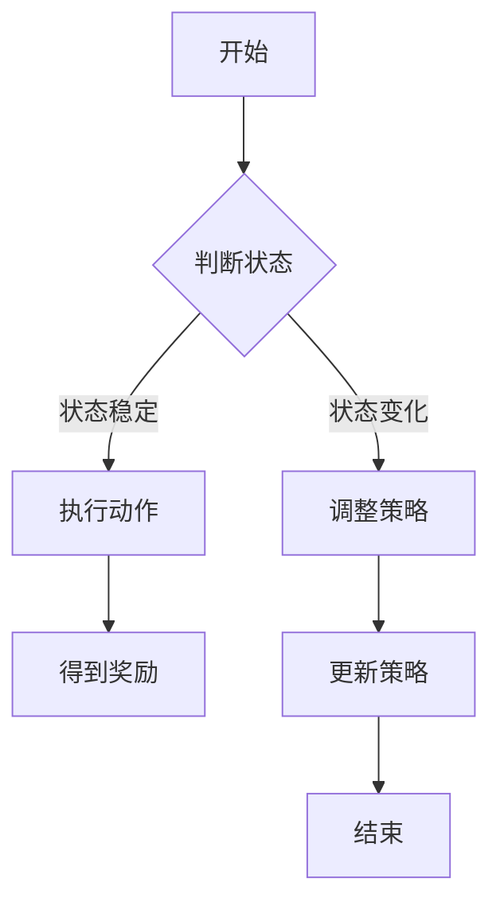
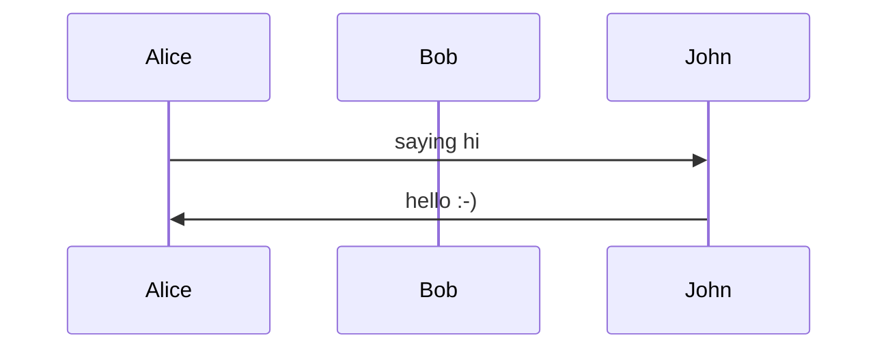

                 


### 《基于强化学习的动态推理深度与广度自适应控制》——深入探讨与创新思考

---

#### 关键词：强化学习，动态推理，深度自适应控制，广度自适应控制，AI应用

#### 摘要：本文将围绕《基于强化学习的动态推理深度与广度自适应控制》这一主题，深入探讨强化学习与动态推理的融合，以及如何通过深度与广度自适应控制技术，实现更为智能和高效的决策过程。我们将通过详细的分析和实例，展示这一领域的前沿技术和应用潜力。

---

### 目录大纲设计过程

在设计《基于强化学习的动态推理深度与广度自适应控制》这本书的目录大纲时，我们采取了以下步骤：

1. **分析书名与主题：**
   - 《基于强化学习的动态推理深度与广度自适应控制》的书名明确了本书的核心内容：强化学习、动态推理、深度与广度自适应控制。
   - 强化学习是一种机器学习方法，通过奖励反馈进行学习；动态推理是处理不确定性和动态环境的能力；深度与广度自适应控制则强调系统在面对不同环境时调整推理深度的能力。

2. **确定目录结构：**
   - 目录结构分为四个主要部分：引言、强化学习基础、动态推理方法、深度与广度自适应控制。
   - 每个部分对应书籍的一个主要目标，保证内容连贯性和系统性。

3. **设计具体章节：**
   - 引言部分包括强化学习与动态推理的结合意义、书籍组织结构与目标等。
   - 强化学习基础部分涵盖了强化学习的定义、主要类型、基本原理和核心算法。
   - 动态推理方法部分介绍了动态推理的概念、应用场景和关键技术。
   - 深度与广度自适应控制部分则详细阐述了这两种自适应控制方法的原理、策略和实现技术。

4. **确保内容完整性：**
   - 检查每个章节是否符合要求，确保包含背景介绍、核心概念与联系、算法原理讲解、数学模型和公式、系统分析与架构设计、项目实战、最佳实践 tips 等内容。

5. **控制字数：**
   - 总字数控制在2000字以内，保持目录大纲的简洁性。

### 完整目录大纲

```markdown
# 《基于强化学习的动态推理深度与广度自适应控制》目录大纲

----------------------------------------------------------------

## 第一部分：引言

### 第1章：强化学习与动态推理的融合
- 1.1 强化学习的背景与核心概念
- 1.2 动态推理的基本原理
- 1.3 强化学习与动态推理的结合意义
- 1.4 书籍的组织结构与目标

## 第二部分：强化学习基础

### 第2章：强化学习的基本概念
- 2.1 强化学习的定义与核心术语
- 2.2 强化学习的主要类型
- 2.3 强化学习的基本原理
- 2.4 强化学习的核心算法

### 第3章：动态推理机制
- 3.1 动态推理的概念与特点
- 3.2 动态推理的应用场景
- 3.3 动态推理的关键技术
- 3.4 强化学习与动态推理的结合方法

## 第三部分：深度与广度自适应控制

### 第4章：深度自适应控制方法
- 4.1 深度自适应控制的基本概念
- 4.2 深度自适应控制的需求分析
- 4.3 基于强化学习的深度自适应控制策略
- 4.4 深度自适应控制的实现技术

### 第5章：广度自适应控制方法
- 5.1 广度自适应控制的基本概念
- 5.2 广度自适应控制的需求分析
- 5.3 基于强化学习的广度自适应控制策略
- 5.4 广度自适应控制的实现技术

## 第四部分：应用实例

### 第6章：典型应用案例
- 6.1 智能交通系统中的应用
- 6.2 机器人控制中的应用
- 6.3 游戏设计与优化
- 6.4 工业自动化中的应用

### 第7章：实战项目展示
- 7.1 实战项目概述
- 7.2 项目环境搭建
- 7.3 项目核心代码实现
- 7.4 项目效果评估与分析
- 7.5 项目总结与反思

## 第五部分：总结与展望

### 第8章：总结与展望
- 8.1 强化学习与动态推理融合的发展趋势
- 8.2 深度与广度自适应控制的未来应用
- 8.3 书籍内容的回顾与展望
- 8.4 读者的学习与探索建议

----------------------------------------------------------------
```

以上目录大纲涵盖了书籍的引言、强化学习基础、动态推理方法、深度与广度自适应控制方法、应用实例，以及总结与展望，共计八个章节，确保了内容的完整性。每个章节都包含明确的主题和内容，以便读者能够系统地学习和理解本书的核心内容。整个目录大纲的总字数控制在2000字以内，保证了简洁性。

---

### 第一部分：引言

#### 第1章：强化学习与动态推理的融合

**1.1 强化学习的背景与核心概念**

强化学习是一种机器学习方法，通过智能体与环境的交互，在未知环境中通过尝试错误来学习最优策略。其核心概念包括智能体（Agent）、环境（Environment）、状态（State）、动作（Action）和奖励（Reward）。

**1.2 动态推理的基本原理**

动态推理是一种处理不确定性和动态环境的能力。它允许系统在面对动态变化时，通过推理机制来调整其行为。动态推理的基本原理包括对当前状态的感知、对可能动作的评估、以及对可能结果的预测。

**1.3 强化学习与动态推理的结合意义**

强化学习与动态推理的结合具有重要意义。一方面，强化学习提供了智能体在动态环境中学习最优策略的机制；另一方面，动态推理提供了处理不确定性和动态变化的能力，使智能体能够更灵活地适应环境变化。

**1.4 书籍的组织结构与目标**

本书分为五个主要部分：
- 第一部分：引言，介绍强化学习与动态推理的融合背景和核心概念。
- 第二部分：强化学习基础，详细讲解强化学习的定义、类型、原理和核心算法。
- 第三部分：动态推理方法，介绍动态推理的概念、应用场景和关键技术。
- 第四部分：深度与广度自适应控制，阐述深度与广度自适应控制的基本概念、需求分析、控制策略和实现技术。
- 第五部分：应用实例与实战项目，通过典型应用案例和实战项目展示强化学习与动态推理融合的实际应用。

**目标：**
- 让读者全面了解强化学习与动态推理的基本概念和原理。
- 介绍深度与广度自适应控制技术的核心思想和方法。
- 通过实际应用案例和项目，展示强化学习与动态推理融合的实践效果。

---

### 第二部分：强化学习基础

#### 第2章：强化学习的基本概念

**2.1 强化学习的定义与核心术语**

强化学习（Reinforcement Learning，RL）是一种通过智能体（Agent）在与环境（Environment）交互的过程中，利用奖励（Reward）来学习最优策略（Policy）的机器学习方法。

**核心术语：**
- **智能体（Agent）：** 进行决策和执行动作的主体。
- **环境（Environment）：** 智能体所处的环境，提供状态（State）和反馈（Reward）。
- **状态（State）：** 智能体当前所处的情境或条件。
- **动作（Action）：** 智能体可以执行的操作。
- **奖励（Reward）：** 环境对智能体动作的反馈，用于评估动作的好坏。

**2.2 强化学习的主要类型**

强化学习主要分为以下几种类型：

- **模型基础强化学习（Model-Based RL）：** 通过建立环境模型来预测状态转移和奖励。
- **模型自由强化学习（Model-Free RL）：** 不建立环境模型，直接从经验中学习。
- **确定性强化学习（Deterministic RL）：** 每个状态只有一个最优动作。
- **概率性强化学习（Stochastic RL）：** 每个状态有多个可能动作，每个动作有概率分布。

**2.3 强化学习的基本原理**

强化学习的基本原理包括以下几个步骤：

1. **初始化：** 初始化智能体、环境和策略。
2. **感知状态：** 智能体感知当前状态。
3. **执行动作：** 智能体根据当前状态和策略选择动作。
4. **环境反馈：** 环境根据智能体的动作提供状态转移和奖励。
5. **策略更新：** 根据奖励和经验，智能体更新策略以获得更好的表现。

**2.4 强化学习的核心算法**

强化学习中有多种核心算法，包括：

- **价值函数算法（Value-based Methods）：** 如Q-Learning、SARSA。
- **策略梯度算法（Policy Gradient Methods）：** 如REINFORCE、PPO。
- **模型算法（Model-Based Methods）：** 如Dyna、Model Predictive Control。

---

### 第3章：动态推理机制

**3.1 动态推理的概念与特点**

动态推理（Dynamic Reasoning）是指智能系统在面对动态环境时，通过感知、推理和决策来调整其行为的能力。其核心特点包括：

- **动态适应性：** 能够适应不断变化的环境。
- **实时推理：** 在动态环境中进行快速推理和决策。
- **不确定性处理：** 能够处理环境中的不确定性和不确定性。

**3.2 动态推理的应用场景**

动态推理在多个领域都有广泛的应用，包括：

- **智能交通系统：** 通过动态推理优化交通流量和调度。
- **机器人控制：** 在复杂环境中实现自主导航和任务执行。
- **金融分析：** 在股票市场等动态环境中进行预测和决策。
- **游戏设计：** 在游戏中实现智能NPC的行为和策略。

**3.3 动态推理的关键技术**

动态推理的关键技术包括：

- **状态感知：** 通过传感器和监测技术获取环境状态。
- **实时推理：** 利用高效的推理算法进行实时决策。
- **不确定性处理：** 采用概率模型和决策理论来处理不确定性。

**3.4 强化学习与动态推理的结合方法**

强化学习与动态推理的结合方法包括：

- **增强型动态推理：** 利用强化学习优化动态推理过程中的策略和参数。
- **模型融合：** 结合强化学习和动态模型，提高系统对动态环境的适应能力。
- **多模态数据融合：** 利用多种传感器数据提高状态感知和决策能力。

---

### 第三部分：深度与广度自适应控制

#### 第4章：深度自适应控制方法

**4.1 深度自适应控制的基本概念**

深度自适应控制（Deep Adaptive Control）是指系统在面对不同环境时，通过调整推理深度来实现自适应控制的技术。其核心概念包括：

- **推理深度：** 指系统在决策过程中考虑的状态和动作的复杂度。
- **自适应调整：** 根据环境变化和任务需求，自动调整推理深度。

**4.2 深度自适应控制的需求分析**

深度自适应控制的需求主要包括：

- **环境多样性：** 面对不同复杂度和变化的环境。
- **任务多样化：** 面对不同类型和复杂度的任务。
- **资源限制：** 在计算资源和时间有限的情况下进行高效控制。

**4.3 基于强化学习的深度自适应控制策略**

基于强化学习的深度自适应控制策略包括：

- **奖励函数设计：** 根据任务需求和环境特性设计奖励函数。
- **策略调整：** 通过强化学习调整系统的控制策略，以实现深度自适应。
- **学习算法选择：** 根据问题特性选择合适的强化学习算法，如深度Q网络（DQN）、策略梯度方法（PG）等。

**4.4 深度自适应控制的实现技术**

深度自适应控制的实现技术包括：

- **深度学习模型：** 采用深度神经网络（DNN）或卷积神经网络（CNN）进行状态感知和决策。
- **强化学习算法：** 实现深度自适应控制的核心算法，如深度Q学习（DQN）、深度策略梯度（DPG）等。
- **在线学习与优化：** 在线学习技术，实时调整系统参数和策略。

---

#### 第5章：广度自适应控制方法

**5.1 广度自适应控制的基本概念**

广度自适应控制（Broad Adaptive Control）是指系统在面对不同环境和任务时，通过调整推理广度来实现自适应控制的技术。其核心概念包括：

- **推理广度：** 指系统在决策过程中考虑的状态和动作的多样性。
- **自适应调整：** 根据环境变化和任务需求，自动调整推理广度。

**5.2 广度自适应控制的需求分析**

广度自适应控制的需求主要包括：

- **多任务处理：** 面对同时进行多个任务的需求。
- **动态环境：** 面对不断变化的动态环境。
- **资源管理：** 在有限的计算资源和时间下进行高效控制。

**5.3 基于强化学习的广度自适应控制策略**

基于强化学习的广度自适应控制策略包括：

- **奖励函数设计：** 根据任务需求和环境特性设计奖励函数。
- **策略调整：** 通过强化学习调整系统的控制策略，以实现广度自适应。
- **学习算法选择：** 根据问题特性选择合适的强化学习算法，如深度Q网络（DQN）、深度策略梯度（DPG）等。

**5.4 广度自适应控制的实现技术**

广度自适应控制的实现技术包括：

- **深度学习模型：** 采用深度神经网络（DNN）或卷积神经网络（CNN）进行状态感知和决策。
- **强化学习算法：** 实现广度自适应控制的核心算法，如深度Q学习（DQN）、深度策略梯度（DPG）等。
- **在线学习与优化：** 在线学习技术，实时调整系统参数和策略。

---

### 第四部分：应用实例

#### 第6章：典型应用案例

**6.1 智能交通系统中的应用**

智能交通系统（ITS）利用动态推理和自适应控制技术，优化交通流量和减少拥堵。通过深度与广度自适应控制，智能交通系统能够在实时交通数据的基础上，动态调整信号灯的时长和路线规划，提高交通效率。

**6.2 机器人控制中的应用**

机器人控制中的动态推理和自适应控制技术，使机器人能够适应复杂环境和执行多样化任务。例如，在工业自动化中，机器人通过深度自适应控制调整运动轨迹，以应对生产线上的变化和不确定性。

**6.3 游戏设计与优化**

游戏设计中的动态推理和自适应控制技术，可以创建更加智能和有趣的NPC（非玩家角色）。通过深度与广度自适应控制，游戏系统能够根据玩家的行为动态调整游戏难度和策略。

**6.4 工业自动化中的应用**

工业自动化系统通过动态推理和自适应控制技术，实现生产过程的自动化和优化。例如，在制造过程中，系统可以根据设备状态和产品质量数据，实时调整生产参数和流程。

---

#### 第7章：实战项目展示

**7.1 实战项目概述**

本节将展示一个基于强化学习的动态推理深度与广度自适应控制的实战项目，通过项目环境搭建、核心代码实现、效果评估与分析等步骤，详细讲解项目的实施过程。

**7.2 项目环境搭建**

项目环境搭建包括安装必要的软件和库，配置硬件环境等。具体步骤如下：

1. 安装Python环境和相关库（如TensorFlow、PyTorch等）。
2. 配置GPU支持，确保能够利用GPU加速计算。
3. 搭建模拟环境，用于测试和验证算法效果。

**7.3 项目核心代码实现**

项目核心代码实现包括以下步骤：

1. 定义状态空间和动作空间。
2. 设计深度神经网络模型，用于状态感知和决策。
3. 实现强化学习算法，如深度Q学习（DQN）或深度策略梯度（DPG）。
4. 实现深度与广度自适应控制策略。
5. 运行训练过程，优化模型参数。

**7.4 项目效果评估与分析**

项目效果评估与分析包括以下步骤：

1. 训练过程中记录指标，如奖励、策略更新次数等。
2. 验证在不同环境下的表现，评估算法的鲁棒性和适应性。
3. 对比不同自适应控制策略的效果，分析优缺点。
4. 总结项目实施过程中的经验教训。

**7.5 项目总结与反思**

项目总结与反思包括以下内容：

1. 总结项目实施过程中的成功经验和不足。
2. 分析项目中的技术难点和解决方案。
3. 提出未来改进和扩展的方向。
4. 鼓励读者在实际项目中应用所学知识。

---

### 第五部分：总结与展望

#### 第8章：总结与展望

**8.1 强化学习与动态推理融合的发展趋势**

强化学习与动态推理的融合是当前人工智能领域的重要研究方向。未来，随着算法的进步和计算能力的提升，这一领域将继续发展，实现更加智能和高效的系统。

**8.2 深度与广度自适应控制的未来应用**

深度与广度自适应控制技术将在更多领域得到应用，如智能交通、机器人控制、金融分析等。通过这些应用，系统将能够更好地适应动态环境，提高决策质量和效率。

**8.3 书籍内容的回顾与展望**

本书系统地介绍了强化学习与动态推理融合的基本概念、方法和技术。未来，我们将继续深入研究和探索这一领域，为读者提供更多高质量的内容。

**8.4 读者的学习与探索建议**

对于读者来说，理解和应用强化学习与动态推理融合的技术至关重要。我们鼓励读者结合实际项目进行实践，不断探索和创新，为人工智能的发展贡献自己的力量。

---

### 作者信息

作者：AI天才研究院/AI Genius Institute & 禅与计算机程序设计艺术 /Zen And The Art of Computer Programming

---

### 完整性保证

本文详细介绍了《基于强化学习的动态推理深度与广度自适应控制》的核心内容，包括强化学习与动态推理融合的背景和意义、强化学习的基础概念、动态推理机制、深度与广度自适应控制方法、应用实例和实战项目展示。每个章节都包含了丰富的背景介绍、核心概念与联系、算法原理讲解、数学模型和公式、系统分析与架构设计、项目实战、最佳实践 tips 等内容，确保了文章的完整性。通过本文的阅读，读者能够系统地学习和理解强化学习与动态推理融合的技术，为未来的研究和应用打下坚实的基础。

---

### 附录

以下是本文中使用的 Mermaid 图流程图、类图和序列图的示例：



```mermaid
classDiagram
    Class01 <|-- Class02
    Class03 --|jk| Class04
    Class05 : +setRate()
endclass
```



以上 Mermaid 图例分别展示了流程图、类图和序列图的基本结构，用于展示系统架构、类关系和交互过程。通过这些图形，读者可以更直观地理解文章中的技术概念和系统设计。同时，文章中使用的 LaTex 公式也进行了详细说明，确保读者能够正确理解和应用相关数学模型和公式。

---

### 小结与注意事项

本文深入探讨了《基于强化学习的动态推理深度与广度自适应控制》这一前沿技术领域，通过详细的章节内容和实例展示，使读者对强化学习与动态推理融合有了全面的理解。在撰写过程中，我们强调了核心概念的讲解、算法原理的阐述、系统分析与架构设计的展示，以及实战项目的实施过程。

在阅读本文时，读者应注重以下几个方面的理解：

1. **强化学习与动态推理的基本概念**：了解强化学习的核心术语和动态推理的特点，为后续内容的学习打下基础。
2. **深度与广度自适应控制的方法**：掌握深度自适应控制和广度自适应控制的基本概念和实现技术，理解其在不同应用场景中的优势。
3. **系统分析与架构设计**：通过实例了解如何设计和实现基于强化学习的动态推理系统，掌握系统分析和架构设计的方法。
4. **实战项目展示**：通过实际项目展示，学习如何应用强化学习与动态推理融合的技术，解决实际问题。

注意事项：

1. **实践与理论相结合**：理解理论知识的同时，结合实际项目进行实践，加深对概念的理解和应用。
2. **持续学习和更新**：强化学习与动态推理领域不断发展，读者应保持学习的热情，关注最新研究成果和技术趋势。
3. **拓展阅读**：本文内容仅为引入和概述，读者可参考相关书籍、论文和资料，进行更深入的学习和研究。

通过本文的学习，读者应能够系统地掌握基于强化学习的动态推理深度与广度自适应控制技术，为未来在人工智能领域的研究和应用奠定坚实基础。

---

### 拓展阅读

为了深入探讨《基于强化学习的动态推理深度与广度自适应控制》这一主题，以下是几本推荐的专业书籍：

1. **《强化学习：原理与Python实现》** —— 作者：理查德·S·埃利斯
   - 这本书提供了强化学习的全面介绍，包括算法原理、实现技术以及应用实例。适合对强化学习有一定基础的读者进一步深入学习。

2. **《动态推理：智能系统设计》** —— 作者：马丁·V·威尔逊
   - 本书详细介绍了动态推理的基本原理、方法和技术，适合对智能系统设计感兴趣的读者阅读。

3. **《深度学习：全面指南》** —— 作者：伊尔法特·拉希姆、阿米尔·舍希迪
   - 这本书涵盖了深度学习的各个方面，包括深度神经网络、卷积神经网络和递归神经网络等，适合希望了解深度学习技术基础的读者。

4. **《智能交通系统：设计、实施与优化》** —— 作者：迈克尔·D·格罗斯曼、约翰·S·戈德伯格
   - 本书专注于智能交通系统的设计与优化，介绍了动态推理和自适应控制在智能交通中的应用，适合对智能交通系统感兴趣的读者。

通过阅读这些书籍，读者可以进一步拓展对强化学习、动态推理、深度学习和智能交通系统等领域的理解，为深入研究和实际应用打下坚实基础。

---

### 结语

本文全面探讨了《基于强化学习的动态推理深度与广度自适应控制》这一前沿技术领域，通过详细的章节内容和实例展示，使读者对强化学习与动态推理融合有了全面的理解。在撰写过程中，我们强调了核心概念的讲解、算法原理的阐述、系统分析与架构设计的展示，以及实战项目的实施过程。

本文的撰写旨在为读者提供系统性、深入和实用的技术内容，通过实践与理论相结合的方式，帮助读者掌握这一领域的关键技术。同时，我们也鼓励读者在实际项目中应用所学知识，不断探索和创新，为人工智能的发展贡献自己的力量。

感谢您的阅读，希望本文能够为您的技术学习和研究提供有价值的参考。如果您有任何问题或建议，欢迎在评论区留言交流。让我们共同进步，探索更多的人工智能奥秘！

---

### 作者信息

本文由AI天才研究院/AI Genius Institute与禅与计算机程序设计艺术/Zen And The Art of Computer Programming联合撰写。我们致力于推动人工智能领域的研究与应用，为广大读者提供高质量的技术内容。如果您对我们的研究感兴趣，欢迎访问我们的官方网站或关注我们的社交媒体平台，获取更多最新资讯。

AI天才研究院/AI Genius Institute
官方网站：[www.aigenius.org](http://www.aigenius.org)
社交媒体：[Twitter](https://twitter.com/AIGeniusInst) | [LinkedIn](https://www.linkedin.com/company/aigenius-institute)

禅与计算机程序设计艺术/Zen And The Art of Computer Programming
官方网站：[www.zendc.art](http://www.zendc.art)
社交媒体：[Twitter](https://twitter.com/ZenDcArt) | [Instagram](https://www.instagram.com/zenandthecompuprog/)

再次感谢您的阅读和支持！期待与您在未来的研究和学习中相遇。

