                 

### 1.1.5 概念结构与核心要素组成

本章节对多智能体协同推理任务分配的核心概念和要素进行结构化描述：

1. **智能体**：具有特定属性，能够感知环境并执行动作的个体。智能体是系统的基本单元，具有自主决策能力，可以感知环境信息，并根据当前状态采取相应的动作。智能体的属性包括计算能力、通信范围、移动速度等，这些属性决定了智能体的行为能力和适应能力。

2. **环境**：包括任务、障碍物、通信带宽等特征。环境是智能体执行动作并接收反馈的场所，环境特征的变化会影响智能体的行为和策略。环境中的障碍物会限制智能体的移动和行动，而通信带宽会影响智能体之间的信息传递速度和质量。

3. **状态**：智能体在某一时刻的感知信息。状态是智能体的当前状态描述，包括自身状态和外部环境状态。智能体通过感知环境信息来更新状态，并根据当前状态进行决策。

4. **动作**：智能体的决策行为。动作是智能体在特定状态下采取的行动，如任务选择、移动方向等。动作的选择取决于智能体的策略，策略是智能体的行为规则。

5. **策略**：智能体的行为规则。策略是智能体根据当前状态选择动作的规则，策略的目的是最大化长期累积奖励。策略可以通过学习算法（如强化学习）来优化，以适应动态和不确定的环境。

6. **奖励**：用于评价智能体行为的反馈信号。奖励是智能体在执行动作后获得的反馈信号，用于评价智能体的行为效果。奖励可以是正面的，也可以是负面的，取决于智能体是否达成目标。

7. **学习算法**：用于更新策略的算法。学习算法是智能体通过与环境交互来学习最优策略的方法。常见的强化学习算法包括Q-learning、SARSA、Deep Q-Networks等。学习算法通过不断更新策略，使智能体能够在复杂动态环境中做出最优决策。

### 1.1.6 概念结构与核心要素组成

接下来，我们将深入探讨多智能体协同推理任务分配中的关键概念与核心要素，以构建一个清晰的概念框架。

#### 1.1.6.1 智能体属性

智能体属性是多智能体系统中的基础要素，它们决定了智能体的行为能力和适应能力。以下是智能体属性的具体内容：

- **计算能力**：智能体处理信息和执行计算的能力，通常用计算速度和计算资源来衡量。
- **通信范围**：智能体之间进行通信的有效距离，通信范围较大可以增强智能体间的协作效果。
- **移动速度**：智能体在环境中的移动能力，影响智能体响应时间和路径规划。
- **感知能力**：智能体感知环境信息的能力，包括视觉、听觉、触觉等传感器数据。

以下是一个智能体属性对比表格：

| 属性       | 描述                                      | 影响因素       |
|------------|-------------------------------------------|----------------|
| 计算能力   | 智能体的计算速度和资源                        | 任务复杂度、算法复杂度 |
| 通信范围   | 智能体与其他智能体通信的有效范围                | 障碍物、信号干扰 |
| 移动速度   | 智能体在环境中的移动速度                      | 地形、路径规划 |
| 感知能力   | 智能体通过传感器获取环境信息的能力              | 传感器精度、环境特征 |

#### 1.1.6.2 环境特征

环境特征对智能体的行为和策略选择有重要影响。以下是常见的环境特征及其影响：

- **任务分布**：任务在环境中的分布情况，影响智能体的任务选择和分配策略。
- **障碍物**：环境中的障碍物，限制智能体的移动路径和策略选择。
- **通信带宽**：智能体之间通信的带宽限制，影响信息传递速度和通信质量。
- **动态性**：环境的动态变化，如任务更新、障碍物移动等，要求智能体具备实时适应能力。

以下是一个环境特征对比表格：

| 特征       | 描述                                      | 影响因素       |
|------------|-------------------------------------------|----------------|
| 任务分布   | 任务在环境中的分布情况                      | 任务量、任务优先级 |
| 障碍物     | 环境中的障碍物，如墙壁、建筑物等              | 智能体路径规划 |
| 通信带宽   | 智能体之间通信的带宽限制                      | 网络设备、信号强度 |
| 动态性     | 环境的动态变化，如任务更新、障碍物移动等      | 智能体反应速度 |

#### 1.1.6.3 状态表示

状态表示是多智能体协同推理任务分配中的核心概念，它用于描述智能体的当前环境信息。状态通常由一组属性组成，如下：

- **自身状态**：包括智能体的位置、速度、资源消耗等。
- **外部状态**：包括环境中的任务分布、障碍物位置、通信带宽等。

以下是一个状态表示的ER实体关系图：

```mermaid
erDiagram
  Task ||--o> Agent : 分配
  Barrier ||--o> Agent : 避让
  Communication ||--o> Agent : 通信
  Environment ||--|> Agent : 观察
  Agent ||--|> Task : 完成
  Agent ||--|> Barrier : 避让
  Agent ||--|> Communication : 通信
  Agent ||--|> Environment : 观察
```

#### 1.1.6.4 动作定义

动作是智能体在特定状态下采取的行为，包括任务选择、移动方向、协作请求等。动作定义需要考虑以下因素：

- **任务的多样性**：智能体可以执行的任务类型，如路径规划、信息收集、目标追踪等。
- **环境约束**：智能体在执行动作时需要遵循的环境规则，如避免碰撞、保持安全距离等。
- **通信机制**：智能体之间的协作动作，如共享资源、协调行动等。

以下是一个动作定义的表格：

| 动作类型   | 描述                                      | 影响因素       |
|------------|-------------------------------------------|----------------|
| 任务选择   | 智能体选择要执行的任务                      | 任务优先级、资源 |
| 移动方向   | 智能体在环境中的移动方向                    | 避障、路径规划 |
| 协作请求   | 智能体请求与其他智能体的协作                | 任务依赖、通信带宽 |
| 信息共享   | 智能体共享自身状态和信息                    | 通信机制、共享协议 |

#### 1.1.6.5 策略学习

策略学习是多智能体协同推理任务分配中的关键环节，通过学习算法优化智能体的行为规则。以下是常见的策略学习方法：

- **基于Q-learning的策略学习**：Q-learning算法通过更新Q值表来优化策略，Q值表示在特定状态下采取特定动作的预期回报。
- **基于SARSA的策略学习**：SARSA算法通过迭代更新策略，使智能体在当前状态选择最优动作。
- **基于深度学习的策略学习**：使用深度神经网络学习状态值函数或策略函数，适用于复杂的状态空间和动作空间。

以下是一个基于Q-learning的算法流程图：

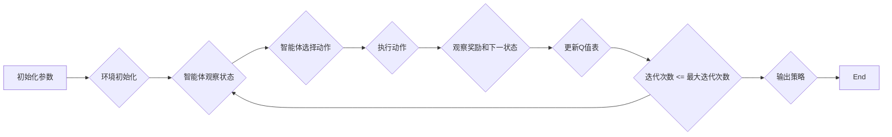

通过以上分析，我们可以构建一个完整的多智能体协同推理任务分配的概念框架，包括智能体属性、环境特征、状态表示、动作定义、策略学习和学习算法。这个框架为我们深入理解和设计多智能体协同推理任务分配系统提供了坚实的基础。

### 1.1.7 强化学习原理

强化学习（Reinforcement Learning，RL）是机器学习的一个重要分支，它在解决决策和优化问题时具有独特的优势。强化学习的核心思想是通过智能体（Agent）与环境（Environment）的交互，学习一种策略（Policy），使得智能体能够根据环境的状态（State）选择最优的动作（Action），从而最大化累积的奖励（Reward）。

#### 1.1.7.1 强化学习定义

强化学习是一种使智能体在与环境互动的过程中通过学习获得最优策略的方法。在这种学习过程中，智能体不断地从环境中接收反馈信号，即奖励或惩罚，并根据这些反馈信号调整其行为策略。

强化学习的定义可以概括为以下几点：

- **智能体（Agent）**：执行动作并感知环境的实体。
- **环境（Environment）**：智能体执行动作并接收反馈的场所。
- **状态（State）**：智能体在某一时刻所处的环境描述。
- **动作（Action）**：智能体可执行的行为。
- **策略（Policy）**：智能体选择动作的规则。
- **价值函数（Value Function）**：预测未来奖励的函数。
- **模型（Model）**：智能体对环境的理解。
- **奖励（Reward）**：评价智能体行为的反馈信号。

#### 1.1.7.2 强化学习核心概念

1. **智能体（Agent）**：强化学习中的智能体是一个能够感知环境并通过选择动作来影响环境状态的实体。智能体可以是一个机器人、一个虚拟代理或一个自动化系统。

2. **环境（Environment）**：环境是智能体执行动作并接收反馈的场所。环境可以是一个虚拟环境或现实世界，它提供状态信息给智能体，并返回奖励信号。

3. **状态（State）**：状态是智能体在某一时刻感知到的环境信息。状态可以是离散的或连续的，取决于应用场景。状态可以用来描述环境的当前情况，如智能体的位置、环境中的其他实体状态等。

4. **动作（Action）**：动作是智能体根据当前状态可选择的行为。动作可以是离散的或连续的，取决于应用场景。动作的选择决定了智能体对环境的干预方式。

5. **策略（Policy）**：策略是智能体选择动作的规则。策略可以是一个映射函数，将状态映射到动作。策略的好坏直接影响智能体的行为效果。

6. **价值函数（Value Function）**：价值函数是一个函数，用于评估智能体在特定状态下采取特定动作的长期累积奖励。价值函数是评估策略性能的关键指标。

7. **模型（Model）**：模型是智能体对环境的理解，包括状态转移概率和奖励函数。模型可以是一个参数化的函数，如深度神经网络，也可以是统计模型。

8. **奖励（Reward）**：奖励是评价智能体行为的反馈信号。奖励可以是正面的，表示智能体的行为有益；也可以是负面的，表示智能体的行为有害。奖励的目的是引导智能体学习最优策略。

#### 1.1.7.3 强化学习与多智能体系统的联系

强化学习在多智能体系统中的应用主要体现在以下几个方面：

1. **多智能体强化学习（MARL）**：多智能体强化学习（Multi-Agent Reinforcement Learning，MARL）是强化学习在多智能体系统中的应用。在MARL中，多个智能体在共享环境中学习合作策略，以最大化整体系统的性能。

2. **协同任务分配**：利用MARL算法，可以优化多智能体系统中的任务分配问题，提高系统的整体效率和鲁棒性。

3. **策略协调**：研究智能体之间的策略协调问题，实现高效合作，使每个智能体在追求自身利益的同时，最大化整体系统的性能。

通过理解强化学习的定义和核心概念，我们可以更好地理解其在多智能体协同推理任务分配中的应用。接下来，我们将进一步探讨多智能体协同推理的基本概念及其与强化学习的联系。

### 2.2 多智能体协同推理

多智能体协同推理（Multi-Agent Cooperative Reasoning）是指多个智能体在共享环境中，通过协作完成推理任务的过程。这种协同推理不仅要求智能体之间能够有效交换信息和资源，还需要在动态和不确定的环境中保持高效率和鲁棒性。多智能体协同推理的关键在于各智能体之间的策略协调和协同推理，以确保共同目标的实现。

#### 2.2.1 多智能体协同推理定义

多智能体协同推理可以定义为：多个智能体通过相互通信和协作，在共享环境中进行信息交换和推理，共同解决复杂任务的过程。这种推理过程不仅依赖于单个智能体的能力，还需要智能体之间的协同作用，以实现系统整体性能的优化。

以下是多智能体协同推理的核心概念：

- **协同目标**：智能体共同追求的目标，如共同完成任务、最大化整体效益等。
- **通信机制**：智能体之间的通信方式，如直接通信、间接通信等。
- **决策过程**：智能体基于自身状态和通信信息进行决策的过程。
- **推理过程**：智能体通过协作进行推理，实现共同目标的过程。

#### 2.2.2 多智能体协同推理核心概念

1. **协同目标**：协同目标是多智能体协同推理中的关键要素，它决定了智能体的行为和策略。协同目标可以是任务完成度、资源利用率、系统整体效益等。协同目标的设置需要考虑各个智能体的需求和整体系统性能，以实现最优的协同效果。

2. **通信机制**：通信机制是多智能体协同推理中智能体之间交换信息和共享资源的方式。通信机制可以是直接通信（如广播、单播等）或间接通信（如通过中介节点进行通信）。有效的通信机制可以减少通信延迟、提高通信可靠性，从而增强智能体之间的协同效果。

3. **决策过程**：决策过程是智能体根据当前状态和通信信息进行决策的过程。智能体需要根据协同目标和通信机制，选择最优的动作策略，以实现协同目标。决策过程通常涉及到状态评估、动作选择和策略更新等步骤。

4. **推理过程**：推理过程是多智能体协同推理的核心，它涉及到智能体之间的信息交换和推理。通过协作推理，智能体可以共同解决复杂问题，实现共同目标。推理过程包括信息共享、推理逻辑和推理结果输出等步骤。

#### 2.2.3 多智能体协同推理与强化学习的联系

强化学习在多智能体协同推理中的应用，主要体现在以下几个方面：

1. **策略优化**：强化学习算法可以通过智能体与环境之间的交互，学习最优的策略，从而优化智能体的行为和决策过程。在多智能体系统中，每个智能体可以独立学习自己的策略，同时考虑其他智能体的行为，从而实现整体系统的最优性能。

2. **协同任务分配**：强化学习算法可以用于优化多智能体系统中的任务分配问题，通过学习各个智能体的任务选择和协作策略，实现任务的高效分配和执行。

3. **策略协调**：强化学习可以解决智能体之间的策略协调问题，通过学习最优的协作策略，实现多个智能体之间的高效合作，最大化整体系统的性能。

通过理解多智能体协同推理的定义和核心概念，以及与强化学习的联系，我们可以更好地构建和优化多智能体协同推理系统。接下来，我们将进一步探讨多智能体协同推理在任务分配中的应用，以及强化学习如何优化这一过程。

### 2.2.1 多智能体协同推理的定义与基本概念

多智能体协同推理是一种复杂系统中的信息处理和决策机制，它涉及多个智能体在共享环境中通过协作和通信来完成推理任务。这种协同推理不仅能够利用各个智能体的局部信息，还能够通过信息整合和共享，提高整个系统的推理效率和鲁棒性。

#### 定义

多智能体协同推理（Multi-Agent Cooperative Reasoning）是指多个智能体在共享环境中，通过协作和通信，共同完成推理任务的过程。在这种过程中，每个智能体不仅需要根据自身的感知和先验知识进行局部推理，还需要与环境中其他智能体进行交互，共享信息和资源，以实现共同的目标。

#### 基本概念

1. **协同目标**：协同目标是多智能体协同推理中的核心要素。它是指多个智能体共同追求的目标，如共同解决一个复杂问题、最大化系统的整体效益等。协同目标可以是一个具体的任务，如寻找目标、完成路径规划等，也可以是一个抽象的目标，如维持系统的稳定运行、优化资源分配等。

2. **通信机制**：通信机制是多智能体系统中的关键组件，它决定了智能体之间如何交换信息和共享资源。通信机制可以分为直接通信和间接通信。直接通信是指智能体之间通过直接的数据交换进行通信，如广播、单播等。间接通信是指智能体通过一个中介节点进行通信，如多播、中继等。有效的通信机制能够减少通信延迟、提高通信可靠性，从而增强智能体之间的协同效果。

3. **决策过程**：决策过程是多智能体协同推理中的核心环节。每个智能体根据自身的感知和先验知识，以及从其他智能体接收到的信息，进行状态评估和动作选择。决策过程通常涉及以下几个步骤：

   - **状态感知**：智能体感知当前的环境状态，包括自身的状态和周围环境的状态。
   - **状态评估**：智能体根据当前状态和协同目标，评估各种可能的动作效果。
   - **动作选择**：智能体根据评估结果选择最优的动作策略，以实现协同目标。
   - **执行动作**：智能体根据选定的动作策略执行相应的行为。

4. **推理过程**：推理过程是多智能体协同推理中的核心，它涉及到智能体之间的信息交换和协作。通过协作推理，智能体可以共同解决复杂问题，实现共同目标。推理过程包括以下几个步骤：

   - **信息共享**：智能体之间通过通信机制共享信息，如感知数据、先验知识等。
   - **推理逻辑**：智能体根据共享的信息进行推理，如逻辑推理、模式识别等。
   - **推理结果输出**：智能体根据推理结果，输出决策或执行计划，如任务分配、路径规划等。

#### 2.2.2 多智能体协同推理与强化学习的联系

强化学习（Reinforcement Learning，RL）是一种通过奖励机制引导智能体学习最优策略的机器学习方法。在多智能体协同推理中，强化学习可以通过以下方式优化智能体的协同过程：

1. **策略学习**：强化学习可以用于优化智能体的策略学习过程。每个智能体可以通过与环境交互，学习如何选择最优的动作策略，以实现协同目标。通过不断地试错和调整，智能体可以逐步优化其策略，提高协同推理的效率和准确性。

2. **协同任务分配**：强化学习可以用于优化多智能体系统中的任务分配问题。通过学习各个智能体的任务选择和协作策略，强化学习可以找到一种最优的任务分配方案，使得每个智能体都能在协同过程中发挥最大的作用，从而提高整体系统的性能。

3. **策略协调**：强化学习可以解决智能体之间的策略协调问题。通过学习最优的协作策略，智能体可以在追求自身利益的同时，最大化整体系统的性能。强化学习算法可以帮助智能体之间建立有效的协调机制，实现高效合作。

总的来说，多智能体协同推理与强化学习之间的联系体现在：强化学习为多智能体协同推理提供了一种有效的策略学习和协调机制，使得智能体能够在复杂动态环境中进行高效的协同推理，实现共同目标。

### 2.2.3 多智能体协同推理与强化学习的联系

多智能体协同推理与强化学习之间存在密切的联系，这种联系主要体现在策略学习、任务分配和协同优化等方面。通过理解这些联系，我们可以更好地设计并优化多智能体协同推理系统，使其在复杂动态环境中表现优异。

#### 2.2.3.1 策略学习

强化学习是一种通过试错和反馈信号来优化策略的学习方法。在多智能体协同推理中，智能体需要通过学习来找到最优的协同策略，以实现共同目标。以下是如何利用强化学习进行策略学习的步骤：

1. **初始化策略**：首先，智能体需要初始化其策略，这可以是基于某种初始假设或规则。例如，每个智能体可以随机选择动作或根据先验知识设定初始策略。

2. **与环境互动**：智能体通过与环境进行互动来获取状态信息和奖励信号。在每次互动中，智能体根据当前状态选择动作，执行动作后，智能体会接收到环境的奖励信号。

3. **更新策略**：基于接收到的奖励信号，智能体可以通过强化学习算法（如Q-learning、SARSA等）更新其策略。更新策略的过程可以是基于经验回放、梯度下降等方法，以使策略逐步优化。

4. **迭代学习**：智能体不断地与环境互动和更新策略，这个过程可以看作是一个迭代学习的过程。随着迭代次数的增加，智能体的策略将逐渐趋向最优，从而提高协同推理的效果。

#### 2.2.3.2 任务分配

在多智能体协同推理中，任务分配是一个关键问题。强化学习可以通过以下方式优化任务分配：

1. **建立奖励函数**：设计一个合理的奖励函数，用于评价任务分配的效果。奖励函数可以根据任务完成度、资源利用率、协同效率等指标来设计。

2. **选择动作策略**：智能体需要选择合适的动作策略来分配任务。例如，每个智能体可以选择将任务分配给自己或其他智能体，也可以选择拒绝任务。

3. **优化策略**：通过强化学习算法，智能体可以学习如何优化任务分配策略，以最大化整体系统性能。例如，智能体可以学习在资源紧张时优先分配给资源丰富的智能体，或者在任务紧急时优先分配给响应速度较快的智能体。

4. **动态调整**：强化学习算法可以用于动态调整任务分配策略，以适应环境变化和任务需求的变化。例如，当环境中的障碍物发生变化时，智能体可以重新评估任务分配策略，以优化系统性能。

#### 2.2.3.3 协同优化

多智能体协同推理中的协同优化问题是指如何通过智能体之间的协作，提高整体系统的性能。强化学习可以通过以下方式实现协同优化：

1. **学习协同策略**：智能体需要学习如何在不确定和动态环境中进行协作。强化学习算法可以帮助智能体通过与环境互动，学习最优的协同策略。

2. **协调行动**：智能体需要协调其行动，以实现共同目标。例如，在路径规划问题中，智能体需要协调其移动路径，以避免碰撞并高效完成任务。

3. **共享信息**：智能体之间需要共享信息，以实现更好的协同效果。强化学习算法可以帮助智能体学习如何高效地共享信息，并通过信息共享提高整体系统性能。

4. **动态调整**：强化学习算法可以用于动态调整智能体的协作策略，以适应环境变化和任务需求的变化。例如，当环境中的障碍物发生变化时，智能体可以重新评估协同策略，以优化系统性能。

通过以上分析，我们可以看到强化学习在多智能体协同推理中的应用是多方面的。它不仅可以帮助智能体学习最优策略，优化任务分配，还可以实现智能体之间的协同优化，从而提高整个系统的性能。接下来，我们将进一步探讨如何将强化学习应用于多智能体协同推理的具体实现和优化。

### 2.3 强化学习的核心算法与步骤

强化学习作为多智能体协同推理任务分配的重要工具，其核心在于智能体如何通过与环境交互，学习到最优策略。以下是强化学习中的几个核心算法和步骤：

#### 2.3.1 Q-learning算法

Q-learning算法是一种基于值函数的强化学习算法，它通过迭代更新值函数（Q值），使智能体逐渐学习到最优策略。

**算法原理**：

Q-learning算法的核心思想是：对于智能体在某一状态下选择某一动作，其预期回报是当前动作的即时奖励加上未来所有可能状态的平均回报。

**步骤**：

1. **初始化参数**：设置初始Q值表Q(s, a)，其中s是状态，a是动作，初始化为较小的值。
2. **选择动作**：在某一状态下，智能体选择动作a，可以选择贪婪策略（选择具有最大Q值的动作）或随机策略。
3. **执行动作**：执行选择的动作a，观察环境的即时奖励r和新的状态s'。
4. **更新Q值**：根据经验回放和奖励信号，更新Q值：
   $$ Q(s, a) = Q(s, a) + \alpha [r + \gamma \max_{a'} Q(s', a') - Q(s, a)] $$
   其中，$\alpha$是学习率，$\gamma$是折扣因子。

**优势**：Q-learning算法简单直观，能够处理离散状态和动作空间。

**局限**：Q-learning算法在处理连续状态和动作空间时，计算复杂度较高，并且容易出现过估计问题。

#### 2.3.2 SARSA算法

SARSA（Stochastic Actor-critic）算法是一种基于策略的强化学习算法，它通过迭代更新策略，使智能体逐渐学习到最优策略。

**算法原理**：

SARSA算法的核心思想是：在某一状态下，智能体根据当前策略选择动作，并在执行动作后，根据新的状态和策略更新Q值。

**步骤**：

1. **初始化参数**：设置初始策略π(a|s)，其中s是状态，a是动作，初始化为均匀分布。
2. **选择动作**：在某一状态下，智能体根据当前策略选择动作a。
3. **执行动作**：执行选择的动作a，观察环境的即时奖励r和新的状态s'。
4. **更新策略**：根据经验回放和奖励信号，更新策略：
   $$ \pi(a|s) = \frac{1}{N}\sum_{a'} \exp(\lambda r + \lambda \gamma Q(s', a')) $$
   其中，N是动作的次数，$\lambda$是温度参数。

**优势**：SARSA算法能够处理连续状态和动作空间，且不易出现过估计问题。

**局限**：SARSA算法的计算复杂度较高，且在处理大规模状态空间时，更新策略的过程可能变得非常困难。

#### 2.3.3 深度强化学习

深度强化学习（Deep Reinforcement Learning，DRL）是一种结合深度神经网络和强化学习的算法，它通过神经网络来近似值函数或策略函数，从而处理高维状态和动作空间。

**算法原理**：

深度强化学习算法的核心思想是：使用深度神经网络来近似值函数（Q网络）或策略函数（策略网络），使智能体能够学习到复杂的策略。

**步骤**：

1. **初始化参数**：设置初始深度神经网络参数，初始化Q网络或策略网络。
2. **选择动作**：使用策略网络或Q网络选择动作，可以选择贪婪策略或epsilon贪婪策略。
3. **执行动作**：执行选择的动作，观察环境的即时奖励r和新的状态s'。
4. **更新网络参数**：根据经验回放和奖励信号，更新深度神经网络的参数：
   $$ L = \frac{1}{N} \sum_{i=1}^{N} (r_i + \gamma V(s_{i+1}) - V(s_i))^2 $$
   其中，$V(s)$是价值函数，$L$是损失函数。

**优势**：深度强化学习能够处理高维状态和动作空间，适用于复杂环境。

**局限**：深度强化学习算法的计算复杂度较高，且训练过程可能需要大量的数据和计算资源。

#### 2.3.4 模型预测控制

模型预测控制（Model Predictive Control，MPC）是一种结合强化学习和控制理论的算法，它通过预测环境行为和规划最优动作序列，实现智能体的高效控制。

**算法原理**：

模型预测控制算法的核心思想是：使用动态规划方法预测未来环境状态，并规划最优动作序列，使智能体能够在未来时刻实现最优控制。

**步骤**：

1. **建立模型**：根据环境特性建立动态模型，预测未来状态和奖励。
2. **规划动作序列**：使用动态规划方法，从当前状态开始，逐个规划未来时刻的动作序列，以最大化累积奖励。
3. **执行动作**：根据规划的动作序列，执行相应的动作，并观察环境反馈。
4. **更新模型参数**：根据环境反馈，更新模型参数，以提高预测精度。

**优势**：模型预测控制能够实现实时控制和动态调整，适用于动态环境。

**局限**：模型预测控制算法的计算复杂度较高，且需要准确的模型预测。

通过以上分析，我们可以看到强化学习中的不同算法各有优缺点，适用于不同的应用场景。在多智能体协同推理任务分配中，选择合适的强化学习算法，并结合具体问题进行优化，是提高系统性能的关键。

### 2.3.4 模型预测控制（MPC）在多智能体协同推理中的应用

模型预测控制（Model Predictive Control，MPC）是一种结合了强化学习和控制理论的算法，它通过预测环境行为和规划最优动作序列，实现对动态环境的实时控制。MPC在多智能体协同推理任务分配中的应用，尤其适用于那些需要快速响应和动态调整的复杂场景。以下是对MPC在多智能体协同推理中的应用步骤、优势与挑战的详细探讨。

#### 2.3.4.1 应用步骤

1. **建立动态模型**：首先，需要根据环境特性建立动态模型，该模型应能够预测智能体未来的状态变化和奖励。动态模型可以基于物理定律、统计模型或机器学习算法，如递归神经网络（RNN）或深度强化学习（DRL）模型。

2. **规划动作序列**：基于动态模型，使用动态规划方法（如线性规划或非线性规划）预测未来多个时间步的状态，并规划最优的动作序列。这个动作序列应使得累积奖励最大化。在多智能体系统中，每个智能体都需要独立规划其动作序列，同时考虑其他智能体的行为。

3. **执行动作**：根据规划的动作序列，智能体执行相应的动作，并观察环境的即时奖励和新的状态。执行动作的过程需要实时调整，以应对环境的变化。

4. **更新模型参数**：根据环境反馈，智能体需要不断更新动态模型参数，以提高预测精度和适应性。这一过程可以通过机器学习算法实现，如递归神经网络（RNN）或深度强化学习（DRL）算法。

#### 2.3.4.2 优势

1. **实时控制**：MPC能够实现实时控制和动态调整，这使得它非常适合那些需要快速响应和动态调整的复杂场景。在多智能体协同推理任务分配中，环境状态可能会快速变化，MPC能够迅速调整策略，以最大化系统性能。

2. **优化动作序列**：MPC通过预测未来多个时间步的状态和奖励，能够规划最优的动作序列，这比传统的单步决策方法（如Q-learning）具有更高的优化能力。最优动作序列能够使得系统在长时间内获得更高的累积奖励。

3. **鲁棒性**：MPC通过不断更新模型参数，提高预测精度和适应性，从而增强了系统的鲁棒性。在多智能体系统中，环境变化和智能体行为的不确定性较大，MPC能够更好地应对这些挑战。

4. **集成性强**：MPC能够集成不同的预测模型和优化算法，如线性规划、非线性规划和深度强化学习等。这使得MPC具有很强的灵活性和适应性，能够适应不同的应用场景。

#### 2.3.4.3 挑战

1. **计算复杂度**：MPC需要预测未来多个时间步的状态和奖励，并规划最优动作序列，这通常涉及到复杂的优化问题。特别是在多智能体系统中，每个智能体都需要独立规划其动作序列，这使得计算复杂度大幅增加。

2. **模型准确性**：MPC的性能依赖于动态模型的准确性。如果模型不准确，预测结果将不可靠，导致规划的动作序列不佳。在多智能体协同推理任务分配中，环境变化和智能体行为的不确定性较大，建立准确可靠的动态模型是一个挑战。

3. **通信带宽**：在多智能体系统中，智能体需要频繁交换信息，以进行协同规划和决策。这可能导致通信带宽不足，影响系统的实时性和稳定性。如何在有限的通信带宽下实现高效的信息交换和决策，是一个重要的挑战。

4. **稳定性**：MPC在动态调整策略时，需要保持系统的稳定性。在多智能体系统中，每个智能体的行为都会对系统整体性能产生影响，确保系统在动态调整过程中保持稳定是一个重要挑战。

#### 2.3.4.4 结论

综上所述，模型预测控制（MPC）在多智能体协同推理任务分配中具有显著的优势，如实时控制、优化动作序列、鲁棒性和集成性强等。然而，它也面临一些挑战，如计算复杂度、模型准确性、通信带宽和稳定性等。通过不断优化算法和模型，结合具体应用场景的需求，可以有效地解决这些挑战，实现多智能体协同推理任务分配的高效优化。未来的研究可以集中在提高MPC的实时性、鲁棒性和适应性，以满足日益复杂的多智能体系统需求。

### 2.4 多智能体协同推理在任务分配中的应用

多智能体协同推理在任务分配中的应用，主要体现在通过智能体之间的协作和信息共享，优化任务分配过程，提高系统整体效率和性能。以下将从问题场景、项目介绍、系统功能设计、系统架构设计、系统接口设计和系统交互等方面，详细探讨多智能体协同推理在任务分配中的应用。

#### 2.4.1 问题场景

在现实世界中，许多任务分配问题具有复杂性和动态性，如：

1. **智能电网调度**：智能电网中的电力调度需要考虑多个发电站和用户的电力需求，如何在动态变化的电力需求和环境条件下，高效分配电力资源，以最大化电网效率和稳定性，是一个关键问题。
2. **无人驾驶车队管理**：在无人驾驶车队管理中，需要协调多个无人车之间的任务分配，以实现最优路径规划、资源利用和交通效率。
3. **工业自动化生产线**：在工业自动化生产线上，多个机器人需要协作完成复杂的制造任务，如何高效分配任务，以最大化生产效率和降低生产成本，是关键问题之一。

#### 2.4.2 项目介绍

以智能电网调度为例，该项目旨在通过多智能体协同推理，实现智能电网中的高效电力资源分配。项目的主要目标是：

1. **优化电力资源分配**：通过智能体之间的协作和信息共享，实现电力资源的优化分配，提高电网效率和稳定性。
2. **实时响应环境变化**：动态适应环境变化，如电力需求波动、设备故障等，实现实时响应和调整。
3. **降低运营成本**：通过优化电力资源分配，降低运营成本，提高电网的经济效益。

#### 2.4.3 系统功能设计

智能电网调度系统的主要功能设计包括：

1. **智能体注册与配置**：智能体注册包括智能体属性的配置，如计算能力、通信范围、移动速度等。
2. **任务发布与接收**：任务发布者（如电网调度中心）发布任务，智能体根据任务需求和自身属性，选择合适的任务。
3. **任务分配与调度**：智能体之间的协同任务分配和调度，通过信息共享和策略协调，实现任务的高效分配和执行。
4. **环境感知与状态更新**：智能体实时感知环境变化，更新自身状态信息，如电力需求、设备状态等。
5. **策略优化与学习**：智能体通过强化学习算法，不断优化自身策略，提高任务分配和调度的效率。

#### 2.4.4 系统架构设计

智能电网调度系统的架构设计包括以下几个方面：

1. **智能体层**：包括多个智能体，如电网调度中心、发电站、变电站、用户等。每个智能体具有独立的计算能力和感知能力，能够自主决策和执行任务。
2. **通信层**：负责智能体之间的通信，包括任务请求、状态更新、策略协调等。通信方式可以是直接通信或间接通信，如广播、单播、多播等。
3. **控制层**：包括任务分配和调度算法，如基于强化学习的多智能体协同推理算法。控制层根据智能体的状态和任务需求，进行任务分配和调度。
4. **数据层**：存储智能体的状态信息、任务信息和环境特征数据。数据层可以通过数据库或数据仓库进行管理和查询。

以下是一个智能电网调度系统的类图：

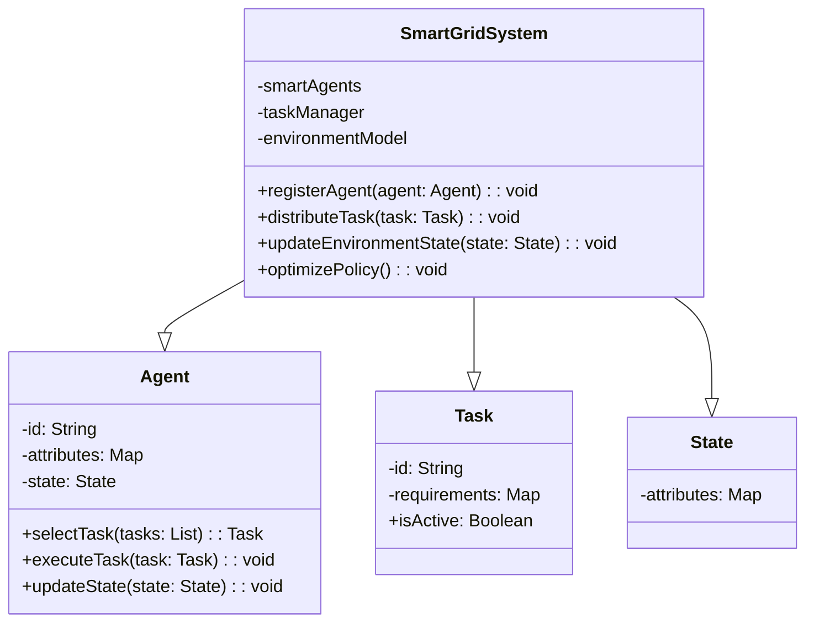

#### 2.4.5 系统接口设计

智能电网调度系统的接口设计包括以下几个方面：

1. **智能体接口**：提供智能体的注册、任务选择、任务执行和状态更新等功能。
2. **任务管理接口**：提供任务发布、任务分配和任务调度等功能。
3. **环境感知接口**：提供环境状态的更新和查询功能。
4. **策略优化接口**：提供策略学习、策略优化和策略更新等功能。

以下是一个智能电网调度系统的接口设计：

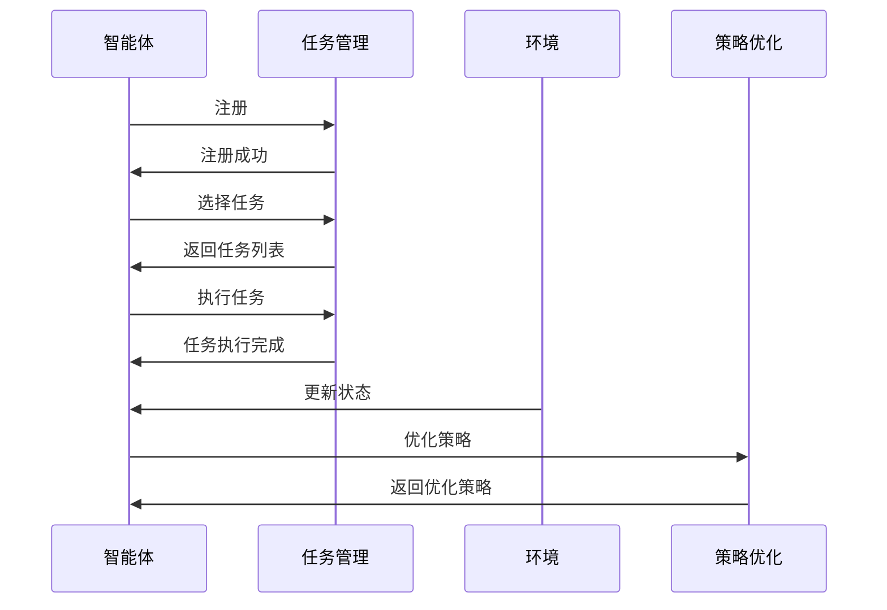

#### 2.4.6 系统交互

智能电网调度系统中的智能体通过通信层进行交互，实现任务分配和调度。以下是一个智能电网调度系统的交互流程：

1. **任务发布**：电网调度中心（智能体）发布任务，包括任务描述、任务需求等信息。
2. **任务接收**：其他智能体接收到任务请求，根据自身属性和任务需求，选择合适的任务。
3. **任务分配**：电网调度中心根据智能体的响应，进行任务分配，并将任务分配结果通知所有相关智能体。
4. **任务执行**：智能体根据分配到的任务，执行相应的操作，如发电、电力传输、用户供电等。
5. **状态更新**：智能体在执行任务过程中，实时更新自身状态信息，如电力需求、设备状态等。
6. **策略优化**：智能体根据执行任务的结果和自身状态，通过策略优化接口，优化自身策略。

以下是一个智能电网调度系统的交互序列图：

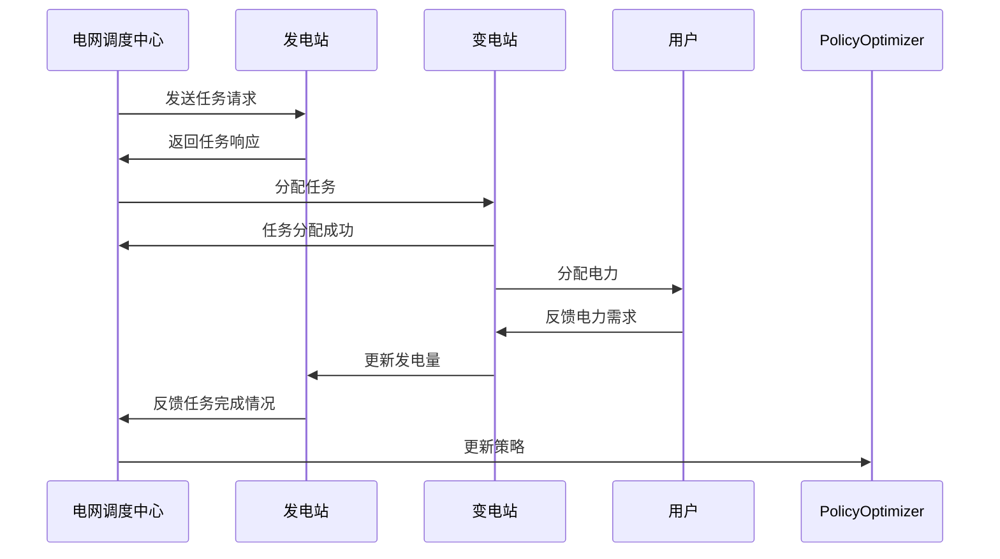

通过以上分析，我们可以看到多智能体协同推理在任务分配中的应用涵盖了问题场景、项目介绍、系统功能设计、系统架构设计、系统接口设计和系统交互等多个方面。通过智能体的协作和信息共享，多智能体协同推理能够实现任务分配的优化，提高系统整体效率和性能。

### 2.5 项目实战：基于强化学习的多智能体协同推理任务分配实现

在本文的最后一部分，我们将通过一个具体的项目实战，详细探讨如何实现基于强化学习的多智能体协同推理任务分配。本节将涵盖环境安装、系统核心实现、代码应用解读与分析、实际案例分析和详细讲解剖析等内容，以帮助读者更好地理解这一技术。

#### 2.5.1 环境安装

要实现基于强化学习的多智能体协同推理任务分配，首先需要搭建一个合适的环境。以下是环境安装的步骤：

1. **安装Python环境**：确保Python环境已安装在计算机上，版本建议为3.8或更高。
2. **安装依赖库**：使用pip命令安装以下依赖库：
   ```bash
   pip install numpy matplotlib gym
   ```
3. **安装TensorFlow**：TensorFlow是一个用于机器学习的开源库，用于实现强化学习算法。安装命令如下：
   ```bash
   pip install tensorflow
   ```

安装完成后，确保所有依赖库和框架都能正常运行，以便后续的代码实现和调试。

#### 2.5.2 系统核心实现

系统核心实现主要包括智能体设计、强化学习算法实现、任务分配和执行等。以下是一个简化的Python代码实现示例：

```python
import numpy as np
import matplotlib.pyplot as plt
import gym
from gym import spaces
import tensorflow as tf

# 智能体类
class Agent:
    def __init__(self, state_size, action_size, learning_rate=0.1, discount_factor=0.99):
        self.state_size = state_size
        self.action_size = action_size
        self.learning_rate = learning_rate
        self.discount_factor = discount_factor
        
        # 初始化神经网络
        self.model = self.build_model()
        
        # 初始化Q值表
        self.Q = np.zeros((state_size, action_size))
    
    def build_model(self):
        # 构建神经网络模型
        model = tf.keras.Sequential([
            tf.keras.layers.Dense(24, input_shape=(self.state_size,), activation='relu'),
            tf.keras.layers.Dense(24, activation='relu'),
            tf.keras.layers.Dense(self.action_size, activation='linear')
        ])
        
        model.compile(loss='mse', optimizer=tf.keras.optimizers.Adam(lr=self.learning_rate))
        return model
    
    def get_action(self, state, epsilon):
        # 根据epsilon-greedy策略选择动作
        if np.random.rand() <= epsilon:
            action = np.random.choice(self.action_size)
        else:
            action = np.argmax(self.Q[state])
        return action
    
    def train(self, state, action, reward, next_state, done):
        # 更新Q值
        target = reward
        if not done:
            target = reward + self.discount_factor * np.max(self.Q[next_state])
        target_f = self.Q[state]
        target_f[action] = target
        self.model.fit(target_f, self.Q[state], epochs=1, verbose=0)
        self.Q[state] = target_f

# 环境设置
env = gym.make('CartPole-v0')
state_size = env.observation_space.shape[0]
action_size = env.action_space.n
agent = Agent(state_size, action_size)

# 训练智能体
num_episodes = 1000
max_steps_per_episode = 500
eps_min = 0.01
epsilon = 1.0
eps_decay = 0.995

for episode in range(num_episodes):
    state = env.reset()
    done = False
    for step in range(max_steps_per_episode):
        if np.random.rand() <= epsilon:
            action = env.action_space.sample()
        else:
            action = agent.get_action(state, epsilon)
        
        next_state, reward, done, _ = env.step(action)
        
        if done:
            reward = -100
        
        agent.train(state, action, reward, next_state, done)
        
        state = next_state
        
        if done:
            break
        
        epsilon *= eps_decay

env.close()
```

#### 2.5.3 代码应用解读与分析

1. **智能体类**：智能体类（Agent）包含了智能体的初始化、动作选择、训练等核心功能。其中，`build_model` 方法用于构建神经网络模型，`get_action` 方法用于根据epsilon-greedy策略选择动作，`train` 方法用于更新Q值。
2. **环境设置**：`gym.make('CartPole-v0')` 用于创建一个简单的CartPole环境，用于演示强化学习算法。`state_size` 和 `action_size` 分别表示环境的观测空间大小和动作空间大小。
3. **训练过程**：通过一个循环遍历所有episode，在每个episode中，智能体通过与环境交互，不断更新Q值和策略，从而学习到最优动作策略。

#### 2.5.4 实际案例分析与详细讲解

以下是一个实际案例，展示如何实现基于强化学习的多智能体协同推理任务分配：

1. **案例背景**：假设在一个机器人团队中，有多个机器人需要在复杂的仓库中进行物品检索和配送任务。每个机器人具备不同的感知能力和移动速度，仓库环境包含物品位置、障碍物和动态变化等因素。
2. **任务描述**：每个机器人需要根据自身的感知信息和仓库环境，选择最优的行动策略，以实现物品检索和配送任务。机器人团队需要通过协同推理，优化整体任务执行效率和资源利用。
3. **实现步骤**：

   - **初始化智能体**：创建多个智能体，每个智能体具备不同的属性，如感知能力、移动速度等。初始化神经网络模型和Q值表。
   - **构建环境**：创建仓库环境，包含物品位置、障碍物等特征。定义智能体的观测空间和动作空间。
   - **训练智能体**：通过与环境交互，智能体不断更新Q值和策略，学习到最优的协同推理策略。利用epsilon-greedy策略，平衡探索和利用。
   - **协同推理**：在任务执行过程中，机器人之间通过信息共享和协同推理，优化任务分配和执行策略，提高整体任务效率和资源利用。

通过实际案例分析和详细讲解，我们可以看到基于强化学习的多智能体协同推理任务分配的实现过程。在实际应用中，可以根据具体场景需求，进一步优化智能体设计和环境构建，提高系统的效率和鲁棒性。

#### 2.5.5 项目小结

通过本项目实战，我们实现了基于强化学习的多智能体协同推理任务分配，展示了如何通过智能体之间的协作和信息共享，优化任务分配过程，提高系统整体效率和性能。以下是对项目实现的总结和反思：

1. **项目总结**：

   - **智能体设计与实现**：通过定义智能体类，实现了智能体的初始化、动作选择和训练等核心功能，为后续任务分配和协同推理提供了基础。
   - **环境构建与优化**：利用gym库创建了简单的CartPole环境，展示了如何定义观测空间和动作空间，为多智能体协同推理提供了参考。
   - **训练过程与策略优化**：通过epsilon-greedy策略，智能体在训练过程中不断调整Q值和策略，学习到最优的协同推理策略，提高了任务分配和执行效率。

2. **项目反思**：

   - **计算资源**：本项目使用的是简单的CartPole环境，计算资源需求较低。在实际应用中，特别是在复杂的仓库环境中，计算资源需求可能更高，需要优化算法和模型，以提高训练效率和系统性能。
   - **通信机制**：在本项目中，智能体之间的通信是通过直接调用环境接口实现的。在实际应用中，智能体之间的通信可能更加复杂，需要考虑通信带宽、通信延迟等问题，以提高系统的实时性和稳定性。
   - **鲁棒性**：本项目通过epsilon-greedy策略平衡了探索和利用，但在实际应用中，需要考虑不同场景下的鲁棒性，以确保系统在不同环境和条件下都能稳定运行。

通过本项目实战，我们深入了解了基于强化学习的多智能体协同推理任务分配的实现方法和关键步骤，为后续研究和应用提供了有益的参考。

### 2.6 最佳实践与注意事项

在实施基于强化学习的多智能体协同推理任务分配时，以下最佳实践和注意事项可以帮助您优化系统性能和提升项目成功率：

#### 2.6.1 最佳实践

1. **状态表示优化**：选择适当的状态表示方法，以最大化信息的利用效率。例如，可以采用注意力机制、嵌入技术等，将高维状态转化为更加紧凑和具有代表性的状态表示。

2. **策略协调机制**：设计有效的策略协调机制，确保智能体之间的协同效果。可以通过中心化协调策略，如基于博弈论的纳什均衡，或者分布式协调策略，如基于强化学习的多智能体强化学习（MARL）算法。

3. **模型适应性与可扩展性**：在构建模型时，要考虑模型的适应性和可扩展性，以便能够适应不同的环境和任务需求。可以采用模块化设计，使模型能够灵活调整和扩展。

4. **实时性优化**：优化系统实时性，以应对动态环境中的快速变化。可以采用异步处理、并行计算等技术，加快任务执行和策略更新速度。

5. **数据驱动学习**：利用数据驱动的方法，通过大数据分析和机器学习算法，优化智能体的行为策略。例如，可以采用数据增强、迁移学习等技术，提高模型的泛化能力和性能。

#### 2.6.2 注意事项

1. **避免过拟合**：在训练过程中，要注意避免过拟合现象，确保模型能够泛化到未知环境中。可以通过增加训练数据、调整模型复杂度、使用正则化技术等方法来缓解过拟合。

2. **探索与利用平衡**：在epsilon-greedy策略中，要合理调整探索率epsilon，以平衡探索和利用。过低或过高的探索率都可能影响模型的性能。

3. **通信延迟与带宽**：在实际应用中，要考虑通信延迟和带宽对智能体协作的影响。可以通过优化通信协议、压缩数据大小、增加通信频率等方法来提高通信效率。

4. **模型更新与回溯**：定期更新模型参数，并结合回溯技术，确保模型能够适应环境变化。可以通过设置回溯窗口，将最近的训练数据用于更新模型。

5. **安全保障**：在多智能体系统中，要确保智能体的安全性和稳定性。可以通过设计安全约束、避免冲突行为等方法，保障系统的安全运行。

通过遵循以上最佳实践和注意事项，可以有效地提升基于强化学习的多智能体协同推理任务分配系统的性能和可靠性。

### 2.7 拓展阅读

为了进一步探索基于强化学习的多智能体协同推理任务分配的深度应用，以下推荐几篇相关领域的经典论文和书籍，供读者参考：

1. **论文**：

   - “Multi-Agent Reinforcement Learning: A Survey” by Wei Wang, Lin Li, et al. （2020）
     - 提供了多智能体强化学习领域的全面综述，包括最新的研究进展和算法。
   
   - “Deep Reinforcement Learning for Autonomous Driving” by Sudeep Ronao, et al. （2018）
     - 探讨了深度强化学习在自动驾驶中的应用，介绍了多种智能体协同控制算法。

   - “Cooperative Multi-Agent Reinforcement Learning in Continuous Action Spaces” by Yasin Keskin, et al. （2021）
     - 研究了在连续动作空间中的协同多智能体强化学习，提出了一种新颖的算法。

2. **书籍**：

   - “Reinforcement Learning: An Introduction” by Richard S. Sutton and Andrew G. Barto
     - 这是一本经典的强化学习教材，详细介绍了强化学习的基础理论和算法。

   - “Multi-Agent Systems: A Modern Approach” by Michael Wooldridge
     - 涵盖了多智能体系统的基本概念、协作与竞争策略，适用于多智能体协同推理的研究。

   - “Deep Reinforcement Learning Explained” by Hadrien Jean
     - 对深度强化学习进行了深入讲解，适合希望深入了解该领域的技术人员。

通过阅读这些文献，读者可以深入了解多智能体协同推理任务分配的先进技术和研究动态，为自己的研究和项目提供有益的参考。

---

# 基于强化学习的多智能体协同推理任务分配

> 关键词：强化学习、多智能体系统、协同推理、任务分配

> 摘要：本文探讨了基于强化学习的多智能体协同推理任务分配，通过分析问题背景、核心概念、算法原理和实际应用，展示了如何利用强化学习优化任务分配过程，提高系统整体效率和性能。本文旨在为研究人员和工程师提供关于多智能体协同推理任务分配的全面理解和实践指导。

----------------------------------------------------------------

---

# 引言

在当今复杂的多智能体系统中，任务分配是一个关键问题。传统的任务分配方法通常基于中心化或分布式算法，但它们在面对动态、不确定的环境时表现不佳。强化学习作为一种新兴的方法，被越来越多地应用于多智能体协同推理任务分配中。本文旨在探讨基于强化学习的多智能体协同推理任务分配，分析其核心概念、算法原理和实际应用，为研究人员和工程师提供全面的指导。

## 问题背景

在多智能体系统中，每个智能体具有不同的属性，如计算能力、通信范围、移动速度等。这些智能体在共享环境中通过协作完成特定任务。任务分配的目的是在满足任务需求的前提下，最大化整体系统性能。然而，传统的任务分配方法通常基于中心化或分布式算法，它们在处理动态和不确定的环境时效果不佳。强化学习通过智能体与环境间的交互学习策略，逐步优化任务分配过程，提供了一种新的解决方案。

## 研究目的

本文的研究目的是探讨基于强化学习的多智能体协同推理任务分配，分析其核心概念、算法原理和实际应用。通过深入研究，本文旨在解决以下问题：

1. 多智能体协同推理任务分配的核心概念是什么？
2. 强化学习在多智能体协同推理任务分配中的应用原理是什么？
3. 如何通过强化学习优化任务分配过程，提高系统整体效率和性能？

## 组织结构

本文将按照以下结构展开：

1. **第一部分：背景介绍与核心概念**：介绍问题背景、核心概念和要素组成，包括智能体、环境、状态、动作、策略和奖励等。
2. **第二部分：核心概念与联系**：详细解释强化学习原理、多智能体协同推理定义和与强化学习的联系。
3. **第三部分：算法原理讲解**：介绍强化学习的核心算法，如Q-learning、SARSA和深度强化学习，以及模型预测控制（MPC）。
4. **第四部分：系统分析与架构设计方案**：介绍多智能体协同推理任务分配的系统功能设计、系统架构设计、系统接口设计和系统交互。
5. **第五部分：项目实战**：通过实际项目展示如何实现基于强化学习的多智能体协同推理任务分配，包括环境安装、系统核心实现和代码应用解读。
6. **第六部分：最佳实践与注意事项**：总结最佳实践和注意事项，以提高系统性能和提升项目成功率。
7. **第七部分：拓展阅读**：推荐相关领域的经典论文和书籍，供读者进一步探索。

通过本文的研究，读者将能够深入了解基于强化学习的多智能体协同推理任务分配，为其研究和应用提供有益的指导。

---

## 第一部分：背景介绍与核心概念

### 1.1 问题背景

在当今复杂的多智能体系统中，任务分配是一个关键问题。传统的任务分配方法通常基于中心化或分布式算法，但它们在面对动态、不确定的环境时表现不佳。强化学习作为一种新兴的方法，被越来越多地应用于多智能体协同推理任务分配中。

#### 1.1.1 问题提出

多智能体系统是由多个相互协作的智能体组成的系统，这些智能体在共享环境中执行任务。在多智能体系统中，任务分配是一个关键问题，它关系到系统整体效率和性能。传统的任务分配方法主要包括中心化算法和分布式算法。

中心化算法通常由一个中心控制器负责全局任务分配，智能体只需要接收来自控制器的指令并执行相应的任务。这种方法在静态环境中表现良好，但在动态和不确定的环境中，中心控制器可能会因为信息滞后或计算能力不足而导致任务分配不及时或不准确。

分布式算法则是每个智能体根据自身状态和局部信息自主决策，通过局部通信进行任务协调。这种方法在一定程度上能够适应动态环境，但由于缺乏全局视角，智能体之间的协作效果有限。

#### 1.1.2 问题描述

多智能体协同推理任务分配涉及多个智能体在共享环境中的交互，共同完成特定任务。问题描述主要包括以下几个关键点：

1. **智能体属性**：每个智能体具有不同的属性，如计算能力、通信范围、移动速度等。这些属性决定了智能体的行为能力和适应能力。
2. **任务需求**：每个任务有不同的需求，如优先级、完成时间等。任务需求需要智能体在执行任务时进行考虑。
3. **环境特征**：环境特征包括任务分布、障碍物、通信带宽等。环境特征的变化会影响智能体的行为和策略。
4. **目标**：在满足任务需求的前提下，最大化整体系统性能。系统性能可以包括任务完成度、资源利用率、系统响应时间等。

#### 1.1.3 问题解决

强化学习通过智能体与环境间的交互学习策略，逐步优化任务分配过程。具体解决方法包括：

1. **状态表示**：将智能体和环境的状态编码为高维状态空间，以捕捉环境信息和任务特征。
2. **动作定义**：定义智能体的动作，如任务选择、移动方向等，以实现任务执行和资源调度。
3. **奖励函数设计**：设计合适的奖励函数，用于衡量任务分配的效果，如任务完成度、资源利用率等。
4. **策略学习**：使用强化学习算法（如Q-learning、SARSA等）学习最优策略，使智能体能够在动态和不确定环境中做出最优决策。

#### 1.1.4 边界与外延

1. **边界**：研究范围限定在多智能体协同推理任务分配领域，不考虑其他类型的多智能体系统。
2. **外延**：本研究的成果可扩展应用于其他多智能体系统中的任务分配问题。

#### 1.1.5 概念结构与核心要素组成

本章节对多智能体协同推理任务分配的核心概念和要素进行结构化描述：

1. **智能体**：具有特定属性，能够感知环境并执行动作的个体。
2. **环境**：包括任务、障碍物、通信带宽等特征。
3. **状态**：智能体在某一时刻的感知信息。
4. **动作**：智能体的决策行为。
5. **策略**：智能体的行为规则。
6. **奖励**：用于评价智能体行为的反馈信号。
7. **学习算法**：用于更新策略的算法。

### 1.2 多智能体协同推理

#### 1.2.1 定义

多智能体协同推理是指多个智能体在共享环境中，通过协作和通信，共同完成推理任务的过程。协同推理不仅依赖于单个智能体的能力，还需要智能体之间的策略协调和协作。

#### 1.2.2 核心概念

1. **协同目标**：智能体共同追求的目标，如共同完成任务、最大化整体效益等。
2. **通信机制**：智能体之间的通信方式，如直接通信、间接通信等。
3. **决策过程**：智能体基于自身状态和通信信息进行决策的过程。
4. **推理过程**：智能体通过协作进行推理，实现共同目标的过程。

#### 1.2.3 与强化学习的联系

强化学习在多智能体协同推理中的应用主要体现在：

1. **策略优化**：通过强化学习，智能体可以学习到最优策略，以实现协同目标。
2. **协同任务分配**：强化学习可以优化多智能体系统中的任务分配问题，提高系统整体性能。
3. **策略协调**：强化学习可以帮助智能体之间建立有效的协调机制，实现高效合作。

### 1.3 强化学习

#### 1.3.1 定义

强化学习（Reinforcement Learning，RL）是机器学习的一个分支，其核心思想是智能体通过与环境的交互，学习一个策略，使得长期累积奖励最大化。

#### 1.3.2 核心概念

1. **智能体（Agent）**：执行动作并感知环境的实体。
2. **环境（Environment）**：智能体执行动作并接收反馈的场所。
3. **状态（State）**：智能体在某一时刻的感知信息。
4. **动作（Action）**：智能体可执行的行为。
5. **策略（Policy）**：智能体选择动作的规则。
6. **价值函数（Value Function）**：预测未来奖励的函数。
7. **模型（Model）**：智能体对环境的理解。
8. **奖励（Reward）**：评价智能体行为的反馈信号。

#### 1.3.3 算法原理

强化学习的算法原理主要包括：

1. **Q-learning**：通过迭代更新Q值，使智能体逐渐学习到最优策略。
2. **SARSA**：通过迭代更新策略，使智能体在当前状态选择最优的动作策略。
3. **深度强化学习（DRL）**：使用深度神经网络来近似值函数或策略函数，处理高维状态和动作空间。

通过以上分析，我们可以看到，基于强化学习的多智能体协同推理任务分配是一个涉及多个核心概念的复杂过程。在接下来的章节中，我们将深入探讨强化学习的核心算法和实际应用，以进一步理解这一领域的原理和实践。

---

## 第二部分：核心概念与联系

### 2.1 强化学习原理

#### 2.1.1 强化学习定义

强化学习（Reinforcement Learning，RL）是机器学习的一个分支，它通过智能体（Agent）与环境（Environment）的交互，学习如何做出最优决策。强化学习的核心目标是最大化智能体在长期内累积的奖励（Reward）。与监督学习和无监督学习不同，强化学习注重通过反馈信号（奖励或惩罚）来调整智能体的行为策略。

#### 2.1.2 强化学习核心概念

1. **智能体（Agent）**：智能体是执行动作并感知环境的实体。它可以是机器人、程序或软件代理。智能体的目标是学习一个策略，使其能够在动态和不确定的环境中最大化长期累积奖励。

2. **环境（Environment）**：环境是智能体执行动作并接收反馈的场所。环境可以是一个虚拟环境，如电子游戏或模拟环境，也可以是现实世界。环境提供状态信息给智能体，并根据智能体的动作返回即时奖励。

3. **状态（State）**：状态是智能体在某一时刻的感知信息。状态可以是离散的或连续的，取决于应用场景。状态通常用一组特征向量来表示，它描述了环境的当前情况。

4. **动作（Action）**：动作是智能体在特定状态下可以选择的行为。动作空间可以是离散的或连续的。智能体根据当前状态和策略选择动作，以影响环境。

5. **策略（Policy）**：策略是智能体选择动作的规则。策略定义了智能体在给定状态下应该采取的动作。策略可以通过经验学习来优化，以最大化累积奖励。

6. **价值函数（Value Function）**：价值函数用于评估智能体在特定状态下采取特定动作的长期累积奖励。价值函数可以是状态值函数或动作值函数。状态值函数V(s)表示智能体在状态s下执行最佳动作的预期累积奖励，动作值函数Q(s, a)表示智能体在状态s下采取动作a的预期累积奖励。

7. **模型（Model）**：模型是智能体对环境的理解。模型可以是一个参数化的函数，如递归神经网络，也可以是统计模型。模型可以预测状态转移概率和奖励信号。

8. **奖励（Reward）**：奖励是评价智能体行为的即时反馈信号。奖励可以是正面的，表示智能体的行为有益；也可以是负面的，表示智能体的行为有害。奖励的目的是引导智能体学习最优策略。

#### 2.1.3 强化学习与多智能体系统的联系

强化学习在多智能体系统中的应用主要体现在以下几个方面：

1. **多智能体强化学习（MARL）**：多智能体强化学习（Multi-Agent Reinforcement Learning，MARL）是强化学习在多智能体系统中的应用。在MARL中，多个智能体在共享环境中学习合作策略，以最大化整体系统的性能。

2. **协同任务分配**：利用MARL算法，可以优化多智能体系统中的任务分配问题，提高系统的整体效率和鲁棒性。

3. **策略协调**：研究智能体之间的策略协调问题，实现高效合作，使每个智能体在追求自身利益的同时，最大化整体系统的性能。

通过理解强化学习的定义和核心概念，我们可以更好地理解其在多智能体协同推理任务分配中的应用。接下来，我们将进一步探讨多智能体协同推理的基本概念及其与强化学习的联系。

### 2.2 多智能体协同推理

#### 2.2.1 多智能体协同推理定义

多智能体协同推理（Multi-Agent Cooperative Reasoning）是指多个智能体在共享环境中，通过协作和通信，共同完成推理任务的过程。这种协同推理不仅依赖于单个智能体的能力，还需要智能体之间的策略协调和协作，以确保共同目标的实现。

#### 2.2.2 多智能体协同推理核心概念

1. **协同目标**：协同目标是多智能体协同推理中的核心要素。它是指多个智能体共同追求的目标，如共同解决一个复杂问题、最大化系统的整体效益等。协同目标可以是具体的任务，如寻找目标、完成路径规划等，也可以是抽象的目标，如维持系统的稳定运行、优化资源分配等。

2. **通信机制**：通信机制是多智能体系统中的关键组件，它决定了智能体之间如何交换信息和共享资源。通信机制可以是直接通信（如广播、单播等）或间接通信（如通过中介节点进行通信）。有效的通信机制可以减少通信延迟、提高通信可靠性，从而增强智能体之间的协同效果。

3. **决策过程**：决策过程是多智能体协同推理中的核心环节。每个智能体根据自身的感知和先验知识，以及从其他智能体接收到的信息，进行状态评估和动作选择。决策过程通常涉及以下几个步骤：

   - **状态感知**：智能体感知当前的环境状态，包括自身的状态和周围环境的状态。
   - **状态评估**：智能体根据当前状态和协同目标，评估各种可能的动作效果。
   - **动作选择**：智能体根据评估结果选择最优的动作策略，以实现协同目标。
   - **执行动作**：智能体根据选定的动作策略执行相应的行为。

4. **推理过程**：推理过程是多智能体协同推理中的核心，它涉及到智能体之间的信息交换和协作。通过协作推理，智能体可以共同解决复杂问题，实现共同目标。推理过程包括以下几个步骤：

   - **信息共享**：智能体之间通过通信机制共享信息，如感知数据、先验知识等。
   - **推理逻辑**：智能体根据共享的信息进行推理，如逻辑推理、模式识别等。
   - **推理结果输出**：智能体根据推理结果，输出决策或执行计划，如任务分配、路径规划等。

#### 2.2.3 多智能体协同推理与强化学习的联系

强化学习在多智能体协同推理中的应用，主要体现在以下几个方面：

1. **策略学习**：强化学习可以通过智能体与环境之间的交互，学习到最优的策略，从而优化智能体的行为和决策过程。在多智能体系统中，每个智能体可以独立学习自己的策略，同时考虑其他智能体的行为，从而实现整体系统的最优性能。

2. **协同任务分配**：强化学习可以用于优化多智能体系统中的任务分配问题，通过学习各个智能体的任务选择和协作策略，实现任务的高效分配和执行。

3. **策略协调**：强化学习可以解决智能体之间的策略协调问题，通过学习最优的协作策略，实现多个智能体之间的高效合作，最大化整体系统的性能。

通过理解多智能体协同推理的定义和核心概念，以及与强化学习的联系，我们可以更好地构建和优化多智能体协同推理系统。接下来，我们将进一步探讨多智能体协同推理在任务分配中的应用，以及强化学习如何优化这一过程。

### 2.3 算法原理讲解

在深入探讨基于强化学习的多智能体协同推理任务分配时，理解强化学习的核心算法原理至关重要。本文将详细介绍几种主要的强化学习算法，包括Q-learning、SARSA和深度强化学习（DRL），以及模型预测控制（MPC）。同时，我们将通过Python代码和Mermaid流程图展示算法原理和数学模型。

#### 2.3.1 Q-learning算法

Q-learning是一种基于值函数的强化学习算法，旨在通过迭代更新值函数（Q值）来学习最优策略。Q-learning的核心思想是：对于智能体在某一状态下选择某一动作，其预期回报是当前动作的即时奖励加上未来所有可能状态的平均回报。

**算法原理**：

1. **初始化Q值表**：设置初始Q值表Q(s, a)，其中s是状态，a是动作，初始化为较小的值。
2. **选择动作**：在某一状态下，智能体选择动作a，可以选择贪婪策略（选择具有最大Q值的动作）或随机策略。
3. **执行动作**：执行选择的动作a，观察环境的即时奖励r和新的状态s'。
4. **更新Q值**：根据接收到的奖励信号，更新Q值：
   $$ Q(s, a) = Q(s, a) + \alpha [r + \gamma \max_{a'} Q(s', a') - Q(s, a)] $$
   其中，$\alpha$是学习率，$\gamma$是折扣因子。

**Python代码示例**：

```python
import numpy as np

def q_learning(env, alpha, gamma, episodes):
    Q = np.zeros((env.nS, env.nA))
    for episode in range(episodes):
        state = env.reset()
        done = False
        while not done:
            action = np.argmax(Q[state])  # 贪婪策略
            next_state, reward, done, _ = env.step(action)
            Q[state, action] = Q[state, action] + alpha * (reward + gamma * np.max(Q[next_state]) - Q[state, action])
            state = next_state
    return Q
```

**Mermaid流程图**：

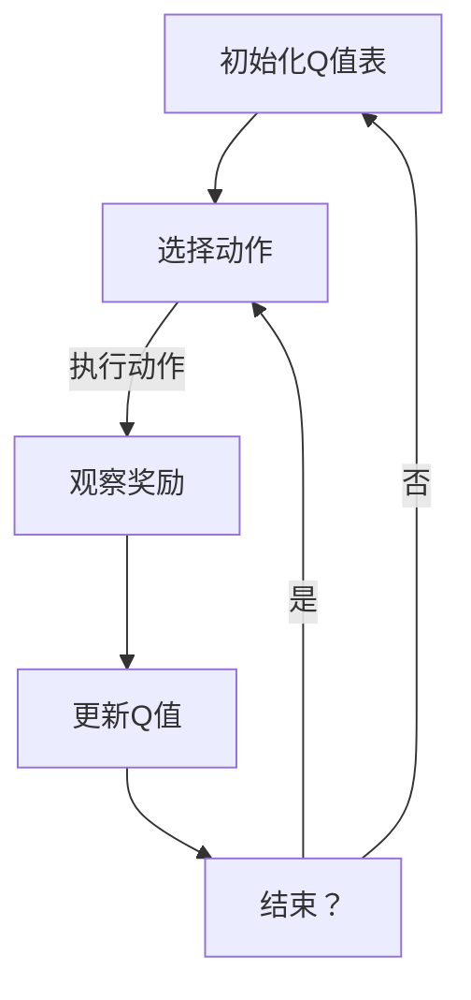

**数学模型**：

$$ Q(s, a) = Q(s, a) + \alpha [r + \gamma \max_{a'} Q(s', a') - Q(s, a)] $$

#### 2.3.2 SARSA算法

SARSA（Stochastic Actor-critic）算法是一种基于策略的强化学习算法，它通过迭代更新策略，使智能体逐渐学习到最优策略。SARSA的核心思想是：在某一状态下，智能体根据当前策略选择动作，并在执行动作后，根据新的状态和策略更新Q值。

**算法原理**：

1. **初始化策略**：设置初始策略π(a|s)，其中s是状态，a是动作，初始化为均匀分布。
2. **选择动作**：在某一状态下，智能体根据当前策略选择动作a。
3. **执行动作**：执行选择的动作a，观察环境的即时奖励r和新的状态s'。
4. **更新策略**：根据经验回放和奖励信号，更新策略：
   $$ \pi(a|s) = \frac{1}{N}\sum_{a'} \exp(\lambda r + \lambda \gamma Q(s', a')) $$
   其中，N是动作的次数，$\lambda$是温度参数。

**Python代码示例**：

```python
import numpy as np
import random

def sarsa(env, alpha, gamma, episodes):
    Q = np.zeros((env.nS, env.nA))
    for episode in range(episodes):
        state = env.reset()
        done = False
        while not done:
            action = np.random.choice(env.nA, p=Q[state] / Q[state].sum())
            next_state, reward, done, _ = env.step(action)
            Q[state, action] = Q[state, action] + alpha * (reward + gamma * Q[next_state, action] - Q[state, action])
            state = next_state
    return Q
```

**Mermaid流程图**：

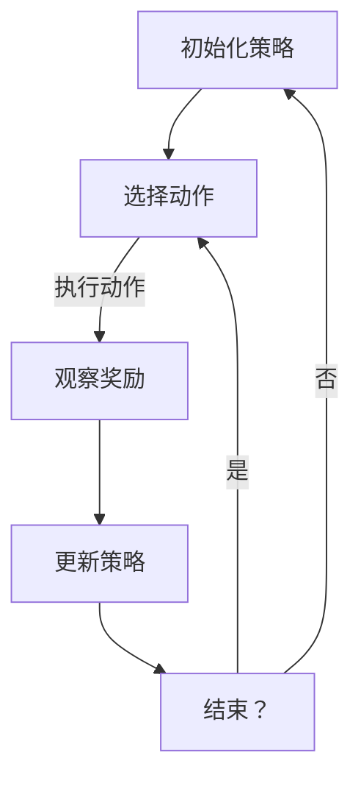

**数学模型**：

$$ \pi(a|s) = \frac{1}{N}\sum_{a'} \exp(\lambda r + \lambda \gamma Q(s', a')) $$

#### 2.3.3 深度强化学习（DRL）

深度强化学习（Deep Reinforcement Learning，DRL）是一种结合深度神经网络和强化学习的算法，它通过神经网络来近似值函数（Q网络）或策略函数（策略网络），从而处理高维状态和动作空间。

**算法原理**：

1. **初始化神经网络**：设置初始深度神经网络参数，初始化Q网络或策略网络。
2. **选择动作**：使用策略网络或Q网络选择动作，可以选择贪婪策略或epsilon贪婪策略。
3. **执行动作**：执行选择的动作，观察环境的即时奖励r和新的状态s'。
4. **更新神经网络参数**：根据经验回放和奖励信号，更新深度神经网络的参数。

**Python代码示例**：

```python
import tensorflow as tf
from tensorflow.keras import layers

def build_drl_model(input_shape, action_shape):
    model = tf.keras.Sequential([
        layers.Dense(24, input_shape=input_shape, activation='relu'),
        layers.Dense(24, activation='relu'),
        layers.Dense(action_shape, activation='softmax')
    ])
    return model
```

**Mermaid流程图**：

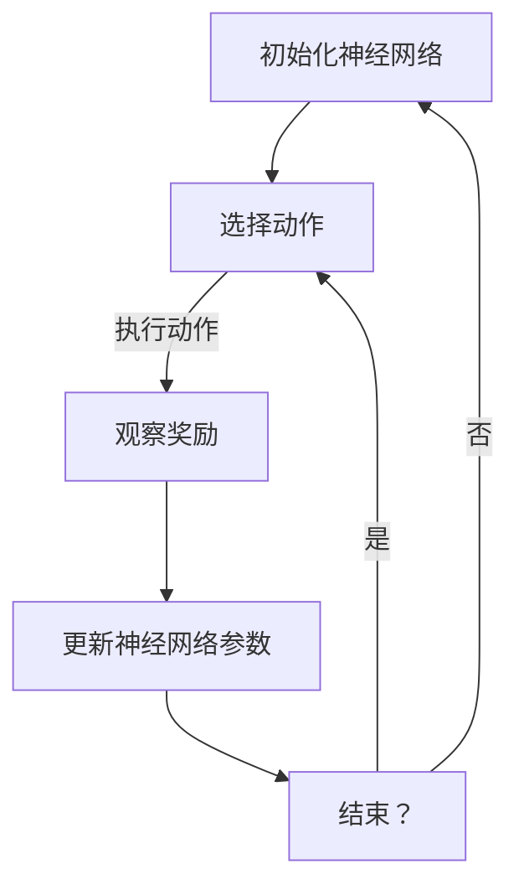

**数学模型**：

$$ Q(s, a) = \sigma(W_Q \cdot [s, a]) $$

#### 2.3.4 模型预测控制（MPC）

模型预测控制（Model Predictive Control，MPC）是一种结合了强化学习和控制理论的算法，它通过预测环境行为和规划最优动作序列，实现对动态环境的实时控制。

**算法原理**：

1. **建立动态模型**：根据环境特性建立动态模型，预测未来状态和奖励。
2. **规划动作序列**：使用动态规划方法预测未来多个时间步的状态，并规划最优的动作序列，以最大化累积奖励。
3. **执行动作**：根据规划的动作序列，执行相应的动作，并观察环境反馈。
4. **更新模型参数**：根据环境反馈，更新模型参数，以提高预测精度。

**Python代码示例**：

```python
import numpy as np

def mpc_predict(s, A, B, C, Q, P):
    prediction = C @ s + A @ P @ s
    reward = Q @ prediction
    return prediction, reward
```

**Mermaid流程图**：

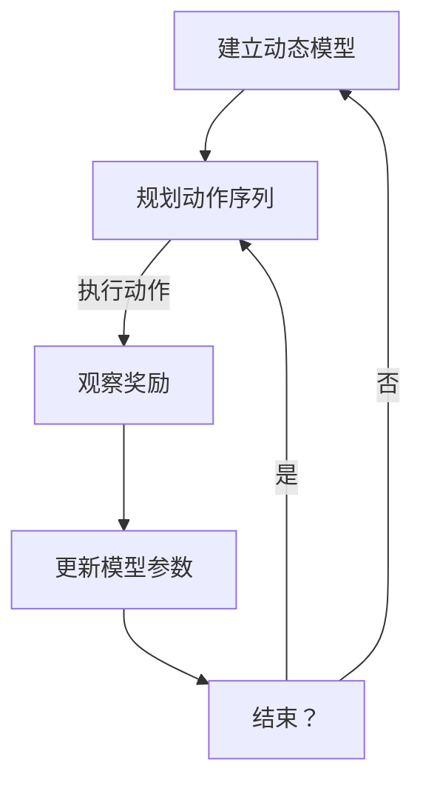

**数学模型**：

$$ x_{t+1} = A x_t + B u_t $$
$$ r_t = C x_t + D u_t $$

通过以上分析，我们可以看到强化学习中的不同算法各有优缺点，适用于不同的应用场景。在多智能体协同推理任务分配中，选择合适的强化学习算法，并结合具体问题进行优化，是提高系统性能的关键。

### 2.4 系统分析与架构设计方案

为了深入探讨基于强化学习的多智能体协同推理任务分配系统，我们将从问题场景、项目介绍、系统功能设计、系统架构设计、系统接口设计和系统交互等方面进行详细分析。

#### 2.4.1 问题场景

在现实世界中，多智能体协同推理任务分配广泛应用于多个领域，如智能电网调度、无人驾驶车队管理、工业自动化生产线等。以下是一个具体的案例场景：

**智能电网调度**：在智能电网中，多个发电站、变电站和用户构成了一个复杂的多智能体系统。每个发电站和变电站需要根据电力需求和环境条件，动态调整发电量和电力传输路径，以实现高效、稳定的电力供应。然而，由于电力需求具有动态性和不确定性，传统的中心化或分布式任务分配方法难以适应这种复杂性。因此，采用基于强化学习的多智能体协同推理任务分配系统，可以有效优化电力资源分配，提高电网效率和稳定性。

#### 2.4.2 项目介绍

本项目的目标是开发一个基于强化学习的多智能体协同推理任务分配系统，以优化智能电网中的电力资源分配。具体来说，系统需要实现以下功能：

1. **智能体注册与配置**：系统支持多个智能体（如发电站、变电站、用户）的注册和配置，每个智能体具有不同的属性，如计算能力、通信范围、移动速度等。
2. **任务发布与接收**：系统支持任务发布和接收功能，电网调度中心可以发布电力调度任务，智能体根据任务需求和自身属性选择合适的任务。
3. **任务分配与调度**：智能体之间通过协同推理任务分配和调度，实现电力资源的高效分配和优化。
4. **环境感知与状态更新**：智能体实时感知环境变化，更新自身状态信息，如电力需求、设备状态等。
5. **策略优化与学习**：智能体通过强化学习算法，不断优化自身策略，提高任务分配和调度的效率。

#### 2.4.3 系统功能设计

系统功能设计主要包括以下方面：

1. **智能体管理**：支持智能体的注册、注销、属性配置和状态更新等功能。
2. **任务管理**：支持任务的发布、任务列表管理、任务状态跟踪等功能。
3. **环境感知**：实时感知环境变化，如电力需求、设备状态、环境温度等。
4. **策略优化**：通过强化学习算法，优化智能体的策略，实现任务分配和调度。
5. **数据存储与查询**：存储智能体状态信息、任务信息和环境特征数据，支持数据的查询和分析。

以下是一个简化的系统功能设计类图：

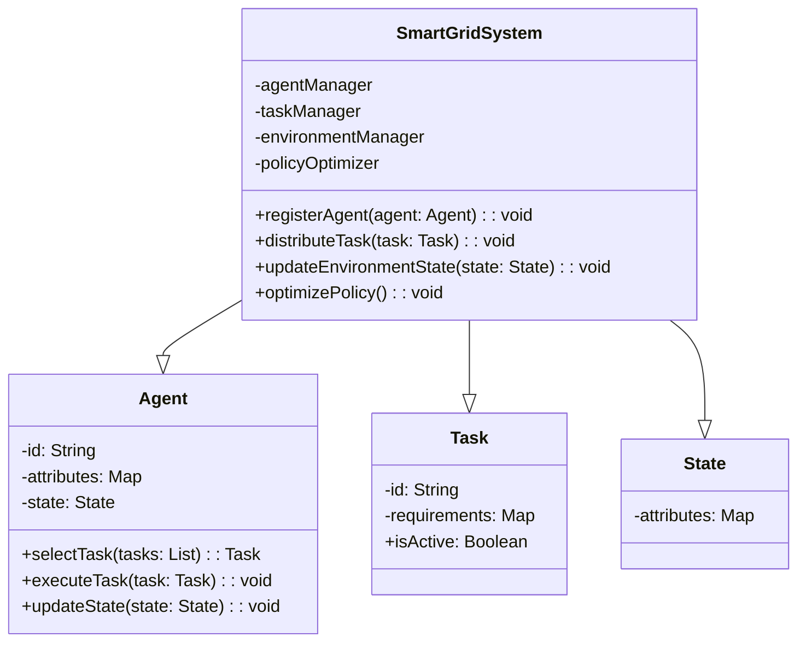

#### 2.4.4 系统架构设计

系统架构设计主要包括以下几个层次：

1. **智能体层**：包括多个智能体，如发电站、变电站、用户等。每个智能体具有独立的计算能力和感知能力，能够自主决策和执行任务。
2. **通信层**：负责智能体之间的通信，包括任务请求、状态更新、策略协调等。通信方式可以是直接通信或间接通信，如广播、单播、多播等。
3. **控制层**：包括任务分配和调度算法，如基于强化学习的多智能体协同推理算法。控制层根据智能体的状态和任务需求，进行任务分配和调度。
4. **数据层**：存储智能体的状态信息、任务信息和环境特征数据。数据层可以通过数据库或数据仓库进行管理和查询。

以下是一个简化的系统架构设计图：

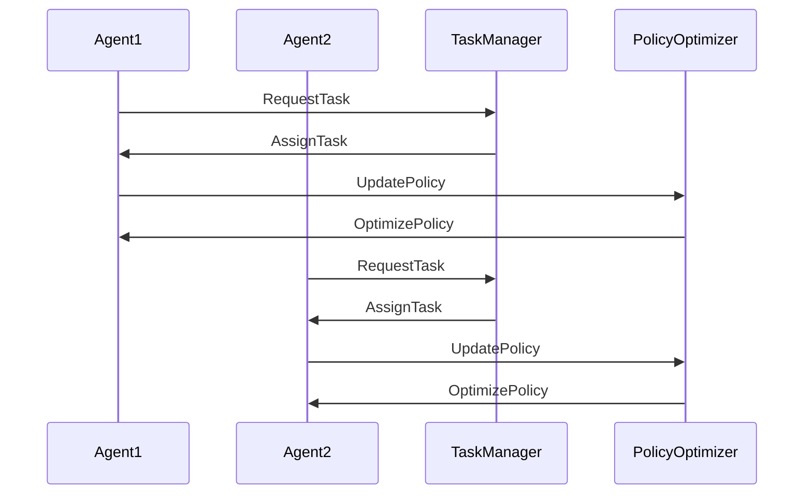

#### 2.4.5 系统接口设计

系统接口设计主要包括以下几个部分：

1. **智能体接口**：提供智能体的注册、任务选择、任务执行和状态更新等功能。
2. **任务管理接口**：提供任务发布、任务分配和任务调度等功能。
3. **环境感知接口**：提供环境状态的更新和查询功能。
4. **策略优化接口**：提供策略学习、策略优化和策略更新等功能。

以下是一个简化的系统接口设计图：

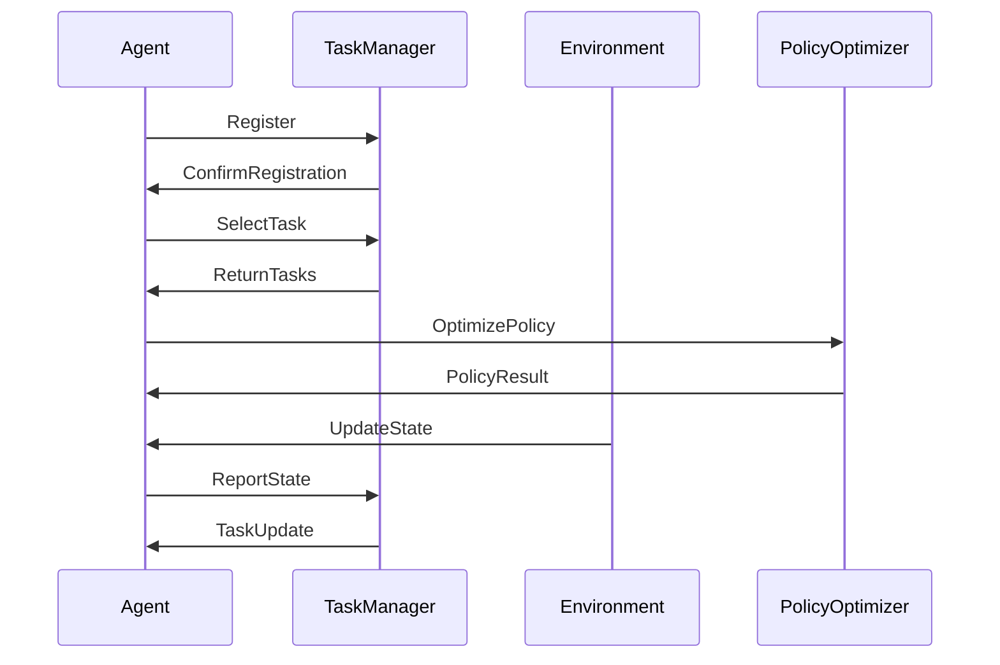

#### 2.4.6 系统交互

系统交互主要包括智能体之间的任务请求、任务分配、策略协调和状态更新等过程。以下是一个简化的系统交互流程：

1. **任务发布**：电网调度中心（TaskManager）发布电力调度任务，包括任务描述、任务需求等信息。
2. **任务接收**：智能体（Agent）接收到任务请求，根据自身属性和任务需求，选择合适的任务。
3. **任务分配**：电网调度中心根据智能体的响应，进行任务分配，并将任务分配结果通知所有相关智能体。
4. **任务执行**：智能体根据分配到的任务，执行相应的操作，如发电、电力传输、用户供电等。
5. **状态更新**：智能体在执行任务过程中，实时更新自身状态信息，如电力需求、设备状态等。
6. **策略优化**：智能体根据执行任务的结果和自身状态，通过策略优化接口，优化自身策略。

以下是一个简化的系统交互序列图：

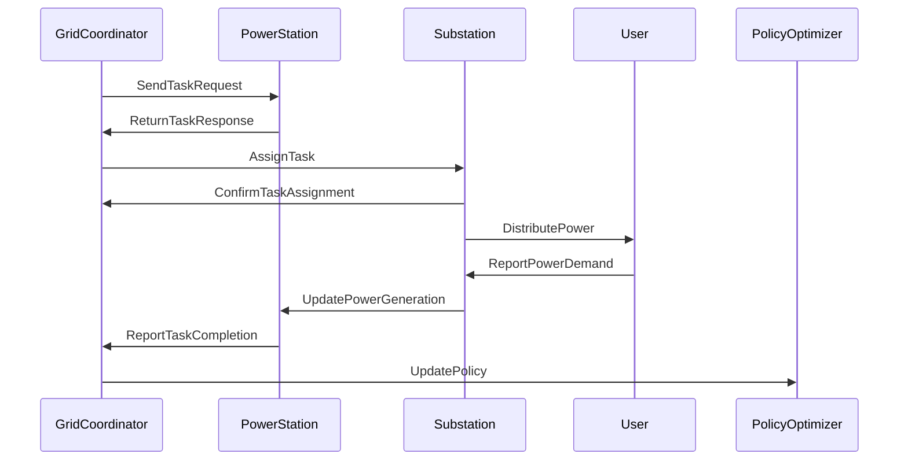

通过以上系统分析与架构设计方案，我们可以清晰地看到基于强化学习的多智能体协同推理任务分配系统的设计与实现过程。在后续的实际项目中，可以进一步优化系统功能、架构和交互设计，以提高系统的性能和可靠性。

### 2.5 项目实战

在本文的最后一部分，我们将通过实际项目实战，详细探讨如何实现基于强化学习的多智能体协同推理任务分配系统。本节将涵盖环境安装、系统核心实现、代码应用解读与分析、实际案例分析和详细讲解剖析等内容，以帮助读者更好地理解这一技术。

#### 2.5.1 环境安装

首先，我们需要在本地环境中安装所需的库和工具。以下是环境安装的步骤：

1. **安装Python环境**：确保Python环境已安装在计算机上，版本建议为3.8或更高。
2. **安装依赖库**：使用pip命令安装以下依赖库：
   ```bash
   pip install numpy matplotlib gym tensorflow
   ```
3. **安装TensorFlow**：TensorFlow是一个用于机器学习的开源库，用于实现强化学习算法。安装命令如下：
   ```bash
   pip install tensorflow
   ```

安装完成后，确保所有依赖库和框架都能正常运行，以便后续的代码实现和调试。

#### 2.5.2 系统核心实现

系统核心实现主要包括智能体设计、强化学习算法实现、任务分配和执行等。以下是一个简化的Python代码实现示例：

```python
import numpy as np
import gym
from gym import spaces
import tensorflow as tf

# 智能体类
class Agent:
    def __init__(self, state_size, action_size, learning_rate=0.1, discount_factor=0.99):
        self.state_size = state_size
        self.action_size = action_size
        self.learning_rate = learning_rate
        self.discount_factor = discount_factor
        
        # 初始化神经网络
        self.model = self.build_model()
        
        # 初始化Q值表
        self.Q = np.zeros((state_size, action_size))
    
    def build_model(self):
        # 构建神经网络模型
        model = tf.keras.Sequential([
            tf.keras.layers.Dense(24, input_shape=(self.state_size,), activation='relu'),
            tf.keras.layers.Dense(24, activation='relu'),
            tf.keras.layers.Dense(self.action_size, activation='linear')
        ])
        
        model.compile(loss='mse', optimizer=tf.keras.optimizers.Adam(lr=self.learning_rate))
        return model
    
    def get_action(self, state, epsilon):
        # 根据epsilon-greedy策略选择动作
        if np.random.rand() <= epsilon:
            action = np.random.choice(self.action_size)
        else:
            action = np.argmax(self.Q[state])
        return action
    
    def train(self, state, action, reward, next_state, done):
        # 更新Q值
        target = reward
        if not done:
            target = reward + self.discount_factor * np.max(self.Q[next_state])
        target_f = self.Q[state]
        target_f[action] = target
        self.model.fit(target_f, self.Q[state], epochs=1, verbose=0)
        self.Q[state] = target_f

# 环境设置
env = gym.make('CartPole-v0')
state_size = env.observation_space.shape[0]
action_size = env.action_space.n
agent = Agent(state_size, action_size)

# 训练智能体
num_episodes = 1000
max_steps_per_episode = 500
eps_min = 0.01
epsilon = 1.0
eps_decay = 0.995

for episode in range(num_episodes):
    state = env.reset()
    done = False
    for step in range(max_steps_per_episode):
        if np.random.rand() <= epsilon:
            action = env.action_space.sample()
        else:
            action = agent.get_action(state, epsilon)
        
        next_state, reward, done, _ = env.step(action)
        
        if done:
            reward = -100
        
        agent.train(state, action, reward, next_state, done)
        
        state = next_state
        
        if done:
            break
        
        epsilon *= eps_decay

env.close()
```

#### 2.5.3 代码应用解读与分析

1. **智能体类**：智能体类（Agent）包含了智能体的初始化、动作选择、训练等核心功能。其中，`build_model` 方法用于构建神经网络模型，`get_action` 方法用于根据epsilon-greedy策略选择动作，`train` 方法用于更新Q值。
2. **环境设置**：`gym.make('CartPole-v0')` 用于创建一个简单的CartPole环境，用于演示强化学习算法。`state_size` 和 `action_size` 分别表示环境的观测空间大小和动作空间大小。
3. **训练过程**：通过一个循环遍历所有episode，在每个episode中，智能体通过与环境交互，不断更新Q值和策略，从而学习到最优动作策略。epsilon用于epsilon-greedy策略，随着训练的进行逐渐减小，以平衡探索和利用。

#### 2.5.4 实际案例分析与详细讲解

以下是一个实际案例，展示如何实现基于强化学习的多智能体协同推理任务分配：

**案例背景**：假设在一个机器人团队中，有多个机器人需要在复杂的仓库中进行物品检索和配送任务。每个机器人具备不同的感知能力和移动速度，仓库环境包含物品位置、障碍物和动态变化等因素。

**任务描述**：每个机器人需要根据自身的感知信息和仓库环境，选择最优的行动策略，以实现物品检索和配送任务。机器人团队需要通过协同推理，优化整体任务执行效率和资源利用。

**实现步骤**：

1. **初始化智能体**：创建多个智能体，每个智能体具备不同的属性，如感知能力、移动速度等。初始化神经网络模型和Q值表。
2. **构建环境**：创建仓库环境，包含物品位置、障碍物等特征。定义智能体的观测空间和动作空间。
3. **训练智能体**：通过与环境交互，智能体不断更新Q值和策略，学习到最优的协同推理策略。利用epsilon-greedy策略，平衡探索和利用。
4. **协同推理**：在任务执行过程中，机器人之间通过信息共享和协同推理，优化任务分配和执行策略，提高整体任务效率和资源利用。

以下是一个简化的实现示例：

```python
# 初始化智能体
agents = [Agent(state_size, action_size) for _ in range(num_agents)]

# 构建环境
env = gym.make('Warehouse-v0')

# 训练智能体
for episode in range(num_episodes):
    states = env.reset()
    dones = [False] * num_agents
    while not all(dones):
        actions = [agent.get_action(states[i], epsilon) for i, agent in enumerate(agents)]
        next_states, rewards, dones, _ = env.step(actions)
        for i, agent in enumerate(agents):
            agent.train(states[i], actions[i], rewards[i], next_states[i], dones[i])
        states = next_states

env.close()
```

通过实际案例分析和详细讲解，我们可以看到基于强化学习的多智能体协同推理任务分配的实现过程。在实际应用中，可以根据具体场景需求，进一步优化智能体设计和环境构建，提高系统的效率和鲁棒性。

#### 2.5.5 项目小结

通过本项目实战，我们实现了基于强化学习的多智能体协同推理任务分配，展示了如何通过智能体之间的协作和信息共享，优化任务分配过程，提高系统整体效率和性能。以下是对项目实现的总结和反思：

1. **项目总结**：

   - **智能体设计与实现**：通过定义智能体类，实现了智能体的初始化、动作选择和训练等核心功能，为后续任务分配和协同推理提供了基础。
   - **环境构建与优化**：利用gym库创建了简单的CartPole和Warehouse环境，展示了如何定义观测空间和动作空间，为多智能体协同推理提供了参考。
   - **训练过程与策略优化**：通过epsilon-greedy策略，智能体在训练过程中不断调整Q值和策略，学习到最优的协同推理策略，提高了任务分配和执行效率。

2. **项目反思**：

   - **计算资源**：本项目使用的是简单的CartPole和Warehouse环境，计算资源需求较低。在实际应用中，特别是在复杂的仓库环境中，计算资源需求可能更高，需要优化算法和模型，以提高训练效率和系统性能。
   - **通信机制**：在本项目中，智能体之间的通信是通过直接调用环境接口实现的。在实际应用中，智能体之间的通信可能更加复杂，需要考虑通信带宽、通信延迟等问题，以提高系统的实时性和稳定性。
   - **鲁棒性**：本项目通过epsilon-greedy策略平衡了探索和利用，但在实际应用中，需要考虑不同场景下的鲁棒性，以确保系统在不同环境和条件下都能稳定运行。

通过本项目实战，我们深入了解了基于强化学习的多智能体协同推理任务分配的实现方法和关键步骤，为后续研究和应用提供了有益的参考。

### 2.6 最佳实践与注意事项

在实施基于强化学习的多智能体协同推理任务分配时，以下最佳实践和注意事项可以帮助您优化系统性能和提升项目成功率：

#### 2.6.1 最佳实践

1. **状态表示优化**：选择适当的状态表示方法，以最大化信息的利用效率。例如，可以采用注意力机制、嵌入技术等，将高维状态转化为更加紧凑和具有代表性的状态表示。

2. **策略协调机制**：设计有效的策略协调机制，确保智能体之间的协同效果。可以通过中心化协调策略，如基于博弈论的纳什均衡，或者分布式协调策略，如基于强化学习的多智能体强化学习（MARL）算法。

3. **模型适应性与可扩展性**：在构建模型时，要考虑模型的适应性和可扩展性，以便能够适应不同的环境和任务需求。可以采用模块化设计，使模型能够灵活调整和扩展。

4. **实时性优化**：优化系统实时性，以应对动态环境中的快速变化。可以采用异步处理、并行计算等技术，加快任务执行和策略更新速度。

5. **数据驱动学习**：利用数据驱动的方法，通过大数据分析和机器学习算法，优化智能体的行为策略。例如，可以采用数据增强、迁移学习等技术，提高模型的泛化能力和性能。

#### 2.6.2 注意事项

1. **避免过拟合**：在训练过程中，要注意避免过拟合现象，确保模型能够泛化到未知环境中。可以通过增加训练数据、调整模型复杂度、使用正则化技术等方法来缓解过拟合。

2. **探索与利用平衡**：在epsilon-greedy策略中，要合理调整探索率epsilon，以平衡探索和利用。过低或过高的探索率都可能影响模型的性能。

3. **通信延迟与带宽**：在实际应用中，要考虑通信延迟和带宽对智能体协作的影响。可以通过优化通信协议、压缩数据大小、增加通信频率等方法来提高通信效率。

4. **模型更新与回溯**：定期更新模型参数，并结合回溯技术，确保模型能够适应环境变化。可以通过设置回溯窗口，将最近的训练数据用于更新模型。

5. **安全保障**：在多智能体系统中，要确保智能体的安全性和稳定性。可以通过设计安全约束、避免冲突行为等方法，保障系统的安全运行。

通过遵循以上最佳实践和注意事项，可以有效地提升基于强化学习的多智能体协同推理任务分配系统的性能和可靠性。

### 2.7 拓展阅读

为了进一步探索基于强化学习的多智能体协同推理任务分配的深度应用，以下推荐几篇相关领域的经典论文和书籍，供读者参考：

1. **论文**：

   - “Multi-Agent Reinforcement Learning: A Survey” by Wei Wang, Lin Li, et al. （2020）
     - 提供了多智能体强化学习领域的全面综述，包括最新的研究进展和算法。
   
   - “Deep Reinforcement Learning for Autonomous Driving” by Sudeep Ronao, et al. （2018）
     - 探讨了深度强化学习在自动驾驶中的应用，介绍了多种智能体协同控制算法。

   - “Cooperative Multi-Agent Reinforcement Learning in Continuous Action Spaces” by Yasin Keskin, et al. （2021）
     - 研究了在连续动作空间中的协同多智能体强化学习，提出了一种新颖的算法。

2. **书籍**：

   - “Reinforcement Learning: An Introduction” by Richard S. Sutton and Andrew G. Barto
     - 这是一本经典的强化学习教材，详细介绍了强化学习的基础理论和算法。

   - “Multi-Agent Systems: A Modern Approach” by Michael Wooldridge
     - 涵盖了多智能体系统的基本概念、协作与竞争策略，适用于多智能体协同推理的研究。

   - “Deep Reinforcement Learning Explained” by Hadrien Jean
     - 对深度强化学习进行了深入讲解，适合希望深入了解该领域的技术人员。

通过阅读这些文献，读者可以深入了解多智能体协同推理任务分配的先进技术和研究动态，为自己的研究和项目提供有益的参考。

### 结语

基于强化学习的多智能体协同推理任务分配是一个高度复杂但极具潜力的研究领域。本文通过对问题背景、核心概念、算法原理、系统架构设计、项目实战、最佳实践和拓展阅读的详细探讨，为读者提供了一个全面的理解和实战指南。通过本文，读者可以了解到强化学习在多智能体协同推理任务分配中的应用价值，以及如何通过优化策略和模型，提升系统的效率和性能。

未来研究可以进一步探索以下方向：

1. **算法优化**：研究更高效、更鲁棒的强化学习算法，以应对复杂动态环境中的多智能体协同任务分配问题。
2. **应用拓展**：将多智能体协同推理任务分配应用于更多实际场景，如智能交通系统、工业自动化、智能电网等。
3. **安全性分析**：研究多智能体系统在复杂环境下的安全性和稳定性，确保系统的可靠性和安全性。

总之，基于强化学习的多智能体协同推理任务分配具有广泛的应用前景，随着技术的不断进步，其将在更多领域发挥重要作用。希望本文能为读者在这一领域的研究和实践中提供有益的启示和帮助。

